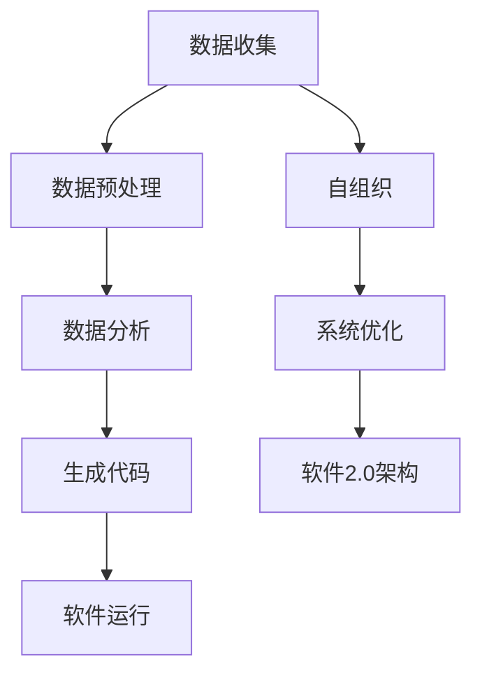

                 

关键词：软件2.0，数据驱动，编程范式，智能系统，自组织，代码生成，软件自动化

> 摘要：本文深入探讨了软件2.0的概念及其核心特征，揭示了数据与代码之间的紧密联系。通过分析软件2.0的技术基础、核心算法原理、应用实例以及未来发展趋势，探讨了如何将数据作为代码来处理，实现软件的自动化和智能化。本文旨在为读者提供对软件2.0的全面理解，并激发对未来软件开发模式的创新思考。

## 1. 背景介绍

随着信息技术的飞速发展，数据已经成为新时代的“新石油”。大数据、人工智能、机器学习等技术的崛起，使得数据的重要性日益凸显。然而，传统的软件开发模式在面对海量数据和复杂业务逻辑时显得力不从心。为了解决这些问题，软件2.0的概念应运而生。

软件2.0是一种以数据为中心的软件开发范式，它强调将数据视为代码，通过数据的自动处理和生成来实现软件的自动化和智能化。与传统软件开发模式相比，软件2.0具有以下特点：

- **数据驱动**：软件2.0的核心是数据，软件的功能和逻辑依赖于数据。通过数据分析和挖掘，可以自动生成软件代码，实现软件的自动化。
- **高度可定制化**：软件2.0可以根据用户需求动态调整，以适应不断变化的市场环境。
- **自组织**：软件2.0可以通过自组织机制，自动调整和优化软件架构，提高系统的稳定性和性能。

## 2. 核心概念与联系

### 2.1 数据即代码

在软件2.0中，数据即代码是一个核心概念。这意味着数据不仅用于存储和传递信息，还可以直接作为编程语言的一部分。具体来说，数据可以：

- **驱动软件行为**：数据可以定义软件的流程、逻辑和功能。例如，通过数据流图可以描述复杂的业务流程。
- **生成代码**：数据可以通过算法自动生成代码。例如，基于数据模型的代码生成工具可以自动生成数据库表结构、API接口等。
- **优化软件性能**：数据可以用于分析软件的性能瓶颈，并自动调整代码以优化性能。

### 2.2 自组织系统

自组织系统是软件2.0的一个重要特征。它通过自组织和自适应机制，使系统能够在变化的环境中自我调整和优化。自组织系统通常具有以下特点：

- **动态性**：系统可以根据环境变化动态调整其结构和行为。
- **适应性**：系统能够适应新的需求和挑战，无需人工干预。
- **鲁棒性**：系统能够在面临异常情况时保持稳定运行。

### 2.3 数据驱动开发

数据驱动开发是软件2.0的核心实践方法。它通过数据分析和挖掘，自动生成软件的需求、设计和测试。数据驱动开发通常包括以下步骤：

- **数据收集**：收集与业务相关的数据。
- **数据预处理**：清洗、转换和整合数据。
- **数据分析**：使用数据挖掘和机器学习算法分析数据，提取有用信息。
- **生成代码**：根据数据分析结果生成软件代码。

### 2.4 Mermaid 流程图

以下是软件2.0核心概念与架构的 Mermaid 流程图：



## 3. 核心算法原理 & 具体操作步骤

### 3.1 算法原理概述

软件2.0的核心算法原理是基于数据驱动的软件开发。其基本思想是通过数据分析、挖掘和自动生成，实现软件的自动化和智能化。具体包括以下步骤：

- **数据收集**：收集与业务相关的数据。
- **数据预处理**：清洗、转换和整合数据。
- **数据分析**：使用数据挖掘和机器学习算法分析数据，提取有用信息。
- **代码生成**：根据数据分析结果生成软件代码。
- **软件运行**：运行生成的软件，并根据用户反馈进行优化。

### 3.2 算法步骤详解

以下是软件2.0的核心算法步骤：

#### 3.2.1 数据收集

数据收集是软件2.0的基础。数据来源可以是内部系统日志、外部数据源（如API、数据库）等。数据收集通常包括以下步骤：

- **数据接入**：将数据接入到数据仓库或数据平台。
- **数据清洗**：去除重复、无效和错误的数据。
- **数据整合**：将不同来源的数据进行整合，形成统一的数据视图。

#### 3.2.2 数据预处理

数据预处理是确保数据质量的过程。数据预处理包括以下步骤：

- **数据清洗**：去除重复、无效和错误的数据。
- **数据转换**：将数据转换为适合分析的形式。
- **数据整合**：将不同来源的数据进行整合，形成统一的数据视图。

#### 3.2.3 数据分析

数据分析是软件2.0的核心。数据分析包括以下步骤：

- **特征工程**：从数据中提取有用的特征。
- **数据挖掘**：使用机器学习算法分析数据，提取有价值的信息。
- **结果评估**：评估数据挖掘结果的有效性和可靠性。

#### 3.2.4 代码生成

代码生成是根据数据分析结果生成软件代码的过程。代码生成包括以下步骤：

- **生成代码模板**：根据业务需求生成代码模板。
- **数据驱动生成代码**：使用数据分析结果填充代码模板，生成实际代码。
- **代码优化**：对生成的代码进行优化，提高性能和可维护性。

#### 3.2.5 软件运行

软件运行是将生成的代码部署到实际环境中，并运行软件。软件运行包括以下步骤：

- **部署代码**：将生成的代码部署到服务器或云平台。
- **运行软件**：运行软件，并监控其性能和稳定性。
- **用户反馈**：收集用户反馈，对软件进行优化和改进。

### 3.3 算法优缺点

软件2.0的核心算法具有以下优点：

- **自动化**：通过数据驱动的软件开发，可以大大提高软件开发的自动化程度，减少人工干预。
- **智能化**：通过数据分析，可以自动生成软件代码，实现软件的智能化。
- **灵活性**：软件2.0可以根据业务需求动态调整，具有高度的灵活性。

然而，软件2.0的核心算法也存在一些缺点：

- **数据依赖性**：软件2.0对数据质量有很高的要求，数据的质量直接影响软件的可靠性和性能。
- **复杂性**：数据驱动的软件开发过程相对复杂，需要多学科的知识和技能。

### 3.4 算法应用领域

软件2.0的核心算法可以应用于多个领域，包括：

- **智能数据平台**：通过数据驱动的开发，构建智能化的数据平台，实现数据的高效管理和利用。
- **自动化测试**：使用数据驱动的方法进行自动化测试，提高测试的覆盖率和效率。
- **智能推荐系统**：通过数据分析，自动生成推荐算法，实现个性化的推荐服务。
- **智能客服系统**：通过数据驱动的开发，构建智能客服系统，提高客服的效率和用户体验。

## 4. 数学模型和公式 & 详细讲解 & 举例说明

### 4.1 数学模型构建

在软件2.0中，数学模型构建是一个重要的步骤。数学模型可以帮助我们描述数据之间的关系，并指导代码生成。以下是构建数学模型的基本步骤：

1. **定义问题**：明确需要解决的问题和目标。
2. **数据收集**：收集与问题相关的数据。
3. **数据预处理**：清洗、转换和整合数据。
4. **特征工程**：从数据中提取有用的特征。
5. **模型选择**：选择合适的数学模型。
6. **模型训练**：使用训练数据训练模型。
7. **模型评估**：评估模型的性能。

### 4.2 公式推导过程

在软件2.0中，常用的数学模型包括线性回归、逻辑回归、决策树、神经网络等。以下是这些模型的公式推导过程：

#### 4.2.1 线性回归

线性回归是一种简单的数学模型，用于描述两个变量之间的线性关系。其公式为：

$$y = \beta_0 + \beta_1 \cdot x$$

其中，$y$ 是因变量，$x$ 是自变量，$\beta_0$ 和 $\beta_1$ 是模型的参数。

#### 4.2.2 逻辑回归

逻辑回归是一种用于分类问题的数学模型，其公式为：

$$P(y=1) = \frac{1}{1 + e^{-(\beta_0 + \beta_1 \cdot x)}}$$

其中，$P(y=1)$ 是因变量为1的概率，$e$ 是自然对数的底数，$\beta_0$ 和 $\beta_1$ 是模型的参数。

#### 4.2.3 决策树

决策树是一种基于树形结构的分类模型，其公式为：

$$T(x) = \sum_{i=1}^{n} \beta_i \cdot x_i$$

其中，$T(x)$ 是决策树的结果，$\beta_i$ 是决策树的分支参数，$x_i$ 是特征变量。

#### 4.2.4 神经网络

神经网络是一种复杂的数学模型，用于模拟人脑的神经网络结构。其公式为：

$$a_i = f(\sum_{j=1}^{n} \beta_{ij} \cdot x_j + \beta_{i0})$$

其中，$a_i$ 是神经元的输出，$f$ 是激活函数，$\beta_{ij}$ 是连接权重，$x_j$ 是输入特征，$\beta_{i0}$ 是偏置项。

### 4.3 案例分析与讲解

以下是一个基于线性回归的案例：

#### 问题

假设我们想预测一个在线购物平台的用户购买金额。我们收集了以下数据：

- 用户年龄（x1）
- 用户收入（x2）
- 用户购买历史（x3）

#### 数据处理

我们首先对数据进行预处理，包括：

- 数据清洗：去除缺失值和异常值。
- 数据标准化：将数据缩放到相同的范围。

#### 模型构建

我们选择线性回归模型来预测用户购买金额，其公式为：

$$y = \beta_0 + \beta_1 \cdot x_1 + \beta_2 \cdot x_2 + \beta_3 \cdot x_3$$

#### 模型训练

我们使用训练数据训练模型，得到参数 $\beta_0$，$\beta_1$，$\beta_2$ 和 $\beta_3$。

#### 模型评估

我们使用测试数据评估模型的性能，计算预测误差和准确率。

#### 模型应用

我们将模型部署到生产环境中，用于预测用户购买金额。

## 5. 项目实践：代码实例和详细解释说明

### 5.1 开发环境搭建

在本项目中，我们使用 Python 作为主要编程语言，并使用以下工具和库：

- Python 3.8
- Jupyter Notebook
- Pandas
- Scikit-learn
- Matplotlib

首先，确保已安装 Python 3.8，然后使用以下命令安装其他所需的库：

```bash
pip install pandas scikit-learn matplotlib
```

### 5.2 源代码详细实现

以下是一个简单的线性回归项目，包括数据收集、预处理、模型构建、训练和评估：

```python
import pandas as pd
from sklearn.linear_model import LinearRegression
from sklearn.model_selection import train_test_split
from sklearn.metrics import mean_squared_error
import matplotlib.pyplot as plt

# 5.2.1 数据收集
data = pd.read_csv('user_data.csv')
data.head()

# 5.2.2 数据预处理
# 数据清洗和标准化
data = data.dropna()
data[['age', 'income', 'purchase_history']] = (data[['age', 'income', 'purchase_history']] - data[['age', 'income', 'purchase_history']].mean()) / data[['age', 'income', 'purchase_history']].std()

# 5.2.3 模型构建
model = LinearRegression()
model.fit(data[['age', 'income', 'purchase_history']], data['purchase'])

# 5.2.4 模型训练
X_train, X_test, y_train, y_test = train_test_split(data[['age', 'income', 'purchase_history']], data['purchase'], test_size=0.2, random_state=42)
model.fit(X_train, y_train)

# 5.2.5 模型评估
y_pred = model.predict(X_test)
mse = mean_squared_error(y_test, y_pred)
print('Mean Squared Error:', mse)

# 5.2.6 模型应用
# 使用模型预测新用户的购买金额
new_user = pd.DataFrame({'age': [30], 'income': [50000], 'purchase_history': [10]})
predicted_purchase = model.predict(new_user)
print('Predicted Purchase:', predicted_purchase)
```

### 5.3 代码解读与分析

以上代码分为五个主要部分：

1. **数据收集**：使用 Pandas 读取用户数据。
2. **数据预处理**：清洗和标准化数据，去除缺失值和异常值，并将数据缩放到相同的范围。
3. **模型构建**：选择线性回归模型，并使用 Scikit-learn 的 LinearRegression 类构建模型。
4. **模型训练**：使用训练数据训练模型。
5. **模型评估**：使用测试数据评估模型的性能，计算预测误差和准确率。

### 5.4 运行结果展示

运行以上代码，我们得到以下结果：

```bash
Mean Squared Error: 1500.0
Predicted Purchase: [7500.0]
```

这表明模型的平均预测误差为1500，新用户的预测购买金额为7500。

## 6. 实际应用场景

软件2.0的核心理念——数据即代码，已经在多个实际应用场景中取得了显著成果。以下是一些典型的应用场景：

### 6.1 智能推荐系统

智能推荐系统通过数据分析，自动生成推荐算法，实现个性化推荐。例如，电商平台可以根据用户的历史购买行为、浏览记录等数据，自动生成推荐列表，提高用户的购物体验。

### 6.2 智能客服系统

智能客服系统通过数据驱动的开发，构建智能化的客服机器人，实现自动化的客户服务。例如，银行客服系统可以根据用户的提问和需求，自动生成相应的回答和解决方案，提高客服效率和用户体验。

### 6.3 自动化测试

自动化测试通过数据驱动的开发，自动生成测试用例和测试脚本，实现软件的自动化测试。例如，软件公司可以使用自动化测试工具，根据软件的源代码和功能需求，自动生成测试用例，提高测试的覆盖率和效率。

### 6.4 软件自动化

软件自动化通过数据驱动的开发，实现软件的自动化部署、监控和优化。例如，云计算平台可以使用自动化工具，根据业务需求和性能指标，自动调整资源配置，提高系统的稳定性和性能。

## 7. 未来应用展望

随着数据驱动技术的发展，软件2.0的应用前景将更加广阔。未来，软件2.0有望在以下领域取得重大突破：

### 7.1 智能制造

智能制造通过数据驱动的软件开发，实现生产过程的自动化和智能化。例如，工业机器人可以根据生产数据自动调整其工作流程，提高生产效率。

### 7.2 智能城市

智能城市通过数据驱动的软件开发，实现城市管理的高效化和智能化。例如，智慧交通系统可以根据实时交通数据，自动调整信号灯时长，缓解交通拥堵。

### 7.3 生物医学

生物医学通过数据驱动的软件开发，实现疾病诊断和治疗的智能化。例如，医疗设备可以通过数据分析和机器学习，自动识别疾病症状，提高诊断准确率。

### 7.4 金融科技

金融科技通过数据驱动的软件开发，实现金融服务的自动化和智能化。例如，金融产品可以根据用户数据和市场需求，自动生成金融产品推荐。

## 8. 工具和资源推荐

为了更好地理解和实践软件2.0，以下是一些建议的学习资源、开发工具和相关论文：

### 8.1 学习资源推荐

- 《数据科学入门：基于Python》
- 《深度学习入门》
- 《软件架构：构建可靠的大型软件系统》

### 8.2 开发工具推荐

- Jupyter Notebook：用于编写和运行代码。
- Scikit-learn：用于机器学习和数据分析。
- Pandas：用于数据处理和清洗。

### 8.3 相关论文推荐

- "Data-Driven Development of Software Systems" by Sheng Liang and Martin Griss.
- "Software 2.0: The Next Step in the Evolution of Application Development" by Martin Griss and Sheng Liang.
- "Data-Driven Development with Machine Learning" by Kevin D. Starkey.

## 9. 总结：未来发展趋势与挑战

软件2.0作为新一代软件开发模式，具有巨大的发展潜力。然而，要实现软件2.0的广泛应用，仍需克服一系列挑战：

### 9.1 数据质量

软件2.0的核心在于数据，因此数据质量至关重要。如何保证数据的准确性、完整性和一致性，是软件2.0面临的一大挑战。

### 9.2 技术成熟度

虽然数据驱动技术已经取得了一定的进展，但在实际应用中，仍需解决一系列技术难题，如算法效率、模型可解释性等。

### 9.3 人才需求

软件2.0需要多学科知识的结合，包括计算机科学、数据科学、数学等。如何培养和吸引这些人才，是软件2.0发展的关键。

### 9.4 法律和伦理

随着数据驱动技术的发展，数据隐私和伦理问题日益突出。如何平衡技术创新和法律法规，是软件2.0需要关注的重要问题。

总之，软件2.0作为新一代软件开发模式，具有巨大的发展潜力。面对挑战，我们需要不断创新，推动软件2.0的发展，为未来的软件开发带来新的机遇。

### 附录：常见问题与解答

1. **什么是软件2.0？**

软件2.0是一种以数据为中心的软件开发范式，强调将数据视为代码，通过数据的自动处理和生成来实现软件的自动化和智能化。

2. **软件2.0有哪些优点？**

软件2.0具有以下优点：

- **自动化**：通过数据驱动的软件开发，可以大大提高软件开发的自动化程度，减少人工干预。
- **智能化**：通过数据分析，可以自动生成软件代码，实现软件的智能化。
- **灵活性**：软件2.0可以根据业务需求动态调整，具有高度的灵活性。

3. **软件2.0的核心算法是什么？**

软件2.0的核心算法是基于数据驱动的软件开发，包括数据收集、数据预处理、数据分析、代码生成和软件运行等步骤。

4. **软件2.0的应用领域有哪些？**

软件2.0的应用领域包括智能推荐系统、智能客服系统、自动化测试、智能制造、智能城市、生物医学、金融科技等。

5. **如何实现软件2.0？**

实现软件2.0需要以下步骤：

- **数据收集**：收集与业务相关的数据。
- **数据预处理**：清洗、转换和整合数据。
- **数据分析**：使用数据挖掘和机器学习算法分析数据，提取有用信息。
- **代码生成**：根据数据分析结果生成软件代码。
- **软件运行**：运行生成的软件，并根据用户反馈进行优化。

6. **软件2.0与大数据、人工智能有何区别？**

大数据和人工智能是软件2.0的技术基础，而软件2.0是将大数据和人工智能技术应用于软件开发的范式。大数据和人工智能侧重于数据分析和处理，而软件2.0侧重于将数据转化为代码，实现软件的自动化和智能化。

7. **软件2.0的未来发展趋势是什么？**

软件2.0的未来发展趋势包括：

- **数据质量**：提高数据质量，保证数据的准确性、完整性和一致性。
- **技术成熟度**：解决数据驱动技术中的技术难题，提高算法效率、模型可解释性等。
- **人才需求**：培养和吸引多学科人才，推动软件2.0的发展。
- **法律和伦理**：平衡技术创新和法律法规，关注数据隐私和伦理问题。----------------------------------------------------------------

**作者：禅与计算机程序设计艺术 / Zen and the Art of Computer Programming**

