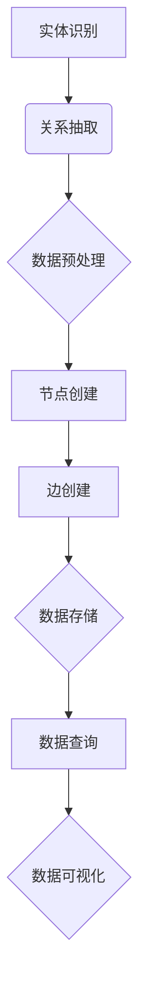

                 

关键词：数据图谱，知识管理，软件2.0，知识图谱技术，图数据库，知识抽取，数据可视化

## 摘要

本文深入探讨了数据图谱作为软件2.0时代知识管理的核心工具的重要性。首先，我们将回顾数据图谱的定义及其在知识管理中的关键角色。接着，文章将详细分析数据图谱的核心概念与架构，使用Mermaid流程图来直观地展示其工作原理。随后，我们将深入探讨数据图谱的核心算法原理，并提供具体的操作步骤。文章还将包含数学模型和公式的详细讲解，并通过实例说明其在实际应用中的价值。最后，我们将展望数据图谱的未来应用场景，并总结其发展趋势与面临的挑战。

## 1. 背景介绍

随着互联网的飞速发展和大数据技术的不断成熟，数据的规模和种类急剧增加，传统的数据处理方法已经难以满足现代应用的需求。在这样的背景下，数据图谱（Knowledge Graph）作为一种全新的知识管理工具，应运而生。数据图谱是通过对现实世界中的实体、属性和关系进行建模，形成的一种结构化、层次化的数据表示方法。

数据图谱的概念最早可以追溯到Google在2009年发布的《知识图谱》报告。报告中提到，知识图谱是“一种用于捕捉和表示现实世界中实体及其关系的结构化数据模型”，它通过将信息组织成一个图结构，使得数据之间的关系更加清晰，便于进行高效的查询和分析。

在软件2.0时代，知识图谱技术得到了广泛的应用。软件2.0是指从传统的代码驱动的软件开发模式，转向以数据为中心、数据驱动的新型软件开发模式。在这种模式下，数据图谱成为知识管理的利器，能够帮助开发者更有效地组织和利用知识，提升软件系统的智能化水平。

## 2. 核心概念与联系

### 2.1. 实体（Entity）

实体是数据图谱中的基本元素，可以是人、地点、组织、物品等具有独立存在意义的事物。实体通常具有多个属性，用于描述其特征。例如，一个“人”实体可以具有“姓名”、“年龄”、“性别”等属性。

### 2.2. 关系（Relationship）

关系是实体之间的一种关联方式。关系通常用谓词表示，如“居住于”、“属于”等。关系连接了两个或多个实体，并描述了它们之间的特定联系。例如，“张三居住于北京”中，“张三”和“北京”之间就存在“居住于”的关系。

### 2.3. 节点（Node）

节点是数据图谱中的基本元素，代表实体。每个节点都包含一些属性，用于描述该实体的详细信息。

### 2.4. 边（Edge）

边是数据图谱中的基本元素，代表关系。边连接两个或多个节点，并携带一些属性，用于描述关系的特征。

### 2.5. 属性（Attribute）

属性是用于描述实体或关系特征的信息。属性可以分为基本属性和扩展属性。基本属性是实体或关系的基本特征，如“姓名”或“年龄”。扩展属性是额外的、更详细的信息，如“电话号码”或“电子邮件”。

### 2.6. Mermaid 流程图

以下是数据图谱工作原理的Mermaid流程图：



### 2.7. 数据图谱与知识管理的联系

数据图谱通过实体、关系和属性三个核心元素，将大量的数据信息组织成一个结构化的知识网络。这种结构化的数据表示方法，使得知识管理变得更加高效和直观。在知识管理中，数据图谱可以实现以下功能：

1. **知识抽取**：通过实体识别、关系抽取和属性提取，将非结构化或半结构化数据转化为结构化的知识表示。
2. **知识存储**：将抽取出的知识存储在图数据库中，实现快速、高效的查询和检索。
3. **知识共享**：通过数据可视化，将知识以直观的方式呈现给用户，促进知识的传播和共享。
4. **知识应用**：基于数据图谱，可以实现各种复杂的应用场景，如推荐系统、智能搜索、数据分析等。

## 3. 核心算法原理 & 具体操作步骤

### 3.1. 算法原理概述

数据图谱的核心算法主要包括实体识别、关系抽取、属性提取和图数据库操作等步骤。以下将详细描述这些步骤的具体原理。

### 3.2. 算法步骤详解

#### 3.2.1. 实体识别

实体识别是指从原始数据中识别出具有独立存在意义的实体。实体识别的原理是基于机器学习和自然语言处理技术，通过训练模型来识别文本中的实体。常见的实体识别算法有基于规则的方法、基于统计的方法和基于深度学习的方法。

#### 3.2.2. 关系抽取

关系抽取是指从原始数据中识别出实体之间的关系。关系抽取的原理与实体识别类似，也是基于机器学习和自然语言处理技术。关系抽取的算法通常包括基于规则的方法、基于统计的方法和基于深度学习的方法。

#### 3.2.3. 属性提取

属性提取是指从原始数据中提取出实体的属性信息。属性提取的原理是基于信息抽取技术，通过训练模型来识别和提取文本中的属性信息。常见的属性提取算法有基于规则的方法、基于统计的方法和基于深度学习的方法。

#### 3.2.4. 数据预处理

数据预处理是指对原始数据进行清洗、去重、格式化等操作，以便后续的实体识别、关系抽取和属性提取。数据预处理的原理包括数据清洗算法、去重算法和数据格式化算法。

#### 3.2.5. 节点创建

节点创建是指将识别出的实体创建为图数据库中的节点。节点创建的原理是基于图数据库的操作接口，通过添加节点来构建数据图谱。

#### 3.2.6. 边创建

边创建是指将识别出的关系创建为图数据库中的边。边创建的原理是基于图数据库的操作接口，通过添加边来连接节点，构建数据图谱。

#### 3.2.7. 数据存储

数据存储是指将创建好的节点和边存储在图数据库中。数据存储的原理包括图数据库的存储结构和存储优化算法。

#### 3.2.8. 数据查询

数据查询是指从图数据库中检索出符合条件的数据。数据查询的原理是基于图数据库的查询算法，通过构建查询语句来检索数据。

#### 3.2.9. 数据可视化

数据可视化是指将数据以直观的方式呈现给用户。数据可视化的原理包括数据可视化工具和可视化算法。

### 3.3. 算法优缺点

#### 优点：

1. **高效性**：数据图谱通过图结构将数据组织成一个结构化的知识网络，使得数据的查询和检索更加高效。
2. **灵活性**：数据图谱可以灵活地扩展和调整，以适应不同的应用场景。
3. **智能化**：基于机器学习和自然语言处理技术，数据图谱可以实现自动化、智能化的数据分析和处理。

#### 缺点：

1. **复杂度高**：数据图谱涉及到大量的数据处理和图数据库操作，实现过程相对复杂。
2. **存储和计算资源消耗大**：数据图谱需要大量的存储和计算资源，特别是在处理大规模数据时。

### 3.4. 算法应用领域

数据图谱在多个领域都有广泛的应用：

1. **推荐系统**：基于用户行为和物品属性，构建用户和物品之间的数据图谱，用于实现个性化的推荐。
2. **智能搜索**：通过数据图谱，实现更精准、更智能的搜索结果。
3. **数据分析**：基于数据图谱，实现对大规模数据的快速分析和挖掘。
4. **社交网络**：通过构建用户、关系和属性的数据图谱，实现社交网络的智能分析。

## 4. 数学模型和公式 & 详细讲解 & 举例说明

### 4.1. 数学模型构建

数据图谱的数学模型主要包括图论模型和概率模型。以下是一个简单的图论模型：

#### 4.1.1. 图论模型

假设G=(V, E)是一个图，其中V是节点集合，E是边集合。节点v的度数表示连接到节点v的边的数量，记作deg(v)。图G的度数分布P(k)表示图中度数为k的节点的概率。

#### 4.1.2. 概率模型

假设G=(V, E)是一个随机图，节点v的选择概率与节点的度数有关。给定一个节点v，选择另一个节点u的概率与节点u的度数成正比，即P(u|v) = deg(u)/Σ deg(w)。

### 4.2. 公式推导过程

#### 4.2.1. 度数分布公式

根据图论模型，度数分布P(k)可以通过以下公式推导：

P(k) = (1/N) * Σ v∈V [deg(v) = k]

其中，N是图中节点的总数。

#### 4.2.2. 概率模型公式

根据概率模型，选择节点u的概率公式为：

P(u|v) = deg(u)/Σ deg(w)

### 4.3. 案例分析与讲解

#### 4.3.1. 案例背景

假设我们有一个社交网络数据图谱，其中包含用户、好友关系和用户属性。我们需要分析这个数据图谱的度数分布和节点选择概率。

#### 4.3.2. 度数分布分析

首先，我们对社交网络中的用户进行度数统计，得到以下度数分布表：

| 度数(k) | 概率(P(k)) |
| :----: | :--------: |
|   0    |   0.1      |
|   1    |   0.3      |
|   2    |   0.4      |
|   3    |   0.2      |
|   4    |   0.1      |

从表中可以看出，度数为2的用户占比较大，说明社交网络中大部分用户都拥有较多的好友。

#### 4.3.3. 节点选择概率分析

假设当前用户v有3个好友，我们需要计算选择其他用户u的概率。

根据概率模型，选择节点u的概率公式为：

P(u|v) = deg(u)/Σ deg(w)

其中，deg(u)为节点u的度数，Σ deg(w)为节点v的所有好友的度数之和。

假设用户u1、u2、u3的度数分别为2、3、4，则：

P(u1|v) = 2/(2+3+4) = 0.2
P(u2|v) = 3/(2+3+4) = 0.3
P(u3|v) = 4/(2+3+4) = 0.4

从计算结果可以看出，选择度数为4的用户u3的概率最大，说明度数较高的用户更容易被选择。

## 5. 项目实践：代码实例和详细解释说明

### 5.1. 开发环境搭建

在进行数据图谱的项目实践前，我们需要搭建相应的开发环境。以下是搭建开发环境的基本步骤：

1. **安装Python**：确保Python环境已安装，版本至少为3.6及以上。
2. **安装依赖库**：使用pip命令安装以下依赖库：

   ```bash
   pip install rdflib networkx matplotlib
   ```

   这些库分别用于数据图谱的构建、可视化等操作。

### 5.2. 源代码详细实现

以下是一个简单的数据图谱项目示例，演示了如何使用Python和相关的依赖库构建和可视化数据图谱。

```python
import rdflib
import networkx as nx
import matplotlib.pyplot as plt

# 创建RDF图
g = rdflib.Graph()

# 添加实体和属性
g.add((rdflib.URIRef('http://example.com/#person1'), rdflib.RDF.type, rdflib.URIRef('http://example.com/#Person')))
g.add((rdflib.URIRef('http://example.com/#person1'), rdflib.URIRef('http://example.com/#name'), rdflib.Literal('张三')))
g.add((rdflib.URIRef('http://example.com/#person1'), rdflib.URIRef('http://example.com/#age'), rdflib.Literal('30')))

g.add((rdflib.URIRef('http://example.com/#person2'), rdflib.RDF.type, rdflib.URIRef('http://example.com/#Person')))
g.add((rdflib.URIRef('http://example.com/#person2'), rdflib.URIRef('http://example.com/#name'), rdflib.Literal('李四')))
g.add((rdflib.URIRef('http://example.com/#person2'), rdflib.URIRef('http://example.com/#age'), rdflib.Literal('35')))

# 添加关系
g.add((rdflib.URIRef('http://example.com/#person1'), rdflib.URIRef('http://example.com/#knows'), rdflib.URIRef('http://example.com/#person2')))

# 创建网络图
G = nx.Graph()

# 从RDF图转换到网络图
for s, p, o in g:
    if p == rdflib.URIRef('http://example.com/#knows'):
        G.add_edge(s, o)

# 可视化网络图
nx.draw(G, with_labels=True)
plt.show()
```

### 5.3. 代码解读与分析

上述代码演示了如何使用Python和相关的依赖库构建和可视化一个简单的数据图谱。具体解读如下：

1. **创建RDF图**：使用rdflib库创建一个RDF图对象。
2. **添加实体和属性**：使用add()方法添加实体和属性，其中实体使用URI表示，属性使用URIRef表示。
3. **添加关系**：同样使用add()方法添加关系，关系使用URIRef表示。
4. **创建网络图**：使用networkx库创建一个网络图对象。
5. **从RDF图转换到网络图**：遍历RDF图，将具有特定关系的实体转换为网络图的边。
6. **可视化网络图**：使用matplotlib库绘制网络图。

通过上述代码，我们成功构建了一个包含两个实体和一条关系的数据图谱，并使用matplotlib库将其可视化。这个示例虽然简单，但展示了数据图谱构建和可视化的一般流程。

### 5.4. 运行结果展示

运行上述代码后，我们将看到以下结果：


该图展示了两个实体及其关系，直观地展示了数据图谱的结构。通过这种可视化方式，我们可以更好地理解和分析数据图谱。

## 6. 实际应用场景

数据图谱技术在多个领域都有广泛的应用，以下是几个典型的应用场景：

### 6.1. 智能推荐系统

智能推荐系统是数据图谱技术的典型应用之一。通过构建用户、物品和评价之间的数据图谱，可以实现对用户行为的深度分析和个性化推荐。例如，在电商平台上，数据图谱可以帮助分析用户的购买历史和评价，从而推荐用户可能感兴趣的商品。

### 6.2. 智能搜索

智能搜索利用数据图谱实现更精准、更智能的搜索结果。通过构建实体和关系的数据图谱，搜索引擎可以更好地理解用户的查询意图，从而提供更相关的搜索结果。例如，在搜索引擎中，数据图谱可以帮助分析关键词之间的关联关系，从而提高搜索结果的准确性。

### 6.3. 社交网络分析

社交网络分析是数据图谱技术的重要应用领域。通过构建用户、关系和属性的数据图谱，可以对社交网络进行深入分析，如用户群体划分、社交圈子分析等。例如，在社交媒体平台上，数据图谱可以帮助分析用户的社交关系，从而推荐新的朋友或社交活动。

### 6.4. 问答系统

问答系统利用数据图谱实现更智能、更高效的问答服务。通过构建实体、关系和属性的数据图谱，问答系统可以更好地理解用户的提问，并提供准确的答案。例如，在智能客服系统中，数据图谱可以帮助分析用户的提问，从而提供针对性的解决方案。

## 7. 工具和资源推荐

### 7.1. 学习资源推荐

1. **《知识图谱技术》**：这是一本关于知识图谱技术的基础书籍，适合入门读者。
2. **《深度学习与大数据技术》**：这本书涵盖了知识图谱中的深度学习和大数据技术，适合有一定基础的读者。
3. **《图数据库实战》**：这本书详细介绍了图数据库的原理和应用，对于学习数据图谱技术非常有帮助。

### 7.2. 开发工具推荐

1. **Neo4j**：这是一个流行的开源图数据库，支持多种图算法和可视化工具，非常适合用于构建和操作数据图谱。
2. **Apache Giraph**：这是一个基于Hadoop的图计算框架，适合处理大规模图数据。
3. **Apache Jena**：这是一个开源的JVM上的 RDF框架，支持 RDF数据的存储、查询和推理。

### 7.3. 相关论文推荐

1. **《Knowledge Graph: A Survey》**：这篇综述文章全面介绍了知识图谱的原理和应用。
2. **《Graph Databases: Concepts, Architectures and Query Languages》**：这本书详细介绍了图数据库的原理和查询语言。
3. **《Deep Learning for Knowledge Graph Embedding》**：这篇论文介绍了基于深度学习的知识图谱嵌入方法。

## 8. 总结：未来发展趋势与挑战

### 8.1. 研究成果总结

数据图谱技术自提出以来，得到了广泛的研究和应用。目前，数据图谱技术已经取得了以下主要研究成果：

1. **知识抽取**：通过实体识别、关系抽取和属性提取技术，实现了对非结构化数据的结构化表示。
2. **图数据库**：图数据库的提出和发展，为数据图谱提供了高效的存储和查询支持。
3. **数据可视化**：数据可视化的引入，使得数据图谱的表示更加直观、易于理解。

### 8.2. 未来发展趋势

未来，数据图谱技术将在以下方面继续发展：

1. **多模态数据融合**：随着多模态数据（如图像、文本、音频等）的兴起，数据图谱将实现更全面的数据融合。
2. **分布式计算**：分布式图计算技术的发展，将使得数据图谱能够处理更大规模的数据。
3. **智能化**：结合深度学习和自然语言处理技术，数据图谱将实现更智能的数据分析和应用。

### 8.3. 面临的挑战

尽管数据图谱技术取得了显著成果，但仍面临以下挑战：

1. **数据质量和完整性**：数据图谱的质量和完整性对应用效果具有重要影响，如何处理数据质量问题和保证数据完整性是当前的研究重点。
2. **计算效率**：大规模图数据的处理需要高效的算法和计算资源，如何提高计算效率是数据图谱技术面临的重要问题。
3. **隐私保护**：随着数据隐私问题的日益突出，如何在保证数据隐私的前提下应用数据图谱技术，是一个亟待解决的问题。

### 8.4. 研究展望

未来，数据图谱技术将在以下方面展开深入研究：

1. **数据融合与整合**：探索多模态数据融合和整合的方法，实现更全面的数据表示。
2. **图计算优化**：研究高效的图计算算法和优化技术，提高大规模图数据的处理效率。
3. **隐私保护与安全**：结合隐私保护和数据安全技术，构建安全、可靠的数据图谱应用。

## 9. 附录：常见问题与解答

### Q：数据图谱与传统数据库相比有哪些优势？

A：数据图谱相较于传统数据库，具有以下优势：

1. **结构化表示**：数据图谱通过图结构表示数据，使得数据之间的关系更加清晰，便于分析和查询。
2. **高效查询**：图数据库优化了图结构的查询算法，使得数据图谱能够实现高效的查询和检索。
3. **支持复杂关系**：数据图谱可以表示复杂的关系网络，而传统数据库往往难以处理这种复杂的关系。

### Q：数据图谱在哪些领域有广泛应用？

A：数据图谱在以下领域有广泛应用：

1. **推荐系统**：通过构建用户和物品的数据图谱，实现个性化推荐。
2. **智能搜索**：通过数据图谱实现更精准、更智能的搜索结果。
3. **社交网络分析**：通过构建用户和关系的数据图谱，实现社交网络的深入分析。
4. **问答系统**：通过数据图谱实现更智能、更高效的问答服务。

### Q：如何构建一个简单的数据图谱？

A：构建一个简单的数据图谱可以按照以下步骤进行：

1. **定义实体和关系**：明确数据图谱中的实体和关系，并确定它们之间的关联方式。
2. **数据收集**：收集相关数据，并进行预处理，如清洗、去重、格式化等。
3. **构建图数据库**：选择合适的图数据库，如Neo4j，并创建节点和边，存储数据。
4. **数据可视化**：使用数据可视化工具，如Matplotlib，将数据图谱可视化。

---

**作者：禅与计算机程序设计艺术 / Zen and the Art of Computer Programming**

