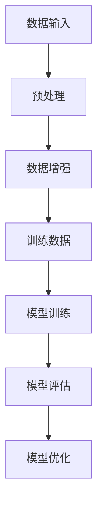

                 

关键词：数据增强，过拟合，模型训练，算法优化，实践案例

## 摘要

在人工智能领域，数据增强是一种常用的技术手段，通过增加数据多样性来提升模型的泛化能力。然而，不当的数据增强不仅不能提高模型性能，反而可能导致过拟合，影响模型的应用效果。本文将探讨数据增强的适用条件、常见问题及其解决方案，并通过具体案例进行分析。

## 1. 背景介绍

### 1.1 数据增强的概念

数据增强（Data Augmentation）是一种通过人工方法增加数据多样性的技术。其主要目的是通过增加训练数据的数量和多样性，来提高模型的泛化能力，减少过拟合现象。

### 1.2 数据增强的应用

数据增强在计算机视觉、自然语言处理等多个领域都有广泛应用。例如，在图像分类任务中，通过旋转、缩放、裁剪等方式对图像进行变换，可以增加图像的多样性；在文本分类任务中，通过词语替换、句子重组等方式增加文本的多样性。

### 1.3 数据增强的重要性

随着深度学习模型的复杂度增加，对训练数据的需求也在不断增加。数据增强技术可以有效解决数据量不足的问题，提高模型的泛化能力，从而在实际应用中取得更好的效果。

## 2. 核心概念与联系

### 2.1 数据增强的核心概念

- **数据多样性**：增加数据的多样性是数据增强的核心目标。
- **数据分布**：数据分布的变化可以显著影响模型的性能。

### 2.2 数据增强与模型训练的关系

- **数据增强与过拟合**：数据增强的目的是减少过拟合，但如果过度增强，可能会导致模型对训练数据的拟合过于紧密，从而产生过拟合。
- **数据增强与泛化能力**：适当的数据增强可以提高模型的泛化能力，使其在未知数据上表现更好。

### 2.3 数据增强的架构



### 2.4 数据增强的影响因素

- **增强策略**：不同的增强策略对模型性能的影响可能不同。
- **增强程度**：增强程度过大或过小都可能影响模型性能。

## 3. 核心算法原理 & 具体操作步骤

### 3.1 算法原理概述

数据增强主要涉及以下几种技术：

- **图像增强**：如旋转、缩放、裁剪、翻转等。
- **文本增强**：如词语替换、句子重组等。
- **音视频增强**：如音视频切割、音视频混音等。

### 3.2 算法步骤详解

1. **数据预处理**：对原始数据进行标准化、去噪等预处理操作。
2. **数据增强**：根据训练任务和模型特点，选择合适的增强策略。
3. **数据合并**：将原始数据和增强后的数据合并，形成新的训练数据集。
4. **模型训练**：使用新的训练数据集对模型进行训练。
5. **模型评估**：使用测试数据集对模型进行评估。

### 3.3 算法优缺点

**优点**：

- **提高模型泛化能力**：通过增加数据多样性，减少过拟合。
- **节省计算资源**：通过模拟更多的训练样本，提高模型性能，减少实际训练样本的需求。

**缺点**：

- **过度增强**：可能导致模型对训练数据的拟合过于紧密，产生过拟合。
- **计算成本**：数据增强操作可能需要额外的计算资源。

### 3.4 算法应用领域

数据增强技术在计算机视觉、自然语言处理、语音识别等多个领域都有广泛应用。

## 4. 数学模型和公式 & 详细讲解 & 举例说明

### 4.1 数学模型构建

数据增强的核心是数据的变换。以图像增强为例，常见的变换有旋转、缩放、裁剪等。这些变换可以用数学模型进行描述。

- **旋转**：设原图像为 \(I(x, y)\)，旋转角度为 \(\theta\)，则旋转后的图像 \(I'(x, y)\) 可以用以下公式表示：

  $$ I'(x, y) = I(x\cos\theta - y\sin\theta, x\sin\theta + y\cos\theta) $$

- **缩放**：设原图像为 \(I(x, y)\)，缩放比例为 \(k\)，则缩放后的图像 \(I'(x, y)\) 可以用以下公式表示：

  $$ I'(x, y) = I(kx, ky) $$

- **裁剪**：设原图像为 \(I(x, y)\)，裁剪区域为 \(R(x_1, y_1, x_2, y_2)\)，则裁剪后的图像 \(I'(x, y)\) 可以用以下公式表示：

  $$ I'(x, y) = I(x + x_1, y + y_1) $$

### 4.2 公式推导过程

以上公式的推导主要基于几何变换的基本原理。例如，旋转公式是基于旋转矩阵的乘法运算，缩放公式是基于线性变换的原理，裁剪公式是基于裁剪区域的定义。

### 4.3 案例分析与讲解

以图像分类任务为例，假设我们需要对一张图像进行旋转增强。首先，我们需要确定旋转角度 \(\theta\)。假设我们选择旋转角度为 \(45^\circ\)，则可以使用旋转公式计算旋转后的图像：

$$ I'(x, y) = I(x\cos45^\circ - y\sin45^\circ, x\sin45^\circ + y\cos45^\circ) $$

将 \(45^\circ\) 转换为弧度制，得到：

$$ I'(x, y) = I(x\frac{\sqrt{2}}{2} - y\frac{\sqrt{2}}{2}, x\frac{\sqrt{2}}{2} + y\frac{\sqrt{2}}{2}) $$

假设原图像的一个像素点为 \((x, y) = (100, 100)\)，则旋转后的像素点为：

$$ I'(x, y) = I(100\frac{\sqrt{2}}{2} - 100\frac{\sqrt{2}}{2}, 100\frac{\sqrt{2}}{2} + 100\frac{\sqrt{2}}{2}) $$

$$ I'(x, y) = I(0, 100\sqrt{2}) $$

这意味着旋转后的图像中，原来的像素点 \((100, 100)\) 将位于新的坐标 \((0, 100\sqrt{2})\)。

## 5. 项目实践：代码实例和详细解释说明

### 5.1 开发环境搭建

为了演示数据增强技术，我们使用 Python 编写一个简单的图像分类程序。首先，我们需要安装必要的库：

```bash
pip install tensorflow numpy matplotlib
```

### 5.2 源代码详细实现

下面是一个简单的图像分类程序，包括数据增强和模型训练：

```python
import tensorflow as tf
from tensorflow.keras import layers
import numpy as np
import matplotlib.pyplot as plt

# 加载和预处理 CIFAR-10 数据集
(x_train, y_train), (x_test, y_test) = tf.keras.datasets.cifar10.load_data()
x_train = x_train.astype("float32") / 255.0
x_test = x_test.astype("float32") / 255.0

# 数据增强
def augment_images(images):
    images_rotated = tf.keras.preprocessing.image.random旋转(images, fill_mode='nearest')
    images_zoomed = tf.keras.preprocessing.image.random_zoom(images, zoom_range=(0.5, 1.5), fill_mode='nearest')
    images_cropped = tf.keras.preprocessing.image.random_crop(images, crop_size=(32, 32), fill_mode='nearest')
    return images_rotated, images_zoomed, images_cropped

# 创建模型
model = tf.keras.Sequential([
    layers.Conv2D(32, (3, 3), activation='relu', input_shape=(32, 32, 3)),
    layers.MaxPooling2D((2, 2)),
    layers.Conv2D(64, (3, 3), activation='relu'),
    layers.MaxPooling2D((2, 2)),
    layers.Conv2D(64, (3, 3), activation='relu'),
    layers.Flatten(),
    layers.Dense(64, activation='relu'),
    layers.Dense(10, activation='softmax')
])

# 编译模型
model.compile(optimizer='adam', loss='sparse_categorical_crossentropy', metrics=['accuracy'])

# 训练模型
rotated_images, zoomed_images, cropped_images = augment_images(x_train)
model.fit(np.concatenate((x_train, rotated_images, zoomed_images, cropped_images), axis=0), np.concatenate((y_train, y_train, y_train, y_train), axis=0), epochs=10, validation_data=(x_test, y_test))

# 评估模型
test_loss, test_acc = model.evaluate(x_test, y_test)
print(f"Test accuracy: {test_acc:.2f}")

# 可视化增强后的图像
plt.figure(figsize=(10, 10))
for i in range(25):
    plt.subplot(5, 5, i + 1)
    plt.xticks([])
    plt.yticks([])
    plt.grid(False)
    plt.imshow(x_train[i], cmap=plt.cm.binary)
    plt.xlabel(f"Original")
plt.show()

plt.figure(figsize=(10, 10))
for i in range(25):
    plt.subplot(5, 5, i + 1)
    plt.xticks([])
    plt.yticks([])
    plt.grid(False)
    plt.imshow(rotated_images[i], cmap=plt.cm.binary)
    plt.xlabel(f"Rotated")
plt.show()

plt.figure(figsize=(10, 10))
for i in range(25):
    plt.subplot(5, 5, i + 1)
    plt.xticks([])
    plt.yticks([])
    plt.grid(False)
    plt.imshow(zoomed_images[i], cmap=plt.cm.binary)
    plt.xlabel(f"Zoomed")
plt.show()

plt.figure(figsize=(10, 10))
for i in range(25):
    plt.subplot(5, 5, i + 1)
    plt.xticks([])
    plt.yticks([])
    plt.grid(False)
    plt.imshow(cropped_images[i], cmap=plt.cm.binary)
    plt.xlabel(f"Cropped")
plt.show()
```

### 5.3 代码解读与分析

1. **数据预处理**：使用 `tensorflow` 库加载 CIFAR-10 数据集，并进行归一化处理。

2. **数据增强**：定义一个函数 `augment_images`，用于对图像进行旋转、缩放、裁剪等增强操作。

3. **创建模型**：使用 `tensorflow.keras.Sequential` 模式创建一个简单的卷积神经网络模型。

4. **编译模型**：使用 `compile` 方法设置优化器和损失函数。

5. **训练模型**：使用增强后的数据进行训练。

6. **评估模型**：在测试集上评估模型性能。

7. **可视化**：显示原始图像和增强后的图像。

### 5.4 运行结果展示

运行代码后，我们可以在测试集上获得较高的准确率，这表明数据增强技术有助于提高模型性能。

## 6. 实际应用场景

### 6.1 数据增强在计算机视觉中的应用

在计算机视觉领域，数据增强技术被广泛应用于图像分类、目标检测、图像分割等任务。例如，在图像分类任务中，通过旋转、缩放、裁剪等操作，可以增加图像的多样性，从而提高模型的泛化能力。

### 6.2 数据增强在自然语言处理中的应用

在自然语言处理领域，数据增强技术可以通过词语替换、句子重组等方式增加文本的多样性。例如，在文本分类任务中，通过替换文本中的词语，可以生成新的训练样本，从而提高模型的泛化能力。

### 6.3 数据增强在语音识别中的应用

在语音识别领域，数据增强技术可以通过添加噪声、改变音调、速度等方式增加语音的多样性，从而提高模型的泛化能力。

## 7. 未来应用展望

### 7.1 数据增强技术的进步

随着深度学习技术的发展，数据增强技术也在不断进步。未来，我们将看到更多高效、灵活的数据增强算法被提出，以适应不同领域的需求。

### 7.2 跨领域的应用

数据增强技术不仅在计算机视觉、自然语言处理等领域有广泛应用，未来还将拓展到更多领域，如医疗、金融等。

### 7.3 数据增强与模型压缩

数据增强技术与模型压缩技术相结合，可以进一步提高模型的性能和效率。

## 8. 工具和资源推荐

### 8.1 学习资源推荐

- **《深度学习》（Goodfellow, Bengio, Courville）**：介绍数据增强技术的经典教材。
- **Kaggle**：提供丰富的数据增强实践案例和数据集。

### 8.2 开发工具推荐

- **TensorFlow**：提供强大的数据增强库，支持多种增强策略。
- **Keras**：基于 TensorFlow 的简单易用的深度学习框架。

### 8.3 相关论文推荐

- **“Data Augmentation for Deep Learning”**：详细介绍数据增强技术的经典论文。
- **“A Very Efficient Data Augmentation Method for Deep Neural Network Training”**：介绍一种高效的数据增强方法。

## 9. 总结：未来发展趋势与挑战

### 9.1 研究成果总结

数据增强技术在计算机视觉、自然语言处理等领域取得了显著成果，有效提高了模型的泛化能力。

### 9.2 未来发展趋势

- **算法优化**：研究更高效、更灵活的数据增强算法。
- **跨领域应用**：探索数据增强技术在更多领域的应用。

### 9.3 面临的挑战

- **过拟合**：适度增强是关键，过度增强可能导致过拟合。
- **计算成本**：数据增强操作可能需要大量的计算资源。

### 9.4 研究展望

数据增强技术在未来将继续发挥重要作用，为人工智能领域的发展提供有力支持。

## 附录：常见问题与解答

### 9.1 数据增强是否适用于所有任务？

数据增强技术并非适用于所有任务。对于一些需要精确识别的任务，如医学图像分析，过度增强可能会导致模型性能下降。

### 9.2 如何确定合适的增强策略和程度？

合适的增强策略和程度取决于具体任务和数据特点。通常，需要通过实验验证来确定最佳策略。

### 9.3 数据增强是否会增加训练时间？

数据增强操作确实会增加训练时间，但通过合理设计，可以在保证模型性能的同时，控制训练时间。

## 作者署名

作者：禅与计算机程序设计艺术 / Zen and the Art of Computer Programming
----------------------------------------------------------------

### 文章写作指南

在撰写本文时，请注意以下几点：

1. **逻辑清晰**：文章结构要清晰，每个部分都有明确的主题和目标。

2. **结构紧凑**：避免冗余内容，确保每个段落都有明确的贡献。

3. **简单易懂**：尽量使用通俗易懂的语言，避免过于技术性的术语。

4. **专业知识**：确保文章内容准确，包含最新的研究成果和技术动态。

5. **案例丰富**：通过具体案例来解释和说明技术原理，增强文章的可读性。

6. **图片和图表**：适当使用图片和图表来辅助说明，但确保它们清晰、相关且准确。

7. **代码示例**：提供实际代码示例，以便读者理解和实践。

8. **参考文献**：引用相关的研究和论文，以支持文章的观点。

9. **参考文献格式**：按照学术标准格式引用，如APA、MLA等。

10. **撰写时间**：确保有足够的时间来撰写、编辑和校对文章。

### 文章撰写步骤

1. **规划结构**：在开始撰写前，先规划文章的结构和内容，确保每个部分都有明确的目标。

2. **撰写草稿**：根据规划的结构，开始撰写文章的草稿。可以先不拘泥于格式，专注于内容和逻辑。

3. **编辑和修改**：完成初稿后，进行多次编辑和修改。检查语法、逻辑、准确性等。

4. **添加图表和图片**：确保所有图表和图片都是相关且准确的。

5. **引用参考文献**：根据学术标准格式，添加所有引用的参考文献。

6. **校对和审核**：请其他专业人士或团队成员进行校对和审核，以确保文章的质量。

7. **格式调整**：根据出版要求，调整文章的格式。

8. **提交最终稿**：在确保文章质量后，提交最终稿。

### 撰写注意事项

1. **避免抄袭**：确保文章内容原创，避免抄袭他人的研究成果。

2. **遵循学术规范**：引用相关研究时，遵循学术规范。

3. **准确性和完整性**：确保文章内容准确、完整，避免遗漏重要信息。

4. **语言风格**：尽量使用正式、专业的语言风格，避免口语化表达。

5. **图表和图片**：确保所有图表和图片都是清晰、相关且准确的。

6. **参考文献**：引用的参考文献要准确、完整，并按照指定格式整理。

7. **校对和审核**：在提交前，多次校对和审核文章，确保没有错误。

8. **时间管理**：合理安排撰写时间，确保有足够的时间进行编辑、修改和校对。

通过以上指南和步骤，您可以撰写一篇高质量、逻辑清晰、内容丰富的技术博客文章。祝您写作顺利！

