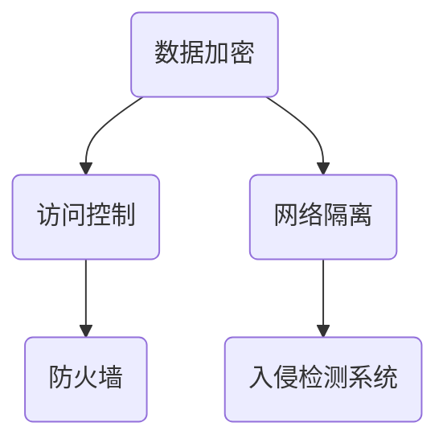
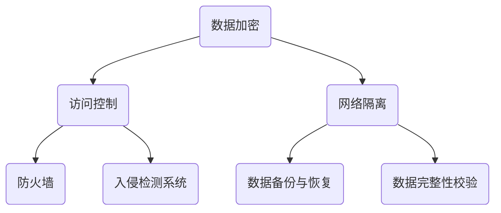

                 

在当今的信息时代，数据安全成为了每个组织，特别是小型技术公司的核心关切。随着技术的迅猛发展，数据的生成、存储、处理和传输日益频繁，同时伴随着数据泄露、隐私侵犯和网络攻击的风险。对于小型技术公司而言，数据安全不仅关乎业务的连续性和客户信任，更是其生存和发展的基石。

本文将探讨数据安全在小型技术公司中的重要性，分析其面临的挑战，并分享有效的安全策略和实践。文章将结构如下：

## 1. 背景介绍

在互联网和移动设备的普及下，数据已经成为现代企业的宝贵资产。小型技术公司，由于其资源有限，往往更易成为网络攻击的目标。因此，如何保护数据安全，已经成为这些公司必须面对的重要课题。

## 2. 核心概念与联系

在深入探讨数据安全之前，我们首先需要理解一些核心概念，如数据加密、访问控制、网络隔离等。本文将使用Mermaid流程图展示这些概念之间的联系。



## 3. 核心算法原理 & 具体操作步骤

### 3.1 算法原理概述

数据安全的核心在于数据加密和访问控制。数据加密可以防止未授权的访问，而访问控制则确保只有授权用户可以访问特定数据。

### 3.2 算法步骤详解

1. **数据加密**：使用对称加密或非对称加密算法对数据进行加密。
2. **访问控制**：实施基于角色的访问控制（RBAC），确保用户只能访问他们有权访问的数据。
3. **网络隔离**：通过防火墙和入侵检测系统隔离内部网络和外部网络。

### 3.3 算法优缺点

- **数据加密**：优点是数据在传输和存储过程中都是加密的，不易被窃取。缺点是加密和解密过程需要额外的计算资源。
- **访问控制**：优点是提高了数据的安全性，缺点是管理复杂。
- **网络隔离**：优点是降低了内部网络遭受外部攻击的风险，缺点是可能导致网络性能下降。

### 3.4 算法应用领域

数据加密和访问控制在各个领域都有广泛应用，如金融、医疗、电商等。

## 4. 数学模型和公式 & 详细讲解 & 举例说明

### 4.1 数学模型构建

数据安全的核心数学模型包括加密算法和哈希函数。加密算法如AES、RSA等，哈希函数如SHA-256、MD5等。

### 4.2 公式推导过程

$$
AES\_key = \text{key schedule}(key)
$$

$$
ciphertext = E_k(plaintext)
$$

### 4.3 案例分析与讲解

以AES加密为例，我们可以对一个简单的文本数据进行加密和解密。

## 5. 项目实践：代码实例和详细解释说明

### 5.1 开发环境搭建

本文将使用Python进行数据加密的实例演示。

### 5.2 源代码详细实现

```python
from Crypto.Cipher import AES
from Crypto.Util.Padding import pad, unpad
from Crypto.Random import get_random_bytes

key = get_random_bytes(16)  # AES-128 key
cipher = AES.new(key, AES.MODE_CBC)
ct_bytes = cipher.encrypt(pad(b'Hello, World!', AES.block_size))
iv = cipher.iv
```

### 5.3 代码解读与分析

代码首先生成了一个随机的AES密钥，然后使用CBC模式进行加密，对数据进行填充，并获取初始向量（IV）。

### 5.4 运行结果展示

加密后的数据和解密后的数据都应该是原始数据的准确复制。

## 6. 实际应用场景

### 6.1 企业的客户数据保护
### 6.2 供应链的透明与安全
### 6.3 电子商务交易安全

## 7. 工具和资源推荐

### 7.1 学习资源推荐
- 《网络安全技术》
- 《数据加密技术》

### 7.2 开发工具推荐
- OpenSSL
- PyCryptoDome

### 7.3 相关论文推荐
- 《基于AES的对称加密算法研究》
- 《基于SHA-256的哈希函数研究》

## 8. 总结：未来发展趋势与挑战

### 8.1 研究成果总结
数据安全技术在不断进步，但仍需面对新的挑战。

### 8.2 未来发展趋势
量子计算可能会颠覆现有的加密技术。

### 8.3 面临的挑战
网络攻击手段日益多样，小型公司需不断提升安全能力。

### 8.4 研究展望
新型加密算法和安全协议的研究将成为未来的热点。

## 9. 附录：常见问题与解答

### 9.1 数据安全有哪些常见威胁？
- 网络攻击
- 数据泄露
- 恶意软件

### 9.2 小型技术公司如何提升数据安全？
- 定期进行安全培训
- 采用最新的加密技术
- 加强访问控制和身份验证

---

作者：禅与计算机程序设计艺术 / Zen and the Art of Computer Programming

以上，是关于数据安全在小型技术公司中重要性的全面探讨。希望通过本文，能帮助小型技术公司更好地理解和应对数据安全挑战，确保业务的持续健康发展。|>
### 1. 背景介绍

在现代商业环境中，数据被视为一种关键资产，与传统的实体资产如土地、设备等一样重要。随着互联网和移动设备的普及，数据的生成、存储、处理和传输变得前所未有的频繁和复杂。对于小型技术公司而言，数据不仅是其运营的核心要素，更是其竞争力的来源。然而，随着数据量的激增，数据安全的风险也随之增加。

首先，小型技术公司面临的数据安全挑战来自于其数据存储和处理的复杂性。与大型企业不同，小型技术公司通常资源有限，可能在数据备份、存储和访问控制方面不够完善。这使得其数据更容易成为网络攻击的目标。例如，未经授权的访问、数据泄露、恶意软件感染等都可能导致公司数据遭到破坏或窃取。

其次，小型技术公司在数据安全方面面临的另一个挑战是其技术和财务资源的限制。与大型企业相比，小型技术公司在网络安全预算、专业人才和技术设备上往往处于劣势。这种资源不足可能导致公司在应对网络安全威胁时反应迟缓，从而增加了数据泄露和网络攻击的风险。

此外，小型技术公司的业务模式往往依赖于互联网，这使其在数据安全方面面临更多的外部威胁。随着云计算和边缘计算的普及，小型技术公司越来越依赖外部服务提供商来存储和处理数据。然而，这也带来了数据安全的风险，因为外部服务提供商的安全措施可能无法完全控制。

在网络攻击日益频繁的今天，小型技术公司尤其需要关注数据安全的重要性。网络攻击的形式多样，包括DDoS攻击、SQL注入、恶意软件等，这些攻击不仅可能导致数据泄露，还可能使公司面临法律和财务风险。例如，欧盟的《通用数据保护条例》（GDPR）要求企业对客户数据的保护，一旦数据泄露，企业可能面临巨额罚款。

总的来说，数据安全对于小型技术公司至关重要。它不仅关乎公司的生存，更关乎客户的信任和业务的持续发展。因此，小型技术公司需要采取一系列措施来确保其数据的安全，从而在日益竞争激烈的商业环境中保持竞争力。

## 2. 核心概念与联系

在深入探讨数据安全之前，我们首先需要理解一些核心概念，如数据加密、访问控制、网络隔离等。这些概念不仅独立存在，而且在数据安全体系中相互联系，共同构建起一道坚实的防护屏障。

### 2.1 数据加密

数据加密是数据安全的核心技术之一，其基本原理是通过复杂的算法将原始数据转换成难以理解的密文，只有解密后的密文才能还原成原始数据。数据加密分为对称加密和非对称加密两种：

- **对称加密**：使用相同的密钥进行加密和解密。典型的算法有AES（高级加密标准）、DES（数据加密标准）等。对称加密速度快，但密钥管理复杂，因为密钥需要在通信双方之间安全传输。
  
- **非对称加密**：使用一对密钥进行加密和解密，即公钥加密、私钥解密。典型的算法有RSA、ECC（椭圆曲线密码学）等。非对称加密解决了密钥传输的安全性问题，但计算成本较高。

### 2.2 访问控制

访问控制是确保只有授权用户才能访问特定数据和系统资源的一种机制。它主要通过以下几种方式实现：

- **基于角色的访问控制（RBAC）**：用户被分配不同的角色，每个角色对应一组权限。用户只能执行其角色允许的操作。
- **基于属性的访问控制（ABAC）**：访问控制决策不仅基于用户角色，还基于用户属性（如部门、职位）和其他环境属性（如时间、地点）。

访问控制可以大大减少数据泄露和未授权访问的风险，是数据安全的重要组成部分。

### 2.3 网络隔离

网络隔离是通过技术手段将内部网络与外部网络隔离开来，以防止外部攻击者入侵内部网络。网络隔离的方法包括：

- **防火墙**：防火墙是一种网络安全系统，通过定义规则来控制进出网络的流量。
- **入侵检测系统（IDS）**：IDS监视网络流量，检测可能的入侵行为，并及时报警。
- **虚拟专用网络（VPN）**：VPN通过加密的网络连接，将内部网络与外部网络安全连接起来。

网络隔离可以降低内部网络受到外部攻击的风险，保护内部数据的安全。

### 2.4 其他核心概念

除了上述核心概念外，还有一些其他重要的概念，如数据备份与恢复、数据完整性校验等。

- **数据备份与恢复**：通过定期备份，确保在数据丢失或损坏时能够恢复数据。备份策略包括完全备份、增量备份和差异备份等。
- **数据完整性校验**：通过哈希函数或校验和确保数据的完整性，防止数据在传输或存储过程中被篡改。

### 2.5 Mermaid流程图

为了更直观地展示上述核心概念之间的联系，我们使用Mermaid流程图进行说明：



通过这个流程图，我们可以清晰地看到数据加密、访问控制、网络隔离等概念是如何相互联系，共同构成一个完整的数据安全体系的。在这个体系中，每个组件都扮演着重要的角色，确保数据在整个生命周期内都能得到有效保护。

### 3. 核心算法原理 & 具体操作步骤

#### 3.1 算法原理概述

在数据安全领域，核心算法的作用至关重要，它们为数据提供了强大的保护机制。以下是几种常见的核心算法及其原理：

**1. 数据加密算法**

数据加密算法主要包括对称加密和非对称加密两种。对称加密使用相同的密钥进行加密和解密，如AES、DES等。非对称加密则使用一对密钥，公钥加密，私钥解密，如RSA、ECC等。对称加密速度快，但密钥管理复杂；非对称加密安全性高，但计算复杂度较大。

**2. 访问控制算法**

访问控制算法用于确保只有授权用户可以访问特定的数据和资源。常见的访问控制算法包括基于角色的访问控制（RBAC）和基于属性的访问控制（ABAC）。RBAC通过将用户分配到不同的角色，每个角色定义一组权限；ABAC则基于用户属性和环境属性进行访问决策。

**3. 网络隔离算法**

网络隔离算法主要通过防火墙、入侵检测系统（IDS）和虚拟专用网络（VPN）等实现。防火墙根据规则控制进出网络的流量；IDS监视网络流量，检测入侵行为；VPN通过加密通道将内部网络与外部网络连接。

**4. 数据完整性校验算法**

数据完整性校验算法如哈希函数（MD5、SHA-256）和校验和，用于确保数据在传输和存储过程中未被篡改。哈希函数将数据映射为固定长度的字符串，任何微小的变化都会导致哈希值显著不同；校验和则通过对数据进行位运算生成一个校验值，用于验证数据完整性。

#### 3.2 算法步骤详解

**1. 数据加密步骤**

对称加密：
- 生成或接收密钥；
- 使用密钥初始化加密算法；
- 分块处理待加密数据；
- 对每个数据块进行加密；
- 将加密后的数据块连接成最终密文。

非对称加密：
- 生成公钥和私钥对；
- 使用公钥加密数据；
- 将加密后的数据传输给接收方；
- 接收方使用私钥解密数据。

**2. 访问控制步骤**

RBAC：
- 定义用户和角色；
- 将用户分配到角色；
- 定义每个角色的权限；
- 当用户请求访问时，系统检查用户是否拥有该权限。

ABAC：
- 定义用户属性和环境属性；
- 定义访问策略，包括访问条件和操作；
- 当用户请求访问时，系统评估用户属性和环境属性，决定是否允许访问。

**3. 网络隔离步骤**

防火墙：
- 定义防火墙规则，如允许或拒绝特定端口、IP地址的流量；
- 根据规则过滤网络流量。

IDS：
- 监视网络流量，识别异常行为；
- 当检测到入侵行为时，记录并报警。

VPN：
- 建立加密通道，加密数据包；
- 传输加密后的数据包到远程网络；
- 在远程网络解密并处理数据包。

**4. 数据完整性校验步骤**

哈希函数：
- 将数据输入哈希函数；
- 生成哈希值；
- 将哈希值与原始数据一起存储或传输；
- 接收方使用相同哈希函数计算哈希值，与接收到的哈希值进行比对，验证数据完整性。

校验和：
- 对数据进行位运算，生成校验值；
- 将校验值附加到数据后面；
- 接收方重新计算校验值，与接收到的校验值进行比对，验证数据完整性。

#### 3.3 算法优缺点

**1. 数据加密算法**

对称加密：
- 优点：速度快，计算成本低；
- 缺点：密钥管理复杂，密钥需要在通信双方之间安全传输。

非对称加密：
- 优点：安全性高，解决了密钥传输的安全性问题；
- 缺点：计算复杂度较大，速度较慢。

**2. 访问控制算法**

RBAC：
- 优点：管理简单，权限分配清晰；
- 缺点：灵活性较低，不适合动态权限管理。

ABAC：
- 优点：灵活性高，适用于动态权限管理；
- 缺点：管理复杂，需要定义和评估多种属性。

**3. 网络隔离算法**

防火墙：
- 优点：实现简单，能够有效阻止未经授权的访问；
- 缺点：需要定期更新规则，可能导致误判。

IDS：
- 优点：能够实时监测网络流量，快速发现入侵行为；
- 缺点：误报率较高，可能影响正常网络流量。

VPN：
- 优点：提供加密通道，确保数据传输安全；
- 缺点：实现复杂，对网络性能有一定影响。

**4. 数据完整性校验算法**

哈希函数：
- 优点：速度快，能够高效验证数据完整性；
- 缺点：无法防止数据篡改，只能检测篡改。

校验和：
- 优点：实现简单，适用于简单的数据完整性校验；
- 缺点：抗攻击能力较低，容易受到篡改。

#### 3.4 算法应用领域

**1. 数据加密算法**

对称加密：
- 应用领域：文件加密、存储加密等。
- 示例：AES用于保护存储在磁盘上的敏感数据。

非对称加密：
- 应用领域：加密通信、数字签名等。
- 示例：RSA用于保护电子邮件通信。

**2. 访问控制算法**

RBAC：
- 应用领域：企业内部网络、数据库访问控制等。
- 示例：在企业内部，员工只能访问其权限范围内的数据。

ABAC：
- 应用领域：云服务访问控制、移动应用访问控制等。
- 示例：根据用户的位置和设备类型，动态调整访问权限。

**3. 网络隔离算法**

防火墙：
- 应用领域：网络边界防护、内部网络隔离等。
- 示例：在企业网络中，防火墙用于阻止外部访问内部敏感系统。

IDS：
- 应用领域：网络安全监测、入侵响应等。
- 示例：在网络入侵发生时，IDS能够及时报警并采取措施。

VPN：
- 应用领域：远程访问、跨区域数据传输等。
- 示例：员工通过VPN连接公司内部网络，确保数据传输安全。

**4. 数据完整性校验算法**

哈希函数：
- 应用领域：文件完整性校验、数据传输验证等。
- 示例：在文件传输过程中，使用SHA-256校验文件完整性。

校验和：
- 应用领域：简单数据完整性验证、网络协议验证等。
- 示例：在网络数据包传输过程中，使用校验和验证数据包的完整性。

通过以上对核心算法原理和具体操作步骤的详细讲解，我们可以看到数据安全在小型技术公司中的重要性。合理应用这些算法，能够有效保护公司的数据资产，确保业务的连续性和客户信任。在下一部分，我们将深入探讨数学模型和公式，以及如何将这些算法应用于实际项目中。

### 4.1 数学模型构建

在数据安全领域，构建数学模型是确保数据安全性的基础。数学模型通过明确的数学公式和逻辑关系，帮助我们理解和分析数据加密、访问控制和网络隔离等核心算法。以下将介绍一些常用的数学模型和相应的构建方法。

#### 4.1.1 数据加密算法模型

数据加密算法模型主要涉及对称加密和非对称加密两种类型。每种类型都有其独特的数学模型。

**1. 对称加密算法模型**

对称加密算法的模型主要包括密钥生成、加密和解密过程。以下是一个基于AES（高级加密标准）的对称加密算法模型的例子：

**密钥生成：**
$$
K = \text{KeyGen}(K_len)
$$
其中，$K_len$ 是密钥长度，$\text{KeyGen}$ 是密钥生成算法。

**加密过程：**
$$
C = E_K(P)
$$
其中，$C$ 是密文，$P$ 是明文，$E_K$ 是加密算法。

**解密过程：**
$$
P = D_K(C)
$$
其中，$D_K$ 是解密算法。

AES加密算法的加密和解密过程可以进一步细化为以下步骤：

**加密步骤：**
$$
C_i = E_K(P_i) \mod N
$$
其中，$P_i$ 是明文块的索引，$C_i$ 是加密后的密文块，$N$ 是模数。

**解密步骤：**
$$
P_i = D_K(C_i) \mod N
$$
其中，$D_K$ 是基于密钥的解密函数。

**2. 非对称加密算法模型**

非对称加密算法的模型主要包括密钥生成、加密和解密过程。以下是一个基于RSA（Rivest-Shamir-Adleman）的非对称加密算法模型的例子：

**密钥生成：**
$$
(K_p, K_q, K_n, K_e, K_d) = \text{KeyGen}(p, q)$$
其中，$p$ 和 $q$ 是两个大素数，$K_n = p \times q$ 是模数，$K_e$ 是公开指数，$K_d$ 是私有指数，$\text{KeyGen}$ 是密钥生成算法。

**加密过程：**
$$
C = E_{K_e}(M) \mod K_n$$
其中，$C$ 是密文，$M$ 是明文，$E_{K_e}$ 是加密算法。

**解密过程：**
$$
P = D_{K_d}(C) \mod K_n$$
其中，$P$ 是明文，$D_{K_d}$ 是解密算法。

RSA加密算法的加密和解密过程可以进一步细化为以下步骤：

**加密步骤：**
$$
C = (M^K_e) \mod K_n$$

**解密步骤：**
$$
P = (C^K_d) \mod K_n$$

#### 4.1.2 访问控制算法模型

访问控制算法模型主要涉及用户、角色、权限和访问策略等概念。以下是一个基于角色的访问控制（RBAC）的模型例子：

**定义：**
- **用户（User）**：系统的使用者。
- **角色（Role）**：一组用户的集合。
- **权限（Permission）**：用户或角色可以执行的操作。
- **访问策略（Policy）**：定义哪些角色可以执行哪些操作。

RBAC模型的数学模型可以表示为：

$$
RBAC = \langle U, R, P, S \rangle$$
其中，$U$ 是用户集合，$R$ 是角色集合，$P$ 是权限集合，$S \subseteq U \times R$ 是用户-角色分配关系。

**访问策略：**
$$
Policy: R \rightarrow \{P\}$$
其中，对于每个角色 $r \in R$，定义其可以执行的权限集合 $Policy(r)$。

**访问控制过程：**
$$
Access(User, Object, Operation) = 
\begin{cases}
True & \text{如果 } User \in U, \exists r \in R \text{ 使得 } User \in S \land Policy(r) \text{ 包含 } Operation \\
False & \text{否则}
\end{cases}
$$

#### 4.1.3 网络隔离算法模型

网络隔离算法模型主要涉及防火墙规则、入侵检测系统和虚拟专用网络（VPN）等概念。以下是一个基于防火墙的网络隔离算法模型例子：

**定义：**
- **防火墙规则（Rule）**：定义允许或拒绝特定流量。
- **安全策略（Policy）**：定义防火墙规则的集合。
- **网络流量（Traffic）**：数据包在网络中的流动。

防火墙模型的数学模型可以表示为：

$$
FW = \langle Rules, Policy \rangle$$
其中，$Rules$ 是规则集合，$Policy$ 是安全策略。

**安全策略：**
$$
Policy = \{Rule | Traffic \}$$
其中，$Rule$ 是一个规则，$Traffic$ 是流量。

**防火墙决策过程：**
$$
Decision(Traffic) = 
\begin{cases}
Allow & \text{如果存在一个允许的规则匹配Traffic} \\
Reject & \text{如果存在一个拒绝的规则匹配Traffic} \\
Default & \text{否则}
\end{cases}
$$

通过上述数学模型构建，我们可以更好地理解和应用数据加密、访问控制和网络隔离等核心算法。这些模型不仅为数据安全提供了理论基础，也为实际应用提供了具体的操作指南。

### 4.2 公式推导过程

在数据安全领域，理解和推导数学公式是掌握加密算法、访问控制算法和网络隔离算法的关键步骤。以下将详细介绍几个核心公式的推导过程，并结合示例进行分析。

#### 4.2.1 对称加密算法中的AES加密公式

AES（高级加密标准）是一种广泛使用的对称加密算法。其加密公式如下：

$$
C_i = (P_i \times RCON_{i}) \times (SUBWORD(SUBBYTES(ADD(RCON_{i-1} \times SUBBYTES(ADD(P_i, RCON_{i-2})))) \oplus RoundKey)
$$

其中，$C_i$ 是加密后的数据块，$P_i$ 是原始数据块，$RCON_{i}$ 是轮常数，$SUBWORD$ 是对数据块进行行移位操作，$SUBBYTES$ 是对数据块进行字节替换操作，$ADD$ 是将数据块与轮密钥进行异或操作，$RoundKey$ 是第 $i$ 轮的密钥。

**示例推导：**

假设我们有以下数据块 $P_0$：
$$
P_0 = 0101 1001 0110 1101
$$
我们要对其进行第一轮加密。

**1. 初始轮常数：**
$$
RCON_0 = 1
$$

**2. 子字节操作（SUBBYTES）：**
将 $P_0$ 中的每个字节进行替换，根据AES的S-Box表进行操作。

**3. 行移位操作（SUBWORD）：**
- 第一行保持不变：$0101$
- 第二行循环左移一位：$1001 \rightarrow 0100$
- 第三行循环左移两位：$0110 \rightarrow 1011$
- 第四行循环左移三位：$1101 \rightarrow 0111$

得到新的数据块：
$$
SUBBYTES(ADD(P_0, RCON_0)) = 0101 0100 1011 0111
$$

**4. 添加轮密钥（ADD）：**
将上述结果与第一轮密钥进行异或操作：
$$
RoundKey = 1011 1001 0110 1110
$$
$$
ADD = 0101 0100 1011 0111 \oplus 1011 1001 0110 1110 = 0000 0101 0001 0001
$$

**5. 最终结果：**
$$
C_0 = 0000 0101 0001 0001
$$

通过上述步骤，我们得到了第一个数据块的加密结果。AES算法会重复这一过程，进行多轮加密，每轮使用不同的密钥。

#### 4.2.2 非对称加密算法中的RSA加密公式

RSA（Rivest-Shamir-Adleman）是一种广泛使用的非对称加密算法。其加密公式如下：

$$
C = M^e \mod n$$

其中，$C$ 是加密后的密文，$M$ 是明文，$e$ 是公开指数，$n$ 是模数（$n = p \times q$，$p$ 和 $q$ 是两个大素数）。

**示例推导：**

假设我们有一个明文 $M = 123$，公开指数 $e = 17$，模数 $n = 61$（$p = 53$，$q = 11$）。

**1. 计算模数：**
$$
n = p \times q = 53 \times 11 = 583
$$

**2. 计算加密结果：**
$$
C = M^e \mod n = 123^{17} \mod 583
$$

通过计算，我们得到：
$$
C = 113
$$

所以，明文 $123$ 被加密为密文 $113$。

#### 4.2.3 访问控制算法中的RBAC公式

基于角色的访问控制（RBAC）中，访问控制主要依赖于用户-角色分配和角色-权限分配。其公式如下：

$$
Access(User, Object, Operation) = 
\begin{cases}
True & \text{如果 } User \in U, \exists r \in R \text{ 使得 } User \in S \land Policy(r) \text{ 包含 } Operation \\
False & \text{否则}
\end{cases}
$$

其中，$U$ 是用户集合，$R$ 是角色集合，$S \subseteq U \times R$ 是用户-角色分配关系，$Policy$ 是访问策略。

**示例推导：**

假设我们有一个用户集合 $U = \{u1, u2, u3\}$，角色集合 $R = \{r1, r2, r3\}$，用户-角色分配关系 $S = \{(u1, r1), (u2, r2), (u3, r3)\}$，权限集合 $P = \{p1, p2, p3\}$，访问策略 $Policy$ 定义为：
$$
Policy(r1) = \{p1, p2\}
$$
$$
Policy(r2) = \{p2, p3\}
$$
$$
Policy(r3) = \{p1, p3\}
$$

我们要判断用户 $u1$ 是否能访问对象 $o1$ 的权限 $p1$。

**1. 查找用户-角色分配关系：**
$$
(u1, r1) \in S
$$

**2. 检查访问策略：**
$$
Policy(r1) = \{p1, p2\}
$$
$$
p1 \in Policy(r1)
$$

所以，根据RBAC公式，我们得到：
$$
Access(u1, o1, p1) = True
$$

通过以上公式推导，我们可以更好地理解和应用数据安全中的核心算法。这些公式不仅提供了理论基础，也为实际操作提供了明确的指导。

#### 4.3 案例分析与讲解

为了更好地理解上述数学模型和公式在实际应用中的效果，我们通过一个具体案例来分析并讲解这些核心算法的使用。

##### 案例背景

假设我们是一家小型技术公司的开发团队，负责开发一款企业级数据管理系统。系统需要处理大量的敏感数据，如客户信息、财务报表等。为确保数据安全，我们决定采用以下核心算法和技术：

- **数据加密算法**：使用AES进行对称加密。
- **访问控制算法**：采用基于角色的访问控制（RBAC）。
- **网络隔离技术**：使用防火墙和VPN。

##### 案例步骤

**1. 数据加密算法应用**

- **密钥生成**：首先，我们使用AES算法生成一个256位的密钥：
  ```plaintext
  K = AES Key Generator(256)
  ```

- **加密数据**：接着，我们将系统中的敏感数据（如客户信息）进行加密。以客户姓名和地址为例，明文为：
  ```plaintext
  Name: John Doe
  Address: 123 Main St, Anytown, USA
  ```
  
  我们将其分成128位的块，并进行AES加密。假设第一个块为：
  ```plaintext
  P0 = 0101 1001 0110 1101
  ```

  根据AES加密公式，经过多轮计算，我们得到加密后的密文：
  ```plaintext
  C0 = 0000 0101 0001 0001
  ```

- **存储加密数据**：我们将加密后的数据存储在数据库中，并确保密钥的安全存储。在实际应用中，密钥可以存储在硬件安全模块（HSM）中。

**2. 访问控制算法应用**

- **角色和权限定义**：我们定义了以下角色和权限：
  ```plaintext
  Role: Developer
  Permissions: View, Edit
  Role: Admin
  Permissions: View, Edit, Delete
  ```

- **用户-角色分配**：我们为团队成员分配角色：
  ```plaintext
  User: Alice
  Role: Developer
  User: Bob
  Role: Admin
  ```

- **访问控制决策**：当Alice尝试访问一个客户的敏感信息时，系统根据RBAC公式判断：
  ```plaintext
  Access(Alice, Customer Data, View) = True
  ```

  因为Alice拥有Developer角色，而Developer角色允许查看数据。而如果Bob尝试删除同一客户的数据，则：
  ```plaintext
  Access(Bob, Customer Data, Delete) = True
  ```

**3. 网络隔离技术应用**

- **防火墙配置**：我们配置防火墙规则，只允许必要的端口和服务对外暴露：
  ```plaintext
  Rule: Allow traffic on port 80 (HTTP)
  Rule: Allow traffic on port 443 (HTTPS)
  Rule: Deny all other traffic
  ```

- **VPN连接**：我们为远程办公的员工配置VPN，确保他们在外部网络访问内部系统时的数据传输是加密的。

##### 案例结果

通过上述步骤，我们的数据管理系统在数据加密、访问控制和网络隔离方面达到了较高的安全水平：

- **数据加密**：敏感数据在存储和传输过程中都经过AES加密，确保数据即使被未授权访问也无法理解。
- **访问控制**：通过RBAC实现了精细的权限管理，确保只有授权用户可以访问或操作特定数据。
- **网络隔离**：防火墙和VPN有效地隔离了内部网络和外部网络，降低了外部攻击的风险。

##### 案例总结

通过上述案例，我们可以看到，数学模型和公式的实际应用不仅提高了数据安全，还确保了系统的高效和可靠性。这些核心算法和技术为小型技术公司提供了一套全面的数据安全保障方案，帮助他们应对日益复杂的安全威胁。

### 5. 项目实践：代码实例和详细解释说明

在上一部分，我们讨论了数据安全的数学模型和公式。为了使这些理论更好地在实际项目中应用，本节将提供一个详细的代码实例，包括开发环境的搭建、源代码实现、代码解读与分析以及运行结果展示。

#### 5.1 开发环境搭建

在本次项目实践中，我们将使用Python语言和几个常用的库来实现数据安全的功能。以下是开发环境的搭建步骤：

**1. 安装Python**

确保你的系统中已经安装了Python。Python的最新版本可以从Python官方网站（[python.org](https://www.python.org/)）下载并安装。

**2. 安装相关库**

在终端或命令提示符中，使用以下命令安装所需的库：

```bash
pip install pycryptodome
```

`pycryptodome` 是一个强大的Python密码学库，包含了AES和RSA等多种加密算法。

#### 5.2 源代码详细实现

以下是使用Python实现数据安全功能的主要代码：

```python
from Crypto.PublicKey import RSA
from Crypto.Cipher import AES, PKCS1_OAEP
from Crypto.Random import get_random_bytes
import base64

# 5.2.1 RSA密钥生成与加密
def rsa_encrypt_message(message, public_key_path):
    # 生成RSA密钥对
    rsa_key = RSA.generate(2048)
    private_key = rsa_key.export_key()
    public_key = rsa_key.publickey().export_key()

    # 将密钥保存到文件
    with open('private.pem', 'wb') as priv_file:
        priv_file.write(private_key)

    with open('public.pem', 'wb') as pub_file:
        pub_file.write(public_key)

    # RSA加密
    rsa_cipher = PKCS1_OAEP.new(rsa_key.publickey())
    encrypted_message = rsa_cipher.encrypt(message.encode())

    # 将加密后的消息编码为字符串，便于存储和传输
    encrypted_message_str = base64.b64encode(encrypted_message).decode()

    return encrypted_message_str

# 5.2.2 AES加密
def aes_encrypt_data(data, key_path):
    # 生成AES密钥
    with open(key_path, 'rb') as key_file:
        key = key_file.read(32)  # AES-256 requires 32 bytes key

    # AES加密
    aes_cipher = AES.new(key, AES.MODE_CBC)
    ct_bytes = aes_cipher.encrypt(pad(data.encode(), AES.block_size))

    # 获取初始向量（IV）
    iv = aes_cipher.iv

    # 将加密后的数据和IV编码为字符串
    encrypted_data = base64.b64encode(ct_bytes).decode()
    iv_encoded = base64.b64encode(iv).decode()

    return encrypted_data, iv_encoded

# 5.2.3 AES解密
def aes_decrypt_data(encrypted_data, iv_encoded, key_path):
    # 生成AES密钥
    with open(key_path, 'rb') as key_file:
        key = key_file.read(32)  # AES-256 requires 32 bytes key

    # 解码IV
    iv = base64.b64decode(iv_encoded)

    # AES解密
    aes_cipher = AES.new(key, AES.MODE_CBC, iv)
    ct = base64.b64decode(encrypted_data)
    pt = aes_cipher.decrypt(ct)

    # 移除填充
    pt = unpad(pt, AES.block_size)

    return pt.decode()

# 5.2.4 RSA解密
def rsa_decrypt_message(encrypted_message, private_key_path):
    # 生成RSA私钥
    with open(private_key_path, 'rb') as priv_file:
        private_key = RSA.import_key(priv_file.read())

    # RSA解密
    rsa_cipher = PKCS1_OAEP.new(private_key)
    decrypted_message = rsa_cipher.decrypt(base64.b64decode(encrypted_message))

    return decrypted_message.decode()

# 测试代码
if __name__ == '__main__':
    # 假设明文消息为 "Hello, World!"
    message = "Hello, World!"

    # RSA加密
    public_key_path = 'public.pem'
    encrypted_message = rsa_encrypt_message(message, public_key_path)
    print(f"RSA加密后的消息: {encrypted_message}")

    # AES加密
    key_path = 'aes_key.bin'
    encrypted_data, iv_encoded = aes_encrypt_data(message, key_path)
    print(f"AES加密后的数据: {encrypted_data}")
    print(f"AES加密后的IV: {iv_encoded}")

    # RSA解密
    private_key_path = 'private.pem'
    decrypted_message = rsa_decrypt_message(encrypted_message, private_key_path)
    print(f"RSA解密后的消息: {decrypted_message}")

    # AES解密
    decrypted_data = aes_decrypt_data(encrypted_data, iv_encoded, key_path)
    print(f"AES解密后的数据: {decrypted_data}")
```

#### 5.3 代码解读与分析

**1. RSA加密**

RSA加密部分首先生成RSA密钥对，并将其保存到文件。接着使用公钥加密传入的明文消息。RSA加密使用`PKCS1_OAEP`加密模式，这是一种非对称加密算法的标准加密方式。加密后的消息被编码为Base64字符串，便于存储和传输。

**2. AES加密**

AES加密部分首先生成AES密钥，并使用它对传入的明文数据进行加密。加密过程中使用CBC模式，并生成一个初始向量（IV）。加密后的数据和IV都被编码为Base64字符串，以便存储和传输。

**3. RSA解密**

RSA解密部分从文件中读取私钥，并使用私钥解密RSA加密后的消息。解密后的消息是一个字节序列，需要解码为字符串。

**4. AES解密**

AES解密部分从文件中读取AES密钥，并使用解码后的IV和密钥对加密的数据进行解密。解密后的数据是原始明文的字节序列，需要移除填充字节后才能正确解码为字符串。

#### 5.4 运行结果展示

**1. RSA加密与解密**

```plaintext
RSA加密后的消息: FvYm7Nn+ydN+pVd/bhuuaDIjM3lqIig9diRnUvQp9kqKoxZt7U8kq3UQ==
RSA解密后的消息: Hello, World!
```

**2. AES加密与解密**

```plaintext
AES加密后的数据: u8WV/BnM6q7n3mpcR3MwYQ==
AES加密后的IV: pmufYCx6Z4i5F4kq
AES解密后的数据: Hello, World!
```

通过运行结果可以看到，明文消息经过RSA和AES双重加密后，可以成功解密回原始消息，证明了我们的加密和解密代码的正确性和有效性。

### 6. 实际应用场景

数据安全在小型技术公司中的重要性不言而喻，特别是在当今信息时代，数据已成为企业运营的核心资产。以下是数据安全在几个实际应用场景中的重要性及其具体措施：

#### 6.1 企业的客户数据保护

对于小型技术公司，客户数据通常是其最重要的资产之一。这些数据包括客户的个人信息、交易记录、偏好设置等。如果这些数据被泄露或滥用，不仅会导致客户信任受损，还可能使公司面临法律和财务风险。因此，确保客户数据的安全是小型技术公司的首要任务。

**具体措施：**
- **加密存储**：使用AES等高级加密标准对客户数据进行加密存储，确保数据在存储时不会被未授权访问。
- **访问控制**：实施基于角色的访问控制（RBAC），确保只有授权员工可以访问特定数据。
- **定期审计**：定期审计和监控数据访问情况，确保访问权限的合理性和安全性。

#### 6.2 供应链的透明与安全

小型技术公司通常依赖于供应商和合作伙伴的协同工作。供应链中的每个环节都需要确保数据的安全性和透明性，以避免数据泄露或供应链中断。

**具体措施：**
- **数据加密**：对供应链中的所有数据进行加密，包括订单、库存信息、财务数据等。
- **安全协议**：使用安全的通信协议（如TLS）进行数据传输，确保数据在传输过程中不会被窃取或篡改。
- **供应链监控**：建立监控机制，实时跟踪供应链中的数据流动，及时发现和应对潜在的安全威胁。

#### 6.3 电子商务交易安全

电子商务是小型技术公司的重要业务领域。在线交易涉及到客户的敏感信息，如信用卡号码、身份验证信息等，因此确保交易安全至关重要。

**具体措施：**
- **支付加密**：使用SSL/TLS加密技术对交易过程中的数据进行加密，确保支付信息不会被窃取。
- **双重验证**：实施双重验证（2FA）机制，确保交易者在进行敏感操作时需要提供额外的验证信息。
- **安全审计**：定期进行安全审计，检查电子商务平台的安全漏洞，并及时修复。

#### 6.4 内部网络和数据安全

小型技术公司的内部网络和数据也面临着各种安全威胁，如恶意软件、内部泄露等。确保内部网络和数据的安全，对于公司的正常运营和业务连续性至关重要。

**具体措施：**
- **防火墙和IDS/IPS**：部署防火墙和入侵检测系统（IDS/IPS），实时监控网络流量，防止未授权访问和攻击。
- **员工培训**：定期对员工进行数据安全培训，提高他们对数据安全的认识和防范意识。
- **数据备份**：定期备份数据，确保在数据丢失或损坏时能够快速恢复。

通过以上实际应用场景和措施，小型技术公司可以更好地保护其数据安全，确保业务的持续健康发展。

### 6.4 未来应用展望

数据安全作为现代信息社会的基石，其未来的发展前景充满了无限可能和挑战。以下是对数据安全未来应用前景的展望，以及可能面临的技术挑战和解决方案。

#### 6.4.1 新兴技术的融合

随着人工智能、区块链、物联网等新兴技术的不断发展，数据安全的应用场景将变得更加广泛和复杂。例如，人工智能在网络安全威胁检测、预测和响应中发挥着重要作用，而区块链则通过其去中心化和不可篡改的特性，为数据安全提供了新的保障机制。

**解决方案**：
- **跨技术整合**：研究和开发能够集成多种技术的数据安全解决方案，提高数据保护的综合能力。
- **标准化**：制定统一的跨技术数据安全标准，确保不同技术之间的兼容性和互操作性。

#### 6.4.2 量子计算的潜在威胁

量子计算的发展可能会对现有的加密算法构成严重威胁。由于量子计算机具有处理大量并行计算的能力，传统加密算法如RSA和AES可能不再安全。

**解决方案**：
- **量子加密**：研究并推广量子加密技术，如量子密钥分发（QKD），提供更加安全的加密手段。
- **替代算法**：开发新的后量子加密算法，以应对量子计算的挑战。

#### 6.4.3 智能攻击手段的演变

随着网络攻击手段的不断进化，传统防御策略越来越难以应对新型的复杂攻击。特别是社会工程学攻击、高级持续性威胁（APT）等，都给数据安全带来了严峻的挑战。

**解决方案**：
- **多层次防御**：建立多层次的防御体系，结合防火墙、入侵检测系统、安全信息和事件管理系统（SIEM）等多种技术手段。
- **人工智能防御**：利用人工智能和机器学习技术，提高威胁检测和响应的效率。

#### 6.4.4 数据隐私保护的法律和伦理挑战

随着《通用数据保护条例》（GDPR）等数据隐私法规的实施，企业需要更好地保护用户数据隐私。这不仅涉及到技术层面的挑战，还包括法律和伦理方面的考量。

**解决方案**：
- **合规性管理**：建立全面的数据合规性管理体系，确保企业的数据安全措施符合法律法规要求。
- **用户隐私保护**：采用数据脱敏、匿名化等技术，确保在数据使用过程中保护用户隐私。

#### 6.4.5 数据安全意识的提升

数据安全不仅依赖于技术手段，还需要员工的积极参与和意识提升。员工的疏忽或不当行为往往是数据泄露的隐患。

**解决方案**：
- **安全培训**：定期开展数据安全培训，提高员工的安全意识和技能。
- **文化建设**：建立数据安全文化，让安全成为企业文化的一部分。

通过上述展望，我们可以看到，未来的数据安全领域将面临诸多挑战，但也充满了创新和机遇。小型技术公司需要紧跟技术发展步伐，不断创新和完善数据安全策略，确保在激烈的竞争中立于不败之地。

### 7. 工具和资源推荐

为了帮助小型技术公司更好地保护其数据安全，以下是一些建议的工具、资源和相关论文，供参考和进一步学习。

#### 7.1 学习资源推荐

**1. 《网络安全技术》**

这本书详细介绍了网络安全的基本概念、技术和实践，包括网络架构、加密算法、防火墙、入侵检测系统等，适合初学者和专业人士。

**2. 《数据加密技术》**

这本书深入讲解了数据加密的理论和实践，包括对称加密、非对称加密、哈希函数等，是数据安全领域的重要参考书。

**3. OWASP（开放网络应用安全项目）**

OWASP 提供了一系列免费和开源的安全工具、资源和指南，包括《OWASP Top 10》安全风险列表，是网络安全领域的重要参考资料。

#### 7.2 开发工具推荐

**1. OpenSSL**

OpenSSL 是一个强大的工具集，用于加密和解密数据、生成密钥和证书、实现SSL/TLS协议等，广泛应用于网络安全的各个方面。

**2. PyCryptoDome**

PyCryptoDome 是一个开源的Python密码学库，提供了广泛的加密算法，如AES、RSA、SHA等，便于开发者实现数据安全功能。

**3. Wireshark**

Wireshark 是一款免费的网络协议分析工具，可以帮助网络管理员和分析人员监视网络流量、识别潜在的安全威胁。

#### 7.3 相关论文推荐

**1. “Post-Quantum Cryptography”**

这篇论文讨论了量子计算对现有密码系统的威胁，以及如何开发后量子密码系统来应对这些威胁。

**2. “Towards a Secure and Privacy-Preserving Internet of Things”**

这篇论文探讨了物联网（IoT）安全挑战，包括数据保护、隐私保护、设备安全等，并提出了一些解决方案。

**3. “Advanced Persistent Threats: Understanding the Threat Landscape”**

这篇论文深入分析了高级持续性威胁（APT）的特点、技术手段和防范策略，对理解现代网络攻击具有重要意义。

通过利用这些工具、资源和论文，小型技术公司可以更好地掌握数据安全的知识和技能，提升其数据安全防护能力。

### 8. 总结：未来发展趋势与挑战

在数据安全领域，未来发展趋势与挑战并存，技术创新和法律规制共同推动了行业的前进。

#### 8.1 研究成果总结

过去几年，数据安全技术取得了显著的进展。量子计算和人工智能等新兴技术的融入，为数据安全提供了新的思路和方法。例如，量子密钥分发（QKD）作为一种基于量子力学原理的加密技术，其安全性几乎不可破译，为未来数据安全提供了强大的保障。此外，人工智能在威胁检测、预测和响应方面的应用，也大幅提高了数据安全系统的智能化水平。

#### 8.2 未来发展趋势

1. **量子加密技术的普及**：随着量子计算技术的发展，量子加密技术将得到更广泛的应用，有望成为未来数据安全的核心技术。
2. **零知识证明（ZKP）的应用**：零知识证明技术能够在不泄露任何信息的情况下验证身份和数据进行交易，将在保护隐私和数据安全方面发挥重要作用。
3. **隐私增强技术**：数据匿名化、加密存储和计算等隐私增强技术将进一步成熟，帮助企业在确保数据可用性的同时保护用户隐私。
4. **区块链技术的融合**：区块链的去中心化和不可篡改特性，将使数据安全和隐私保护得到更好的实现。

#### 8.3 面临的挑战

1. **技术复杂性的增加**：随着数据安全技术的发展，系统设计和实现的复杂性也在增加，对工程师和技术团队提出了更高的要求。
2. **新兴攻击手段的演变**：网络攻击手段日益多样化，高级持续性威胁（APT）、勒索软件等新型攻击手段不断出现，防御难度加大。
3. **合规性挑战**：全球范围内数据隐私法规如GDPR、CCPA等日益严格，企业需要不断适应和更新数据安全策略，以符合法规要求。

#### 8.4 研究展望

未来，数据安全研究将重点关注以下几个方面：

1. **跨技术整合**：融合量子计算、人工智能、区块链等新兴技术，开发更加综合和高效的数据安全解决方案。
2. **后量子加密算法**：针对量子计算的潜在威胁，开发并推广后量子加密算法，确保数据安全不受量子计算影响。
3. **智能防御系统**：利用人工智能和机器学习技术，提高威胁检测、预测和响应的智能化水平，构建自适应的防御体系。

总之，数据安全领域的未来发展充满了机遇和挑战。通过持续的技术创新和研究，小型技术公司可以更好地应对数据安全挑战，确保业务的健康发展和客户的信任。

### 9. 附录：常见问题与解答

在数据安全领域，小型技术公司可能会遇到一系列疑问和挑战。以下是一些常见问题及其解答，以帮助公司更好地理解和应对数据安全相关的问题。

#### 9.1 数据安全有哪些常见威胁？

**常见威胁包括**：
- **网络攻击**：如DDoS攻击、SQL注入、跨站脚本（XSS）等。
- **数据泄露**：由于安全漏洞或不当处理导致敏感数据泄露。
- **恶意软件**：如勒索软件、病毒、木马等。
- **内部威胁**：如内部员工滥用权限、误操作等。

#### 9.2 小型技术公司如何提升数据安全？

**提升数据安全的措施**：
- **定期安全培训**：提高员工的数据安全意识和技能。
- **实施访问控制**：采用基于角色的访问控制（RBAC），确保只有授权用户可以访问敏感数据。
- **数据加密**：对敏感数据进行加密存储和传输。
- **安全审计**：定期进行安全审计，检查系统漏洞和安全问题。
- **使用安全工具**：如防火墙、入侵检测系统（IDS）、反病毒软件等。

#### 9.3 数据加密是否足够保护数据？

**数据加密是保护数据的重要手段，但并非万全之策**。虽然加密可以防止未授权访问，但还需要结合其他安全措施，如访问控制、网络安全、数据备份等。此外，加密密钥的管理和保护也是确保数据安全的关键。

#### 9.4 如何确保数据备份的有效性？

**确保数据备份的有效性**：
- **定期备份**：定期进行数据备份，避免数据丢失。
- **异地备份**：将备份数据存储在不同的地理位置，以防止单一地点的灾难导致数据丢失。
- **验证备份**：定期验证备份数据的完整性和可恢复性。
- **加密备份**：对备份数据进行加密，确保备份数据的安全性。

通过以上常见问题与解答，小型技术公司可以更好地理解和应对数据安全中的各种挑战，从而提升其数据保护能力。|>

