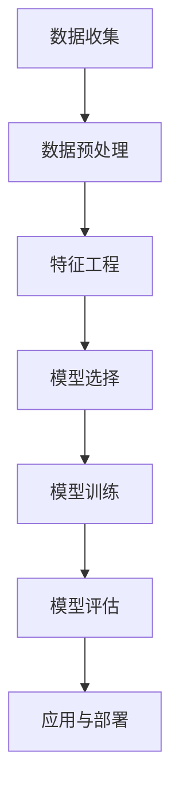

                 

关键词：数据挖掘、原理、算法、代码实例、数据预处理、特征工程、模型选择、性能评估

## 摘要

数据挖掘作为一门跨学科的技术，广泛应用于商业智能、金融分析、医疗健康等领域。本文旨在系统性地介绍数据挖掘的基本原理，包括数据预处理、特征工程、模型选择和性能评估等方面的知识。此外，文章将通过具体的代码实例，帮助读者更好地理解和应用这些原理。

## 1. 背景介绍

### 1.1 数据挖掘的定义

数据挖掘是指从大量的数据中，通过运用统计学、机器学习、数据可视化等方法，提取出隐含的、未知的、具有潜在价值的信息和知识的过程。

### 1.2 数据挖掘的发展历史

数据挖掘技术的发展历程可以追溯到20世纪80年代，随着计算机硬件性能的提升和算法理论的进步，数据挖掘逐渐成为一门独立的学科。

### 1.3 数据挖掘的应用领域

数据挖掘在多个领域都有着广泛的应用，包括但不限于以下方面：

- 商业智能：客户行为分析、销售预测等。
- 金融分析：风险控制、信用评分等。
- 医疗健康：疾病预测、药物研发等。
- 市场营销：精准营销、客户流失预测等。

## 2. 核心概念与联系

### 2.1 数据挖掘的核心概念

- **数据集（Dataset）**：数据挖掘过程中处理的数据集合。
- **特征（Feature）**：描述数据属性的信息。
- **模型（Model）**：根据数据集和算法生成的预测或分类规则。

### 2.2 数据挖掘的基本架构

Mermaid 流程图：


## 3. 核心算法原理 & 具体操作步骤

### 3.1 算法原理概述

数据挖掘涉及到多个算法，以下是几种常见的算法：

- **分类算法**：用于将数据分为不同的类别。
- **回归算法**：用于预测数值型结果。
- **聚类算法**：用于发现数据集中的相似性。

### 3.2 算法步骤详解

#### 3.2.1 数据预处理

数据预处理是数据挖掘的第一步，主要包括数据清洗、数据整合、数据转换和数据归一化等操作。

- **数据清洗**：去除重复数据、处理缺失值、修正错误数据等。
- **数据整合**：合并多个数据源的数据。
- **数据转换**：将数据转换为适合挖掘的格式。
- **数据归一化**：调整数据范围，使得不同特征之间的数据可以进行比较。

#### 3.2.2 特征工程

特征工程是提高模型性能的关键步骤，包括特征选择、特征提取和特征变换等操作。

- **特征选择**：选择对模型预测最有用的特征。
- **特征提取**：从原始数据中提取新的特征。
- **特征变换**：通过线性变换、非线性变换等方法，提高模型的泛化能力。

#### 3.2.3 模型选择

模型选择是数据挖掘中的关键步骤，根据问题的性质和需求，选择合适的模型。

- **监督学习模型**：如决策树、支持向量机等。
- **无监督学习模型**：如K-均值聚类、主成分分析等。

#### 3.2.4 模型训练

模型训练是使用训练数据集来训练模型，使其能够对新的数据进行预测或分类。

#### 3.2.5 模型评估

模型评估是评估模型性能的过程，常用的评估指标包括准确率、召回率、F1值等。

#### 3.2.6 模型应用与部署

模型应用与部署是将训练好的模型应用于实际场景，如实时预测、批量处理等。

### 3.3 算法优缺点

每种算法都有其优缺点，选择合适的算法需要根据具体问题和数据集的特点来决定。

### 3.4 算法应用领域

不同算法在数据挖掘的不同应用领域有不同的适用性。

## 4. 数学模型和公式 & 详细讲解 & 举例说明

### 4.1 数学模型构建

数据挖掘中的数学模型主要包括线性回归、逻辑回归、决策树等。

#### 4.1.1 线性回归

线性回归模型的基本公式为：
$$
y = \beta_0 + \beta_1x_1 + \beta_2x_2 + ... + \beta_nx_n
$$

#### 4.1.2 逻辑回归

逻辑回归模型的基本公式为：
$$
\ln\frac{P(Y=1)}{1-P(Y=1)} = \beta_0 + \beta_1x_1 + \beta_2x_2 + ... + \beta_nx_n
$$

### 4.2 公式推导过程

以线性回归为例，推导过程如下：

1. 构建误差函数：
$$
E(\theta) = \frac{1}{2}\sum_{i=1}^{m}(h_\theta(x^{(i)}) - y^{(i)})^2
$$

2. 对误差函数求导，并令导数为0，得到最小二乘法：
$$
\theta_j = \frac{1}{m}\sum_{i=1}^{m}(x^{(i)}_j - \bar{x}_j)(y^{(i)} - \bar{y})
$$

### 4.3 案例分析与讲解

以客户流失预测为例，分析数据挖掘在客户流失预测中的应用。

## 5. 项目实践：代码实例和详细解释说明

### 5.1 开发环境搭建

- Python 3.x
- Scikit-learn 库
- Pandas 库
- Matplotlib 库

### 5.2 源代码详细实现

```python
import pandas as pd
from sklearn.model_selection import train_test_split
from sklearn.preprocessing import StandardScaler
from sklearn.linear_model import LinearRegression

# 数据加载与预处理
data = pd.read_csv('customer_data.csv')
X = data[['age', 'income', 'region']]
y = data['churn']

# 数据归一化
scaler = StandardScaler()
X_scaled = scaler.fit_transform(X)

# 数据集划分
X_train, X_test, y_train, y_test = train_test_split(X_scaled, y, test_size=0.2, random_state=42)

# 模型训练
model = LinearRegression()
model.fit(X_train, y_train)

# 模型评估
score = model.score(X_test, y_test)
print(f'Model Accuracy: {score:.2f}')
```

### 5.3 代码解读与分析

代码中首先加载和预处理数据，然后进行数据归一化，接着划分数据集，训练模型，并评估模型性能。

### 5.4 运行结果展示

运行代码后，输出模型的准确率，用于评估模型的性能。

## 6. 实际应用场景

### 6.1 客户流失预测

客户流失预测是金融行业中的重要应用，通过分析客户行为数据，预测哪些客户可能会流失，从而采取相应的营销策略。

### 6.2 销售预测

销售预测是商业智能中的重要应用，通过分析历史销售数据，预测未来的销售趋势，为企业的营销和库存管理提供支持。

### 6.3 金融风险评估

金融风险评估是通过分析客户的历史交易数据、信用记录等，预测客户是否会违约，从而帮助金融机构进行风险管理。

## 7. 工具和资源推荐

### 7.1 学习资源推荐

- 《数据挖掘：实用机器学习技术》
- 《机器学习实战》
- Coursera上的《机器学习》课程

### 7.2 开发工具推荐

- Jupyter Notebook
- Spyder
- RStudio

### 7.3 相关论文推荐

- "Random Forests" by Leo Breiman
- "Support Vector Machines" by Vladimir Vapnik
- "Deep Learning" by Ian Goodfellow

## 8. 总结：未来发展趋势与挑战

### 8.1 研究成果总结

数据挖掘技术在近年来取得了显著的进展，包括深度学习、强化学习等新兴技术的应用，大大提高了数据挖掘的效率和准确性。

### 8.2 未来发展趋势

未来，数据挖掘技术将继续向自动化、智能化方向发展，同时，多模态数据挖掘、实时数据挖掘等新兴领域也将得到进一步发展。

### 8.3 面临的挑战

数据挖掘在未来的发展中仍将面临诸多挑战，包括数据隐私保护、算法透明度、算法公平性等。

### 8.4 研究展望

随着数据量的不断增长和算法的不断发展，数据挖掘技术在未来的发展中将会有更多的应用场景和挑战等待我们去探索。

## 9. 附录：常见问题与解答

### 9.1 什么是特征工程？

特征工程是指通过选择、构造和变换特征，以提高模型性能的过程。

### 9.2 如何选择合适的模型？

选择合适的模型需要根据问题的性质、数据集的特点和模型的性能进行综合考虑。

### 9.3 数据挖掘有哪些应用领域？

数据挖掘在商业智能、金融分析、医疗健康、市场营销等多个领域都有广泛的应用。

------------------------------------------------------------------
作者：禅与计算机程序设计艺术 / Zen and the Art of Computer Programming
```<|text|>```

