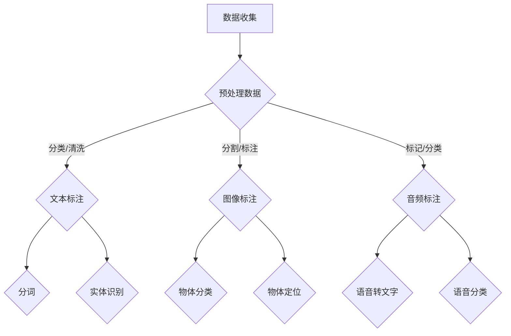

                 

在人工智能（AI）技术迅猛发展的今天，人们往往关注的是那些闪耀着光彩的算法、模型和研究成果，而数据标注这一幕后英雄却鲜少被提及。本文将深入探讨数据标注在人工智能发展中的重要角色，分析其核心概念、算法原理，以及在实际应用中的挑战与前景。

## 文章关键词
- 数据标注
- 人工智能
- 数据预处理
- 机器学习
- 标注工具

## 文章摘要
本文将详细阐述数据标注在人工智能领域中的关键作用，解释其核心概念和原理，并通过实际案例展示数据标注的流程和工具。同时，文章还将讨论数据标注在当前应用场景中的挑战和未来发展方向。

## 1. 背景介绍

人工智能（AI）的飞速发展离不开大量高质量的数据。然而，数据的收集、整理和标注过程却往往被忽视。数据标注，简单来说，就是将原始数据转化为机器学习模型可以理解和处理的有用数据的过程。这个过程包括对文本、图像、音频等多种类型的数据进行分类、标签、分割等操作。

数据标注在人工智能中的应用场景非常广泛，例如：

- **图像识别**：对图像中的物体进行分类、定位、分割。
- **自然语言处理**：对文本进行分词、标注实体、情感分析等。
- **语音识别**：对语音信号进行标注，生成文本或关键词。

随着深度学习技术的普及，数据标注的需求日益增加。高质量的数据标注是训练和优化机器学习模型的重要基础。然而，数据标注工作繁琐、耗时且需要专业知识，这使其成为人工智能领域的一项重要但被忽视的工作。

## 2. 核心概念与联系

### 2.1 数据标注的核心概念

数据标注主要包括以下几种类型：

- **文本标注**：对文本进行分词、实体识别、情感分析等操作。
- **图像标注**：对图像中的物体进行分类、定位、分割。
- **音频标注**：对音频信号进行标注，如语音转文字、语音分类等。

数据标注的关键概念包括：

- **标注类型**：根据任务需求选择合适的标注类型。
- **标注质量**：标注的准确性和一致性对模型训练效果至关重要。
- **标注工具**：选择合适的标注工具可以大大提高标注效率和准确性。

### 2.2 数据标注与人工智能的关联

数据标注是机器学习过程中不可或缺的一环。以下是数据标注与人工智能之间的关联：

- **数据质量**：高质量的数据是训练出优秀模型的先决条件。
- **模型优化**：通过数据标注，可以调整模型参数，提高模型性能。
- **应用拓展**：数据标注有助于拓展人工智能技术的应用场景。

### 2.3 Mermaid 流程图

以下是一个简单的 Mermaid 流程图，展示了数据标注的基本流程：



## 3. 核心算法原理 & 具体操作步骤

### 3.1 算法原理概述

数据标注的核心算法主要涉及以下几个方面：

- **文本标注**：使用分词算法将文本拆分成词汇单元，然后进行实体识别和情感分析。
- **图像标注**：使用目标检测算法对图像中的物体进行定位和分类。
- **音频标注**：使用语音识别算法将音频信号转化为文本，然后进行分类或情感分析。

### 3.2 算法步骤详解

以下是数据标注的常见步骤：

1. **数据收集**：从不同的来源收集原始数据。
2. **数据预处理**：清洗数据，去除噪音，确保数据质量。
3. **文本标注**：使用分词算法将文本拆分成词汇单元，然后进行实体识别和情感分析。
4. **图像标注**：使用目标检测算法对图像中的物体进行定位和分类。
5. **音频标注**：使用语音识别算法将音频信号转化为文本，然后进行分类或情感分析。
6. **数据融合**：将不同类型的数据进行整合，形成一个统一的数据集。

### 3.3 算法优缺点

每种标注算法都有其优缺点：

- **文本标注**：优点包括高准确率和可扩展性，缺点是处理速度较慢。
- **图像标注**：优点包括直观性和准确性，缺点是标注过程繁琐。
- **音频标注**：优点包括实时性和高效性，缺点是识别准确性受环境噪音影响较大。

### 3.4 算法应用领域

数据标注算法在多个领域都有广泛应用：

- **图像识别**：应用于人脸识别、物体检测、自动驾驶等领域。
- **自然语言处理**：应用于文本分类、情感分析、机器翻译等领域。
- **语音识别**：应用于语音助手、实时翻译、智能客服等领域。

## 4. 数学模型和公式 & 详细讲解 & 举例说明

### 4.1 数学模型构建

数据标注过程中，常用的数学模型包括：

- **朴素贝叶斯分类器**：用于文本分类和情感分析。
- **卷积神经网络（CNN）**：用于图像标注。
- **循环神经网络（RNN）**：用于文本标注和语音识别。

### 4.2 公式推导过程

以下是朴素贝叶斯分类器的公式推导：

- **条件概率**：P(A|B) 表示在事件 B 发生的条件下，事件 A 发生的概率。
- **贝叶斯定理**：P(A|B) = P(B|A)P(A) / P(B)。

### 4.3 案例分析与讲解

以下是一个简单的文本分类案例：

假设我们要对一篇文章进行情感分析，判断其是正面、负面还是中性。

1. **数据准备**：收集大量带有情感标签的文章，并使用分词算法将其拆分成词汇单元。
2. **特征提取**：将词汇单元转换为特征向量。
3. **模型训练**：使用朴素贝叶斯分类器进行模型训练。
4. **模型评估**：使用测试集对模型进行评估。

## 5. 项目实践：代码实例和详细解释说明

### 5.1 开发环境搭建

在开始数据标注项目之前，我们需要搭建一个合适的开发环境。以下是一个基本的开发环境搭建步骤：

1. 安装 Python 3.8 或更高版本。
2. 安装必要的库，如 TensorFlow、Keras、Scikit-learn 等。
3. 准备数据集，并进行预处理。

### 5.2 源代码详细实现

以下是一个简单的文本分类项目的 Python 代码实现：

```python
import numpy as np
import pandas as pd
from sklearn.model_selection import train_test_split
from sklearn.feature_extraction.text import TfidfVectorizer
from sklearn.naive_bayes import MultinomialNB
from sklearn.metrics import accuracy_score

# 读取数据集
data = pd.read_csv('data.csv')

# 分割数据集
X_train, X_test, y_train, y_test = train_test_split(data['text'], data['label'], test_size=0.2, random_state=42)

# 特征提取
vectorizer = TfidfVectorizer()
X_train_tfidf = vectorizer.fit_transform(X_train)
X_test_tfidf = vectorizer.transform(X_test)

# 模型训练
model = MultinomialNB()
model.fit(X_train_tfidf, y_train)

# 模型评估
predictions = model.predict(X_test_tfidf)
accuracy = accuracy_score(y_test, predictions)
print(f'Accuracy: {accuracy}')
```

### 5.3 代码解读与分析

1. **数据读取**：使用 pandas 读取数据集。
2. **数据分割**：使用 train_test_split 将数据集划分为训练集和测试集。
3. **特征提取**：使用 TfidfVectorizer 将文本转换为特征向量。
4. **模型训练**：使用 MultinomialNB 进行模型训练。
5. **模型评估**：使用 accuracy_score 计算模型准确率。

## 6. 实际应用场景

数据标注技术在各个领域都有广泛应用，以下是几个实际应用场景：

- **图像识别**：应用于人脸识别、物体检测、自动驾驶等领域。
- **自然语言处理**：应用于文本分类、情感分析、机器翻译等领域。
- **语音识别**：应用于语音助手、实时翻译、智能客服等领域。

### 6.1 图像识别应用

在图像识别领域，数据标注主要用于以下任务：

- **物体检测**：使用卷积神经网络（如 YOLO、SSD、Faster R-CNN）对图像中的物体进行检测和分类。
- **物体分割**：使用深度学习算法（如 U-Net、Mask R-CNN）对图像中的物体进行分割。

### 6.2 自然语言处理应用

在自然语言处理领域，数据标注主要用于以下任务：

- **文本分类**：使用朴素贝叶斯、支持向量机（SVM）、深度学习等方法对文本进行分类。
- **情感分析**：使用情感词典、深度学习等方法对文本进行情感分类。

### 6.3 语音识别应用

在语音识别领域，数据标注主要用于以下任务：

- **语音转文字**：使用深度学习算法（如 RNN、CTC）将语音信号转换为文本。
- **语音分类**：使用朴素贝叶斯、支持向量机等方法对语音进行分类。

## 7. 工具和资源推荐

以下是数据标注领域的一些常用工具和资源：

### 7.1 学习资源推荐

- 《机器学习实战》
- 《深度学习》（Goodfellow, Bengio, Courville）
- 《Python机器学习》

### 7.2 开发工具推荐

- **数据标注工具**：LabelImg、VGG Image Annotator、Labelbox。
- **文本处理工具**：NLTK、spaCy、Jieba。
- **语音处理工具**：PyTorch、TensorFlow、Kaldi。

### 7.3 相关论文推荐

- **文本分类**：TextCNN、TextRNN、BERT。
- **图像标注**：Faster R-CNN、Mask R-CNN、YOLO。
- **语音识别**：DeepSpeech、CTC、GRU。

## 8. 总结：未来发展趋势与挑战

### 8.1 研究成果总结

数据标注技术在人工智能领域取得了显著成果，为机器学习模型的训练和优化提供了重要支持。未来，数据标注技术将继续向自动化、智能化方向发展，提高标注效率和准确性。

### 8.2 未来发展趋势

- **自动化标注**：通过深度学习、自然语言处理等技术实现自动化标注。
- **协同标注**：利用众包、分布式计算等技术实现大规模、高效的标注。
- **多模态标注**：将文本、图像、语音等多种类型的数据进行融合标注。

### 8.3 面临的挑战

- **标注质量**：确保标注的准确性和一致性。
- **标注效率**：提高标注速度，降低人力成本。
- **标注工具**：开发更智能、更易用的标注工具。

### 8.4 研究展望

随着人工智能技术的不断进步，数据标注技术将在更多领域得到应用。未来，数据标注技术将朝着智能化、自动化、高效化的方向发展，为人工智能的发展提供有力支持。

## 9. 附录：常见问题与解答

### 9.1 什么是数据标注？

数据标注是将原始数据转化为机器学习模型可以理解和处理的有用数据的过程。数据标注包括对文本、图像、音频等多种类型的数据进行分类、标签、分割等操作。

### 9.2 数据标注有哪些类型？

数据标注主要包括文本标注、图像标注、音频标注等类型。

### 9.3 数据标注在人工智能中的应用有哪些？

数据标注在人工智能中的应用场景非常广泛，包括图像识别、自然语言处理、语音识别等领域。

### 9.4 如何提高数据标注的效率和质量？

提高数据标注的效率和质量可以通过以下方法实现：

- 使用自动化标注工具。
- 采用众包、分布式计算等技术实现大规模、高效的标注。
- 加强标注员的培训，提高标注技能。

## 作者署名

作者：禅与计算机程序设计艺术 / Zen and the Art of Computer Programming

以上就是关于数据标注在人工智能发展中的角色和技术细节的全面探讨。希望通过本文，能让更多的人关注到数据标注这一幕后英雄，并为其在人工智能领域中的重要性给予足够的重视。在未来的发展中，数据标注技术将继续发挥重要作用，为人工智能的发展提供有力支持。

