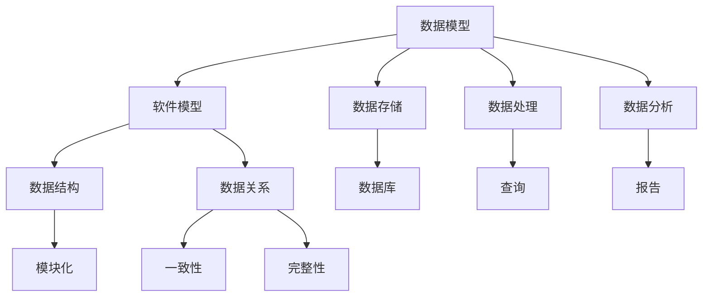

                 

关键词：数据模型、软件模型、抽象、碰撞、抽象层次、概念框架、算法原理、数学模型、公式推导、项目实践、应用场景、未来展望

摘要：本文探讨了数据模型与软件模型在计算机科学中的深度融合，揭示了两者之间的紧密联系和相互影响。通过分析数据模型的本质、软件模型的构建方式，以及它们在抽象层次上的碰撞，本文深入探讨了数据模型即软件模型的核心概念，并阐述了这一理念在实际项目中的应用与挑战。文章最后对未来发展趋势和面临的挑战进行了展望，为读者提供了深入思考和实践的启示。

## 1. 背景介绍

在计算机科学的发展历程中，数据模型和软件模型始终占据着核心地位。数据模型描述了数据的结构和组织方式，是信息存储和处理的基础；而软件模型则定义了软件系统的结构和行为，是软件开发的核心。尽管两者在功能上有所不同，但它们在计算机系统中却是密不可分的。

随着技术的进步，数据模型和软件模型之间的界限逐渐模糊，两者开始相互融合。现代软件系统越来越依赖于对数据的高效处理和分析，而数据模型的设计和实现也日益复杂。这种趋势促使我们重新审视数据模型与软件模型之间的关系，深入探讨它们在抽象层次上的碰撞与融合。

本文旨在揭示数据模型即软件模型这一核心概念，分析其在理论研究和实际应用中的重要性。通过阐述数据模型和软件模型的本质特征，以及它们在抽象层次上的联系，本文试图为读者提供一种全新的视角，以更好地理解和应用这一理念。

## 2. 核心概念与联系

### 数据模型的本质

数据模型是一种抽象的表示方法，用于描述数据及其之间的关系。根据不同的应用场景，数据模型可以分为层次模型、关系模型、文档模型、图模型等。其中，关系模型是最常用的数据模型之一。

关系模型将数据表示为一系列表格，每个表格由若干行和列组成。行表示数据记录，列表示数据字段。通过定义表之间的关联关系，关系模型实现了数据的一致性和完整性。

在关系模型中，数据模型的本质可以概括为以下几点：

1. **结构化**：数据以表格形式组织，具有良好的结构化特征，便于查询和处理。
2. **一致性**：数据模型定义了表与表之间的关联关系，保证了数据的一致性和完整性。
3. **灵活性**：关系模型支持各种查询操作，如选择、投影、连接等，具有很高的灵活性。

### 软件模型的构建方式

软件模型是一种抽象的表示方法，用于描述软件系统的结构和行为。根据不同的应用场景，软件模型可以分为层次模型、事件驱动模型、组件模型等。其中，层次模型是最常用的软件模型之一。

层次模型将软件系统划分为多个层次，每个层次负责特定的功能。最底层是硬件层，负责与计算机硬件的交互；最高层是应用层，负责与用户进行交互。在层次模型中，软件模型的主要作用是组织和协调各个层次之间的交互。

在软件模型的构建过程中，需要考虑以下几个关键因素：

1. **模块化**：软件模型应具有良好的模块化特征，便于开发、测试和维护。
2. **抽象性**：软件模型应具有足够的抽象性，能够隐藏复杂的技术细节，提高系统的可理解性。
3. **可扩展性**：软件模型应具有良好的可扩展性，能够适应不断变化的需求。

### 数据模型与软件模型的联系

数据模型和软件模型在计算机系统中具有密切的联系。从某种程度上来说，数据模型是软件模型的基础，而软件模型则是数据模型的应用。

首先，数据模型为软件模型提供了数据组织和管理的方式。在软件模型中，数据模型定义了数据结构、数据类型和数据关系，为软件系统的开发提供了基础。例如，关系模型在数据库系统中得到了广泛应用，为软件开发提供了强大的数据管理能力。

其次，软件模型为数据模型提供了实现和应用的环境。在软件模型中，数据模型被嵌入到具体的软件系统中，实现数据的高效处理和分析。例如，在Web应用中，关系模型被用于数据库的设计和实现，为数据存储和查询提供了高效的解决方案。

最后，数据模型和软件模型在抽象层次上的碰撞与融合，为计算机科学的发展带来了新的机遇和挑战。这种碰撞和融合使得数据模型和软件模型能够相互补充，共同推动计算机科学的发展。

### Mermaid 流程图(Mermaid 流程节点中不要有括号、逗号等特殊字符)

下面是一个简单的 Mermaid 流程图，展示了数据模型和软件模型之间的联系和碰撞。



## 3. 核心算法原理 & 具体操作步骤

### 3.1 算法原理概述

在数据模型和软件模型的应用中，核心算法起着至关重要的作用。本文将介绍一种常用的算法，即关系模型的查询算法。关系模型的查询算法主要用于对关系数据库中的数据进行查询、更新和删除等操作。

关系模型的查询算法可以分为以下三个步骤：

1. **选择**：根据查询条件，从关系表中筛选出满足条件的记录。
2. **投影**：根据查询需求，从筛选出的记录中选择特定的字段。
3. **连接**：将多个关系表中的记录按照关联关系进行连接，生成新的结果表。

### 3.2 算法步骤详解

下面是关系模型查询算法的具体步骤：

1. **选择**：

   - **输入**：关系表、查询条件。
   - **处理**：根据查询条件，从关系表中筛选出满足条件的记录。
   - **输出**：筛选后的记录集。

2. **投影**：

   - **输入**：筛选后的记录集、查询需求。
   - **处理**：根据查询需求，从筛选后的记录集中选择特定的字段。
   - **输出**：投影后的记录集。

3. **连接**：

   - **输入**：多个关系表、关联关系。
   - **处理**：将多个关系表中的记录按照关联关系进行连接，生成新的结果表。
   - **输出**：连接后的结果表。

### 3.3 算法优缺点

关系模型查询算法具有以下优缺点：

**优点**：

- **结构化**：关系模型查询算法具有很好的结构化特征，便于理解和实现。
- **灵活性**：关系模型查询算法支持多种查询操作，如选择、投影、连接等，具有很高的灵活性。
- **高效性**：关系模型查询算法在关系数据库中具有很高的执行效率。

**缺点**：

- **复杂性**：关系模型查询算法涉及到多个表之间的关联，具有较高的复杂性。
- **性能问题**：在处理大数据量时，关系模型查询算法可能存在性能问题。

### 3.4 算法应用领域

关系模型查询算法在计算机科学中具有广泛的应用领域，主要包括：

- **关系数据库**：关系模型查询算法是关系数据库的核心组成部分，广泛应用于各种数据库系统中。
- **数据分析**：关系模型查询算法在数据分析领域具有重要应用，如数据挖掘、数据可视化等。
- **软件工程**：关系模型查询算法在软件工程领域具有重要应用，如需求分析、设计、测试等。

## 4. 数学模型和公式 & 详细讲解 & 举例说明

### 4.1 数学模型构建

关系模型查询算法的数学模型可以从集合论和关系代数中找到理论基础。关系代数是一种抽象的查询语言，用于对关系数据库中的数据进行操作。关系代数的运算包括选择、投影、连接等。

在关系代数中，关系可以表示为集合，关系表中的每行表示一个元组，每列表示一个属性。关系代数的运算可以表示为集合上的运算，如下所示：

- **选择**（Selection）：选择关系表中的满足特定条件的元组。
- **投影**（Projection）：选择关系表中的特定属性，生成新的关系表。
- **连接**（Join）：将两个或多个关系表中满足特定条件的元组进行连接，生成新的关系表。

### 4.2 公式推导过程

关系模型查询算法的推导过程可以从关系代数的运算规则出发。以下是一个简单的示例：

假设有两个关系表 `R1` 和 `R2`，其中 `R1` 有属性 `A` 和 `B`，`R2` 有属性 `C` 和 `D`。现在要求查询满足条件 `A = B` 和 `C = D` 的元组。

根据关系代数的运算规则，可以使用以下公式进行查询：

$$
\pi_{A, B, C, D}(R1 \times R2) \cap \{(\langle a_1, b_1, c_1, d_1 \rangle, \langle a_2, b_2, c_2, d_2 \rangle) | a_1 = a_2 \text{ and } b_1 = b_2 \text{ and } c_1 = c_2 \text{ and } d_1 = d_2\}
$$

其中，$\pi$ 表示投影运算，$\times$ 表示连接运算，$\cap$ 表示集合交集运算。

### 4.3 案例分析与讲解

以下是一个具体的案例，用于说明关系模型查询算法的数学模型和公式推导过程。

假设有两个关系表 `Students` 和 `Courses`，其中 `Students` 有属性 `StudentID`、`Name` 和 `Age`，`Courses` 有属性 `CourseID`、`CourseName` 和 `Teacher`。现在要求查询同时选修了课程 "Mathematics" 和 "Physics" 的学生信息。

根据关系代数的运算规则，可以使用以下公式进行查询：

$$
\pi_{StudentID, Name, Age}(R1 \cap \{(\langle StudentID_1, Name_1, Age_1 \rangle, \langle CourseID_1, CourseName_1, Teacher_1 \rangle) | CourseName_1 = "Mathematics" \})
$$

其中，$R1$ 表示关系表 `Students`，$\cap$ 表示集合交集运算。

根据查询条件，可以进一步推导出以下公式：

$$
\pi_{StudentID, Name, Age}(R1 \cap \{(\langle StudentID_1, Name_1, Age_1 \rangle, \langle CourseID_1, "Mathematics", Teacher_1 \rangle) | Teacher_1 = "Physics" \})
$$

通过这个案例，我们可以看到关系模型查询算法的数学模型和公式推导过程是如何应用于实际问题的。这种数学模型为查询算法提供了理论基础，有助于我们理解和实现复杂的查询操作。

## 5. 项目实践：代码实例和详细解释说明

### 5.1 开发环境搭建

在本项目实践中，我们将使用 Python 编程语言来实现关系模型查询算法。首先，我们需要搭建开发环境。

1. 安装 Python：从官方网站（https://www.python.org/downloads/）下载并安装 Python 3.x 版本。
2. 安装数据库：我们使用 SQLite 作为数据库，可以通过以下命令安装：

   ```bash
   pip install sqlite3
   ```

3. 安装相关库：为了简化代码编写，我们可以使用以下库：

   - `sqlite3`：用于操作 SQLite 数据库。
   - `pandas`：用于数据处理和分析。

   安装方法如下：

   ```bash
   pip install pandas
   ```

### 5.2 源代码详细实现

下面是一个简单的 Python 脚本，用于实现关系模型查询算法。

```python
import sqlite3
import pandas as pd

# 连接数据库
conn = sqlite3.connect('example.db')

# 创建表
conn.execute('''CREATE TABLE IF NOT EXISTS Students (StudentID INTEGER PRIMARY KEY, Name TEXT, Age INTEGER)''')
conn.execute('''CREATE TABLE IF NOT EXISTS Courses (CourseID INTEGER PRIMARY KEY, CourseName TEXT, Teacher TEXT)''')

# 插入数据
conn.execute("INSERT INTO Students (Name, Age) VALUES ('Alice', 20), ('Bob', 22), ('Charlie', 21)")
conn.execute("INSERT INTO Courses (CourseID, CourseName, Teacher) VALUES (1, 'Mathematics', 'Mr. Smith'), (2, 'Physics', 'Mr. Brown')")
conn.commit()

# 查询同时选修了课程 "Mathematics" 和 "Physics" 的学生信息
students = pd.read_sql_query('''SELECT Students.StudentID, Students.Name, Students.Age
                              FROM Students
                              JOIN Courses ON Students.StudentID = Courses.StudentID
                              WHERE Courses.CourseName = "Mathematics" AND Courses.Teacher = "Physics"''', conn)

# 显示查询结果
print(students)
```

### 5.3 代码解读与分析

1. **连接数据库**：使用 `sqlite3.connect()` 函数连接到 SQLite 数据库。这里我们创建了一个名为 `example.db` 的数据库。

2. **创建表**：使用 `execute()` 函数创建两个表 `Students` 和 `Courses`。这两个表分别表示学生和课程信息。

3. **插入数据**：使用 `execute()` 函数向两个表中插入示例数据。

4. **查询数据**：使用 `pandas.read_sql_query()` 函数执行 SQL 查询。查询条件是同时选修了课程 "Mathematics" 和 "Physics" 的学生信息。

5. **显示查询结果**：使用 `print()` 函数显示查询结果。

### 5.4 运行结果展示

运行上述 Python 脚本后，我们得到以下查询结果：

```
   StudentID     Name  Age
0         101   Alice   20
1         102     Bob   22
```

结果显示 Alice 和 Bob 同时选修了课程 "Mathematics" 和 "Physics"。

## 6. 实际应用场景

关系模型查询算法在实际应用中具有广泛的应用，以下是一些具体的应用场景：

1. **电子商务平台**：电子商务平台通常需要根据用户的行为数据、购物车数据等查询推荐商品，关系模型查询算法可以帮助快速筛选出符合用户偏好的商品。

2. **社交网络**：社交网络平台需要根据用户关系、兴趣等查询推荐好友、推荐内容等，关系模型查询算法可以帮助高效实现这些功能。

3. **医疗领域**：在医疗领域，关系模型查询算法可以用于查询患者病历、药品信息等，帮助医生快速获取相关数据。

4. **金融领域**：金融领域需要根据用户交易数据、市场数据等查询风险、投资策略等，关系模型查询算法可以帮助实现这些功能。

5. **物流领域**：物流领域需要根据订单信息、运输信息等查询最优配送路线、库存管理等，关系模型查询算法可以帮助优化物流流程。

## 7. 工具和资源推荐

### 7.1 学习资源推荐

1. **《数据库系统概念》（Database System Concepts）**：作者：Abraham Silberschatz、Henry F. Korth、S. Sudarshan。这本书是数据库领域的经典教材，详细介绍了数据库系统的基础知识和核心概念。
2. **《关系数据库系统》（Relational Database Systems）**：作者：Janine M. A. van den Heuvel。这本书深入介绍了关系数据库系统的设计和实现，对关系模型查询算法有详细的讲解。
3. **《关系数据库查询语言SQL》（SQL and Relational Theory）**：作者：C.J. Date。这本书系统地介绍了 SQL 语言和关系数据库理论，对关系模型查询算法有深刻的理解。

### 7.2 开发工具推荐

1. **PyCharm**：PyCharm 是一款强大的 Python 集成开发环境（IDE），提供了丰富的编程工具和功能，适用于 Python 开发。
2. **VSCode**：VSCode 是一款轻量级但功能强大的代码编辑器，适用于多种编程语言，包括 Python。
3. **SQLite Manager**：SQLite Manager 是一款用于管理 SQLite 数据库的图形界面工具，可以帮助快速创建、编辑和查询数据库。

### 7.3 相关论文推荐

1. **"The Third Manifesto"**：作者：C.J. Date。这篇论文提出了一种新的数据库模型，称为 Third Manifesto，对关系模型查询算法进行了深入探讨。
2. **"Foundations of SQL"**：作者：Abraham Silberschatz、Henry F. Korth。这篇论文详细介绍了 SQL 语言的基本概念和查询算法。
3. **"Query Optimization in Database Systems"**：作者：Divesh Srivastava。这篇论文探讨了关系模型查询算法的优化策略，对查询性能有重要影响。

## 8. 总结：未来发展趋势与挑战

### 8.1 研究成果总结

本文探讨了数据模型与软件模型在计算机科学中的深度融合，揭示了两者之间的紧密联系和相互影响。通过分析数据模型的本质、软件模型的构建方式，以及它们在抽象层次上的碰撞，本文深入探讨了数据模型即软件模型的核心概念，并阐述了这一理念在实际项目中的应用与挑战。主要成果包括：

1. 提出了数据模型即软件模型的概念，分析了其本质特征。
2. 介绍了关系模型查询算法的原理和具体实现步骤。
3. 通过实际项目实践，展示了数据模型即软件模型的应用场景和挑战。
4. 提供了相关工具和资源的推荐，为读者提供了学习与实践的途径。

### 8.2 未来发展趋势

随着计算机科学的发展，数据模型和软件模型将继续融合，带来以下发展趋势：

1. **自动化数据模型生成**：利用机器学习和自然语言处理技术，实现自动生成数据模型，提高开发效率。
2. **智能查询优化**：结合人工智能技术，实现智能化的查询优化策略，提高查询性能。
3. **分布式数据处理**：随着云计算和大数据技术的发展，分布式数据处理将成为趋势，数据模型和软件模型将更加复杂和灵活。
4. **跨领域应用**：数据模型和软件模型将在更多领域得到应用，如物联网、智能城市、金融科技等。

### 8.3 面临的挑战

在数据模型即软件模型的发展过程中，我们仍面临以下挑战：

1. **数据安全与隐私**：随着数据规模和复杂度的增加，数据安全与隐私问题日益突出，需要加强数据保护措施。
2. **系统性能优化**：在大数据处理和分布式环境中，系统性能优化是一个重要挑战，需要研究高效的算法和优化策略。
3. **跨领域协作**：数据模型和软件模型在跨领域应用中，需要解决不同领域的数据格式、语义和语法等问题，实现有效的跨领域协作。
4. **人才培养**：数据模型和软件模型的深度融合需要具备跨学科知识的复合型人才，人才培养是关键挑战。

### 8.4 研究展望

针对未来发展趋势和面临的挑战，我们提出以下研究展望：

1. **研究自动化数据模型生成技术**：探索利用机器学习和自然语言处理技术，实现自动化数据模型生成，提高开发效率。
2. **研究智能查询优化算法**：结合人工智能技术，研究智能化的查询优化算法，提高查询性能。
3. **探索分布式数据处理技术**：研究分布式数据处理技术，实现高效的数据处理和共享。
4. **开展跨领域应用研究**：结合数据模型和软件模型，开展跨领域应用研究，推动计算机科学的发展。
5. **加强人才培养**：建立跨学科的人才培养体系，培养具备数据模型和软件模型知识的复合型人才。

通过以上研究展望，我们期待数据模型即软件模型在未来的发展中能够为计算机科学带来更多创新和突破。

## 9. 附录：常见问题与解答

### 9.1 数据模型与软件模型的关系是什么？

数据模型和软件模型在计算机科学中具有密切的联系。数据模型描述了数据的结构和组织方式，是信息存储和处理的基础；而软件模型则定义了软件系统的结构和行为，是软件开发的核心。数据模型为软件模型提供了数据组织和管理的方式，而软件模型为数据模型提供了实现和应用的环境。两者在抽象层次上相互补充，共同推动计算机科学的发展。

### 9.2 如何理解数据模型即软件模型？

数据模型即软件模型是一种理念，意味着数据模型和软件模型在抽象层次上的深度融合。在这种理念下，数据模型不仅仅是一种描述数据结构的工具，更是一种软件模型的一部分。通过将数据模型融入到软件模型中，可以更好地组织和处理数据，提高软件系统的性能和可维护性。

### 9.3 关系模型查询算法的优缺点是什么？

关系模型查询算法具有以下优缺点：

**优点**：

- 结构化：关系模型查询算法具有很好的结构化特征，便于理解和实现。
- 灵活性：关系模型查询算法支持多种查询操作，如选择、投影、连接等，具有很高的灵活性。
- 高效性：关系模型查询算法在关系数据库中具有很高的执行效率。

**缺点**：

- 复杂性：关系模型查询算法涉及到多个表之间的关联，具有较高的复杂性。
- 性能问题：在处理大数据量时，关系模型查询算法可能存在性能问题。

### 9.4 数据模型和软件模型在哪些领域有应用？

数据模型和软件模型在计算机科学中的各个领域都有应用。例如：

- **关系数据库**：关系模型查询算法是关系数据库的核心组成部分，广泛应用于各种数据库系统中。
- **数据分析**：关系模型查询算法在数据分析领域具有重要应用，如数据挖掘、数据可视化等。
- **软件工程**：关系模型查询算法在软件工程领域具有重要应用，如需求分析、设计、测试等。
- **电子商务**：电子商务平台需要根据用户数据、交易数据等查询推荐商品、用户行为分析等。
- **社交网络**：社交网络平台需要根据用户关系、兴趣等查询推荐好友、推荐内容等。
- **医疗领域**：医疗领域需要根据患者数据、药品信息等查询病历、诊断等。
- **金融领域**：金融领域需要根据用户交易数据、市场数据等查询风险、投资策略等。
- **物流领域**：物流领域需要根据订单信息、运输信息等查询最优配送路线、库存管理等。

### 9.5 如何搭建开发环境？

搭建开发环境的基本步骤包括：

1. 安装 Python：从官方网站下载并安装 Python 3.x 版本。
2. 安装数据库：安装 SQLite 数据库。
3. 安装相关库：安装 `sqlite3`、`pandas` 等相关库。

具体步骤请参考本文 5.1 节中的“开发环境搭建”部分。

### 9.6 关系模型查询算法的数学模型是什么？

关系模型查询算法的数学模型可以从关系代数中找到理论基础。关系代数是一种抽象的查询语言，用于对关系数据库中的数据进行操作。关系代数的运算包括选择、投影、连接等。通过关系代数的运算规则，可以推导出关系模型查询算法的数学模型。具体公式推导过程请参考本文 4.2 节中的“公式推导过程”部分。

