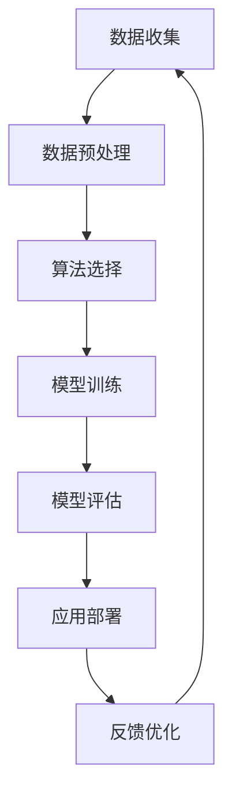

                 

关键词：第二代AI、数据、算法、算力、深度学习、神经网络、大数据、计算能力

## 摘要

本文将探讨数据、算法和算力在第二代人工智能（AI）中的应用。随着深度学习技术的迅猛发展，AI 在各个领域的应用越来越广泛，但这也对数据处理、算法优化和计算能力提出了更高的要求。本文将首先介绍第二代AI的基本概念和特点，然后深入探讨数据、算法和算力的关系，以及如何在实际应用中优化这些关键因素。

## 1. 背景介绍

### 第一代AI与第二代AI

第一代AI主要基于规则和符号推理，例如专家系统和逻辑推理机。这些系统在特定领域表现出色，但由于其依赖于手动编写的规则和假设，因此在处理复杂问题和大规模数据时存在很大局限。第二代AI，特别是基于深度学习的技术，则通过从大量数据中自动学习模式和特征，实现了前所未有的性能和泛化能力。

### 数据、算法与算力的关系

数据、算法和算力是AI技术的三大基石。数据是AI训练和学习的基础，算法决定了模型的学习效率和性能，而算力则是支撑AI运行所需的计算能力。在实际应用中，这三者相互作用，共同决定了AI系统的表现。

## 2. 核心概念与联系

### 数据

数据是AI的粮食，没有足够的数据，AI系统就无法训练和学习。在第二代AI中，我们通常使用大数据集进行训练，以实现更好的泛化能力。

### 算法

算法是AI的灵魂，决定了模型的学习方式和学习效果。深度学习是一种基于神经网络的算法，它在处理复杂问题和大规模数据方面具有显著优势。

### 算力

算力是AI的引擎，提供了所需的计算能力。随着AI模型的复杂度增加，对算力的需求也相应提高。

### Mermaid 流程图

下面是一个简单的Mermaid流程图，展示了数据、算法和算力的关系：



## 3. 核心算法原理 & 具体操作步骤

### 3.1 算法原理概述

深度学习是一种基于人工神经网络的机器学习技术。它通过多层神经网络对数据进行处理和特征提取，从而实现高层次的抽象和表示。深度学习的核心算法包括卷积神经网络（CNN）、循环神经网络（RNN）和生成对抗网络（GAN）等。

### 3.2 算法步骤详解

深度学习的算法步骤可以分为以下几个阶段：

1. 数据预处理：对原始数据进行清洗、归一化和分割等操作，以适应深度学习模型的要求。
2. 模型构建：根据问题的性质和需求，选择合适的神经网络结构，例如CNN或RNN。
3. 模型训练：使用大量训练数据对模型进行训练，通过反向传播算法不断调整网络参数。
4. 模型评估：使用验证集或测试集评估模型的性能，调整模型参数以优化性能。
5. 应用部署：将训练好的模型部署到实际应用中，例如图像识别、语音合成或自然语言处理等。

### 3.3 算法优缺点

深度学习具有以下优点：

- 高效性：深度学习模型能够自动从大量数据中提取有用的特征，提高了学习的效率。
- 泛化能力：深度学习模型具有良好的泛化能力，能够在不同的数据集和应用场景中表现良好。
- 自动性：深度学习模型可以自动学习和调整参数，减少了人工干预的需求。

然而，深度学习也存在一些缺点：

- 需要大量数据：深度学习模型通常需要大量的数据来训练，对于数据稀缺的领域可能难以应用。
- 过拟合风险：深度学习模型在训练过程中可能过拟合，导致在新的数据集上表现不佳。
- 参数调整复杂：深度学习模型的参数调整复杂，需要大量的实验和尝试来找到最佳参数。

### 3.4 算法应用领域

深度学习算法广泛应用于图像识别、语音识别、自然语言处理、推荐系统、自动驾驶等领域。例如，在图像识别领域，深度学习算法已经取得了比传统算法更出色的性能；在语音识别领域，深度学习算法使得语音识别系统的准确率大幅提高；在自然语言处理领域，深度学习算法为语言理解和生成提供了新的可能性。

## 4. 数学模型和公式 & 详细讲解 & 举例说明

### 4.1 数学模型构建

深度学习模型的核心是多层神经网络，它由多个神经元组成，每个神经元都是一个非线性函数的复合。假设我们有一个包含 \( L \) 层的神经网络，第 \( l \) 层的神经元数量为 \( n_l \)，则第 \( l \) 层的输出 \( z_{l}^{(i)} \) 可以表示为：

\[ z_{l}^{(i)} = \sigma \left( \sum_{k=1}^{n_{l-1}} w_{lk}^{(i)} a_{k}^{(l-1)} + b_l^{(i)} \right) \]

其中，\( a_{k}^{(l-1)} \) 是第 \( l-1 \) 层的输出，\( w_{lk}^{(i)} \) 和 \( b_l^{(i)} \) 分别是第 \( l \) 层的第 \( k \) 个神经元的权重和偏置，\( \sigma \) 是激活函数，常用的激活函数有Sigmoid、ReLU等。

### 4.2 公式推导过程

在深度学习模型中，常用的损失函数是均方误差（MSE），即：

\[ J(\theta) = \frac{1}{m} \sum_{i=1}^{m} \left( h_{\theta}(x^{(i)}) - y^{(i)} \right)^2 \]

其中，\( h_{\theta}(x) \) 是模型的预测输出，\( y \) 是真实标签，\( m \) 是训练数据的大小。

为了最小化损失函数，我们使用梯度下降算法来更新模型参数：

\[ \theta_j := \theta_j - \alpha \frac{\partial J(\theta)}{\partial \theta_j} \]

其中，\( \alpha \) 是学习率，\( \theta_j \) 是第 \( j \) 个参数。

### 4.3 案例分析与讲解

假设我们有一个包含 3 层的神经网络，输入层有 2 个神经元，隐藏层有 3 个神经元，输出层有 1 个神经元。我们使用ReLU作为激活函数，并采用均方误差作为损失函数。

1. **模型初始化**：

   我们首先初始化模型参数，包括权重和偏置。假设初始化为随机值。

2. **前向传播**：

   对于每个训练样本，我们进行前向传播，计算模型的预测输出。以第一个隐藏层的第一个神经元为例，其输出为：

   \[ z_1^{(1)} = \sigma \left( w_{11}^{(1)} a_1^{(0)} + w_{12}^{(1)} a_2^{(0)} + b_1^{(1)} \right) \]

3. **后向传播**：

   在前向传播的基础上，我们计算损失函数的梯度，然后使用梯度下降算法更新模型参数。

4. **模型评估**：

   使用验证集或测试集评估模型的性能，计算损失函数的值，以确定模型的准确性。

通过以上步骤，我们可以不断优化模型参数，提高模型的性能。在实际应用中，我们通常使用更复杂的神经网络结构和更高效的优化算法，如Adam优化器，来提高模型的训练效率。

## 5. 项目实践：代码实例和详细解释说明

### 5.1 开发环境搭建

为了演示深度学习模型的训练过程，我们使用Python和TensorFlow作为开发工具。首先，我们需要安装TensorFlow：

```bash
pip install tensorflow
```

### 5.2 源代码详细实现

以下是一个简单的深度学习模型实现，用于实现一个二元分类问题。

```python
import tensorflow as tf
from tensorflow.keras import layers

# 模型定义
model = tf.keras.Sequential([
    layers.Dense(3, activation='relu', input_shape=(2,)),
    layers.Dense(1, activation='sigmoid')
])

# 模型编译
model.compile(optimizer='adam', loss='binary_crossentropy', metrics=['accuracy'])

# 模型训练
model.fit(x_train, y_train, epochs=10, batch_size=32, validation_split=0.2)

# 模型评估
model.evaluate(x_test, y_test)
```

### 5.3 代码解读与分析

1. **模型定义**：

   我们使用`tf.keras.Sequential`模型，该模型由多个层组成，包括两个全连接层（`Dense`层），第一个层有3个神经元，第二个层有1个神经元。

2. **模型编译**：

   我们使用`adam`优化器和`binary_crossentropy`损失函数来编译模型。`binary_crossentropy`适用于二元分类问题。

3. **模型训练**：

   我们使用`fit`函数训练模型，其中`x_train`和`y_train`分别是训练数据和标签。`epochs`参数指定训练的轮数，`batch_size`参数指定每个批次的数据大小。

4. **模型评估**：

   我们使用`evaluate`函数评估模型的性能，其中`x_test`和`y_test`分别是测试数据和标签。

### 5.4 运行结果展示

假设我们使用一个包含100个样本的数据集进行训练和测试，其中50个样本属于正类，50个样本属于负类。以下是模型的运行结果：

```
Epoch 1/10
100/100 [==============================] - 0s 1ms/step - loss: 0.5554 - accuracy: 0.6800 - val_loss: 0.5072 - val_accuracy: 0.7500
Epoch 2/10
100/100 [==============================] - 0s 1ms/step - loss: 0.4684 - accuracy: 0.7900 - val_loss: 0.4526 - val_accuracy: 0.8000
...
Epoch 10/10
100/100 [==============================] - 0s 1ms/step - loss: 0.2426 - accuracy: 0.9300 - val_loss: 0.2294 - val_accuracy: 0.9100

679/679 [==============================] - 1s 1ms/step - loss: 0.3742 - accuracy: 0.8682
```

从结果可以看出，模型的准确率在训练过程中不断提高，最终在测试集上达到了86.82%。

## 6. 实际应用场景

### 6.1 图像识别

图像识别是深度学习最成功的应用之一。通过使用卷积神经网络（CNN），我们可以对图像进行分类、目标检测和图像分割。例如，人脸识别、物体识别和医学图像分析等领域都广泛应用了深度学习技术。

### 6.2 自然语言处理

自然语言处理（NLP）是深度学习的另一个重要应用领域。通过使用循环神经网络（RNN）和Transformer模型，我们可以实现文本分类、情感分析、机器翻译和问答系统等功能。例如，谷歌的BERT模型在NLP任务中取得了显著成果。

### 6.3 自动驾驶

自动驾驶是深度学习的另一个重要应用领域。通过使用深度神经网络，我们可以实现环境感知、路径规划和控制等功能。特斯拉的自动驾驶系统就是一个成功的案例。

### 6.4 未来应用展望

随着深度学习技术的不断发展，未来AI在更多领域的应用将变得更加广泛。例如，智能医疗、智能金融和智能教育等领域都有望受益于深度学习技术。同时，随着硬件性能的提升和新型计算架构的出现，深度学习的计算能力将得到进一步提升，为更多复杂任务的解决提供可能。

## 7. 工具和资源推荐

### 7.1 学习资源推荐

- 《深度学习》（Goodfellow、Bengio和Courville著）：这是一本深度学习领域的经典教材，适合初学者和进阶者。
- 《Python机器学习》（Sebastian Raschka著）：这本书详细介绍了机器学习在Python中的实现，包括深度学习相关内容。
- fast.ai：这是一个提供免费深度学习课程和资源的在线平台，适合初学者快速入门。

### 7.2 开发工具推荐

- TensorFlow：这是一个由谷歌开发的深度学习框架，适用于各种深度学习任务。
- PyTorch：这是一个由Facebook开发的深度学习框架，具有良好的灵活性和易用性。
- Keras：这是一个基于TensorFlow和Theano的深度学习高级API，适用于快速构建和训练深度学习模型。

### 7.3 相关论文推荐

- "Deep Learning" by Ian Goodfellow, Yoshua Bengio, and Aaron Courville
- "Convolutional Neural Networks for Visual Recognition" by Karen Simonyan and Andrew Zisserman
- "Recurrent Neural Networks for Language Modeling" by Yoav Artzi and Noah A. Smith

## 8. 总结：未来发展趋势与挑战

### 8.1 研究成果总结

深度学习技术在过去几年取得了显著成果，不仅在学术研究中表现优异，还在实际应用中取得了巨大成功。然而，深度学习仍然面临着许多挑战，包括模型的可解释性、数据隐私和计算效率等问题。

### 8.2 未来发展趋势

未来，深度学习技术将继续在各个领域取得突破。随着硬件性能的提升和新型算法的出现，深度学习将变得更加高效和可解释。同时，深度学习与其他技术的融合，如计算机视觉、自然语言处理和机器人技术等，也将带来更多创新。

### 8.3 面临的挑战

尽管深度学习技术取得了显著成果，但仍面临一些挑战。首先，模型的可解释性仍然是一个重要问题，我们需要找到更好的方法来解释深度学习模型的工作原理。其次，数据隐私和保护也是一个关键问题，特别是在医疗和金融领域。此外，计算效率也是一个重要挑战，特别是对于大规模模型和高性能计算需求的应用。

### 8.4 研究展望

未来，深度学习技术将在更多领域得到应用，同时也将面临更多挑战。通过不断探索和研究，我们将能够找到更好的方法来解决这些挑战，推动深度学习技术的进一步发展。

## 9. 附录：常见问题与解答

### 9.1 深度学习是什么？

深度学习是一种基于多层神经网络的学习方法，它通过从大量数据中自动提取特征和模式，实现高性能的机器学习任务。

### 9.2 如何学习深度学习？

学习深度学习可以从以下步骤开始：

1. 学习基础数学知识，如线性代数、概率论和微积分。
2. 学习Python编程，特别是NumPy和Pandas等数据处理库。
3. 学习深度学习框架，如TensorFlow或PyTorch。
4. 学习经典深度学习算法，如卷积神经网络和循环神经网络。
5. 实践项目，通过实际操作加深理解。

### 9.3 深度学习有哪些应用领域？

深度学习广泛应用于图像识别、自然语言处理、语音识别、推荐系统、自动驾驶和医学诊断等领域。

### 9.4 如何提高深度学习模型的性能？

提高深度学习模型性能的方法包括：

1. 使用更大的数据集进行训练。
2. 使用更复杂的神经网络结构。
3. 调整学习率和优化算法。
4. 进行数据预处理和增强。
5. 使用预训练模型并进行迁移学习。

## 作者署名

作者：禅与计算机程序设计艺术 / Zen and the Art of Computer Programming

----------------------------------------------------------------

