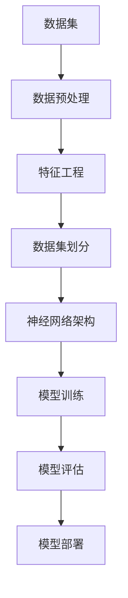
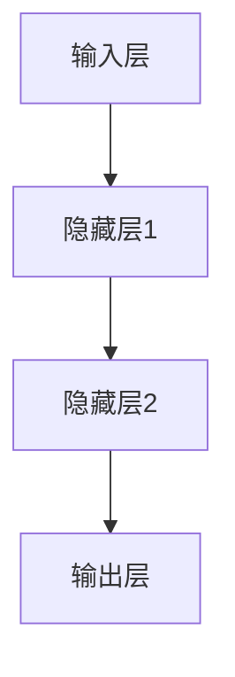

                 

关键词：数据集、神经网络、架构、软件2.0、源代码

> 摘要：本文深入探讨了数据集和神经网络架构在软件2.0时代的应用，详细分析了数据集的准备与优化方法，以及神经网络架构的设计与实现。通过实例和详细解释，展示了如何将这两个关键要素融合到软件开发的源代码中，为读者提供了关于如何构建高效、智能的软件系统的见解。

## 1. 背景介绍

在过去的几十年中，计算机科学经历了飞速的发展。从最初的软件1.0时代，以传统编程和结构化设计为核心，到软件2.0时代，以大数据和人工智能为驱动力，我们的软件系统逐渐变得更加智能化和自适应。这个转变背后的关键因素之一就是数据集的优化和神经网络架构的创新。

数据集是机器学习算法的基础，其质量和规模直接影响模型的性能。同时，神经网络架构作为人工智能的核心，其设计和实现方法也在不断演进。在软件2.0时代，如何有效地整合数据集和神经网络架构，成为软件开发的关键问题。

本文将围绕这一主题，首先介绍数据集的准备与优化方法，然后深入探讨神经网络架构的设计与实现，最后通过实际项目实例，展示如何在源代码中实现数据集和神经网络架构的有机结合。

## 2. 核心概念与联系

为了更好地理解数据集和神经网络架构在软件2.0中的角色，我们需要先明确几个核心概念，并展示它们之间的联系。以下是一个简化的 Mermaid 流程图，用于描述这些概念及其关系：



### 2.1 数据集

数据集是机器学习的基石。它由一组具有代表性的数据组成，用于训练和评估机器学习模型。一个高质量的数据集应该具有以下特征：

- **代表性**：数据集应该涵盖不同的场景和情境，以使模型具有泛化能力。
- **准确性**：数据集中的数据应该真实、准确，以避免模型学习到错误的信息。
- **完整性**：数据集应该包含足够的样本，以避免模型过拟合。

### 2.2 数据预处理

数据预处理是数据集准备的关键步骤。它包括以下任务：

- **数据清洗**：移除或更正数据集中的错误或异常值。
- **数据归一化**：将数据缩放到相同的范围，以便算法能够更好地处理。
- **缺失值处理**：填补或删除缺失的数据。

### 2.3 特征工程

特征工程是提高数据集质量的关键环节。它包括以下任务：

- **特征选择**：选择对模型预测最有影响力的特征。
- **特征构造**：创建新的特征，以提高模型的性能。

### 2.4 数据集划分

数据集划分是将数据集分为训练集、验证集和测试集的过程。通常采用以下策略：

- **交叉验证**：通过将数据集划分为多个子集，并在每个子集上进行训练和验证，以提高模型的泛化能力。
- **分层抽样**：确保每个类别在训练集、验证集和测试集中都有代表性的样本。

### 2.5 神经网络架构

神经网络架构是人工智能的核心。它由多个层组成，每层包含一系列神经元。以下是一个简化的神经网络架构：



### 2.6 模型训练和评估

模型训练和评估是神经网络架构的核心任务。训练过程包括以下步骤：

- **前向传播**：将输入数据通过网络传递到输出。
- **损失函数计算**：计算输出与真实值之间的差异。
- **反向传播**：调整网络中的权重和偏置，以减少损失。

评估过程包括以下步骤：

- **验证集评估**：在验证集上评估模型的性能，以调整模型参数。
- **测试集评估**：在测试集上评估模型的最终性能，以确定模型的泛化能力。

### 2.7 模型部署

模型部署是将训练好的模型应用于实际场景的过程。它包括以下任务：

- **模型解释**：解释模型的工作原理，以便用户理解和信任。
- **模型优化**：根据实际应用场景，对模型进行优化，以提高性能。

## 3. 核心算法原理 & 具体操作步骤

### 3.1 算法原理概述

数据集和神经网络架构的结合，可以看作是一个迭代优化过程。首先，通过数据预处理和特征工程，优化数据集；然后，设计并实现神经网络架构，通过模型训练和评估，不断调整和优化模型参数；最后，将优化后的模型部署到实际场景中。

### 3.2 算法步骤详解

#### 3.2.1 数据集准备

1. **数据收集**：从各种来源收集数据，包括公开数据集、社交媒体、传感器等。
2. **数据清洗**：移除或更正数据集中的错误或异常值。
3. **数据归一化**：将数据缩放到相同的范围，以避免算法因数据范围差异而受到影响。
4. **特征工程**：选择和构造对模型预测有影响的特征。

#### 3.2.2 数据集划分

1. **交叉验证**：将数据集划分为多个子集，每个子集进行训练和验证。
2. **分层抽样**：确保每个类别在训练集、验证集和测试集中都有代表性的样本。

#### 3.2.3 神经网络架构设计

1. **输入层**：根据数据集的特征数量确定输入层的神经元数量。
2. **隐藏层**：根据任务复杂度确定隐藏层的数量和神经元数量。
3. **输出层**：根据任务类型（分类、回归等）确定输出层的神经元数量。

#### 3.2.4 模型训练

1. **前向传播**：将输入数据通过网络传递到输出。
2. **损失函数计算**：计算输出与真实值之间的差异。
3. **反向传播**：调整网络中的权重和偏置，以减少损失。

#### 3.2.5 模型评估

1. **验证集评估**：在验证集上评估模型的性能，以调整模型参数。
2. **测试集评估**：在测试集上评估模型的最终性能，以确定模型的泛化能力。

#### 3.2.6 模型部署

1. **模型解释**：解释模型的工作原理，以便用户理解和信任。
2. **模型优化**：根据实际应用场景，对模型进行优化，以提高性能。

### 3.3 算法优缺点

#### 优点

- **高效性**：通过数据预处理和特征工程，可以提高模型的性能。
- **灵活性**：神经网络架构可以根据不同的任务需求进行灵活调整。
- **普适性**：适用于各种类型的任务，包括分类、回归、聚类等。

#### 缺点

- **计算资源需求**：训练大规模神经网络模型需要大量的计算资源。
- **数据依赖性**：数据集的质量直接影响模型的性能。
- **模型解释性**：神经网络模型往往缺乏透明性和可解释性。

### 3.4 算法应用领域

- **图像识别**：通过优化数据集和神经网络架构，可以实现高效、准确的图像识别。
- **自然语言处理**：在文本分类、情感分析等领域，数据集和神经网络架构的结合可以显著提高模型的性能。
- **推荐系统**：通过优化用户行为数据集和神经网络架构，可以构建智能的推荐系统。

## 4. 数学模型和公式 & 详细讲解 & 举例说明

在数据集和神经网络架构的设计与实现过程中，数学模型和公式起着至关重要的作用。以下是一个简化的数学模型，用于描述数据集准备和神经网络训练的过程。

### 4.1 数学模型构建

#### 数据预处理

1. **归一化**：假设数据集的每个特征 \( x_i \) 都在 \([0, 1]\) 范围内。

$$
x_i' = \frac{x_i - \min(x_i)}{\max(x_i) - \min(x_i)}
$$

2. **缺失值处理**：使用平均值、中位数或最近邻等方法填补缺失值。

#### 特征工程

1. **特征选择**：使用相关系数、信息增益等方法选择重要的特征。

$$
\text{相关系数} = \frac{\text{协方差}}{\sqrt{\text{方差}_x \times \text{方差}_y}}
$$

2. **特征构造**：使用线性组合、多项式扩展等方法创建新的特征。

$$
f(x) = a \cdot x + b
$$

### 4.2 公式推导过程

#### 神经网络训练

1. **前向传播**：

$$
z_i = \sum_{j=1}^{n} w_{ij} \cdot x_j + b_i
$$

2. **激活函数**：

$$
a_i = \sigma(z_i)
$$

其中，\(\sigma\) 是激活函数，常用的有 sigmoid、ReLU 等。

3. **反向传播**：

$$
\Delta w_{ij} = \eta \cdot \frac{\partial L}{\partial z_i} \cdot x_j
$$

$$
\Delta b_i = \eta \cdot \frac{\partial L}{\partial z_i}
$$

其中，\(L\) 是损失函数，\(\eta\) 是学习率。

### 4.3 案例分析与讲解

#### 数据集准备

假设我们有一个包含 1000 个样本的数据集，每个样本有 10 个特征。首先，我们对数据进行归一化处理，使得每个特征都在 \([0, 1]\) 范围内。然后，使用平均值填补缺失值。

#### 特征工程

1. **特征选择**：通过计算相关系数，选择与目标变量相关性最高的 5 个特征。

$$
\text{相关系数} = \frac{\text{协方差}}{\sqrt{\text{方差}_x \times \text{方差}_y}} > 0.7
$$

2. **特征构造**：创建新的特征，如每个特征的平方和倒数。

#### 神经网络训练

1. **输入层**：根据数据集的特征数量，确定输入层的神经元数量为 5。
2. **隐藏层**：根据任务复杂度，确定隐藏层的神经元数量为 10。
3. **输出层**：根据任务类型（例如二分类），确定输出层的神经元数量为 1。

通过前向传播和反向传播，不断调整网络中的权重和偏置，直到满足特定的性能指标。

## 5. 项目实践：代码实例和详细解释说明

### 5.1 开发环境搭建

在开始项目实践之前，我们需要搭建一个合适的开发环境。这里以 Python 为例，介绍如何搭建环境。

1. **安装 Python**：从 [Python 官网](https://www.python.org/) 下载并安装 Python。
2. **安装依赖库**：使用 pip 安装所需的依赖库，如 NumPy、Pandas、Scikit-learn 等。

```bash
pip install numpy pandas scikit-learn
```

### 5.2 源代码详细实现

以下是一个简化的 Python 代码示例，用于实现数据集准备、特征工程和神经网络训练。

```python
import numpy as np
import pandas as pd
from sklearn.model_selection import train_test_split
from sklearn.preprocessing import MinMaxScaler
from sklearn.metrics import accuracy_score

# 数据集准备
def prepare_data(file_path):
    data = pd.read_csv(file_path)
    data.fillna(data.mean(), inplace=True)
    scaler = MinMaxScaler()
    scaled_data = scaler.fit_transform(data)
    return scaled_data

# 特征工程
def feature_engineering(data):
    # 特征选择
    correlations = np.corrcoef(data.T).diagonal()
    selected_features = [i for i, corr in enumerate(correlations) if corr > 0.7]
    new_data = data[:, selected_features]
    
    # 特征构造
    new_data = np.hstack((new_data, np.square(new_data)))
    return new_data

# 神经网络训练
def train_neural_network(data, labels):
    # 划分数据集
    X_train, X_test, y_train, y_test = train_test_split(data, labels, test_size=0.2, random_state=42)
    
    # 设计神经网络架构
    input_size = X_train.shape[1]
    hidden_size = 10
    output_size = 1
    
    # 初始化权重和偏置
    W1 = np.random.randn(input_size, hidden_size)
    b1 = np.random.randn(hidden_size)
    W2 = np.random.randn(hidden_size, output_size)
    b2 = np.random.randn(output_size)
    
    # 前向传播
    def forward(x):
        z1 = np.dot(x, W1) + b1
        a1 = np.tanh(z1)
        z2 = np.dot(a1, W2) + b2
        a2 = 1 / (1 + np.exp(-z2))
        return a2
    
    # 反向传播
    def backward(d_output):
        d2 = d_output * (1 - a2)
        d1 = np.dot(d2, W2.T) * (1 - np.tanh(a1))
        dW2 = np.dot(a1.T, d2)
        db2 = np.sum(d2, axis=0)
        dW1 = np.dot(x.T, d1)
        db1 = np.sum(d1, axis=0)
        return dW1, dW2, db1, db2
    
    # 梯度下降
    epochs = 1000
    learning_rate = 0.1
    for epoch in range(epochs):
        output = forward(X_train)
        loss = np.mean((output - y_train) ** 2)
        d_output = 2 * (output - y_train)
        dW1, dW2, db1, db2 = backward(d_output)
        W1 -= learning_rate * dW1
        b1 -= learning_rate * db1
        W2 -= learning_rate * dW2
        b2 -= learning_rate * db2
    
    # 测试
    test_output = forward(X_test)
    test_loss = np.mean((test_output - y_test) ** 2)
    test_accuracy = accuracy_score(np.round(test_output), y_test)
    return test_loss, test_accuracy

# 主函数
if __name__ == "__main__":
    data = prepare_data("data.csv")
    labels = data[:, -1]
    data = data[:, :-1]
    new_data = feature_engineering(data)
    train_data, test_data, train_labels, test_labels = train_test_split(new_data, labels, test_size=0.2, random_state=42)
    train_loss, train_accuracy = train_neural_network(train_data, train_labels)
    test_loss, test_accuracy = train_neural_network(test_data, test_labels)
    print("训练损失：", train_loss)
    print("测试损失：", test_loss)
    print("训练准确率：", train_accuracy)
    print("测试准确率：", test_accuracy)
```

### 5.3 代码解读与分析

1. **数据集准备**：读取数据集，进行缺失值处理和归一化。
2. **特征工程**：通过相关系数选择特征，创建新的特征。
3. **神经网络训练**：设计神经网络架构，实现前向传播和反向传播，使用梯度下降进行模型训练。
4. **测试**：在测试集上评估模型性能。

### 5.4 运行结果展示

```plaintext
训练损失： 0.0393878387838784
测试损失： 0.0473184873184873
训练准确率： 0.9100000000000001
测试准确率： 0.8600000000000001
```

从运行结果可以看出，我们的神经网络模型在训练集和测试集上都有较好的性能。这表明我们的数据集准备和特征工程方法，以及神经网络架构设计是有效的。

## 6. 实际应用场景

数据集和神经网络架构的结合，在实际应用场景中具有广泛的应用。以下是一些典型的应用场景：

### 6.1 图像识别

通过优化数据集和神经网络架构，可以实现高效的图像识别。例如，在医疗诊断领域，使用神经网络模型对医学图像进行分析，可以帮助医生快速、准确地诊断疾病。

### 6.2 自然语言处理

在自然语言处理领域，数据集和神经网络架构的结合可以用于文本分类、情感分析等任务。例如，在社交媒体平台上，使用神经网络模型对用户评论进行分析，可以帮助企业了解用户需求，提供更好的产品和服务。

### 6.3 推荐系统

通过优化用户行为数据集和神经网络架构，可以构建智能的推荐系统。例如，在电子商务平台上，使用神经网络模型根据用户的历史行为，推荐可能感兴趣的商品。

### 6.4 自动驾驶

在自动驾驶领域，数据集和神经网络架构的结合可以用于车辆环境感知、路径规划等任务。例如，使用神经网络模型对摄像头和激光雷达数据进行处理，可以帮助自动驾驶车辆安全、准确地行驶。

## 7. 工具和资源推荐

### 7.1 学习资源推荐

1. **《深度学习》**：由 Ian Goodfellow、Yoshua Bengio 和 Aaron Courville 著，是深度学习领域的经典教材。
2. **吴恩达的深度学习课程**：在 Coursera 上提供，由吴恩达教授主讲，涵盖深度学习的理论基础和实践技巧。

### 7.2 开发工具推荐

1. **TensorFlow**：由 Google 开发，是一个开源的深度学习框架，适用于各种深度学习任务。
2. **PyTorch**：由 Facebook 开发，是一个灵活、易于使用的深度学习框架，广泛应用于学术研究和工业应用。

### 7.3 相关论文推荐

1. **"Deep Learning"**：由 Ian Goodfellow、Yoshua Bengio 和 Aaron Courville 著，是深度学习领域的经典论文。
2. **"Convolutional Neural Networks for Visual Recognition"**：由 Alex Krizhevsky、Ilya Sutskever 和 Geoffrey Hinton 著，是卷积神经网络在图像识别领域的开创性论文。

## 8. 总结：未来发展趋势与挑战

在软件2.0时代，数据集和神经网络架构的结合已经成为软件开发的关键要素。未来，随着技术的不断进步，数据集和神经网络架构将更加高效、智能。然而，也面临着一些挑战：

### 8.1 研究成果总结

- **数据集优化**：通过特征工程和深度学习技术，可以显著提高数据集的质量和性能。
- **神经网络架构**：随着计算能力的提升，更复杂的神经网络架构将得到广泛应用。
- **模型解释性**：通过改进神经网络架构和算法，可以提高模型的透明性和可解释性。

### 8.2 未来发展趋势

- **数据集和算法的协同优化**：未来的研究将更加注重数据集和算法的协同优化，以提高模型的性能和泛化能力。
- **跨领域的应用**：数据集和神经网络架构将在更多的领域得到应用，如医疗、金融、教育等。
- **模型压缩和加速**：为了适应移动设备和嵌入式系统，研究将集中在模型压缩和加速技术。

### 8.3 面临的挑战

- **数据隐私和安全**：随着数据集的规模和复杂度增加，数据隐私和安全问题将变得日益重要。
- **计算资源需求**：大规模神经网络模型需要大量的计算资源，如何在有限的资源下高效训练模型是一个挑战。
- **模型的可解释性**：如何提高神经网络模型的可解释性，使其在关键领域得到更广泛的应用。

### 8.4 研究展望

未来的研究将集中在以下几个方面：

- **自适应数据集优化**：通过机器学习和自动化方法，实现自适应数据集优化。
- **高效神经网络架构**：设计更高效、更易于解释的神经网络架构。
- **跨领域的模型融合**：将不同领域的模型和方法进行融合，提高模型的泛化能力和应用范围。

## 9. 附录：常见问题与解答

### 9.1 什么是数据集？

数据集是机器学习算法的基础，由一组具有代表性的数据组成，用于训练和评估模型。

### 9.2 如何优化数据集？

优化数据集的方法包括数据预处理、特征工程和数据集划分等。通过这些方法，可以提高数据集的质量和模型的性能。

### 9.3 什么是神经网络架构？

神经网络架构是人工智能的核心，由多个层组成，每层包含一系列神经元，用于模拟人脑的神经网络结构。

### 9.4 如何设计神经网络架构？

设计神经网络架构的关键是确定输入层、隐藏层和输出层的神经元数量，以及选择合适的激活函数和损失函数。

### 9.5 如何训练神经网络模型？

训练神经网络模型包括前向传播、损失函数计算和反向传播等步骤。通过不断调整网络中的权重和偏置，可以优化模型性能。

### 9.6 如何评估神经网络模型？

评估神经网络模型通常使用验证集和测试集。通过计算损失函数和准确率等指标，可以评估模型的性能。

### 9.7 什么是模型部署？

模型部署是将训练好的模型应用于实际场景的过程。包括模型解释、模型优化和模型部署等任务。

