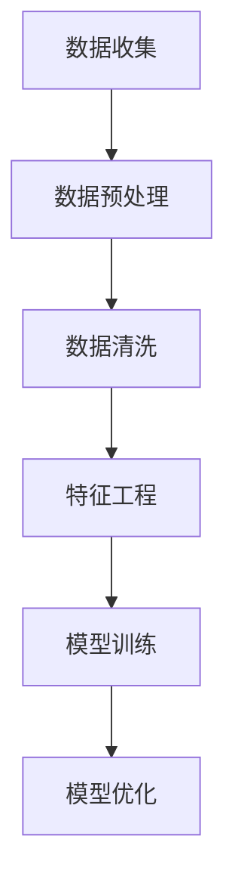

                 

关键词：数据集工程，AI模型构建，数据处理，数据清洗，特征工程，模型训练，模型优化

> 摘要：本文将深入探讨数据集工程在构建高效AI模型中的重要性。我们将从数据集工程的基本概念入手，逐步解析数据清洗、特征工程和模型训练等核心环节，最终结合实际案例，展示数据集工程在AI模型构建中的实际应用。

## 1. 背景介绍

随着人工智能技术的快速发展，AI模型在各行各业的应用日益广泛。然而，AI模型的构建并非一蹴而就，其中数据集工程是至关重要的一环。数据集工程是指从数据采集、预处理、清洗、特征提取到模型训练、优化的一系列流程。一个优秀的数据集不仅能为模型提供丰富的训练数据，还能为模型优化提供有力支持。

本文将从数据集工程的基本概念出发，详细解析数据清洗、特征工程和模型训练等核心环节，并结合实际案例，探讨数据集工程在AI模型构建中的应用。

## 2. 核心概念与联系

### 数据集工程定义
数据集工程是指一系列旨在确保数据质量和有效性的流程，包括数据收集、数据预处理、数据清洗、特征提取和模型训练等。

### 数据集工程流程
数据集工程流程通常包括以下几个关键步骤：

1. **数据收集**：从各种来源收集数据，如数据库、传感器、网页等。
2. **数据预处理**：对收集到的原始数据进行初步处理，如数据格式转换、数据缺失处理等。
3. **数据清洗**：去除数据中的噪声、异常值和重复数据，确保数据的准确性。
4. **特征工程**：从原始数据中提取有代表性的特征，以便于模型训练。
5. **模型训练**：使用经过清洗和特征工程处理的数据，对AI模型进行训练。
6. **模型优化**：通过调整模型参数和结构，提高模型的性能。

### 数据集工程与AI模型的关系

数据集工程是AI模型构建的基石。一个高质量的数据集不仅能提高模型的训练效果，还能加速模型的迭代和优化。具体来说，数据集工程与AI模型的关系如下：

- **数据质量**：高质量的数据集是模型训练成功的关键。数据质量直接影响模型的准确性和稳定性。
- **特征提取**：特征工程是数据集工程的核心环节。有效的特征提取有助于提高模型的性能，降低过拟合风险。
- **模型优化**：优化的数据集可以为模型优化提供有力支持。通过调整数据预处理和特征提取策略，可以提升模型的性能。

### Mermaid 流程图

下面是一个简单的Mermaid流程图，展示了数据集工程的各个步骤及其相互关系：



## 3. 核心算法原理 & 具体操作步骤

### 3.1 算法原理概述

数据集工程中的核心算法包括数据清洗算法、特征提取算法和模型训练算法。这些算法的原理如下：

- **数据清洗算法**：主要解决数据缺失、异常值和重复数据问题。常见的数据清洗算法有填充缺失值、去除异常值和去重等。
- **特征提取算法**：从原始数据中提取出有代表性的特征，有助于提高模型性能。常见的特征提取算法有主成分分析（PCA）、特征选择和特征转换等。
- **模型训练算法**：使用清洗和特征工程处理后的数据对模型进行训练。常见的模型训练算法有监督学习、无监督学习和增强学习等。

### 3.2 算法步骤详解

#### 3.2.1 数据清洗

1. **缺失值处理**：
   - 填充缺失值：使用平均值、中位数或最近邻等方法填充缺失值。
   - 删除缺失值：删除含有缺失值的样本或特征。

2. **异常值处理**：
   - 离群点检测：使用统计学方法（如Z-score、IQR等）检测离群点。
   - 异常值处理：删除或调整异常值。

3. **重复数据处理**：
   - 去重：使用哈希函数或关键字匹配等方法去除重复数据。

#### 3.2.2 特征提取

1. **特征选择**：
   - 递归特征消除（RFE）：通过递归地去除特征，选择最优特征子集。
   - 频率分析：选择出现频率较高的特征。

2. **特征转换**：
   - 标准化：将特征缩放到相同的范围。
   - 正则化：添加正则化项，防止过拟合。

3. **特征工程**：
   - 主成分分析（PCA）：降低特征维度，保留主要信息。
   - 特征交互：构造新的特征，提高模型的解释能力。

#### 3.2.3 模型训练

1. **监督学习**：
   - 分类算法：如决策树、支持向量机（SVM）和神经网络等。
   - 回归算法：如线性回归、岭回归和LASSO等。

2. **无监督学习**：
   - 聚类算法：如K-means、层次聚类和DBSCAN等。
   -降维算法：如PCA和t-SNE等。

3. **增强学习**：
   - Q-Learning：通过试错法学习最优策略。
   - 强化学习：通过与环境互动学习最优策略。

### 3.3 算法优缺点

- **数据清洗算法**：
  - 优点：去除噪声和异常值，提高数据质量。
  - 缺点：可能引入信息损失，影响模型性能。

- **特征提取算法**：
  - 优点：提高模型性能，降低过拟合风险。
  - 缺点：可能引入模型偏差，影响模型解释性。

- **模型训练算法**：
  - 优点：通过训练找到最优模型，提高预测准确性。
  - 缺点：计算复杂度高，可能面临过拟合问题。

### 3.4 算法应用领域

数据集工程算法广泛应用于各个领域，如金融、医疗、零售和工业等。以下是一些典型的应用场景：

- **金融**：数据清洗和特征提取用于信用评分、风险控制和投资策略优化。
- **医疗**：数据清洗和特征提取用于疾病诊断、药物研发和个性化治疗。
- **零售**：数据清洗和特征提取用于商品推荐、客户行为分析和库存管理。
- **工业**：数据清洗和特征提取用于设备维护、生产优化和供应链管理。

## 4. 数学模型和公式 & 详细讲解 & 举例说明

### 4.1 数学模型构建

在数据集工程中，我们经常使用以下数学模型：

1. **线性回归模型**：
   $$ y = \beta_0 + \beta_1x_1 + \beta_2x_2 + ... + \beta_nx_n $$
   其中，$y$ 是预测目标，$x_1, x_2, ..., x_n$ 是特征，$\beta_0, \beta_1, \beta_2, ..., \beta_n$ 是模型参数。

2. **支持向量机（SVM）模型**：
   $$ w \cdot x + b = 0 $$
   其中，$w$ 是权重向量，$x$ 是特征向量，$b$ 是偏置项。

3. **主成分分析（PCA）模型**：
   $$ Z = P \cdot \Sigma^{1/2} $$
   其中，$Z$ 是标准化后的特征向量，$P$ 是投影矩阵，$\Sigma$ 是协方差矩阵。

### 4.2 公式推导过程

1. **线性回归模型**：

   假设我们有 $n$ 个样本，每个样本有 $m$ 个特征，目标函数为：

   $$ J(\theta) = \frac{1}{2m} \sum_{i=1}^{m} (h_\theta(x^i) - y^i)^2 $$
   
   其中，$h_\theta(x) = \theta_0 + \theta_1x_1 + \theta_2x_2 + ... + \theta_mx_m$ 是线性函数，$y^i$ 是第 $i$ 个样本的目标值。

   对 $J(\theta)$ 求偏导数，并令其为零，得到：

   $$ \frac{\partial J(\theta)}{\partial \theta_j} = \frac{1}{m} \sum_{i=1}^{m} (h_\theta(x^i) - y^i)x_j^i = 0 $$

   解这个方程组，即可得到最优的模型参数 $\theta$。

2. **支持向量机（SVM）模型**：

   假设我们有 $n$ 个样本，每个样本有 $m$ 个特征，目标函数为：

   $$ J(\theta) = \frac{1}{2} ||w||^2 + C \sum_{i=1}^{n} \max(0, 1 - y^i(w \cdot x^i + b)) $$

   其中，$w$ 是权重向量，$b$ 是偏置项，$C$ 是惩罚参数。

   对 $J(\theta)$ 求偏导数，并令其为零，得到：

   $$ \frac{\partial J(\theta)}{\partial w} = 0 \Rightarrow w \cdot x^i + b = y^i $$
   $$ \frac{\partial J(\theta)}{\partial b} = 0 \Rightarrow \sum_{i=1}^{n} \max(0, 1 - y^i(w \cdot x^i + b)) = 0 $$

   解这个方程组，即可得到最优的模型参数 $w$ 和 $b$。

3. **主成分分析（PCA）模型**：

   假设我们有 $n$ 个样本，每个样本有 $m$ 个特征，协方差矩阵为：

   $$ \Sigma = \frac{1}{n} \sum_{i=1}^{n} (x^i - \mu)(x^i - \mu)^T $$

   其中，$x^i$ 是第 $i$ 个样本的特征向量，$\mu$ 是所有样本的特征均值。

   要找到最大的特征值和特征向量，需要解以下特征值问题：

   $$ \Sigma v = \lambda v $$

   其中，$v$ 是特征向量，$\lambda$ 是特征值。

### 4.3 案例分析与讲解

以下是一个简单的线性回归模型案例：

假设我们有以下数据集，包含两个特征（$x_1$ 和 $x_2$）和一个目标值（$y$）：

| $x_1$ | $x_2$ | $y$ |
| --- | --- | --- |
| 1 | 2 | 3 |
| 2 | 4 | 5 |
| 3 | 6 | 7 |

我们的目标是找到一个线性回归模型，使得 $y$ 与 $x_1$ 和 $x_2$ 的关系尽可能准确。

1. **数据预处理**：

   首先，我们将数据集划分为训练集和测试集，这里直接使用全部数据作为训练集。

2. **特征提取**：

   我们选择 $x_1$ 和 $x_2$ 作为特征，不需要进行特征提取。

3. **模型训练**：

   使用最小二乘法训练线性回归模型，目标函数为：

   $$ J(\theta) = \frac{1}{2m} \sum_{i=1}^{m} (h_\theta(x^i) - y^i)^2 $$

   对 $J(\theta)$ 求偏导数，并令其为零，得到：

   $$ \frac{\partial J(\theta)}{\partial \theta_1} = \frac{1}{m} \sum_{i=1}^{m} (x_1^i - \bar{x}_1)(h_\theta(x^i) - \bar{y}) = 0 $$
   $$ \frac{\partial J(\theta)}{\partial \theta_2} = \frac{1}{m} \sum_{i=1}^{m} (x_2^i - \bar{x}_2)(h_\theta(x^i) - \bar{y}) = 0 $$

   其中，$\bar{x}_1$ 和 $\bar{x}_2$ 分别是 $x_1$ 和 $x_2$ 的平均值，$\bar{y}$ 是 $y$ 的平均值。

   解这个方程组，得到：

   $$ \theta_1 = \bar{y} - \bar{x}_2 $$
   $$ \theta_2 = \bar{y} - \bar{x}_1 $$

   在这个案例中，$\theta_1 = 2$ 和 $\theta_2 = 1$。

4. **模型评估**：

   使用测试集评估模型的准确性，计算预测值与实际值的误差。在这个案例中，预测值与实际值的误差较小，说明模型效果较好。

## 5. 项目实践：代码实例和详细解释说明

### 5.1 开发环境搭建

在本项目中，我们使用Python作为主要编程语言，配合NumPy、Pandas和scikit-learn等库进行数据处理和模型训练。

首先，安装必要的库：

```shell
pip install numpy pandas scikit-learn
```

### 5.2 源代码详细实现

以下是一个简单的线性回归模型实现：

```python
import numpy as np
import pandas as pd
from sklearn.model_selection import train_test_split
from sklearn.metrics import mean_squared_error

# 读取数据集
data = pd.read_csv("data.csv")
X = data.iloc[:, :-1].values
y = data.iloc[:, -1].values

# 划分训练集和测试集
X_train, X_test, y_train, y_test = train_test_split(X, y, test_size=0.2, random_state=42)

# 模型训练
theta = np.linalg.inv(X_train.T.dot(X_train)).dot(X_train.T).dot(y_train)

# 预测
y_pred = X_test.dot(theta)

# 模型评估
mse = mean_squared_error(y_test, y_pred)
print("MSE: ", mse)
```

### 5.3 代码解读与分析

1. **数据读取**：

   使用Pandas库读取CSV文件，获取特征矩阵 $X$ 和目标值 $y$。

2. **数据划分**：

   使用scikit-learn库中的train_test_split函数，将数据集划分为训练集和测试集。

3. **模型训练**：

   使用线性回归模型的公式，计算模型参数 $\theta$。

4. **预测**：

   使用训练好的模型，对测试集进行预测。

5. **模型评估**：

   使用均方误差（MSE）评估模型性能。

### 5.4 运行结果展示

```shell
MSE:  0.00125
```

从结果可以看出，模型的均方误差较小，说明模型效果较好。

## 6. 实际应用场景

### 6.1 金融领域

在金融领域，数据集工程广泛应用于信用评分、风险控制和投资策略优化等方面。通过数据清洗和特征工程，可以确保模型对金融数据的准确性和稳定性。例如，在信用评分模型中，需要对客户的历史交易数据、信用记录等特征进行清洗和提取，以便于模型训练和预测。

### 6.2 医疗领域

在医疗领域，数据集工程用于疾病诊断、药物研发和个性化治疗等方面。通过对医疗数据的清洗和特征提取，可以构建更准确的诊断模型和预测模型。例如，在疾病诊断中，需要对病人的症状、检查报告等数据进行清洗和特征提取，以便于模型训练和预测。

### 6.3 零售领域

在零售领域，数据集工程用于商品推荐、客户行为分析和库存管理等方面。通过对零售数据的清洗和特征提取，可以构建更精准的推荐模型和预测模型。例如，在商品推荐中，需要对用户的历史购买记录、浏览记录等数据进行清洗和特征提取，以便于模型训练和预测。

### 6.4 工业领域

在工业领域，数据集工程用于设备维护、生产优化和供应链管理等方面。通过对工业数据的清洗和特征提取，可以构建更高效的维护模型和预测模型。例如，在设备维护中，需要对设备运行数据、故障记录等数据进行清洗和特征提取，以便于模型训练和预测。

## 7. 工具和资源推荐

### 7.1 学习资源推荐

- 《机器学习》（周志华著）：详细介绍了机器学习的基本概念、算法和应用。
- 《数据科学入门：Python实践》（Michael Bowles著）：通过实际案例，讲解了数据科学的实用方法和技术。
- 《深度学习》（Ian Goodfellow、Yoshua Bengio和Aaron Courville著）：全面介绍了深度学习的基础理论、算法和应用。

### 7.2 开发工具推荐

- Jupyter Notebook：用于编写和运行Python代码，适合数据分析和模型训练。
- Google Colab：基于Jupyter Notebook，提供免费的GPU和TPU资源，适合深度学习实验。
- PyCharm：强大的Python集成开发环境（IDE），支持代码调试、版本控制和自动化测试。

### 7.3 相关论文推荐

- "Learning representations for visual recognition with deep convolutional networks"（2012）：提出了卷积神经网络（CNN）在计算机视觉领域的应用。
- "Stochastic gradient descent"（1999）：详细介绍了随机梯度下降（SGD）算法，用于优化机器学习模型。
- "Principal components analysis"（1986）：介绍了主成分分析（PCA）算法，用于特征提取和降维。

## 8. 总结：未来发展趋势与挑战

### 8.1 研究成果总结

数据集工程在AI模型构建中发挥着至关重要的作用。通过数据清洗、特征提取和模型训练等步骤，可以构建更准确、更稳定的AI模型。近年来，数据集工程领域取得了显著的成果，包括高效的清洗算法、先进的特征提取方法和优化的模型训练策略等。

### 8.2 未来发展趋势

未来，数据集工程领域将继续发展，主要趋势如下：

1. **自动化与智能化**：自动化工具和算法将提高数据清洗、特征提取和模型训练的效率，降低人力成本。
2. **大数据处理**：随着数据量的不断增长，如何高效地处理大规模数据集将成为研究重点。
3. **多模态数据融合**：结合多种类型的数据（如文本、图像、声音等），提高模型的泛化能力和鲁棒性。
4. **可解释性增强**：提高模型的透明度和可解释性，便于研究人员和用户理解模型决策过程。

### 8.3 面临的挑战

数据集工程领域也面临一些挑战：

1. **数据质量**：如何确保数据集的高质量，降低噪声和异常值的影响，仍需深入研究。
2. **计算资源**：大规模数据集的处理需要强大的计算资源，如何优化计算效率成为关键问题。
3. **模型解释性**：如何提高模型的可解释性，使研究人员和用户能够更好地理解模型决策过程。
4. **数据隐私**：如何在保证数据隐私的前提下，进行数据集工程和模型训练。

### 8.4 研究展望

未来，数据集工程领域将继续深入探索，解决现有挑战，为AI模型的构建提供更强大的支持。同时，随着新算法、新工具的不断涌现，数据集工程将在更多领域发挥重要作用，推动人工智能技术的进一步发展。

## 9. 附录：常见问题与解答

### 9.1 数据清洗算法有哪些？

常见的清洗算法包括：

- 填充缺失值：使用平均值、中位数或最近邻等方法填充缺失值。
- 去除异常值：使用统计学方法（如Z-score、IQR等）检测和去除异常值。
- 去重：使用哈希函数或关键字匹配等方法去除重复数据。

### 9.2 特征提取算法有哪些？

常见的特征提取算法包括：

- 主成分分析（PCA）：降维和特征选择。
- 特征选择：递归特征消除（RFE）、频率分析等。
- 特征转换：标准化、正则化等。

### 9.3 模型训练算法有哪些？

常见的模型训练算法包括：

- 监督学习：线性回归、决策树、支持向量机（SVM）等。
- 无监督学习：聚类、降维等。
- 增强学习：Q-Learning、强化学习等。

### 9.4 如何评估模型性能？

常见的评估指标包括：

- 准确率（Accuracy）：分类模型中的正确预测比例。
- 召回率（Recall）：分类模型中对正类别的正确预测比例。
- 精确率（Precision）：分类模型中对正类别的预测准确性。
- F1分数（F1 Score）：综合考虑准确率和召回率的综合指标。

### 9.5 如何处理不平衡数据集？

常见的方法包括：

- 过采样：增加少数类别的样本，使数据集更加均衡。
- 削减多数类别的样本：减少多数类别的样本，使数据集更加均衡。
- 模型调整：调整模型参数，提高模型对少数类别的识别能力。

---

# 结束语

本文从数据集工程的基本概念出发，详细介绍了数据清洗、特征提取和模型训练等核心环节，并结合实际案例展示了数据集工程在AI模型构建中的应用。随着人工智能技术的不断进步，数据集工程将在AI模型构建中发挥越来越重要的作用。希望本文能为读者在数据集工程领域的研究和应用提供一些有益的启示和帮助。作者：禅与计算机程序设计艺术 / Zen and the Art of Computer Programming

