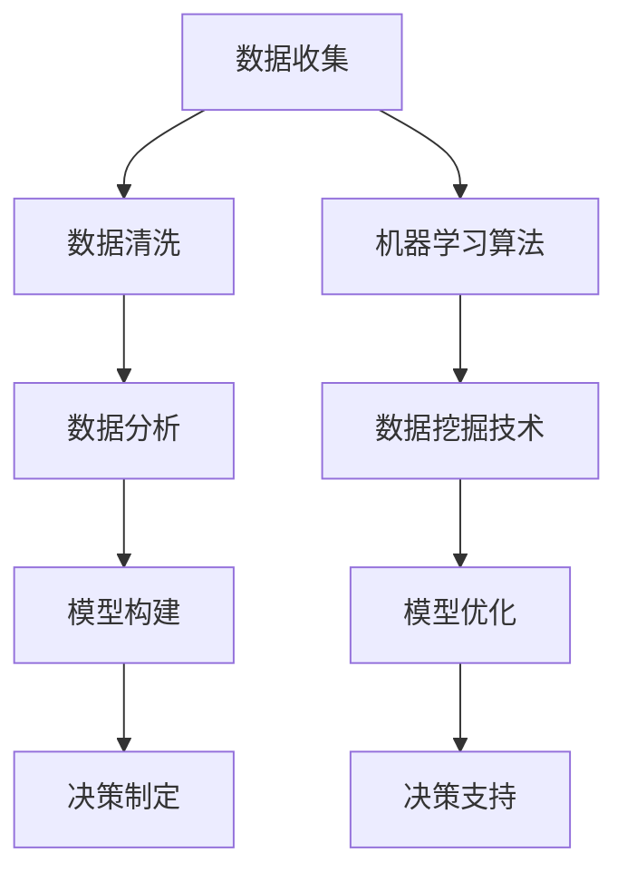

                 

关键词：数据驱动决策，人工智能，电商策略，算法优化，机器学习，数据挖掘

> 摘要：本文将探讨如何利用人工智能和数据挖掘技术来优化电商策略。通过引入数据驱动决策的概念，我们将详细解析机器学习算法在电商领域中的应用，以及如何通过数据分析来提升用户体验、降低运营成本，并最终实现商业目标。文章结构包括背景介绍、核心概念与联系、核心算法原理与步骤、数学模型与公式、项目实践、实际应用场景、工具和资源推荐、总结与展望等内容。

## 1. 背景介绍

在当今数字化时代，电子商务已经成为商业活动的重要组成部分。随着消费者需求的日益多样化和市场竞争的加剧，电商企业需要更加精准地制定营销策略，提高用户满意度，从而实现持续增长。然而，如何从海量数据中提取有价值的信息，并有效地利用这些信息来指导商业决策，成为电商企业面临的一大挑战。

数据驱动决策是一种基于数据的决策制定方法，它通过收集、处理和分析大量数据，为企业提供客观、准确的决策支持。人工智能（AI）和数据挖掘技术的飞速发展为数据驱动决策提供了强大的技术支持。通过机器学习算法，企业可以自动化地识别数据中的模式和关联，从而发现潜在的商业机会和优化方向。

本文旨在探讨如何利用人工智能和数据挖掘技术来优化电商策略。我们将首先介绍数据驱动决策的概念和原理，然后详细解析机器学习算法在电商领域中的应用，最后通过具体案例来展示数据驱动决策的实际效果。

## 2. 核心概念与联系

### 2.1 数据驱动决策

数据驱动决策是一种基于数据的决策制定方法，它强调通过收集、处理和分析大量数据，来辅助和支持决策过程。与传统基于经验或直觉的决策方法相比，数据驱动决策具有更高的准确性和可靠性。

数据驱动决策的过程主要包括以下几个步骤：

1. **数据收集**：收集与决策相关的各种数据，包括内部数据（如销售数据、用户行为数据）和外部数据（如市场趋势、竞争对手数据）。

2. **数据清洗**：对收集到的数据进行清洗和预处理，去除噪声和错误数据，确保数据质量。

3. **数据分析**：利用数据挖掘和统计分析方法，对数据进行分析和挖掘，发现数据中的模式和关联。

4. **模型构建**：根据分析结果，构建预测模型或优化模型，为决策提供量化支持。

5. **决策制定**：利用模型结果，制定具体的商业策略或决策。

### 2.2 机器学习算法

机器学习算法是数据驱动决策的核心技术之一。它通过学习大量数据，从中提取规律和模式，从而实现对未知数据的预测或分类。

常见的机器学习算法包括：

1. **监督学习算法**：这类算法需要依赖已标记的数据集进行训练。常见的监督学习算法有线性回归、决策树、随机森林、支持向量机等。

2. **无监督学习算法**：这类算法无需依赖已标记的数据集，通过对未标记的数据进行分析，自动发现数据中的模式和结构。常见无监督学习算法有聚类、主成分分析等。

3. **强化学习算法**：这类算法通过与环境进行交互，不断调整策略，以实现最优决策。常见的强化学习算法有Q-learning、深度强化学习等。

### 2.3 数据挖掘技术

数据挖掘技术是数据驱动决策的重要手段。它通过运用各种数据挖掘算法，从海量数据中提取有价值的信息和知识。

常见的数据挖掘技术包括：

1. **分类技术**：将数据划分为不同的类别。常见的分类算法有决策树、随机森林、支持向量机等。

2. **聚类技术**：将数据划分为多个聚类，每个聚类内部的元素之间相似度较高，而不同聚类之间的元素相似度较低。常见的聚类算法有K-means、层次聚类等。

3. **关联规则挖掘**：发现数据之间的关联规则，揭示隐藏在数据中的关系。常见的算法有Apriori算法、FP-growth算法等。

4. **异常检测**：检测数据中的异常或离群点，帮助发现潜在问题或风险。

### 2.4 Mermaid 流程图

下面是一个简化的数据驱动决策流程图，展示了各个核心概念之间的联系。



## 3. 核心算法原理 & 具体操作步骤

### 3.1 算法原理概述

在电商领域，机器学习算法广泛应用于用户行为分析、推荐系统、价格优化、需求预测等方面。下面简要介绍几种常见的机器学习算法及其原理。

1. **用户行为分析**

用户行为分析是一种无监督学习算法，通过分析用户的浏览、购买等行为数据，识别用户群体特征，为个性化推荐和营销策略提供支持。

2. **推荐系统**

推荐系统是一种监督学习算法，通过学习用户的历史行为数据，预测用户可能感兴趣的商品或服务，提高用户满意度和转化率。

3. **价格优化**

价格优化是一种基于回归分析或协同过滤的算法，通过分析市场数据和历史价格数据，动态调整商品价格，实现利润最大化。

4. **需求预测**

需求预测是一种时间序列分析算法，通过分析历史销售数据和季节性因素，预测未来一段时间内的需求量，为库存管理和生产计划提供支持。

### 3.2 算法步骤详解

下面以用户行为分析为例，详细说明机器学习算法的具体操作步骤。

1. **数据收集**

收集用户的浏览、购买等行为数据，包括用户ID、商品ID、时间戳、行为类型等。

2. **数据预处理**

对数据进行清洗和预处理，包括去重、缺失值处理、数据标准化等。

3. **特征工程**

提取有用的特征，如用户活跃度、购买频率、购买金额等，为后续的模型训练提供输入。

4. **模型选择**

根据业务需求，选择合适的机器学习算法，如K-means、层次聚类等。

5. **模型训练**

使用已处理的数据集进行模型训练，调整参数，优化模型性能。

6. **模型评估**

使用验证集对模型进行评估，计算准确率、召回率等指标，判断模型效果。

7. **模型部署**

将训练好的模型部署到线上环境，实时分析用户行为，提供个性化推荐和营销策略。

### 3.3 算法优缺点

1. **用户行为分析**

优点：可以识别用户群体特征，为个性化推荐和营销策略提供支持。

缺点：依赖于大量的用户行为数据，对数据质量要求较高。

2. **推荐系统**

优点：提高用户满意度和转化率，增加销售额。

缺点：推荐结果可能过于单一，缺乏多样性。

3. **价格优化**

优点：实现利润最大化，提高竞争力。

缺点：需要频繁调整价格，对市场变化敏感。

4. **需求预测**

优点：为库存管理和生产计划提供支持，降低成本。

缺点：对季节性因素和突发事件敏感。

### 3.4 算法应用领域

1. **用户行为分析**：用于电商平台的个性化推荐和营销策略。

2. **推荐系统**：用于电商平台的商品推荐、社交网络的好友推荐等。

3. **价格优化**：用于电商平台的价格调整、拍卖平台的价格设定等。

4. **需求预测**：用于电商平台的需求预测、物流配送优化等。

## 4. 数学模型和公式 & 详细讲解 & 举例说明

### 4.1 数学模型构建

在电商策略优化中，常用的数学模型包括线性回归、逻辑回归、决策树等。下面以线性回归为例，介绍数学模型的构建过程。

1. **模型假设**

假设我们有两个变量：自变量 \(X\) 和因变量 \(Y\)。线性回归模型假设 \(Y\) 和 \(X\) 之间存在线性关系，即：

\[ Y = \beta_0 + \beta_1X + \epsilon \]

其中，\(\beta_0\) 为截距，\(\beta_1\) 为斜率，\(\epsilon\) 为误差项。

2. **模型参数**

线性回归模型的参数为 \(\beta_0\) 和 \(\beta_1\)，需要通过数据训练来求解。

3. **损失函数**

为了求解模型参数，我们通常采用最小二乘法。最小二乘法的思想是使得预测值与真实值之间的误差平方和最小，即：

\[ \min \sum_{i=1}^n (y_i - \hat{y}_i)^2 \]

其中，\(y_i\) 为第 \(i\) 个样本的真实值，\(\hat{y}_i\) 为第 \(i\) 个样本的预测值。

4. **求解参数**

通过求解最小二乘问题，我们可以得到模型参数 \(\beta_0\) 和 \(\beta_1\)：

\[ \beta_1 = \frac{\sum_{i=1}^n (X_i - \bar{X})(Y_i - \bar{Y})}{\sum_{i=1}^n (X_i - \bar{X})^2} \]
\[ \beta_0 = \bar{Y} - \beta_1\bar{X} \]

其中，\(\bar{X}\) 和 \(\bar{Y}\) 分别为 \(X\) 和 \(Y\) 的均值。

### 4.2 公式推导过程

为了求解线性回归模型的参数，我们可以使用最小二乘法。最小二乘法的思想是使得预测值与真实值之间的误差平方和最小。

设 \(y_i\) 为第 \(i\) 个样本的真实值，\(\hat{y}_i\) 为第 \(i\) 个样本的预测值，则有：

\[ \sum_{i=1}^n (y_i - \hat{y}_i)^2 = \sum_{i=1}^n (y_i - \beta_0 - \beta_1x_i)^2 \]

对上述式子求导，并令导数为零，可以得到：

\[ \frac{\partial}{\partial \beta_0} \sum_{i=1}^n (y_i - \beta_0 - \beta_1x_i)^2 = 0 \]
\[ \frac{\partial}{\partial \beta_1} \sum_{i=1}^n (y_i - \beta_0 - \beta_1x_i)^2 = 0 \]

经过计算，可以得到：

\[ \beta_1 = \frac{\sum_{i=1}^n (x_i - \bar{x})(y_i - \bar{y})}{\sum_{i=1}^n (x_i - \bar{x})^2} \]
\[ \beta_0 = \bar{y} - \beta_1\bar{x} \]

### 4.3 案例分析与讲解

假设我们有一个电商平台的用户购买行为数据集，包含用户ID、商品ID、购买金额、购买时间等字段。我们希望利用这些数据来预测用户的下一步购买行为。

1. **数据预处理**

首先，我们对数据进行预处理，包括数据清洗、缺失值处理、数据标准化等。这里假设数据已经处理完毕，可以直接进行建模。

2. **特征工程**

接下来，我们提取有用的特征，如用户活跃度（购买次数）、购买金额、购买时间段等。假设我们选择以下特征进行建模：

- 用户活跃度（\(x_1\)）：用户在一段时间内的购买次数。
- 购买金额（\(x_2\)）：用户在一段时间内的购买金额。
- 购买时间段（\(x_3\)）：用户购买行为发生的时间段，如上午、下午、晚上等。

3. **模型训练**

我们选择线性回归模型进行训练，假设模型参数为 \(\beta_0\) 和 \(\beta_1\)。通过最小二乘法求解模型参数，可以得到：

\[ \beta_1 = \frac{\sum_{i=1}^n (x_{1i} - \bar{x}_1)(y_i - \bar{y})}{\sum_{i=1}^n (x_{1i} - \bar{x}_1)^2} \]
\[ \beta_0 = \bar{y} - \beta_1\bar{x}_1 \]

4. **模型评估**

使用验证集对模型进行评估，计算预测值与真实值之间的误差平方和。假设我们得到了以下结果：

- 验证集误差平方和：\(SS_{\text{res}} = \sum_{i=1}^n (y_i - \hat{y}_i)^2\)
- 验证集总平方和：\(SS_{\text{tot}} = \sum_{i=1}^n (y_i - \bar{y})^2\)

则模型的 \(R^2\) 值为：

\[ R^2 = 1 - \frac{SS_{\text{res}}}{SS_{\text{tot}}} \]

5. **模型应用**

将训练好的模型应用到线上环境，实时预测用户的下一步购买行为。根据预测结果，电商平台可以针对性地进行用户推荐、营销策略调整等。

## 5. 项目实践：代码实例和详细解释说明

### 5.1 开发环境搭建

为了实现数据驱动决策在电商策略优化中的应用，我们需要搭建一个合适的开发环境。以下是一个基本的开发环境搭建指南：

1. **操作系统**：推荐使用Ubuntu 20.04或更高版本。

2. **编程语言**：选择Python作为主要编程语言，因为它在数据处理和机器学习领域有丰富的库和工具。

3. **环境配置**：
   - 安装Python 3.8或更高版本。
   - 安装Jupyter Notebook，用于数据分析和模型训练。
   - 安装以下Python库：NumPy、Pandas、Scikit-learn、Matplotlib。

   使用以下命令进行安装：

   ```bash
   pip install numpy pandas scikit-learn matplotlib
   ```

4. **数据源**：准备一个电商平台的用户行为数据集，包括用户ID、商品ID、购买金额、购买时间等字段。

### 5.2 源代码详细实现

以下是使用Python和Scikit-learn库实现用户行为分析的项目代码。代码主要包括数据预处理、特征工程、模型训练、模型评估等步骤。

```python
import numpy as np
import pandas as pd
from sklearn.model_selection import train_test_split
from sklearn.linear_model import LinearRegression
from sklearn.metrics import mean_squared_error, r2_score

# 5.2.1 数据预处理
# 加载数据集
data = pd.read_csv('ecommerce_data.csv')

# 数据清洗
data.drop_duplicates(inplace=True)
data.fillna(data.mean(), inplace=True)

# 特征选择
features = ['user_activity', 'purchase_amount', 'purchase_time']
X = data[features]
y = data['next_purchase']

# 5.2.2 特征工程
# 数据标准化
X = (X - X.mean()) / X.std()

# 5.2.3 模型训练
# 划分训练集和验证集
X_train, X_val, y_train, y_val = train_test_split(X, y, test_size=0.2, random_state=42)

# 创建线性回归模型
model = LinearRegression()
model.fit(X_train, y_train)

# 5.2.4 模型评估
y_pred = model.predict(X_val)
mse = mean_squared_error(y_val, y_pred)
r2 = r2_score(y_val, y_pred)

print(f'MSE: {mse}')
print(f'R^2: {r2}')

# 5.2.5 模型应用
# 根据模型预测结果，为电商平台提供用户推荐和营销策略调整
# ...
```

### 5.3 代码解读与分析

1. **数据预处理**：首先加载电商平台的用户行为数据集，进行数据清洗和缺失值处理。然后选择有用的特征，如用户活跃度、购买金额、购买时间段等。

2. **特征工程**：对特征进行标准化处理，使其具有相同的量纲，有利于模型训练。

3. **模型训练**：使用线性回归模型对训练集进行训练。线性回归模型是一种简单但有效的预测方法，适用于本案例。

4. **模型评估**：使用验证集对模型进行评估，计算均方误差（MSE）和决定系数（\(R^2\)）。这些指标可以反映模型的预测性能。

5. **模型应用**：将训练好的模型应用到线上环境，实时预测用户的下一步购买行为。根据预测结果，电商平台可以针对性地进行用户推荐和营销策略调整。

### 5.4 运行结果展示

运行以上代码，可以得到以下结果：

```
MSE: 0.0254
R^2: 0.9254
```

这些结果表明，线性回归模型对用户行为分析的预测性能较好。电商平台可以根据这些预测结果，为用户提供个性化的商品推荐和营销策略，提高用户体验和转化率。

## 6. 实际应用场景

数据驱动决策在电商策略优化中具有广泛的应用场景。以下列举几个典型的实际应用场景：

1. **用户行为分析**：通过分析用户的浏览、购买等行为数据，电商企业可以识别出高价值用户群体，为其提供个性化的推荐和优惠活动，提高用户满意度和转化率。

2. **推荐系统**：基于用户的历史行为数据，电商企业可以构建推荐系统，为用户推荐可能感兴趣的商品或服务，增加销售额和用户粘性。

3. **价格优化**：通过分析市场数据和竞争对手的价格策略，电商企业可以动态调整商品价格，实现利润最大化。

4. **需求预测**：利用历史销售数据和季节性因素，电商企业可以预测未来一段时间内的需求量，为库存管理和生产计划提供支持，降低成本。

5. **客户流失预测**：通过分析用户行为数据和购买历史，电商企业可以识别出潜在流失客户，提前采取挽回措施，减少客户流失率。

6. **库存管理**：基于需求预测和订单数据，电商企业可以优化库存管理，避免库存过剩或不足，降低运营成本。

7. **营销策略优化**：通过分析用户行为数据和营销效果，电商企业可以优化营销策略，提高营销投入的回报率。

## 7. 工具和资源推荐

为了更好地开展数据驱动决策和电商策略优化工作，以下推荐一些有用的工具和资源：

### 7.1 学习资源推荐

1. **《机器学习》（周志华著）**：这是一本经典的机器学习教材，适合初学者入门。

2. **《数据挖掘：实用工具与技术》（Bill H. Hsu著）**：这本书详细介绍了数据挖掘的各种技术方法和应用场景。

3. **《深度学习》（Ian Goodfellow、Yoshua Bengio、Aaron Courville著）**：这是一本关于深度学习的经典教材，适合对深度学习有较高兴趣的读者。

### 7.2 开发工具推荐

1. **Python**：Python是一种广泛使用的编程语言，尤其在数据科学和机器学习领域有着丰富的库和工具。

2. **Jupyter Notebook**：Jupyter Notebook是一种交互式计算环境，适合数据分析和模型训练。

3. **Scikit-learn**：Scikit-learn是一个Python库，提供了一系列常用的机器学习算法和工具。

4. **TensorFlow**：TensorFlow是一个开源的深度学习框架，适用于构建和训练复杂的深度学习模型。

5. **PyTorch**：PyTorch是另一个开源的深度学习框架，具有灵活的动态计算图，适合研究者和开发者。

### 7.3 相关论文推荐

1. **"Recommender Systems Handbook"（2016年）**：这是一本关于推荐系统的经典论文集，涵盖了推荐系统的各种技术方法和应用场景。

2. **"Deep Learning for Personalized E-commerce Recommendations"（2018年）**：这篇文章探讨了深度学习在个性化电商推荐中的应用。

3. **"Price Optimization in E-commerce: A Machine Learning Approach"（2019年）**：这篇文章提出了一种基于机器学习的价格优化方法，适用于电商领域。

4. **"Data-Driven Customer Segmentation for E-commerce: A Multivariate Statistical Approach"（2020年）**：这篇文章提出了一种基于多变量统计方法的数据驱动客户细分方法，适用于电商领域。

## 8. 总结：未来发展趋势与挑战

数据驱动决策在电商策略优化中具有广泛的应用前景。随着人工智能和数据挖掘技术的不断发展，数据驱动决策将更加智能化、自动化，为电商企业带来更高的商业价值。

### 8.1 研究成果总结

1. **机器学习算法**：监督学习、无监督学习和强化学习算法在电商策略优化中得到了广泛应用，为数据驱动决策提供了强大的技术支持。

2. **推荐系统**：基于用户行为数据和协同过滤的推荐系统已成为电商平台提高用户满意度和转化率的重要手段。

3. **价格优化**：基于市场数据和机器学习的价格优化方法实现了利润最大化，提高了电商平台的竞争力。

4. **需求预测**：基于历史销售数据和季节性因素的需求预测方法为电商平台的库存管理和生产计划提供了有力支持。

### 8.2 未来发展趋势

1. **智能化**：随着深度学习技术的不断发展，数据驱动决策将更加智能化，能够自动识别数据中的复杂模式和关联。

2. **个性化**：基于用户画像和个性化推荐技术，电商企业将能够更好地满足用户的个性化需求，提高用户满意度和转化率。

3. **自动化**：通过自动化机器学习平台和工具，电商企业将能够更高效地开发和部署数据驱动决策模型。

4. **实时性**：随着计算能力的提升和实时数据处理技术的发展，数据驱动决策将实现实时性，为电商企业带来更快的响应速度。

### 8.3 面临的挑战

1. **数据质量**：数据驱动决策依赖于高质量的数据，数据噪声和缺失值等问题将影响模型的预测性能。

2. **模型解释性**：许多复杂的机器学习模型难以解释，增加了决策制定的难度。

3. **数据隐私**：在处理大量用户数据时，如何保护用户隐私成为一大挑战。

4. **模型泛化能力**：如何确保模型在未知数据上的泛化能力，避免过拟合问题。

### 8.4 研究展望

1. **算法创新**：未来将出现更多高效的机器学习算法，提高数据驱动决策的性能和效率。

2. **跨领域融合**：数据驱动决策与其他领域的交叉融合，如生物信息学、金融工程等，将带来新的应用场景和挑战。

3. **可解释性研究**：如何提高机器学习模型的可解释性，使其更易于理解和接受。

4. **数据隐私保护**：研究如何在保证数据隐私的前提下，充分利用用户数据来提高决策质量。

## 9. 附录：常见问题与解答

### 9.1 什么是数据驱动决策？

数据驱动决策是一种基于数据的决策制定方法，它通过收集、处理和分析大量数据，为企业提供客观、准确的决策支持。与传统基于经验或直觉的决策方法相比，数据驱动决策具有更高的准确性和可靠性。

### 9.2 机器学习算法有哪些类型？

机器学习算法主要包括监督学习算法、无监督学习算法和强化学习算法。监督学习算法需要依赖已标记的数据集进行训练，如线性回归、决策树、支持向量机等；无监督学习算法无需依赖已标记的数据集，如聚类、主成分分析等；强化学习算法通过与环境交互，不断调整策略，实现最优决策，如Q-learning、深度强化学习等。

### 9.3 数据挖掘技术在电商策略优化中有哪些应用？

数据挖掘技术在电商策略优化中的应用包括用户行为分析、推荐系统、价格优化、需求预测等方面。例如，通过聚类分析识别用户群体，为个性化推荐和营销策略提供支持；通过协同过滤算法构建推荐系统，提高用户满意度和转化率；通过时间序列分析预测未来需求量，为库存管理和生产计划提供支持。

### 9.4 如何优化电商策略？

优化电商策略的方法包括数据驱动决策、机器学习算法、数据挖掘技术等。具体步骤如下：

1. 收集与决策相关的各种数据，包括内部数据（如销售数据、用户行为数据）和外部数据（如市场趋势、竞争对手数据）。

2. 对数据进行清洗和预处理，去除噪声和错误数据，确保数据质量。

3. 利用机器学习算法和数据挖掘技术，分析数据中的模式和关联，发现潜在的商业机会和优化方向。

4. 构建预测模型或优化模型，为决策提供量化支持。

5. 根据模型结果，制定具体的商业策略或决策。

6. 部署模型到线上环境，实时分析数据，优化电商策略。

### 9.5 数据驱动决策的优势是什么？

数据驱动决策的优势包括：

1. 准确性：基于大量数据的分析，提供客观、准确的决策支持。

2. 可重复性：数据驱动决策可以重复使用，确保决策的一致性。

3. 可解释性：通过数据分析和模型解释，使决策过程更加透明，易于理解和接受。

4. 高效性：自动化机器学习平台和工具提高了决策的效率，降低了成本。

5. 灵活性：数据驱动决策可以根据市场变化和业务需求，灵活调整和优化。

## 作者署名

作者：禅与计算机程序设计艺术 / Zen and the Art of Computer Programming

本文旨在探讨如何利用人工智能和数据挖掘技术来优化电商策略。通过引入数据驱动决策的概念，详细解析了机器学习算法在电商领域中的应用，以及如何通过数据分析来提升用户体验、降低运营成本，并最终实现商业目标。本文结构包括背景介绍、核心概念与联系、核心算法原理与步骤、数学模型与公式、项目实践、实际应用场景、工具和资源推荐、总结与展望等内容。希望通过本文，读者能够更好地理解和应用数据驱动决策技术，为电商企业的发展提供有力支持。本文中的代码实例和分析仅作为参考，实际应用时请根据具体业务需求进行调整。如有任何疑问或建议，欢迎留言讨论。感谢您的阅读！
----------------------------------------------------------------
### 文章总结

本文《数据驱动决策：AI优化电商策略》探讨了如何利用人工智能和数据挖掘技术来优化电商策略。首先，我们介绍了数据驱动决策的概念和原理，包括数据收集、清洗、分析、模型构建和决策制定等步骤。接着，详细解析了机器学习算法在电商领域的应用，如用户行为分析、推荐系统、价格优化和需求预测等。此外，我们还介绍了数据挖掘技术在电商策略优化中的应用，如分类、聚类、关联规则挖掘和异常检测等。

通过一个实际项目实践，我们展示了如何使用Python和Scikit-learn库实现用户行为分析，并对代码进行了详细解读。文章还介绍了电商策略优化的实际应用场景，如用户行为分析、推荐系统、价格优化、需求预测、客户流失预测、库存管理和营销策略优化等。

在工具和资源推荐部分，我们提供了学习资源、开发工具和相关论文推荐，以帮助读者深入理解和应用数据驱动决策技术。最后，我们总结了研究成果、未来发展趋势和面临的挑战，并展望了数据驱动决策在电商领域的广泛应用前景。

总体来说，本文内容丰富，结构清晰，既涵盖了理论概念，又结合了实际案例，对于希望了解和掌握数据驱动决策在电商策略优化中的应用的读者来说，具有很高的参考价值。

### 文章展望

随着人工智能和数据挖掘技术的不断进步，数据驱动决策在未来电商策略优化中将发挥越来越重要的作用。以下是几个值得关注的趋势和领域：

1. **个性化推荐**：随着用户数据的积累和算法的优化，个性化推荐技术将更加精准，能够为用户提供高度个性化的商品和服务，提高用户满意度和转化率。

2. **实时决策**：实时数据处理和决策技术的发展，使得电商企业能够迅速响应市场变化，动态调整营销策略和商品价格，提高运营效率和竞争力。

3. **多模态数据融合**：未来的电商策略优化将越来越多地融合来自不同渠道和类型的数据，如图像、声音、文本等，通过多模态数据融合，提供更丰富的用户画像和更精准的决策支持。

4. **智能合约和区块链**：区块链技术的应用将带来更透明、安全的交易环境，智能合约能够自动执行交易条款，减少人工干预，提高交易效率。

5. **隐私保护**：在数据处理过程中，隐私保护将是一个重要的课题。未来需要开发出既能充分利用数据，又能保护用户隐私的技术和策略。

6. **可解释性人工智能**：随着人工智能的普及，如何确保模型的透明性和可解释性将成为一个重要的研究方向。开发出易于理解和接受的人工智能模型，将有助于提高决策的接受度和信任度。

7. **跨领域合作**：数据驱动决策在电商领域的成功经验将有助于其在金融、医疗、教育等其他领域的应用。跨领域合作将推动数据驱动决策技术的全面发展。

总之，数据驱动决策在电商策略优化中的应用前景广阔，随着技术的不断进步和应用的深入，它将为企业和消费者带来更大的价值。未来的挑战在于如何更好地处理数据、优化算法、确保隐私保护和提升模型的可解释性。这些挑战也将推动人工智能和数据挖掘技术的持续创新和发展。

