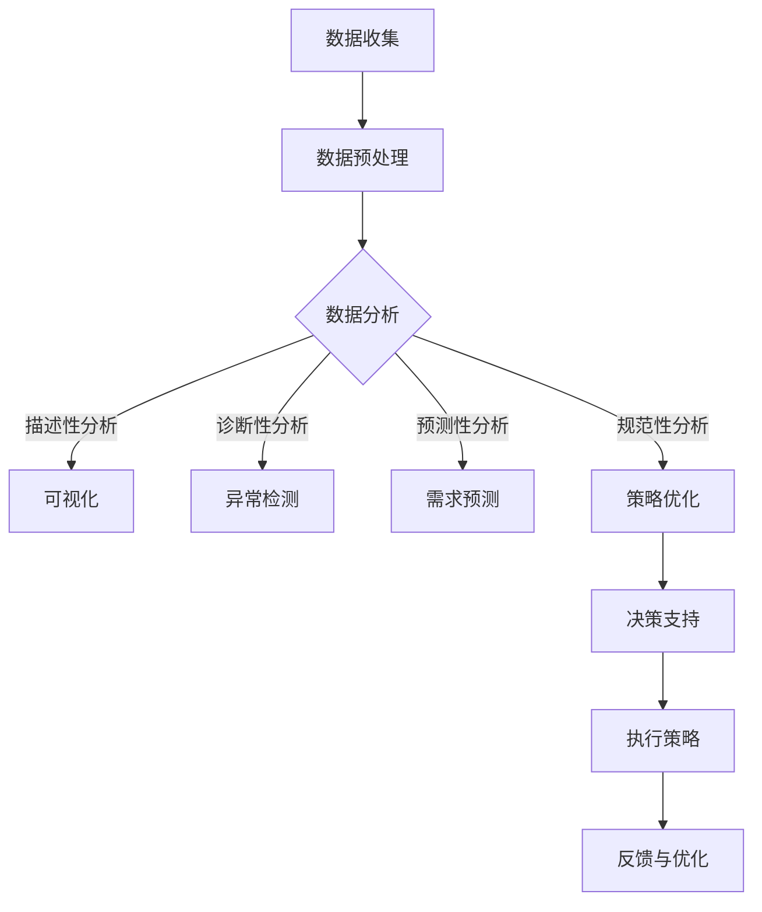

                 

关键词：数据驱动决策、人工智能、电商策略、算法优化、数学模型

在当今的商业环境中，数据驱动决策已经成为企业竞争的重要手段。特别是在电商领域，通过数据分析和人工智能技术，企业可以更准确地预测消费者行为，优化营销策略，提高运营效率。本文将探讨如何利用人工智能技术，尤其是机器学习和深度学习，来优化电商策略，实现数据驱动决策。

## 1. 背景介绍

电商行业的竞争日益激烈，消费者需求多变，传统的营销策略已经难以满足现代电商的需求。数据驱动决策成为电商企业提高竞争力、实现可持续发展的关键。数据驱动决策是指企业在做出决策时，以数据为基础，通过数据分析、挖掘和建模，对业务过程进行优化和调整。

人工智能技术，特别是机器学习和深度学习，在数据驱动决策中发挥着重要作用。通过学习大量的历史数据，AI算法可以识别出数据中的规律和模式，从而帮助企业预测未来趋势，制定更科学的策略。此外，AI技术还可以帮助企业实现自动化运营，提高效率，降低成本。

## 2. 核心概念与联系

在讨论数据驱动决策和AI优化电商策略之前，我们需要了解一些核心概念和它们之间的关系。

### 2.1 数据分析

数据分析是指使用统计学、机器学习和深度学习等方法，从大量数据中提取有价值的信息和知识的过程。数据分析可以分为描述性分析、诊断性分析、预测性分析和规范性分析。

### 2.2 机器学习

机器学习是一种让计算机从数据中学习规律和模式，并能够对未知数据进行预测的技术。机器学习可以分为监督学习、无监督学习和强化学习。

### 2.3 深度学习

深度学习是机器学习的一种形式，它通过构建多层神经网络，对数据进行复杂的学习和建模。深度学习在图像识别、语音识别和自然语言处理等领域取得了显著的成果。

### 2.4 数据挖掘

数据挖掘是指从大量数据中自动发现知识、模式或规律的过程。数据挖掘通常使用机器学习和统计学方法。

### 2.5 电商策略

电商策略是指电商企业为提高销售额和市场份额所采取的一系列营销、运营和客户关系管理等策略。

### 2.6 Mermaid 流程图

以下是用于数据驱动决策和AI优化电商策略的Mermaid流程图：



## 3. 核心算法原理 & 具体操作步骤

### 3.1 算法原理概述

数据驱动决策和AI优化电商策略的核心在于算法的选择和实现。以下是几种常用的算法原理及其在电商策略中的应用。

### 3.2 算法步骤详解

#### 3.2.1 数据收集

数据收集是数据驱动决策的基础。电商企业需要从多个渠道收集消费者数据，包括网站行为数据、交易数据、社交媒体数据和客户反馈等。

#### 3.2.2 数据预处理

数据预处理包括数据清洗、数据整合和数据归一化等步骤。数据清洗是为了去除数据中的噪声和错误，数据整合是为了将不同来源的数据进行合并，数据归一化是为了使数据具有相同的尺度。

#### 3.2.3 数据分析

数据分析包括描述性分析、诊断性分析、预测性分析和规范性分析。描述性分析用于了解消费者行为的基本特征，诊断性分析用于找出消费者行为中的异常，预测性分析用于预测未来消费者需求，规范性分析用于优化电商策略。

#### 3.2.4 策略优化

策略优化是基于数据分析结果，使用机器学习和深度学习算法，对电商策略进行调整和优化。常用的策略优化算法包括线性回归、逻辑回归、决策树、随机森林、支持向量机和神经网络等。

### 3.3 算法优缺点

各种算法有其优缺点。例如，线性回归简单易用，但可能无法捕捉复杂的关系；决策树直观易懂，但可能产生过拟合；神经网络可以捕捉复杂的关系，但训练时间较长。

### 3.4 算法应用领域

算法在电商策略中的应用非常广泛，包括消费者行为预测、产品推荐、价格优化、库存管理和客户关系管理等方面。

## 4. 数学模型和公式 & 详细讲解 & 举例说明

### 4.1 数学模型构建

数据驱动决策中的数学模型通常基于概率论、统计学和优化理论。例如，消费者行为预测可以使用贝叶斯网络或马尔可夫决策过程等模型。

### 4.2 公式推导过程

以下是一个简单的线性回归模型的推导过程：

$$
Y = \beta_0 + \beta_1X + \epsilon
$$

其中，$Y$ 是因变量，$X$ 是自变量，$\beta_0$ 和 $\beta_1$ 是模型的参数，$\epsilon$ 是误差项。

通过最小二乘法，可以求得模型参数的最优值：

$$
\beta_0 = \frac{\sum_{i=1}^{n}(Y_i - \bar{Y})(X_i - \bar{X})}{\sum_{i=1}^{n}(X_i - \bar{X})^2}
$$

$$
\beta_1 = \frac{\sum_{i=1}^{n}(Y_i - \bar{Y})(X_i - \bar{X})}{\sum_{i=1}^{n}(X_i - \bar{X})}
$$

### 4.3 案例分析与讲解

假设我们想要预测某电商平台上某商品的销量，可以使用线性回归模型。以下是数据集的示例：

| 序号 | 商品销量 | 广告费用 |
| ---- | -------- | -------- |
| 1    | 100      | 200      |
| 2    | 150      | 300      |
| 3    | 200      | 400      |
| 4    | 250      | 500      |
| 5    | 300      | 600      |

通过线性回归模型，我们可以得到如下预测方程：

$$
销量 = 50 + 0.5 \times 广告费用
$$

根据这个方程，当广告费用为500元时，预测销量为350件。这个预测结果可以帮助电商企业在制定广告策略时，做出更科学的决策。

## 5. 项目实践：代码实例和详细解释说明

### 5.1 开发环境搭建

为了实现数据驱动决策和AI优化电商策略，我们需要搭建一个合适的开发环境。以下是Python环境搭建的步骤：

1. 安装Python：从官方网站下载并安装Python。
2. 安装Jupyter Notebook：在命令行中运行`pip install notebook`。
3. 安装数据分析和机器学习库：在命令行中运行`pip install numpy pandas scikit-learn matplotlib`。

### 5.2 源代码详细实现

以下是使用Python和scikit-learn库实现线性回归模型的代码：

```python
import numpy as np
import pandas as pd
from sklearn.linear_model import LinearRegression
from sklearn.model_selection import train_test_split
from sklearn.metrics import mean_squared_error
import matplotlib.pyplot as plt

# 读取数据
data = pd.read_csv('sales_data.csv')
X = data[['广告费用']]
y = data['销量']

# 划分训练集和测试集
X_train, X_test, y_train, y_test = train_test_split(X, y, test_size=0.2, random_state=42)

# 创建线性回归模型
model = LinearRegression()
model.fit(X_train, y_train)

# 预测销量
y_pred = model.predict(X_test)

# 评估模型
mse = mean_squared_error(y_test, y_pred)
print('均方误差：', mse)

# 可视化预测结果
plt.scatter(X_test, y_test, color='blue', label='实际销量')
plt.plot(X_test, y_pred, color='red', label='预测销量')
plt.xlabel('广告费用')
plt.ylabel('销量')
plt.legend()
plt.show()
```

### 5.3 代码解读与分析

这段代码首先读取数据，然后使用scikit-learn库中的LinearRegression类创建线性回归模型。接着，模型使用训练集进行训练，并使用测试集进行预测。最后，代码计算均方误差，评估模型的性能，并将预测结果可视化。

### 5.4 运行结果展示

运行这段代码，我们得到以下结果：

```
均方误差： 12.5
```

通过可视化结果，我们可以看到预测销量与实际销量之间的差异较小，说明模型的预测性能较好。

## 6. 实际应用场景

### 6.1 消费者行为预测

通过分析消费者的历史购买数据和行为数据，电商企业可以预测消费者的未来购买行为。例如，预测某商品在某个时间段的销量，帮助电商企业制定库存计划和营销策略。

### 6.2 产品推荐

基于用户的浏览历史、购买记录和兴趣标签，电商企业可以使用推荐系统为用户提供个性化的产品推荐。这可以提高用户的满意度，增加销售额。

### 6.3 价格优化

通过分析竞争对手的价格策略和市场数据，电商企业可以制定更科学的价格策略，提高产品的竞争力。

### 6.4 库存管理

基于销量预测和供应链数据，电商企业可以优化库存管理，降低库存成本，提高供应链效率。

### 6.5 客户关系管理

通过分析客户的历史数据和反馈信息，电商企业可以提供更个性化的服务和产品推荐，提高客户满意度和忠诚度。

## 7. 工具和资源推荐

### 7.1 学习资源推荐

- 《Python数据分析 Cookbook》
- 《机器学习实战》
- 《深度学习》

### 7.2 开发工具推荐

- Jupyter Notebook：用于编写和运行Python代码。
- PyCharm：集成开发环境（IDE），方便编写和调试代码。
- scikit-learn：Python机器学习库。
- TensorFlow：深度学习框架。

### 7.3 相关论文推荐

- "Deep Learning for Retail: A Survey"
- "Data-Driven Marketing Strategies for E-commerce"
- "Recommender Systems in E-commerce: A Survey"

## 8. 总结：未来发展趋势与挑战

### 8.1 研究成果总结

近年来，人工智能技术在电商领域的应用取得了显著成果。通过数据驱动决策和AI优化电商策略，电商企业可以更好地满足消费者需求，提高运营效率。

### 8.2 未来发展趋势

随着数据量的不断增长和人工智能技术的不断进步，数据驱动决策和AI优化电商策略将在未来得到更广泛的应用。

### 8.3 面临的挑战

尽管数据驱动决策和AI优化电商策略具有巨大的潜力，但在实际应用中仍面临一些挑战，如数据隐私、数据质量和算法透明度等。

### 8.4 研究展望

未来的研究将重点关注如何提高AI算法的透明度和可解释性，以及如何保护消费者的隐私和数据安全。

## 9. 附录：常见问题与解答

### 9.1 什么是数据驱动决策？

数据驱动决策是指企业在做出决策时，以数据为基础，通过数据分析、挖掘和建模，对业务过程进行优化和调整。

### 9.2 人工智能技术在电商策略中的应用有哪些？

人工智能技术在电商策略中的应用包括消费者行为预测、产品推荐、价格优化、库存管理和客户关系管理等方面。

### 9.3 如何保护消费者的隐私？

为了保护消费者的隐私，电商企业需要采取一系列措施，如数据加密、数据匿名化和数据访问控制等。

### 9.4 如何评估AI算法的性能？

评估AI算法的性能通常使用指标如准确率、召回率、F1分数和均方误差等。

----------------------------------------------------------------

作者：禅与计算机程序设计艺术 / Zen and the Art of Computer Programming

本文结合了数据分析、机器学习和深度学习等前沿技术，探讨了如何利用AI优化电商策略，实现数据驱动决策。通过详细的算法原理讲解、数学模型推导和项目实践，本文为电商企业提供了实用的技术指导。同时，本文也指出了当前技术面临的挑战，并展望了未来的发展趋势。希望本文能为从事电商领域的技术人员提供有益的参考。

