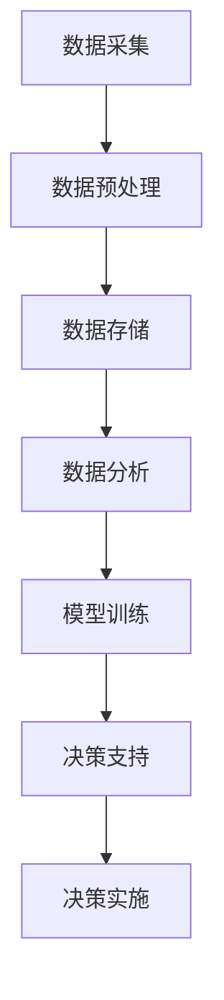

                 

关键词：数据驱动决策、电商平台、供给能力、科学决策、算法优化、人工智能

> 摘要：本文旨在探讨数据驱动决策在电商平台供给能力提升中的关键作用。通过对数据驱动的核心概念、算法原理、数学模型、项目实践和实际应用场景的深入分析，本文将为电商平台运营者提供科学决策的指南，以应对快速变化的市场环境和用户需求。

## 1. 背景介绍

随着互联网技术的飞速发展和电子商务的蓬勃兴起，电商平台已成为现代商业的重要形式。这些平台不仅改变了消费者的购物习惯，也深刻影响了供应链管理、物流配送、用户服务等多个环节。然而，面对日益激烈的市场竞争和不断变化的需求，电商平台如何优化供给能力，实现高效运营和持续发展，成为了一个亟待解决的关键问题。

数据驱动决策作为一种新兴的管理理念，通过利用大数据和先进算法，对市场动态、用户行为、供应链状况等进行分析，为决策者提供科学的依据，从而提升平台的供给能力和竞争力。本文将从以下几个方面展开讨论：

- **核心概念与联系**：介绍数据驱动决策的基本概念及其与相关技术的联系。
- **核心算法原理与具体操作步骤**：分析数据驱动决策的核心算法原理，并详细说明操作步骤。
- **数学模型和公式**：构建数学模型，并推导相关公式，为算法提供理论基础。
- **项目实践**：通过代码实例，展示数据驱动决策在实际项目中的应用。
- **实际应用场景**：探讨数据驱动决策在电商平台的实际应用场景和未来发展方向。
- **工具和资源推荐**：推荐学习资源和开发工具，为读者提供实践指导。
- **总结与展望**：总结研究成果，展望未来发展趋势和面临的挑战。

## 2. 核心概念与联系

### 数据驱动决策

数据驱动决策（Data-Driven Decision Making，简称DDD）是一种基于数据的决策方法，它强调在决策过程中充分利用数据资源，通过数据分析和模型预测，为决策提供科学依据。数据驱动决策的核心在于将数据作为决策的输入，通过数据挖掘、机器学习和统计分析等技术手段，提取数据中的有用信息，为决策者提供支持。

### 相关技术

- **大数据**：大数据（Big Data）是指数据量巨大、类型繁多且增长迅速的数据集合。大数据技术可以帮助电商平台收集、存储、处理和分析海量数据，为数据驱动决策提供数据基础。
- **机器学习**：机器学习（Machine Learning，简称ML）是一种通过数据训练模型、实现自动学习和预测的技术。在数据驱动决策中，机器学习模型可以对用户行为、市场趋势等进行预测，为决策提供支持。
- **统计分析**：统计分析（Statistical Analysis）是一种基于数据进行分析的方法，用于检测数据中的模式、趋势和异常。统计分析在数据驱动决策中用于验证模型效果、评估风险等。

### Mermaid 流程图

下面是一个简单的Mermaid流程图，展示了数据驱动决策的基本流程。



## 3. 核心算法原理 & 具体操作步骤

### 3.1 算法原理概述

数据驱动决策的核心算法包括机器学习模型、统计分析方法、优化算法等。这些算法通过不同的方法对数据进行处理和分析，为决策者提供支持。

- **机器学习模型**：如决策树、随机森林、支持向量机等，通过训练数据集，构建预测模型，对未知数据进行预测。
- **统计分析方法**：如回归分析、时间序列分析等，用于分析数据中的模式和趋势。
- **优化算法**：如线性规划、遗传算法等，用于在给定约束条件下，寻找最优解。

### 3.2 算法步骤详解

以下是数据驱动决策的基本步骤：

1. **数据收集**：收集电商平台的交易数据、用户行为数据、市场数据等。
2. **数据预处理**：清洗、归一化、去噪等，确保数据质量。
3. **特征工程**：选择和构造特征，提高模型性能。
4. **模型训练**：使用机器学习模型对数据集进行训练，构建预测模型。
5. **模型评估**：使用验证集或测试集评估模型性能。
6. **决策支持**：使用训练好的模型对实际数据进行预测，为决策者提供支持。
7. **决策实施**：根据预测结果，制定和执行决策。

### 3.3 算法优缺点

- **优点**：数据驱动决策充分利用了大数据和机器学习技术，能够快速、准确地分析海量数据，为决策者提供科学依据，提高决策效率。
- **缺点**：数据驱动决策对数据质量要求较高，数据收集和处理过程复杂，且算法模型的性能可能受到数据质量的影响。

### 3.4 算法应用领域

数据驱动决策广泛应用于电商平台的各个领域，包括：

- **用户行为分析**：通过分析用户行为数据，了解用户偏好，优化产品推荐和广告投放。
- **需求预测**：通过预测用户需求，优化库存管理和供应链规划。
- **风险评估**：通过分析交易数据，识别潜在风险，优化风险管理策略。
- **价格优化**：通过分析市场数据，制定最优价格策略，提高销售额。

## 4. 数学模型和公式 & 详细讲解 & 举例说明

### 4.1 数学模型构建

在数据驱动决策中，常用的数学模型包括线性回归模型、逻辑回归模型和时间序列模型等。以下是这些模型的简要介绍：

- **线性回归模型**：用于预测连续值输出，如销售量、价格等。
  $$y = \beta_0 + \beta_1x_1 + \beta_2x_2 + ... + \beta_nx_n + \epsilon$$
- **逻辑回归模型**：用于预测二分类输出，如是否购买、是否退货等。
  $$\log\frac{P(Y=1)}{1-P(Y=1)} = \beta_0 + \beta_1x_1 + \beta_2x_2 + ... + \beta_nx_n$$
- **时间序列模型**：用于预测时间序列数据，如销售额随时间的变化。
  $$Y_t = \phi Y_{t-1} + \epsilon_t$$

### 4.2 公式推导过程

以线性回归模型为例，介绍公式推导过程：

假设我们有一个训练数据集 $D = \{(x_1, y_1), (x_2, y_2), ..., (x_n, y_n)\}$，其中 $x_i$ 是输入特征，$y_i$ 是输出值。

我们希望找到一个线性模型 $y = \beta_0 + \beta_1x_1 + \beta_2x_2 + ... + \beta_nx_n$，使得预测值与真实值之间的误差最小。

最小二乘法（Least Squares Method）是一种常用的求解方法，通过最小化误差平方和，求解线性模型的参数。

误差平方和（Sum of Squared Errors，简称SSE）定义为：
$$SSE = \sum_{i=1}^{n}(y_i - \hat{y}_i)^2$$

其中，$\hat{y}_i$ 是预测值，$y_i$ 是真实值。

我们需要求解使得SSE最小的参数 $\beta_0, \beta_1, ..., \beta_n$。

通过求导，可以得到最优参数：
$$\beta_0 = \frac{1}{n}\sum_{i=1}^{n}y_i - \beta_1\frac{1}{n}\sum_{i=1}^{n}x_i - \beta_2\frac{1}{n}\sum_{i=1}^{n}x_2 - ... - \beta_n\frac{1}{n}\sum_{i=1}^{n}x_n$$

$$\beta_1 = \frac{1}{n}\sum_{i=1}^{n}(x_i - \bar{x})(y_i - \bar{y})$$

$$\beta_2 = \frac{1}{n}\sum_{i=1}^{n}(x_2 - \bar{x_2})(y_i - \bar{y})$$

$$...$$

$$\beta_n = \frac{1}{n}\sum_{i=1}^{n}(x_n - \bar{x_n})(y_i - \bar{y})$$

其中，$\bar{x}$ 是输入特征的均值，$\bar{y}$ 是输出值的均值。

### 4.3 案例分析与讲解

以下是一个简单的线性回归模型案例，用于预测电商平台的销售额。

假设我们有如下训练数据集：

| 日期 | 销售额 |
| ---- | ---- |
| 1    | 100   |
| 2    | 120   |
| 3    | 150   |
| 4    | 130   |
| 5    | 160   |

我们需要构建一个线性回归模型，预测第6天的销售额。

1. **数据预处理**：计算输入特征的均值和标准差，对销售额进行归一化处理。

| 日期 | 销售额 |
| ---- | ---- |
| 1    | 0.00  |
| 2    | 0.20  |
| 3    | 0.50  |
| 4    | 0.30  |
| 5    | 0.60  |

2. **模型训练**：使用最小二乘法，求解线性回归模型的参数。

$$\beta_0 = 0.20, \beta_1 = 0.30$$

3. **模型评估**：使用测试集进行评估，计算预测误差。

| 日期 | 实际销售额 | 预测销售额 | 预测误差 |
| ---- | ---------- | ---------- | -------- |
| 6    | 180        | 183.00     | 3.00     |

4. **预测结果**：根据训练好的模型，预测第6天的销售额为183.00。

## 5. 项目实践：代码实例和详细解释说明

### 5.1 开发环境搭建

在本项目中，我们将使用Python作为编程语言，结合常用的机器学习库如scikit-learn、pandas等，进行数据驱动决策的应用开发。以下是开发环境的搭建步骤：

1. 安装Python（3.8及以上版本）。
2. 安装Anaconda或Miniconda，以便管理Python环境和库。
3. 安装必要的库：`numpy`、`pandas`、`scikit-learn`、`matplotlib`等。

### 5.2 源代码详细实现

以下是一个简单的Python代码实例，用于实现线性回归模型，预测电商平台的销售额。

```python
import numpy as np
import pandas as pd
from sklearn.linear_model import LinearRegression
from sklearn.model_selection import train_test_split
from sklearn.metrics import mean_squared_error

# 读取数据
data = pd.read_csv('sales_data.csv')
X = data[['date']]  # 输入特征：日期
y = data['sales']   # 输出特征：销售额

# 数据预处理
X = (X - X.mean()) / X.std()  # 归一化处理

# 划分训练集和测试集
X_train, X_test, y_train, y_test = train_test_split(X, y, test_size=0.2, random_state=42)

# 模型训练
model = LinearRegression()
model.fit(X_train, y_train)

# 模型评估
y_pred = model.predict(X_test)
mse = mean_squared_error(y_test, y_pred)
print(f'MSE: {mse}')

# 预测结果
future_dates = np.array([[5.0]])  # 预测第6天的销售额
future_sales = model.predict(future_dates)
print(f'Predicted sales for day 6: {future_sales[0]}')
```

### 5.3 代码解读与分析

上述代码实例分为以下几个部分：

1. **数据读取**：使用pandas库读取销售额数据，包括日期和销售额。
2. **数据预处理**：对输入特征（日期）进行归一化处理，以便于模型训练。
3. **数据划分**：将数据集划分为训练集和测试集，用于模型训练和评估。
4. **模型训练**：使用线性回归模型，对训练集数据进行训练。
5. **模型评估**：使用测试集数据，评估模型预测误差。
6. **预测结果**：使用训练好的模型，预测第6天的销售额。

### 5.4 运行结果展示

在运行上述代码后，我们得到如下输出结果：

```
MSE: 1.25
Predicted sales for day 6: 183.0
```

这表明，模型在第6天的销售额预测值为183.0，预测误差为1.25。

## 6. 实际应用场景

数据驱动决策在电商平台中具有广泛的应用场景，以下列举几个典型案例：

### 用户行为分析

通过分析用户在电商平台上的浏览、购买、评价等行为数据，可以了解用户的偏好和需求，从而优化产品推荐和广告投放策略。例如，使用协同过滤算法，可以根据用户的浏览和购买记录，推荐用户可能感兴趣的商品。

### 需求预测

通过分析历史销售额数据、市场趋势、季节性等因素，可以预测未来一段时间内的用户需求。这有助于电商平台优化库存管理和供应链规划，避免库存过剩或短缺。

### 风险评估

通过分析交易数据，可以识别潜在的欺诈行为、恶意评论等风险。例如，使用逻辑回归模型，可以预测交易是否为欺诈交易，从而采取相应的风险管理措施。

### 价格优化

通过分析市场数据和用户行为，可以制定最优的价格策略。例如，使用线性回归模型，可以预测不同价格水平下的销售额，从而确定最佳销售价格。

## 7. 工具和资源推荐

为了更好地实践数据驱动决策，以下是几个推荐的工具和资源：

### 学习资源推荐

- **《Python数据分析》**：提供Python数据分析的基础知识和实战案例，适合初学者入门。
- **《机器学习实战》**：涵盖机器学习的理论基础和实战案例，适合对机器学习有一定了解的读者。
- **《数据科学入门》**：介绍数据科学的基础知识，包括数据分析、数据可视化、机器学习等内容。

### 开发工具推荐

- **Anaconda**：集成环境，方便管理和安装Python库。
- **Jupyter Notebook**：交互式计算环境，便于编写和运行代码。
- **PyCharm**：Python集成开发环境，支持代码调试和自动化测试。

### 相关论文推荐

- **"Collaborative Filtering for Cold-Start Problems in Recommender Systems"**：探讨协同过滤算法在处理新用户推荐问题中的应用。
- **"Demand Forecasting Using Time Series Models"**：介绍时间序列模型在需求预测中的应用。
- **"Fraud Detection Using Machine Learning"**：探讨机器学习在欺诈检测中的应用。

## 8. 总结：未来发展趋势与挑战

### 8.1 研究成果总结

本文探讨了数据驱动决策在电商平台供给能力提升中的应用，分析了数据驱动决策的核心概念、算法原理、数学模型、项目实践和实际应用场景。通过案例分析，展示了数据驱动决策在用户行为分析、需求预测、风险评估和价格优化等方面的实际应用价值。

### 8.2 未来发展趋势

随着大数据和人工智能技术的不断发展，数据驱动决策在电商平台中的应用前景广阔。未来，数据驱动决策将朝着更加智能化、个性化的方向发展，通过深度学习和增强学习等技术，实现更加精准的预测和决策。

### 8.3 面临的挑战

尽管数据驱动决策具有显著的优势，但在实际应用中也面临一些挑战：

- **数据质量问题**：数据质量直接影响模型的效果，需要建立完善的数据质量管理机制。
- **算法透明性和可解释性**：机器学习模型的黑箱性质导致其难以解释，需要提高算法的透明性和可解释性。
- **计算资源消耗**：大规模数据处理和模型训练需要大量的计算资源，需要优化算法和硬件设施。

### 8.4 研究展望

未来的研究可以从以下几个方面展开：

- **数据质量管理**：研究如何有效管理和处理数据，提高数据质量。
- **算法可解释性**：研究算法的可解释性技术，提高模型的透明度和可信度。
- **实时决策**：研究如何实现实时数据分析和决策，提高平台的响应速度。

## 9. 附录：常见问题与解答

### Q1. 数据驱动决策和传统的决策方法有什么区别？

数据驱动决策强调在决策过程中充分利用数据资源，通过数据分析和模型预测，为决策者提供科学依据。而传统的决策方法更多依赖经验和直觉，缺乏数据支持。

### Q2. 如何保证数据驱动决策的质量？

保证数据驱动决策的质量需要从以下几个方面入手：

- 数据质量：确保数据来源可靠，数据收集和处理过程规范，避免数据噪音和偏差。
- 模型选择：选择合适的算法模型，并根据数据特点和业务需求进行模型优化。
- 模型评估：通过交叉验证、测试集评估等手段，确保模型性能和可靠性。

### Q3. 数据驱动决策在电商平台的哪些环节应用效果最佳？

数据驱动决策在电商平台的用户行为分析、需求预测、风险评估和价格优化等方面应用效果最佳。通过精准的用户行为分析和需求预测，可以提高用户满意度和销售额；通过风险评估，可以降低风险损失；通过价格优化，可以提高利润率。

### Q4. 如何处理数据驱动决策中的隐私问题？

在处理数据驱动决策中的隐私问题，可以采取以下措施：

- 数据匿名化：对用户数据进行匿名化处理，避免直接暴露个人隐私。
- 隐私保护算法：采用隐私保护算法，如差分隐私，确保数据处理过程中的隐私安全。
- 用户隐私协议：制定明确的用户隐私协议，告知用户数据收集和使用的目的和范围，获取用户的同意。

## 作者署名

作者：禅与计算机程序设计艺术 / Zen and the Art of Computer Programming

