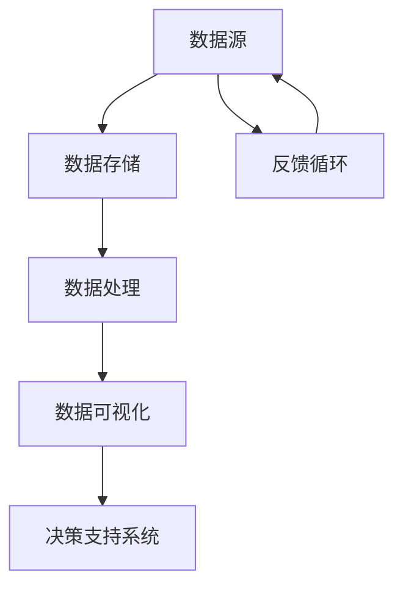

                 

在当今的数据驱动时代，软件架构的演进正经历着巨大的变革。传统的软件架构以功能驱动，更多地依赖于预定义的逻辑和数据结构。然而，随着大数据、人工智能和云计算的快速发展，软件的开发和使用模式正在向数据驱动转型。这种转型不仅改变了软件开发的流程，也对架构师的角色提出了新的要求。本文将探讨数据驱动软件2.0时代，架构师需要具备的能力和技能。

## 1. 背景介绍

### 1.1 数据驱动的起源

数据驱动的发展可以追溯到20世纪80年代，当时计算机科学界开始认识到数据的重要性。随着数据库管理系统（DBMS）和关系型数据库的普及，数据处理成为软件开发中的一个关键环节。随着时间推移，数据驱动理念逐渐从简单的数据处理扩展到更复杂的领域，如机器学习和大数据分析。

### 1.2 软件开发的转变

在数据驱动的背景下，软件开发的流程发生了重大变化。传统的瀑布模型逐渐被敏捷开发、DevOps等更加灵活的方法所取代。这些方法强调快速迭代、持续集成和持续交付，使得软件系统能够更好地适应数据驱动环境中的变化。

## 2. 核心概念与联系

### 2.1 数据驱动软件的定义

数据驱动软件是指其设计、开发和运行过程中，数据发挥着核心作用。这种软件通常具有以下特点：

- **高度可扩展性**：能够处理大规模的数据集。
- **高灵活性**：能够根据数据的变化快速调整。
- **自动化**：数据处理和分析的自动化程度较高。
- **实时性**：能够实时处理和响应数据。

### 2.2 数据驱动软件与架构的关系

数据驱动软件的成功依赖于其架构的适应性。一个良好的架构能够确保软件系统在高数据量、高并发和快速变化的环境中稳定运行。

### 2.3 Mermaid 流程图



## 3. 核心算法原理 & 具体操作步骤

### 3.1 算法原理概述

数据驱动软件的核心算法通常包括以下几种：

- **机器学习算法**：用于数据分析和预测。
- **数据挖掘算法**：用于从大量数据中提取有用信息。
- **分布式计算算法**：用于处理大规模数据集。

### 3.2 算法步骤详解

1. **数据收集**：收集来自各种来源的数据。
2. **数据预处理**：清洗、转换和归一化数据。
3. **数据存储**：选择合适的数据库进行数据存储。
4. **数据处理**：使用算法对数据进行分析和挖掘。
5. **结果可视化**：将分析结果以可视化的形式展示。
6. **反馈循环**：根据反馈调整算法和系统配置。

### 3.3 算法优缺点

#### 优点：

- **高效性**：能够快速处理和分析大量数据。
- **智能化**：能够从数据中学习，提高决策的准确性。
- **灵活性**：能够根据数据变化进行动态调整。

#### 缺点：

- **复杂性**：算法和系统的复杂性较高，需要专业的知识和技能。
- **成本**：需要大量的计算资源和存储资源。

### 3.4 算法应用领域

数据驱动算法在各个领域都有广泛应用，如：

- **金融领域**：风险评估、欺诈检测。
- **医疗领域**：疾病预测、个性化治疗。
- **电商领域**：推荐系统、价格优化。

## 4. 数学模型和公式 & 详细讲解 & 举例说明

### 4.1 数学模型构建

在数据驱动软件中，常见的数学模型包括：

- **线性回归**：用于预测连续值。
- **逻辑回归**：用于预测二元结果。
- **神经网络**：用于复杂模式识别。

### 4.2 公式推导过程

以线性回归为例，其公式推导如下：

$$
y = \beta_0 + \beta_1x + \epsilon
$$

其中，$y$ 是因变量，$x$ 是自变量，$\beta_0$ 和 $\beta_1$ 是模型参数，$\epsilon$ 是误差项。

### 4.3 案例分析与讲解

假设我们要预测一家电商平台的销售额，可以使用线性回归模型。我们收集了过去一周每天的销售数据和天气数据，通过数据预处理和模型训练，得到线性回归公式：

$$
销售额 = 1000 + 50 \times 天气温度
$$

使用这个模型，我们可以预测明天的销售额。

## 5. 项目实践：代码实例和详细解释说明

### 5.1 开发环境搭建

首先，我们需要搭建一个适合数据驱动软件开发的开发环境。假设我们使用Python作为主要编程语言，需要安装以下依赖：

- NumPy
- Pandas
- Scikit-learn
- Matplotlib

### 5.2 源代码详细实现

以下是一个简单的线性回归模型的Python代码示例：

```python
import numpy as np
import pandas as pd
from sklearn.linear_model import LinearRegression
import matplotlib.pyplot as plt

# 读取数据
data = pd.read_csv('sales_data.csv')
X = data[['天气温度']]
y = data['销售额']

# 创建线性回归模型
model = LinearRegression()
model.fit(X, y)

# 预测
predictions = model.predict([[25]])

# 可视化
plt.scatter(X, y)
plt.plot(X, predictions, color='red')
plt.xlabel('天气温度')
plt.ylabel('销售额')
plt.show()
```

### 5.3 代码解读与分析

这段代码首先读取了销售数据，然后使用Scikit-learn的线性回归模型进行训练，并使用训练好的模型进行预测。最后，将预测结果以散点图的形式展示。

### 5.4 运行结果展示

运行上述代码后，我们会看到一个散点图，其中红色线条表示预测的销售额。

## 6. 实际应用场景

### 6.1 金融领域

在金融领域，数据驱动软件可以用于风险评估、欺诈检测和投资决策。

### 6.2 医疗领域

在医疗领域，数据驱动软件可以用于疾病预测、个性化治疗和医疗数据分析。

### 6.3 电商领域

在电商领域，数据驱动软件可以用于推荐系统、价格优化和客户行为分析。

## 7. 工具和资源推荐

### 7.1 学习资源推荐

- 《Python数据科学手册》
- 《数据挖掘：概念与技术》
- 《机器学习：实战》

### 7.2 开发工具推荐

- Jupyter Notebook
- PyCharm
- DBeaver

### 7.3 相关论文推荐

- "Data-Driven Software Development: Challenges and Opportunities"
- "Data Science for Business: Data-Driven Strategies for Breakthrough Success"
- "Machine Learning: A Probabilistic Perspective"

## 8. 总结：未来发展趋势与挑战

### 8.1 研究成果总结

数据驱动软件在各个领域取得了显著成果，但其应用仍然面临一些挑战。

### 8.2 未来发展趋势

随着计算能力和数据量的不断增长，数据驱动软件将继续发展，特别是在实时数据处理和个性化服务方面。

### 8.3 面临的挑战

数据隐私、安全性和模型解释性是目前数据驱动软件面临的主要挑战。

### 8.4 研究展望

未来的研究将主要集中在提高数据驱动软件的智能化、安全性和可解释性。

## 9. 附录：常见问题与解答

### 9.1 数据驱动软件与大数据的关系是什么？

数据驱动软件依赖于大数据进行分析和预测，但两者不完全相同。大数据是指大量、多样化的数据，而数据驱动软件是指利用这些数据进行决策和优化。

### 9.2 数据驱动软件与机器学习的关系是什么？

数据驱动软件的核心算法通常包括机器学习算法，但数据驱动软件不仅限于机器学习。它还包括数据存储、处理和可视化等其他组件。

### 9.3 如何确保数据驱动软件的可靠性？

确保数据驱动软件的可靠性需要从数据质量、算法验证和系统测试等多个方面进行综合考虑。

---

本文作者：禅与计算机程序设计艺术 / Zen and the Art of Computer Programming

感谢您的阅读，希望本文对您了解数据驱动软件2.0时代架构师的角色和技能有所帮助。在未来的数据驱动世界中，架构师的角色将越来越重要，他们需要不断创新和适应，以应对不断变化的技术挑战。

