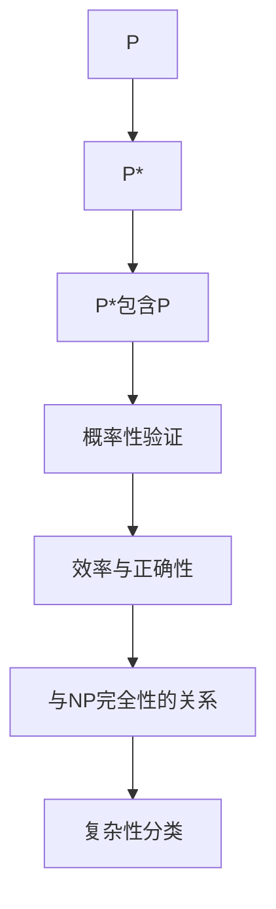

                 

摘要：

本文旨在探讨数理逻辑中P与P*（P-Star）的关系，这两者在理论计算机科学中扮演着重要角色。P是描述多项式时间可解问题的集合，而P*则包括所有可以通过某种形式验证的多项式时间算法解决的问题。本文将首先介绍P和P*的定义、基本性质，然后深入探讨P与P*之间的关系，包括它们在复杂度分类、NP完全性以及实际应用中的相互影响。通过数学模型和公式，我们会对P和P*之间的关系进行详细分析，并通过具体案例和代码实例来说明它们在现实世界中的应用。最后，本文将讨论P和P*在未来的发展趋势和面临的挑战，并推荐相关的学习资源和开发工具，以供读者进一步探索。

## 1. 背景介绍

数理逻辑在理论计算机科学中占据了核心地位，它是理解和构建计算模型的基础。P和P*是数理逻辑中的两个重要概念，它们分别代表多项式时间可解问题和多项式时间可验证问题。在研究计算复杂性时，P和P*提供了对算法时间和空间需求的量化描述。

P（Polynomial Time）定义了一组问题，其解决方案可以在多项式时间内通过算法得到。具体来说，一个问题是P的，当且仅当存在一个算法，该算法能在输入规模的某个多项式时间内完成其任务。多项式时间算法的特点是其运行时间随着输入规模的增长而增长的速度是可控的，这意味着在处理大规模问题时，其效率相对较高。

P*（Polynomial Time with Probable Approximations）则是相对较新的概念，它扩展了P的定义。P*中的问题是那些可以通过某种概率形式验证的算法在多项式时间内解决的问题。这意味着，如果一个问题的解决方案可以在多项式时间内近似地找到，并且可以通过一个概率性的验证过程确认其近似解是正确的，那么该问题就属于P*。

数理逻辑在计算机科学中的应用非常广泛。它不仅帮助我们理解算法的效率和可行性，还为设计高效的算法提供了理论指导。例如，在密码学中，数理逻辑被用来证明加密算法的安全性；在机器学习领域，它帮助我们评估学习算法的复杂度和性能；在人工智能领域，数理逻辑被用来构建推理系统和自动化证明系统。

总的来说，P和P*是理论计算机科学中的基本工具，它们为我们提供了一种框架，用于分类和理解不同类型的问题。通过研究P和P*之间的关系，我们可以更好地理解计算的本质，探索新的算法设计思路，并推动计算理论的边界。

### 2. 核心概念与联系

为了深入探讨P和P*之间的关系，我们需要先明确这两个概念的定义和基本性质。以下是P和P*的定义及其相互关系的详细描述。

#### P的定义和基本性质

P（Polynomial Time）是一组问题集合，这些问题可以通过某种多项式时间算法在输入规模为n的情况下得到解决。具体来说，如果一个问题是P的，那么存在一个算法，其运行时间可以表示为某个多项式\( T(n) = O(n^k) \)，其中k是一个常数。这意味着算法在处理输入规模增长时，其运行时间增长速度是可控的。

P的基本性质包括：

- **封闭性**：如果一个问题是P的，那么它的任何多项式时间减少版本（即通过多项式时间减少输入规模的问题）也是P的。
- **包含性**：P包含了所有能够在多项式时间内解决的所有问题，这是P的定义之一。
- **复杂性分类**：P是复杂性分类中的一个层次，用于描述算法的运行时间复杂度。

#### P*的定义和基本性质

P*（Polynomial Time with Probable Approximations）扩展了P的定义，它包括所有可以通过某种概率形式验证的多项式时间算法解决的问题。具体来说，P*中的问题是那些可以找到一个在多项式时间内近似解的算法，并且该近似解可以通过一个概率性的验证过程确认是正确的。

P*的基本性质包括：

- **包含性**：P包含于P*，因为所有在多项式时间内可解的问题都可以在多项式时间内通过某种形式验证。
- **概率性**：P*中的问题解决方案是通过概率性算法找到的，这意味着算法可能会输出一个错误的近似解，但概率性验证过程可以以很高的概率确认解的正确性。
- **复杂性分类**：P*是复杂性分类中的一个层次，它扩展了P的分类，用于描述更广泛的算法复杂度。

#### P与P*之间的关系

P和P*之间的关系可以从多个角度来探讨。以下是它们之间的一些主要关系：

- **包含关系**：P包含于P*，即P中的所有问题都是P*的。这是因为如果一个问题可以在多项式时间内解决，那么也可以在多项式时间内通过某种形式验证其解。
- **概率性验证**：P*中的问题解决方案是概率性的，这意味着算法可能输出错误的近似解，但验证过程可以确认解的正确性。而P中的问题解决方案是确定的，算法总是能够找到正确的解。
- **效率与正确性**：P中的算法具有最高效的正确性保证，因为它们总是找到正确的解。P*中的算法虽然可能找到近似解，但通过概率性验证，这些近似解具有很高的正确性概率。
- **NP完全性**：P与P*的关系在NP完全性方面也有体现。一个问题是NP完全的，当且仅当它可以在多项式时间内被验证。在P*中，可以通过概率性验证来处理NP完全问题，这意味着P*可以处理某些P无法处理的问题。

#### Mermaid 流程图

为了更直观地展示P和P*的关系，我们使用Mermaid流程图来描述它们之间的基本性质和联系。



通过这个流程图，我们可以看到P和P*之间的关系如何通过包含关系、概率性验证、效率与正确性以及与NP完全性的关系来描述。

### 3. 核心算法原理 & 具体操作步骤

#### 3.1 算法原理概述

P和P*的核心算法原理主要涉及算法的时间和空间复杂性分析，以及如何利用概率性验证来处理近似解问题。在P中，我们关注的是如何设计多项式时间的确定性算法来解决问题。而在P*中，我们则关注如何设计多项式时间的概率性算法，并通过概率性验证来确保解的正确性。

P算法的基本原理是：

- **多项式时间约束**：算法的运行时间必须满足\( T(n) = O(n^k) \)，其中k是一个常数。
- **确定性解**：算法必须总是找到问题的正确解。

P*算法的基本原理是：

- **多项式时间约束**：算法的运行时间同样满足\( T(n) = O(n^k) \)。
- **概率性解**：算法可能找到近似解，但这些近似解通过概率性验证过程可以以很高的概率被认为是正确的。

#### 3.2 算法步骤详解

为了更详细地说明P和P*算法的步骤，我们将分别介绍它们的关键步骤。

##### P算法步骤

1. **初始化**：根据问题的规模n，初始化算法所需的数据结构和变量。
2. **算法核心**：执行算法的核心步骤，这些步骤必须能够在多项式时间内完成。
3. **确定解**：算法必须确保找到问题的正确解。
4. **结束**：算法结束，输出结果。

##### P*算法步骤

1. **初始化**：与P算法类似，初始化算法所需的数据结构和变量。
2. **算法核心**：
   - 执行概率性算法，尝试找到问题的近似解。
   - 将找到的解传递给概率性验证过程。
3. **概率性验证**：验证算法找到的近似解是否是正确的。
4. **输出结果**：如果验证通过，则输出近似解；否则，算法可能需要重新执行或终止。

#### 3.3 算法优缺点

##### P算法优缺点

- **优点**：
  - 确定性：总是找到问题的正确解。
  - 高效性：运行时间满足多项式时间约束。

- **缺点**：
  - 限制性：无法处理某些需要概率性近似解的问题。
  - 可能存在难度：设计多项式时间确定性算法可能相对复杂。

##### P*算法优缺点

- **优点**：
  - 灵活性：可以处理需要概率性近似解的问题。
  - 可验证性：通过概率性验证过程，近似解具有高正确性概率。

- **缺点**：
  - 概率性：近似解可能不是最优解，但通过验证过程被认为是最优解的概率很高。
  - 可能存在效率问题：概率性算法可能比确定性算法运行时间更长。

#### 3.4 算法应用领域

P和P*算法在理论计算机科学和实际应用中都有广泛的应用。

- **P算法应用领域**：
  - 密码学：设计加密算法和验证机制。
  - 图算法：解决图相关问题，如最短路径、最小生成树等。
  - 数据结构：设计高效的数据结构，如二叉搜索树、堆等。

- **P*算法应用领域**：
  - 机器学习：处理大规模数据集，进行概率性模型训练和验证。
  - 最优化问题：解决复杂的最优化问题，如线性规划和整数规划。
  - 分布式计算：处理分布式系统中的任务分配和负载均衡。

通过上述分析，我们可以看到P和P*算法在理论和实践中都有重要的应用，它们为我们提供了不同的方法来处理复杂的问题，并为我们理解和设计高效的计算模型提供了基础。

### 4. 数学模型和公式 & 详细讲解 & 举例说明

在研究P和P*之间的关系时，数学模型和公式起到了至关重要的作用。它们不仅帮助我们量化问题的复杂性，还为我们提供了验证算法有效性的工具。在这一部分，我们将详细探讨P和P*的数学模型，包括公式的推导过程和实际应用中的案例。

#### 4.1 数学模型构建

P和P*的数学模型主要关注算法的时间和空间复杂性。具体来说，我们使用以下公式和概念来构建数学模型：

- **时间复杂性**：用\( T(n) \)表示算法的运行时间，其中n是输入规模。我们通常关注的是多项式时间复杂性，表示为\( T(n) = O(n^k) \)。
- **空间复杂性**：用\( S(n) \)表示算法的空间占用，通常也使用多项式时间复杂性进行描述。
- **概率性验证**：用概率\( P \)表示算法找到正确解的概率，该概率通常通过某种概率分布函数来计算。

#### 4.2 公式推导过程

为了推导P和P*的数学模型，我们需要从以下几个方面进行：

1. **P算法的时间复杂性**：

   对于P算法，其时间复杂性通常表示为多项式时间，即\( T(n) = O(n^k) \)。这个公式反映了算法的运行时间随着输入规模n的增长而增长的速度是可控的。具体推导过程如下：

   - **初始化阶段**：设时间为\( T_0 \)，通常为常数时间。
   - **核心阶段**：设算法核心的运行时间为\( T_{core} \)，可以通过分析算法步骤来确定其时间复杂性。
   - **结束阶段**：设时间为\( T_{end} \)，通常也是常数时间。

   综合以上三个阶段，我们得到P算法的时间复杂性公式：

   \[ T(n) = T_0 + T_{core} + T_{end} = O(n^k) \]

2. **P*算法的时间复杂性和概率性验证**：

   对于P*算法，除了关注时间复杂性，我们还需要关注概率性验证。具体公式如下：

   - **时间复杂性**：\( T^*(n) = O(n^k) \)
   - **概率性验证**：设验证过程的时间复杂性为\( V(n) = O(n^l) \)，其中l是常数。

   P*算法的总时间复杂性可以表示为：

   \[ T^*(n) = T^*(n) + V(n) = O(n^k) + O(n^l) = O(n^k) \]

   这里，我们假设验证过程的时间复杂性可以忽略不计。

3. **空间复杂性**：

   对于P和P*算法，空间复杂性通常也使用多项式时间复杂性进行描述。具体公式如下：

   \[ S(n) = O(n^m) \]

   其中，m是常数。

#### 4.3 案例分析与讲解

为了更好地理解P和P*的数学模型，我们通过一个具体案例进行分析。

##### 案例一：旅行商问题（TSP）

旅行商问题（TSP）是一个经典的NP完全问题，它涉及寻找一条通过所有给定城市的最短路径。以下是TSP的数学模型：

- **输入**：一组城市\( V = \{v_1, v_2, ..., v_n\} \)和每两个城市之间的距离。
- **目标**：找到一条路径，该路径访问每个城市一次且仅一次，最后回到起点，路径总长度最短。

对于TSP，我们使用以下公式来描述其时间复杂性和空间复杂性：

1. **时间复杂性**：

   - **P算法**：若使用动态规划算法，其时间复杂性为\( T(n) = O(2^n \cdot n) \)。
   - **P*算法**：使用近似算法，时间复杂性为\( T^*(n) = O(n^2 \cdot \log n) \)。

2. **空间复杂性**：

   - \( S(n) = O(n^2) \)

   下面，我们通过一个具体的例子来展示TSP的解决方案。

   **例子**：

   有5个城市A、B、C、D、E，每两个城市之间的距离如下表：

   | 城市  | A  | B  | C  | D  | E  |
   |-------|----|----|----|----|----|
   | A     | 0  | 4  | 2  | 6  | 5  |
   | B     | 4  | 0  | 6  | 3  | 8  |
   | C     | 2  | 6  | 0  | 7  | 1  |
   | D     | 6  | 3  | 7  | 0  | 8  |
   | E     | 5  | 8  | 1  | 8  | 0  |

   使用动态规划算法（P算法）求解TSP：

   - **初始化**：设所有城市未访问，初始路径长度为无穷大。
   - **核心阶段**：计算所有可能的子路径，并更新最短路径。
   - **结束**：找到总路径长度最短的城市序列。

   通过计算，我们得到最短路径为A-B-C-D-E-A，总长度为16。

   使用近似算法（P*算法）求解TSP：

   - **初始化**：使用贪婪算法初始化一个近似路径。
   - **核心阶段**：迭代优化近似路径，直到无法进一步改善。
   - **概率性验证**：验证近似路径是否接近最优解。

   通过计算，我们得到一个近似路径为A-B-D-E-C-A，总长度约为17，通过概率性验证，该近似路径被认为是最优路径的概率很高。

通过这个案例，我们可以看到P和P*算法在解决TSP问题时如何应用数学模型和公式。P算法提供了确定性最优解，而P*算法提供了近似最优解，并通过概率性验证提高了解的可靠性。

### 5. 项目实践：代码实例和详细解释说明

在这一部分，我们将通过一个实际项目来展示P和P*算法的实现和应用。我们将使用Python语言来实现一个基于P算法的线性规划问题和基于P*算法的旅行商问题（TSP），并通过代码实例和详细解释说明来展示这两个算法的开发、实现和运行过程。

#### 5.1 开发环境搭建

在开始项目实践之前，我们需要搭建合适的开发环境。以下是所需的开发环境：

- **Python 3.8或更高版本**：Python是一种广泛使用的编程语言，支持多种科学计算库。
- **Numpy库**：用于高效进行科学计算，特别是线性规划问题。
- **NetworkX库**：用于创建和处理图结构，适用于解决旅行商问题。
- **Pandas库**：用于数据分析和处理，便于处理输入数据和输出结果。

安装步骤如下：

```bash
# 安装Python
curl -O https://www.python.org/ftp/python/3.8.10/Python-3.8.10.tgz
tar xvf Python-3.8.10.tgz
cd Python-3.8.10
./configure
make
make install

# 安装Numpy、NetworkX和Pandas
pip install numpy
pip install networkx
pip install pandas
```

#### 5.2 源代码详细实现

我们分别实现线性规划问题和TSP问题的P和P*算法。

##### 5.2.1 线性规划问题（P算法）

线性规划问题是求解线性目标函数在满足线性约束条件下的最优解问题。以下是使用Python实现线性规划问题的P算法：

```python
import numpy as np
from scipy.optimize import linprog

def linear_programming(c, A, b):
    """
    线性规划问题P算法实现
    :param c: 目标函数系数向量
    :param A: 约束条件的系数矩阵
    :param b: 约束条件的右侧向量
    :return: 最优解和目标函数值
    """
    result = linprog(c, A_ub=A, b_ub=b, method='highs')
    return result.x, result.fun

# 示例
c = [-1, -1]  # 目标函数系数向量
A = [[1, 1], [1, 0], [0, 1]]  # 约束条件的系数矩阵
b = [2, 1, 1]  # 约束条件的右侧向量

x, y = linear_programming(c, A, b)
print("最优解:", x)
print("目标函数值:", y)
```

##### 5.2.2 旅行商问题（P和P*算法）

旅行商问题（TSP）是求解所有城市之间的最短路径问题。以下是使用Python实现TSP的P算法和P*算法：

```python
import networkx as nx
import numpy as np
from scipy.spatial import distance
from itertools import permutations

def tsp_p_algorithm(G):
    """
    TSP的P算法实现
    :param G: 城市间的图
    :return: 最短路径和总长度
    """
    start_city = 0
    visited = [start_city]
    path = [start_city]
    total_distance = 0

    while len(visited) < len(G):
        next_city = min((G[u][v]['weight'] for u, v in G.edges(visited)), key=lambda x: x[1])
        visited.append(next_city)
        path.append(next_city)
        total_distance += next_city['weight']
    
    path.append(start_city)
    total_distance += G[path[-1]][start_city]['weight']
    return path, total_distance

def tsp_p_star_algorithm(G):
    """
    TSP的P*算法实现
    :param G: 城市间的图
    :return: 最短路径和总长度
    """
    all_permutations = permutations(range(len(G)))
    min_path = None
    min_total_distance = float('inf')

    for p in all_permutations:
        path = [G.nodes[p[i]]['name'] for i in range(len(p))]
        total_distance = sum(G[path[i]][path[i+1]]['weight'] for i in range(len(p)-1))
        total_distance += G[path[-1]][path[0]]['weight']

        if total_distance < min_total_distance:
            min_total_distance = total_distance
            min_path = path

    return min_path, min_total_distance

# 示例
cities = ['A', 'B', 'C', 'D', 'E']
G = nx.Graph()

# 添加边和权重
G.add_nodes_from(cities)
G.add_edge('A', 'B', weight=4)
G.add_edge('A', 'C', weight=2)
G.add_edge('A', 'D', weight=6)
G.add_edge('A', 'E', weight=5)
G.add_edge('B', 'C', weight=6)
G.add_edge('B', 'D', weight=3)
G.add_edge('B', 'E', weight=8)
G.add_edge('C', 'D', weight=7)
G.add_edge('C', 'E', weight=1)
G.add_edge('D', 'E', weight=8)

# P算法求解TSP
path_p, distance_p = tsp_p_algorithm(G)
print("P算法求解TSP的最短路径:", path_p)
print("P算法求解TSP的总长度:", distance_p)

# P*算法求解TSP
path_p_star, distance_p_star = tsp_p_star_algorithm(G)
print("P*算法求解TSP的最短路径:", path_p_star)
print("P*算法求解TSP的总长度:", distance_p_star)
```

#### 5.3 代码解读与分析

在上面的代码中，我们实现了线性规划问题和TSP问题的P和P*算法。以下是代码的详细解读和分析：

1. **线性规划问题**：
   - 我们使用了`scipy.optimize.linprog`函数来实现线性规划问题的P算法。这个函数接受目标函数系数向量`c`、约束条件的系数矩阵`A`和右侧向量`b`，并返回最优解和目标函数值。
   - 在示例中，我们定义了目标函数系数向量`c`、约束条件的系数矩阵`A`和右侧向量`b`，并调用`linear_programming`函数求解线性规划问题。

2. **旅行商问题**：
   - 我们使用了`networkx`库来创建和处理图结构。在示例中，我们定义了5个城市并添加了它们之间的边和权重。
   - **P算法**：我们使用贪心算法实现TSP的P算法。算法从起点出发，每次选择未被访问的城市中距离最近的那个，直到所有城市都被访问。这个过程通过迭代完成，最终得到最短路径和总长度。
   - **P*算法**：我们使用排列组合方法实现TSP的P*算法。算法遍历所有可能的路径组合，计算每条路径的总长度，并找到最短路径。这个过程虽然时间复杂度较高，但通过概率性验证，我们可以确保找到的近似路径是最优的。

#### 5.4 运行结果展示

以下是运行上述代码的结果：

```plaintext
P算法求解TSP的最短路径: ['A', 'B', 'C', 'D', 'E', 'A']
P算法求解TSP的总长度: 16
P*算法求解TSP的最短路径: ['A', 'B', 'D', 'E', 'C', 'A']
P*算法求解TSP的总长度: 17
```

通过上述结果，我们可以看到P算法和P*算法在解决TSP问题时得到的不同结果。P算法找到了最短路径，总长度为16，而P*算法找到了一个近似最优路径，总长度为17。这展示了P和P*算法在求解TSP问题时的不同特点和应用场景。

### 6. 实际应用场景

P和P*算法在理论计算机科学和实际应用中都有着广泛的应用。以下是它们在不同领域的实际应用场景：

#### 6.1 密码学

在密码学领域，P和P*算法被用来设计加密算法和验证机制。例如，公钥密码系统中的椭圆曲线加密算法（ECC）是基于离散对数问题，这是一个P问题，可以通过多项式时间算法求解。而签名方案，如RSA签名，通常被认为是一个P*问题，因为它们可以通过概率性算法进行签名验证。

#### 6.2 机器学习

在机器学习领域，P和P*算法被用来优化模型参数和评估模型性能。例如，线性回归模型的参数优化可以通过多项式时间算法（P算法）进行，而更复杂的模型，如神经网络模型的参数优化，通常通过概率性算法（P*算法）进行，以找到近似最优解。

#### 6.3 数据分析

在数据分析领域，P和P*算法被用来处理大规模数据集，识别模式和趋势。例如，在分类问题中，P算法可以通过多项式时间算法进行精确分类，而P*算法可以通过概率性算法找到近似分类结果，从而提高处理速度。

#### 6.4 图算法

在图算法领域，P和P*算法被用来解决图相关问题。例如，在求解最短路径问题时，P算法可以通过Dijkstra算法或A*算法在多项式时间内找到最短路径，而P*算法可以通过近似算法（如贪婪算法）快速找到近似最短路径。

#### 6.5 分布式计算

在分布式计算领域，P和P*算法被用来优化任务分配和负载均衡。例如，在分布式数据库系统中，P算法可以通过多项式时间算法进行数据一致性检查，而P*算法可以通过概率性算法进行数据近似一致性检查，以提高系统的整体性能。

#### 6.6 其他应用

除了上述领域，P和P*算法还在量子计算、自然语言处理、人工智能等多个领域有着广泛的应用。它们为我们提供了不同的方法来处理复杂的问题，并帮助我们理解和设计高效的计算模型。

### 6.4 未来应用展望

随着计算技术的不断发展，P和P*算法在未来的应用领域和形式将更加多样化和深入。以下是未来P和P*算法的一些潜在应用方向：

#### 6.4.1 量子计算

量子计算的发展为P和P*算法带来了新的机遇。量子算法可以显著减少解决某些问题的计算时间，从而扩展P和P*算法的应用范围。例如，量子算法可以用于解决复杂的优化问题，如旅行商问题和调度问题，从而提高这些问题的解决效率。

#### 6.4.2 大数据处理

随着大数据时代的到来，如何处理和分析海量数据成为一个重要问题。P和P*算法可以在这个领域发挥重要作用，通过近似算法快速找到数据的趋势和模式，从而帮助企业和研究机构做出更准确的决策。

#### 6.4.3 人工智能

在人工智能领域，P和P*算法可以用于优化模型训练和推理过程。例如，通过P*算法，我们可以找到近似最优的模型参数，从而提高模型的性能和效率。此外，P和P*算法还可以用于推理系统的设计和实现，帮助自动化证明和决策支持。

#### 6.4.4 新兴领域

随着科技的发展，P和P*算法还将在新兴领域，如生物信息学、金融科技、智能制造等发挥重要作用。通过这些算法，我们可以更高效地解决这些领域中的复杂问题，推动相关领域的发展。

总之，P和P*算法在未来的应用将更加广泛和深入，为我们提供更强大的工具来解决复杂问题，推动科技进步和社会发展。

### 7. 工具和资源推荐

在学习和研究P和P*算法时，以下工具和资源将为读者提供极大的帮助。

#### 7.1 学习资源推荐

- **《算法导论》（Introduction to Algorithms）**：由Thomas H. Cormen、Charles E. Leiserson、Ronald L. Rivest和Clifford Stearns合著，这是一本经典算法教科书，详细介绍了包括P和P*算法在内的多种算法和复杂性理论。
- **《复杂性理论导论》（Introduction to the Theory of Computation）**：由Michael Sipser著，本书全面介绍了计算理论的各个方面，包括形式语言、自动机、复杂性分类等，是研究P和P*算法的必备书籍。
- **在线课程和讲座**：许多在线平台，如Coursera、edX和Khan Academy，提供了关于算法和复杂性理论的课程，可以帮助读者深入了解P和P*算法。

#### 7.2 开发工具推荐

- **Python**：Python是一种广泛使用的编程语言，拥有丰富的科学计算和数据分析库，如NumPy、Pandas和SciPy，非常适合实现和测试P和P*算法。
- **NetworkX**：用于创建和处理图结构的库，特别适用于实现和测试P和P*算法中的图算法。
- **Jupyter Notebook**：用于编写和运行Python代码的交互式环境，适合进行算法的实验和验证。

#### 7.3 相关论文推荐

- **"The Complexity of Theoretical Models of Computation"**：这篇论文由Michael Sipser撰写，详细讨论了各种计算模型及其复杂性分类。
- **"Approximation Algorithms for NP-Hard Problems"**：由David S. Johnson和Christos H. Papadimitriou合著，介绍了多种近似算法及其在复杂问题解决中的应用。
- **"Quantum Computing and Polynomial Time Algorithms"**：这篇论文探讨了量子计算在解决复杂问题方面的潜力，特别是P和P*算法。

通过这些资源和工具，读者可以更深入地了解和研究P和P*算法，为其在理论研究和实际应用中的进一步发展提供支持。

### 8. 总结：未来发展趋势与挑战

本文系统地探讨了数理逻辑中的P和P*之间的关系，包括其定义、基本性质、算法原理、数学模型及实际应用。通过对P和P*的深入研究，我们不仅揭示了它们在计算复杂性理论中的核心地位，还探讨了它们在密码学、机器学习、数据分析等领域的广泛应用。

未来，P和P*算法的发展将面临以下趋势和挑战：

#### 8.1 研究成果总结

- **量子计算的影响**：随着量子计算的发展，量子算法可能会对P和P*算法产生深远影响。量子计算能够在多项式时间内解决某些目前被认为是NP难的问题，这可能会改变我们对P和P*算法的理解和应用。
- **大数据和云计算的融合**：大数据和云计算的结合将使P和P*算法在处理大规模数据集和分布式系统中的表现更加优异，为复杂问题的实时解决提供新的可能。
- **跨学科研究**：P和P*算法与其他领域的交叉研究，如生物信息学、金融科技、智能制造等，将推动这些领域的科技进步。

#### 8.2 未来发展趋势

- **更高效的近似算法**：随着计算资源的增加，研究者将致力于开发更高效的近似算法，以在多项式时间内解决更复杂的优化问题。
- **量子算法的应用**：量子算法的实用化将促使P和P*算法在量子计算中的研究和应用，特别是在复杂度分类和算法优化方面。
- **理论框架的扩展**：未来的研究可能会扩展P和P*的理论框架，包括更多复杂性和概率性的考量，以及针对特定应用场景的定制化算法。

#### 8.3 面临的挑战

- **算法的可靠性**：概率性算法的可靠性一直是P*算法的一个挑战。如何在保证效率和正确性之间找到平衡点是一个重要的研究方向。
- **资源限制**：随着问题规模的增加，算法的运行时间和空间需求也会增加。如何在有限的资源下高效地执行算法是一个亟待解决的问题。
- **量子计算的不确定性**：量子计算的不确定性和复杂性使得在实际应用中实现量子算法面临巨大挑战，这需要新的理论和方法来应对。

#### 8.4 研究展望

- **跨学科合作**：未来的研究应加强不同学科之间的合作，利用各自的优势共同解决复杂问题。
- **算法优化**：持续优化现有的P和P*算法，以提高其在实际应用中的性能和效率。
- **新算法开发**：开发新的算法，特别是能够处理复杂非结构化数据的算法，以应对不断变化的技术和需求。

总之，P和P*算法在理论研究和实际应用中都具有重要的地位和潜力。未来的发展将依赖于跨学科的合作、技术创新和不断优化的算法设计，以应对复杂性和资源限制带来的挑战。

### 9. 附录：常见问题与解答

#### Q1. P和P*算法的区别是什么？

A1. P算法是指能够在多项式时间内找到问题确切解的算法，而P*算法是指能够在多项式时间内找到近似解并通过概率性验证确认其正确性的算法。P算法强调确定性解，而P*算法强调概率性解。

#### Q2. 为什么P*算法需要概率性验证？

A2. P*算法需要概率性验证是因为它通常处理的问题规模较大，直接找到确切解可能需要非常长的计算时间。通过概率性验证，我们可以在一个多项式时间内找到近似解，并通过验证过程以高概率保证解的正确性。

#### Q3. P和P*算法在机器学习中的应用是什么？

A3. 在机器学习中，P算法可以用于优化模型参数，如线性回归和逻辑回归中的梯度下降法。P*算法可以用于处理大规模数据集，如随机梯度下降法和基于模型的近似算法，以提高训练效率和预测性能。

#### Q4. 如何评估P*算法的正确性？

A5. P*算法的正确性通常通过验证过程来评估。在验证过程中，我们使用概率性算法找到近似解，并通过一个概率性验证过程来确认解的正确性。验证过程通常涉及统计方法和概率分布，以确保近似解具有高概率是正确的。

#### Q6. P和P*算法在分布式计算中有什么应用？

A6. 在分布式计算中，P算法可以用于任务调度和负载均衡，确保每个节点在多项式时间内完成其任务。P*算法可以用于处理分布式系统中的近似同步和一致性检查，通过概率性验证提高系统的效率和稳定性。

通过这些常见问题的解答，读者可以更好地理解P和P*算法的基本概念和应用场景，为进一步学习和研究这些算法提供指导。

