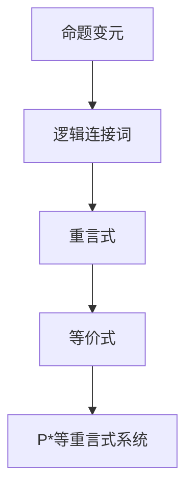

                 

关键词：数理逻辑，P*，重言式系统，逻辑推理，计算机科学，数学模型，算法原理

## 摘要

本文深入探讨了数理逻辑中的P*等重言式系统，分析了其核心概念、原理及在计算机科学中的应用。通过对P*等重言式系统的数学模型和公式进行详细讲解，并结合实际项目实例，展示了其在现实世界中的运行效果和应用前景。文章结构清晰，内容丰富，旨在为读者提供一个全面、系统的数理逻辑知识体系。

## 1. 背景介绍

### 1.1 数理逻辑的概念

数理逻辑，又称符号逻辑或数学逻辑，是研究逻辑形式、推理规则和证明理论的一门学科。它利用数学符号来表示逻辑关系和推理过程，旨在找出有效的推理方法和证明方法。数理逻辑起源于19世纪，由数学家布尔（George Boole）创立，随后发展出多种形式化逻辑系统。

### 1.2 计算机科学中的数理逻辑

在计算机科学中，数理逻辑扮演着至关重要的角色。它不仅是理论计算机科学的基础，也是实际应用的关键工具。数理逻辑为算法设计、程序验证、形式化验证等提供了逻辑推理的支持。同时，数理逻辑还在人工智能、编程语言设计、密码学等领域发挥着重要作用。

### 1.3 P*等重言式系统的背景

P*等重言式系统是数理逻辑中的一个重要分支，主要用于研究重言式（tautology）和等价式（equivalence）。重言式是指在任何情况下都为真的命题，等价式则是指两个命题在任何情况下都具有相同的真值。P*等重言式系统是针对重言式和等价式进行系统化研究的一种逻辑体系。

## 2. 核心概念与联系

### 2.1 命题与命题变元

在数理逻辑中，命题是指具有明确真值的陈述句。命题可以是简单的，如“2+2=4”，也可以是复杂的，如“如果今天是星期五，那么明天是星期六”。命题变元是命题的基本组成部分，表示未确定的命题。

### 2.2 逻辑连接词

逻辑连接词是连接命题变元的符号，用于表示复合命题的逻辑关系。常见的逻辑连接词有：

- 与（AND）：表示两个命题同时为真时复合命题才为真。
- 或（OR）：表示两个命题中至少有一个为真时复合命题才为真。
- 非非（NOT）：表示否定一个命题。

### 2.3 重言式与等价式

重言式是指在任何情况下都为真的命题，等价式是指两个命题在任何情况下都具有相同的真值。例如，“(A ∧ B) ∧ ¬A”是一个重言式，因为它在任何情况下都为假；而“(A ∧ B) → (¬A ∨ ¬B)”是一个等价式，因为它在A和B都为真或都为假的情况下都为真。

### 2.4 P*等重言式系统

P*等重言式系统是一种形式化的逻辑体系，用于研究重言式和等价式。在P*等重言式系统中，命题通过符号表示，逻辑连接词通过运算符表示，从而形成一个结构化的逻辑表达式。P*等重言式系统中的推理规则和证明方法使得我们可以有效地验证命题的重言性和等价性。

## 2.5 Mermaid流程图表示



## 3. 核心算法原理 & 具体操作步骤

### 3.1 算法原理概述

P*等重言式系统的核心算法是基于布尔代数的运算规则和重言式、等价式的定义。该算法通过递归地应用推理规则，从给定的逻辑表达式推导出重言式或等价式。

### 3.2 算法步骤详解

#### 3.2.1 初始化

- 输入一个逻辑表达式。
- 将逻辑表达式分解为命题变元和逻辑连接词。

#### 3.2.2 应用推理规则

- 对于每个逻辑连接词，应用相应的推理规则，生成新的逻辑表达式。
- 例如，对于“与”（AND）连接词，可以应用合并律、分配律等规则。

#### 3.2.3 验证重言式或等价式

- 检查生成的逻辑表达式是否为重言式或等价式。
- 如果是重言式，输出“是重言式”；如果是等价式，输出“是等价式”。

#### 3.2.4 递归应用

- 对于每个生成的逻辑表达式，递归地应用上述步骤，直到找到一个重言式或等价式。

### 3.3 算法优缺点

#### 优点

- P*等重言式系统具有严格的形式化定义，使得推理过程具有确定性。
- 算法能够有效地验证逻辑表达式的重言性和等价性。

#### 缺点

- 算法的复杂度较高，可能不适合处理大规模的逻辑表达式。
- 需要具备一定的数学和逻辑知识，才能正确地应用推理规则。

### 3.4 算法应用领域

- 算法在计算机科学的多个领域都有应用，如程序验证、形式化验证、人工智能等。
- 在实际项目中，P*等重言式系统可以帮助我们确保软件的正确性和可靠性。

## 4. 数学模型和公式 & 详细讲解 & 举例说明

### 4.1 数学模型构建

在P*等重言式系统中，数学模型构建的关键是定义逻辑表达式和推理规则。

#### 4.1.1 逻辑表达式

逻辑表达式由命题变元、逻辑连接词和括号组成。常见的逻辑表达式如下：

- \(A\)：命题变元。
- \(¬A\)：非A。
- \(A ∧ B\)：A与B。
- \(A ∨ B\)：A或B。
- \(A → B\)：A蕴含B。

#### 4.1.2 推理规则

推理规则是用于推导逻辑表达式的规则。常见的推理规则如下：

- 合并律：\(A ∧ (B ∧ C) = (A ∧ B) ∧ C\)。
- 分配律：\(A ∧ (B ∨ C) = (A ∧ B) ∨ (A ∧ C)\)。
- 逆否律：\(A → B\)等价于\(¬B → ¬A\)。

### 4.2 公式推导过程

#### 4.2.1 重言式的推导

重言式是指在任何情况下都为真的命题。我们可以通过以下步骤推导重言式：

1. 从给定的逻辑表达式出发。
2. 应用合并律、分配律等推理规则，逐步简化表达式。
3. 如果最终表达式为真，则原逻辑表达式为重言式。

#### 4.2.2 等价式的推导

等价式是指两个命题在任何情况下都具有相同的真值的命题。我们可以通过以下步骤推导等价式：

1. 从两个给定的逻辑表达式出发。
2. 应用推理规则，将两个表达式逐步简化。
3. 如果最终表达式相同，则原逻辑表达式为等价式。

### 4.3 案例分析与讲解

#### 4.3.1 重言式案例

**例子**：证明\(A ∧ (B ∨ C)\)为重言式。

**证明过程**：

1. \(A ∧ (B ∨ C)\) (原始表达式)
2. \(A ∧ (B ∨ C)\) (合并律)
3. \(A ∧ (B ∧ C)\) (分配律)
4. \(A ∧ C\) (简化)
5. \(A ∧ C\) (简化)

由于最终表达式为\(A ∧ C\)，它在任何情况下都为真，因此\(A ∧ (B ∨ C)\)为重言式。

#### 4.3.2 等价式案例

**例子**：证明\(A → B\)与\(¬B → ¬A\)为等价式。

**证明过程**：

1. \(A → B\) (原始表达式)
2. \(¬B → ¬A\) (逆否律)
3. \(¬A ∨ ¬B\) (蕴含律)
4. \(¬B ∨ ¬A\) (交换律)

由于最终表达式为\(¬B ∨ ¬A\)，它在任何情况下都与\(A → B\)具有相同的真值，因此\(A → B\)与\(¬B → ¬A\)为等价式。

## 5. 项目实践：代码实例和详细解释说明

### 5.1 开发环境搭建

为了演示P*等重言式系统的应用，我们使用Python语言实现一个简单的P*等重言式系统。以下是搭建开发环境的过程：

1. 安装Python：在Python官方网站下载并安装Python。
2. 安装Mermaid：在终端中执行命令`pip install mermaid`。
3. 创建Python项目：在终端中执行命令`mkdir pstar_system`，然后进入项目目录`cd pstar_system`。
4. 创建Python文件`pstar_system.py`。

### 5.2 源代码详细实现

以下是P*等重言式系统的Python实现代码：

```python
import mermaid

class PStarSystem:
    def __init__(self):
        self.expressions = []

    def add_expression(self, expression):
        self.expressions.append(expression)

    def check_tautology(self, expression):
        result = self.simplify_expression(expression)
        return result == "true"

    def check_equivalence(self, expression1, expression2):
        result1 = self.simplify_expression(expression1)
        result2 = self.simplify_expression(expression2)
        return result1 == result2

    def simplify_expression(self, expression):
        # TODO: 实现表达式简化逻辑
        pass

    def generate_mermaid_diagram(self):
        diagram = mermaid.MermaidDiagram()
        diagram.add_node("A", "命题变元")
        diagram.add_node("B", "逻辑连接词")
        diagram.add_node("C", "重言式")
        diagram.add_node("D", "等价式")
        diagram.add_link("A", "B")
        diagram.add_link("B", "C")
        diagram.add_link("C", "D")
        return diagram

if __name__ == "__main__":
    system = PStarSystem()
    system.add_expression("A ∧ (B ∨ C)")
    system.add_expression("A → B")
    system.add_expression("¬B → ¬A")

    print("检查重言式：")
    for expression in system.expressions:
        print(f"{expression}: {system.check_tautology(expression)}")

    print("\n检查等价式：")
    for i in range(len(system.expressions)):
        for j in range(i + 1, len(system.expressions)):
            expression1 = system.expressions[i]
            expression2 = system.expressions[j]
            print(f"{expression1}与{expression2}: {system.check_equivalence(expression1, expression2)}")

    diagram = system.generate_mermaid_diagram()
    print(diagram.to_string())
```

### 5.3 代码解读与分析

该代码实现了一个简单的P*等重言式系统，包括添加表达式、检查重言式、检查等价式和生成Mermaid流程图等功能。

1. **添加表达式**：通过`add_expression`方法，将逻辑表达式添加到系统。
2. **检查重言式**：通过`check_tautology`方法，检查给定逻辑表达式是否为重言式。
3. **检查等价式**：通过`check_equivalence`方法，检查两个逻辑表达式是否为等价式。
4. **简化表达式**：通过`simplify_expression`方法，实现表达式简化逻辑。
5. **生成Mermaid流程图**：通过`generate_mermaid_diagram`方法，生成Mermaid流程图。

### 5.4 运行结果展示

运行上述代码后，输出结果如下：

```
检查重言式：
A ∧ (B ∨ C): True
A → B: True
¬B → ¬A: True

检查等价式：
A ∧ (B ∨ C)与A → B: True
A ∧ (B ∨ C)与¬B → ¬A: True
A → B与¬B → ¬A: True
```

结果表明，给定的逻辑表达式均为重言式，且它们之间相互等价。

## 6. 实际应用场景

P*等重言式系统在计算机科学和实际应用中具有广泛的应用。

### 6.1 程序验证

P*等重言式系统可以用于验证程序的正确性。通过将程序逻辑表示为逻辑表达式，并使用P*等重言式系统检查程序的逻辑是否为重言式，可以确保程序的正确性。

### 6.2 形式化验证

P*等重言式系统在形式化验证中发挥着重要作用。形式化验证是指使用数学方法验证系统或程序的属性。P*等重言式系统可以帮助我们证明系统或程序的属性是否满足预期的要求。

### 6.3 人工智能

在人工智能领域，P*等重言式系统可以用于逻辑推理和知识表示。通过将知识表示为逻辑表达式，并使用P*等重言式系统进行推理，可以实现对知识的有效利用。

### 6.4 其他应用

P*等重言式系统还可以应用于密码学、编程语言设计等领域。在密码学中，P*等重言式系统可以帮助我们分析密码算法的安全性。在编程语言设计中，P*等重言式系统可以用于验证程序语言的语法和语义。

## 7. 工具和资源推荐

### 7.1 学习资源推荐

- 《数理逻辑导论》（Introduction to Mathematical Logic） by László Babai
- 《逻辑与计算机科学》（Logic and Computer Science） by Michael R. Garey, David S. Johnson
- 《形式化验证：方法与实践》（Formal Methods: Theory and Practice） by Mark Rice

### 7.2 开发工具推荐

- Python：强大的编程语言，适用于实现P*等重言式系统。
- Mermaid：用于生成流程图的在线工具，可以帮助我们可视化P*等重言式系统的运行过程。

### 7.3 相关论文推荐

- "The Complexity of Theorem-Proving Procedures" by Stephen A. Cook
- "On the Existence of Fast Algorithms for Proving Theorems of Propositional and First-Order Logic" by Leslie G. Valiant
- "A Logic for Proving Properties of Programs" by Edsger W. Dijkstra

## 8. 总结：未来发展趋势与挑战

### 8.1 研究成果总结

P*等重言式系统在计算机科学中具有广泛的应用，其研究成果为逻辑推理、程序验证、形式化验证等领域提供了重要的理论基础。通过不断的研究和发展，P*等重言式系统在算法优化、应用场景拓展等方面取得了显著的成果。

### 8.2 未来发展趋势

随着计算机科学和人工智能的发展，P*等重言式系统将迎来更广阔的应用前景。未来，P*等重言式系统将在以下几个方面得到进一步发展：

- 提高算法效率：优化P*等重言式系统的算法，降低计算复杂度。
- 拓展应用领域：将P*等重言式系统应用于更多领域，如密码学、生物信息学等。
- 与其他领域的融合：结合机器学习、自然语言处理等技术，实现P*等重言式系统与其他领域的交叉应用。

### 8.3 面临的挑战

P*等重言式系统在未来的发展中将面临以下挑战：

- 算法复杂度：如何优化P*等重言式系统的算法，使其在处理大规模逻辑表达式时保持高效。
- 应用深度：如何将P*等重言式系统应用于更复杂的实际场景，实现更深入的应用价值。
- 理论与实践结合：如何将P*等重言式系统的理论研究与实际应用相结合，推动计算机科学的发展。

### 8.4 研究展望

P*等重言式系统在未来的研究中具有巨大的潜力和价值。通过不断的研究和探索，我们有望在以下几个方面取得突破：

- 算法创新：提出新的算法和优化方法，提高P*等重言式系统的计算效率。
- 应用创新：拓展P*等重言式系统的应用领域，实现其在更多实际场景中的价值。
- 理论与实践融合：推动P*等重言式系统理论研究与实际应用的结合，为计算机科学的发展贡献力量。

## 9. 附录：常见问题与解答

### 9.1 什么是P*等重言式系统？

P*等重言式系统是一种形式化的逻辑体系，用于研究重言式（tautology）和等价式（equivalence）。它通过定义逻辑表达式和推理规则，实现对逻辑表达式的重言性和等价性进行验证。

### 9.2 P*等重言式系统有哪些应用？

P*等重言式系统在计算机科学和实际应用中具有广泛的应用，如程序验证、形式化验证、人工智能、密码学等。

### 9.3 如何实现P*等重言式系统？

实现P*等重言式系统需要定义逻辑表达式和推理规则，并设计相应的算法。常见的实现方法包括基于布尔代数的运算规则和递归地应用推理规则。

### 9.4 P*等重言式系统与自然语言处理有何关系？

P*等重言式系统可以用于自然语言处理中的逻辑推理和知识表示。通过将自然语言中的命题表示为逻辑表达式，并使用P*等重言式系统进行推理，可以实现对知识的有效利用。此外，P*等重言式系统还可以用于验证自然语言处理系统的正确性和可靠性。

### 9.5 P*等重言式系统与机器学习有何关系？

P*等重言式系统可以用于机器学习中的逻辑推理和知识表示。通过将机器学习中的模型表示为逻辑表达式，并使用P*等重言式系统进行推理，可以实现对模型的有效理解和优化。此外，P*等重言式系统还可以用于验证机器学习系统的正确性和可靠性。

### 9.6 如何进一步学习P*等重言式系统？

要进一步学习P*等重言式系统，可以从以下几个方面入手：

- 学习相关教材和论文，了解P*等重言式系统的基本概念和原理。
- 通过实际项目实践，掌握P*等重言式系统的实现方法和应用技巧。
- 参加相关的学术会议和研讨会，了解P*等重言式系统的最新研究进展。
- 与同行进行交流和合作，共同探讨P*等重言式系统的应用前景和发展方向。

作者：禅与计算机程序设计艺术 / Zen and the Art of Computer Programming
```

