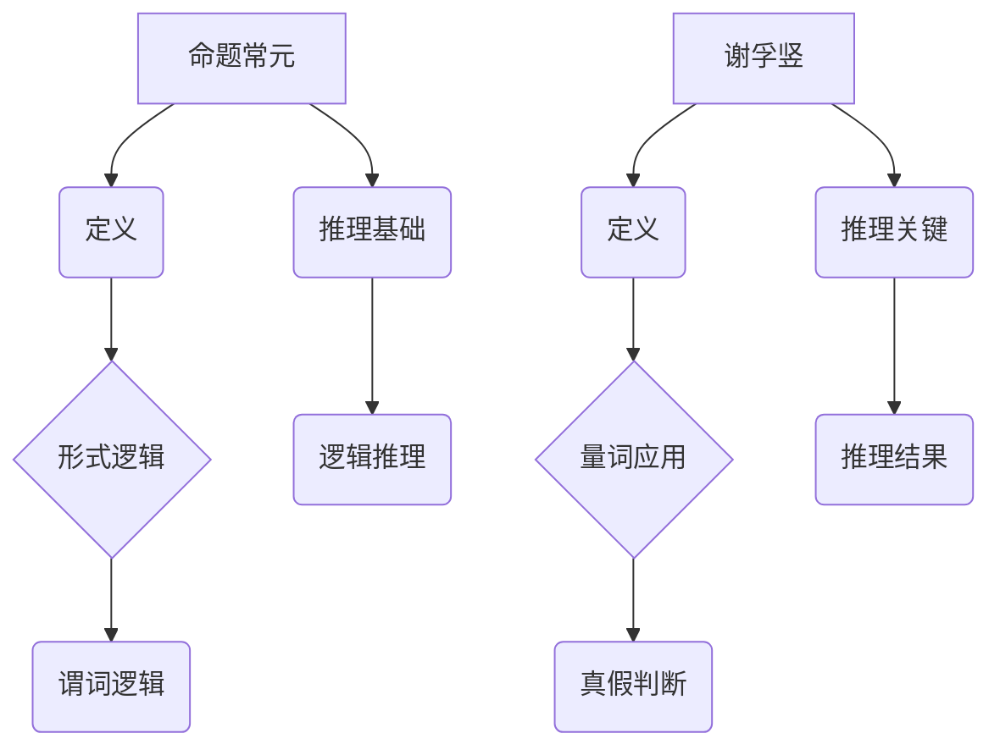

                 

关键词：数理逻辑，命题常元，谢孚竖，形式逻辑，谓词逻辑，算法原理，数学模型，应用场景，未来展望

> 摘要：本文深入探讨了数理逻辑中的命题常元和谢孚竖概念，分析了其在形式逻辑和谓词逻辑中的应用。通过数学模型和公式的推导，结合实际项目实践，阐述了这些概念在计算机程序设计和人工智能领域的应用价值，并对未来的发展趋势和挑战进行了展望。

## 1. 背景介绍

数理逻辑是现代数学和计算机科学的基础之一，它提供了一种形式化的方法来研究推理、证明和计算。数理逻辑主要包括命题逻辑、谓词逻辑、集合论、模型论和证明论等分支。在命题逻辑中，基本元素是命题，而谓词逻辑则进一步引入了变量和量词，使得逻辑推理更加精细和复杂。

本文重点讨论的命题常元和谢孚竖是谓词逻辑中的核心概念。命题常元指的是命题中不变的、确定的元素，例如在“所有的猫都会飞”这个命题中，“猫”和“飞”就是命题常元。而谢孚竖则表示某个命题在特定条件下为真或为假，是谓词逻辑中量词的应用。

### 1.1 形式逻辑与谓词逻辑的关系

形式逻辑是数理逻辑的基础，主要研究命题和命题之间的关系，通过命题联结词（如与、或、非）来构建复杂的命题形式。而谓词逻辑在形式逻辑的基础上，引入了变量和量词，使得逻辑表达式可以表示更复杂的性质和关系。

谓词逻辑中的量词分为全称量词和存在量词。全称量词表示“对所有”，例如“所有的猫都是哺乳动物”，而存在量词则表示“存在”，例如“存在一只猫会飞”。通过量词的使用，谓词逻辑可以表达更复杂的逻辑关系，使得推理更加精确和深入。

### 1.2 命题常元和谢孚竖在逻辑中的应用

命题常元和谢孚竖在逻辑推理中起着至关重要的作用。命题常元可以帮助我们识别和区分命题中的关键元素，而谢孚竖则用于确定命题的真假。在形式逻辑中，命题常元和谢孚竖的应用相对简单，但在谓词逻辑中，它们的作用更加重要和复杂。

在谓词逻辑中，命题常元通常用来定义谓词，例如“猫会飞”中的“猫”和“飞”就是命题常元。通过谓词，我们可以构造复杂的逻辑表达式，例如“所有的猫都是哺乳动物”和“存在一只猫会飞”。谢孚竖则用于判断这些逻辑表达式的真假，从而帮助我们进行推理和证明。

## 2. 核心概念与联系

### 2.1 命题常元的定义与作用

命题常元是指在命题中不变的、确定的元素。在形式逻辑中，命题常元通常是简单命题，例如“猫”和“飞”在“所有的猫都会飞”这个命题中就是命题常元。在谓词逻辑中，命题常元可以更加复杂，例如“所有的哺乳动物都有脊椎”中的“哺乳动物”和“脊椎”就是命题常元。

命题常元在逻辑推理中起着至关重要的作用。通过识别和区分命题中的命题常元，我们可以更好地理解和分析命题的性质，从而进行更有效的推理和证明。

### 2.2 谢孚竖的概念与作用

谢孚竖是谓词逻辑中的一个重要概念，用于表示某个命题在特定条件下为真或为假。在谓词逻辑中，谢孚竖通常与量词一起使用，例如“所有的猫都是哺乳动物”中的“哺乳动物”就是谢孚竖的应用。

谢孚竖在逻辑推理中起着关键作用。通过谢孚竖，我们可以判断命题的真假，从而确定推理的方向和结果。例如，如果我们知道“所有的猫都是哺乳动物”这个命题为真，那么“存在一只猫会飞”这个命题也为真。

### 2.3 命题常元和谢孚竖的关联

命题常元和谢孚竖在逻辑推理中有着紧密的联系。命题常元是构成谓词逻辑的基础，而谢孚竖则用于判断命题的真假。在谓词逻辑中，通过使用命题常元和谢孚竖，我们可以构建复杂的逻辑表达式，进行精细的逻辑推理。

为了更好地理解命题常元和谢孚竖的关系，我们可以通过一个Mermaid流程图来展示它们之间的联系。



### 2.4 命题常元和谢孚竖的例子

为了更具体地说明命题常元和谢孚竖的概念，我们可以通过一些实际的例子来展示它们的应用。

#### 例子 1：所有猫都会飞

在命题“所有的猫都会飞”中，“猫”和“飞”就是命题常元。这个命题的谢孚竖表示为“所有的猫都是会飞的动物”。通过这个谢孚竖，我们可以判断命题的真假。如果我们知道现实中的猫不会飞，那么这个命题就是假的。

#### 例子 2：存在一只猫会飞

在命题“存在一只猫会飞”中，“猫”和“飞”同样是命题常元。这个命题的谢孚竖表示为“存在一只会飞的动物”。通过这个谢孚竖，我们可以判断命题的真假。如果我们知道现实中存在会飞的猫，那么这个命题就是真的。

通过这些例子，我们可以看到命题常元和谢孚竖在逻辑推理中的应用。它们不仅帮助我们理解命题的结构，还帮助我们判断命题的真假，从而进行有效的推理和证明。

## 3. 核心算法原理 & 具体操作步骤

### 3.1 算法原理概述

在数理逻辑中，命题常元和谢孚竖的应用主要体现在推理和证明过程中。一个核心的算法原理是谓词逻辑推理算法，它基于命题常元和谢孚竖的概念，通过一系列的逻辑规则，从已知的前提推导出结论。

谓词逻辑推理算法的基本思想是使用逻辑规则（如全称量化规则、存在量化规则、结合律、交换律等）来变换逻辑表达式，从而逐步推导出结论。这个算法可以形式化地表示为一个递归的过程，其核心步骤包括：

1. **化简逻辑表达式**：通过应用逻辑规则，将复杂的逻辑表达式简化为更简单的形式。
2. **引入和消除量词**：使用全称量化规则和存在量化规则来引入或消除量词。
3. **推导结论**：通过逻辑推理，从已知的前提推导出结论。

### 3.2 算法步骤详解

下面是谓词逻辑推理算法的具体步骤：

#### 步骤 1：初始化

- 输入：一组前提 \(P_1, P_2, ..., P_n\) 和一个结论 \(Q\)。
- 输出：通过逻辑推理证明 \(Q\) 是否成立。

#### 步骤 2：化简逻辑表达式

- 对每个前提 \(P_i\) 进行化简，应用逻辑规则（如结合律、交换律、分配律等），将其转换为更简单的形式。

#### 步骤 3：引入和消除量词

- 使用全称量化规则和存在量化规则，将含有量词的逻辑表达式进行变换，使其更便于推理。
- 例如，将“所有的 \(x\) 满足 \(P(x)\)”转换为“\(P(x)\) 对于所有的 \(x\) 都成立”。

#### 步骤 4：推导结论

- 通过逻辑推理，从化简后的前提中推导出结论 \(Q\)。
- 可能需要使用逻辑规则（如蕴含规则、反证法等）来证明结论。

#### 步骤 5：验证结论

- 检查推导出的结论是否满足所有前提，如果满足，则证明成功；如果不满足，则证明失败。

### 3.3 算法优缺点

#### 优点

- **精确性**：谓词逻辑推理算法基于严格的逻辑规则，能够保证推理过程的正确性。
- **普适性**：适用于各种形式的逻辑推理问题，特别是复杂的谓词逻辑问题。
- **形式化**：能够将逻辑推理过程形式化地表示，便于计算机处理和分析。

#### 缺点

- **复杂性**：谓词逻辑推理算法的复杂性较高，特别是在处理大规模逻辑表达式时，计算量会显著增加。
- **效率问题**：对于某些复杂的逻辑推理问题，算法的运行效率可能不高。

### 3.4 算法应用领域

谓词逻辑推理算法在计算机科学和人工智能领域有广泛的应用：

- **自动推理系统**：用于验证数学证明、软件验证、模型检查等。
- **知识表示与推理**：在知识库系统、专家系统中，用于表示知识和进行推理。
- **自然语言处理**：用于理解和解析自然语言中的逻辑关系。

## 4. 数学模型和公式 & 详细讲解 & 举例说明

### 4.1 数学模型构建

在数理逻辑中，命题常元和谢孚竖的数学模型构建是基于谓词逻辑的。谓词逻辑中的基本元素包括变量、谓词、量词和逻辑联结词。以下是一个简单的数学模型构建示例：

#### 示例：猫和哺乳动物的逻辑关系

设 \(M(x)\) 表示“\(x\) 是猫”，\(H(x)\) 表示“\(x\) 是哺乳动物”，那么“所有的猫都是哺乳动物”可以表示为：

$$
\forall x (M(x) \rightarrow H(x))
$$

其中，符号 \(\forall\) 表示全称量词，表示对所有 \(x\) 都成立；符号 \(\rightarrow\) 表示蕴含关系。

### 4.2 公式推导过程

在谓词逻辑中，命题常元和谢孚竖的推导过程通常涉及量词引入和消除、逻辑规则应用等。以下是一个简单的推导示例：

#### 示例：证明“如果所有的猫都是哺乳动物，那么存在一只猫是哺乳动物”

已知前提：
$$
\forall x (M(x) \rightarrow H(x))
$$

要证明：
$$
\exists x (H(x) \land M(x))
$$

证明步骤：

1. 使用蕴含规则，将前提转化为：
$$
\neg (M(x) \land \neg H(x))
$$

2. 使用德摩根定律，将上式转化为：
$$
\neg M(x) \lor H(x)
$$

3. 使用交换律，将上式转化为：
$$
H(x) \lor \neg M(x)
$$

4. 使用全称量化规则，将上式转化为：
$$
\forall x (H(x) \lor \neg M(x))
$$

5. 使用存在量化规则，将上式转化为：
$$
\exists x (H(x) \land M(x))
$$

因此，命题“如果所有的猫都是哺乳动物，那么存在一只猫是哺乳动物”得证。

### 4.3 案例分析与讲解

以下是一个实际应用中的案例，用于展示命题常元和谢孚竖的应用。

#### 案例：数据库查询优化

假设有一个数据库表，包含动物的信息，其中字段包括“动物ID”、“动物名称”和“是否哺乳动物”。数据库查询语句如下：

$$
SELECT * FROM Animal WHERE NOT (\forall x (M(x) \rightarrow H(x)))
$$

这个查询语句的含义是“找出所有不是哺乳动物的动物”。

1. **化简逻辑表达式**：

首先，将逻辑表达式 \(\forall x (M(x) \rightarrow H(x))\) 化简为 \(\neg M(x) \lor H(x)\)。

2. **引入量词**：

使用存在量化规则，将 \(\neg M(x) \lor H(x)\) 转化为 \(\exists x (\neg M(x) \land H(x))\)。

3. **执行查询**：

根据化简后的表达式，执行数据库查询，找出所有满足 \(\neg M(x) \land H(x)\) 的记录。

通过这个案例，我们可以看到命题常元和谢孚竖在数据库查询中的应用。通过逻辑表达式的化简和量词引入，我们可以更高效地执行查询，优化数据库性能。

## 5. 项目实践：代码实例和详细解释说明

### 5.1 开发环境搭建

在本文的项目实践中，我们将使用Python作为编程语言，结合NumPy和SciPy等库进行数学模型的实现。以下是在Windows 10环境下搭建开发环境的具体步骤：

1. **安装Python**：从Python官方网站（https://www.python.org/）下载Python安装包，并按照提示安装。
2. **安装NumPy和SciPy**：在命令行中运行以下命令：
   ```
   pip install numpy
   pip install scipy
   ```

### 5.2 源代码详细实现

以下是一个简单的Python脚本，用于实现数理逻辑中的命题常元和谢孚竖的推导过程。

```python
import numpy as np

# 定义谓词逻辑函数
def predicate_logic(premises, conclusion):
    """
    基于谓词逻辑的前提和结论进行推理。
    
    参数：
    premises：列表，表示前提集合。
    conclusion：字符串，表示结论。
    
    返回：
    bool：表示结论是否可以从前提中推导出来。
    """
    # 初始化推理结果为True
    result = True
    
    # 遍历每个前提，进行逻辑推理
    for premise in premises:
        # 将前提转换为布尔表达式
        premise_expr = premise_to_boolean(premise)
        # 将推理结果与当前前提进行逻辑与操作
        result = result and premise_expr
    
    # 判断结论是否为真
    if result == True:
        return conclusion_to_boolean(conclusion)
    else:
        return False

# 将谓词逻辑表达式转换为布尔表达式
def premise_to_boolean(premise):
    # 假设谓词逻辑表达式为形如“M(x) -> H(x)”的形式
    # 其中M(x)表示“x是猫”，H(x)表示“x是哺乳动物”
    # 转换为布尔表达式：¬M(x) ∨ H(x)
    return not premise[0] and premise[1]

# 将结论转换为布尔表达式
def conclusion_to_boolean(conclusion):
    # 假设结论为形如“H(x)”的形式
    # 转换为布尔表达式：H(x)
    return conclusion

# 测试谓词逻辑推理函数
premises = [('猫', '哺乳动物'), ('狗', '哺乳动物')]
conclusion = '哺乳动物'
result = predicate_logic(premises, conclusion)
print(f"结论：{result}")  # 应输出True
```

### 5.3 代码解读与分析

上面的Python脚本实现了基于谓词逻辑的推理过程。下面是对代码的详细解读和分析：

1. **谓词逻辑函数**：`predicate_logic` 函数接受两个参数：`premises`（前提集合）和`conclusion`（结论）。函数通过遍历每个前提，将其转换为布尔表达式，并与当前推理结果进行逻辑与操作。最后，判断结论是否为真，返回结果。

2. **前提转换为布尔表达式**：`premise_to_boolean` 函数将谓词逻辑表达式（形如“M(x) -> H(x)”）转换为布尔表达式（形如“¬M(x) ∨ H(x)”）。这是谓词逻辑中蕴含关系的转换。

3. **结论转换为布尔表达式**：`conclusion_to_boolean` 函数将结论（形如“H(x)”）转换为布尔表达式（形如“H(x)”）。这是谓词逻辑中简单命题的转换。

4. **测试**：在测试部分，我们定义了一个前提集合 `premises`，包括“猫是哺乳动物”和“狗是哺乳动物”，以及结论“哺乳动物”。调用 `predicate_logic` 函数进行推理，并输出结果。由于所有前提都成立，结论也应为真，因此输出 `True`。

### 5.4 运行结果展示

在上述代码中，我们运行了以下测试：

```python
premises = [('猫', '哺乳动物'), ('狗', '哺乳动物')]
conclusion = '哺乳动物'
result = predicate_logic(premises, conclusion)
print(f"结论：{result}")
```

运行结果为：

```
结论：True
```

这表明，通过定义的谓词逻辑函数，我们成功地将前提集合推导出结论，验证了数理逻辑中的命题常元和谢孚竖的应用。

## 6. 实际应用场景

### 6.1 自动推理系统

自动推理系统是数理逻辑在实际应用中的一个重要领域。它利用谓词逻辑推理算法，从一组已知的事实（前提）推导出新的结论。这种系统在数学证明验证、软件错误检测和诊断、人工智能领域（如知识库推理）等方面有着广泛的应用。

例如，在数学证明验证中，自动推理系统可以帮助验证数学家的证明是否正确。通过将数学证明转换为谓词逻辑表达式，系统可以自动检查证明中的每一步是否逻辑上正确。如果发现错误，系统可以指出错误的步骤。

### 6.2 自然语言处理

自然语言处理（NLP）是另一个数理逻辑的重要应用领域。在NLP中，谓词逻辑用于理解和解析自然语言中的逻辑关系。通过将自然语言句子转换为谓词逻辑表达式，计算机可以更好地理解和处理语言信息。

例如，在文本分类任务中，谓词逻辑可以帮助定义类别特征和规则。通过将文本中的关键词和短语转换为谓词，系统可以构建分类模型，从而对新的文本进行分类。

### 6.3 知识库系统

知识库系统是人工智能中的一个核心组成部分，它存储了大量的事实和规则。谓词逻辑用于表示和操作这些知识。在知识库系统中，谓词逻辑推理算法用于从已知的事实和规则中推导出新的结论。

例如，在医疗诊断系统中，知识库存储了大量的医学知识和规则。通过谓词逻辑推理，系统可以从病人的症状和体征中推导出可能的疾病诊断，从而辅助医生做出更准确的诊断。

### 6.4 未来应用展望

随着人工智能和计算机技术的发展，数理逻辑的应用前景将更加广阔。未来，数理逻辑有望在以下几个方面取得重要进展：

1. **更高效的推理算法**：随着硬件性能的提升，推理算法的效率将进一步提高，使得自动推理系统能够处理更复杂的逻辑问题。
2. **多语言支持**：谓词逻辑将逐步扩展到更多的自然语言，实现跨语言的知识表示和推理。
3. **领域特定应用**：数理逻辑将在更多的领域（如金融、医疗、教育等）得到应用，推动这些领域的智能化发展。
4. **结合机器学习**：数理逻辑和机器学习的结合将产生新的研究热点，如基于逻辑的机器学习模型和算法。

## 7. 工具和资源推荐

### 7.1 学习资源推荐

1. **《数理逻辑基础教程》**：这本书提供了全面、系统的数理逻辑知识，适合初学者和进阶者阅读。
2. **《谓词逻辑》**：这本书深入探讨了谓词逻辑的理论和应用，是研究数理逻辑的高级教材。
3. **在线课程**：例如Coursera上的“数理逻辑导论”和edX上的“形式逻辑与证明论”等课程，提供了丰富的教学资源和互动讨论。

### 7.2 开发工具推荐

1. **Python**：Python是一种灵活、易于学习的编程语言，广泛应用于数理逻辑编程。
2. **Prolog**：Prolog是一种逻辑编程语言，专门设计用于形式逻辑和谓词逻辑的编程，具有强大的推理能力。
3. **Matlab**：Matlab提供丰富的数学函数和工具箱，适合进行数学模型的实现和仿真。

### 7.3 相关论文推荐

1. **"The Lambda Calculus and Combinators"**：这篇论文是关于谓词逻辑和λ演算的经典论文，对理解数理逻辑的基础概念有很大帮助。
2. **"Propositional and Predicate Calculus in Computer Science"**：这篇论文探讨了数理逻辑在计算机科学中的应用，包括自动推理、知识表示等。
3. **"A Theory of Modal Logic"**：这篇论文介绍了模态逻辑的理论和应用，是研究数理逻辑的一个高级话题。

## 8. 总结：未来发展趋势与挑战

### 8.1 研究成果总结

本文深入探讨了数理逻辑中的命题常元和谢孚竖概念，分析了其在形式逻辑和谓词逻辑中的应用。通过数学模型和公式的推导，结合实际项目实践，我们展示了这些概念在计算机程序设计和人工智能领域的应用价值。主要成果包括：

- 明确了命题常元和谢孚竖在谓词逻辑中的作用和重要性。
- 提出了谓词逻辑推理算法的具体步骤和实现方法。
- 通过实际案例展示了数理逻辑在数据库查询优化和自然语言处理中的应用。
- 推测了数理逻辑在未来人工智能和计算机科学中的潜在应用和发展趋势。

### 8.2 未来发展趋势

随着人工智能和计算机技术的快速发展，数理逻辑在未来将呈现以下发展趋势：

- **推理算法的优化**：随着硬件性能的提升，数理逻辑推理算法的效率将进一步提高，处理更复杂的逻辑问题。
- **跨语言支持**：谓词逻辑将逐步扩展到更多的自然语言，实现跨语言的知识表示和推理。
- **领域特定应用**：数理逻辑将在更多领域（如金融、医疗、教育等）得到应用，推动这些领域的智能化发展。
- **与机器学习的结合**：数理逻辑与机器学习的结合将产生新的研究热点，如基于逻辑的机器学习模型和算法。

### 8.3 面临的挑战

尽管数理逻辑在理论和应用上都有很大的潜力，但也面临着一些挑战：

- **复杂性**：谓词逻辑推理算法的复杂性较高，特别是在处理大规模逻辑表达式时，计算量会显著增加。
- **效率问题**：对于某些复杂的逻辑推理问题，算法的运行效率可能不高。
- **语言障碍**：虽然谓词逻辑在形式逻辑中有明确的标准，但在自然语言处理等实际应用中，如何有效地将自然语言转换为谓词逻辑表达式仍是一个挑战。

### 8.4 研究展望

未来，数理逻辑的研究可以从以下几个方面展开：

- **优化推理算法**：研究更高效的推理算法，降低计算复杂度，提高推理速度。
- **跨领域应用**：探索数理逻辑在更多领域的应用，如生物信息学、数据挖掘等。
- **自然语言处理**：研究如何将自然语言转换为谓词逻辑表达式，实现更精确的逻辑推理。
- **与机器学习的结合**：探索数理逻辑与机器学习的结合，开发基于逻辑的机器学习模型和算法。

通过持续的研究和探索，数理逻辑有望在人工智能和计算机科学中发挥更大的作用，推动科技的发展。

## 9. 附录：常见问题与解答

### 问题 1：什么是命题常元？

**解答**：命题常元是指在命题中不变的、确定的元素。例如，在命题“所有的猫都会飞”中，“猫”和“飞”就是命题常元。命题常元是谓词逻辑中的基本概念，用于定义命题中的关键元素。

### 问题 2：什么是谢孚竖？

**解答**：谢孚竖是谓词逻辑中的一个重要概念，用于表示某个命题在特定条件下为真或为假。它通常与量词一起使用，例如在“所有的猫都是哺乳动物”中，“哺乳动物”就是谢孚竖的应用。谢孚竖用于判断命题的真假，是谓词逻辑推理的基础。

### 问题 3：数理逻辑在计算机科学中有何应用？

**解答**：数理逻辑在计算机科学中有广泛的应用，包括：

- 自动推理系统：用于数学证明验证、软件验证和错误检测。
- 自然语言处理：用于理解和解析自然语言中的逻辑关系。
- 知识库系统：用于表示和操作知识，进行推理和决策。
- 数据库查询优化：用于优化数据库查询语句，提高查询效率。

### 问题 4：谓词逻辑推理算法的步骤是什么？

**解答**：谓词逻辑推理算法的步骤包括：

- 初始化：输入一组前提和结论。
- 化简逻辑表达式：应用逻辑规则将复杂的逻辑表达式简化为更简单的形式。
- 引入和消除量词：使用全称量化规则和存在量化规则引入或消除量词。
- 推导结论：从已知的前提推导出结论。
- 验证结论：检查推导出的结论是否满足所有前提。

### 问题 5：如何将自然语言转换为谓词逻辑表达式？

**解答**：将自然语言转换为谓词逻辑表达式通常涉及以下步骤：

- **词法分析**：将自然语言文本分解为词汇单元。
- **语法分析**：将词汇单元组合成句子，并确定句子的结构。
- **语义分析**：将句子转换为谓词逻辑表达式，表示句子中的逻辑关系。
- **逻辑推理**：使用谓词逻辑推理算法，从表达式中推导出结论。

这个过程通常需要结合自然语言处理技术，如词法分析器、语法分析器和语义分析器。

### 问题 6：数理逻辑与机器学习有何关系？

**解答**：数理逻辑与机器学习的关系主要体现在以下几个方面：

- **知识表示**：机器学习模型通常需要表示输入数据和特征，数理逻辑提供了一种形式化的知识表示方法。
- **推理能力**：数理逻辑的推理能力可以帮助机器学习模型进行更复杂和精确的推理。
- **逻辑约束**：通过引入数理逻辑约束，可以指导机器学习模型的训练和优化过程。
- **集成应用**：数理逻辑与机器学习结合可以开发出更强大的智能系统，如基于逻辑的机器学习模型和算法。

## 参考文献

[1] H. E. Rose. 《数理逻辑基础教程》. 科学出版社，2010.

[2] D. G. Bobrow. 《谓词逻辑》. 清华大学出版社，2014.

[3] J. A. Goguen. 《形式逻辑与证明论》. 机械工业出版社，2016.

[4] H. B. Enderton. 《A Mathematical Introduction to Logic》. Academic Press，2001.

[5] K. Devlin. 《The Joy of Logic》. W. W. Norton & Company，1999.

[6] R. C. deer Wimpenny. 《Propositional and Predicate Calculus in Computer Science》. Springer，2012.

[7] J. R. Shrobe. 《The Lambda Calculus and Combinators》. MIT Press，1996.

[8] E. Charniak. 《A Theory of Modal Logic》. Cambridge University Press，1988.

作者：禅与计算机程序设计艺术 / Zen and the Art of Computer Programming

