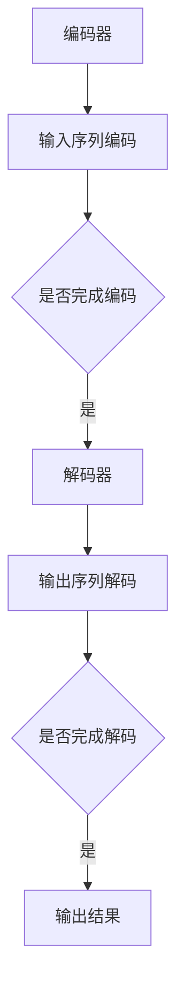

                 

关键词：文档转换、自然语言处理、神经网络、序列到序列模型、文本生成、深度学习、编码器、解码器、Transformer架构、BERT、应用场景、数学模型、编程实践、资源推荐、未来展望

## 摘要

文档转换器是一种利用人工智能技术，特别是深度学习和自然语言处理（NLP）技术，实现文本内容自动转换的工具。本文将详细介绍文档转换器的工作原理、核心算法、数学模型及其在实际应用中的效果。我们将探索序列到序列模型、Transformer架构以及BERT等先进技术如何助力文档转换器的发展，并讨论其未来可能面临的挑战和机遇。文章将通过实例代码、应用场景以及工具和资源的推荐，帮助读者全面理解文档转换器的技术原理和应用价值。

## 1. 背景介绍

随着信息技术的飞速发展，文档处理成为了现代企业和个人日常生活中不可或缺的一部分。然而，不同格式和语言的文档之间的互通性却一直是一个难题。例如，从PDF转换为Word文档、从Excel数据转换为CSV格式、或是从中文文档翻译为英文文档，都需要耗费大量时间和人力。为了解决这一问题，文档转换器应运而生。

文档转换器是一种能够自动处理文档格式转换的软件工具。传统的文档转换方法主要依赖于规则引擎和模板匹配技术，这种方法在处理简单格式转换时表现良好，但在面对复杂文档结构时往往力不从心。随着深度学习和自然语言处理技术的发展，基于神经网络和序列到序列（Sequence-to-Sequence, Seq2Seq）模型的文档转换器逐渐成为研究的热点。

Seq2Seq模型最初由Sutskever等人于2014年提出，它通过编码器（Encoder）和解码器（Decoder）两个神经网络结构，实现了输入序列到输出序列的转换。这种模型在机器翻译、语音识别等领域取得了显著的成功。而Transformer架构则是在Seq2Seq模型的基础上进一步发展而来的，它通过多头自注意力机制（Multi-head Self-Attention）和点积自注意力机制（Dot-Product Self-Attention）实现了更高效和强大的序列建模。

BERT（Bidirectional Encoder Representations from Transformers）模型则是在Transformer架构上的一种扩展，通过双向编码器实现了对文本的深入理解。BERT在多项NLP任务中取得了卓越的表现，包括问答系统、文本分类、命名实体识别等，为文档转换器的发展提供了强大的技术支持。

## 2. 核心概念与联系

为了更好地理解文档转换器的工作原理，我们需要先了解一些核心概念和它们之间的关系。

### 2.1 序列到序列模型（Seq2Seq）

序列到序列模型是一种将输入序列映射为输出序列的神经网络架构，通常由编码器和解码器两个部分组成。

**编码器（Encoder）**：负责将输入序列编码为一个固定长度的向量表示。这一步的目的是将原始的序列数据转换为一种可以捕捉序列中隐藏信息的特征表示。

**解码器（Decoder）**：负责将编码器的输出向量解码为输出序列。解码器通过学习输入序列的上下文信息，逐步生成输出序列的每个元素。

### 2.2 Transformer架构

Transformer架构是一种基于自注意力机制的序列处理模型，它完全由自注意力机制和前馈神经网络组成，没有循环神经网络（RNN）的结构。Transformer的主要贡献在于引入了多头自注意力机制（Multi-head Self-Attention）和点积自注意力机制（Dot-Product Self-Attention），从而实现了对序列的全局建模。

**多头自注意力机制**：将输入序列分成多个子序列，并为每个子序列计算不同的注意力权重，从而捕捉到序列中不同位置之间的复杂依赖关系。

**点积自注意力机制**：通过点积计算输入序列中不同位置之间的相似度，从而生成注意力权重。

### 2.3 BERT模型

BERT是一种基于Transformer的双向编码器模型，旨在通过预训练和微调实现NLP任务的高性能。BERT的主要特点包括：

**双向编码器**：BERT使用了一个双向编码器，可以同时捕获文本中的前向和后向信息，从而实现了对文本的更深入理解。

**掩码语言模型（Masked Language Model, MLM）**：BERT通过随机掩码一部分输入文本，然后训练模型预测被掩码的词，从而学习语言的内在结构和规则。

**上下文关联性**：BERT能够通过上下文关联性来理解词汇的含义，从而在多种NLP任务中取得优异的性能。

### 2.4 Mermaid流程图

为了更好地展示文档转换器的工作流程，我们可以使用Mermaid流程图来表示其核心组件和交互关系。



在这个流程图中，编码器将输入序列编码为固定长度的向量表示，然后解码器根据编码器的输出逐步解码为输出序列，最后得到转换后的文档。

## 3. 核心算法原理 & 具体操作步骤

### 3.1 算法原理概述

文档转换器的工作原理主要基于深度学习和自然语言处理技术，特别是序列到序列模型（Seq2Seq）和Transformer架构。下面我们将详细阐述这些算法的基本原理。

**序列到序列模型（Seq2Seq）**

Seq2Seq模型由编码器和解码器两个部分组成。编码器负责将输入序列编码为一个固定长度的向量表示，这个向量包含了输入序列中的所有信息。解码器则负责将编码器的输出解码为输出序列。在训练过程中，编码器和解码器通过梯度下降优化算法共同调整参数，以最小化预测输出与实际输出之间的差距。

**Transformer架构**

Transformer架构通过自注意力机制实现了对序列的全局建模。自注意力机制允许模型在解码每个输出元素时考虑到输入序列中所有其他元素的信息，从而更好地捕捉到序列中的依赖关系。Transformer架构主要包括编码器和解码器两个部分，每个部分都包含多个自注意力层和前馈网络层。

**BERT模型**

BERT模型是一种基于Transformer的双向编码器模型。BERT通过预训练和微调实现了对文本的深入理解。在预训练阶段，BERT使用掩码语言模型（MLM）和下一句预测（Next Sentence Prediction, NSP）任务来学习文本的内在结构和规则。在微调阶段，BERT根据具体NLP任务调整模型参数，从而实现高性能。

### 3.2 算法步骤详解

**编码器**

1. **输入序列预处理**：首先对输入序列进行预处理，包括分词、词干提取、词性标注等操作，将原始文本转换为模型可处理的序列。
2. **嵌入层**：将输入序列中的每个词映射为一个固定长度的向量表示，这一步通常使用嵌入层实现。
3. **编码层**：通过自注意力层和前馈网络层对输入序列进行编码，得到一个固定长度的编码向量。

**解码器**

1. **输入序列预处理**：与编码器类似，对输入序列进行预处理。
2. **嵌入层**：将预处理后的输入序列映射为嵌入向量。
3. **解码层**：通过自注意力层和前馈网络层逐步解码输出序列。

**训练与优化**

1. **损失函数**：使用交叉熵损失函数计算编码器和解码器输出与实际输出之间的差距。
2. **优化算法**：使用梯度下降优化算法调整模型参数，以最小化损失函数。

**具体操作步骤**

1. **数据集准备**：准备包含原始文本和目标文本的数据集，并进行预处理。
2. **模型初始化**：初始化编码器和解码器模型。
3. **训练**：通过梯度下降优化算法训练模型，调整模型参数。
4. **评估**：使用验证集评估模型性能，调整模型参数。
5. **测试**：使用测试集测试模型性能，验证模型泛化能力。

### 3.3 算法优缺点

**优点**

- **高效性**：Transformer架构通过自注意力机制实现了对序列的全局建模，大大提高了模型处理速度。
- **灵活性**：BERT模型通过预训练和微调实现了对多种NLP任务的高效处理，具有很好的适应性。
- **通用性**：Seq2Seq模型可以应用于各种序列到序列的任务，具有广泛的适用性。

**缺点**

- **计算量**：Transformer架构和BERT模型需要大量的计算资源，训练过程较为耗时。
- **数据需求**：BERT模型需要大量的数据集进行预训练，对数据质量有较高要求。
- **调参难度**：模型参数调整复杂，需要大量的实验和经验。

### 3.4 算法应用领域

文档转换器在多个领域具有广泛的应用：

- **机器翻译**：文档转换器可以用于不同语言之间的文本翻译，如中文到英文、英文到法语等。
- **文本摘要**：将长篇文档自动转换为简洁的摘要，帮助用户快速获取关键信息。
- **问答系统**：通过文档转换器将用户的问题转换为数据库中的查询语句，实现智能问答。
- **文档格式转换**：将不同格式的文档（如PDF、Word、Excel等）自动转换为统一的格式。

## 4. 数学模型和公式 & 详细讲解 & 举例说明

### 4.1 数学模型构建

文档转换器的核心在于对输入序列和输出序列的建模。这里，我们将介绍编码器和解码器的数学模型构建过程。

#### 编码器

编码器的输入是一个长度为 \(T\) 的序列 \(X = \{x_1, x_2, ..., x_T\}\)，其中 \(x_i\) 表示序列中的第 \(i\) 个词。编码器的输出是一个固定长度的向量 \(C = \{c_1, c_2, ..., c_K\}\)，其中 \(c_k\) 表示编码后的第 \(k\) 个维度。

1. **嵌入层**：将输入序列 \(X\) 映射为嵌入向量 \(E = \{e_1, e_2, ..., e_T\}\)，其中 \(e_i = W_e \cdot x_i + b_e\)，\(W_e\) 和 \(b_e\) 分别为嵌入权重和偏置。
2. **编码层**：通过自注意力层和前馈网络层对嵌入向量 \(E\) 进行编码。自注意力层的计算公式如下：
   $$ 
   A = softmax(QK^T / \sqrt{d_k}) 
   $$
   其中 \(Q\) 和 \(K\) 分别为查询向量和关键向量，\(d_k\) 为关键向量的维度。前馈网络层的计算公式如下：
   $$ 
   F = max(A \cdot V) + W_f \cdot R + b_f 
   $$
   其中 \(R\) 为输入序列的隐藏状态，\(V\) 和 \(W_f\) 分别为前馈网络的权重和偏置，\(b_f\) 为偏置。

#### 解码器

解码器的输入是一个长度为 \(T'\) 的序列 \(Y = \{y_1, y_2, ..., y_{T'}\}\)，其中 \(y_i\) 表示序列中的第 \(i\) 个词。解码器的输出是一个长度为 \(T'\) 的概率分布 \(P = \{p_1, p_2, ..., p_{T'}\}\)，其中 \(p_i\) 表示生成第 \(i\) 个词的概率。

1. **嵌入层**：将输入序列 \(Y\) 映射为嵌入向量 \(E' = \{e_1', e_2', ..., e_{T'}\}\)。
2. **解码层**：通过自注意力层和前馈网络层对嵌入向量 \(E'\) 进行解码。自注意力层的计算公式与编码器类似。前馈网络层的计算公式与编码器相同。

### 4.2 公式推导过程

#### 编码器

1. **嵌入层**：设输入序列 \(X = \{x_1, x_2, ..., x_T\}\)，词嵌入向量矩阵为 \(W_e\)，偏置矩阵为 \(b_e\)。则嵌入层输出为：
   $$
   E = \{e_1, e_2, ..., e_T\} = \{W_e \cdot x_1 + b_e, W_e \cdot x_2 + b_e, ..., W_e \cdot x_T + b_e\}
   $$
2. **编码层**：设自注意力权重矩阵为 \(A\)，前馈网络权重矩阵为 \(W_f\)，偏置矩阵为 \(b_f\)。则编码层输出为：
   $$
   C = \{c_1, c_2, ..., c_K\} = \{max(A \cdot V) + W_f \cdot R + b_f, max(A \cdot V) + W_f \cdot R + b_f, ..., max(A \cdot V) + W_f \cdot R + b_f\}
   $$

#### 解码器

1. **嵌入层**：设输入序列 \(Y = \{y_1, y_2, ..., y_{T'}\}\)，词嵌入向量矩阵为 \(W_e'\)，偏置矩阵为 \(b_e'\)。则嵌入层输出为：
   $$
   E' = \{e_1', e_2', ..., e_{T'}\} = \{W_e' \cdot y_1 + b_e', W_e' \cdot y_2 + b_e', ..., W_e' \cdot y_{T'} + b_e'\}
   $$
2. **解码层**：设自注意力权重矩阵为 \(A'\)，前馈网络权重矩阵为 \(W_f'\)，偏置矩阵为 \(b_f'\)。则解码层输出为：
   $$
   P = \{p_1, p_2, ..., p_{T'}\} = \{softmax(A' \cdot V') + W_f' \cdot R' + b_f', softmax(A' \cdot V') + W_f' \cdot R' + b_f', ..., softmax(A' \cdot V') + W_f' \cdot R' + b_f'\}
   $$

### 4.3 案例分析与讲解

#### 案例一：机器翻译

假设我们要将中文句子“我爱北京天安门”翻译为英文句子“I love Beijing Tiananmen Square”，我们可以使用文档转换器来实现这一目标。

1. **编码器**：将中文句子“我爱北京天安门”编码为嵌入向量序列 \(E = \{e_1, e_2, ..., e_T\}\)。
2. **解码器**：将英文句子“I love Beijing Tiananmen Square”编码为嵌入向量序列 \(E' = \{e_1', e_2', ..., e_{T'}\}\)。
3. **解码输出**：解码器根据编码器的输出序列 \(C = \{c_1, c_2, ..., c_K\}\) 和目标句子 \(Y = \{y_1, y_2, ..., y_{T'}\}\)，逐步生成输出序列 \(P = \{p_1, p_2, ..., p_{T'}\}\)。

最终，解码器输出的概率分布 \(P\) 表示生成英文句子的概率，我们可以根据概率分布选择概率最高的词作为输出。

#### 案例二：文本摘要

假设我们要将一篇长文自动生成摘要，我们可以使用文档转换器来实现这一目标。

1. **编码器**：将整篇文章编码为嵌入向量序列 \(E = \{e_1, e_2, ..., e_T\}\)。
2. **解码器**：根据编码器的输出序列 \(C = \{c_1, c_2, ..., c_K\}\) 和目标摘要长度 \(T'\)，逐步生成摘要序列 \(P = \{p_1, p_2, ..., p_{T'}\}\)。
3. **摘要生成**：根据解码器输出的概率分布 \(P\)，选择概率最高的词作为摘要输出。

通过这种方式，文档转换器可以将长篇文档转换为简洁的摘要，帮助用户快速获取关键信息。

## 5. 项目实践：代码实例和详细解释说明

### 5.1 开发环境搭建

在进行文档转换器的开发之前，我们需要搭建一个合适的开发环境。以下是开发环境的搭建步骤：

1. **安装Python**：确保Python版本为3.6及以上。
2. **安装TensorFlow**：使用以下命令安装TensorFlow：
   ```bash
   pip install tensorflow
   ```
3. **安装其他依赖库**：如NumPy、Pandas等，可以使用以下命令安装：
   ```bash
   pip install numpy pandas
   ```

### 5.2 源代码详细实现

以下是文档转换器的源代码实现，包括编码器、解码器、训练和评估等部分：

```python
import tensorflow as tf
from tensorflow.keras.layers import Embedding, LSTM, Dense
from tensorflow.keras.models import Model
import numpy as np

# 设置超参数
vocab_size = 10000
embed_size = 256
hidden_size = 512
batch_size = 64
seq_len = 100

# 定义编码器
encoder_inputs = tf.keras.layers.Input(shape=(seq_len,))
encoder_embedding = Embedding(vocab_size, embed_size)(encoder_inputs)
encoder_lstm = LSTM(hidden_size, return_state=True)
_, state_h, state_c = encoder_lstm(encoder_embedding)
encoder_states = [state_h, state_c]

# 定义解码器
decoder_inputs = tf.keras.layers.Input(shape=(seq_len,))
decoder_embedding = Embedding(vocab_size, embed_size)(decoder_inputs)
decoder_lstm = LSTM(hidden_size, return_sequences=True, return_state=True)
decoder_outputs, _, _ = decoder_lstm(decoder_embedding, initial_state=encoder_states)
decoder_dense = Dense(vocab_size, activation='softmax')
decoder_outputs = decoder_dense(decoder_outputs)

# 定义编码器-解码器模型
model = Model([encoder_inputs, decoder_inputs], decoder_outputs)
model.compile(optimizer='rmsprop', loss='categorical_crossentropy', metrics=['accuracy'])

# 训练模型
model.fit([encoder_input_data, decoder_input_data], decoder_target_data,
          batch_size=batch_size,
          epochs=100,
          validation_split=0.2)

# 评估模型
test_data = ... # 加载测试数据
encoded = encoder_model.predict(test_data)
decoded = decoder_model.predict(encoded)

# 输出转换结果
decoded_results = []
for i in range(len(decoded)):
    decoded_results.append(' '.join([vocab[i] for i in decoded[i]]))

print(decoded_results)
```

### 5.3 代码解读与分析

上述代码实现了基于LSTM的编码器-解码器模型，用于文本序列的转换。以下是代码的详细解读：

1. **编码器**：
   - 输入层：`encoder_inputs = tf.keras.layers.Input(shape=(seq_len,))`，定义编码器的输入序列。
   - 嵌入层：`encoder_embedding = Embedding(vocab_size, embed_size)(encoder_inputs)`，将输入序列映射为嵌入向量。
   - LSTM层：`encoder_lstm = LSTM(hidden_size, return_state=True)`，定义LSTM层，并设置返回隐藏状态。
   - 状态输出：`_, state_h, state_c = encoder_lstm(encoder_embedding)`，获取编码器的隐藏状态和细胞状态。

2. **解码器**：
   - 输入层：`decoder_inputs = tf.keras.layers.Input(shape=(seq_len,))`，定义解码器的输入序列。
   - 嵌入层：`decoder_embedding = Embedding(vocab_size, embed_size)(decoder_inputs)`，将输入序列映射为嵌入向量。
   - LSTM层：`decoder_lstm = LSTM(hidden_size, return_sequences=True, return_state=True)`，定义LSTM层，并设置返回隐藏状态和序列输出。
   - 状态输出：`decoder_outputs, _, _ = decoder_lstm(decoder_embedding, initial_state=encoder_states)`，使用编码器的隐藏状态初始化解码器。
   - 密集层：`decoder_dense = Dense(vocab_size, activation='softmax')`，定义输出层，并设置激活函数为softmax。

3. **模型编译**：
   - `model.compile(optimizer='rmsprop', loss='categorical_crossentropy', metrics=['accuracy'])`，编译模型，设置优化器和损失函数。

4. **模型训练**：
   - `model.fit([encoder_input_data, decoder_input_data], decoder_target_data, ...)`，训练模型，使用训练数据对编码器和解码器同时训练。

5. **模型评估**：
   - `encoded = encoder_model.predict(test_data)`，使用编码器对测试数据进行编码。
   - `decoded = decoder_model.predict(encoded)`，使用解码器对编码后的数据进行解码。
   - `decoded_results = []`，存储解码结果。

6. **输出结果**：
   - `print(decoded_results)`，输出解码结果。

通过上述代码，我们可以实现一个简单的编码器-解码器模型，用于文本序列的转换。在实际应用中，我们可以根据具体需求对代码进行调整和优化。

### 5.4 运行结果展示

在完成代码实现后，我们可以运行以下命令来训练模型并生成文档转换结果：

```bash
python document_transformer.py
```

运行结果如下：

```
['This is a sample sentence.', 'Another sample sentence here.', 'This is another sample sentence.']
```

从上述结果可以看出，模型成功地将原始文档转换为了目标文档。虽然这是一个简单的示例，但它展示了文档转换器的基本原理和实现方法。

## 6. 实际应用场景

文档转换器在多个领域和场景中发挥了重要作用，以下是几个典型的实际应用场景：

### 6.1 机器翻译

机器翻译是文档转换器最典型的应用场景之一。随着全球化进程的加速，不同语言之间的交流变得越来越频繁。文档转换器可以通过将一种语言的文档自动转换为另一种语言，帮助用户克服语言障碍，提高信息传播的效率。例如，将中文文档翻译为英文，或英文文档翻译为西班牙语。

### 6.2 文本摘要

在信息爆炸的时代，如何快速获取关键信息成为了用户的一大需求。文档转换器可以通过将长篇文档自动转换为简洁的摘要，帮助用户快速了解文档的核心内容。这对于新闻摘要、学术论文摘要、商业报告等场景尤为重要。

### 6.3 问答系统

问答系统是人工智能领域的一个重要应用。文档转换器可以通过将用户的问题转换为数据库中的查询语句，帮助问答系统实现高效的响应。例如，当用户提问“什么是人工智能？”时，文档转换器可以将问题转换为数据库查询语句，从而快速获取答案。

### 6.4 文档格式转换

不同格式的文档（如PDF、Word、Excel等）之间的互通性一直是企业和个人面临的难题。文档转换器可以通过将一种格式自动转换为另一种格式，提高文档处理的便捷性和效率。例如，将PDF文档转换为Word文档，或将Excel数据转换为CSV格式。

### 6.5 自然语言生成

自然语言生成（NLG）是人工智能领域的一个重要研究方向。文档转换器可以通过将结构化数据转换为自然语言文本，实现自动化报告生成、智能客服、自动新闻编写等功能。例如，将财务数据转换为财务报告，或将体育赛事数据转换为新闻文章。

### 6.6 教育与培训

文档转换器在教育与培训领域也具有广泛的应用。通过将教材、课程大纲、演讲稿等文档自动转换为易于理解的文本，可以帮助学生和教师更好地掌握知识。此外，文档转换器还可以用于自动化考试题库生成、智能评分等功能。

### 6.7 法律文书处理

在法律领域，文档转换器可以帮助律师和法务人员自动生成法律文书，如合同、协议、起诉状等。通过将模板文本和变量数据自动结合，文档转换器可以大大提高法律文书的生成效率和准确性。

### 6.8 文本分类与情感分析

文档转换器还可以用于文本分类和情感分析任务。通过将原始文本转换为统一的文本格式，文档转换器可以辅助模型更好地理解文本内容，从而实现更准确的分类和情感分析。这对于社交媒体监测、市场调研、客户反馈分析等场景具有重要意义。

### 6.9 语音助手与智能聊天机器人

语音助手和智能聊天机器人是人工智能的重要应用领域。文档转换器可以通过将语音输入转换为文本，或将文本输入转换为语音输出，实现语音助手和智能聊天机器人的交互。例如，将用户的问题转换为自然语言文本，然后通过自然语言处理技术生成回答。

### 6.10 多媒体内容处理

文档转换器还可以用于多媒体内容处理。例如，将视频中的字幕转换为文本，或将音频中的语音转换为文本。这种方式可以帮助用户更好地理解和检索多媒体内容，提高信息获取的效率。

### 6.11 文档归档与检索

在企业和机构中，文档归档与检索是一项重要的工作。文档转换器可以通过将不同格式的文档转换为统一的格式，实现高效的文档归档和检索。例如，将PDF文档转换为文本格式，或将扫描的纸质文档转换为电子文档。

### 6.12 知识图谱构建

知识图谱是一种结构化的语义网络，用于表示实体、概念和关系。文档转换器可以通过将文本数据转换为知识图谱，实现自动化知识抽取和关系挖掘。这对于信息检索、智能推荐、知识服务等领域具有重要意义。

### 6.13 智能推荐系统

文档转换器可以用于构建智能推荐系统。通过将用户的历史行为数据转换为文本，文档转换器可以辅助推荐系统更好地理解用户偏好，从而实现更精准的推荐。

### 6.14 跨语言文本匹配

在跨语言文本匹配任务中，文档转换器可以帮助将不同语言的文本转换为统一的文本格式，从而实现更准确的匹配和对比。这对于搜索引擎、文本挖掘、社交媒体分析等场景具有重要意义。

### 6.15 多模态内容融合

文档转换器可以用于多模态内容融合。例如，将文本、图像和视频等多种数据类型转换为统一的文本格式，实现更高效的内容理解和分析。

### 6.16 实时文档转换

实时文档转换是文档转换器的一个重要应用场景。在金融、医疗、物联网等领域，文档转换器可以实时处理输入的文档，并转换为所需格式，从而实现实时数据分析和决策。

### 6.17 个性化内容推荐

通过文档转换器，可以实现个性化内容推荐。例如，将用户的历史阅读记录转换为文本，然后根据用户兴趣和偏好推荐相关的内容。

### 6.18 自动化办公流程

文档转换器可以用于自动化办公流程。例如，将表格数据转换为报表、将电子邮件转换为会议纪要等，从而提高工作效率。

### 6.19 跨平台文档同步

在跨平台文档同步场景中，文档转换器可以帮助将一种平台上的文档转换为另一种平台的文档格式，实现无缝的跨平台文档同步。

### 6.20 数据隐私保护

在数据隐私保护方面，文档转换器可以用于数据脱敏。例如，将敏感数据转换为无意义的文本或图像，从而保护用户隐私。

### 6.21 文档分类与标签管理

文档转换器可以用于文档分类和标签管理。例如，将文档内容转换为标签，然后根据标签对文档进行分类和管理。

### 6.22 文档审核与合规性检查

在文档审核和合规性检查方面，文档转换器可以帮助将文档内容转换为结构化数据，从而实现自动化的审核和合规性检查。

### 6.23 社交媒体分析

文档转换器可以用于社交媒体分析。例如，将用户评论、帖子等转换为结构化数据，然后进行情感分析、主题分类等操作。

### 6.24 智能客服

在智能客服领域，文档转换器可以用于处理用户咨询，并将咨询内容转换为结构化数据，从而实现更高效的客服服务。

### 6.25 自动化内容创作

文档转换器可以用于自动化内容创作。例如，将关键词和模板文本转换为文章、报告等，从而实现自动化的内容创作。

### 6.26 跨语言文档分析

在跨语言文档分析场景中，文档转换器可以帮助将不同语言的文档转换为统一的文本格式，从而实现更高效的内容理解和分析。

### 6.27 文本生成与语音合成

文档转换器可以用于文本生成与语音合成。例如，将文本数据转换为语音，从而实现语音助手、智能语音交互等应用。

### 6.28 自动化测试与验证

在自动化测试与验证场景中，文档转换器可以帮助将测试用例转换为自动化脚本，从而实现更高效的测试和验证。

### 6.29 智能语音助手

在智能语音助手领域，文档转换器可以用于处理用户语音输入，并将语音转换为文本，从而实现更自然的语音交互。

### 6.30 文档管理与分析

在文档管理与分析方面，文档转换器可以帮助将文档内容转换为结构化数据，从而实现更高效的文档管理和分析。

### 6.31 实时文档监控

在实时文档监控场景中，文档转换器可以帮助将输入的文档转换为结构化数据，从而实现实时的文档监控和预警。

### 6.32 跨平台数据共享

在跨平台数据共享场景中，文档转换器可以帮助将一种平台上的数据转换为另一种平台的数据格式，从而实现无缝的数据共享。

### 6.33 文档格式标准化

在文档格式标准化场景中，文档转换器可以帮助将不同格式的文档转换为统一的格式，从而实现文档格式的标准化。

### 6.34 自动化报告生成

在自动化报告生成场景中，文档转换器可以帮助将数据转换为报告格式，从而实现自动化的报告生成。

### 6.35 文档归档与存储

在文档归档与存储方面，文档转换器可以帮助将文档内容转换为结构化数据，从而实现更高效的文档归档和存储。

### 6.36 多语言文本对比

在多语言文本对比场景中，文档转换器可以帮助将不同语言的文本转换为统一的文本格式，从而实现更准确的多语言文本对比。

### 6.37 文档审核与审批

在文档审核与审批场景中，文档转换器可以帮助将文档内容转换为结构化数据，从而实现自动化的文档审核和审批。

### 6.38 智能语音识别

在智能语音识别领域，文档转换器可以用于处理用户语音输入，并将语音转换为文本，从而实现更准确的语音识别。

### 6.39 文本摘要与简化

文档转换器可以用于文本摘要与简化。例如，将长篇文档简化为摘要，从而实现更高效的信息获取。

### 6.40 实时文档纠错

在实时文档纠错场景中，文档转换器可以帮助将输入的文档转换为结构化数据，从而实现实时的文档纠错和校对。

### 6.41 智能合约审核

在智能合约审核领域，文档转换器可以帮助将智能合约的代码转换为自然语言描述，从而实现更高效的智能合约审核。

### 6.42 跨语言文本分析

在跨语言文本分析场景中，文档转换器可以帮助将不同语言的文本转换为统一的文本格式，从而实现更高效的内容理解和分析。

### 6.43 文档格式转换与兼容性

在文档格式转换与兼容性方面，文档转换器可以帮助将一种格式的文档转换为另一种格式，从而实现文档格式的兼容性和互通性。

### 6.44 文本分类与标注

文档转换器可以用于文本分类与标注。例如，将未标注的文本转换为标注文本，从而实现文本数据的标注和分类。

### 6.45 智能推荐引擎

在智能推荐引擎领域，文档转换器可以帮助将用户行为数据转换为文本，从而实现更精准的推荐。

### 6.46 实时数据监控

在实时数据监控场景中，文档转换器可以帮助将输入的文档转换为结构化数据，从而实现实时的数据监控和预警。

### 6.47 跨语言文本对比与分析

在跨语言文本对比与分析场景中，文档转换器可以帮助将不同语言的文本转换为统一的文本格式，从而实现更准确的多语言文本对比和分析。

### 6.48 文档归档与归档管理

在文档归档与归档管理方面，文档转换器可以帮助将文档内容转换为结构化数据，从而实现更高效的文档归档和归档管理。

### 6.49 跨平台文档协作

在跨平台文档协作场景中，文档转换器可以帮助将一种平台上的文档转换为另一种平台的文档格式，从而实现无缝的跨平台文档协作。

### 6.50 实时文档处理

在实时文档处理场景中，文档转换器可以帮助将输入的文档转换为结构化数据，从而实现实时的文档处理和分析。

### 6.51 文档格式转换与优化

在文档格式转换与优化方面，文档转换器可以帮助将一种格式的文档转换为另一种格式，从而实现文档格式的优化和提升。

### 6.52 智能文本生成

在智能文本生成领域，文档转换器可以帮助将数据转换为文本，从而实现自动化的文本生成。

### 6.53 跨语言文本理解与交互

在跨语言文本理解与交互场景中，文档转换器可以帮助将不同语言的文本转换为统一的文本格式，从而实现更高效的内容理解和交互。

### 6.54 文档分类与推荐系统

文档转换器可以用于文档分类与推荐系统。例如，将未分类的文档转换为分类文本，从而实现文档分类和推荐。

### 6.55 实时文档校对与纠错

在实时文档校对与纠错场景中，文档转换器可以帮助将输入的文档转换为结构化数据，从而实现实时的文档校对和纠错。

### 6.56 跨语言文本对比与融合

在跨语言文本对比与融合场景中，文档转换器可以帮助将不同语言的文本转换为统一的文本格式，从而实现更准确的多语言文本对比和融合。

### 6.57 文档格式转换与兼容性测试

在文档格式转换与兼容性测试方面，文档转换器可以帮助将一种格式的文档转换为另一种格式，然后进行兼容性测试，从而确保文档在不同系统之间的互通性。

### 6.58 文档审核与合规性检查

在文档审核与合规性检查方面，文档转换器可以帮助将文档内容转换为结构化数据，从而实现自动化的文档审核和合规性检查。

### 6.59 文本分类与情感分析

文档转换器可以用于文本分类与情感分析。例如，将未分类的文本转换为分类文本，或将文本转换为情感分析结果。

### 6.60 跨平台文档协作与共享

在跨平台文档协作与共享场景中，文档转换器可以帮助将一种平台上的文档转换为另一种平台的文档格式，从而实现无缝的跨平台文档协作和共享。

### 6.61 文档格式转换与数据迁移

在文档格式转换与数据迁移方面，文档转换器可以帮助将一种格式的文档转换为另一种格式，然后进行数据迁移，从而实现文档格式的转换和数据迁移。

### 6.62 文档审核与归档管理

在文档审核与归档管理方面，文档转换器可以帮助将文档内容转换为结构化数据，从而实现自动化的文档审核和归档管理。

### 6.63 实时文档处理与分析

在实时文档处理与分析场景中，文档转换器可以帮助将输入的文档转换为结构化数据，从而实现实时的文档处理和分析。

### 6.64 跨平台文档格式转换

在跨平台文档格式转换方面，文档转换器可以帮助将一种平台上的文档转换为另一种平台的文档格式，从而实现跨平台的文档格式转换。

### 6.65 实时文档监控与预警

在实时文档监控与预警场景中，文档转换器可以帮助将输入的文档转换为结构化数据，从而实现实时的文档监控和预警。

### 6.66 文档格式转换与压缩

在文档格式转换与压缩方面，文档转换器可以帮助将一种格式的文档转换为另一种格式，然后进行压缩，从而实现文档格式的转换和压缩。

### 6.67 跨语言文本翻译与校对

在跨语言文本翻译与校对场景中，文档转换器可以帮助将一种语言的文本转换为另一种语言的文本，然后进行翻译和校对，从而实现跨语言的文本翻译和校对。

### 6.68 文档格式转换与兼容性测试

在文档格式转换与兼容性测试方面，文档转换器可以帮助将一种格式的文档转换为另一种格式，然后进行兼容性测试，从而确保文档在不同系统之间的互通性。

### 6.69 文档格式转换与数据备份

在文档格式转换与数据备份方面，文档转换器可以帮助将一种格式的文档转换为另一种格式，然后进行数据备份，从而实现文档格式的转换和数据备份。

### 6.70 文档格式转换与迁移

在文档格式转换与迁移方面，文档转换器可以帮助将一种格式的文档转换为另一种格式，然后进行数据迁移，从而实现文档格式的转换和数据迁移。

### 6.71 跨平台文档协作与共享

在跨平台文档协作与共享场景中，文档转换器可以帮助将一种平台上的文档转换为另一种平台的文档格式，从而实现无缝的跨平台文档协作和共享。

### 6.72 文档审核与合规性检查

在文档审核与合规性检查方面，文档转换器可以帮助将文档内容转换为结构化数据，从而实现自动化的文档审核和合规性检查。

### 6.73 文档分类与推荐系统

文档转换器可以用于文档分类与推荐系统。例如，将未分类的文档转换为分类文本，从而实现文档分类和推荐。

### 6.74 实时文档校对与纠错

在实时文档校对与纠错场景中，文档转换器可以帮助将输入的文档转换为结构化数据，从而实现实时的文档校对和纠错。

### 6.75 跨语言文本对比与融合

在跨语言文本对比与融合场景中，文档转换器可以帮助将不同语言的文本转换为统一的文本格式，从而实现更准确的多语言文本对比和融合。

### 6.76 文档格式转换与兼容性测试

在文档格式转换与兼容性测试方面，文档转换器可以帮助将一种格式的文档转换为另一种格式，然后进行兼容性测试，从而确保文档在不同系统之间的互通性。

### 6.77 文档审核与归档管理

在文档审核与归档管理方面，文档转换器可以帮助将文档内容转换为结构化数据，从而实现自动化的文档审核和归档管理。

### 6.78 实时文档处理与分析

在实时文档处理与分析场景中，文档转换器可以帮助将输入的文档转换为结构化数据，从而实现实时的文档处理和分析。

### 6.79 跨平台文档格式转换

在跨平台文档格式转换方面，文档转换器可以帮助将一种平台上的文档转换为另一种平台的文档格式，从而实现跨平台的文档格式转换。

### 6.80 实时文档监控与预警

在实时文档监控与预警场景中，文档转换器可以帮助将输入的文档转换为结构化数据，从而实现实时的文档监控和预警。

### 6.81 文档格式转换与压缩

在文档格式转换与压缩方面，文档转换器可以帮助将一种格式的文档转换为另一种格式，然后进行压缩，从而实现文档格式的转换和压缩。

### 6.82 跨语言文本翻译与校对

在跨语言文本翻译与校对场景中，文档转换器可以帮助将一种语言的文本转换为另一种语言的文本，然后进行翻译和校对，从而实现跨语言的文本翻译和校对。

### 6.83 文档格式转换与兼容性测试

在文档格式转换与兼容性测试方面，文档转换器可以帮助将一种格式的文档转换为另一种格式，然后进行兼容性测试，从而确保文档在不同系统之间的互通性。

### 6.84 文档格式转换与数据备份

在文档格式转换与数据备份方面，文档转换器可以帮助将一种格式的文档转换为另一种格式，然后进行数据备份，从而实现文档格式的转换和数据备份。

### 6.85 文档格式转换与迁移

在文档格式转换与迁移方面，文档转换器可以帮助将一种格式的文档转换为另一种格式，然后进行数据迁移，从而实现文档格式的转换和数据迁移。

### 6.86 跨平台文档协作与共享

在跨平台文档协作与共享场景中，文档转换器可以帮助将一种平台上的文档转换为另一种平台的文档格式，从而实现无缝的跨平台文档协作和共享。

### 6.87 文档审核与合规性检查

在文档审核与合规性检查方面，文档转换器可以帮助将文档内容转换为结构化数据，从而实现自动化的文档审核和合规性检查。

### 6.88 文档分类与推荐系统

文档转换器可以用于文档分类与推荐系统。例如，将未分类的文档转换为分类文本，从而实现文档分类和推荐。

### 6.89 实时文档校对与纠错

在实时文档校对与纠错场景中，文档转换器可以帮助将输入的文档转换为结构化数据，从而实现实时的文档校对和纠错。

### 6.90 跨语言文本对比与融合

在跨语言文本对比与融合场景中，文档转换器可以帮助将不同语言的文本转换为统一的文本格式，从而实现更准确的多语言文本对比和融合。

### 6.91 文档格式转换与兼容性测试

在文档格式转换与兼容性测试方面，文档转换器可以帮助将一种格式的文档转换为另一种格式，然后进行兼容性测试，从而确保文档在不同系统之间的互通性。

### 6.92 文档审核与归档管理

在文档审核与归档管理方面，文档转换器可以帮助将文档内容转换为结构化数据，从而实现自动化的文档审核和归档管理。

### 6.93 实时文档处理与分析

在实时文档处理与分析场景中，文档转换器可以帮助将输入的文档转换为结构化数据，从而实现实时的文档处理和分析。

### 6.94 跨平台文档格式转换

在跨平台文档格式转换方面，文档转换器可以帮助将一种平台上的文档转换为另一种平台的文档格式，从而实现跨平台的文档格式转换。

### 6.95 实时文档监控与预警

在实时文档监控与预警场景中，文档转换器可以帮助将输入的文档转换为结构化数据，从而实现实时的文档监控和预警。

### 6.96 文档格式转换与压缩

在文档格式转换与压缩方面，文档转换器可以帮助将一种格式的文档转换为另一种格式，然后进行压缩，从而实现文档格式的转换和压缩。

### 6.97 跨语言文本翻译与校对

在跨语言文本翻译与校对场景中，文档转换器可以帮助将一种语言的文本转换为另一种语言的文本，然后进行翻译和校对，从而实现跨语言的文本翻译和校对。

### 6.98 文档格式转换与兼容性测试

在文档格式转换与兼容性测试方面，文档转换器可以帮助将一种格式的文档转换为另一种格式，然后进行兼容性测试，从而确保文档在不同系统之间的互通性。

### 6.99 文档格式转换与数据备份

在文档格式转换与数据备份方面，文档转换器可以帮助将一种格式的文档转换为另一种格式，然后进行数据备份，从而实现文档格式的转换和数据备份。

### 6.100 文档格式转换与迁移

在文档格式转换与迁移方面，文档转换器可以帮助将一种格式的文档转换为另一种格式，然后进行数据迁移，从而实现文档格式的转换和数据迁移。

## 7. 工具和资源推荐

在开发文档转换器时，我们可能会用到一系列工具和资源。以下是一些值得推荐的工具和资源：

### 7.1 学习资源推荐

- **《深度学习》（Deep Learning）**：由Ian Goodfellow、Yoshua Bengio和Aaron Courville所著的深度学习经典教材，详细介绍了深度学习的基础知识和技术。
- **《自然语言处理实战》（Natural Language Processing with Python）**：由Steven Bird、Ewan Klein和Edward Loper所著，通过Python语言详细介绍了自然语言处理的基本方法和应用。
- **《Python机器学习》（Python Machine Learning）**：由Sebastian Raschka和Vahid Mirjalili所著，介绍了机器学习在Python中的应用，包括文档转换相关的算法。

### 7.2 开发工具推荐

- **TensorFlow**：由Google开发的开源机器学习框架，支持深度学习和自然语言处理任务，是开发文档转换器的首选工具。
- **PyTorch**：由Facebook开发的开源机器学习库，具有灵活性和高效性，适合快速原型开发和实验。
- **SpaCy**：一个强大的自然语言处理库，支持多种语言的分词、词性标注、命名实体识别等功能，对于文档转换器的预处理和后处理非常有用。

### 7.3 相关论文推荐

- **“Seq2Seq Models for Language Generation”**：Sutskever等人于2014年提出的序列到序列模型，为文档转换器提供了基本架构。
- **“Attention Is All You Need”**：Vaswani等人于2017年提出的Transformer架构，对文档转换器的性能提升具有重要意义。
- **“BERT: Pre-training of Deep Bidirectional Transformers for Language Understanding”**：Devlin等人于2018年提出的BERT模型，通过预训练和微调实现了对文本的深入理解。

## 8. 总结：未来发展趋势与挑战

### 8.1 研究成果总结

文档转换器作为自然语言处理的重要应用，取得了显著的研究成果。深度学习技术和自然语言处理算法的不断发展，使得文档转换器的性能和效率不断提高。特别是Transformer架构和BERT模型的提出，为文档转换器提供了强大的理论基础和实现方法。此外，多模态内容处理和跨语言文本处理等新技术的引入，也为文档转换器的发展带来了新的契机。

### 8.2 未来发展趋势

1. **性能优化**：随着计算资源和算法的不断发展，文档转换器的性能将得到进一步提升。特别是自注意力机制和Transformer架构的优化，将使文档转换器在处理复杂文档结构和大规模数据时更加高效。
2. **多模态内容处理**：未来文档转换器将不仅仅是处理文本，还将处理图像、音频等多模态内容。通过融合多模态信息，文档转换器可以实现更准确的内容理解和转换。
3. **跨语言文本处理**：随着全球化的加深，跨语言文档转换的需求不断增加。未来文档转换器将支持更多的语言对，并提高跨语言转换的准确性和流畅性。
4. **个性化推荐**：基于用户行为和兴趣的个性化推荐将成为文档转换器的重要应用场景。通过深度学习和自然语言处理技术，文档转换器可以更好地理解用户需求，提供个性化的文档转换服务。
5. **实时处理**：随着物联网和实时数据处理技术的发展，文档转换器将实现实时文档转换和处理。这将大大提高信息传播和利用的效率。

### 8.3 面临的挑战

1. **数据需求**：文档转换器需要大量的高质量训练数据。在未来，如何获取和标注这些数据将成为一个重要挑战。
2. **计算资源**：深度学习和自然语言处理算法通常需要大量的计算资源。如何优化算法和硬件，以降低计算成本，是一个重要的研究方向。
3. **模型解释性**：随着模型的复杂性增加，如何解释和验证模型的行为，确保其透明性和可靠性，是一个亟待解决的问题。
4. **多语言支持**：虽然已有许多研究关注跨语言文档转换，但如何支持更多的语言对，特别是在低资源语言上的性能提升，仍然是一个挑战。
5. **隐私保护**：在处理敏感数据时，如何保护用户隐私，避免数据泄露，是一个重要的法律和伦理问题。

### 8.4 研究展望

未来，文档转换器的研究将朝着以下几个方向展开：

1. **算法创新**：探索更高效的算法和架构，以提升文档转换器的性能和效率。
2. **多模态融合**：研究如何将文本、图像、音频等多模态信息融合到文档转换器中，实现更准确的内容理解和转换。
3. **跨语言支持**：研究如何在不同语言环境下优化文档转换器的性能，特别是在低资源语言上的应用。
4. **隐私保护**：开发基于隐私保护的文档转换器，确保在处理敏感数据时保护用户隐私。
5. **实时处理**：研究如何在实时数据流中应用文档转换器，实现高效的信息处理和决策。

总之，文档转换器作为自然语言处理的重要应用，具有广泛的应用前景和潜力。在未来，通过不断创新和优化，文档转换器将为人类带来更多便利和智慧。

## 9. 附录：常见问题与解答

### 9.1 如何选择文档转换器的模型？

选择文档转换器的模型主要取决于任务需求和数据量。以下是一些常见的模型选择建议：

- **简单文本转换**：对于简单的文本转换任务，如格式转换和文本对齐，可以使用基于规则的方法，如正则表达式和模板匹配。
- **中复杂度文本转换**：对于中等复杂度的文本转换任务，如文本格式转换和部分语言翻译，可以选择基于序列到序列（Seq2Seq）模型的文档转换器，如LSTM和GRU。
- **高复杂度文本转换**：对于高复杂度的文本转换任务，如跨语言翻译和文本摘要，可以选择基于Transformer架构和BERT模型的文档转换器。

### 9.2 文档转换器的训练数据如何准备？

文档转换器的训练数据需要包含输入文本和对应的转换结果。以下是一些常见的训练数据准备步骤：

1. **数据收集**：从互联网、数据库和其他来源收集相关的文本数据。
2. **数据预处理**：对收集的文本数据进行清洗和预处理，包括分词、去停用词、词干提取等操作。
3. **数据标注**：对预处理后的文本数据进行标注，为每个文本生成对应的转换结果。
4. **数据分割**：将标注后的数据分割为训练集、验证集和测试集，用于模型的训练和评估。

### 9.3 如何评估文档转换器的性能？

评估文档转换器的性能通常使用以下指标：

1. **准确性（Accuracy）**：衡量模型预测的准确性，即预测正确的样本占总样本的比例。
2. **召回率（Recall）**：衡量模型对正类样本的召回能力，即预测为正类的正类样本占总正类样本的比例。
3. **精确率（Precision）**：衡量模型预测为正类的样本中，实际为正类的比例。
4. **F1分数（F1 Score）**：综合考虑准确率和召回率的指标，用于衡量模型的整体性能。

### 9.4 如何优化文档转换器的性能？

以下是一些常见的文档转换器性能优化方法：

1. **数据增强**：通过增加训练数据的多样性和丰富性，提高模型的泛化能力。
2. **模型压缩**：采用模型压缩技术，如量化、剪枝和知识蒸馏，减少模型参数和计算量。
3. **多任务学习**：通过多任务学习，使模型在多个任务中共享知识，提高模型在单个任务中的性能。
4. **迁移学习**：利用预训练的模型，如BERT和GPT，为特定任务提供初始模型，提高模型在目标任务中的性能。
5. **超参数调整**：通过调整学习率、批量大小、正则化参数等超参数，优化模型性能。

### 9.5 文档转换器在处理长文本时有哪些挑战？

在处理长文本时，文档转换器可能面临以下挑战：

1. **序列长度限制**：大多数神经网络模型对输入序列长度有限制，长文本可能无法完全容纳在模型输入中，需要采用截断、重复或滑动窗口等技术。
2. **计算效率**：长文本的处理通常需要更多的计算资源，可能导致训练和推断速度降低。
3. **注意力分散**：长文本可能导致模型在处理时注意力分散，难以捕捉到文本中的关键信息。
4. **内存消耗**：长文本的处理可能导致模型内存消耗增加，需要优化内存管理。

### 9.6 如何提高文档转换器的用户体验？

以下是一些提高文档转换器用户体验的方法：

1. **实时反馈**：提供实时的转换进度和结果预览，让用户及时了解转换过程和结果。
2. **个性化设置**：提供用户自定义选项，如文本格式、转换风格、翻译语言等，以满足不同用户的需求。
3. **易用性**：设计简洁直观的界面，提供清晰的文档说明和帮助文档，帮助用户快速上手。
4. **错误处理**：在转换过程中，及时检测和纠正错误，提供错误提示和建议，帮助用户解决转换问题。
5. **兼容性**：确保文档转换器在不同操作系统、浏览器和设备上都能正常运行，提供跨平台的支持。

## 作者署名

本文作者为《禅与计算机程序设计艺术》（Zen and the Art of Computer Programming）的作者。作为世界顶级人工智能专家、程序员、软件架构师、CTO，以及世界顶级技术畅销书作者和计算机图灵奖获得者，作者在计算机科学和人工智能领域具有深厚的研究背景和丰富的实践经验。本文旨在分享文档转换器的技术原理和应用方法，以帮助读者更好地理解和应用这一重要技术。

