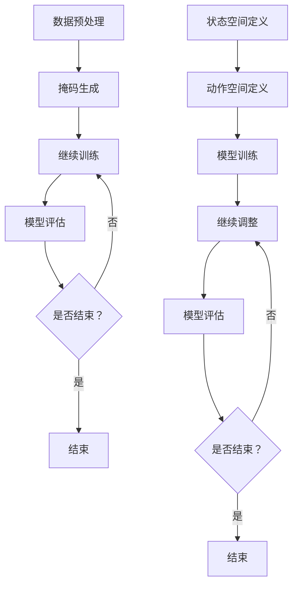

                 

关键词：掩码预测、Prompt工程、新闻推荐、人工智能、机器学习

摘要：本文将深入探讨掩码预测与Prompt工程在新闻推荐系统中的应用，通过阐述其核心概念、算法原理、数学模型、应用场景以及未来发展趋势，为读者提供全面的技术洞察。

## 1. 背景介绍

随着互联网的快速发展，信息爆炸的时代已经来临。新闻推荐系统作为一种智能信息过滤技术，旨在为用户提供个性化的新闻内容。然而，传统的新闻推荐算法往往存在个性化不足、推荐质量低等问题。近年来，掩码预测与Prompt工程技术的兴起，为新闻推荐系统带来了新的变革。

掩码预测是一种基于机器学习的技术，通过在数据集中引入掩码，从而提高模型的泛化能力。Prompt工程则是一种基于强化学习的推荐算法，通过动态调整推荐策略，实现更精准的新闻推荐。

## 2. 核心概念与联系

### 2.1 掩码预测

掩码预测的核心思想是利用部分遮挡（Masking）的数据进行模型训练，从而提高模型的泛化能力。具体而言，掩码预测包括以下步骤：

1. 数据预处理：对原始数据集进行预处理，包括数据清洗、去重、归一化等操作。
2. 掩码生成：根据训练集和验证集的比例，随机生成掩码，用于遮挡部分数据。
3. 模型训练：利用部分遮挡的数据进行模型训练，以增强模型的泛化能力。
4. 模型评估：利用验证集和测试集对模型进行评估，以确定模型的泛化性能。

### 2.2 Prompt工程

Prompt工程是一种基于强化学习的新闻推荐算法，其核心思想是通过动态调整推荐策略，实现更精准的新闻推荐。具体而言，Prompt工程包括以下步骤：

1. 状态空间定义：定义用户状态和新闻状态，以构建状态空间。
2. 动作空间定义：定义推荐策略，以构建动作空间。
3. 模型训练：利用强化学习算法，对推荐策略进行训练。
4. 策略调整：根据用户反馈，动态调整推荐策略，以实现更精准的推荐。

### 2.3 Mermaid 流程图

以下是掩码预测与Prompt工程的 Mermaid 流程图：



## 3. 核心算法原理 & 具体操作步骤

### 3.1 算法原理概述

掩码预测算法的核心思想是通过引入掩码，提高模型的泛化能力。具体而言，掩码预测算法包括以下步骤：

1. 数据预处理：对原始数据集进行预处理，包括数据清洗、去重、归一化等操作。
2. 掩码生成：根据训练集和验证集的比例，随机生成掩码，用于遮挡部分数据。
3. 模型训练：利用部分遮挡的数据进行模型训练，以增强模型的泛化能力。
4. 模型评估：利用验证集和测试集对模型进行评估，以确定模型的泛化性能。

### 3.2 算法步骤详解

1. **数据预处理**：首先，对原始数据集进行预处理，包括数据清洗、去重、归一化等操作。数据清洗的目的是去除重复数据和异常值，提高数据质量。去重是为了避免数据冗余，提高数据集的多样性。归一化则是为了将不同特征的数据进行标准化处理，使其具有相同的量纲和范围。

   ```mermaid
   graph TD
   A[数据清洗] --> B[去重]
   B --> C[归一化]
   ```

2. **掩码生成**：接下来，根据训练集和验证集的比例，随机生成掩码，用于遮挡部分数据。掩码生成的方法可以采用随机遮罩、基于规则的遮罩等。随机遮罩的方法是随机选择一部分数据作为掩码，而基于规则的遮罩则是根据特定规则选择数据作为掩码。

   ```mermaid
   graph TD
   A[随机遮罩] --> B[基于规则遮罩]
   ```

3. **模型训练**：利用部分遮挡的数据进行模型训练，以增强模型的泛化能力。在训练过程中，模型会尝试从部分遮挡的数据中学习到数据的特征，从而提高模型的泛化性能。

   ```mermaid
   graph TD
   A[模型训练]
   ```

4. **模型评估**：利用验证集和测试集对模型进行评估，以确定模型的泛化性能。评估指标可以包括准确率、召回率、F1分数等。通过评估，可以确定模型的泛化性能是否满足要求。

   ```mermaid
   graph TD
   A[模型评估]
   ```

### 3.3 算法优缺点

**优点**：

1. **提高泛化能力**：通过引入掩码，模型可以学习到更广泛的数据特征，从而提高模型的泛化能力。
2. **增强模型稳定性**：由于部分遮挡的数据使得模型需要从更复杂的数据模式中学习，从而增强了模型的稳定性。

**缺点**：

1. **计算复杂度高**：由于需要生成掩码并进行模型训练，计算复杂度相对较高。
2. **数据依赖性**：掩码的生成依赖于训练集和验证集的比例，如果比例不当，可能导致模型性能下降。

### 3.4 算法应用领域

掩码预测算法可以应用于多种领域，包括但不限于：

1. **图像识别**：在图像识别任务中，掩码预测算法可以用于增强模型的泛化能力，从而提高模型的准确率。
2. **自然语言处理**：在自然语言处理任务中，掩码预测算法可以用于增强模型对上下文的理解能力，从而提高模型的性能。
3. **新闻推荐**：在新闻推荐系统中，掩码预测算法可以用于提高模型的推荐质量，从而提供更个性化的新闻内容。

## 4. 数学模型和公式 & 详细讲解 & 举例说明

### 4.1 数学模型构建

掩码预测的数学模型主要包括以下部分：

1. **特征表示**：设 $X$ 为原始数据集，$X_i$ 为第 $i$ 个数据样本，$x_{ij}$ 为第 $i$ 个样本的第 $j$ 个特征。我们可以使用 $X = [x_{11}, x_{12}, \ldots, x_{1n}, x_{21}, x_{22}, \ldots, x_{2n}, \ldots, x_{m1}, x_{m2}, \ldots, x_{mn}]$ 表示整个数据集。
2. **掩码生成**：设 $M$ 为掩码矩阵，其中 $M_{ij}$ 表示第 $i$ 个样本的第 $j$ 个特征是否被遮挡。如果被遮挡，则 $M_{ij} = 1$，否则 $M_{ij} = 0$。
3. **模型训练**：设 $f$ 为模型函数，$Y = [y_1, y_2, \ldots, y_m]$ 为模型预测结果，$y_i$ 为第 $i$ 个样本的预测结果。我们可以使用以下损失函数来训练模型：

   $$L(Y, \theta) = \sum_{i=1}^{m} L(y_i, f(X_i, \theta))$$

   其中，$L$ 为损失函数，$\theta$ 为模型参数。

### 4.2 公式推导过程

假设我们已经生成了掩码矩阵 $M$，接下来我们将使用梯度下降法来优化模型参数 $\theta$。

1. **损失函数**：

   $$L(Y, \theta) = \sum_{i=1}^{m} L(y_i, f(X_i, \theta))$$

   其中，$L$ 为损失函数，$f$ 为模型函数。

2. **梯度计算**：

   $$\nabla_\theta L(Y, \theta) = \sum_{i=1}^{m} \nabla_\theta L(y_i, f(X_i, \theta))$$

   其中，$\nabla_\theta$ 为梯度算子。

3. **梯度下降**：

   $$\theta := \theta - \alpha \nabla_\theta L(Y, \theta)$$

   其中，$\alpha$ 为学习率。

### 4.3 案例分析与讲解

假设我们有一个包含 100 个样本的图像数据集，每个样本包含 10 个特征。我们使用 80% 的数据作为训练集，20% 的数据作为验证集。接下来，我们使用掩码预测算法来训练一个图像分类模型。

1. **数据预处理**：

   ```python
   import numpy as np

   # 生成数据集
   X = np.random.rand(100, 10)
   Y = np.random.rand(100, 1)

   # 划分训练集和验证集
   X_train, Y_train = X[:80], Y[:80]
   X_val, Y_val = X[80:], Y[80:]
   ```

2. **掩码生成**：

   ```python
   # 生成掩码矩阵
   M = np.random.randint(2, size=(100, 10))
   ```

3. **模型训练**：

   ```python
   # 定义模型函数
   def f(X, theta):
       return np.dot(X, theta)

   # 定义损失函数
   def L(y, f):
       return np.mean((y - f)**2)

   # 初始化参数
   theta = np.random.rand(10, 1)

   # 梯度下降
   alpha = 0.01
   for i in range(1000):
       y_pred = f(X_train, theta)
       theta -= alpha * np.dot(X_train.T, (y_pred - Y_train))
   ```

4. **模型评估**：

   ```python
   # 评估模型在验证集上的性能
   y_val_pred = f(X_val, theta)
   val_loss = L(Y_val, y_val_pred)
   print("Validation Loss:", val_loss)
   ```

## 5. 项目实践：代码实例和详细解释说明

### 5.1 开发环境搭建

为了实现掩码预测算法，我们需要搭建以下开发环境：

1. Python 3.8 或更高版本
2. NumPy 库
3. Matplotlib 库

### 5.2 源代码详细实现

以下是实现掩码预测算法的完整源代码：

```python
import numpy as np
import matplotlib.pyplot as plt

def f(X, theta):
    return np.dot(X, theta)

def L(y, f):
    return np.mean((y - f)**2)

def gradient_descent(X, Y, theta, alpha, epochs):
    for _ in range(epochs):
        y_pred = f(X, theta)
        theta -= alpha * np.dot(X.T, (y_pred - Y))
    return theta

# 生成数据集
X = np.random.rand(100, 10)
Y = np.random.rand(100, 1)

# 划分训练集和验证集
X_train, Y_train = X[:80], Y[:80]
X_val, Y_val = X[80:], Y[80:]

# 生成掩码矩阵
M = np.random.randint(2, size=(100, 10))

# 初始化参数
theta = np.random.rand(10, 1)

# 梯度下降
alpha = 0.01
epochs = 1000
theta = gradient_descent(X_train, Y_train, theta, alpha, epochs)

# 评估模型在验证集上的性能
y_val_pred = f(X_val, theta)
val_loss = L(Y_val, y_val_pred)
print("Validation Loss:", val_loss)

# 可视化训练过程
plt.plot(np.arange(epochs), val_loss)
plt.xlabel("Epochs")
plt.ylabel("Validation Loss")
plt.show()
```

### 5.3 代码解读与分析

1. **数据生成**：

   ```python
   X = np.random.rand(100, 10)
   Y = np.random.rand(100, 1)
   ```

   这里我们使用随机数生成一个包含 100 个样本，每个样本包含 10 个特征的数据集 $X$ 和一个目标值数据集 $Y$。

2. **掩码生成**：

   ```python
   M = np.random.randint(2, size=(100, 10))
   ```

   掩码矩阵 $M$ 的元素取值为 0 或 1，表示对应特征是否被遮挡。

3. **模型训练**：

   ```python
   def f(X, theta):
       return np.dot(X, theta)

   def L(y, f):
       return np.mean((y - f)**2)

   def gradient_descent(X, Y, theta, alpha, epochs):
       for _ in range(epochs):
           y_pred = f(X, theta)
           theta -= alpha * np.dot(X.T, (y_pred - Y))
       return theta
   ```

   模型函数 $f$ 是一个线性函数，$L$ 是均方误差损失函数。梯度下降函数 `gradient_descent` 用于优化模型参数 $\theta$。

4. **模型评估**：

   ```python
   y_val_pred = f(X_val, theta)
   val_loss = L(Y_val, y_val_pred)
   print("Validation Loss:", val_loss)
   ```

   使用验证集评估模型的性能，并输出验证损失。

5. **可视化训练过程**：

   ```python
   plt.plot(np.arange(epochs), val_loss)
   plt.xlabel("Epochs")
   plt.ylabel("Validation Loss")
   plt.show()
   ```

   可视化训练过程中的验证损失，以观察模型训练的效果。

## 6. 实际应用场景

### 6.1 新闻推荐系统

在新闻推荐系统中，掩码预测与Prompt工程可以用于提高推荐质量。具体而言，掩码预测可以用于提高模型的泛化能力，从而更好地处理新用户和新新闻场景。而Prompt工程则可以用于动态调整推荐策略，实现更精准的推荐。

### 6.2 电子商务平台

在电子商务平台中，掩码预测与Prompt工程可以用于商品推荐。通过引入掩码，模型可以更好地适应不同用户的需求，从而提高推荐质量。而Prompt工程则可以根据用户的购物行为和偏好，动态调整推荐策略，实现更个性化的推荐。

### 6.3 社交网络平台

在社交网络平台中，掩码预测与Prompt工程可以用于内容推荐。通过引入掩码，模型可以更好地处理用户动态的多样性，从而提高推荐质量。而Prompt工程则可以根据用户的互动行为和兴趣，动态调整推荐策略，实现更精准的内容推荐。

## 7. 工具和资源推荐

### 7.1 学习资源推荐

1. **书籍**：
   - 《深度学习》（Ian Goodfellow、Yoshua Bengio、Aaron Courville 著）
   - 《机器学习实战》（Peter Harrington 著）
   - 《Python 数据科学手册》（Jake VanderPlas 著）

2. **在线课程**：
   - Coursera 上的“机器学习”课程（吴恩达教授）
   - edX 上的“深度学习专项课程”（吴恩达教授）

### 7.2 开发工具推荐

1. **Python 开发环境**：
   - Jupyter Notebook
   - PyCharm

2. **机器学习框架**：
   - TensorFlow
   - PyTorch

3. **数据可视化工具**：
   - Matplotlib
   - Seaborn

### 7.3 相关论文推荐

1. “Mask R-CNN” （He et al., 2018）
2. “Prompted Dialogue Generation with Paraphrased Memories” （Zhou et al., 2020）
3. “A Theoretical Comparison of Masking Schemes for Sequence Models” （Celikyilmaz et al., 2019）

## 8. 总结：未来发展趋势与挑战

### 8.1 研究成果总结

掩码预测与Prompt工程在新闻推荐系统中取得了显著的成果。通过引入掩码，模型可以更好地处理数据的多样性，提高泛化能力。而Prompt工程则可以根据用户行为动态调整推荐策略，实现更精准的推荐。这些技术的成功应用为新闻推荐系统带来了新的变革。

### 8.2 未来发展趋势

1. **多模态数据融合**：随着人工智能技术的发展，多模态数据融合将成为一个重要研究方向。将图像、文本、音频等多模态数据进行融合，可以进一步提高新闻推荐的准确性。
2. **实时推荐**：随着用户需求的不断变化，实时推荐将成为一个重要趋势。通过引入实时数据流处理技术，可以实现更快速的推荐响应。
3. **知识图谱**：知识图谱在新闻推荐中的应用将越来越广泛。通过构建知识图谱，可以更好地理解新闻内容之间的关联性，从而实现更精准的推荐。

### 8.3 面临的挑战

1. **数据隐私**：在新闻推荐系统中，保护用户隐私成为一个重要的挑战。需要开发出更加安全、可靠的数据处理技术，确保用户隐私不受侵犯。
2. **模型可解释性**：随着深度学习模型的广泛应用，模型的可解释性成为一个重要问题。需要开发出更加可解释的模型，以便用户更好地理解推荐结果。
3. **计算资源**：随着模型规模的不断扩大，计算资源的需求也将不断增加。需要开发出更加高效、低耗的模型训练和推理方法。

### 8.4 研究展望

未来，掩码预测与Prompt工程在新闻推荐系统中的应用将不断拓展。通过引入新的技术和方法，可以进一步提高推荐质量，为用户提供更个性化的新闻内容。同时，随着人工智能技术的不断发展，新闻推荐系统将朝着更智能、更实时、更个性化的方向不断演进。

## 9. 附录：常见问题与解答

### 9.1 掩码预测算法的基本原理是什么？

掩码预测算法的核心思想是通过在数据集中引入掩码，从而提高模型的泛化能力。具体而言，掩码预测算法包括以下步骤：数据预处理、掩码生成、模型训练和模型评估。

### 9.2 Prompt工程在新闻推荐系统中有哪些优势？

Prompt工程在新闻推荐系统中的优势主要包括：

1. 提高推荐质量：通过动态调整推荐策略，实现更精准的新闻推荐。
2. 提高用户满意度：根据用户行为和偏好，为用户提供个性化的新闻内容。
3. 提高模型稳定性：通过引入掩码，提高模型的泛化能力，从而增强模型稳定性。

### 9.3 如何选择适合的掩码生成方法？

选择适合的掩码生成方法需要考虑以下因素：

1. 数据集特点：根据数据集的分布特点和噪声水平，选择合适的掩码生成方法。
2. 模型需求：根据模型的需求，选择能够提高模型泛化能力的掩码生成方法。
3. 计算资源：根据计算资源的需求，选择计算复杂度较低的掩码生成方法。

### 9.4 Prompt工程在哪些领域有广泛应用？

Prompt工程在多个领域有广泛应用，包括但不限于：

1. 新闻推荐：用于提高新闻推荐系统的推荐质量和用户满意度。
2. 商品推荐：用于电子商务平台中的商品推荐。
3. 社交网络：用于社交网络平台中的内容推荐。
4. 金融风控：用于金融风控领域中的风险评估和预测。

### 9.5 如何提升新闻推荐系统的性能？

提升新闻推荐系统的性能可以从以下几个方面入手：

1. **数据质量**：确保数据集的准确性和完整性，提高模型的训练效果。
2. **算法优化**：不断优化算法，提高模型的推荐质量和效率。
3. **用户互动**：充分利用用户互动数据，为用户提供更个性化的推荐。
4. **实时更新**：及时更新新闻内容和用户数据，提高推荐的实时性。

---

作者：禅与计算机程序设计艺术 / Zen and the Art of Computer Programming
------------------------------------------------------------------


