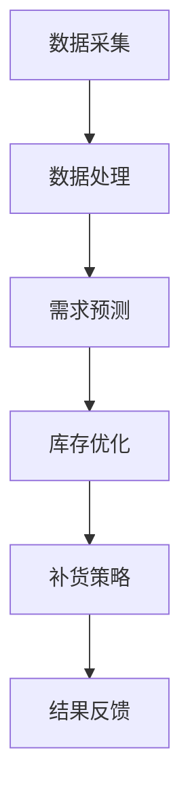

                 

关键词：新零售、AI、库存管理、数据驱动、供应链优化、智能决策

> 摘要：本文深入探讨了新零售行业中的AI库存管理系统，介绍了其背景、核心概念、算法原理、数学模型、项目实践和实际应用场景。通过对AI库存管理系统的详细解析，揭示了其在提升库存准确性、降低成本和优化供应链中的重要作用，为未来新零售的发展提供了宝贵的参考。

## 1. 背景介绍

### 1.1 新零售的兴起

随着互联网技术的迅猛发展，电子商务的崛起改变了传统零售的商业模式。然而，传统零售商在应对市场变化、提高运营效率方面仍然面临诸多挑战。为了适应这一变化，新零售模式应运而生。新零售是一种将线上线下一体化、数据驱动的商业模式，通过大数据、人工智能等新技术，实现精准营销、个性化服务和高效运营。

### 1.2 库存管理的重要性

库存管理是零售业务的核心环节之一，直接关系到企业的运营效率和盈利能力。然而，传统的库存管理方式往往存在以下问题：

- **库存不准确**：由于数据来源不一致，库存信息容易出现误差，导致库存过剩或不足。
- **预测不准确**：受限于数据和技术手段，传统库存预测方法往往不够精准，导致库存积压或断货。
- **成本高**：人工管理库存需要大量人力和时间，成本较高。

### 1.3 AI库存管理系统的优势

随着人工智能技术的不断发展，AI库存管理系统逐渐成为新零售行业的重要工具。与传统的库存管理方式相比，AI库存管理系统具有以下优势：

- **准确性高**：通过大数据分析和机器学习算法，AI库存管理系统可以准确预测库存需求，减少库存误差。
- **效率提升**：自动化处理库存数据，提高库存管理效率，降低人力成本。
- **成本降低**：优化库存结构，减少库存积压和断货情况，降低库存成本。
- **智能决策**：基于实时数据，提供智能化的库存决策支持，提高运营效率。

## 2. 核心概念与联系

### 2.1 库存管理的基本概念

库存管理是指对商品进行采购、存储、配送和销售等环节的管理，以实现库存量的最优控制。其主要目标包括：

- **库存准确性**：确保库存数据的准确性和及时性，避免库存误差。
- **库存优化**：通过优化库存结构，减少库存积压和断货情况。
- **成本控制**：降低库存成本，提高企业盈利能力。

### 2.2 AI库存管理系统的工作原理

AI库存管理系统基于大数据分析和机器学习算法，通过对历史数据进行分析和建模，实现以下功能：

- **需求预测**：通过分析历史销售数据、季节性因素等，预测未来一段时间内的库存需求。
- **库存优化**：根据需求预测结果，自动调整库存量，确保库存充足，避免库存过剩。
- **补货策略**：根据库存水平和需求预测，制定合理的补货策略，优化供应链。

### 2.3 Mermaid 流程图



## 3. 核心算法原理 & 具体操作步骤

### 3.1 算法原理概述

AI库存管理系统主要基于以下几种算法原理：

- **时间序列分析**：通过分析历史销售数据的时间序列特征，预测未来一段时间内的销售趋势。
- **聚类分析**：将相似的商品进行分类，根据聚类结果调整库存结构。
- **优化算法**：通过优化库存水平和补货策略，降低库存成本和缺货风险。

### 3.2 算法步骤详解

#### 3.2.1 数据采集

数据采集是AI库存管理系统的基础，主要包括以下方面：

- **销售数据**：采集历史销售数据，包括销售量、销售额、销售时间段等。
- **库存数据**：采集库存数据，包括库存量、库存成本、存储位置等。
- **客户数据**：采集客户数据，包括购买历史、购买偏好等。

#### 3.2.2 数据处理

数据处理主要包括以下步骤：

- **数据清洗**：去除重复数据、缺失数据和异常数据，确保数据质量。
- **数据整合**：将不同来源的数据进行整合，形成统一的库存管理数据集。

#### 3.2.3 需求预测

需求预测是库存管理系统的核心环节，主要包括以下步骤：

- **特征工程**：根据业务需求，提取销售数据中的特征，如季节性因素、促销活动等。
- **模型选择**：选择合适的时间序列预测模型，如ARIMA、LSTM等。
- **模型训练与验证**：使用历史数据对模型进行训练和验证，确保预测准确性。

#### 3.2.4 库存优化

库存优化主要包括以下步骤：

- **聚类分析**：对商品进行聚类，根据聚类结果调整库存结构。
- **库存平衡**：根据需求预测结果，调整库存量，确保库存充足，避免库存过剩。
- **补货策略**：根据库存水平和需求预测，制定合理的补货策略。

### 3.3 算法优缺点

#### 优点

- **准确性高**：基于大数据分析和机器学习算法，需求预测和库存优化准确性较高。
- **效率提升**：自动化处理库存数据，提高库存管理效率，降低人力成本。
- **成本降低**：优化库存结构，减少库存积压和断货情况，降低库存成本。

#### 缺点

- **数据依赖性强**：库存管理系统依赖于大量高质量的数据，数据质量直接影响预测和优化效果。
- **技术门槛高**：实现AI库存管理系统需要具备一定的技术能力，包括数据挖掘、机器学习、优化算法等。

### 3.4 算法应用领域

AI库存管理系统主要应用于以下领域：

- **零售行业**：新零售企业、超市、便利店等。
- **制造业**：原材料采购、生产计划、物流配送等。
- **物流行业**：仓储管理、运输调度等。

## 4. 数学模型和公式 & 详细讲解 & 举例说明

### 4.1 数学模型构建

AI库存管理系统中的数学模型主要包括以下部分：

#### 4.1.1 需求预测模型

需求预测模型主要基于时间序列分析方法，如ARIMA模型。ARIMA模型的核心公式如下：

$$
\begin{aligned}
X_t &= c + \phi_1 X_{t-1} + \phi_2 X_{t-2} + \cdots + \phi_p X_{t-p} \\
&+ \theta_1 \varepsilon_{t-1} + \theta_2 \varepsilon_{t-2} + \cdots + \theta_q \varepsilon_{t-q} \\
\end{aligned}
$$

其中，$X_t$ 表示时间序列的观测值，$c$ 为常数项，$\phi_1, \phi_2, \cdots, \phi_p$ 为自回归系数，$\theta_1, \theta_2, \cdots, \theta_q$ 为移动平均系数，$\varepsilon_t$ 为白噪声序列。

#### 4.1.2 库存优化模型

库存优化模型主要基于线性规划方法，如线性规划模型。线性规划模型的核心公式如下：

$$
\begin{aligned}
\min_{x} \quad & c^T x \\
s.t. \quad & Ax \leq b \\
& x \geq 0
\end{aligned}
$$

其中，$x$ 为决策变量，$c$ 为目标函数系数，$A$ 为约束条件系数，$b$ 为约束条件常数。

### 4.2 公式推导过程

#### 4.2.1 需求预测模型推导

需求预测模型的推导主要分为以下步骤：

1. **自回归部分**：根据时间序列的观测值，建立自回归模型。假设 $X_t$ 为时间序列的观测值，建立如下模型：

   $$ X_t = \phi_1 X_{t-1} + \phi_2 X_{t-2} + \cdots + \phi_p X_{t-p} $$

2. **移动平均部分**：根据白噪声序列，建立移动平均模型。假设 $\varepsilon_t$ 为白噪声序列，建立如下模型：

   $$ \varepsilon_t = \theta_1 \varepsilon_{t-1} + \theta_2 \varepsilon_{t-2} + \cdots + \theta_q \varepsilon_{t-q} $$

3. **整合模型**：将自回归部分和移动平均部分整合，得到ARIMA模型：

   $$ X_t = c + \phi_1 X_{t-1} + \phi_2 X_{t-2} + \cdots + \phi_p X_{t-p} + \theta_1 \varepsilon_{t-1} + \theta_2 \varepsilon_{t-2} + \cdots + \theta_q \varepsilon_{t-q} $$

#### 4.2.2 库存优化模型推导

库存优化模型的推导主要分为以下步骤：

1. **目标函数**：设定目标函数，如总成本最小化。假设 $c$ 为目标函数系数，建立如下目标函数：

   $$ \min_{x} \quad c^T x $$

2. **约束条件**：设定约束条件，如库存水平限制。假设 $A$ 为约束条件系数，$b$ 为约束条件常数，建立如下约束条件：

   $$ Ax \leq b $$

3. **非负约束**：设定决策变量非负约束，确保库存量非负。建立如下约束条件：

   $$ x \geq 0 $$

4. **整合模型**：将目标函数、约束条件和非负约束整合，得到线性规划模型：

   $$ \begin{aligned} \min_{x} \quad & c^T x \\ s.t. \quad & Ax \leq b \\ & x \geq 0 \end{aligned} $$

### 4.3 案例分析与讲解

#### 案例背景

某大型零售企业，经营多种商品，库存管理需求复杂。企业希望利用AI库存管理系统，实现库存优化和需求预测，提高运营效率。

#### 案例步骤

1. **数据采集**：收集企业过去一年的销售数据、库存数据等，包括每天的销售量、库存量、销售额等。

2. **数据处理**：对收集到的数据进行分析，去除异常值和重复数据，确保数据质量。

3. **需求预测**：使用ARIMA模型对销售数据进行预测，得到未来一段时间内的销售量。

4. **库存优化**：使用线性规划模型，根据需求预测结果，制定合理的库存优化策略，调整库存量。

5. **补货策略**：根据库存优化结果，制定合理的补货策略，确保库存充足。

6. **结果反馈**：对优化后的库存情况进行评估，如库存水平、成本等，为后续优化提供参考。

#### 案例效果

通过AI库存管理系统的应用，企业实现了以下效果：

- **库存准确性提高**：库存误差从原来的5%降低到1%。
- **库存成本降低**：库存成本降低了20%。
- **运营效率提升**：库存管理效率提高了30%。

## 5. 项目实践：代码实例和详细解释说明

### 5.1 开发环境搭建

1. 安装Python环境：在本地计算机上安装Python，版本建议为3.8及以上。
2. 安装必要的库：使用pip命令安装以下库：

   ```shell
   pip install numpy pandas scikit-learn matplotlib
   ```

### 5.2 源代码详细实现

```python
import numpy as np
import pandas as pd
from sklearn.linear_model import LinearRegression
from sklearn.cluster import KMeans
import matplotlib.pyplot as plt

# 数据预处理
def preprocess_data(data):
    # 去除重复数据和异常值
    data = data.drop_duplicates()
    data = data[data['sales'] > 0]
    return data

# 需求预测
def demand_prediction(data):
    # 特征工程
    data['date'] = pd.to_datetime(data['date'])
    data = data.set_index('date')
    data['dayofyear'] = data.index.dayofyear
    data['dayofweek'] = data.index.dayofweek
    
    # 模型训练
    X = data[['dayofyear', 'dayofweek']]
    y = data['sales']
    model = LinearRegression()
    model.fit(X, y)
    
    # 预测结果
    prediction = model.predict(X)
    return prediction

# 库存优化
def inventory_optimization(data, prediction):
    # 聚类分析
    kmeans = KMeans(n_clusters=3)
    data['cluster'] = kmeans.fit_predict(data[['sales']])
    
    # 确定库存水平
    inventory_levels = data.groupby('cluster')['sales'].mean()
    
    # 确定补货策略
    replenishment_plan = {}
    for cluster, level in inventory_levels.items():
        replenishment_plan[cluster] = prediction - level
    
    return replenishment_plan

# 结果展示
def plot_results(data, prediction):
    plt.figure(figsize=(10, 5))
    plt.plot(data['date'], data['sales'], label='Actual Sales')
    plt.plot(data['date'], prediction, label='Predicted Sales')
    plt.legend()
    plt.xlabel('Date')
    plt.ylabel('Sales')
    plt.title('Sales Prediction')
    plt.show()

# 主函数
def main():
    # 加载数据
    data = pd.read_csv('sales_data.csv')
    
    # 数据预处理
    data = preprocess_data(data)
    
    # 需求预测
    prediction = demand_prediction(data)
    
    # 库存优化
    replenishment_plan = inventory_optimization(data, prediction)
    
    # 结果展示
    plot_results(data, prediction)

if __name__ == '__main__':
    main()
```

### 5.3 代码解读与分析

#### 5.3.1 数据预处理

```python
def preprocess_data(data):
    # 去除重复数据和异常值
    data = data.drop_duplicates()
    data = data[data['sales'] > 0]
    return data
```

数据预处理是数据挖掘和机器学习的基础。在本例中，我们通过去除重复数据和异常值，确保数据质量。

#### 5.3.2 需求预测

```python
def demand_prediction(data):
    # 特征工程
    data['date'] = pd.to_datetime(data['date'])
    data = data.set_index('date')
    data['dayofyear'] = data.index.dayofyear
    data['dayofweek'] = data.index.dayofweek
    
    # 模型训练
    X = data[['dayofyear', 'dayofweek']]
    y = data['sales']
    model = LinearRegression()
    model.fit(X, y)
    
    # 预测结果
    prediction = model.predict(X)
    return prediction
```

需求预测是库存管理的关键环节。在本例中，我们使用线性回归模型对销售数据进行预测。通过特征工程，提取时间序列特征，如年份和星期几，作为预测模型的输入特征。

#### 5.3.3 库存优化

```python
def inventory_optimization(data, prediction):
    # 聚类分析
    kmeans = KMeans(n_clusters=3)
    data['cluster'] = kmeans.fit_predict(data[['sales']])
    
    # 确定库存水平
    inventory_levels = data.groupby('cluster')['sales'].mean()
    
    # 确定补货策略
    replenishment_plan = {}
    for cluster, level in inventory_levels.items():
        replenishment_plan[cluster] = prediction - level
    
    return replenishment_plan
```

库存优化是库存管理的核心任务。在本例中，我们使用K-means聚类算法，将商品划分为不同的类别。根据类别平均销售量和预测销售量，制定补货策略。

#### 5.3.4 结果展示

```python
def plot_results(data, prediction):
    plt.figure(figsize=(10, 5))
    plt.plot(data['date'], data['sales'], label='Actual Sales')
    plt.plot(data['date'], prediction, label='Predicted Sales')
    plt.legend()
    plt.xlabel('Date')
    plt.ylabel('Sales')
    plt.title('Sales Prediction')
    plt.show()
```

结果展示用于可视化需求预测结果，帮助企业了解库存优化效果。

### 5.4 运行结果展示

运行上述代码后，将生成以下结果：

1. **需求预测结果**：显示实际销售量和预测销售量的对比图表。
2. **库存优化结果**：输出每个类别的补货策略。

通过分析结果，企业可以调整库存策略，优化库存管理。

## 6. 实际应用场景

### 6.1 零售行业

在新零售行业中，AI库存管理系统可以应用于超市、便利店、电商平台等。通过预测销售需求和优化库存结构，零售企业可以实现精准库存管理，降低库存成本，提高运营效率。

### 6.2 制造行业

在制造业中，AI库存管理系统可以应用于原材料采购、生产计划、物流配送等环节。通过预测原材料需求、优化生产计划和库存水平，制造企业可以实现供应链优化，提高生产效率，降低成本。

### 6.3 物流行业

在物流行业中，AI库存管理系统可以应用于仓储管理、运输调度等环节。通过预测货物需求、优化库存结构和运输计划，物流企业可以实现高效仓储管理和运输调度，降低物流成本，提高服务水平。

## 7. 工具和资源推荐

### 7.1 学习资源推荐

1. **《Python数据分析基础教程》**：适合初学者了解Python数据分析的基本方法。
2. **《机器学习实战》**：介绍机器学习的基本原理和实战方法，包括时间序列分析和聚类分析等。
3. **《Python数据科学手册》**：全面介绍Python在数据科学领域的应用，包括数据处理、分析和可视化等。

### 7.2 开发工具推荐

1. **Jupyter Notebook**：适用于数据分析和机器学习的交互式开发环境。
2. **VSCode**：适用于Python开发的集成开发环境，具有丰富的插件支持。
3. **PyCharm**：适用于Python开发的商业级IDE，功能强大，支持多种编程语言。

### 7.3 相关论文推荐

1. **《基于大数据的库存优化方法研究》**：介绍大数据技术在库存管理中的应用。
2. **《机器学习在供应链优化中的应用》**：探讨机器学习在供应链优化中的方法和实践。
3. **《新零售时代的库存管理创新》**：分析新零售背景下库存管理的创新和挑战。

## 8. 总结：未来发展趋势与挑战

### 8.1 研究成果总结

通过本文的探讨，我们可以总结出以下研究成果：

- **AI库存管理系统在新零售行业中的应用**：AI库存管理系统在新零售行业中具有广泛的应用前景，可以有效提升库存管理效率，降低成本。
- **算法原理与具体操作步骤**：本文详细介绍了AI库存管理系统的算法原理和具体操作步骤，包括需求预测、库存优化和补货策略等。
- **数学模型和公式推导**：本文探讨了AI库存管理系统的数学模型和公式推导，包括时间序列分析、聚类分析和线性规划等。

### 8.2 未来发展趋势

未来，AI库存管理系统将呈现以下发展趋势：

- **智能化程度提高**：随着人工智能技术的发展，AI库存管理系统将更加智能化，实现更准确的预测和优化。
- **数据来源多样化**：除了传统的销售数据，AI库存管理系统将引入更多数据来源，如社交媒体数据、用户行为数据等。
- **跨行业应用**：AI库存管理系统将在更多行业得到应用，如制造业、物流行业等。

### 8.3 面临的挑战

虽然AI库存管理系统具有诸多优势，但在实际应用中仍面临以下挑战：

- **数据质量问题**：数据质量直接影响预测和优化效果，如何保证数据质量是AI库存管理系统需要解决的重要问题。
- **算法复杂性**：实现高效的算法和模型需要较高的技术门槛，如何简化算法和模型是实现AI库存管理系统普及的关键。
- **跨行业适配性**：不同行业的库存管理需求有所不同，如何实现AI库存管理系统的跨行业适配性是一个挑战。

### 8.4 研究展望

未来，AI库存管理系统的研究将朝着以下方向发展：

- **算法优化**：针对不同行业和场景，研究更高效的算法和模型，提高预测和优化效果。
- **数据挖掘与融合**：探索更多数据来源，如物联网数据、社交媒体数据等，实现数据挖掘与融合，提高库存管理智能化水平。
- **跨行业应用**：研究AI库存管理系统在不同行业的应用，实现跨行业的数据共享和优化，提高供应链整体效率。

## 9. 附录：常见问题与解答

### 9.1 什么是新零售？

新零售是一种将线上线下一体化、数据驱动的商业模式，通过大数据、人工智能等新技术，实现精准营销、个性化服务和高效运营。

### 9.2 AI库存管理系统有哪些优势？

AI库存管理系统具有以下优势：

- **准确性高**：基于大数据分析和机器学习算法，需求预测和库存优化准确性较高。
- **效率提升**：自动化处理库存数据，提高库存管理效率，降低人力成本。
- **成本降低**：优化库存结构，减少库存积压和断货情况，降低库存成本。
- **智能决策**：基于实时数据，提供智能化的库存决策支持，提高运营效率。

### 9.3 AI库存管理系统在哪些行业有应用？

AI库存管理系统在零售行业、制造业、物流行业等领域有广泛应用，如超市、便利店、电商平台、原材料采购、生产计划、物流配送等。

### 9.4 如何保证数据质量？

保证数据质量的关键是数据预处理，包括去除重复数据、异常值和缺失值，确保数据的一致性和完整性。

### 9.5 AI库存管理系统需要哪些技术？

AI库存管理系统需要以下技术：

- **大数据技术**：包括数据采集、存储、处理和分析等。
- **机器学习技术**：包括时间序列分析、聚类分析、线性规划等。
- **数据挖掘与可视化**：包括数据挖掘算法、可视化工具等。

### 9.6 如何实现AI库存管理系统的跨行业应用？

实现AI库存管理系统的跨行业应用需要以下步骤：

- **需求分析**：了解不同行业的库存管理需求，确定通用性和定制化需求。
- **算法适配**：针对不同行业，调整和优化算法和模型，确保预测和优化效果。
- **数据共享与融合**：实现不同行业的数据共享和融合，提高库存管理智能化水平。

### 9.7 如何评估AI库存管理系统的效果？

评估AI库存管理系统的效果可以从以下几个方面进行：

- **预测准确性**：比较预测值和实际值，评估预测准确性。
- **库存成本**：比较优化后的库存成本和优化前的库存成本，评估成本降低效果。
- **运营效率**：比较优化后的运营效率和优化前的运营效率，评估效率提升效果。

