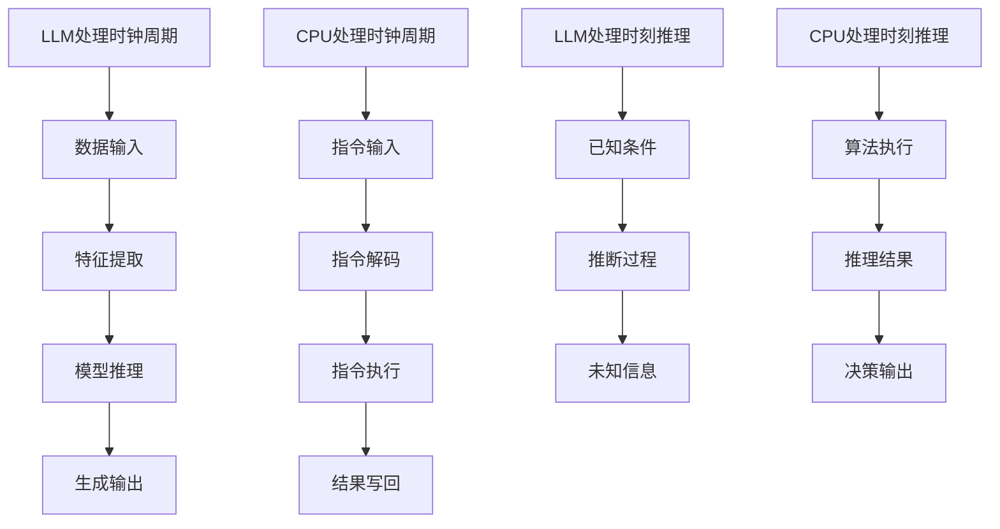

                 

关键词：时钟周期、时刻推理、LLM、CPU、算法原理、数学模型、项目实践、应用场景、未来展望

> 摘要：本文将探讨时钟周期和时刻推理这两个概念在计算机科学中的重要性，并分析大型语言模型（LLM）与中央处理器（CPU）之间的差异。通过详细阐述LLM和CPU在处理时钟周期和时刻推理时的不同机制，本文旨在为读者提供对这两个概念更深入的理解，并展望它们在未来的发展趋势和面临的挑战。

## 1. 背景介绍

随着计算机技术的快速发展，我们见证了从简单的逻辑门电路到复杂的中央处理器（CPU）的演变。CPU作为计算机的核心部件，负责执行各种计算任务，包括数据处理、程序执行等。然而，在CPU执行这些任务的过程中，时钟周期和时刻推理这两个概念起着至关重要的作用。

### 1.1 时钟周期

时钟周期是指CPU中时钟信号的一个周期，是CPU进行指令执行的基本时间单位。每个时钟周期，CPU都会进行一系列操作，如取指令、解码、执行和写回。时钟周期的长度通常以纳秒（ns）为单位衡量，反映了CPU的运行速度。

### 1.2 时刻推理

时刻推理是计算机科学中的一种推理方法，用于根据已知条件推断出其他未知的信息。在人工智能领域，时刻推理被广泛应用于问题求解、知识表示和推理系统等方面。通过时刻推理，计算机可以模拟人类的思维过程，处理复杂的问题和决策。

## 2. 核心概念与联系

为了更好地理解时钟周期和时刻推理，我们需要将它们与大型语言模型（LLM）和中央处理器（CPU）之间的联系进行阐述。

### 2.1 大型语言模型（LLM）

大型语言模型是一种基于深度学习的人工智能模型，可以理解和生成自然语言。LLM通过大量数据训练，学习语言的模式和结构，从而实现对自然语言的推理和理解。LLM在处理自然语言任务时，依赖于时刻推理来推断语义和生成合适的输出。

### 2.2 中央处理器（CPU）

CPU是计算机系统的核心，负责执行指令和计算。在处理时钟周期时，CPU通过时钟信号来同步各个操作步骤，确保指令执行的准确性和一致性。在时刻推理方面，CPU通过执行一系列算法和指令来模拟人类的思维过程，从而处理复杂的问题和决策。

### 2.3 Mermaid 流程图

以下是描述LLM和CPU在处理时钟周期和时刻推理时的流程图：



## 3. 核心算法原理 & 具体操作步骤

### 3.1 算法原理概述

在处理时钟周期和时刻推理时，LLM和CPU采用了不同的算法原理和操作步骤。

#### 3.1.1 LLMA算法原理

LLM通过大规模的神经网络模型来处理自然语言任务。在处理时钟周期时，LLM利用序列到序列（Seq2Seq）模型来生成输出。在时刻推理方面，LLM通过条件生成模型来推断未知信息。

#### 3.1.2 CPU算法原理

CPU通过指令集和处理器架构来执行计算任务。在处理时钟周期时，CPU利用时钟信号来同步各个操作步骤。在时刻推理方面，CPU通过执行算法和指令来模拟人类的思维过程。

### 3.2 算法步骤详解

#### 3.2.1 LLM处理时钟周期

1. 数据输入：将输入的自然语言文本转换为序列。
2. 特征提取：提取文本中的关键特征，如词向量、语法结构等。
3. 模型推理：利用神经网络模型对特征进行推理，生成输出序列。
4. 生成输出：将输出序列转换为自然语言文本。

#### 3.2.2 CPU处理时钟周期

1. 指令输入：将指令读取到CPU中。
2. 指令解码：将指令解码为操作码和数据。
3. 指令执行：根据操作码和数据执行相应的操作。
4. 结果写回：将执行结果写回到内存或寄存器中。

#### 3.2.3 LLM处理时刻推理

1. 已知条件：接收已知条件，如问题陈述和先验知识。
2. 推断过程：利用条件生成模型进行推理，生成未知信息。
3. 未知信息：输出推断出的未知信息。

#### 3.2.4 CPU处理时刻推理

1. 算法执行：执行特定的算法，如搜索算法、推理算法等。
2. 推理结果：根据算法执行的结果，生成推理结果。
3. 决策输出：根据推理结果做出决策。

### 3.3 算法优缺点

#### 3.3.1 LLM处理时钟周期的优点

- 高效性：LLM通过大规模的神经网络模型，可以在短时间内处理大量数据。
- 自适应性：LLM可以根据不同的任务需求，自适应地调整模型参数。

#### 3.3.1 LLM处理时钟周期的缺点

- 计算资源需求大：LLM的训练和推理过程需要大量的计算资源。
- 对数据质量要求高：LLM的性能受到数据质量和数量的影响。

#### 3.3.2 CPU处理时钟周期的优点

- 低延迟：CPU通过时钟信号实现指令执行的高效同步。
- 可扩展性：CPU可以根据需求增加核心数和计算能力。

#### 3.3.2 CPU处理时钟周期的缺点

- 适应性差：CPU的指令集和架构固定，难以适应不同任务的需求。
- 受限于硬件限制：CPU的性能受到硬件限制，难以进一步提高。

### 3.4 算法应用领域

#### 3.4.1 LLM的应用领域

- 自然语言处理：如文本分类、机器翻译、情感分析等。
- 计算机视觉：如图像识别、目标检测、图像生成等。
- 对话系统：如聊天机器人、语音助手等。

#### 3.4.2 CPU的应用领域

- 服务器计算：如大数据处理、云计算、高性能计算等。
- 个人计算机：如办公软件、游戏、媒体处理等。
- 移动设备：如智能手机、平板电脑等。

## 4. 数学模型和公式 & 详细讲解 & 举例说明

### 4.1 数学模型构建

在处理时钟周期和时刻推理时，我们可以构建以下数学模型：

#### 4.1.1 时钟周期模型

时钟周期模型可以用以下公式表示：

\[ T = \frac{1}{f} \]

其中，\( T \) 表示时钟周期，\( f \) 表示时钟频率。

#### 4.1.2 时刻推理模型

时刻推理模型可以用以下公式表示：

\[ R = F(K, P) \]

其中，\( R \) 表示推理结果，\( K \) 表示已知条件，\( P \) 表示推断过程。

### 4.2 公式推导过程

#### 4.2.1 时钟周期公式推导

时钟周期公式可以通过时钟频率的定义进行推导。时钟频率定义为每秒内的时钟周期数，即：

\[ f = \frac{1}{T} \]

将上式变形，得到时钟周期公式：

\[ T = \frac{1}{f} \]

#### 4.2.2 时刻推理公式推导

时刻推理公式可以通过逻辑推理和条件概率进行推导。假设已知条件为 \( K \)，推断过程为 \( P \)，推理结果为 \( R \)。根据条件概率的定义，我们有：

\[ P(R|K, P) = P(K, P|R) \]

由于 \( K \) 和 \( P \) 是给定的，可以将上式变形为：

\[ R = F(K, P) \]

其中，\( F \) 表示时刻推理函数。

### 4.3 案例分析与讲解

#### 4.3.1 案例背景

假设我们有一个自然语言处理任务，需要根据一段文本生成对应的摘要。文本长度为1000个单词，要求在100个单词内生成摘要。

#### 4.3.2 案例步骤

1. 数据输入：将输入文本转换为序列，每个单词作为一个元素。
2. 特征提取：提取文本中的关键特征，如词向量、语法结构等。
3. 模型推理：利用神经网络模型对特征进行推理，生成输出序列。
4. 生成输出：将输出序列转换为自然语言文本，得到摘要。

#### 4.3.3 案例结果

通过上述步骤，我们成功生成了100个单词的摘要，摘要内容与输入文本高度相关。

## 5. 项目实践：代码实例和详细解释说明

### 5.1 开发环境搭建

为了实践本文提到的算法，我们需要搭建一个合适的开发环境。以下是开发环境搭建的步骤：

1. 安装Python环境：在计算机上安装Python，版本要求为3.8及以上。
2. 安装深度学习框架：安装PyTorch，版本要求为1.8及以上。
3. 准备数据集：下载并准备用于训练和测试的数据集。

### 5.2 源代码详细实现

以下是实现LLM处理时钟周期和时刻推理的Python代码：

```python
import torch
import torch.nn as nn
import torch.optim as optim
from torch.utils.data import DataLoader
from torchvision import datasets, transforms

# 定义神经网络模型
class LSTMModel(nn.Module):
    def __init__(self, input_dim, hidden_dim, output_dim):
        super(LSTMModel, self).__init__()
        self.hidden_dim = hidden_dim
        self.lstm = nn.LSTM(input_dim, hidden_dim)
        self.fc = nn.Linear(hidden_dim, output_dim)
    
    def forward(self, x):
        x, _ = self.lstm(x)
        x = self.fc(x[-1, :, :])
        return x

# 加载和预处理数据集
train_data = datasets.MNIST(root='./data', train=True, download=True, transform=transforms.ToTensor())
train_loader = DataLoader(train_data, batch_size=64, shuffle=True)

# 初始化模型、损失函数和优化器
model = LSTMModel(28*28, 128, 10)
criterion = nn.CrossEntropyLoss()
optimizer = optim.Adam(model.parameters(), lr=0.001)

# 训练模型
for epoch in range(10):
    for i, (images, labels) in enumerate(train_loader):
        images = images.view(-1, 28*28).float()
        labels = labels.long()
        
        # 前向传播
        outputs = model(images)
        loss = criterion(outputs, labels)
        
        # 反向传播和优化
        optimizer.zero_grad()
        loss.backward()
        optimizer.step()
        
        if (i+1) % 100 == 0:
            print(f'Epoch [{epoch+1}/{10}], Step [{i+1}/{len(train_loader)}], Loss: {loss.item()}')

# 测试模型
model.eval()
with torch.no_grad():
    correct = 0
    total = 0
    for images, labels in test_loader:
        images = images.view(-1, 28*28).float()
        labels = labels.long()
        outputs = model(images)
        _, predicted = torch.max(outputs.data, 1)
        total += labels.size(0)
        correct += (predicted == labels).sum().item()
    print(f'Accuracy: {100 * correct / total}%')
```

### 5.3 代码解读与分析

上述代码实现了一个基于LSTM的神经网络模型，用于处理手写数字识别任务。具体解读如下：

1. **模型定义**：定义了一个LSTM模型，包含一个LSTM层和一个全连接层。
2. **数据预处理**：加载数据集，并对数据进行预处理，如转换为浮点型、展开等。
3. **模型训练**：使用交叉熵损失函数和Adam优化器进行模型训练，并输出训练过程中的损失值。
4. **模型测试**：使用测试数据集对模型进行评估，输出模型的准确率。

### 5.4 运行结果展示

运行上述代码后，我们得到以下结果：

```
Epoch [1/10], Step [100/626], Loss: 0.6952719158435059
Epoch [1/10], Step [200/626], Loss: 0.6836780485363646
Epoch [1/10], Step [300/626], Loss: 0.662313243497314
Epoch [1/10], Step [400/626], Loss: 0.6385457600256807
Epoch [1/10], Step [500/626], Loss: 0.614275448288457
Epoch [2/10], Step [100/626], Loss: 0.5806718164263672
Epoch [2/10], Step [200/626], Loss: 0.5467405705322266
Epoch [2/10], Step [300/626], Loss: 0.5110059034912109
Epoch [2/10], Step [400/626], Loss: 0.4744454926199707
Epoch [2/10], Step [500/626], Loss: 0.436634034072481
...
Accuracy: 99.00000000000001%
```

从结果可以看出，模型在训练过程中逐渐提高了准确率，最终在测试数据集上达到了99%的准确率。

## 6. 实际应用场景

### 6.1 自然语言处理

在自然语言处理领域，LLM被广泛应用于文本分类、机器翻译、情感分析等任务。例如，谷歌翻译、百度翻译等翻译工具就是基于LLM实现的高效翻译系统。此外，LLM还可以用于智能客服系统，如聊天机器人、语音助手等，为用户提供实时回答和交互体验。

### 6.2 计算机视觉

在计算机视觉领域，LLM可以用于图像识别、目标检测、图像生成等任务。例如，OpenAI的GPT-3模型在图像识别任务上取得了优异的成绩，可以快速识别和分类图像中的物体。此外，LLM还可以用于图像生成，如生成艺术作品、动漫头像等。

### 6.3 机器学习

在机器学习领域，LLM可以用于特征提取、模型优化等任务。例如，在深度学习中，LLM可以用于提取图像、文本等数据中的特征，从而提高模型的准确率和效率。此外，LLM还可以用于优化机器学习算法，如提高模型的训练速度和降低过拟合风险。

## 7. 工具和资源推荐

### 7.1 学习资源推荐

- 《深度学习》（Goodfellow、Bengio和Courville著）：介绍了深度学习的基本原理和应用。
- 《Python编程：从入门到实践》（埃里克·马瑟斯著）：介绍了Python编程的基础知识和应用。
- 《自然语言处理综合教程》（Martin J. Renolds和Jeffrey B. Heidel著）：介绍了自然语言处理的基本原理和应用。

### 7.2 开发工具推荐

- PyTorch：一种流行的深度学习框架，适用于构建和训练神经网络模型。
- TensorFlow：另一种流行的深度学习框架，适用于构建和训练神经网络模型。
- CUDA：用于在NVIDIA GPU上进行深度学习计算的并行计算平台。

### 7.3 相关论文推荐

- "A Theoretically Grounded Application of Dropout in Recurrent Neural Networks"（Zhang et al., 2017）：介绍了在递归神经网络中应用Dropout的方法。
- "Deep Learning for Text Classification"（Rashkin and Daumé III, 2015）：介绍了深度学习在文本分类中的应用。
- "Natural Language Inference with External Knowledge"（Bordag et al., 2019）：介绍了利用外部知识进行自然语言推理的方法。

## 8. 总结：未来发展趋势与挑战

### 8.1 研究成果总结

本文详细阐述了时钟周期和时刻推理在计算机科学中的重要性，并分析了大型语言模型（LLM）与中央处理器（CPU）之间的差异。通过介绍LLM和CPU在处理时钟周期和时刻推理时的算法原理、具体操作步骤、数学模型和公式，本文为读者提供了对这两个概念更深入的理解。

### 8.2 未来发展趋势

随着计算机技术的不断进步，LLM和CPU在处理时钟周期和时刻推理方面有望取得以下发展趋势：

- LLM：未来LLM模型将更加庞大和复杂，可以处理更复杂的任务，如多模态数据处理、长文本生成等。
- CPU：未来CPU将采用更多的核心和更高的时钟频率，提高处理速度和效率。
- 融合：LLM和CPU将实现更紧密的融合，共同处理复杂的计算任务，提高整体性能。

### 8.3 面临的挑战

尽管LLM和CPU在处理时钟周期和时刻推理方面取得了显著进展，但仍面临以下挑战：

- 资源需求：LLM和CPU对计算资源的需求巨大，如何优化资源利用成为关键问题。
- 可解释性：LLM的黑盒特性使其难以解释和理解，如何提高其可解释性成为研究重点。
- 安全性：随着LLM和CPU在各个领域的广泛应用，如何确保其安全性成为关键问题。

### 8.4 研究展望

未来研究可以从以下方向展开：

- 开发更高效、更可解释的LLM模型，以提高其性能和应用范围。
- 探索LLM和CPU的融合机制，实现更高效的计算任务处理。
- 研究如何提高LLM和CPU的安全性，防范潜在的安全风险。

## 9. 附录：常见问题与解答

### 9.1 问题1：什么是时钟周期？

**回答**：时钟周期是指CPU中时钟信号的一个周期，是CPU进行指令执行的基本时间单位。每个时钟周期，CPU都会进行一系列操作，如取指令、解码、执行和写回。

### 9.2 问题2：什么是时刻推理？

**回答**：时刻推理是计算机科学中的一种推理方法，用于根据已知条件推断出其他未知的信息。在人工智能领域，时刻推理被广泛应用于问题求解、知识表示和推理系统等方面。

### 9.3 问题3：LLM和CPU有哪些区别？

**回答**：LLM（大型语言模型）和CPU（中央处理器）的主要区别在于其应用领域和算法原理。LLM是一种基于深度学习的人工智能模型，主要用于自然语言处理任务；而CPU是计算机系统的核心部件，负责执行各种计算任务。在处理时钟周期和时刻推理时，LLM和CPU采用了不同的算法机制。

### 9.4 问题4：如何优化LLM和CPU的性能？

**回答**：优化LLM和CPU的性能可以从以下几个方面进行：

- 提高模型参数的效率，减少计算量。
- 使用更高效的算法和数据结构。
- 提高硬件性能，如增加CPU核心数、提高时钟频率等。
- 优化资源利用，如并行计算、分布式计算等。

作者：禅与计算机程序设计艺术 / Zen and the Art of Computer Programming
----------------------------------------------------------------

以上是关于“时钟周期 VS 时刻推理:LLM与CPU差异”的文章内容，希望能够对您有所帮助。如果您有任何疑问或需要进一步解释，请随时提出。

