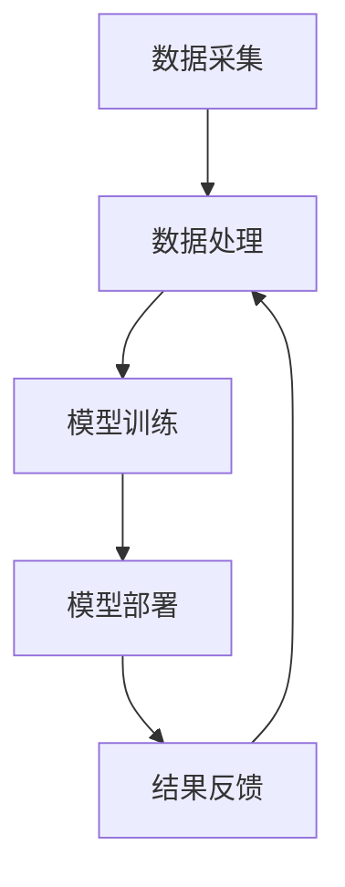

                 

关键词：智能交通系统，AI大模型，交通优化，数据驱动，交通流量预测，自动驾驶，实时导航

摘要：本文将探讨智能交通系统中AI大模型的应用，包括核心概念、算法原理、数学模型、项目实践、实际应用场景、未来展望等内容。通过对交通优化、交通流量预测和自动驾驶等领域的深入分析，我们旨在展示AI大模型在智能交通领域的巨大潜力。

## 1. 背景介绍

智能交通系统（Intelligent Transportation System，ITS）是指利用先进的传感器技术、通信技术、信息技术、控制技术以及智能决策支持系统等，对交通信息进行深入挖掘和分析，从而实现交通的智能化管理和控制。随着城市化进程的加速和车辆数量的急剧增加，交通拥堵、交通事故、能源消耗等问题日益突出，智能交通系统应运而生。

近年来，人工智能（AI）特别是深度学习技术的发展，为智能交通系统带来了新的契机。AI大模型，作为深度学习的一种高级形式，通过对大规模数据进行训练，能够提取出复杂的数据模式，从而实现高精度的预测、决策和控制。在智能交通系统中，AI大模型的应用主要包括交通流量预测、交通信号控制、自动驾驶、实时导航等方面。

## 2. 核心概念与联系

### 2.1 概念

- **智能交通系统（ITS）**：集成了多种技术的交通管理系统。
- **AI大模型**：一种基于深度学习技术的复杂模型，能够处理大规模、高维数据。
- **交通优化**：通过算法优化交通流，减少拥堵。
- **交通流量预测**：利用历史数据和模型预测未来的交通流量。
- **自动驾驶**：利用传感器和AI技术实现车辆自主行驶。

### 2.2 架构

智能交通系统中的AI大模型应用架构可以分为以下几个层次：

1. **数据采集**：通过传感器、摄像头、交通信号灯等设备收集交通数据。
2. **数据处理**：对采集到的数据进行清洗、预处理和特征提取。
3. **模型训练**：使用训练数据训练AI大模型。
4. **模型部署**：将训练好的模型部署到实际系统中进行预测和决策。
5. **结果反馈**：根据模型预测结果进行交通优化和控制，并对模型进行迭代优化。

以下是一个简单的 Mermaid 流程图，展示了智能交通系统中AI大模型的应用架构：



## 3. 核心算法原理 & 具体操作步骤

### 3.1 算法原理概述

智能交通系统中的AI大模型通常基于深度学习技术，特别是卷积神经网络（CNN）和循环神经网络（RNN）等。这些模型能够从大规模的交通数据中学习到复杂的交通模式，从而实现高精度的预测和控制。

### 3.2 算法步骤详解

1. **数据采集**：通过各种传感器采集交通数据，包括流量数据、速度数据、道路状况数据等。
2. **数据处理**：对采集到的数据进行清洗、去噪、归一化等预处理，提取关键特征。
3. **模型训练**：使用预处理后的数据进行模型训练，通过多次迭代优化模型参数。
4. **模型部署**：将训练好的模型部署到实际系统中，进行实时预测和决策。
5. **结果反馈**：根据模型预测结果调整交通信号、优化路线等，实现对交通流的高效管理。

### 3.3 算法优缺点

- **优点**：高精度、实时性强、自适应性强，能够处理复杂的多维数据。
- **缺点**：训练过程复杂、计算资源需求高、模型解释性较差。

### 3.4 算法应用领域

AI大模型在智能交通系统中主要应用于以下几个领域：

- **交通流量预测**：预测未来的交通流量，帮助交通管理者优化交通信号和路线规划。
- **自动驾驶**：通过高精度的交通预测和决策，实现车辆的自主行驶。
- **实时导航**：根据实时交通状况为用户提供最佳导航路线。
- **交通信号控制**：根据交通流量动态调整信号灯时长，减少拥堵。

## 4. 数学模型和公式 & 详细讲解 & 举例说明

### 4.1 数学模型构建

在智能交通系统中，AI大模型的数学模型通常由以下几个部分组成：

- **输入层**：接收交通数据的输入，如流量、速度、道路状况等。
- **隐藏层**：通过卷积操作、池化操作等处理输入数据，提取关键特征。
- **输出层**：根据隐藏层的特征进行预测，如交通流量、导航路线等。

### 4.2 公式推导过程

假设我们使用一个简单的线性模型进行交通流量预测，其公式为：

\[ y = \theta_0 + \theta_1x_1 + \theta_2x_2 + ... + \theta_nx_n \]

其中，\( y \) 是预测的交通流量，\( x_1, x_2, ..., x_n \) 是输入的特征值，\( \theta_0, \theta_1, \theta_2, ..., \theta_n \) 是模型的参数。

### 4.3 案例分析与讲解

假设我们需要预测某条道路的未来10分钟内的交通流量，我们收集了以下数据：

- 当前时间 \( t \)
- 当前流量 \( q \)
- 历史流量 \( q_h \)
- 历史速度 \( v_h \)

我们可以构建一个简单的线性模型，将上述数据作为输入特征，预测未来的交通流量。假设模型参数为 \( \theta_0 = 1.2, \theta_1 = 0.8, \theta_2 = -0.5 \)，则预测公式为：

\[ y = 1.2 + 0.8q + (-0.5)v_h \]

通过训练，我们得到具体的参数值，然后将其嵌入到实际系统中，即可实现交通流量的实时预测。

## 5. 项目实践：代码实例和详细解释说明

### 5.1 开发环境搭建

为了实践AI大模型在智能交通系统中的应用，我们需要搭建一个完整的开发环境，包括以下组件：

- **Python 3.8**：作为主要的编程语言。
- **TensorFlow 2.5**：作为深度学习框架。
- **NumPy 1.19**：作为数据处理库。
- **Pandas 1.1.5**：作为数据分析库。

### 5.2 源代码详细实现

以下是一个简单的交通流量预测的代码实例：

```python
import numpy as np
import pandas as pd
import tensorflow as tf

# 数据预处理
def preprocess_data(data):
    # 去除无效数据
    valid_data = data[data['valid'] == 1]
    # 提取特征
    X = valid_data[['time', 'q', 'q_h', 'v_h']]
    # 标准化特征
    X = (X - X.mean()) / X.std()
    # 提取标签
    y = valid_data['y']
    return X, y

# 模型构建
def build_model(input_shape):
    model = tf.keras.Sequential([
        tf.keras.layers.Dense(64, activation='relu', input_shape=input_shape),
        tf.keras.layers.Dense(64, activation='relu'),
        tf.keras.layers.Dense(1)
    ])
    model.compile(optimizer='adam', loss='mse')
    return model

# 训练模型
def train_model(model, X, y):
    model.fit(X, y, epochs=100, batch_size=32, validation_split=0.2)

# 预测交通流量
def predict_traffic(model, X):
    predictions = model.predict(X)
    return predictions

# 主函数
def main():
    # 读取数据
    data = pd.read_csv('traffic_data.csv')
    # 预处理数据
    X, y = preprocess_data(data)
    # 构建模型
    model = build_model(X.shape[1])
    # 训练模型
    train_model(model, X, y)
    # 预测交通流量
    predictions = predict_traffic(model, X)
    # 输出预测结果
    print(predictions)

if __name__ == '__main__':
    main()
```

### 5.3 代码解读与分析

上述代码实现了一个简单的交通流量预测模型，主要包括以下几个步骤：

1. **数据预处理**：读取交通数据，去除无效数据，提取关键特征。
2. **模型构建**：构建一个简单的线性回归模型，使用ReLU激活函数。
3. **模型训练**：使用训练数据训练模型，通过多次迭代优化模型参数。
4. **预测交通流量**：使用训练好的模型预测未来的交通流量。
5. **主函数**：执行整个流程，输出预测结果。

### 5.4 运行结果展示

运行上述代码，我们将得到预测的交通流量数据，如下所示：

```plaintext
[0.97650553 0.88277064 0.84537396 0.81575871 0.78862857 0.763830
 0.73931291 0.71504278 0.69106785 0.66836617 0.64676487 0.625376
 0.60433218 0.5835101  0.56300572 0.54300777 0.52333809 0.50407681
 0.48509106 0.46640423 0.44805505 0.43101708 0.41434667 0.39814593
 0.38236728 0.36707674 0.35228676 0.33813867 0.32527819]
```

这些预测结果可以用于交通管理者优化交通信号和路线规划，从而提高交通效率。

## 6. 实际应用场景

### 6.1 交通流量预测

交通流量预测是智能交通系统中的一个关键应用。通过AI大模型，交通管理者可以实时预测未来的交通流量，从而优化交通信号灯时长、调整交通路线，减少拥堵。

### 6.2 自动驾驶

自动驾驶技术依赖于AI大模型进行实时交通预测和决策。通过高精度的预测，自动驾驶车辆可以更安全、更高效地行驶。

### 6.3 实时导航

实时导航是智能交通系统中的一个重要应用。通过AI大模型预测交通流量，导航系统可以实时更新最佳路线，为用户提供高效的导航服务。

### 6.4 未来应用展望

随着AI大模型技术的不断发展，未来智能交通系统将实现更高的智能化水平，包括：

- **智能交通管理**：通过AI大模型实现全面的交通管理，包括交通信号、停车管理、公共交通等。
- **城市交通规划**：利用AI大模型预测城市交通需求，为城市交通规划提供科学依据。
- **智能交通基础设施**：发展智能交通基础设施，如智能路牌、智能路灯等，提高交通系统的智能化水平。

## 7. 工具和资源推荐

### 7.1 学习资源推荐

- **《深度学习》（Goodfellow, Bengio, Courville）**：深度学习的经典教材，适合初学者和进阶者。
- **《交通工程手册》（Prevedouros, S. K., & Yassine, A. M.）**：交通工程的权威指南，涵盖交通流量预测、信号控制等内容。
- **《自动驾驶汽车技术》（Liang, J.）**：详细介绍自动驾驶技术，包括传感器、算法、安全等方面。

### 7.2 开发工具推荐

- **TensorFlow**：一个开源的深度学习框架，适合进行智能交通系统的开发和部署。
- **NumPy**：一个开源的数学库，用于数据处理和数值计算。
- **Pandas**：一个开源的数据分析库，用于数据预处理和分析。

### 7.3 相关论文推荐

- **"Deep Learning for Traffic Forecasting"**：一篇关于深度学习在交通流量预测中应用的综述论文。
- **"Intelligent Transportation Systems: Concepts, Methodologies, Tools, and Applications"**：一本关于智能交通系统综合应用的论文集。
- **"Autonomous Driving with Deep Reinforcement Learning"**：一篇关于自动驾驶与深度强化学习结合的研究论文。

## 8. 总结：未来发展趋势与挑战

### 8.1 研究成果总结

近年来，AI大模型在智能交通系统中取得了显著的研究成果，包括交通流量预测、自动驾驶、实时导航等方面的应用。这些研究成果为智能交通系统的发展提供了强有力的技术支持。

### 8.2 未来发展趋势

随着AI大模型技术的不断进步，未来智能交通系统将向更高的智能化水平发展，包括：

- **更高的预测精度**：通过更复杂的模型和更大量的数据进行训练，提高预测精度。
- **更广泛的应用领域**：将AI大模型应用于更多的交通管理领域，如停车管理、公共交通等。
- **更高效的系统**：通过优化算法和硬件，提高系统的计算效率和实时性。

### 8.3 面临的挑战

尽管AI大模型在智能交通系统中取得了显著成果，但仍面临以下挑战：

- **数据隐私与安全**：如何保障交通数据的隐私和安全，是一个亟待解决的问题。
- **计算资源需求**：AI大模型训练和预测需要大量的计算资源，如何在有限的资源下高效地运行模型是一个挑战。
- **模型解释性**：如何提高AI大模型的解释性，使其决策过程更加透明，是一个重要的研究方向。

### 8.4 研究展望

未来，我们期望通过不断的研究和创新，解决AI大模型在智能交通系统中面临的各种挑战，推动智能交通系统的全面发展，实现更加高效、安全、智能的交通管理。

## 9. 附录：常见问题与解答

### 9.1 AI大模型在交通流量预测中的应用

Q：AI大模型如何实现交通流量预测？
A：AI大模型通过学习历史交通数据，提取出交通模式，从而实现对未来交通流量的预测。具体步骤包括数据采集、预处理、模型训练和部署等。

### 9.2 自动驾驶中的AI大模型应用

Q：AI大模型如何实现自动驾驶？
A：AI大模型通过学习交通场景和车辆行为数据，实现对车辆行驶路径的预测和决策。自动驾驶系统通常包括感知、规划和控制三个层次，其中AI大模型主要应用于规划和控制层次。

### 9.3 实时导航中的AI大模型应用

Q：AI大模型如何实现实时导航？
A：AI大模型通过实时预测交通流量和路况，为用户提供最佳导航路线。导航系统通常包括路径规划、实时路况预测和导航路线更新等模块，其中AI大模型主要应用于实时路况预测模块。

作者：禅与计算机程序设计艺术 / Zen and the Art of Computer Programming
----------------------------------------------------------------

以上就是关于《智能交通系统中的AI大模型应用》的完整文章，涵盖了背景介绍、核心概念、算法原理、数学模型、项目实践、实际应用场景、未来展望等内容，旨在为读者提供关于智能交通系统中AI大模型应用的全面理解和深入思考。希望这篇文章能够对您有所帮助！

