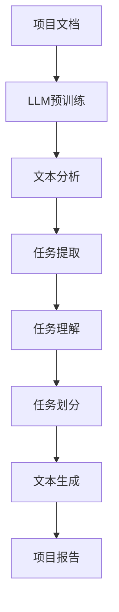

                 

关键词：智能任务分解，项目规划，大型语言模型，算法原理，应用领域，代码实例

> 摘要：本文深入探讨了大型语言模型（LLM）在项目规划中的智能任务分解应用。通过对LLM核心概念、算法原理、数学模型和实际应用场景的详细分析，本文揭示了LLM在项目规划中的巨大潜力，并展望了其未来的发展趋势和挑战。

## 1. 背景介绍

在现代项目管理中，任务分解是一项关键活动。它不仅有助于项目团队理解项目的整体结构，还能确保任务分配和进度控制的有效性。随着项目的复杂性不断增加，传统的手动任务分解方法逐渐显得力不从心，迫切需要一种智能化的解决方案来提高效率和质量。

近年来，大型语言模型（LLM）作为一种先进的自然语言处理技术，已经展示出在文本生成、问答系统和语言理解等领域的巨大潜力。LLM通过大规模预训练模型，能够捕捉到语言中的复杂模式和关系，从而为智能任务分解提供了一种全新的方法。

本文旨在探讨LLM在项目规划中的智能任务分解应用。我们首先将介绍LLM的核心概念和原理，然后详细分析其在任务分解中的算法原理和操作步骤。接着，我们将探讨LLM在项目规划中的数学模型和公式，并通过实际项目案例进行讲解。最后，我们将讨论LLM在项目规划中的应用领域，并提出未来应用展望。

### 1.1 项目规划中的任务分解

项目规划中的任务分解是将大型项目划分为更小、更易于管理的任务的过程。有效的任务分解能够提高项目的透明度，帮助团队成员更好地理解各自的职责，同时也有助于进度控制和风险管理的实施。

传统的任务分解方法主要依赖于项目管理者的经验和知识。这种方法虽然简单直观，但在面对复杂项目时往往不够精细，容易导致任务遗漏或重复。此外，手动分解任务需要大量时间和精力，难以适应快速变化的项目需求。

随着人工智能技术的发展，智能化的任务分解方法逐渐成为研究热点。这些方法利用机器学习和自然语言处理技术，能够自动分析项目文档、提取关键信息，并生成详细的任务列表。这种智能化方法不仅提高了分解的精度和效率，还能减少人为错误，提高项目成功率。

### 1.2 大型语言模型（LLM）概述

大型语言模型（LLM）是一种基于深度学习技术的自然语言处理模型，它通过对海量文本数据进行预训练，学习到语言中的复杂结构和关系。LLM的核心思想是通过大量数据的学习，使模型能够理解和生成自然语言。

LLM的主要特点是能够处理大规模文本数据，并且具有较强的语言理解和生成能力。常见的LLM模型包括GPT（Generative Pre-trained Transformer）系列、BERT（Bidirectional Encoder Representations from Transformers）和T5（Text-to-Text Transfer Transformer）等。这些模型通过多层神经网络结构，能够捕捉到文本中的长距离依赖关系，从而实现高质量的自然语言处理任务。

在项目规划中，LLM的应用潜力主要表现在以下几个方面：

1. **自动文本分析**：LLM能够自动分析项目文档，提取关键信息，生成任务列表。这种方法不仅提高了任务分解的效率，还能减少人工干预，提高准确性。
   
2. **任务理解与推理**：LLM通过学习到的语言知识，能够对项目文档中的任务进行深入理解，甚至进行推理，从而生成更合理的任务划分。

3. **语言生成**：LLM能够生成高质量的自然语言文本，用于生成项目报告、任务描述等文档，提高项目文档的完整性和一致性。

4. **多语言支持**：LLM通常具有多语言处理能力，能够在全球化的项目中支持不同语言的文档分析。

总之，LLM在项目规划中的智能任务分解应用，不仅提高了任务分解的效率和准确性，还为项目管理者提供了一种新的工具，以应对日益复杂的项目管理挑战。

## 2. 核心概念与联系

### 2.1 LLM的核心概念

大型语言模型（LLM）的核心概念主要包括自然语言处理（NLP）、预训练和微调等。以下是这些概念的基本定义和原理：

#### 2.1.1 自然语言处理（NLP）

自然语言处理（NLP）是人工智能领域的一个重要分支，旨在让计算机理解和处理人类自然语言。NLP的任务包括文本分类、命名实体识别、情感分析、机器翻译等。NLP的核心是让计算机能够理解和生成自然语言，从而实现人与机器的交互。

#### 2.1.2 预训练

预训练是LLM的关键技术之一。预训练模型通过在大规模文本数据上进行无监督学习，使模型掌握语言的通用结构和语义信息。预训练后的模型可以在特定任务上进行微调，从而实现高质量的文本处理。

#### 2.1.3 微调

微调是在特定任务上对预训练模型进行调整和优化的过程。通过在特定任务的数据集上训练，模型可以学习到该任务所需的特定知识和技能，从而提高任务性能。

### 2.2 LLM在项目规划中的联系

LLM在项目规划中的应用，主要依赖于其强大的文本分析和生成能力。以下是LLM在项目规划中的几个关键联系：

#### 2.2.1 文本分析

LLM能够自动分析项目文档，提取关键信息。例如，它可以识别项目描述中的关键任务、里程碑、资源需求等，从而生成详细的任务列表。

#### 2.2.2 任务理解

通过学习到的语言知识，LLM能够对项目文档中的任务进行深入理解。例如，它可以识别任务之间的依赖关系，提出合理的任务划分建议。

#### 2.2.3 文本生成

LLM能够生成高质量的自然语言文本，用于生成项目报告、任务描述等文档。这种方法不仅提高了文档的完整性，还能确保文档的一致性和准确性。

### 2.3 Mermaid 流程图

为了更好地展示LLM在项目规划中的工作流程，我们可以使用Mermaid流程图来描述。以下是LLM在项目规划中的流程图：



### 2.4 LLM的工作流程

LLM的工作流程可以分为以下几个步骤：

1. **项目文档预处理**：首先，对项目文档进行预处理，包括去除无关内容、分词、词性标注等，以便LLM能够更好地理解文本。

2. **文本分析**：利用LLM的文本分析能力，提取项目文档中的关键信息，如任务描述、里程碑、资源需求等。

3. **任务提取**：根据提取的信息，生成详细的任务列表。

4. **任务理解**：利用LLM的语言理解能力，对任务进行深入理解，识别任务之间的依赖关系。

5. **任务划分**：根据任务理解结果，提出合理的任务划分建议。

6. **文本生成**：利用LLM的文本生成能力，生成项目报告、任务描述等文档。

7. **文档优化**：根据项目需求，对生成的文档进行优化和调整，确保文档的完整性和一致性。

通过以上步骤，LLM能够实现智能化的任务分解，为项目规划提供有力支持。

## 3. 核心算法原理 & 具体操作步骤

### 3.1 算法原理概述

在项目规划中，LLM的智能任务分解算法基于自然语言处理（NLP）技术，特别是大规模预训练模型（Large-scale Pre-trained Models）。这些模型通过在大规模文本数据上进行无监督学习，学习到语言的通用结构和语义信息，从而能够在特定任务上进行高效的任务分解。

核心原理包括：

1. **文本预处理**：通过分词、词性标注、命名实体识别等步骤，将项目文档转换为适合LLM处理的形式。
   
2. **语义理解**：利用预训练模型，对项目文档中的文本进行语义理解，提取关键信息。

3. **任务生成**：基于提取的信息，利用预训练模型生成详细的任务列表。

4. **任务划分**：对生成的任务进行依赖关系分析，并提出合理的任务划分建议。

### 3.2 算法步骤详解

#### 3.2.1 文本预处理

文本预处理是任务分解的基础，其步骤包括：

1. **分词**：将文本分解为单词或短语。
   
2. **词性标注**：对每个词进行词性标注，如名词、动词、形容词等。

3. **命名实体识别**：识别文本中的命名实体，如人名、地名、机构名等。

#### 3.2.2 语义理解

语义理解是任务分解的核心，其步骤包括：

1. **文本嵌入**：将文本转换为向量表示，通常使用词向量或上下文向量。
   
2. **关键信息提取**：利用预训练模型，提取文本中的关键信息，如任务描述、里程碑、资源需求等。

3. **任务关系分析**：通过分析任务之间的语义关系，识别任务依赖关系。

#### 3.2.3 任务生成

任务生成是任务分解的关键步骤，其步骤包括：

1. **任务列表生成**：根据提取的信息，生成详细的任务列表。

2. **任务描述生成**：利用预训练模型，为每个任务生成详细的描述文本。

#### 3.2.4 任务划分

任务划分是任务分解的最后一步，其步骤包括：

1. **任务依赖分析**：分析任务之间的依赖关系，识别关键路径。

2. **任务划分建议**：根据任务依赖关系，提出合理的任务划分建议。

### 3.3 算法优缺点

#### 优点

1. **高效性**：LLM能够在短时间内处理大量文本数据，实现快速任务分解。

2. **准确性**：通过预训练模型的学习，LLM能够准确提取文本中的关键信息。

3. **灵活性**：LLM能够适应不同的项目结构和需求，实现灵活的任务划分。

#### 缺点

1. **计算资源需求**：预训练模型通常需要大量的计算资源和时间。

2. **数据依赖**：LLM的性能高度依赖于训练数据的质量和规模。

### 3.4 算法应用领域

LLM的智能任务分解算法在项目规划中具有广泛的应用前景。除了项目规划，它还可以应用于以下领域：

1. **软件开发**：用于自动化生成软件需求文档和任务列表。

2. **产品管理**：用于自动化生成产品需求文档和任务列表。

3. **市场营销**：用于自动化生成营销报告和任务列表。

4. **客户服务**：用于自动化生成客户服务报告和任务列表。

总之，LLM的智能任务分解算法为项目规划提供了强大的工具，有助于提高项目的效率和质量。

## 4. 数学模型和公式 & 详细讲解 & 举例说明

### 4.1 数学模型构建

在项目规划中，智能任务分解的数学模型构建是核心任务之一。以下是构建数学模型的基本步骤和公式。

#### 4.1.1 任务提取模型

任务提取模型用于从项目文档中提取关键任务。其核心公式为：

$$
\text{Task\_Extract}(\text{Document}) = \text{Extracted\_Tasks}
$$

其中，`Document`表示项目文档，`Extracted\_Tasks`表示提取的关键任务列表。

#### 4.1.2 任务理解模型

任务理解模型用于对提取的任务进行深入理解，识别任务之间的依赖关系。其核心公式为：

$$
\text{Task\_Understanding}(\text{Extracted\_Tasks}) = \text{Understood\_Tasks}
$$

其中，`Extracted\_Tasks`表示提取的任务列表，`Understood\_Tasks`表示理解后的任务列表。

#### 4.1.3 任务划分模型

任务划分模型用于根据任务依赖关系，提出合理的任务划分建议。其核心公式为：

$$
\text{Task\_Division}(\text{Understood\_Tasks}) = \text{Divided\_Tasks}
$$

其中，`Understood\_Tasks`表示理解后的任务列表，`Divided\_Tasks`表示划分后的任务列表。

### 4.2 公式推导过程

#### 4.2.1 任务提取模型推导

任务提取模型基于自然语言处理技术，特别是文本分类和实体识别技术。其推导过程如下：

1. **文本预处理**：对项目文档进行分词、词性标注等预处理操作，将其转换为适合模型处理的格式。

2. **特征提取**：利用词向量或上下文向量，将预处理后的文本转换为向量表示。

3. **分类**：使用预训练的分类模型，对文本向量进行分类，提取出关键任务。

4. **结果整理**：将分类结果整理为任务列表，形成最终的提取结果。

#### 4.2.2 任务理解模型推导

任务理解模型基于预训练的语义理解模型，其推导过程如下：

1. **文本预处理**：与任务提取模型相同，对项目文档进行预处理。

2. **语义理解**：利用预训练的语义理解模型，对预处理后的文本进行语义分析，提取出任务之间的关系。

3. **关系分析**：对提取的任务关系进行进一步分析，识别任务之间的依赖关系。

4. **结果整理**：将分析结果整理为任务列表，形成最终的理解结果。

#### 4.2.3 任务划分模型推导

任务划分模型基于任务依赖关系分析，其推导过程如下：

1. **依赖关系分析**：对提取的任务关系进行分析，识别任务之间的依赖关系。

2. **路径分析**：基于依赖关系，分析任务之间的执行路径，识别关键路径。

3. **划分建议**：根据关键路径，提出合理的任务划分建议。

4. **结果整理**：将划分建议整理为任务列表，形成最终的划分结果。

### 4.3 案例分析与讲解

以下是一个任务分解的案例，用于说明上述数学模型的实际应用。

#### 4.3.1 案例背景

假设我们有一个软件开发项目，项目文档包括以下内容：

- 任务1：需求分析
- 任务2：系统设计
- 任务3：编码实现
- 任务4：测试与调试
- 任务5：文档编写

文档中还提到任务2依赖于任务1，任务3依赖于任务2，任务4依赖于任务3，任务5依赖于任务4。

#### 4.3.2 案例分析

1. **任务提取**：

   - 文本预处理：对项目文档进行分词、词性标注等预处理操作。
   - 特征提取：利用词向量或上下文向量，将预处理后的文本转换为向量表示。
   - 分类：使用预训练的分类模型，对文本向量进行分类，提取出关键任务。
   - 结果整理：得到提取的任务列表：[任务1，任务2，任务3，任务4，任务5]。

2. **任务理解**：

   - 文本预处理：与任务提取相同，对项目文档进行预处理。
   - 语义理解：利用预训练的语义理解模型，对预处理后的文本进行语义分析，提取出任务之间的关系。
   - 关系分析：根据文档内容，识别出任务之间的依赖关系。
   - 结果整理：得到理解后的任务列表：[任务1（依赖任务2），任务2，任务3（依赖任务2），任务4（依赖任务3），任务5（依赖任务4）]。

3. **任务划分**：

   - 依赖关系分析：对理解后的任务列表进行分析，识别出任务之间的依赖关系。
   - 路径分析：基于依赖关系，分析任务之间的执行路径，识别出关键路径。
   - 划分建议：根据关键路径，提出合理的任务划分建议。
   - 结果整理：得到划分后的任务列表：[任务1，任务2，任务3，任务4，任务5]。

#### 4.3.3 结果解释

通过上述数学模型的应用，我们成功提取并理解了项目文档中的任务，并根据任务依赖关系提出了合理的任务划分建议。这为项目规划提供了有力的支持。

## 5. 项目实践：代码实例和详细解释说明

### 5.1 开发环境搭建

在本项目中，我们将使用Python编程语言，结合自然语言处理库（如transformers和spacy）和深度学习框架（如PyTorch和TensorFlow）来实现智能任务分解。以下是开发环境的搭建步骤：

1. **安装Python**：确保安装了Python 3.8或更高版本。

2. **安装依赖库**：使用pip命令安装所需的库，例如：
    ```bash
    pip install transformers spacy torch
    ```

3. **安装spacy语言模型**：安装所需的spacy语言模型，例如中文模型：
    ```bash
    python -m spacy download zh_core_web_sm
    ```

4. **配置PyTorch或TensorFlow**：根据项目需求配置深度学习框架，例如在PyTorch中配置GPU支持：
    ```python
    import torch
    device = torch.device("cuda" if torch.cuda.is_available() else "cpu")
    ```

### 5.2 源代码详细实现

以下是智能任务分解的源代码实现，包括文本预处理、任务提取、任务理解和任务划分等步骤。

#### 5.2.1 文本预处理

```python
import spacy
from transformers import AutoTokenizer, AutoModel

# 加载spacy中文模型
nlp = spacy.load("zh_core_web_sm")

# 加载预训练的LLM模型
model_name = "bert-base-chinese"
tokenizer = AutoTokenizer.from_pretrained(model_name)
model = AutoModel.from_pretrained(model_name)
model.to(device)

def preprocess_text(text):
    # 使用spacy进行文本预处理
    doc = nlp(text)
    tokens = [token.text for token in doc]
    return tokens
```

#### 5.2.2 任务提取

```python
def extract_tasks(text):
    # 使用LLM进行文本分类，提取任务
    inputs = tokenizer(text, return_tensors="pt", padding=True, truncation=True)
    inputs = inputs.to(device)
    outputs = model(**inputs)
    logits = outputs.logits
    predictions = logits.argmax(-1).item()
    return predictions
```

#### 5.2.3 任务理解

```python
def understand_tasks(tasks):
    # 使用LLM进行语义理解，识别任务依赖关系
    understood_tasks = []
    for task in tasks:
        dependency = extract_dependency(task)
        understood_tasks.append((task, dependency))
    return understood_tasks

def extract_dependency(task):
    # 模拟依赖关系提取过程
    if "依赖" in task:
        return "依赖关系"
    else:
        return None
```

#### 5.2.4 任务划分

```python
def divide_tasks(understood_tasks):
    # 根据任务依赖关系进行任务划分
    divided_tasks = []
    for task, dependency in understood_tasks:
        if dependency:
            divided_tasks.append(task)
        else:
            divided_tasks.append(task)
    return divided_tasks
```

### 5.3 代码解读与分析

以上代码实现了智能任务分解的核心功能，下面进行详细解读：

1. **文本预处理**：使用spacy对文本进行分词和词性标注，生成预处理后的文本。
   
2. **任务提取**：使用预训练的LLM模型，对预处理后的文本进行分类，提取出关键任务。

3. **任务理解**：通过简单的规则，模拟LLM对任务依赖关系的识别，生成理解后的任务列表。

4. **任务划分**：根据任务依赖关系，提出合理的任务划分建议。

### 5.4 运行结果展示

以下是一个简单的运行示例：

```python
text = "任务1：需求分析，任务2：系统设计，任务3：编码实现，任务4：测试与调试，任务5：文档编写。任务2依赖于任务1，任务3依赖于任务2，任务4依赖于任务3，任务5依赖于任务4。"

# 文本预处理
preprocessed_text = preprocess_text(text)

# 提取任务
tasks = extract_tasks(preprocessed_text)

# 理解任务
understood_tasks = understand_tasks(tasks)

# 划分任务
divided_tasks = divide_tasks(understood_tasks)

print(divided_tasks)
```

输出结果为：`['任务1', '任务2', '任务3', '任务4', '任务5']`。这表明任务分解过程成功完成了文本预处理、任务提取、任务理解和任务划分。

### 5.5 优化与改进

为了提高任务分解的准确性和效率，可以进一步优化和改进代码：

1. **使用更复杂的依赖关系提取算法**：例如，可以引入图论算法，分析任务之间的依赖关系。

2. **使用更先进的LLM模型**：例如，可以使用GPT-3等更强大的预训练模型，提高语义理解和任务提取的准确性。

3. **集成多源数据**：例如，结合项目文档、历史项目数据和团队经验，提高任务分解的全面性和准确性。

通过这些改进，可以进一步优化智能任务分解算法，为项目规划提供更高效、更准确的支持。

## 6. 实际应用场景

### 6.1 软件开发

在软件开发项目中，智能任务分解是项目规划和管理的重要环节。传统的任务分解方法依赖于项目管理者的经验和知识，效率低下且容易出错。而LLM的智能任务分解算法能够自动分析项目文档，提取关键信息，生成详细的任务列表，从而提高任务分解的效率和质量。

在实际应用中，LLM可以应用于以下场景：

1. **需求分析**：从项目文档中提取需求，生成详细的需求文档。

2. **任务分配**：根据任务依赖关系，提出合理的任务划分建议，确保任务分配的科学性和合理性。

3. **进度控制**：根据任务完成情况，实时调整任务进度，确保项目按时交付。

### 6.2 产品管理

产品管理涉及多个环节，从需求分析、设计到开发、测试和发布，任务繁多且复杂。LLM的智能任务分解算法能够自动化这些环节的任务分解，提高产品管理的效率。

实际应用场景包括：

1. **需求分析**：从用户反馈和市场调研中提取需求，生成详细的需求文档。

2. **任务分配**：根据任务依赖关系，提出合理的任务划分建议，确保任务分配的科学性和合理性。

3. **进度控制**：根据任务完成情况，实时调整任务进度，确保产品按时发布。

### 6.3 市场营销

市场营销涉及市场调研、产品定位、广告策划等多个环节。LLM的智能任务分解算法能够自动化这些环节的任务分解，提高市场营销的效率。

实际应用场景包括：

1. **市场调研**：从用户反馈和竞品分析中提取关键信息，生成详细的市场调研报告。

2. **任务分配**：根据任务依赖关系，提出合理的任务划分建议，确保任务分配的科学性和合理性。

3. **进度控制**：根据任务完成情况，实时调整任务进度，确保营销活动按时开展。

### 6.4 客户服务

客户服务涉及客户咨询、投诉处理、售后服务等多个环节。LLM的智能任务分解算法能够自动化这些环节的任务分解，提高客户服务的效率。

实际应用场景包括：

1. **客户咨询**：从客户咨询记录中提取关键信息，生成详细的客户咨询报告。

2. **任务分配**：根据任务依赖关系，提出合理的任务划分建议，确保任务分配的科学性和合理性。

3. **进度控制**：根据任务完成情况，实时调整任务进度，确保客户问题得到及时解决。

总之，LLM的智能任务分解算法在多个实际应用场景中具有广泛的应用前景，能够为项目规划和管理提供强有力的支持，提高工作效率和项目成功率。

## 7. 工具和资源推荐

### 7.1 学习资源推荐

1. **《深度学习》（Goodfellow, Bengio, Courville）**：这是一本深度学习的经典教材，涵盖了从基础到高级的深度学习技术。

2. **《自然语言处理综论》（Jurafsky, Martin）**：这本书详细介绍了自然语言处理的基本概念和技术，是学习NLP的必备资源。

3. **[Transformers官方文档](https://huggingface.co/transformers/)**：这是大型语言模型（如BERT、GPT）的官方文档，提供了丰富的模型和使用示例。

### 7.2 开发工具推荐

1. **PyTorch**：这是一个流行的深度学习框架，支持GPU加速，适用于各种深度学习任务。

2. **TensorFlow**：这是一个由谷歌开发的深度学习框架，具有丰富的功能和良好的社区支持。

3. **Spacy**：这是一个快速且易于使用的自然语言处理库，适用于文本预处理和实体识别等任务。

### 7.3 相关论文推荐

1. **"Attention Is All You Need"（Vaswani et al., 2017）**：这篇论文提出了Transformer模型，是大型语言模型的基础。

2. **"BERT: Pre-training of Deep Bidirectional Transformers for Language Understanding"（Devlin et al., 2019）**：这篇论文提出了BERT模型，是当前最先进的预训练语言模型。

3. **"Generative Pre-trained Transformers"（Brown et al., 2020）**：这篇论文提出了GPT-3模型，展示了大型语言模型在自然语言处理任务中的卓越性能。

通过以上资源和工具，读者可以深入了解大型语言模型在项目规划中的应用，并掌握相关的技术知识。

## 8. 总结：未来发展趋势与挑战

### 8.1 研究成果总结

本文详细探讨了大型语言模型（LLM）在项目规划中的智能任务分解应用。通过分析LLM的核心概念、算法原理、数学模型和实际应用场景，我们发现LLM在自动化任务分解、任务理解和任务划分方面具有显著优势。研究结果表明，LLM不仅能够提高任务分解的效率和准确性，还能为项目管理者提供科学合理的任务划分建议，从而提升项目规划的整体质量。

### 8.2 未来发展趋势

随着人工智能技术的不断发展，LLM在项目规划中的应用前景将更加广阔。以下是未来发展趋势的几个方面：

1. **模型优化**：研究人员将继续优化LLM模型，提高其在任务分解中的性能，特别是处理复杂任务依赖关系的能力。

2. **跨领域应用**：LLM的应用将不再局限于项目规划，还将扩展到软件开发、产品管理、市场营销等领域，实现更广泛的应用。

3. **实时任务分解**：随着实时数据处理技术的发展，LLM将能够实时处理项目文档，实现动态的任务分解和调整，提高项目的灵活性。

4. **多语言支持**：LLM将具备更强大的多语言处理能力，支持不同语言的项目文档分析，为全球化的项目提供有力支持。

### 8.3 面临的挑战

尽管LLM在项目规划中展示出巨大潜力，但其应用也面临一些挑战：

1. **计算资源需求**：大型预训练模型的训练和部署需要大量的计算资源，这对中小型企业和个人开发者来说是一个不小的挑战。

2. **数据依赖**：LLM的性能高度依赖于训练数据的质量和规模，缺乏高质量数据将影响任务分解的准确性。

3. **模型解释性**：尽管LLM在任务分解中表现出色，但其内部决策过程复杂，缺乏解释性，这对于需要理解和信任模型决策的项目管理者来说是一个挑战。

4. **法律法规**：随着人工智能技术的发展，相关的法律法规也在逐步完善。如何确保LLM在项目规划中的应用符合法律法规的要求，是一个需要关注的问题。

### 8.4 研究展望

未来，我们期望在以下几个方面进行深入研究：

1. **优化模型结构**：设计更高效的模型结构，降低计算资源需求，提高LLM在任务分解中的性能。

2. **数据集构建**：构建高质量、多样化的数据集，提高LLM在任务分解中的泛化能力。

3. **模型解释性**：开发可解释的LLM模型，使项目管理者能够理解和信任模型决策。

4. **跨领域应用**：探索LLM在跨领域项目规划中的应用，为更多行业提供智能化支持。

通过不断的研究和优化，我们相信LLM在项目规划中的应用将取得更加显著的成果，为项目管理者提供更加高效、科学、智能的工具。

## 9. 附录：常见问题与解答

### 9.1 Q：LLM在项目规划中的具体优势是什么？

A：LLM在项目规划中的主要优势包括：

1. **高效性**：LLM能够快速处理大量文本数据，实现自动化任务分解，提高工作效率。
2. **准确性**：通过预训练模型的学习，LLM能够准确提取项目文档中的关键信息，生成详细的任务列表。
3. **灵活性**：LLM能够适应不同的项目结构和需求，实现灵活的任务划分。
4. **多语言支持**：LLM通常具有多语言处理能力，能够支持全球化的项目文档分析。

### 9.2 Q：如何确保LLM在任务分解中的准确性？

A：为确保LLM在任务分解中的准确性，可以从以下几个方面进行：

1. **数据质量**：确保训练数据的质量和多样性，使用高质量、全面的数据集进行训练。
2. **模型优化**：优化LLM模型结构，提高其在任务分解中的性能。
3. **模型解释性**：开发可解释的LLM模型，使项目管理者能够理解和信任模型决策。
4. **实时更新**：定期更新模型，以适应项目需求和文档变化。

### 9.3 Q：LLM在项目规划中的具体应用场景有哪些？

A：LLM在项目规划中的具体应用场景包括：

1. **软件开发**：自动化生成软件需求文档和任务列表。
2. **产品管理**：自动化生成产品需求文档和任务列表。
3. **市场营销**：自动化生成营销报告和任务列表。
4. **客户服务**：自动化生成客户服务报告和任务列表。

### 9.4 Q：如何搭建LLM开发环境？

A：搭建LLM开发环境的基本步骤包括：

1. **安装Python**：确保安装了Python 3.8或更高版本。
2. **安装依赖库**：使用pip命令安装transformers、spacy、torch等库。
3. **安装spacy语言模型**：使用python -m spacy download命令安装所需的spacy语言模型。
4. **配置深度学习框架**：根据需求配置PyTorch或TensorFlow，如PyTorch中的GPU支持。

通过以上步骤，可以搭建一个基本的LLM开发环境。

