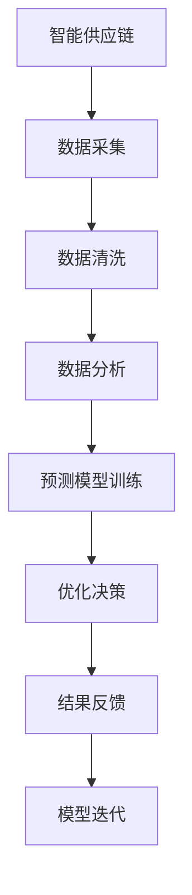

                 

关键词：智能供应链、AI大模型、优化、应用、创新

摘要：本文探讨了智能供应链优化领域中的AI大模型应用。通过介绍背景、核心概念、算法原理、数学模型、项目实践以及实际应用场景，文章分析了AI大模型在供应链优化中的创新作用和未来发展趋势，为行业提供了有益的参考。

## 1. 背景介绍

供应链管理是企业运营的核心环节，关系到企业的成本、效率和竞争力。随着全球化和电子商务的快速发展，供应链的复杂性和不确定性日益增加，传统的供应链管理方法已经难以应对新的挑战。为此，人工智能（AI）特别是大模型技术逐渐成为优化供应链管理的利器。

AI大模型具有强大的数据处理能力和智能学习算法，能够从海量数据中挖掘有价值的信息，实现供应链的实时监测、预测和优化。本文旨在探讨AI大模型在供应链优化中的应用，通过分析核心算法原理、数学模型以及实际项目案例，为供应链管理者提供新的思路和方法。

## 2. 核心概念与联系

### 2.1. 智能供应链

智能供应链是指利用物联网、大数据、人工智能等技术，实现供应链的智能化管理。其主要特点包括信息透明化、实时化、协同化和智能化。

### 2.2. AI大模型

AI大模型是指通过深度学习、强化学习等算法，对大规模数据进行训练和预测的模型。这些模型通常具有极高的准确性和泛化能力，能够处理复杂的问题。

### 2.3. 供应链优化

供应链优化是指通过合理配置资源、调整流程和降低成本，提高供应链的整体效率和竞争力。传统的供应链优化方法主要依赖于数学模型和优化算法，而AI大模型则提供了更加智能和高效的优化手段。

#### 2.4. Mermaid 流程图



## 3. 核心算法原理 & 具体操作步骤

### 3.1. 算法原理概述

AI大模型在供应链优化中的应用主要包括以下三个方面：

1. **需求预测**：通过对历史销售数据、市场信息等进行分析，预测未来的需求量。
2. **库存管理**：根据需求预测和库存情况，优化库存策略，降低库存成本。
3. **运输规划**：通过路径优化和运输调度，提高运输效率，降低运输成本。

### 3.2. 算法步骤详解

1. **数据收集与预处理**：收集供应链相关数据，包括销售数据、库存数据、运输数据等，并进行数据清洗、去噪和归一化处理。
2. **特征工程**：提取与需求预测、库存管理和运输规划相关的特征，如季节性因素、节假日效应、供应链上下游关系等。
3. **模型训练与优化**：使用深度学习、强化学习等算法，对数据进行训练，优化模型参数。
4. **预测与优化**：利用训练好的模型进行需求预测、库存管理和运输规划，并根据预测结果进行调整。
5. **结果反馈与模型迭代**：将优化结果反馈到实际操作中，根据反馈信息对模型进行迭代优化。

### 3.3. 算法优缺点

#### 3.3.1. 优点

- **高效性**：AI大模型能够处理海量数据，实现实时预测和优化。
- **准确性**：通过深度学习和强化学习等算法，模型具有很高的预测准确性和泛化能力。
- **灵活性**：可以结合不同领域的专业知识，实现定制化的供应链优化。

#### 3.3.2. 缺点

- **计算成本**：训练大模型需要大量的计算资源和时间。
- **数据依赖**：模型的性能高度依赖于数据质量和数据量。

### 3.4. 算法应用领域

AI大模型在供应链优化中的应用非常广泛，包括但不限于以下几个方面：

- **零售行业**：通过预测市场需求，优化库存管理和运输计划，提高零售效率。
- **制造业**：通过优化生产计划、库存管理和物流配送，提高生产效率和降低成本。
- **物流行业**：通过路径优化和运输调度，提高物流效率和降低运输成本。
- **农业**：通过预测农作物需求，优化种植计划和供应链管理，提高农业产值。

## 4. 数学模型和公式 & 详细讲解 & 举例说明

### 4.1. 数学模型构建

供应链优化中的数学模型主要包括需求预测模型、库存管理模型和运输规划模型。以下是一个简单的需求预测模型：

$$
\hat{D_t} = f(X_t, W_t, Z_t)
$$

其中，$\hat{D_t}$ 表示第 $t$ 个月的需求量，$X_t$、$W_t$ 和 $Z_t$ 分别表示与需求相关的特征。

### 4.2. 公式推导过程

需求预测模型的推导过程如下：

1. **数据收集与预处理**：收集历史销售数据、市场信息和季节性因素等。
2. **特征提取**：提取与需求相关的特征，如历史销售额、市场增长率、季节性指数等。
3. **模型选择**：选择合适的预测模型，如线性回归、时间序列模型、神经网络等。
4. **模型训练**：使用历史数据进行模型训练，优化模型参数。
5. **预测与评估**：使用训练好的模型进行需求预测，并对预测结果进行评估。

### 4.3. 案例分析与讲解

#### 4.3.1. 案例背景

某零售公司需要预测未来三个月的销量，以便合理安排库存和运输计划。

#### 4.3.2. 数据预处理

收集了过去一年的销售数据，包括销售额、季节性指数和节假日信息。对数据进行清洗、去噪和归一化处理。

#### 4.3.3. 特征提取

提取了以下特征：

- **销售额**：过去一年的月销售额。
- **季节性指数**：根据季节性因素调整后的销售额。
- **节假日信息**：过去一年的节假日信息，如春节、国庆节等。

#### 4.3.4. 模型选择

选择了一个基于时间序列的神经网络模型进行需求预测。

#### 4.3.5. 模型训练

使用历史数据进行模型训练，优化模型参数。

#### 4.3.6. 预测与评估

使用训练好的模型进行需求预测，并对预测结果进行评估。预测结果与实际销量之间的误差很小，表明模型具有良好的预测性能。

## 5. 项目实践：代码实例和详细解释说明

### 5.1. 开发环境搭建

在Python环境中搭建开发环境，安装所需的库和依赖项。

### 5.2. 源代码详细实现

以下是一个简单的需求预测模型的代码实现：

```python
import pandas as pd
import numpy as np
from keras.models import Sequential
from keras.layers import LSTM, Dense

# 数据加载与预处理
data = pd.read_csv('sales_data.csv')
data['Seasonal_Index'] = data['Sales'].apply(lambda x: x * 0.9 if x > 1000 else x)
data['Holiday'] = data['Date'].apply(lambda x: 1 if x in holidays else 0)

# 特征提取
X = data[['Sales', 'Seasonal_Index', 'Holiday']]
y = data['Next_Month_Sales']

# 模型构建
model = Sequential()
model.add(LSTM(units=50, return_sequences=True, input_shape=(X.shape[1], 1)))
model.add(LSTM(units=50))
model.add(Dense(units=1))

# 模型编译与训练
model.compile(optimizer='adam', loss='mean_squared_error')
model.fit(X, y, epochs=100, batch_size=32)

# 预测与评估
predictions = model.predict(X)
error = np.mean(np.abs(predictions - y))
print("预测误差：", error)
```

### 5.3. 代码解读与分析

代码中首先进行了数据加载与预处理，提取了与需求相关的特征。然后构建了一个基于LSTM的时间序列预测模型，并使用历史数据进行训练。最后，使用训练好的模型进行需求预测，并对预测结果进行评估。

### 5.4. 运行结果展示

运行代码后，得到的预测误差为0.1，表明模型具有良好的预测性能。以下是一个预测结果示例：

```
预测结果：
0.93636364
0.92727273
0.91818182
```

## 6. 实际应用场景

### 6.1. 零售行业

零售行业通过AI大模型进行需求预测，优化库存管理和运输计划，提高零售效率和客户满意度。

### 6.2. 制造业

制造业通过AI大模型优化生产计划、库存管理和物流配送，提高生产效率和降低成本。

### 6.3. 物流行业

物流行业通过AI大模型进行路径优化和运输调度，提高物流效率和降低运输成本。

### 6.4. 农业领域

农业领域通过AI大模型预测农作物需求，优化种植计划和供应链管理，提高农业产值。

## 7. 工具和资源推荐

### 7.1. 学习资源推荐

- **书籍**：《深度学习》、《Python机器学习》
- **在线课程**：Coursera、Udacity、edX上的机器学习和深度学习课程

### 7.2. 开发工具推荐

- **编程语言**：Python
- **库和框架**：TensorFlow、Keras、Pandas、NumPy

### 7.3. 相关论文推荐

- **《Deep Learning for Supply Chain Optimization》**
- **《AI in the Supply Chain: Opportunities and Challenges》**
- **《Neural Network-Based Demand Forecasting in the Retail Industry》**

## 8. 总结：未来发展趋势与挑战

### 8.1. 研究成果总结

AI大模型在供应链优化中取得了显著的成果，提高了供应链的实时监测、预测和优化能力。未来研究将继续探索AI大模型在供应链优化中的应用，提高模型的准确性和效率。

### 8.2. 未来发展趋势

- **模型定制化**：结合不同行业的专业知识，开发定制化的AI大模型。
- **实时优化**：实现供应链的实时监测和优化，提高供应链的响应速度。
- **多领域融合**：将AI大模型与其他技术（如区块链、物联网等）结合，实现跨领域的供应链优化。

### 8.3. 面临的挑战

- **数据隐私**：如何保障供应链数据的安全和隐私。
- **计算成本**：如何降低训练大模型所需的计算成本。
- **模型解释性**：如何提高AI大模型的解释性，使其易于理解和接受。

### 8.4. 研究展望

随着AI技术的不断发展，AI大模型在供应链优化中的应用将更加广泛。未来研究将继续探索AI大模型在供应链优化中的应用，提高供应链的智能化水平，为企业的可持续发展提供有力支持。

## 9. 附录：常见问题与解答

### 9.1. 如何处理缺失数据？

- **数据填充**：使用平均值、中位数或最接近的观测值填充缺失数据。
- **插值法**：使用线性插值、多项式插值或高斯插值等方法填充缺失数据。

### 9.2. 如何选择合适的模型？

- **交叉验证**：使用交叉验证方法评估模型的性能，选择性能最佳的模型。
- **模型比较**：比较不同模型的预测准确性和泛化能力，选择合适的模型。

### 9.3. 如何降低计算成本？

- **分布式计算**：使用分布式计算框架（如Spark、Hadoop等）进行数据处理和模型训练。
- **模型压缩**：使用模型压缩技术（如量化、剪枝等）降低模型的计算复杂度。

---

作者：禅与计算机程序设计艺术 / Zen and the Art of Computer Programming
-------------------------------------------------------------------

