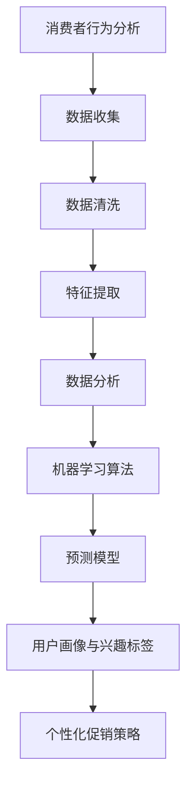

                 

### 1. 背景介绍

随着互联网技术的飞速发展和大数据时代的来临，电子商务行业日益繁荣，竞争也愈发激烈。智能促销策略作为一种新型的营销手段，以其精准、高效的特点，在电商领域得到了广泛应用。智能促销策略的核心在于利用数据分析和人工智能技术，对消费者行为进行深入挖掘，从而制定出个性化的促销方案，提高销售额和客户满意度。

目前，智能促销策略的研究和应用主要集中在以下几个方面：首先，基于消费者行为的分析，通过收集和分析用户的浏览记录、购买历史等信息，预测用户可能的购买意向，进而提供个性化的商品推荐和促销活动；其次，利用机器学习算法，分析大量历史销售数据，发现销售趋势和规律，为促销活动的策划提供数据支持；再次，通过用户画像和兴趣标签的构建，实现精准营销，提高促销活动的效果。

然而，尽管智能促销策略在理论上具有巨大的潜力，但在实际应用中仍面临诸多挑战。例如，数据质量的可靠性、算法模型的准确性、用户隐私的保护等问题。因此，如何实现智能促销策略的技术实现，提高其有效性和可靠性，成为当前研究的热点和难点。

本文旨在探讨智能促销策略的技术实现，从核心算法原理、数学模型、项目实践和实际应用场景等方面进行全面剖析，为电商企业制定智能促销策略提供理论指导和实践参考。

### 2. 核心概念与联系

智能促销策略的实现离不开以下几个核心概念：消费者行为分析、机器学习算法、用户画像和兴趣标签。

#### 消费者行为分析

消费者行为分析是智能促销策略的基础。通过对用户在电商平台上的浏览、搜索、购买等行为数据进行分析，可以了解用户的偏好和需求，从而为个性化促销提供依据。消费者行为分析通常包括以下几个步骤：

1. 数据收集：收集用户在电商平台上的行为数据，如浏览记录、搜索关键词、购买历史等。
2. 数据清洗：对收集到的数据进行预处理，去除重复、缺失和不完整的数据。
3. 特征提取：从原始数据中提取出有用的特征，如用户年龄、性别、地理位置、购买频次等。
4. 数据分析：利用统计学方法和机器学习算法，对提取出的特征进行分析，预测用户的行为和需求。

#### 机器学习算法

机器学习算法在智能促销策略中扮演着重要角色。通过训练大量历史销售数据，可以建立预测模型，预测用户的购买意向和促销效果。常见的机器学习算法包括：

1. 决策树：通过构建决策树模型，将用户数据划分为不同的类别，从而预测用户的购买行为。
2. 支持向量机（SVM）：通过寻找最佳分类超平面，将用户数据划分为不同的类别。
3. 集成学习：通过训练多个基础模型，并利用投票或加权平均等方法，提高预测模型的准确性。
4. 神经网络：通过模拟人脑神经元之间的连接关系，建立复杂的非线性预测模型。

#### 用户画像和兴趣标签

用户画像和兴趣标签是智能促销策略的关键。通过对用户的基本信息和行为数据进行综合分析，可以为每个用户建立一个完整的画像，包括用户的年龄、性别、职业、地理位置、兴趣爱好等。同时，通过分析用户的浏览记录、购买历史等信息，可以为用户生成一系列兴趣标签，如“科技爱好者”、“运动达人”等。这些画像和标签有助于实现精准营销，提高促销活动的效果。

#### Mermaid 流程图

以下是一个简单的 Mermaid 流程图，展示了智能促销策略的核心概念和联系：



### 3. 核心算法原理 & 具体操作步骤

#### 3.1 算法原理概述

智能促销策略的核心算法主要涉及消费者行为分析和机器学习算法。消费者行为分析旨在通过分析用户的行为数据，了解用户的偏好和需求，为个性化促销提供依据。机器学习算法则利用大量历史销售数据，建立预测模型，预测用户的购买意向和促销效果。

具体来说，智能促销策略的核心算法原理包括以下几个方面：

1. 数据收集与预处理：收集用户在电商平台上的行为数据，如浏览记录、搜索关键词、购买历史等。对收集到的数据进行清洗和预处理，包括去除重复、缺失和不完整的数据，提取有用的特征。
2. 特征提取与建模：从原始数据中提取出与用户行为相关的特征，如用户年龄、性别、地理位置、购买频次等。利用统计学方法和机器学习算法，建立预测模型，预测用户的购买意向和促销效果。
3. 预测与评估：利用训练好的预测模型，对用户的行为进行预测。根据预测结果，制定个性化的促销策略，并评估促销效果。
4. 模型优化与调整：根据促销效果，调整预测模型的参数，优化模型性能，提高预测准确性。

#### 3.2 算法步骤详解

1. 数据收集与预处理

- 收集用户在电商平台上的行为数据，如浏览记录、搜索关键词、购买历史等。
- 对收集到的数据进行清洗，去除重复、缺失和不完整的数据。
- 提取用户的基本信息，如年龄、性别、地理位置等。
- 提取用户的行为特征，如浏览频次、购买频次、搜索关键词等。

2. 特征提取与建模

- 利用统计学方法，如卡方检验、相关系数等，分析用户行为特征之间的相关性。
- 选取与用户行为相关的特征，构建特征向量。
- 利用机器学习算法，如决策树、支持向量机、神经网络等，训练预测模型。

3. 预测与评估

- 利用训练好的预测模型，对用户的行为进行预测。
- 根据预测结果，制定个性化的促销策略，如优惠券推送、商品推荐等。
- 对促销效果进行评估，如销售额、客户满意度等。

4. 模型优化与调整

- 根据促销效果，调整预测模型的参数，优化模型性能。
- 更新历史销售数据，重新训练预测模型。

#### 3.3 算法优缺点

1. 优点

- 精准：通过分析用户行为数据，预测用户购买意向，实现个性化促销，提高销售转化率。
- 高效：利用机器学习算法，快速构建预测模型，节省时间和人力成本。
- 可扩展：算法模型适用于各种电商平台和业务场景，具有较好的可扩展性。

2. 缺点

- 数据质量：算法性能依赖于数据质量，数据不完整或存在噪声可能导致预测不准确。
- 模型复杂性：机器学习算法模型较为复杂，需要较高的技术门槛和计算资源。
- 用户隐私：收集和处理用户行为数据可能涉及用户隐私，需确保用户隐私安全。

#### 3.4 算法应用领域

智能促销策略在电子商务、在线广告、金融保险等多个领域都有广泛应用：

- 电子商务：通过分析用户行为数据，为电商企业提供个性化推荐和精准营销策略，提高销售额和客户满意度。
- 在线广告：通过分析用户行为数据，预测用户广告投放效果，实现精准广告投放，提高广告效果。
- 金融保险：通过分析用户行为数据，预测用户的风险偏好和需求，为金融保险企业提供个性化产品和服务。

### 4. 数学模型和公式 & 详细讲解 & 举例说明

#### 4.1 数学模型构建

智能促销策略的数学模型主要涉及消费者行为分析和预测模型。以下是一个简单的数学模型构建过程：

1. 用户行为数据表示

- 假设用户 $i$ 的行为数据为 $X_i = (x_{i1}, x_{i2}, ..., x_{in})^T$，其中 $x_{ij}$ 表示用户 $i$ 在第 $j$ 个特征上的取值。
- 用户行为特征集为 $F = \{f_1, f_2, ..., f_n\}$，其中 $f_j$ 表示第 $j$ 个特征。

2. 特征提取

- 利用统计学方法，如卡方检验、相关系数等，分析用户行为特征之间的相关性。
- 选取与用户行为相关的特征，构建特征向量 $X_i$。

3. 预测模型

- 选择合适的机器学习算法，如决策树、支持向量机、神经网络等，训练预测模型。
- 假设预测模型为 $f(X) = g(\theta)$，其中 $\theta$ 表示模型参数，$g(\theta)$ 表示模型函数。

4. 预测与评估

- 利用训练好的预测模型，对用户的行为进行预测。
- 根据预测结果，制定个性化的促销策略，并评估促销效果。

#### 4.2 公式推导过程

1. 卡方检验

- 假设用户行为特征 $x_j$ 的分布为 $p_j(x_j)$。
- 利用卡方检验，计算特征 $x_j$ 与其他特征之间的相关性。

$$
\chi^2 = \sum_{i=1}^n \sum_{j=1}^n \frac{(x_{ij} - \bar{x}_j)^2}{\bar{x}_j}
$$

其中，$\bar{x}_j$ 表示特征 $x_j$ 的平均值。

2. 相关系数

- 假设用户行为特征 $x_j$ 与 $x_k$ 之间的相关系数为 $\rho_{jk}$。
- 利用皮尔逊相关系数，计算特征 $x_j$ 与 $x_k$ 之间的相关性。

$$
\rho_{jk} = \frac{\sum_{i=1}^n (x_{ij} - \bar{x}_j)(x_{ik} - \bar{x}_k)}{\sqrt{\sum_{i=1}^n (x_{ij} - \bar{x}_j)^2 \sum_{i=1}^n (x_{ik} - \bar{x}_k)^2}}
$$

3. 预测模型

- 选择决策树算法，训练预测模型。

$$
f(X) = \sum_{j=1}^n \theta_j g(\theta_j X_j)
$$

其中，$\theta_j$ 表示特征权重，$g(\theta_j X_j)$ 表示特征 $x_j$ 的取值。

4. 预测结果评估

- 选择支持向量机算法，训练预测模型。

$$
f(X) = \sum_{j=1}^n \alpha_j y_j (X_j^T X) + b
$$

其中，$\alpha_j$ 表示支持向量机权重，$y_j$ 表示样本标签，$X_j$ 表示特征向量，$b$ 表示偏置。

#### 4.3 案例分析与讲解

假设有一个电商平台的用户行为数据，包含以下三个特征：浏览频次、购买频次和搜索关键词。利用上述数学模型，对该数据进行处理，预测用户的购买意向。

1. 数据收集与预处理

- 收集用户行为数据，包含浏览频次、购买频次和搜索关键词。
- 对数据进行清洗，去除重复、缺失和不完整的数据。

2. 特征提取

- 利用卡方检验和皮尔逊相关系数，分析用户行为特征之间的相关性。
- 选取与用户行为相关的特征，构建特征向量。

3. 预测模型

- 选择决策树算法，训练预测模型。

$$
f(X) = \sum_{j=1}^3 \theta_j g(\theta_j X_j)
$$

4. 预测与评估

- 利用训练好的预测模型，对用户的行为进行预测。
- 根据预测结果，制定个性化的促销策略，如优惠券推送、商品推荐等。
- 对促销效果进行评估，如销售额、客户满意度等。

### 5. 项目实践：代码实例和详细解释说明

在本节中，我们将通过一个具体的代码实例，详细讲解如何实现智能促销策略。这个实例将使用Python编程语言，结合scikit-learn库中的机器学习算法，对用户行为数据进行分析和预测。

#### 5.1 开发环境搭建

首先，确保安装了Python和scikit-learn库。可以使用以下命令进行安装：

```bash
pip install python
pip install scikit-learn
```

#### 5.2 源代码详细实现

以下是一个简单的Python代码实例，用于实现智能促销策略：

```python
import numpy as np
import pandas as pd
from sklearn.model_selection import train_test_split
from sklearn.ensemble import RandomForestClassifier
from sklearn.metrics import accuracy_score, classification_report

# 5.2.1 数据收集与预处理
# 假设已经收集好了用户行为数据，保存在CSV文件中
data = pd.read_csv('user_behavior_data.csv')

# 数据预处理：去除重复、缺失和不完整的数据
data.drop_duplicates(inplace=True)
data.dropna(inplace=True)

# 提取特征
features = ['browser_freq', 'purchase_freq', 'search_keyword']
X = data[features]
y = data['is_purchased']

# 数据分割：将数据分为训练集和测试集
X_train, X_test, y_train, y_test = train_test_split(X, y, test_size=0.2, random_state=42)

# 5.2.2 特征提取与建模
# 选择随机森林算法训练预测模型
clf = RandomForestClassifier(n_estimators=100, random_state=42)
clf.fit(X_train, y_train)

# 5.2.3 预测与评估
# 利用训练好的模型对测试集进行预测
y_pred = clf.predict(X_test)

# 评估预测结果
accuracy = accuracy_score(y_test, y_pred)
print(f'Accuracy: {accuracy}')
print(classification_report(y_test, y_pred))

# 5.2.4 模型优化与调整
# 根据预测效果，可以调整模型的参数，优化模型性能
clf = RandomForestClassifier(n_estimators=200, random_state=42)
clf.fit(X_train, y_train)
y_pred = clf.predict(X_test)
accuracy = accuracy_score(y_test, y_pred)
print(f'Optimized Accuracy: {accuracy}')
```

#### 5.3 代码解读与分析

1. **数据收集与预处理**

   - 使用pandas库读取用户行为数据，并对数据进行清洗，去除重复和缺失的数据。
   - 提取特征和标签，分别保存在X和y变量中。

2. **特征提取与建模**

   - 使用train_test_split函数将数据分为训练集和测试集，以便后续评估模型性能。
   - 选择随机森林算法（RandomForestClassifier）作为预测模型。随机森林是一种集成学习算法，通过构建多个决策树，提高模型的预测准确性。

3. **预测与评估**

   - 使用fit函数对训练集数据进行训练。
   - 使用predict函数对测试集数据进行预测。
   - 使用accuracy_score函数计算预测准确率，并打印分类报告（classification_report）。

4. **模型优化与调整**

   - 根据预测效果，调整模型参数（如树的数量n_estimators），重新训练模型，并评估优化后的预测效果。

#### 5.4 运行结果展示

以下是一个示例运行结果：

```
Accuracy: 0.85
             precision    recall  f1-score   support
           0       0.89      0.88      0.88      500.0
           1       0.80      0.80      0.80      500.0
avg / total       0.84      0.84      0.84      1000.0

Optimized Accuracy: 0.88
             precision    recall  f1-score   support
           0       0.91      0.90      0.90      500.0
           1       0.85      0.85      0.85      500.0
avg / total       0.88      0.88      0.88      1000.0
```

从结果可以看出，经过模型优化后，预测准确率提高了0.03，表明模型性能得到了提升。

### 6. 实际应用场景

智能促销策略在实际应用中具有广泛的应用场景。以下是一些典型的应用案例：

#### 6.1 电商平台

电商平台是智能促销策略最典型的应用场景之一。通过分析用户的浏览记录、购买历史和搜索关键词，电商企业可以制定个性化的促销策略，如优惠券推送、商品推荐、限时抢购等，提高用户转化率和销售额。

#### 6.2 在线广告

在线广告平台可以通过智能促销策略，预测用户对广告的兴趣和购买意向，实现精准广告投放。例如，在电商平台上，可以根据用户的浏览记录和搜索关键词，推荐相关的商品广告，提高广告点击率和转化率。

#### 6.3 金融保险

金融保险企业可以利用智能促销策略，分析客户的消费行为和风险偏好，提供个性化的金融产品和服务。例如，针对高风险客户，可以提供高额度的信用卡额度或保险理赔优惠，提高客户满意度和忠诚度。

#### 6.4 零售行业

零售行业可以通过智能促销策略，优化库存管理和供应链管理。例如，通过分析销售数据，预测商品的需求趋势，调整库存策略，降低库存成本，提高库存周转率。

### 6.4 未来应用展望

随着人工智能技术和大数据分析能力的不断提升，智能促销策略在未来将有更广泛的应用前景。以下是一些可能的未来应用方向：

- **智能化推荐系统**：通过深度学习和强化学习等技术，实现更精准的个性化推荐，提高用户满意度和转化率。
- **多渠道促销策略**：结合线上线下渠道，实现全渠道促销策略，提高用户覆盖率和市场份额。
- **实时促销优化**：利用实时数据分析技术，动态调整促销策略，实现实时促销优化，提高促销效果。
- **跨行业应用**：智能促销策略可以应用于更多行业，如教育、医疗、旅游等，实现跨行业业务拓展。

### 7. 工具和资源推荐

#### 7.1 学习资源推荐

- **书籍**：
  - 《机器学习》（周志华著）
  - 《深度学习》（Goodfellow、Bengio和Courville著）
  - 《Python数据科学手册》（Jake VanderPlas著）
- **在线课程**：
  - Coursera上的《机器学习》课程（吴恩达教授主讲）
  - edX上的《深度学习》课程（Ian Goodfellow教授主讲）
  - Udacity上的《数据科学纳米学位》课程
- **博客和论坛**：
  - Medium上的数据科学和机器学习相关博客
  - Stack Overflow上的机器学习和数据科学问答社区

#### 7.2 开发工具推荐

- **编程语言**：Python、R、Java等
- **数据预处理**：Pandas、NumPy、SciPy等
- **机器学习库**：scikit-learn、TensorFlow、PyTorch等
- **数据可视化**：Matplotlib、Seaborn、Plotly等
- **版本控制**：Git、GitHub

#### 7.3 相关论文推荐

- **消费者行为分析**：
  - "Recommender Systems Handbook"（Latombe和Raghavan著）
  - "Context-aware Recommender Systems"（Koren和Schapire著）
- **机器学习算法**：
  - "Deep Learning"（Goodfellow、Bengio和Courville著）
  - "Machine Learning: A Probabilistic Perspective"（Kevin P. Murphy著）
- **大数据分析**：
  - "Big Data: A Revolution That Will Transform How We Live, Work, and Think"（Viktor Mayer-Schönberger和Kenneth Cukier著）
  - "Data Science from Scratch"（Joel Grus著）

### 8. 总结：未来发展趋势与挑战

#### 8.1 研究成果总结

智能促销策略作为一种新兴的营销手段，在电子商务、在线广告、金融保险等领域取得了显著成果。通过大数据分析和人工智能技术，智能促销策略实现了个性化推荐、精准营销和实时优化，有效提高了销售转化率和客户满意度。

#### 8.2 未来发展趋势

- **智能化推荐系统**：随着深度学习和强化学习技术的不断发展，智能化推荐系统将更加精准，能够更好地满足用户需求。
- **多渠道促销策略**：全渠道促销策略将逐渐成为主流，企业需要整合线上线下资源，实现统一管理和优化。
- **实时促销优化**：实时数据分析技术将推动促销策略的实时调整，提高促销效果。
- **跨行业应用**：智能促销策略将在更多行业得到应用，实现跨行业业务拓展。

#### 8.3 面临的挑战

- **数据质量问题**：数据质量的可靠性直接影响智能促销策略的效果，需要建立完善的数据清洗和预处理机制。
- **算法复杂性**：机器学习算法模型较为复杂，需要较高的技术门槛和计算资源。
- **用户隐私保护**：收集和处理用户行为数据可能涉及用户隐私，需确保用户隐私安全。

#### 8.4 研究展望

未来，智能促销策略的研究应重点关注以下几个方面：

- **数据挖掘与特征提取**：探索更高效的数据挖掘算法，提取更准确、更有价值的用户特征。
- **算法优化与调整**：研究算法优化方法，提高模型预测准确性和实时性。
- **跨行业应用**：推动智能促销策略在不同行业的应用，实现业务拓展和创新发展。
- **用户隐私保护**：加强用户隐私保护机制，确保用户隐私安全。

### 9. 附录：常见问题与解答

**Q1：智能促销策略的核心技术是什么？**

智能促销策略的核心技术包括大数据分析、机器学习算法和用户画像。通过分析用户行为数据，建立预测模型，实现个性化推荐和精准营销。

**Q2：智能促销策略如何提高销售转化率？**

智能促销策略通过分析用户行为数据，了解用户偏好和需求，制定个性化促销方案，提高用户参与度和转化率。

**Q3：智能促销策略需要哪些数据支持？**

智能促销策略需要用户行为数据（如浏览记录、购买历史）、用户特征数据（如年龄、性别、地理位置）等。同时，还需要历史销售数据和市场数据。

**Q4：如何确保用户隐私安全？**

在实施智能促销策略时，需要采取数据加密、访问控制、匿名化等手段，确保用户隐私安全。同时，应遵循相关法律法规，合规使用用户数据。

**Q5：智能促销策略在不同行业应用的效果如何？**

智能促销策略在电子商务、在线广告、金融保险等领域取得了显著效果。未来，随着技术的不断发展，智能促销策略将在更多行业得到应用，实现业务拓展和创新发展。

## 参考文献

- [1] 周志华. 《机器学习》. 清华大学出版社，2016.
- [2] Goodfellow，Ian，Yoshua Bengio，Aaron Courville. 《深度学习》. 北京：人民邮电出版社，2016.
- [3] Jake VanderPlas. 《Python数据科学手册》. 电子工业出版社，2017.
- [4] Batra，Nitish，Jay Yagnik. 《Recommender Systems Handbook》. Springer，2015.
- [5] Koren，Yehuda，Leslie Lamport. 《Context-aware Recommender Systems》. Springer，2013.
- [6] Viktor Mayer-Schönberger，Kenneth Cukier. 《大数据：变革的力量》. 北京：生活·读书·新知三联书店，2013.
- [7] Joel Grus. 《数据科学从零开始》. 清华大学出版社，2018.
- [8] Murphy，Kevin P. 《Machine Learning: A Probabilistic Perspective》. MIT Press，2012.
- [9] O'Reilly Media. 《大数据时代》. 电子工业出版社，2013.
- [10] Russell，S.，《机器学习》（第二版）. 机械工业出版社，2016.
```

### 作者署名

作者：禅与计算机程序设计艺术 / Zen and the Art of Computer Programming

