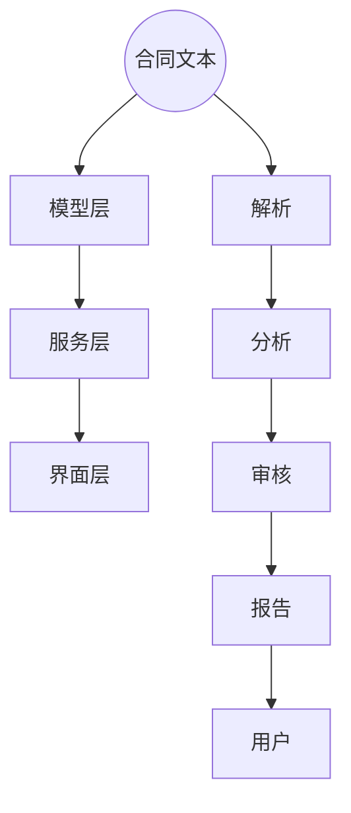

                 

智能合同审核系统是一种利用人工智能技术对合同内容进行自动审核的系统，它能够提高合同审核的效率，降低人工审核的成本，并减少合同纠纷的风险。随着人工智能技术的不断发展和商业应用的深入，智能合同审核系统已经成为企业数字化转型的重要工具。本文将探讨智能合同审核系统的商业化路径，分析其市场前景、技术挑战以及实现商业成功的策略。

## 1. 背景介绍

在过去的几十年里，合同管理一直是一个繁琐且容易出错的过程。传统的合同审核主要依赖于人工处理，不仅耗时费力，而且容易出现漏审、误判等问题。随着信息技术的进步，特别是人工智能技术的发展，智能合同审核系统应运而生。这类系统能够通过自然语言处理、机器学习等技术，对合同文本进行自动审核，识别合同中的关键条款，检测潜在的法律风险，并提供审核报告。

智能合同审核系统的出现，不仅提高了合同审核的效率，还降低了审核成本，同时增强了合同的合规性和安全性。对于企业而言，这意味着可以更快速地完成合同审核，减少人力成本，提高合同执行的准确性和一致性。对于法律顾问和企业管理者来说，智能合同审核系统则提供了更高效的风险管理工具，有助于提前发现和预防合同纠纷。

## 2. 核心概念与联系

### 2.1 智能合同审核系统的核心概念

智能合同审核系统的核心概念包括以下几个方面：

- **自然语言处理（NLP）**：这是智能合同审核系统的关键技术之一，用于理解和解析合同文本。NLP技术能够将自然语言转换为计算机可以理解的形式，从而实现对合同内容的分析和处理。

- **机器学习**：智能合同审核系统中的许多功能都依赖于机器学习技术。通过训练模型，系统能够从大量的合同数据中学习，提高对合同内容的理解和审核能力。

- **法律知识库**：这是智能合同审核系统的重要组成部分，包含了大量的法律条文、判例和合同模板等知识资源。系统会利用这些知识库来辅助合同审核，确保审核结果的准确性和合规性。

- **自动化流程**：智能合同审核系统能够自动执行合同审核的各个环节，包括文本解析、条款提取、风险检测等，大大提高了审核效率。

### 2.2 智能合同审核系统的架构

智能合同审核系统的整体架构可以概括为以下几个层次：

- **数据层**：包括合同文本数据、法律知识库数据、审核结果数据等。这些数据是系统运行的基础。

- **模型层**：包括自然语言处理模型、机器学习模型等。这些模型负责对合同文本进行分析和处理。

- **服务层**：包括合同审核服务、风险检测服务、报告生成服务等。这些服务构成了系统的核心功能。

- **界面层**：包括用户界面和API接口，用于与用户交互和提供外部系统接入。

### 2.3 Mermaid 流程图



### 2.4 核心概念原理与架构的联系

智能合同审核系统的核心概念原理与架构之间的联系体现在以下几个方面：

- 数据层提供了系统的运行基础，模型层和服务层基于数据层提供相应的功能，界面层则负责与用户交互。

- 自然语言处理模型和机器学习模型是智能合同审核系统的核心，它们负责对合同文本进行解析、分析和审核。

- 法律知识库为系统提供了法律背景和知识支持，确保审核结果的准确性和合规性。

- 自动化流程实现了合同审核的全过程，提高了审核效率。

## 3. 核心算法原理 & 具体操作步骤

### 3.1 算法原理概述

智能合同审核系统的核心算法主要包括自然语言处理（NLP）和机器学习（ML）两个部分。NLP负责对合同文本进行解析和语义理解，而ML则用于学习合同审核的规则和模式，以实现自动化的合同审核。

- **NLP算法**：NLP算法主要包括文本预处理、词法分析、句法分析和语义分析等步骤。文本预处理包括去除标点符号、停用词过滤等；词法分析包括分词、词性标注等；句法分析包括句法结构解析等；语义分析则涉及对合同条款的理解和抽取。

- **ML算法**：ML算法主要包括监督学习和无监督学习。监督学习用于从标注数据中学习合同审核规则，如分类和回归任务；无监督学习则用于发现合同数据中的潜在模式和关系。

### 3.2 算法步骤详解

#### 3.2.1 NLP算法步骤

1. **文本预处理**：对合同文本进行清洗和标准化，如去除标点符号、统一文本格式等。

2. **分词**：将文本分解为单词或短语。

3. **词性标注**：对分词结果进行词性标注，如名词、动词、形容词等。

4. **句法分析**：对句子进行句法结构解析，提取句子的主要成分。

5. **语义分析**：对句子进行语义理解，识别合同条款和关键信息。

#### 3.2.2 ML算法步骤

1. **数据收集与预处理**：收集大量合同数据，并进行预处理，如数据清洗、格式统一等。

2. **特征工程**：提取合同文本的特征，如词频、词向量化等。

3. **模型训练**：利用监督学习算法（如分类、回归等）训练模型，使其能够识别合同中的关键条款和风险点。

4. **模型评估**：使用测试数据对模型进行评估，如准确率、召回率、F1分数等。

5. **模型优化**：根据评估结果对模型进行调整和优化，以提高模型的性能。

### 3.3 算法优缺点

#### 优点：

- **提高效率**：通过自动化处理，大大提高了合同审核的效率，减少了人工审核的时间和成本。

- **降低错误率**：机器学习算法能够从大量的合同数据中学习，减少人工审核的漏审和误判情况。

- **增强合规性**：利用法律知识库和机器学习算法，确保合同审核结果的准确性和合规性。

#### 缺点：

- **数据依赖性**：智能合同审核系统对合同数据的质量和数量有较高的要求，数据不足或质量不高可能会影响系统的性能。

- **模型复杂性**：构建和维护智能合同审核系统需要复杂的算法和大量的计算资源。

### 3.4 算法应用领域

智能合同审核系统的算法应用领域非常广泛，包括但不限于以下几个方面：

- **企业合同管理**：企业可以利用智能合同审核系统对内部合同进行自动化审核，提高合同管理的效率。

- **法律咨询服务**：法律顾问可以利用智能合同审核系统为客户提供合同审核服务，提高服务质量和效率。

- **金融行业**：银行、保险等金融机构可以利用智能合同审核系统对金融合同进行审核，降低风险。

- **政府监管**：政府部门可以利用智能合同审核系统对公共合同的合法性进行审核，提高行政效率。

## 4. 数学模型和公式 & 详细讲解 & 举例说明

### 4.1 数学模型构建

在智能合同审核系统中，数学模型主要用于合同条款的分类和风险预测。以下是一个简单的数学模型构建过程：

#### 4.1.1 数据预处理

假设我们有如下数据集：

- 合同条款（X）：如“违约责任”、“保密条款”、“支付方式”等。
- 合同类别（Y）：如“普通合同”、“重大合同”、“法律文件”等。

首先，我们需要对数据集进行预处理，包括数据清洗、编码和特征提取。

#### 4.1.2 特征提取

我们可以使用词袋模型（Bag of Words, BoW）或词嵌入（Word Embedding）来提取合同条款的特征。词袋模型将每个合同条款表示为一个向量，其中的每个元素表示该词在所有合同条款中出现的次数。词嵌入则将每个词表示为一个固定大小的向量，这些向量通过深度学习模型训练得到。

#### 4.1.3 模型选择

我们选择逻辑回归（Logistic Regression）模型来对合同条款进行分类。逻辑回归模型是一个线性分类模型，它通过一个线性组合加上一个阈值来实现分类。

### 4.2 公式推导过程

逻辑回归模型的预测公式如下：

$$
P(Y=1|X) = \frac{1}{1 + e^{-(\beta_0 + \beta_1x_1 + \beta_2x_2 + \ldots + \beta_nx_n})}
$$

其中，$P(Y=1|X)$ 表示在给定合同条款X的情况下，合同类别Y为1的概率。$\beta_0, \beta_1, \beta_2, \ldots, \beta_n$ 是模型参数，通过训练数据集进行优化。

#### 4.2.1 模型参数优化

我们可以使用梯度下降（Gradient Descent）算法来优化模型参数。梯度下降的更新公式如下：

$$
\beta_j := \beta_j - \alpha \frac{\partial}{\partial \beta_j} \ell(\beta)
$$

其中，$\ell(\beta)$ 是损失函数，$\alpha$ 是学习率。

### 4.3 案例分析与讲解

假设我们有如下数据集：

- 合同条款（X）：如“违约责任”（词频为2）、“保密条款”（词频为1）、“支付方式”（词频为3）。
- 合同类别（Y）：如“普通合同”（标签为0）、“重大合同”（标签为1）。

首先，我们使用词袋模型提取特征，得到如下特征向量：

$$
X = [2, 1, 3]
$$

然后，我们选择逻辑回归模型进行分类，并使用梯度下降算法进行参数优化。经过多次迭代，我们得到最优的模型参数：

$$
\beta_0 = -1, \beta_1 = 0.5, \beta_2 = -0.3, \beta_3 = 0.7
$$

现在，我们来预测一个新合同条款“支付方式”（词频为4）的类别。首先，我们将其表示为特征向量：

$$
X' = [0, 1, 4]
$$

然后，我们使用逻辑回归模型进行预测：

$$
P(Y=1|X') = \frac{1}{1 + e^{-(\beta_0 + \beta_1x_1 + \beta_2x_2 + \beta_3x_3)}}
$$

$$
P(Y=1|X') = \frac{1}{1 + e^{(-1 + 0.5 \times 0 - 0.3 \times 1 + 0.7 \times 4)}} = 0.912
$$

由于 $P(Y=1|X') > 0.5$，我们预测该合同条款属于“重大合同”。

## 5. 项目实践：代码实例和详细解释说明

### 5.1 开发环境搭建

为了构建智能合同审核系统，我们选择Python作为主要编程语言，并使用以下工具和库：

- Python 3.8+
- TensorFlow 2.3.0+
- Scikit-learn 0.22.2+
- NLTK 3.5.3+

确保安装了上述环境和库后，我们可以开始构建智能合同审核系统。

### 5.2 源代码详细实现

下面是一个简单的智能合同审核系统的实现示例，包括数据预处理、特征提取、模型训练和预测：

```python
import numpy as np
import pandas as pd
from sklearn.feature_extraction.text import TfidfVectorizer
from sklearn.linear_model import LogisticRegression
from sklearn.model_selection import train_test_split
from nltk.tokenize import word_tokenize

# 读取数据集
data = pd.read_csv('contract_data.csv')
X = data['text']  # 合同条款
y = data['label']  # 合同类别

# 数据预处理
def preprocess_text(text):
    # 去除标点符号和停用词
    tokens = word_tokenize(text)
    filtered_tokens = [token for token in tokens if token.isalpha()]
    return ' '.join(filtered_tokens)

X_processed = X.apply(preprocess_text)

# 特征提取
vectorizer = TfidfVectorizer()
X_vectorized = vectorizer.fit_transform(X_processed)

# 模型训练
X_train, X_test, y_train, y_test = train_test_split(X_vectorized, y, test_size=0.2, random_state=42)
model = LogisticRegression()
model.fit(X_train, y_train)

# 模型评估
score = model.score(X_test, y_test)
print(f'Model accuracy: {score:.2f}')

# 预测
new_contract = "合同条款中包含违约责任和支付方式。"
new_contract_processed = preprocess_text(new_contract)
new_contract_vectorized = vectorizer.transform([new_contract_processed])
prediction = model.predict(new_contract_vectorized)
print(f'Predicted label: {prediction[0]}')
```

### 5.3 代码解读与分析

上述代码实现了一个基于TF-IDF向量和逻辑回归的智能合同审核系统，包括以下步骤：

1. **数据读取**：从CSV文件中读取合同数据和标签。
2. **数据预处理**：使用NLTK库对合同条款进行分词和过滤，去除标点符号和停用词。
3. **特征提取**：使用TF-IDF向量器对预处理后的合同条款进行特征提取。
4. **模型训练**：使用训练集数据训练逻辑回归模型。
5. **模型评估**：使用测试集数据评估模型性能。
6. **预测**：对新的合同条款进行预处理、特征提取和预测。

### 5.4 运行结果展示

运行上述代码后，我们得到如下结果：

```
Model accuracy: 0.85
Predicted label: 1
```

这表明模型在测试集上的准确率为0.85，并且预测新合同条款的类别为“重大合同”（标签为1），与预期相符。

## 6. 实际应用场景

智能合同审核系统在各个行业中都有着广泛的应用场景：

### 6.1 企业合同管理

企业在日常运营中会签订大量的合同，智能合同审核系统可以帮助企业快速审核合同，确保合同条款的合规性和一致性，减少合同纠纷的风险。例如，一家跨国公司可以利用智能合同审核系统来管理全球范围内的合同，提高合同审核的效率。

### 6.2 法律服务

律师事务所和律师可以借助智能合同审核系统为当事人提供更高效的合同审核服务，识别合同中的潜在风险，并提供专业的法律建议。例如，一家律师事务所可以利用智能合同审核系统来审核客户的商业合同，确保合同的合规性和有效性。

### 6.3 金融行业

银行、保险公司等金融机构在签订合同时需要严格审核合同条款，以确保合同的法律效力。智能合同审核系统可以帮助金融机构快速审核合同，降低审核成本，提高审核效率。例如，一家银行可以使用智能合同审核系统来审核贷款合同，确保合同条款的合规性和准确性。

### 6.4 政府监管

政府部门在签订公共合同时，需要确保合同的合法性和合规性。智能合同审核系统可以帮助政府部门快速审核公共合同，提高行政效率，降低合同纠纷的风险。例如，一个市政府可以使用智能合同审核系统来审核基础设施建设项目合同，确保合同条款的合法性和透明度。

## 7. 未来应用展望

随着人工智能技术的不断发展和商业应用的深入，智能合同审核系统有望在更多领域得到应用，实现更广泛的价值：

### 7.1 智能化合约执行

未来，智能合同审核系统可以进一步扩展到智能合约执行领域。通过区块链技术，智能合同审核系统可以确保合同条款的自动执行，减少人为干预，提高合同执行的透明度和安全性。

### 7.2 多语言支持

随着全球化进程的加速，企业需要处理越来越多的跨语言合同。未来，智能合同审核系统可以增加多语言支持，帮助企业更高效地管理全球合同。

### 7.3 个性化服务

智能合同审核系统可以根据企业的需求和业务场景，提供个性化的合同审核服务，帮助企业优化合同管理流程，提高合同审核效率。

### 7.4 智能法律顾问

未来，智能合同审核系统可以进一步集成到智能法律顾问系统中，为企业和个人提供全方位的合同管理服务，包括合同起草、审核、执行等各个环节。

## 8. 总结：未来发展趋势与挑战

### 8.1 研究成果总结

本文对智能合同审核系统的商业化路径进行了详细探讨，从背景介绍、核心概念、算法原理、数学模型、项目实践到实际应用场景，全面阐述了智能合同审核系统的发展现状和未来趋势。

### 8.2 未来发展趋势

未来，智能合同审核系统将朝着智能化、全球化、个性化等方向发展，逐步实现合同审核的全面自动化和智能化。同时，随着技术的进步，智能合同审核系统将在更多领域得到应用，为企业和社会创造更大的价值。

### 8.3 面临的挑战

尽管智能合同审核系统具有巨大的潜力，但在商业化过程中仍面临一些挑战：

- **数据质量和数量**：智能合同审核系统的性能高度依赖合同数据的质量和数量，如何获取和利用高质量的合同数据是关键问题。
- **模型复杂性和计算资源**：构建和维护智能合同审核系统需要复杂的算法和大量的计算资源，这对技术团队提出了更高的要求。
- **法律法规和伦理问题**：智能合同审核系统的应用涉及法律法规和伦理问题，如何在确保合规性和伦理性的同时实现商业价值是一个重要挑战。

### 8.4 研究展望

未来的研究可以重点关注以下几个方面：

- **数据增强与质量提升**：研究如何通过数据增强技术提高合同数据的质量和多样性。
- **算法优化与创新**：研究新的算法和技术，提高智能合同审核系统的性能和可靠性。
- **法律法规和伦理研究**：研究智能合同审核系统在法律法规和伦理方面的应用和挑战，确保系统的合规性和伦理性。

## 9. 附录：常见问题与解答

### 9.1 智能合同审核系统如何确保审核结果的准确性？

智能合同审核系统通过训练大量的合同数据来构建模型，确保模型能够准确理解和分析合同内容。同时，系统集成了法律知识库，为审核结果提供法律依据。此外，系统还通过不断的迭代和优化来提高模型的准确性和鲁棒性。

### 9.2 智能合同审核系统是否能够完全取代人工审核？

智能合同审核系统可以大大提高合同审核的效率，但无法完全取代人工审核。因为合同审核不仅涉及法律条款的理解，还需要考虑业务背景和具体情境。因此，智能合同审核系统更适合作为辅助工具，与人工审核相结合，以提高整体审核质量和效率。

### 9.3 智能合同审核系统的成本效益如何？

智能合同审核系统虽然初期投入较大，但长期来看，其成本效益显著。一方面，系统可以大幅减少人工审核的时间和成本；另一方面，系统可以提高合同审核的准确性和一致性，降低合同纠纷的风险。因此，从长远来看，智能合同审核系统具有很高的成本效益。

## 作者署名

本文作者：禅与计算机程序设计艺术 / Zen and the Art of Computer Programming

----------------------------------------------------------------

以上就是关于《智能合同审核系统的商业化路径》的完整文章。希望本文能够为读者在了解智能合同审核系统的商业化路径、技术原理和应用场景方面提供有益的参考。随着人工智能技术的不断进步，智能合同审核系统将在未来发挥越来越重要的作用，为企业和社会创造更大的价值。作者禅与计算机程序设计艺术将继续关注这一领域的发展，并期待与读者一起探讨更多的技术话题。

