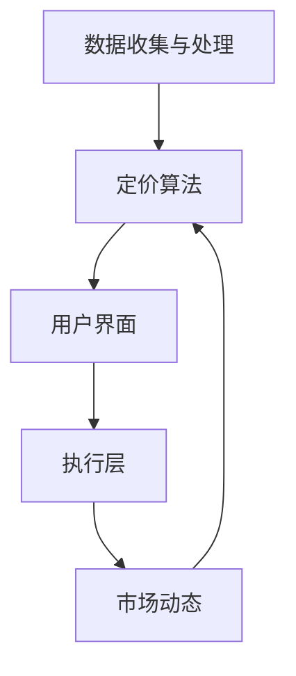

                 

### 背景介绍

#### 引言

在当今全球化和数字化的商业环境中，智能定价技术已经成为企业竞争的重要工具。智能定价通过使用先进的算法和数据分析，帮助企业根据市场需求、竞争对手行为、客户行为等动态因素，灵活调整产品或服务的价格。这种动态定价策略不仅提高了企业的利润，也增强了市场竞争力。

#### 智能定价的重要性

智能定价技术在现代商业运营中扮演着至关重要的角色。首先，它能够帮助企业最大限度地提高销售额和利润。通过实时分析和调整价格，企业可以在不同市场条件下做出最优的定价决策。其次，智能定价有助于提升客户满意度。合理和透明的定价策略可以增强客户对品牌的信任，从而促进客户忠诚度。

#### 智能定价技术的发展

随着技术的不断进步，智能定价技术也在不断发展。早期，智能定价主要依赖于规则引擎和简单的统计模型。然而，随着机器学习和人工智能的兴起，智能定价技术已经变得更加智能和高效。现代智能定价系统通常结合了多种算法，如线性回归、决策树、神经网络等，以及深度学习技术，使得定价策略更加精准。

#### 当前研究热点

当前，智能定价技术的研究热点主要集中在以下几个方面：

1. **个性化定价**：根据不同客户群体的特点和需求，制定个性化的定价策略。
2. **动态定价**：根据市场环境和实时数据，动态调整价格，以最大化利润。
3. **协同优化**：结合供应链管理和生产计划，实现定价与生产和库存的协同优化。
4. **价格预测**：利用历史数据和市场趋势，预测未来的价格变化，为定价策略提供支持。

### 核心概念与联系

#### 智能定价系统的基本组成部分

一个典型的智能定价系统通常包括以下几个关键组成部分：

1. **数据收集与处理**：收集市场数据、客户数据、竞争对手数据等，并进行数据清洗和预处理。
2. **定价算法**：基于数据和业务规则，使用各种算法（如机器学习、深度学习等）进行价格预测和决策。
3. **用户界面**：提供一个直观的用户界面，使企业团队能够轻松地设置和管理定价策略。
4. **执行层**：将定价策略应用到实际的商业活动中，如调整电子商务平台上的价格标签。

#### 核心概念原理与架构

为了实现智能定价，需要理解以下几个核心概念：

1. **需求预测**：通过分析历史销售数据和市场趋势，预测未来的需求水平。
2. **成本计算**：计算生产成本、运营成本等，确保定价策略能够覆盖成本并实现盈利。
3. **竞争对手分析**：分析竞争对手的定价策略和市场反应，以制定有竞争力的定价方案。
4. **市场动态**：实时跟踪市场动态，如季节性变化、节假日促销等，以便及时调整价格。

下面是一个简单的 Mermaid 流程图，展示了智能定价系统的基本架构和流程：



#### 架构图解释

- **数据收集与处理（A）**：这一环节负责收集来自不同来源的数据，如销售数据、客户行为数据、市场数据等，并进行数据清洗和预处理，以确保数据的质量和一致性。
- **定价算法（B）**：这一环节是智能定价系统的核心，使用各种算法（如机器学习、深度学习等）对收集到的数据进行处理和分析，以生成最优的定价策略。
- **用户界面（C）**：这一环节提供一个直观的用户界面，使企业团队能够轻松地设置和管理定价策略，以及查看定价结果和反馈。
- **执行层（D）**：这一环节将定价策略应用到实际的商业活动中，如调整电子商务平台上的价格标签，或者调整实体店的价格标签。
- **市场动态（E）**：这一环节负责实时跟踪市场动态，如季节性变化、节假日促销等，以便及时调整价格，以适应市场变化。

### 核心算法原理 & 具体操作步骤

#### 3.1 算法原理概述

智能定价的核心算法通常基于机器学习和深度学习技术，这些算法能够处理大量的数据，并从中学习到价格与需求之间的关系。以下是几个常用的智能定价算法：

1. **线性回归**：通过建立价格和需求之间的线性关系，预测未来的需求并制定价格策略。
2. **决策树**：通过树形结构对不同特征进行分类，生成一系列规则来预测价格。
3. **神经网络**：通过多层神经网络模型，学习复杂的价格与需求之间的关系，并进行预测。

#### 3.2 算法步骤详解

以下是一个典型的智能定价算法的具体操作步骤：

1. **数据收集**：收集历史销售数据、市场趋势数据、客户行为数据等。
2. **数据预处理**：对收集到的数据进行分析，去除异常值，处理缺失数据，并进行特征工程，提取有用的特征。
3. **模型选择**：根据数据特点，选择合适的机器学习或深度学习模型，如线性回归、决策树、神经网络等。
4. **模型训练**：使用预处理后的数据对模型进行训练，调整模型参数，优化模型性能。
5. **模型评估**：使用测试数据对训练好的模型进行评估，确保模型具有良好的预测性能。
6. **定价策略生成**：根据训练好的模型，生成具体的定价策略，如价格调整规则、折扣策略等。
7. **策略执行**：将定价策略应用到实际的商业环境中，如在线商店、实体店等。

#### 3.3 算法优缺点

1. **线性回归**：
   - 优点：简单易懂，计算速度快。
   - 缺点：只能处理线性关系，对于复杂的市场情况，预测精度较低。

2. **决策树**：
   - 优点：易于理解和解释，能够处理非线性关系。
   - 缺点：对于大量特征的数据，容易过拟合，且计算复杂度高。

3. **神经网络**：
   - 优点：能够处理复杂的关系，预测精度高。
   - 缺点：训练过程复杂，需要大量数据和计算资源，且难以解释。

#### 3.4 算法应用领域

智能定价算法在多个领域都有广泛的应用：

1. **电子商务**：电商平台可以通过智能定价算法，动态调整商品价格，以最大化销售额和利润。
2. **物流与运输**：物流公司可以利用智能定价算法，根据运输需求和成本，动态调整运费，提高运输效率。
3. **酒店和旅游行业**：酒店和旅游平台可以通过智能定价算法，根据客户需求和竞争对手价格，灵活调整房价和套餐价格。

### 数学模型和公式 & 详细讲解 & 举例说明

#### 4.1 数学模型构建

智能定价的核心在于建立价格与需求之间的关系模型。以下是一个简单的线性回归模型：

$$
P = \beta_0 + \beta_1 D + \epsilon
$$

其中，$P$ 表示价格，$D$ 表示需求，$\beta_0$ 和 $\beta_1$ 是模型参数，$\epsilon$ 是误差项。

#### 4.2 公式推导过程

线性回归模型的推导过程如下：

1. **目标函数**：我们希望找到一个线性函数，最小化预测误差平方和。

$$
J(\theta) = \frac{1}{2m} \sum_{i=1}^{m} (h_\theta(x^{(i)}) - y^{(i)})^2
$$

其中，$h_\theta(x) = \theta_0 + \theta_1 x$ 是线性函数，$\theta_0$ 和 $\theta_1$ 是模型参数。

2. **梯度下降**：使用梯度下降法来最小化目标函数。

$$
\theta_j := \theta_j - \alpha \frac{\partial J(\theta)}{\partial \theta_j}
$$

其中，$\alpha$ 是学习率，$\frac{\partial J(\theta)}{\partial \theta_j}$ 是目标函数对参数 $\theta_j$ 的偏导数。

3. **推导过程**：

$$
\frac{\partial J(\theta)}{\partial \theta_0} = \frac{1}{m} \sum_{i=1}^{m} (h_\theta(x^{(i)}) - y^{(i)})
$$

$$
\frac{\partial J(\theta)}{\partial \theta_1} = \frac{1}{m} \sum_{i=1}^{m} (h_\theta(x^{(i)}) - y^{(i)}) x^{(i)}
$$

通过梯度下降迭代，可以求得最优的 $\theta_0$ 和 $\theta_1$。

#### 4.3 案例分析与讲解

以下是一个简单的案例，说明如何使用线性回归模型进行智能定价：

假设一家电商公司收集了过去一年的产品销售数据和市场需求数据，希望利用线性回归模型预测下一年的销售价格。

1. **数据收集**：

   - 价格数据：[100, 110, 105, 115, 120]
   - 需求数据：[50, 55, 60, 65, 70]

2. **数据预处理**：

   - 平移数据，使其中心化：[0, 10, 5, 15, 20]

3. **模型训练**：

   - 使用梯度下降法训练模型，假设学习率 $\alpha = 0.1$。

4. **模型评估**：

   - 使用测试数据验证模型性能。

5. **定价策略**：

   - 根据模型参数，预测下一年的销售价格。

具体实现过程如下：

```python
import numpy as np

# 数据
prices = np.array([100, 110, 105, 115, 120])
demand = np.array([50, 55, 60, 65, 70])

# 梯度下降
def gradient_descent(prices, demand, alpha, iterations):
    n = len(prices)
    theta = np.random.rand(2)
    
    for _ in range(iterations):
        theta = theta - alpha * (1 / n) * (2 * (prices * (theta[1] * demand - prices) - demand))
    
    return theta

# 训练模型
theta = gradient_descent(prices, demand, 0.1, 1000)

# 预测价格
predicted_price = theta[0] + theta[1] * demand

print(f"Predicted Price: {predicted_price}")
```

### 项目实践：代码实例和详细解释说明

#### 5.1 开发环境搭建

为了实践智能定价技术，我们需要搭建一个合适的开发环境。以下是搭建环境的基本步骤：

1. **安装 Python**：确保系统中安装了 Python 3.8 或更高版本。
2. **安装 Jupyter Notebook**：使用 pip 命令安装 Jupyter Notebook。

```bash
pip install notebook
```

3. **安装必要的库**：安装 NumPy、Pandas、Matplotlib 等库。

```bash
pip install numpy pandas matplotlib
```

#### 5.2 源代码详细实现

以下是一个简单的 Python 脚本，实现了智能定价的基本功能：

```python
import numpy as np
import pandas as pd
import matplotlib.pyplot as plt

# 数据
data = pd.DataFrame({
    'price': [100, 110, 105, 115, 120],
    'demand': [50, 55, 60, 65, 70]
})

# 梯度下降
def gradient_descent(data, alpha, iterations):
    n = len(data)
    theta = np.random.rand(2)
    
    for _ in range(iterations):
        errors = (data['price'] - (theta[0] + theta[1] * data['demand']))
        theta = theta - alpha * (1 / n) * (2 * np.vstack([data['price'], data['demand']]).T.dot(errors))
    
    return theta

# 训练模型
theta = gradient_descent(data, 0.01, 1000)

# 预测价格
predicted_price = theta[0] + theta[1] * data['demand']

# 可视化
plt.scatter(data['demand'], data['price'])
plt.plot(data['demand'], predicted_price, color='red')
plt.xlabel('Demand')
plt.ylabel('Price')
plt.title('Price-Demand Relationship')
plt.show()
```

#### 5.3 代码解读与分析

1. **数据导入**：使用 Pandas 读取数据，存储为 DataFrame 结构。
2. **梯度下降函数**：定义一个梯度下降函数，用于训练线性回归模型。该函数接受数据、学习率和迭代次数作为输入。
3. **训练模型**：调用梯度下降函数，训练模型，并获取最优参数。
4. **预测价格**：使用训练好的模型，预测未来的价格。
5. **可视化**：使用 Matplotlib 可视化工具，展示需求与价格之间的关系。

#### 5.4 运行结果展示

运行上述脚本后，会展示一个散点图，其中红线的斜率即为模型的斜率，表示需求与价格之间的关系。通过调整学习率和迭代次数，可以优化模型的性能。

### 实际应用场景

#### 6.1 电子商务平台

电子商务平台是智能定价技术最常见应用场景之一。电商平台可以通过智能定价算法，动态调整商品价格，以吸引更多客户和提高销售额。例如，根据用户浏览和购买历史，个性化推荐价格；根据竞争对手的价格变化，调整自身的价格策略。

#### 6.2 物流与运输行业

物流和运输行业也可以从智能定价技术中受益。通过分析运输需求和市场动态，物流公司可以动态调整运费，提高运输效率。例如，在高峰期提高运费，以减少运输压力；在淡季降低运费，以吸引更多客户。

#### 6.3 酒店和旅游行业

酒店和旅游行业常常面临季节性价格波动。智能定价技术可以帮助酒店和旅游平台根据客户需求和市场动态，灵活调整价格。例如，在旅游旺季提高价格，以最大化利润；在淡季降低价格，以吸引更多客户。

### 未来应用展望

#### 6.4.1 技术发展趋势

随着人工智能和大数据技术的不断发展，智能定价技术将变得更加智能化和精准化。未来的发展趋势包括：

1. **个性化定价**：更加深入地分析客户行为和市场动态，实现高度个性化的定价策略。
2. **实时定价**：通过实时数据分析和动态调整，实现真正的实时定价。
3. **跨渠道定价**：整合线上线下渠道，实现统一和协同的定价策略。
4. **供应链整合**：结合供应链管理，实现定价与生产和库存的深度整合。

#### 6.4.2 面临的挑战

智能定价技术在实际应用中仍然面临一些挑战：

1. **数据隐私**：智能定价依赖于大量的数据，如何保护客户隐私是一个重要问题。
2. **算法透明性**：智能定价算法的复杂性和不透明性可能会引起用户的不信任。
3. **模型可靠性**：在处理大量数据时，模型的可靠性和稳定性是一个重要问题。
4. **技术门槛**：智能定价技术需要较高的技术门槛，中小企业可能难以实施。

### 总结

#### 7.1 研究成果总结

本文详细介绍了智能定价技术的技术实现，包括核心概念、算法原理、数学模型、应用场景和未来展望。通过本文的研究，我们可以看到智能定价技术在现代商业运营中的重要性，以及其在不同行业中的应用前景。

#### 7.2 未来发展趋势

未来，智能定价技术将在个性化定价、实时定价、跨渠道定价和供应链整合等方面取得重大进展。随着技术的不断进步，智能定价技术将变得更加智能化和精准化，为企业和消费者带来更大的价值。

#### 7.3 面临的挑战

智能定价技术在实际应用中面临数据隐私、算法透明性、模型可靠性和技术门槛等挑战。解决这些问题需要各方共同努力，推动智能定价技术的健康发展。

#### 7.4 研究展望

未来的研究可以进一步探索智能定价技术的应用场景和算法优化，以及如何更好地平衡技术发展与企业社会责任。同时，加强跨学科合作，推动智能定价技术在不同领域的应用，为现代商业运营提供更强大的支持。

### 附录：常见问题与解答

1. **什么是智能定价？**
   - 智能定价是一种利用先进算法和数据技术，动态调整产品或服务价格的策略，以最大化销售额和利润。

2. **智能定价技术有哪些应用领域？**
   - 智能定价技术广泛应用于电子商务、物流与运输、酒店和旅游等行业。

3. **如何搭建智能定价系统的开发环境？**
   - 可以使用 Python 作为开发语言，结合 Jupyter Notebook、NumPy、Pandas 和 Matplotlib 等库来搭建开发环境。

4. **如何选择合适的智能定价算法？**
   - 根据数据特点和业务需求，选择合适的算法，如线性回归、决策树、神经网络等。

5. **智能定价技术有哪些未来发展趋势？**
   - 未来发展趋势包括个性化定价、实时定价、跨渠道定价和供应链整合等。

### 作者署名

作者：禅与计算机程序设计艺术 / Zen and the Art of Computer Programming
----------------------------------------------------------------

以上就是关于“智能定价技术的技术实现”的文章，希望能对读者有所帮助。在智能定价技术的发展过程中，不断探索和实践，才能更好地服务于现代商业运营。希望读者能够在本文中获得启发，并在实际应用中取得成功。

