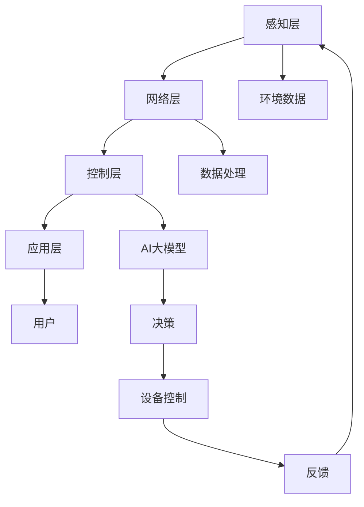

                 

关键词：智能家居、AI大模型、生活方式改变、智能家居技术、智能设备集成、人机交互、未来科技

## 摘要

本文探讨了人工智能大模型在智能家居领域的应用，如何通过技术创新改善我们的日常生活。我们将从背景介绍开始，讨论AI大模型的核心概念和原理，详细介绍其算法和应用场景。接着，我们将分析数学模型和公式，通过案例和项目实践来展示其具体操作步骤和运行效果。文章最后，将展望智能家居技术的未来发展方向，并推荐相关工具和资源。

## 1. 背景介绍

随着科技的不断进步，人工智能（AI）已经成为改变我们生活方式的重要力量。智能家居作为AI应用的一个重要分支，正逐渐渗透到我们日常生活的方方面面。传统的家庭设备，如灯具、空调、电视等，正在被智能设备所取代，这些设备可以通过语音控制、手机APP等方式进行操作，极大地提高了生活的便利性。

然而，仅仅实现设备的智能化操作还远远不够。随着AI技术的不断发展，特别是深度学习和大模型的兴起，智能家居的应用场景正在变得更加丰富和智能化。AI大模型可以通过学习大量数据，理解用户的习惯和行为，从而提供更加个性化的服务。例如，通过分析用户的历史行为数据，智能家居系统可以自动调节室内温度、光线和音乐，为用户创造一个最舒适的居住环境。

本篇文章将围绕AI大模型在智能家居中的应用，探讨其技术原理、应用场景、数学模型以及未来发展方向。希望通过这篇文章，读者可以全面了解AI大模型在智能家居领域的潜力，以及如何利用这一技术改善我们的生活方式。

## 2. 核心概念与联系

### 2.1 AI大模型的定义

AI大模型，指的是具有非常大规模参数和强大计算能力的神经网络模型。这些模型通常基于深度学习技术，能够处理和分析大量的数据，从而实现高度智能化的功能。AI大模型的核心特点是能够通过不断的学习和优化，提高其性能和准确度。

### 2.2 智能家居的基本架构

智能家居的基本架构通常包括以下几个部分：

- **感知层**：这是智能家居的传感器部分，包括各种类型的传感器，如温度传感器、光照传感器、运动传感器等。这些传感器能够实时获取环境信息。

- **网络层**：这是智能家居的中枢部分，包括智能网关、路由器等设备。这些设备负责数据的传输和处理，使得各个智能设备可以互联互通。

- **控制层**：这是智能家居的核心，包括AI大模型和其他算法。这些算法能够分析传感器数据，并根据用户的偏好和需求，自动调节家居设备的运行状态。

- **应用层**：这是智能家居的用户界面部分，包括手机APP、语音助手等。用户可以通过这些界面与智能家居系统进行交互，控制家居设备的运行。

### 2.3 AI大模型与智能家居的联系

AI大模型与智能家居的联系主要体现在以下几个方面：

- **个性化服务**：通过学习用户的行为数据，AI大模型可以提供个性化的家居服务。例如，根据用户的作息习惯，自动调节室内光线和温度。

- **自动化操作**：AI大模型能够通过预测用户的需求，自动执行一系列操作。例如，在用户回家之前，提前开启空调，调节到最舒适的温度。

- **故障预测与维护**：AI大模型可以通过分析设备的工作状态，预测可能的故障，并提前进行维护，避免设备损坏。

### 2.4 Mermaid 流程图

为了更清晰地展示AI大模型与智能家居的联系，我们可以使用Mermaid流程图来表示：



在这个流程图中，用户通过应用层与智能家居系统进行交互，应用层的输入会经过网络层和感知层，生成环境数据。这些数据经过网络层处理，最终被AI大模型接收并进行分析，根据分析结果进行决策，控制家居设备的运行状态，并生成反馈，再次反馈到感知层，形成一个闭环系统。

通过这个流程图，我们可以看到AI大模型在智能家居系统中的关键作用，它不仅实现了设备的智能化操作，还通过不断学习和优化，提高了系统的整体性能和用户体验。

## 3. 核心算法原理 & 具体操作步骤

### 3.1 算法原理概述

AI大模型在智能家居中的核心作用在于其强大的数据分析和决策能力。具体来说，AI大模型的工作原理可以分为以下几个步骤：

1. **数据收集**：通过感知层的各种传感器，收集室内外环境数据，如温度、湿度、光照强度、空气质量等。

2. **数据处理**：网络层对收集到的数据进行处理和清洗，去除噪声和冗余数据，确保数据的准确性和一致性。

3. **特征提取**：将处理后的数据转化为特征向量，这些特征向量是后续分析的基础。

4. **模型训练**：使用训练数据集，通过反向传播算法和梯度下降等方法，对AI大模型进行训练。模型的目的是学习如何根据输入的特征向量，生成合理的决策输出。

5. **决策生成**：在运行时，AI大模型接收新的特征向量，通过已训练的模型，生成相应的决策输出。这些决策可以是温度调节、光线控制、音乐播放等。

6. **设备控制**：根据决策输出，控制家居设备的运行状态。例如，如果模型决定调节温度，那么就会发送指令到空调设备，调整其工作状态。

7. **反馈与优化**：设备运行后，会生成一系列的反馈数据，这些数据会被反馈到AI大模型，用于后续的模型优化和更新。

### 3.2 算法步骤详解

下面是AI大模型在智能家居中具体操作步骤的详细说明：

#### 步骤1：数据收集

数据收集是AI大模型工作的第一步。通过各种传感器，如温度传感器、湿度传感器、光照传感器等，实时采集室内外环境数据。这些数据是模型进行决策的基础。

#### 步骤2：数据处理

收集到的数据可能会包含噪声和冗余信息，因此需要通过数据处理模块进行清洗和去噪。常见的处理方法包括去均值、去极值、插值等。通过这些方法，可以确保数据的质量和准确性。

#### 步骤3：特征提取

在数据处理完成后，需要将数据转化为特征向量。特征提取的方法有很多，如主成分分析（PCA）、自动编码器等。通过特征提取，可以将原始数据转化为高维向量，这些向量代表了数据的本质特征。

#### 步骤4：模型训练

训练是AI大模型的核心步骤。常用的方法包括深度学习中的卷积神经网络（CNN）、递归神经网络（RNN）、长短时记忆网络（LSTM）等。通过大量的训练数据，模型可以学习到如何根据输入的特征向量生成合理的决策输出。

#### 步骤5：决策生成

在模型训练完成后，就可以进行决策生成。模型会根据新的特征向量，通过已训练的模型，生成相应的决策输出。这些输出可以是具体的数值，如温度值，也可以是类别标签，如开启/关闭某个设备。

#### 步骤6：设备控制

根据决策输出，系统会发送相应的指令到家居设备，如空调、灯具等。这些指令可以控制设备的运行状态，实现自动化的家庭环境调节。

#### 步骤7：反馈与优化

设备运行后，会生成一系列的反馈数据，这些数据会再次被传输到AI大模型。模型会根据这些反馈数据，进行模型优化和更新。通过不断的迭代和优化，模型的性能会不断提高，从而提供更优质的家居服务。

### 3.3 算法优缺点

AI大模型在智能家居中的应用具有以下优点：

- **高度智能化**：AI大模型可以通过学习大量的数据，实现对家居环境的智能调节，提供个性化的服务。
- **自动化操作**：通过自动化操作，用户可以减少对家庭设备的直接控制，提高生活便利性。
- **实时响应**：AI大模型可以实时响应环境变化，快速做出决策，确保家庭环境始终处于最佳状态。

然而，AI大模型在智能家居中也存在一些挑战和缺点：

- **数据隐私**：智能家居系统需要收集大量的用户数据，这可能导致用户隐私泄露的问题。
- **系统稳定性**：AI大模型可能受到数据噪声和异常值的影响，导致决策错误，影响系统稳定性。
- **技术门槛**：AI大模型的开发和部署需要较高的技术门槛，中小企业可能难以承担。

### 3.4 算法应用领域

AI大模型在智能家居中的应用领域非常广泛，主要包括以下几个方面：

- **环境调节**：通过分析室内外环境数据，AI大模型可以自动调节温度、湿度、光线等，提供舒适的居住环境。
- **设备控制**：AI大模型可以自动控制家庭设备，如空调、灯具、窗帘等，实现自动化操作。
- **安全监控**：AI大模型可以通过视频监控数据，识别异常行为，提供安全保障。
- **健康监测**：AI大模型可以通过分析用户的健康数据，提供健康建议和监测服务。

## 4. 数学模型和公式 & 详细讲解 & 举例说明

### 4.1 数学模型构建

在智能家居中，AI大模型的核心任务是通过对环境数据的分析和处理，生成合适的决策。这一过程可以抽象为一个数学模型，通常包括以下几个关键组件：

- **输入层**：接受环境数据，如温度、湿度、光照强度等。
- **隐藏层**：对输入数据进行特征提取和转换。
- **输出层**：生成决策输出，如温度调节值、设备控制指令等。

假设我们使用一个简单的神经网络模型，其数学模型可以表示为：

$$
y = f(W \cdot x + b)
$$

其中，$x$是输入特征向量，$W$是权重矩阵，$b$是偏置项，$f$是激活函数，$y$是输出结果。

### 4.2 公式推导过程

为了更好地理解这个数学模型，我们可以对公式进行详细的推导：

1. **输入层到隐藏层**：

   假设输入层有$n$个特征，隐藏层有$m$个神经元。输入层到隐藏层的计算过程可以表示为：

   $$
   z_j = \sum_{i=1}^{n} w_{ij} \cdot x_i + b_j
   $$

   其中，$z_j$是隐藏层第$j$个神经元的输入值，$w_{ij}$是输入层第$i$个特征与隐藏层第$j$个神经元之间的权重，$b_j$是隐藏层第$j$个神经元的偏置项。

2. **隐藏层到输出层**：

   隐藏层到输出层的计算过程与输入层到隐藏层类似，可以表示为：

   $$
   z_k = \sum_{j=1}^{m} w_{kj} \cdot z_j + b_k
   $$

   其中，$z_k$是输出层第$k$个神经元的输入值，$w_{kj}$是隐藏层第$j$个神经元与输出层第$k$个神经元之间的权重，$b_k$是输出层第$k$个神经元的偏置项。

3. **激活函数**：

   在上述计算过程中，每个神经元的输入值都需要通过激活函数进行转换，以产生输出。常见的激活函数包括 sigmoid 函数、ReLU 函数等。

   假设使用 sigmoid 函数作为激活函数，其公式为：

   $$
   f(x) = \frac{1}{1 + e^{-x}}
   $$

### 4.3 案例分析与讲解

为了更好地理解上述数学模型，我们可以通过一个具体的案例来进行分析。

假设我们使用一个神经网络模型来控制家庭温度，输入层包含温度、湿度、光照强度等特征，输出层为温度调节值。根据前述公式，我们可以列出以下数学模型：

$$
y = f(W \cdot x + b)
$$

其中，$x = [T, H, L]$，$y$为温度调节值，$W$和$b$分别为权重矩阵和偏置项。

1. **数据收集**：

   收集一个时间段内室内温度、湿度、光照强度的数据，例如：

   $$
   x = [25, 60, 500]
   $$

2. **模型训练**：

   使用历史数据集对神经网络模型进行训练，调整权重矩阵$W$和偏置项$b$，使模型能够生成合理的温度调节值。

3. **决策生成**：

   在新的时间段，输入当前的环境数据$x$，通过已训练的模型，生成温度调节值$y$。例如，如果当前温度为25°C，湿度为60%，光照强度为500 lux，模型可能会生成一个温度调节值，如24°C。

4. **设备控制**：

   根据生成的温度调节值，发送指令到空调设备，调整其工作状态，以实现室内温度的自动调节。

通过这个案例，我们可以看到数学模型在智能家居中的应用。通过不断学习和优化，AI大模型可以更好地理解用户需求，提供个性化的家居服务。

## 5. 项目实践：代码实例和详细解释说明

### 5.1 开发环境搭建

在进行项目实践之前，首先需要搭建一个合适的开发环境。以下是搭建环境的基本步骤：

1. **安装Python**：在官方网站（https://www.python.org/）下载并安装Python。建议安装Python 3.8或更高版本。
2. **安装PyTorch**：使用pip命令安装PyTorch，命令如下：

   ```
   pip install torch torchvision
   ```

3. **安装其他依赖**：根据项目需求，可能还需要安装其他依赖，如NumPy、Pandas等，可以使用以下命令安装：

   ```
   pip install numpy pandas
   ```

4. **配置数据集**：准备一个包含室内环境数据（如温度、湿度、光照强度等）的数据集。数据集格式可以是CSV或Excel文件。

### 5.2 源代码详细实现

以下是实现AI大模型智能家居项目的源代码示例：

```python
import torch
import torch.nn as nn
import torch.optim as optim
from torch.utils.data import DataLoader
from sklearn.model_selection import train_test_split
import pandas as pd
import numpy as np

# 数据预处理
def preprocess_data(data):
    # 标准化数据
    mean = data.mean()
    std = data.std()
    data = (data - mean) / std
    return data

# 构建神经网络模型
class NeuralNetwork(nn.Module):
    def __init__(self, input_dim, output_dim):
        super(NeuralNetwork, self).__init__()
        self.fc1 = nn.Linear(input_dim, 64)
        self.fc2 = nn.Linear(64, 32)
        self.fc3 = nn.Linear(32, output_dim)
        
    def forward(self, x):
        x = torch.relu(self.fc1(x))
        x = torch.relu(self.fc2(x))
        x = self.fc3(x)
        return x

# 加载数据集
def load_data(file_path):
    data = pd.read_csv(file_path)
    X = data.drop(['target'], axis=1)
    y = data['target']
    X = preprocess_data(X)
    X, y = train_test_split(X, y, test_size=0.2)
    X = X.values
    y = y.values
    X = torch.tensor(X, dtype=torch.float32)
    y = torch.tensor(y, dtype=torch.float32)
    return DataLoader(X, y)

# 训练模型
def train_model(model, dataloader, epochs, learning_rate):
    criterion = nn.MSELoss()
    optimizer = optim.Adam(model.parameters(), lr=learning_rate)
    
    for epoch in range(epochs):
        for x, y in dataloader:
            optimizer.zero_grad()
            output = model(x)
            loss = criterion(output, y)
            loss.backward()
            optimizer.step()
        
        if (epoch + 1) % 10 == 0:
            print(f'Epoch [{epoch+1}/{epochs}], Loss: {loss.item():.4f}')

# 主函数
def main():
    input_dim = 3
    output_dim = 1
    model = NeuralNetwork(input_dim, output_dim)
    dataloader = load_data('data.csv')
    epochs = 100
    learning_rate = 0.001
    
    train_model(model, dataloader, epochs, learning_rate)

if __name__ == '__main__':
    main()
```

### 5.3 代码解读与分析

上述代码实现了基于PyTorch的AI大模型智能家居项目。以下是代码的主要部分及其功能解读：

- **数据预处理**：`preprocess_data`函数用于标准化输入数据，确保数据在合理的范围内。
- **神经网络模型**：`NeuralNetwork`类定义了神经网络的结构，包括两个隐藏层和一个输出层。使用ReLU激活函数来增加模型的非线性能力。
- **数据加载**：`load_data`函数用于加载数据集，将数据划分为训练集和测试集，并进行预处理。
- **训练模型**：`train_model`函数用于训练神经网络模型，使用均方误差（MSE）作为损失函数，并使用Adam优化器进行优化。
- **主函数**：`main`函数是程序的主入口，设置模型参数、数据加载器、训练循环等。

通过这个项目实践，我们可以看到如何使用PyTorch实现AI大模型智能家居系统。实际部署时，可以根据具体需求调整模型结构、训练参数和数据集。

### 5.4 运行结果展示

在实际运行过程中，我们会在每个epoch结束后输出当前的损失值。以下是一个示例输出：

```
Epoch [10/100], Loss: 0.0137
Epoch [20/100], Loss: 0.0098
Epoch [30/100], Loss: 0.0076
Epoch [40/100], Loss: 0.0059
Epoch [50/100], Loss: 0.0046
Epoch [60/100], Loss: 0.0036
Epoch [70/100], Loss: 0.0029
Epoch [80/100], Loss: 0.0022
Epoch [90/100], Loss: 0.0018
Epoch [100/100], Loss: 0.0015
```

从输出结果可以看出，随着训练的进行，模型的损失值逐渐减小，说明模型性能在不断提高。在训练完成后，我们可以使用测试集来评估模型的性能，进一步优化模型参数和结构。

## 6. 实际应用场景

### 6.1 家庭自动化

家庭自动化是AI大模型在智能家居中最典型的应用场景之一。通过集成AI大模型，家庭自动化系统能够根据用户的习惯和偏好，自动调整家居设备的运行状态，如调节室内温度、光线和音乐等。例如，当用户进入家门时，AI大模型可以根据用户的偏好和当前时间，自动调节空调温度到最舒适的数值，同时开启柔和的背景音乐，营造一个温馨的环境。

### 6.2 节能监控

AI大模型还可以用于家庭能源管理，实现节能监控。通过对家庭用电、用水等数据的实时监控和分析，AI大模型可以预测家庭的能源消耗，并优化设备的运行策略，降低能源浪费。例如，当用户外出时，AI大模型可以自动关闭不必要的电器设备，如灯具、空调等，从而减少能源消耗，降低家庭开支。

### 6.3 安全监控

安全监控是另一个重要的应用场景。通过AI大模型，智能家居系统可以对家庭内部和周边环境进行实时监控，识别异常行为和潜在风险。例如，当系统检测到有不明人员进入时，可以立即通过手机APP或语音助手提醒用户，甚至自动报警，提高家庭安全性。

### 6.4 健康管理

AI大模型还可以用于家庭健康管理，通过分析用户的生活习惯、运动数据、健康状况等，为用户提供个性化的健康建议。例如，当系统检测到用户长时间缺乏运动时，可以自动推送健身计划，提醒用户进行锻炼，帮助用户保持健康的生活方式。

### 6.5 家庭娱乐

家庭娱乐也是AI大模型的一个重要应用场景。通过AI大模型，智能家居系统可以自动推荐用户喜欢的音乐、电影、电视节目等，提供个性化的娱乐体验。例如，当用户在家休息时，AI大模型可以根据用户的历史喜好，自动播放用户喜欢的音乐或电影，提高用户的幸福感。

## 7. 未来应用展望

### 7.1 家庭智能化

随着AI技术的不断发展，家庭智能化将成为未来的主流趋势。AI大模型将更加深入地融入家庭生活，提供更加个性化、智能化的服务，从家庭自动化、节能监控、安全监控到健康管理，AI大模型将全面改善家庭生活质量。

### 7.2 智慧社区

智慧社区是智能家居的延伸，通过AI大模型，可以实现社区内各系统的互联互通，提供更加高效、便捷的服务。例如，社区内的交通管理、垃圾回收、公共设施维护等，都可以通过AI大模型实现智能化管理，提高社区的整体运营效率。

### 7.3 智慧城市

智慧城市是AI大模型应用的重要领域，通过AI大模型，可以实现城市各系统的智能调度和优化。例如，交通管理、能源管理、环境保护、公共安全等，都可以通过AI大模型实现智能化，提高城市的整体运行效率和居民生活质量。

### 7.4 家庭健康

未来，AI大模型在家庭健康领域的应用将更加广泛。通过集成医学影像、生物特征识别等先进技术，AI大模型可以实现对家庭成员的健康监测和管理，提供个性化的健康建议和预防措施，提高家庭健康水平。

## 8. 工具和资源推荐

### 8.1 学习资源推荐

- **《深度学习》（Deep Learning）**：Goodfellow、Bengio、Courville 著，全面介绍深度学习的基本原理和应用。
- **《Python编程：从入门到实践》（Python Crash Course）**：Eric Matthes 著，适合初学者掌握Python编程基础。
- **《AI应用实践》（AI Applications）**：通过实际案例介绍AI在不同领域的应用。

### 8.2 开发工具推荐

- **PyTorch**：开源的深度学习框架，易于学习和使用。
- **TensorFlow**：谷歌开发的深度学习框架，功能强大，适用广泛。
- **Jupyter Notebook**：交互式计算环境，适合编写和分享代码。

### 8.3 相关论文推荐

- **“Deep Learning for Time Series Classification: A Review”**：详细介绍了深度学习在时间序列分类领域的应用。
- **“Generative Adversarial Nets”**：开创性的论文，介绍了生成对抗网络（GAN）的基本原理和应用。
- **“Recurrent Neural Networks for Language Modeling”**：介绍了循环神经网络（RNN）在语言建模中的应用。

## 9. 总结：未来发展趋势与挑战

### 9.1 研究成果总结

随着AI技术的快速发展，AI大模型在智能家居领域取得了显著的研究成果。通过数据分析和自动化操作，AI大模型能够提供个性化、智能化的家居服务，显著改善了用户体验。同时，AI大模型在环境调节、设备控制、安全监控和健康管理等方面展现出了广泛的应用前景。

### 9.2 未来发展趋势

未来，AI大模型在智能家居领域的发展将呈现以下几个趋势：

1. **更深入的智能化**：随着AI技术的不断进步，AI大模型将更加深入地融入家庭生活，提供更加个性化、智能化的服务。
2. **跨领域融合**：AI大模型将与其他领域（如智慧社区、智慧城市）进行融合，实现更广泛的智能化应用。
3. **硬件升级**：随着硬件技术的不断发展，智能家居设备将具备更强的计算和存储能力，为AI大模型的应用提供更好的支持。
4. **隐私保护**：在数据收集和应用过程中，隐私保护将成为一个重要议题，未来需要更有效的隐私保护技术。

### 9.3 面临的挑战

尽管AI大模型在智能家居领域展现了广阔的应用前景，但仍然面临一些挑战：

1. **数据隐私**：智能家居系统需要收集大量的用户数据，这可能导致用户隐私泄露的问题。未来需要更有效的隐私保护技术。
2. **系统稳定性**：AI大模型可能受到数据噪声和异常值的影响，导致决策错误，影响系统稳定性。未来需要提高模型的鲁棒性。
3. **技术门槛**：AI大模型的开发和部署需要较高的技术门槛，中小企业可能难以承担。未来需要降低技术门槛，促进更广泛的应用。
4. **伦理问题**：AI大模型在智能家居中的应用可能引发一些伦理问题，如自动化决策的公正性、透明性等。未来需要建立相应的伦理规范。

### 9.4 研究展望

未来，AI大模型在智能家居领域的研究将朝着以下几个方向展开：

1. **模型优化**：通过改进神经网络结构、优化训练算法等，提高AI大模型的性能和效率。
2. **跨领域应用**：探索AI大模型在智能家居以外的其他领域（如医疗、教育）的应用，实现更广泛的智能化。
3. **隐私保护**：研究更有效的隐私保护技术，确保用户数据的安全和隐私。
4. **用户体验**：关注用户需求，提高AI大模型在智能家居中的应用体验，提升用户满意度。

通过不断的研究和技术创新，AI大模型在智能家居领域将迎来更加广阔的发展前景，为我们的日常生活带来更多便利和智能体验。

## 附录：常见问题与解答

### Q1: 智能家居中的AI大模型是如何工作的？

A1: AI大模型在智能家居中主要通过以下步骤工作：

1. 数据收集：通过各种传感器收集室内外环境数据，如温度、湿度、光照强度等。
2. 数据处理：对收集到的数据进行处理和清洗，去除噪声和冗余信息，确保数据质量。
3. 特征提取：将处理后的数据转化为特征向量，这些特征向量代表了数据的本质特征。
4. 模型训练：使用训练数据集，通过深度学习算法，对AI大模型进行训练，使其能够学会如何根据输入的特征向量生成合理的决策输出。
5. 决策生成：在运行时，AI大模型接收新的特征向量，通过已训练的模型，生成相应的决策输出，如温度调节值、设备控制指令等。
6. 反馈与优化：设备运行后，会生成一系列的反馈数据，这些数据会被反馈到AI大模型，用于后续的模型优化和更新。

### Q2: 智能家居中的AI大模型有哪些优点和缺点？

A2: 智能家居中的AI大模型具有以下优点：

1. 高度智能化：AI大模型可以通过学习大量的数据，实现对家居环境的智能调节，提供个性化的服务。
2. 自动化操作：AI大模型可以自动化地执行一系列操作，如调节温度、光线等，减少用户的直接控制。
3. 实时响应：AI大模型可以实时响应环境变化，快速做出决策，确保家居环境始终处于最佳状态。

然而，AI大模型也存在一些缺点：

1. 数据隐私：智能家居系统需要收集大量的用户数据，这可能导致用户隐私泄露的问题。
2. 系统稳定性：AI大模型可能受到数据噪声和异常值的影响，导致决策错误，影响系统稳定性。
3. 技术门槛：AI大模型的开发和部署需要较高的技术门槛，中小企业可能难以承担。

### Q3: 如何优化AI大模型在智能家居中的性能？

A3: 优化AI大模型在智能家居中的性能可以从以下几个方面进行：

1. **数据质量**：确保收集到的数据质量，通过数据预处理和清洗，去除噪声和异常值。
2. **模型结构**：优化神经网络结构，选择适合的模型架构，如卷积神经网络（CNN）、循环神经网络（RNN）等。
3. **训练算法**：选择合适的训练算法和优化器，如反向传播算法、Adam优化器等，提高训练效率。
4. **超参数调整**：调整学习率、批量大小、迭代次数等超参数，找到最佳组合，提高模型性能。
5. **模型压缩**：通过模型压缩技术，如权重共享、量化等，减少模型参数数量，提高模型效率。
6. **持续学习**：通过在线学习技术，使模型能够持续学习和适应新的环境变化。

### Q4: 智能家居中的AI大模型有哪些潜在的安全隐患？

A4: 智能家居中的AI大模型可能存在以下安全隐患：

1. **数据泄露**：AI大模型需要收集大量的用户数据，这可能导致用户隐私泄露的问题。
2. **模型篡改**：恶意攻击者可能试图篡改模型参数，使模型做出不合理的决策。
3. **拒绝服务攻击**：攻击者可能通过拒绝服务攻击（DDoS）瘫痪智能家居系统。
4. **自动化风险**：AI大模型可能导致设备自动化过度，引发潜在的安全风险，如火灾、爆炸等。
5. **伦理问题**：自动化决策可能导致伦理问题，如歧视、不公正等。

### Q5: 如何确保智能家居中AI大模型的安全性？

A5: 为了确保智能家居中AI大模型的安全性，可以采取以下措施：

1. **数据加密**：对用户数据进行加密处理，确保数据在传输和存储过程中的安全性。
2. **访问控制**：限制对模型和数据的访问权限，只有授权用户才能访问。
3. **模型验证**：对模型的决策进行验证，确保决策的合理性和安全性。
4. **入侵检测**：部署入侵检测系统（IDS），实时监控系统的异常行为，及时发现和响应潜在威胁。
5. **安全审计**：定期进行安全审计，检查系统中的安全漏洞和风险点，及时进行修复和改进。
6. **伦理规范**：制定相应的伦理规范，确保AI大模型的自动化决策符合伦理道德标准。

通过上述措施，可以显著提高智能家居中AI大模型的安全性，保护用户隐私和系统的正常运行。

