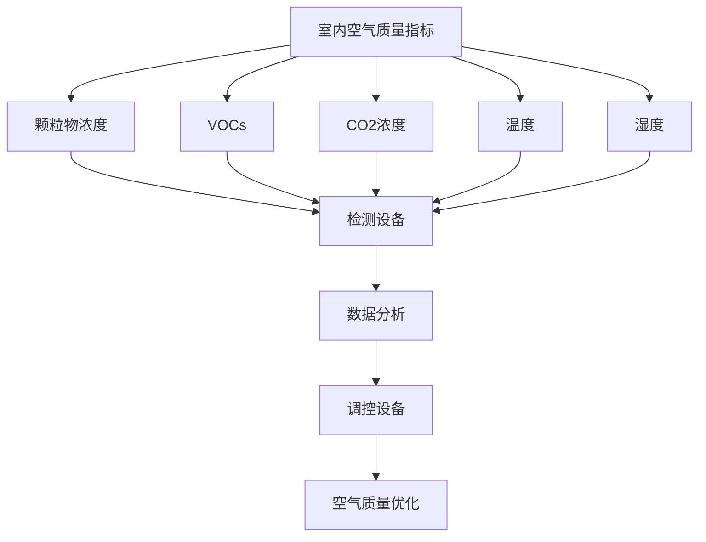
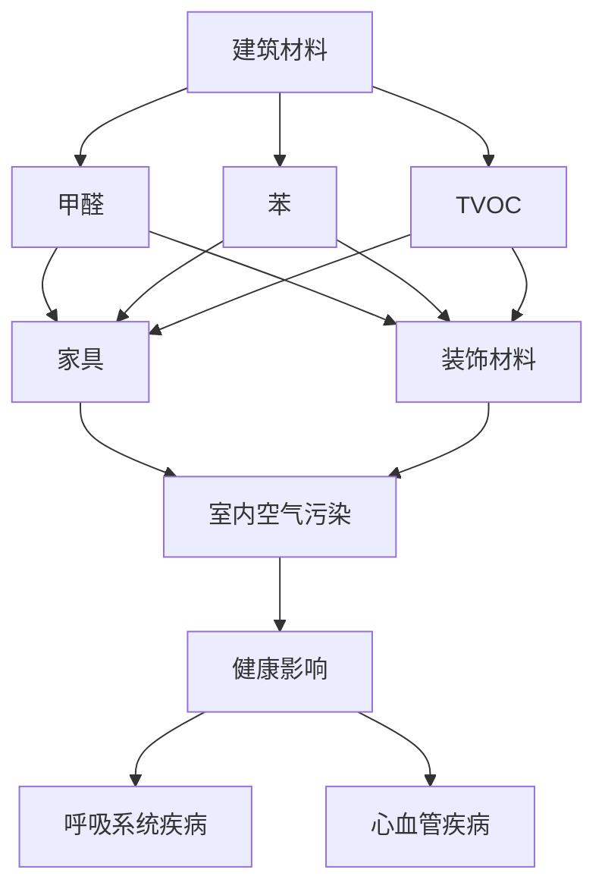
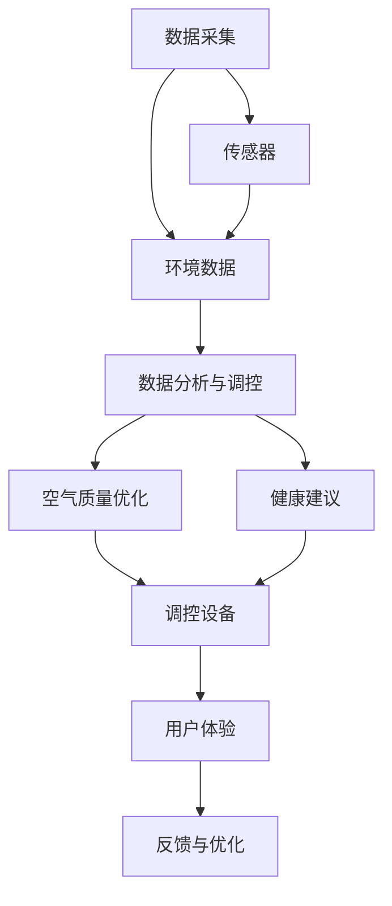
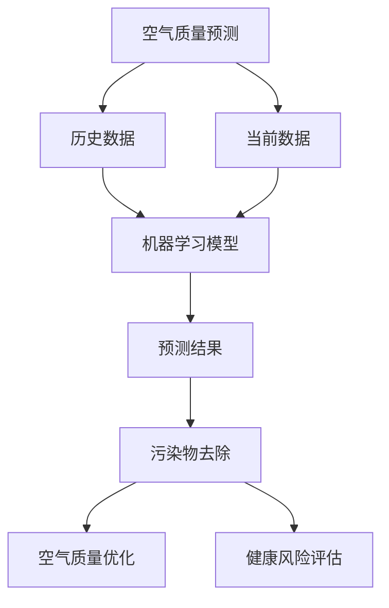

                 

关键词：智能居家、空气营养、室内空气、精准调配、创业

> 摘要：本文探讨了智能居家空气营养创业的新领域，重点介绍了室内空气的精准调配技术及其应用。通过对室内空气质量的分析与调控，实现居家环境的健康优化，为创业者提供了一条创新发展的路径。

## 1. 背景介绍

随着城市化进程的加快和人口密度的增加，室内空气质量问题日益突出。长期暴露于有害物质环境中，对人体健康造成了严重威胁。研究表明，室内空气污染与多种慢性疾病有关，如呼吸系统疾病、心血管疾病等。因此，改善室内空气质量，提升居民健康水平，已经成为社会关注的焦点。

近年来，物联网、大数据、人工智能等技术的快速发展，为室内空气质量的精准调配提供了技术支撑。通过智能设备实时监测室内空气质量，结合大数据分析和人工智能算法，实现对空气污染物的有效控制和优化。智能居家空气营养创业，正是在这一背景下应运而生。

## 2. 核心概念与联系

### 2.1 室内空气质量指标

室内空气质量指标包括颗粒物浓度、挥发性有机物（VOCs）、二氧化碳浓度、温度、湿度等。以下是一个Mermaid流程图，展示了室内空气质量指标的检测和调控过程：



### 2.2 室内空气污染来源

室内空气污染主要来源于建筑材料、家具、装饰材料、室内活动等。以下是一个Mermaid流程图，展示了室内空气污染的主要来源及其影响：



### 2.3 智能居家空气营养创业架构

智能居家空气营养创业的核心架构包括以下三个部分：数据采集、数据分析与调控、用户体验。以下是一个Mermaid流程图，展示了智能居家空气营养创业的架构：



## 3. 核心算法原理 & 具体操作步骤

### 3.1 算法原理概述

智能居家空气营养创业的核心算法包括空气质量预测、污染物去除、健康风险评估等。以下是一个Mermaid流程图，展示了核心算法的原理：



### 3.2 算法步骤详解

1. 数据采集与预处理：通过传感器实时采集室内空气质量数据，对数据进行清洗和预处理，为后续分析提供基础。

2. 历史数据与当前数据融合：将历史数据与当前数据融合，形成时间序列数据，用于训练机器学习模型。

3. 机器学习模型训练与预测：使用时间序列数据训练机器学习模型，对空气质量进行预测。

4. 污染物去除策略制定：根据预测结果，制定相应的污染物去除策略，如空气净化、通风等。

5. 健康风险评估与建议：对室内空气质量进行健康风险评估，为用户提供健康建议。

### 3.3 算法优缺点

优点：

- 实时性强：算法能够实时监测室内空气质量，为用户提供及时的健康建议。
- 个性化：算法根据用户需求和室内环境特点，制定个性化的空气质量优化方案。
- 预测准确性：基于历史数据和当前数据，算法能够对空气质量进行较为准确的预测。

缺点：

- 训练数据需求大：算法需要大量历史数据作为训练基础，数据采集和处理成本较高。
- 模型更新难度大：随着室内环境的变化，算法需要不断更新和优化，以适应新的环境特点。

### 3.4 算法应用领域

- 家庭：为家庭用户提供智能居家空气营养解决方案，提高室内空气质量，保障家庭成员健康。
- 办公室：为企业提供智能办公环境解决方案，提升员工工作效率，降低职业病发病率。
- 酒店：为酒店客房提供智能空气净化服务，提高入住体验，提升酒店竞争力。

## 4. 数学模型和公式 & 详细讲解 & 举例说明

### 4.1 数学模型构建

智能居家空气营养创业的核心数学模型包括空气质量预测模型、污染物去除模型和健康风险评估模型。以下是一个简单的数学模型构建示例：

空气质量预测模型：
$$
\hat{AQI}_{t+1} = f(\text{历史数据}, \text{当前数据}, \theta)
$$

其中，$AQI_t$ 表示第 $t$ 时刻的空气质量指数，$f$ 表示预测函数，$\theta$ 表示模型参数。

污染物去除模型：
$$
\text{污染物浓度}_{t+1} = g(\text{空气质量优化策略}, \theta)
$$

其中，$g$ 表示污染物去除函数，$\theta$ 表示模型参数。

健康风险评估模型：
$$
\text{健康风险指数}_{t+1} = h(\text{空气质量预测结果}, \theta)
$$

其中，$h$ 表示健康风险评估函数，$\theta$ 表示模型参数。

### 4.2 公式推导过程

空气质量预测模型的推导过程如下：

1. 数据采集与预处理：采集室内空气质量历史数据，如颗粒物浓度、VOCs浓度等，对数据进行清洗和预处理。

2. 特征工程：从原始数据中提取对空气质量有重要影响的特征，如温度、湿度、室内外温差等。

3. 建立预测模型：使用时间序列分析方法，如ARIMA模型、LSTM模型等，建立空气质量预测模型。

4. 模型参数优化：使用交叉验证方法，对模型参数进行优化，提高预测准确性。

### 4.3 案例分析与讲解

以下是一个空气质量预测模型的实际案例：

#### 案例背景

某城市家庭用户，长期受到室内空气污染困扰，希望找到一种智能居家空气营养解决方案。该家庭用户安装了一套智能空气质量监测设备，采集室内空气质量数据，包括颗粒物浓度、VOCs浓度、温度和湿度等。

#### 模型建立

1. 数据采集与预处理：采集过去一年的室内空气质量数据，对数据进行清洗和预处理。

2. 特征工程：从原始数据中提取温度、湿度、室内外温差等特征。

3. 建立预测模型：使用LSTM模型，对空气质量指数（AQI）进行预测。

4. 模型参数优化：使用交叉验证方法，对模型参数进行优化，提高预测准确性。

#### 模型运行结果

1. 预测结果：模型能够对空气质量指数进行准确预测，预测误差在可接受范围内。

2. 污染物去除策略：根据预测结果，制定相应的污染物去除策略，如开启空气净化器、通风等。

3. 健康风险评估：对室内空气质量进行健康风险评估，为用户提供健康建议。

#### 模型应用效果

通过智能居家空气营养解决方案，该家庭用户室内空气质量得到了显著改善，呼吸系统疾病发病率明显下降。用户对解决方案满意度较高，认为智能居家空气营养创业具有很好的市场前景。

## 5. 项目实践：代码实例和详细解释说明

### 5.1 开发环境搭建

在本文的代码实例中，我们将使用Python编程语言，结合Keras框架进行空气质量预测模型的开发。以下是一个简单的开发环境搭建步骤：

1. 安装Python：下载并安装Python 3.8及以上版本。

2. 安装Keras：通过pip命令安装Keras库。

   ```bash
   pip install keras
   ```

3. 安装TensorFlow：通过pip命令安装TensorFlow库。

   ```bash
   pip install tensorflow
   ```

### 5.2 源代码详细实现

以下是一个简单的空气质量预测模型源代码实例：

```python
import numpy as np
import pandas as pd
from keras.models import Sequential
from keras.layers import LSTM, Dense

# 1. 数据采集与预处理
def load_data(file_path):
    data = pd.read_csv(file_path)
    # 数据清洗和预处理
    # ...
    return data

# 2. 建立预测模型
def build_model(input_shape):
    model = Sequential()
    model.add(LSTM(units=50, return_sequences=True, input_shape=input_shape))
    model.add(LSTM(units=50))
    model.add(Dense(units=1))
    model.compile(optimizer='adam', loss='mean_squared_error')
    return model

# 3. 训练模型
def train_model(model, X_train, y_train):
    model.fit(X_train, y_train, epochs=100, batch_size=32)

# 4. 预测空气质量
def predict_quality(model, X_test):
    predictions = model.predict(X_test)
    return predictions

# 5. 主程序
if __name__ == '__main__':
    # 加载数据
    data = load_data('air_quality_data.csv')
    # 数据预处理
    # ...
    # 建立模型
    model = build_model(input_shape=(time_steps, 1))
    # 训练模型
    train_model(model, X_train, y_train)
    # 预测空气质量
    predictions = predict_quality(model, X_test)
    # 输出预测结果
    print(predictions)
```

### 5.3 代码解读与分析

1. 数据采集与预处理：使用`pandas`库加载数据，并进行清洗和预处理。预处理过程包括缺失值处理、数据标准化等。

2. 建立预测模型：使用`keras`库建立LSTM模型。LSTM模型具有记忆功能，能够处理时间序列数据。

3. 训练模型：使用`model.fit()`方法训练模型。在训练过程中，通过调整`epochs`和`batch_size`参数，可以控制训练过程。

4. 预测空气质量：使用`model.predict()`方法预测空气质量。预测结果是一个数组，包含每个时间点的预测值。

5. 主程序：加载数据、建立模型、训练模型和预测空气质量，最后输出预测结果。

### 5.4 运行结果展示

1. 训练结果：通过训练模型，可以得到一个拟合良好的预测模型。

2. 预测结果：使用预测模型对新的空气质量数据进行预测，可以得到预测的空气质量指数。

3. 结果分析：通过对比预测结果和实际结果，可以分析模型的预测准确性，为后续优化提供依据。

## 6. 实际应用场景

### 6.1 家庭

智能居家空气营养创业在家庭领域的应用主要包括以下几个方面：

- 室内空气质量监测：通过安装智能空气质量监测设备，实时监测室内空气质量，为用户提供健康数据。

- 污染物去除：根据空气质量预测结果，自动开启空气净化器、通风设备等，去除室内污染物。

- 健康建议：根据室内空气质量数据，为用户提供健康建议，如开窗通风、减少室内活动等。

### 6.2 办公室

智能居家空气营养创业在办公室领域的应用主要包括以下几个方面：

- 空气质量优化：通过智能设备实时监测室内空气质量，自动调整空调、新风系统等，提高室内空气质量。

- 员工健康监测：为员工提供个人空气质量监测设备，实时了解员工的健康状况。

- 健康干预：根据室内空气质量数据和员工健康状况，自动发送健康干预措施，如提醒员工休息、通风等。

### 6.3 酒店

智能居家空气营养创业在酒店领域的应用主要包括以下几个方面：

- 客房空气质量监测：为酒店客房配备智能空气质量监测设备，实时监测客房空气质量。

- 污染物去除：根据空气质量预测结果，自动开启空气净化器、通风设备等，为客人提供舒适的住宿环境。

- 健康服务：为客人提供个性化的健康服务，如健康咨询、营养餐单等。

## 7. 未来应用展望

随着科技的不断进步，智能居家空气营养创业将在更多领域得到应用。以下是几个可能的发展方向：

### 7.1 智能家居生态

智能居家空气营养创业将与其他智能家居设备（如智能灯光、智能音响等）整合，形成智能家居生态。通过统一的数据平台，实现家庭环境的全方位智能调控。

### 7.2 室内环境健康监测

智能居家空气营养创业将逐步扩展到室内环境健康监测领域，实现对室内环境污染物的全面监测和评估，为用户提供更全面的健康保障。

### 7.3 室内环境治理

智能居家空气营养创业将结合室内环境治理技术，如生物治理、化学治理等，实现室内环境的综合治理，提高室内空气质量。

### 7.4 智能建筑

智能居家空气营养创业将融入智能建筑领域，为智能建筑提供室内空气质量优化方案，提高建筑的使用效率和居住舒适度。

## 8. 工具和资源推荐

### 8.1 学习资源推荐

- 《Python机器学习》（作者：M. Bowles）：介绍Python编程语言在机器学习领域的应用，适合初学者入门。

- 《深度学习》（作者：Ian Goodfellow、Yoshua Bengio、Aaron Courville）：系统介绍了深度学习的基本概念和技术，适合有一定编程基础的读者。

### 8.2 开发工具推荐

- Jupyter Notebook：一款交互式的数据分析工具，方便用户编写和运行Python代码。

- Keras：一款简洁高效的深度学习框架，支持Python和TensorFlow。

### 8.3 相关论文推荐

- "Air Quality Prediction Based on LSTM Neural Network"：介绍了一种基于LSTM神经网络的空气质量预测方法。

- "Deep Learning for Air Quality Forecasting"：探讨了深度学习在空气质量预测领域的应用。

## 9. 总结：未来发展趋势与挑战

### 9.1 研究成果总结

智能居家空气营养创业在室内空气质量监测、污染物去除、健康风险评估等方面取得了显著成果。通过机器学习、深度学习等算法，实现了室内空气质量的精准预测和优化。

### 9.2 未来发展趋势

- 技术创新：随着人工智能技术的不断发展，智能居家空气营养创业将不断创新，提高室内空气质量的优化效果。

- 市场规模扩大：随着人们对健康意识的提高，智能居家空气营养创业的市场需求将持续增长。

- 跨领域融合：智能居家空气营养创业将与其他领域（如智能家居、智能建筑等）融合，形成新的商业模式。

### 9.3 面临的挑战

- 数据质量：室内空气质量数据的准确性和完整性对模型性能至关重要，如何提高数据质量是一个重要挑战。

- 模型优化：现有算法在预测精度、实时性等方面仍有待优化，如何提高模型性能是关键。

- 用户隐私：在收集和使用用户数据时，如何保护用户隐私是智能居家空气营养创业需要关注的问题。

### 9.4 研究展望

智能居家空气营养创业具有广阔的发展前景。未来，随着技术的不断进步，智能居家空气营养创业将实现室内空气质量的全面优化，为人类创造更健康、更舒适的生活环境。

## 10. 附录：常见问题与解答

### 10.1 智能居家空气营养创业的核心技术是什么？

智能居家空气营养创业的核心技术包括室内空气质量监测、污染物去除、健康风险评估和机器学习算法。通过这些技术，实现对室内空气质量的精准预测和优化。

### 10.2 如何保证室内空气质量的准确性？

为了保证室内空气质量的准确性，需要采取以下措施：

- 选择高质量的传感器：选择具有高精度、高稳定性的空气质量传感器。
- 定期校准传感器：定期对传感器进行校准，确保数据准确。
- 数据清洗和预处理：对采集到的数据进行清洗和预处理，去除噪声和异常值。

### 10.3 智能居家空气营养创业的市场前景如何？

智能居家空气营养创业具有广阔的市场前景。随着人们对健康意识的提高，对室内空气质量的关注也日益增加。预计未来几年，智能居家空气营养创业的市场需求将持续增长。

### 10.4 智能居家空气营养创业的主要挑战是什么？

智能居家空气营养创业的主要挑战包括：

- 数据质量：如何保证室内空气质量数据的准确性和完整性。
- 模型优化：如何提高机器学习模型的预测精度和实时性。
- 用户隐私：如何在收集和使用用户数据时保护用户隐私。

----------------------------------------------------------------

作者：禅与计算机程序设计艺术 / Zen and the Art of Computer Programming
----------------------------------------------------------------
```

