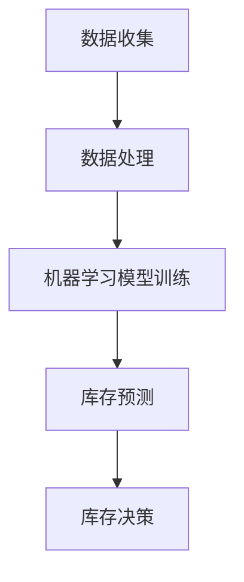

                 

 > **关键词**：智能库存预测、AI、库存管理、一人公司、优化

> **摘要**：随着商业环境的不断变化，库存管理成为企业运营中的一个关键环节。本文将探讨如何利用人工智能技术，尤其是智能库存预测，来帮助一家小型企业优化库存管理，减少成本，提高效益。

## 1. 背景介绍

库存管理是企业运营中的重要组成部分，它直接关系到企业的成本控制、资金流转和客户服务水平。然而，传统的库存管理方法往往依赖于人工经验，效率低下，难以适应市场的快速变化。特别是对于一人公司或小型企业来说，有限的资源和人力资源使得库存管理变得更加困难。

随着人工智能技术的发展，尤其是机器学习和大数据分析技术的应用，智能库存预测成为可能。通过收集和分析历史销售数据、市场趋势以及外部因素，人工智能系统能够更准确地预测未来库存需求，从而帮助企业做出更科学的库存决策。

## 2. 核心概念与联系

### 2.1. 核心概念

- **库存预测**：利用历史数据和算法预测未来一定时间内的库存需求。
- **人工智能**：模拟人类智能的技术，能够学习和适应，从而提高决策准确性。
- **机器学习**：一种人工智能技术，通过从数据中学习规律，提高预测和决策的准确性。

### 2.2. 关联架构图

以下是一个简单的Mermaid流程图，展示智能库存预测系统的基本架构：



## 3. 核心算法原理 & 具体操作步骤

### 3.1. 算法原理概述

智能库存预测的核心是机器学习算法，特别是时间序列预测算法。这些算法通过分析历史销售数据，识别出时间序列中的规律，从而预测未来的库存需求。

### 3.2. 算法步骤详解

1. **数据收集**：收集与企业库存相关的历史数据，包括销售数据、库存数据、市场趋势数据等。
2. **数据处理**：清洗和预处理数据，确保数据质量，消除异常值和噪声。
3. **特征工程**：提取有助于预测的特征，如季节性、节假日效应等。
4. **模型选择**：选择合适的时间序列预测模型，如ARIMA、LSTM等。
5. **模型训练**：使用历史数据训练模型，调整模型参数。
6. **库存预测**：使用训练好的模型预测未来的库存需求。
7. **库存决策**：根据预测结果，制定库存采购和补货策略。

### 3.3. 算法优缺点

- **优点**：提高库存预测的准确性，减少库存成本，提高运营效率。
- **缺点**：需要大量的历史数据支持，模型训练时间较长，对数据处理能力要求较高。

### 3.4. 算法应用领域

智能库存预测广泛应用于电商、制造业、零售业等多个领域，能够帮助企业在库存管理中实现以下目标：

- 减少库存过剩和短缺的风险。
- 优化库存水平，减少资金占用。
- 提高供应链的响应速度。

## 4. 数学模型和公式 & 详细讲解 & 举例说明

### 4.1. 数学模型构建

智能库存预测的核心数学模型通常是一个时间序列模型。以下是一个简化的ARIMA模型：

$$
X_t = \phi_1 X_{t-1} + \phi_2 X_{t-2} + ... + \phi_p X_{t-p} + \theta_1 A_t + \theta_2 A_{t-1} + ... + \theta_q A_{t-q} + \varepsilon_t
$$

其中，$X_t$是时间序列的当前值，$\phi_i$和$\theta_i$是模型参数，$A_t$是白噪声序列，$\varepsilon_t$是误差项。

### 4.2. 公式推导过程

ARIMA模型的推导过程涉及统计学和时间序列分析的理论，这里不详细展开。关键步骤包括：

1. **平稳性检验**：检验时间序列的平稳性。
2. **差分**：对非平稳序列进行差分，使其变为平稳序列。
3. **自相关函数和偏自相关函数**：分析序列的自相关性和偏自相关性，确定模型参数。
4. **模型拟合**：使用最小二乘法或其他优化算法，拟合模型参数。

### 4.3. 案例分析与讲解

假设一家电商企业需要预测下一季的库存需求。通过收集过去五年的季节性销售数据，企业可以使用ARIMA模型进行预测。以下是预测流程：

1. **数据收集**：收集过去五年的季节性销售数据。
2. **数据处理**：对数据进行预处理，包括数据清洗和归一化处理。
3. **模型选择**：根据数据特点选择ARIMA模型，并确定模型参数。
4. **模型训练**：使用历史数据训练模型。
5. **库存预测**：使用训练好的模型预测下一季的库存需求。
6. **库存决策**：根据预测结果，调整库存采购计划。

## 5. 项目实践：代码实例和详细解释说明

### 5.1. 开发环境搭建

在Python中，我们可以使用pandas、statsmodels和scikit-learn等库来构建和训练ARIMA模型。

```python
# 安装必要的库
!pip install pandas statsmodels scikit-learn
```

### 5.2. 源代码详细实现

以下是一个简单的ARIMA模型实现：

```python
import pandas as pd
from statsmodels.tsa.arima.model import ARIMA
import matplotlib.pyplot as plt

# 读取数据
data = pd.read_csv('sales_data.csv')
sales = data['sales']

# 模型训练
model = ARIMA(sales, order=(5, 1, 2))
model_fit = model.fit()

# 预测
forecast = model_fit.forecast(steps=12)

# 可视化结果
plt.plot(sales, label='Actual Sales')
plt.plot(forecast, label='Forecasted Sales')
plt.legend()
plt.show()
```

### 5.3. 代码解读与分析

这段代码首先导入必要的库，然后读取销售数据。接下来，使用ARIMA模型进行训练和预测，并将预测结果可视化。通过这个简单的示例，我们可以看到ARIMA模型的基本使用方法。

### 5.4. 运行结果展示

运行上述代码，我们可以得到实际销售数据和预测销售数据的一个可视化图表，从而直观地看到模型的预测效果。

## 6. 实际应用场景

智能库存预测在多个行业中有着广泛的应用。以下是一些典型的应用场景：

- **电商行业**：通过预测商品销售量，电商平台可以优化库存水平，减少库存积压。
- **制造业**：预测原材料需求，优化生产计划和供应链管理。
- **零售业**：预测商品需求，合理安排补货计划，提高客户满意度。

## 7. 工具和资源推荐

### 7.1. 学习资源推荐

- 《智能库存管理：人工智能与数据分析应用》
- 《Python数据分析：从入门到实战》

### 7.2. 开发工具推荐

- Python及其相关库（pandas、statsmodels、scikit-learn）
- Jupyter Notebook或PyCharm

### 7.3. 相关论文推荐

- "A Comparison of ARIMA and LSTM for Sales Forecasting"
- "Inventory Management and Optimization Using Machine Learning"

## 8. 总结：未来发展趋势与挑战

### 8.1. 研究成果总结

智能库存预测在理论研究和实际应用中取得了显著成果，提高了库存管理的效率和准确性。

### 8.2. 未来发展趋势

随着大数据技术和人工智能的进一步发展，智能库存预测将变得更加精准和自动化。

### 8.3. 面临的挑战

数据质量和处理能力是智能库存预测面临的主要挑战。

### 8.4. 研究展望

未来的研究应重点关注如何进一步提高模型的预测准确性和处理复杂数据的能力。

## 9. 附录：常见问题与解答

### 9.1. 如何处理缺失数据？

缺失数据可以通过数据填充、删除或使用机器学习算法进行预测等方法处理。

### 9.2. ARIMA模型如何选择参数？

通常通过自相关函数和偏自相关函数分析来确定模型参数。此外，可以使用交叉验证等方法进行参数选择。

作者：禅与计算机程序设计艺术 / Zen and the Art of Computer Programming
```

