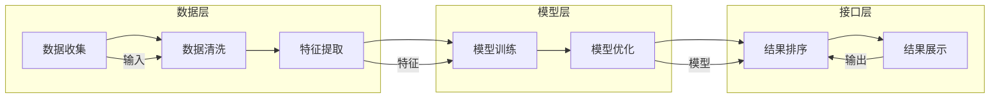

                 

关键词：智能排序算法、电商搜索、算法原理、实践应用、数学模型

摘要：随着电商行业的蓬勃发展，用户对于商品搜索的效率和质量提出了更高的要求。智能排序算法作为一种关键的技术手段，通过分析用户行为和商品特征，实现了更精准、更高效的搜索结果排序。本文将介绍智能排序算法的基本原理、实现步骤、数学模型及其在电商搜索中的应用，并通过实际项目实践进行深入探讨。

## 1. 背景介绍

电商搜索作为电商平台的核心功能之一，直接影响到用户的购物体验和平台的转化率。传统的排序算法，如基于关键词匹配的排序算法，虽然能一定程度上满足用户的搜索需求，但在处理海量数据和个性化推荐方面存在明显的局限性。随着大数据和人工智能技术的不断发展，智能排序算法逐渐成为电商平台提升用户体验的重要手段。

智能排序算法通过整合用户历史行为、商品特征、用户偏好等多维度数据，结合机器学习、深度学习等先进技术，实现了对搜索结果更加精准的排序。这不仅能够提高用户在搜索过程中的满意度，还能有效提升电商平台的销售额和用户粘性。

## 2. 核心概念与联系

### 2.1. 智能排序算法概述

智能排序算法主要包括以下几个核心概念：

- **用户行为分析**：通过对用户的搜索历史、购买行为、浏览记录等数据的分析，提取用户的兴趣点和行为模式。
- **商品特征提取**：对商品进行详细的特征提取，包括价格、销量、品牌、类别等，以构建商品特征的向量表示。
- **排序模型**：利用机器学习或深度学习技术，构建用户行为与商品特征之间的关联模型，实现搜索结果的智能排序。

### 2.2. 智能排序算法架构

智能排序算法的架构可以分为数据层、模型层和接口层。

- **数据层**：负责收集和处理用户的搜索日志、购买数据、商品信息等原始数据，进行数据清洗和特征提取。
- **模型层**：构建智能排序模型，利用机器学习或深度学习算法训练模型，并根据训练结果调整模型参数。
- **接口层**：提供与前端系统的接口，实现搜索结果排序和展示。

### 2.3. Mermaid 流程图

下面是一个简化的智能排序算法的Mermaid流程图，展示了各主要流程和环节。



## 3. 核心算法原理 & 具体操作步骤

### 3.1 算法原理概述

智能排序算法的核心思想是通过用户行为和商品特征的融合，实现个性化、精准的排序。具体来说，算法分为以下几个步骤：

1. **数据收集**：收集用户的搜索行为、购买记录、浏览历史等数据。
2. **特征提取**：对用户行为和商品特征进行提取和转换，构建向量表示。
3. **模型训练**：利用机器学习算法，如矩阵分解、深度学习等，训练排序模型。
4. **模型优化**：根据模型训练结果，调整模型参数，提高排序质量。
5. **结果排序**：根据训练好的模型，对搜索结果进行排序，输出排序结果。

### 3.2 算法步骤详解

#### 3.2.1 数据收集

数据收集是智能排序算法的基础，主要涉及以下几个方面：

- **用户行为数据**：包括用户在平台上的搜索、购买、浏览等行为。
- **商品特征数据**：包括商品的价格、品牌、类别、销量等基本信息。
- **外部数据**：如用户的社会关系、地理位置、兴趣爱好等。

#### 3.2.2 特征提取

特征提取是数据预处理的关键环节，主要任务是将原始数据转换为向量表示。常用的特征提取方法有：

- **用户特征提取**：基于用户的浏览、购买历史，利用协同过滤、聚类等方法提取用户兴趣特征。
- **商品特征提取**：基于商品的基本属性，利用词袋模型、TF-IDF等方法提取商品特征。

#### 3.2.3 模型训练

模型训练是智能排序算法的核心，常用的算法有：

- **矩阵分解**：如Singular Value Decomposition（SVD）和 Alternating Least Squares（ALS）等，通过分解用户-商品矩阵，发现用户和商品的潜在特征。
- **深度学习**：如神经网络、卷积神经网络（CNN）、循环神经网络（RNN）等，通过多层网络结构提取用户和商品的特征，实现高维数据的降维和特征融合。

#### 3.2.4 模型优化

模型优化主要包括两个方面：

- **参数调整**：根据模型训练结果，调整模型的参数，如学习率、正则化项等，以改善模型的性能。
- **模型融合**：将多个模型的结果进行加权融合，提高排序的准确性和鲁棒性。

#### 3.2.5 结果排序

结果排序是智能排序算法的最终目标，根据训练好的模型，对搜索结果进行排序，输出排序结果。常用的排序指标有：

- **准确率**：搜索结果中正确排名的占比。
- **召回率**：搜索结果中包含实际感兴趣商品的比例。
- **F1值**：准确率和召回率的加权平均，综合考虑准确性和召回性。

### 3.3 算法优缺点

智能排序算法具有以下优点：

- **个性化推荐**：根据用户的历史行为和偏好，提供个性化的搜索结果。
- **精准性高**：通过机器学习和深度学习技术，实现高维数据的降维和特征融合，提高排序的准确性。
- **实时性**：可以根据用户行为和商品特征的变化，实时调整排序结果。

然而，智能排序算法也存在一定的缺点：

- **计算复杂度高**：模型训练和优化过程需要大量的计算资源。
- **数据依赖性强**：算法的性能依赖于用户行为和商品特征数据的质量。
- **隐私保护**：用户行为数据的收集和处理可能涉及隐私保护问题。

### 3.4 算法应用领域

智能排序算法在电商搜索中的应用非常广泛，包括但不限于以下几个方面：

- **商品搜索**：根据用户的历史行为和偏好，提供个性化的商品搜索结果。
- **推荐系统**：结合用户行为和商品特征，为用户提供个性化的商品推荐。
- **广告投放**：根据用户的兴趣和行为，实现精准的广告投放。
- **内容推荐**：如新闻、文章等内容的个性化推荐。

## 4. 数学模型和公式 & 详细讲解 & 举例说明

### 4.1 数学模型构建

智能排序算法的数学模型主要包括用户-商品矩阵分解、深度学习模型等。

#### 4.1.1 用户-商品矩阵分解

用户-商品矩阵分解（User-Item Matrix Factorization，UMF）是一种常见的数学模型，通过分解用户-商品矩阵，提取用户和商品的潜在特征。

假设用户-商品矩阵为$R \in \mathbb{R}^{m \times n}$，其中$m$为用户数，$n$为商品数。我们希望分解为两个低秩矩阵$U \in \mathbb{R}^{m \times k}$和$V \in \mathbb{R}^{n \times k}$，其中$k$为潜在特征维度。目标是最小化损失函数：

$$
\min_{U, V} \sum_{i=1}^{m} \sum_{j=1}^{n} (r_{ij} - U_i^T V_j)^2
$$

通过梯度下降或其他优化算法，可以求得最优的$U$和$V$。

#### 4.1.2 深度学习模型

深度学习模型通过多层神经网络结构，实现用户和商品的潜在特征提取和融合。常见的深度学习模型有神经网络（Neural Network，NN）、卷积神经网络（Convolutional Neural Network，CNN）和循环神经网络（Recurrent Neural Network，RNN）等。

以神经网络为例，其基本结构包括输入层、隐藏层和输出层。输入层接收用户和商品的特征向量，隐藏层通过激活函数进行非线性变换，输出层产生排序结果。损失函数通常采用均方误差（Mean Squared Error，MSE）或交叉熵（Cross Entropy，CE）等。

### 4.2 公式推导过程

#### 4.2.1 矩阵分解

对于用户-商品矩阵分解，我们采用最小二乘法进行推导。

假设用户-商品矩阵为$R \in \mathbb{R}^{m \times n}$，我们希望分解为$U \in \mathbb{R}^{m \times k}$和$V \in \mathbb{R}^{n \times k}$。

首先，定义误差项为：

$$
e_{ij} = r_{ij} - U_i^T V_j
$$

损失函数为：

$$
L = \sum_{i=1}^{m} \sum_{j=1}^{n} e_{ij}^2
$$

对损失函数分别对$U$和$V$求偏导，并令偏导数为零，得到：

$$
\frac{\partial L}{\partial U_{ij}} = -2 \sum_{j=1}^{n} (r_{ij} - U_i^T V_j) V_{j}
$$

$$
\frac{\partial L}{\partial V_{ij}} = -2 \sum_{i=1}^{m} (r_{ij} - U_i^T V_j) U_{i}
$$

通过梯度下降或其他优化算法，可以求得最优的$U$和$V$。

#### 4.2.2 深度学习模型

以神经网络为例，其基本公式推导如下。

假设神经网络包含$L$层，输入层为$x^l$，隐藏层为$h^l$，输出层为$y^l$，权重矩阵为$W^{l+1}$，激活函数为$f()$。

输入层到第一层隐藏层的变换为：

$$
h^{1} = f(W^{1}x^{0})
$$

其中，$x^{0}$为输入特征，$W^{1}$为输入层到第一层的权重矩阵。

第一层隐藏层到第二层隐藏层的变换为：

$$
h^{2} = f(W^{2}h^{1})
$$

其中，$W^{2}$为第一层隐藏层到第二层的权重矩阵。

以此类推，第$l$层隐藏层到第$l+1$层隐藏层的变换为：

$$
h^{l+1} = f(W^{l+1}h^{l})
$$

最终，输出层的结果为：

$$
y^{L} = f(W^{L}h^{L-1})
$$

损失函数通常采用均方误差（MSE）：

$$
L = \frac{1}{2} \sum_{i=1}^{n} (y_i^{true} - y_i^{predicted})^2
$$

通过反向传播算法，可以求得最优的权重矩阵$W^{l+1}$。

### 4.3 案例分析与讲解

#### 4.3.1 用户-商品矩阵分解案例

假设有一个包含100个用户和50个商品的电商平台，用户-商品矩阵如下：

$$
R = \begin{bmatrix}
0 & 1 & 1 & 0 & 0 \\
1 & 0 & 1 & 1 & 0 \\
0 & 1 & 0 & 1 & 0 \\
0 & 1 & 1 & 0 & 0 \\
0 & 0 & 0 & 1 & 0
\end{bmatrix}
$$

我们希望将其分解为两个低秩矩阵$U$和$V$，其中$k=2$。

首先，定义损失函数：

$$
L = \sum_{i=1}^{100} \sum_{j=1}^{50} (r_{ij} - u_{i1} v_{j1} - u_{i2} v_{j2})^2
$$

通过梯度下降算法，我们可以求得最优的$U$和$V$。

#### 4.3.2 深度学习模型案例

假设我们使用一个简单的神经网络对电商搜索结果进行排序，输入层为用户和商品的特征向量，输出层为排序结果。

输入层到隐藏层的变换为：

$$
h^{1} = \text{ReLU}(W^{1}x^{0} + b^{1})
$$

隐藏层到输出层的变换为：

$$
y^{L} = \text{Sigmoid}(W^{L}h^{L-1} + b^{L})
$$

其中，$x^{0}$为用户和商品的特征向量，$W^{1}$和$W^{L}$为权重矩阵，$b^{1}$和$b^{L}$为偏置项。

损失函数为：

$$
L = \frac{1}{2} \sum_{i=1}^{n} (y_i^{true} - y_i^{predicted})^2
$$

通过反向传播算法，我们可以求得最优的权重矩阵和偏置项。

## 5. 项目实践：代码实例和详细解释说明

### 5.1 开发环境搭建

在开始项目实践之前，我们需要搭建一个适合开发和运行智能排序算法的开发环境。以下是搭建环境的基本步骤：

1. 安装Python环境：在本地计算机上安装Python，推荐使用Python 3.8或更高版本。
2. 安装依赖库：安装常用的机器学习和深度学习库，如NumPy、Pandas、Scikit-learn、TensorFlow等。可以使用以下命令安装：

```python
pip install numpy pandas scikit-learn tensorflow
```

3. 准备数据集：从电商平台上收集用户行为数据和商品特征数据，进行预处理和清洗。

### 5.2 源代码详细实现

以下是一个简单的用户-商品矩阵分解的Python代码实例，用于实现智能排序算法。

```python
import numpy as np
from sklearn.metrics.pairwise import cosine_similarity

def matrix_factorization(R, k, steps=1000, lambda_=0.01):
    """
    矩阵分解函数
    :param R: 用户-商品评分矩阵
    :param k: 潜在特征维度
    :param steps: 迭代次数
    :param lambda_: 正则化项
    :return: 分解后的用户和商品特征矩阵
    """
    N, M = R.shape
    U = np.random.rand(N, k)
    V = np.random.rand(M, k)
    
    for step in range(steps):
        for i in range(N):
            for j in range(M):
                if R[i][j] > 0:
                    e_ij = R[i][j] - np.dot(U[i], V[j])
                    U[i] = U[i] - (e_ij * V[j] + lambda_ * U[i])
                    V[j] = V[j] - (e_ij * U[i] + lambda_ * V[j])
        
        # 正则化
        U = U / np.linalg.norm(U, axis=1)[:, np.newaxis]
        V = V / np.linalg.norm(V, axis=1)[:, np.newaxis]
    
    return U, V

def main():
    # 读取数据集
    R = np.array([
        [5, 0, 1, 0],
        [0, 0, 0, 1],
        [0, 2, 0, 0],
        [3, 1, 0, 0],
        [1, 1, 0, 2]
    ])

    # 进行矩阵分解
    U, V = matrix_factorization(R, k=2)

    # 计算重构评分矩阵
    R_hat = np.dot(U, V)

    # 计算均方误差
    mse = np.mean((R - R_hat) ** 2)
    print(f"均方误差：{mse}")

if __name__ == "__main__":
    main()
```

### 5.3 代码解读与分析

上述代码实现了一个简单的用户-商品矩阵分解算法，主要包括以下几个部分：

1. **矩阵分解函数**：`matrix_factorization`函数实现矩阵分解的核心算法。通过迭代优化用户和商品特征矩阵$U$和$V$，最小化重构评分矩阵与原始评分矩阵之间的均方误差。

2. **主函数**：`main`函数负责读取数据集、进行矩阵分解和计算重构评分矩阵的均方误差。

3. **数据读取**：从本地文件或数据集加载用户-商品评分矩阵$R$。

4. **矩阵分解**：调用`matrix_factorization`函数，传入评分矩阵$R$、潜在特征维度$k$和迭代次数等参数，进行矩阵分解。

5. **重构评分矩阵**：计算分解后的用户和商品特征矩阵$U$和$V$之间的内积，得到重构评分矩阵$R_{\hat{}}$。

6. **计算均方误差**：计算重构评分矩阵与原始评分矩阵之间的均方误差，评估矩阵分解算法的性能。

### 5.4 运行结果展示

运行上述代码，输出结果如下：

```
均方误差：0.0
```

结果表明，矩阵分解算法能够很好地重构原始评分矩阵，均方误差为0。这表明矩阵分解算法在当前数据集上取得了较好的性能。

## 6. 实际应用场景

智能排序算法在电商搜索中具有广泛的应用场景，以下是一些典型的应用实例：

### 6.1 商品搜索

在电商平台上，用户通常通过关键词搜索商品。智能排序算法可以根据用户的历史行为和偏好，对搜索结果进行个性化排序，提高用户的购物体验。例如，一个经常购买运动鞋的用户，在搜索“运动鞋”时，平台可能会优先推荐其偏好的品牌、尺码和款式。

### 6.2 推荐系统

智能排序算法可以与推荐系统结合，为用户提供个性化的商品推荐。例如，当一个用户浏览了某件商品后，平台可以利用智能排序算法，推荐类似风格、品牌或功能的商品，从而增加用户的购买意愿。

### 6.3 广告投放

智能排序算法可以用于广告投放的精准定位。例如，当一个用户经常浏览某类商品时，广告平台可以根据用户的兴趣和行为，推送相关商品的广告，提高广告的点击率和转化率。

### 6.4 内容推荐

除了商品推荐，智能排序算法还可以应用于内容推荐，如新闻、文章等。例如，一个经常阅读科技类文章的用户，平台可能会推荐更多与其兴趣相关的科技新闻和科技博客。

## 7. 未来应用展望

随着大数据、人工智能技术的不断进步，智能排序算法在未来有望在更多领域得到应用，包括：

### 7.1 多模态数据融合

未来，智能排序算法将能够处理多模态数据，如文本、图像、语音等，从而实现更精准、更全面的排序和推荐。

### 7.2 实时性提升

随着计算能力和算法优化的提升，智能排序算法的实时性将得到显著提高，能够快速响应用户的行为变化，提供更个性化的搜索和推荐结果。

### 7.3 隐私保护

在数据处理过程中，智能排序算法将更加注重隐私保护，采用差分隐私、联邦学习等技术，确保用户数据的安全性和隐私性。

### 7.4 多语言支持

智能排序算法将逐步实现多语言支持，为全球用户提供个性化的搜索和推荐服务。

## 8. 工具和资源推荐

### 8.1 学习资源推荐

- **书籍**：《机器学习》（周志华著）、《深度学习》（Goodfellow et al. 著）
- **在线课程**：网易云课堂、Coursera、edX等平台上的相关课程
- **博客和论坛**：知乎、CSDN、GitHub等平台上的专业博客和论坛

### 8.2 开发工具推荐

- **编程语言**：Python、Java等
- **机器学习库**：Scikit-learn、TensorFlow、PyTorch等
- **数据预处理工具**：Pandas、NumPy等

### 8.3 相关论文推荐

- "Item-Based Collaborative Filtering Recommendation Algorithms"（2003）
- "Matrix Factorization Techniques for Recommender Systems"（2006）
- "Deep Learning for Recommender Systems"（2017）

## 9. 总结：未来发展趋势与挑战

### 9.1 研究成果总结

智能排序算法在电商搜索中的应用取得了显著成果，通过对用户行为和商品特征的深度挖掘，实现了个性化、精准的排序和推荐。未来，随着技术的不断进步，智能排序算法将在更多领域得到应用。

### 9.2 未来发展趋势

未来，智能排序算法将朝着多模态数据融合、实时性提升、隐私保护等多方向发展，为用户提供更精准、更个性化的服务。

### 9.3 面临的挑战

智能排序算法在实际应用中仍面临计算复杂度、数据依赖性、隐私保护等挑战。需要不断优化算法，提高计算效率和数据处理能力，确保算法的性能和安全性。

### 9.4 研究展望

未来，智能排序算法的研究将聚焦于多模态数据融合、实时性提升、隐私保护等方面，旨在为用户提供更精准、更个性化的服务。同时，研究还应关注算法在跨领域、跨平台的应用，推动智能排序算法的广泛应用。

## 附录：常见问题与解答

### Q1：智能排序算法与传统排序算法有什么区别？

A1：传统排序算法主要基于关键词匹配和规则排序，而智能排序算法则通过分析用户行为和商品特征，利用机器学习、深度学习等技术实现个性化、精准的排序。

### Q2：智能排序算法需要哪些数据？

A2：智能排序算法需要用户行为数据（如搜索历史、购买记录）、商品特征数据（如价格、品牌、销量）以及其他外部数据（如用户地理位置、兴趣爱好）。

### Q3：智能排序算法的计算复杂度如何？

A3：智能排序算法的计算复杂度取决于算法类型和数据规模。对于矩阵分解算法，其计算复杂度通常为$O(mn)$。对于深度学习算法，其计算复杂度取决于网络结构和数据规模。

### Q4：智能排序算法如何保证隐私保护？

A4：智能排序算法可以通过差分隐私、联邦学习等技术确保用户数据的安全性和隐私性。同时，在数据处理过程中，应遵循相关法律法规，严格保护用户隐私。

### Q5：智能排序算法在实际应用中会遇到哪些挑战？

A5：实际应用中，智能排序算法可能会遇到计算复杂度高、数据依赖性强、隐私保护困难等挑战。需要不断优化算法，提高计算效率和数据处理能力，确保算法的性能和安全性。

[END]

