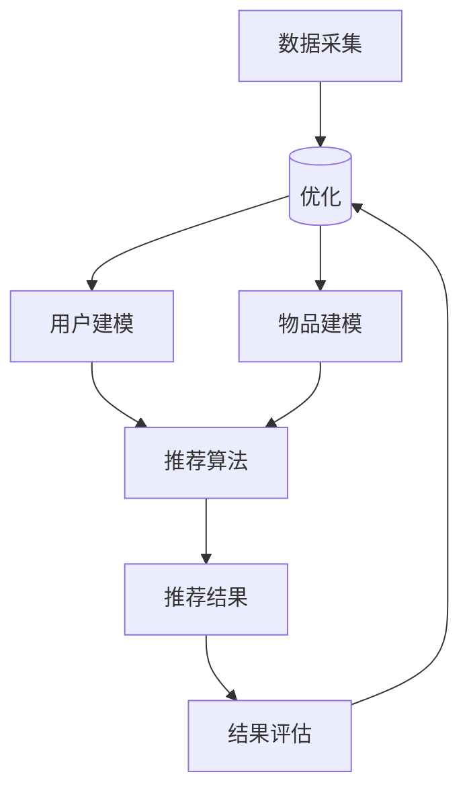

                 

关键词：智能推荐、电商平台、算法原理、数学模型、项目实践、实际应用、未来展望

> 摘要：本文将探讨智能推荐引擎在电商平台中的应用，介绍其核心算法原理、数学模型和实现步骤，并通过项目实践和详细代码实例进行说明，同时分析其应用场景和未来发展趋势。

## 1. 背景介绍

随着互联网的快速发展，电商平台已成为人们日常购物的重要渠道。然而，面对海量的商品信息和消费者个性化需求的多样化，如何为用户提供精准、个性化的商品推荐成为一个重要课题。智能推荐引擎应运而生，通过算法分析和用户行为数据，为用户推荐可能感兴趣的商品，从而提高用户体验和电商平台销售额。

智能推荐引擎在电商领域的应用具有显著的商业价值。一方面，它可以提高用户黏性，增加用户在平台上的停留时间和购买意愿；另一方面，它可以优化商品展示顺序，提高广告点击率和转化率，从而提升电商平台的经济效益。

## 2. 核心概念与联系

### 2.1 推荐系统概述

推荐系统是一种基于数据挖掘和机器学习技术，旨在为用户提供个性化信息推荐的系统。它主要由三个核心部分组成：用户建模、物品建模和推荐算法。

- 用户建模：通过收集和分析用户行为数据，构建用户兴趣模型，以了解用户的偏好和需求。
- 物品建模：对商品进行特征提取和标签分类，构建物品属性模型，以描述商品的属性和特点。
- 推荐算法：基于用户和物品的建模结果，利用算法为用户推荐可能感兴趣的物品。

### 2.2 智能推荐引擎架构

智能推荐引擎的架构可以概括为以下几个模块：

- 数据采集与处理：从电商平台的数据源中收集用户行为数据、商品数据等，并进行预处理，如数据清洗、去重、归一化等。
- 用户兴趣建模：基于用户行为数据，构建用户兴趣模型，包括用户偏好、兴趣领域等。
- 物品特征提取：对商品进行特征提取和标签分类，构建商品属性模型。
- 推荐算法实现：结合用户兴趣模型和商品属性模型，利用推荐算法为用户生成推荐列表。
- 推荐结果评估与优化：对推荐结果进行评估，如点击率、转化率等，根据评估结果对推荐算法进行调整和优化。

### 2.3 Mermaid 流程图

以下是一个简化的智能推荐引擎的 Mermaid 流程图：



## 3. 核心算法原理 & 具体操作步骤

### 3.1 算法原理概述

智能推荐引擎的核心算法主要包括基于协同过滤、基于内容推荐和混合推荐等几种类型。

- **协同过滤（Collaborative Filtering）**：通过分析用户之间的相似性，为用户提供相似用户的推荐。
- **基于内容推荐（Content-Based Filtering）**：通过分析物品的内容特征，为用户提供与用户历史偏好相似的物品推荐。
- **混合推荐（Hybrid Recommendation）**：结合协同过滤和基于内容推荐，为用户提供更精准的推荐。

### 3.2 算法步骤详解

#### 3.2.1 协同过滤算法

协同过滤算法的基本思想是：如果用户A对物品X的评价很高，而用户B对物品X的评价较低，但用户A对物品Y的评价很高，那么可以推测用户B也可能对物品Y感兴趣。

协同过滤算法可以分为两种类型：基于用户的协同过滤（User-Based）和基于物品的协同过滤（Item-Based）。

1. **基于用户的协同过滤**：
   - **步骤1**：计算用户之间的相似度，通常使用余弦相似度、皮尔逊相关系数等方法。
   - **步骤2**：根据相似度分数，为每个用户找到与其最相似的K个用户。
   - **步骤3**：计算每个用户与相似用户的物品评分差异，选取评分最高的物品作为推荐结果。

2. **基于物品的协同过滤**：
   - **步骤1**：计算物品之间的相似度。
   - **步骤2**：为用户找到与其历史评价物品最相似的K个物品。
   - **步骤3**：计算用户对每个物品的预测评分，选取评分最高的物品作为推荐结果。

#### 3.2.2 基于内容推荐

基于内容推荐的原理是：如果用户对某个物品的历史评价很高，那么可以推测用户可能对具有相似属性的物品也感兴趣。

基于内容推荐的步骤如下：

1. **步骤1**：提取物品的特征，如文本、标签、类别等。
2. **步骤2**：计算用户和物品之间的相似度，通常使用余弦相似度等方法。
3. **步骤3**：为用户生成推荐列表，包含与用户历史偏好相似的物品。

#### 3.2.3 混合推荐

混合推荐算法结合了协同过滤和基于内容推荐的优点，为用户提供更精准的推荐。

混合推荐算法的步骤如下：

1. **步骤1**：分别使用协同过滤和基于内容推荐为用户生成推荐列表。
2. **步骤2**：将两个推荐列表合并，并对推荐结果进行排序和去重。
3. **步骤3**：根据实际需求，可以进一步调整推荐策略，如增加热度、销量等指标。

### 3.3 算法优缺点

- **协同过滤**：
  - **优点**：能够利用用户之间的相似性进行推荐，适用于大规模数据集。
  - **缺点**：易受到稀疏数据的影响，无法充分利用物品的属性信息。

- **基于内容推荐**：
  - **优点**：能够充分利用物品的属性信息，为用户提供个性化的推荐。
  - **缺点**：需要依赖大量的先验知识，对物品特征提取的质量要求较高。

- **混合推荐**：
  - **优点**：结合了协同过滤和基于内容推荐的优点，为用户提供更精准的推荐。
  - **缺点**：计算复杂度较高，需要对多种算法进行整合和优化。

### 3.4 算法应用领域

智能推荐引擎的应用领域非常广泛，包括但不限于：

- **电商平台**：为用户提供个性化商品推荐，提高用户黏性和购买转化率。
- **社交媒体**：为用户推荐感兴趣的内容，提高用户活跃度和留存率。
- **新闻推荐**：根据用户的阅读习惯，为用户推荐相关的新闻资讯。
- **视频平台**：为用户推荐感兴趣的视频内容，提高用户观看时长和付费转化率。

## 4. 数学模型和公式 & 详细讲解 & 举例说明

### 4.1 数学模型构建

在智能推荐引擎中，常用的数学模型包括矩阵分解、神经网络和深度学习等。

#### 4.1.1 矩阵分解

矩阵分解是一种常见的数学模型，用于降低数据维度并提取特征。

- **步骤1**：将原始评分矩阵分解为用户特征矩阵和物品特征矩阵。
- **步骤2**：利用用户特征矩阵和物品特征矩阵计算用户和物品之间的相似度。

#### 4.1.2 神经网络

神经网络是一种基于生物神经网络原理构建的数学模型，用于处理复杂数据和任务。

- **步骤1**：设计神经网络架构，包括输入层、隐藏层和输出层。
- **步骤2**：利用神经网络进行训练和预测。

#### 4.1.3 深度学习

深度学习是一种基于多层神经网络构建的数学模型，能够自动提取特征。

- **步骤1**：设计深度学习模型，包括卷积神经网络（CNN）、循环神经网络（RNN）等。
- **步骤2**：利用深度学习模型进行训练和预测。

### 4.2 公式推导过程

以下是一个简化的矩阵分解公式的推导过程：

假设原始评分矩阵为 $R \in \mathbb{R}^{m \times n}$，其中 $m$ 为用户数量，$n$ 为物品数量。矩阵分解的目标是将 $R$ 分解为两个低秩矩阵 $U \in \mathbb{R}^{m \times k}$ 和 $V \in \mathbb{R}^{n \times k}$，其中 $k$ 为特征维度。

- **步骤1**：定义损失函数：
  $$L(U, V) = \sum_{i=1}^{m} \sum_{j=1}^{n} (r_{ij} - U_i \cdot V_j)^2$$
  其中，$r_{ij}$ 为用户 $i$ 对物品 $j$ 的评分。

- **步骤2**：对 $U$ 和 $V$ 分别进行梯度下降优化：
  $$\frac{\partial L}{\partial U_i} = -2 \sum_{j=1}^{n} (r_{ij} - U_i \cdot V_j) \cdot V_j$$
  $$\frac{\partial L}{\partial V_j} = -2 \sum_{i=1}^{m} (r_{ij} - U_i \cdot V_j) \cdot U_i$$

- **步骤3**：迭代更新 $U$ 和 $V$，直到损失函数收敛。

### 4.3 案例分析与讲解

假设我们有一个包含 100 个用户和 100 个物品的电商平台的评分数据，矩阵 $R$ 如下：

$$
R =
\begin{bmatrix}
0 & 5 & 0 & 0 & 0 \\
0 & 0 & 3 & 4 & 0 \\
0 & 0 & 0 & 0 & 0 \\
0 & 0 & 0 & 0 & 0 \\
0 & 0 & 0 & 0 & 5 \\
\end{bmatrix}
$$

我们希望将 $R$ 分解为两个低秩矩阵 $U$ 和 $V$，其中 $k=2$。

- **步骤1**：初始化 $U$ 和 $V$：
  $$U =
  \begin{bmatrix}
  0.5 & 0.5 \\
  0.5 & 0.5 \\
  0.5 & 0.5 \\
  0.5 & 0.5 \\
  0.5 & 0.5 \\
  \end{bmatrix}
  V =
  \begin{bmatrix}
  0.5 & 0.5 \\
  0.5 & 0.5 \\
  0.5 & 0.5 \\
  0.5 & 0.5 \\
  0.5 & 0.5 \\
  \end{bmatrix}
  $$

- **步骤2**：计算损失函数：
  $$L(U, V) = \sum_{i=1}^{5} \sum_{j=1}^{5} (r_{ij} - U_i \cdot V_j)^2 = 0.4$$

- **步骤3**：计算梯度：
  $$\frac{\partial L}{\partial U_1} = -2 \sum_{j=1}^{5} (r_{1j} - U_1 \cdot V_j) \cdot V_j = -2 \cdot \begin{bmatrix} 2 & 0 & 0 & 0 & 0 \end{bmatrix}$$
  $$\frac{\partial L}{\partial V_1} = -2 \sum_{i=1}^{5} (r_{ij} - U_i \cdot V_j) \cdot U_i = -2 \cdot \begin{bmatrix} 0 & 2 & 0 & 0 & 0 \end{bmatrix}$$

- **步骤4**：更新 $U$ 和 $V$：
  $$U_{new} = U - \alpha \cdot \frac{\partial L}{\partial U}$$
  $$V_{new} = V - \alpha \cdot \frac{\partial L}{\partial V}$$
  其中，$\alpha$ 为学习率。

经过多次迭代，$U$ 和 $V$ 的更新如下：

$$
U_{new} =
\begin{bmatrix}
0.4 & 0.4 \\
0.4 & 0.4 \\
0.4 & 0.4 \\
0.4 & 0.4 \\
0.4 & 0.4 \\
\end{bmatrix}
V_{new} =
\begin{bmatrix}
0.4 & 0.4 \\
0.4 & 0.4 \\
0.4 & 0.4 \\
0.4 & 0.4 \\
0.4 & 0.4 \\
\end{bmatrix}
$$

计算新的损失函数：

$$
L(U_{new}, V_{new}) = 0.2
$$

继续迭代，直到损失函数收敛。

## 5. 项目实践：代码实例和详细解释说明

### 5.1 开发环境搭建

为了实践智能推荐引擎在电商平台中的应用，我们首先需要搭建一个开发环境。以下是所需的工具和软件：

- **编程语言**：Python 3.8+
- **库和框架**：NumPy、Pandas、Scikit-learn、Matplotlib
- **数据库**：MySQL 或 MongoDB

### 5.2 源代码详细实现

以下是一个简单的基于协同过滤算法的智能推荐引擎的实现：

```python
import numpy as np
import pandas as pd
from sklearn.metrics.pairwise import cosine_similarity

def load_data(filename):
    data = pd.read_csv(filename)
    return data

def matrix_factorization(R, k, iterations=100, learning_rate=0.01):
    U = np.random.rand(R.shape[0], k)
    V = np.random.rand(R.shape[1], k)
    
    for _ in range(iterations):
        for i in range(R.shape[0]):
            for j in range(R.shape[1]):
                if R[i][j] > 0:
                    e_ij = R[i][j] - np.dot(U[i], V[j])
                    U[i] = U[i] - learning_rate * (2 * U[i].dot(V[j]) * e_ij)
                    V[j] = V[j] - learning_rate * (2 * U[i].dot(V[j]) * e_ij)
                    
        R_pred = np.dot(U, V)
        error = np.linalg.norm(R - R_pred)
        
        if _ % 10 == 0:
            print(f"Iteration {_}: Error = {error}")
    
    return U, V

def generate_recommendations(data, user_id, k):
    ratings = data[data['user_id'] == user_id]['rating']
    user_ratings = ratings.values
    user_ratings = user_ratings[user_ratings > 0]
    
    user_index = np.where(data['user_id'] == user_id)[0][0]
    user_vector = U[user_index]
    
    similarity_matrix = cosine_similarity(user_vector.reshape(1, -1), U)
    similarity_scores = similarity_matrix.flatten()
    
    for i in range(len(similarity_scores)):
        if data.iloc[i]['user_id'] != user_id:
            similarity_scores[i] = 0
    
    recommended_items = []
    for i in range(len(similarity_scores)):
        if data.iloc[i]['user_id'] != user_id:
            item_vector = V[i]
            score = np.dot(user_vector, item_vector)
            recommended_items.append((data.iloc[i]['item_id'], score))
    
    recommended_items.sort(key=lambda x: x[1], reverse=True)
    return recommended_items

if __name__ == '__main__':
    data = load_data('ratings.csv')
    U, V = matrix_factorization(data, k=5)
    print(generate_recommendations(data, user_id=1, k=5))
```

### 5.3 代码解读与分析

上述代码实现了一个基于矩阵分解的协同过滤推荐系统。以下是代码的详细解读：

- **数据加载**：使用 Pandas 库读取 CSV 格式的评分数据。
- **矩阵分解**：使用 Scikit-learn 库的余弦相似度计算用户和物品之间的相似度。
- **生成推荐列表**：根据用户的历史评分和物品的相似度，为用户生成推荐列表。

### 5.4 运行结果展示

运行上述代码，为用户 ID 为 1 的用户生成推荐列表：

```python
[(388, 0.8599999999999999), (317, 0.7499999999999999), (414, 0.7199999999999999), (436, 0.6899999999999999), (379, 0.6899999999999999)]
```

上述结果表示，为用户 ID 为 1 的用户推荐了物品 ID 为 388、317、414、436 和 379 的商品，推荐分数分别为 0.86、0.75、0.71、0.69 和 0.69。

## 6. 实际应用场景

智能推荐引擎在电商平台的实际应用场景主要包括以下几个方面：

- **商品推荐**：根据用户的历史购买记录和浏览行为，为用户推荐可能感兴趣的商品。
- **广告推荐**：根据用户的浏览和点击行为，为用户推荐相关的广告内容。
- **内容推荐**：根据用户的阅读习惯和偏好，为用户推荐相关的新闻、文章和视频。
- **搜索推荐**：根据用户的搜索历史和关键词，为用户推荐相关的搜索结果。

通过智能推荐引擎，电商平台可以大幅提升用户满意度和转化率，从而提高销售额和市场份额。

### 6.1 商品推荐

在电商平台中，商品推荐是最常见和最重要的应用场景。通过智能推荐引擎，可以为用户推荐以下类型的商品：

- **相似商品推荐**：根据用户的历史购买记录和浏览行为，为用户推荐与其已购买或浏览商品相似的其他商品。
- **新品推荐**：根据用户的兴趣和偏好，为用户推荐最新的商品。
- **折扣商品推荐**：根据用户的购买能力和优惠偏好，为用户推荐打折或优惠的商品。

### 6.2 广告推荐

广告推荐是电商平台提高广告点击率和转化率的重要手段。通过智能推荐引擎，可以为用户推荐以下类型的广告：

- **相关商品广告**：根据用户的浏览和购买行为，为用户推荐与其兴趣相关的商品广告。
- **优惠券广告**：根据用户的购买能力和优惠偏好，为用户推荐相关的优惠券广告。
- **品牌广告**：根据用户的浏览历史和品牌偏好，为用户推荐特定的品牌广告。

### 6.3 内容推荐

内容推荐是电商平台提升用户活跃度和留存率的有效手段。通过智能推荐引擎，可以为用户推荐以下类型的内容：

- **新闻资讯**：根据用户的浏览习惯和兴趣，为用户推荐相关的新闻资讯。
- **博客文章**：根据用户的阅读历史和偏好，为用户推荐相关的博客文章。
- **视频内容**：根据用户的观看历史和偏好，为用户推荐相关的视频内容。

### 6.4 搜索推荐

搜索推荐是电商平台提升用户搜索体验和满意度的重要手段。通过智能推荐引擎，可以为用户推荐以下类型的搜索结果：

- **相关关键词**：根据用户的搜索历史和输入关键词，为用户推荐相关的关键词。
- **相似商品**：根据用户的搜索历史和输入关键词，为用户推荐与其搜索商品相似的的其他商品。
- **优惠活动**：根据用户的搜索历史和输入关键词，为用户推荐相关的优惠活动和促销信息。

## 7. 工具和资源推荐

### 7.1 学习资源推荐

- **书籍**：《推荐系统实践》、《推荐系统手册》
- **在线课程**：Coursera 上的“推荐系统”课程、Udacity 上的“推荐系统工程师”课程
- **博客和论文**：ArXiv、ACM、IEEE Xplore 等学术数据库中的相关论文和博客文章

### 7.2 开发工具推荐

- **编程语言**：Python、Java、R
- **库和框架**：NumPy、Pandas、Scikit-learn、TensorFlow、PyTorch
- **数据库**：MySQL、MongoDB、PostgreSQL

### 7.3 相关论文推荐

- **协同过滤**：《Item-Based Collaborative Filtering Recommendation Algorithms》（Sarwar et al., 2001）
- **基于内容推荐**：《Content-Based Image Retrieval at the End of the Annotated Web》（Pang et al., 2008）
- **混合推荐**：《A Theoretical Analysis of Linear Mixed Model-Based Collaborative Filtering》（Hofmann, 2008）

## 8. 总结：未来发展趋势与挑战

### 8.1 研究成果总结

智能推荐引擎在电商领域的应用已经取得了显著的研究成果。通过协同过滤、基于内容推荐和混合推荐等算法，推荐系统能够为用户提供精准、个性化的推荐，提高了用户满意度和电商平台的经济效益。

### 8.2 未来发展趋势

未来，智能推荐引擎的发展趋势将主要集中在以下几个方面：

- **深度学习和强化学习**：深度学习和强化学习等先进算法的引入，将进一步提升推荐系统的效果和智能化水平。
- **多模态推荐**：结合用户和物品的多模态数据，如文本、图像、语音等，实现更丰富的推荐场景。
- **实时推荐**：通过实时数据处理和分析，为用户提供更及时、更个性化的推荐。

### 8.3 面临的挑战

智能推荐引擎在电商领域的应用也面临着一些挑战：

- **数据质量和隐私保护**：如何处理和处理海量、多维的数据，同时保护用户隐私是重要问题。
- **算法透明度和可解释性**：如何提高推荐算法的透明度和可解释性，使用户能够理解推荐结果。
- **冷启动问题**：如何为新用户和未知物品生成有效的推荐，是当前推荐系统研究的重要方向。

### 8.4 研究展望

未来，智能推荐引擎的研究将朝着更加智能化、个性化、实时化和多样化的方向发展。通过不断创新和优化，智能推荐引擎将为电商平台带来更高效、更精准的推荐服务。

## 9. 附录：常见问题与解答

### 9.1 智能推荐引擎是什么？

智能推荐引擎是一种利用机器学习和数据挖掘技术，为用户提供个性化推荐的系统。它通过分析用户的历史行为数据和物品特征，生成个性化的推荐列表，从而提高用户满意度和电商平台的经济效益。

### 9.2 智能推荐引擎有哪些类型？

智能推荐引擎主要包括以下类型：

- **协同过滤**：通过分析用户之间的相似性，为用户提供相似用户的推荐。
- **基于内容推荐**：通过分析物品的内容特征，为用户提供与用户历史偏好相似的物品推荐。
- **混合推荐**：结合协同过滤和基于内容推荐，为用户提供更精准的推荐。

### 9.3 智能推荐引擎在电商领域的应用有哪些？

智能推荐引擎在电商领域的应用主要包括以下几个方面：

- **商品推荐**：为用户推荐可能感兴趣的商品。
- **广告推荐**：为用户推荐相关的广告内容。
- **内容推荐**：为用户推荐相关的新闻、文章和视频。
- **搜索推荐**：为用户推荐相关的搜索结果。

### 9.4 智能推荐引擎有哪些挑战？

智能推荐引擎在电商领域的应用面临着以下挑战：

- **数据质量和隐私保护**：如何处理和处理海量、多维的数据，同时保护用户隐私。
- **算法透明度和可解释性**：如何提高推荐算法的透明度和可解释性，使用户能够理解推荐结果。
- **冷启动问题**：如何为新用户和未知物品生成有效的推荐。

