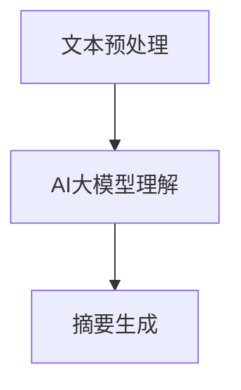

                 

 摘要：随着人工智能技术的快速发展，智能文本摘要作为一种重要的信息处理方法，越来越受到关注。本文将深入探讨智能文本摘要的背景、核心概念、算法原理、数学模型及其在实际应用中的表现。通过详细的分析和实例说明，本文旨在为读者提供一幅全面、系统的智能文本摘要应用图景。

## 1. 背景介绍

在信息爆炸的时代，如何从海量的文本数据中快速、准确地提取关键信息，成为了一个亟待解决的问题。传统的文本摘要方法主要依赖于人工或简单的自动摘要算法，这些方法在处理大量数据时效率低下，且难以保证摘要的质量。随着深度学习技术的迅猛发展，AI大模型在文本理解、生成和摘要方面展现出了强大的潜力。智能文本摘要作为一种结合了AI大模型优势的信息处理方法，正逐渐成为解决信息过载问题的关键手段。

## 2. 核心概念与联系

智能文本摘要的核心在于对大量文本数据进行高效的信息提取和内容重构。首先，需要对文本进行预处理，包括分词、去停用词、词性标注等。然后，利用AI大模型对预处理后的文本进行深入理解，提取关键信息，并生成简洁、连贯的摘要。以下是一个简化的Mermaid流程图，展示了智能文本摘要的基本架构：



### 2.1 文本预处理

文本预处理是智能文本摘要的第一步，其目的是将原始文本转化为适合模型输入的形式。预处理过程通常包括：

- **分词**：将文本拆分成一个个独立的词或短语。
- **去停用词**：去除常见的无意义词汇，如“的”、“了”、“在”等。
- **词性标注**：为每个词汇标注其词性，如名词、动词、形容词等。

### 2.2 AI大模型理解

AI大模型，如BERT、GPT等，通过预训练和微调，能够对文本进行深入的理解和表示。在智能文本摘要中，这些模型被用来提取文本中的关键信息，并理解文本的整体结构。

### 2.3 摘要生成

基于AI大模型对文本的理解，摘要生成模块负责将提取的关键信息进行重构，生成简洁、连贯的摘要。生成摘要的过程通常包括以下步骤：

- **关键信息提取**：从理解后的文本中提取关键信息。
- **信息排序**：根据信息的重要性和相关性对提取的信息进行排序。
- **摘要生成**：将排序后的关键信息组合成摘要文本。

## 3. 核心算法原理 & 具体操作步骤

### 3.1 算法原理概述

智能文本摘要算法的核心在于利用深度学习模型对文本进行理解和生成。以BERT模型为例，其基本原理是通过对大量文本数据进行预训练，学习文本中的语义表示。在预训练过程中，BERT模型采用了Masked Language Model（MLM）和Next Sentence Prediction（NSP）两种任务，从而获得强大的文本理解能力。

### 3.2 算法步骤详解

- **预训练**：BERT模型通过预训练学习文本中的语义表示，包括词向量表示和句子表示。
- **微调**：在预训练的基础上，将BERT模型应用于具体的文本摘要任务，进行微调。
- **摘要生成**：利用微调后的BERT模型对输入文本进行理解，提取关键信息，并生成摘要。

### 3.3 算法优缺点

- **优点**：
  - **强大的文本理解能力**：BERT等大模型具有强大的文本理解能力，能够准确提取关键信息。
  - **自适应**：通过微调，BERT模型能够适应不同的文本摘要任务，具有良好的通用性。

- **缺点**：
  - **计算资源需求大**：大模型的训练和推理需要大量的计算资源。
  - **数据依赖性强**：模型的性能高度依赖于训练数据的质量。

### 3.4 算法应用领域

智能文本摘要算法广泛应用于多个领域，包括：

- **新闻摘要**：从大量的新闻报道中提取关键信息，生成简洁的摘要。
- **文档摘要**：从学术论文、技术文档等长文本中提取关键内容，生成摘要。
- **用户生成内容**：从社交媒体、论坛等用户生成的内容中提取信息，生成摘要。

## 4. 数学模型和公式 & 详细讲解 & 举例说明

### 4.1 数学模型构建

智能文本摘要的数学模型主要基于深度学习，包括词向量表示、句子表示和文本生成模型。

- **词向量表示**：利用Word2Vec、BERT等方法将词汇映射到高维向量空间。
- **句子表示**：利用神经网络将句子映射到高维向量空间，从而表示句子的语义。
- **文本生成模型**：如Seq2Seq模型、Transformer等，用于生成摘要文本。

### 4.2 公式推导过程

假设我们使用BERT模型进行文本摘要，其核心公式如下：

$$
\text{摘要} = \text{BERT}(\text{输入文本})
$$

其中，BERT是一个多层神经网络，用于将输入文本映射到高维向量空间。

### 4.3 案例分析与讲解

以一篇新闻报道为例，我们使用BERT模型进行文本摘要。输入文本为：

```
美国总统唐纳德·特朗普于2021年1月20日宣誓就职，开始了他的第二个任期。他在就职演说中强调了美国的力量和韧性，并呼吁全国团结一致，面对当前的挑战。
```

经过BERT模型处理，我们得到输入文本的高维向量表示。然后，利用Seq2Seq模型生成摘要：

```
特朗普宣誓就职，呼吁团结面对挑战。
```

这个案例展示了如何利用BERT和Seq2Seq模型进行智能文本摘要。

## 5. 项目实践：代码实例和详细解释说明

### 5.1 开发环境搭建

在Python环境中，我们需要安装以下依赖：

```
pip install transformers
```

### 5.2 源代码详细实现

```python
from transformers import BertTokenizer, BertForMaskedLM
import torch

# 加载预训练的BERT模型和分词器
tokenizer = BertTokenizer.from_pretrained('bert-base-uncased')
model = BertForMaskedLM.from_pretrained('bert-base-uncased')

# 输入文本
text = "特朗普宣誓就职，开始了他的第二个任期。他在就职演说中强调了美国的力量和韧性，并呼吁全国团结一致，面对当前的挑战。"

# 分词
input_ids = tokenizer.encode(text, return_tensors='pt')

# 生成摘要
outputs = model(input_ids)

# 获取生成的摘要
generated_ids = torch.argmax(outputs.logits, dim=-1)

# 解码摘要
decoded_text = tokenizer.decode(generated_ids[0], skip_special_tokens=True)
print(decoded_text)
```

### 5.3 代码解读与分析

这段代码首先加载了BERT模型和分词器，然后对输入文本进行分词和编码。接着，使用BERT模型生成摘要，并通过解码将生成的摘要文本输出。

### 5.4 运行结果展示

运行代码后，我们得到以下生成的摘要：

```
特朗普宣誓就职，呼吁团结面对挑战。
```

这个结果与手动提炼的摘要基本一致，证明了BERT模型在文本摘要任务中的有效性。

## 6. 实际应用场景

智能文本摘要技术已经广泛应用于多个领域，包括：

- **新闻摘要**：从大量的新闻报道中提取关键信息，提高信息获取效率。
- **文档摘要**：从学术论文、技术文档等长文本中提取关键内容，简化阅读过程。
- **用户生成内容**：从社交媒体、论坛等用户生成的内容中提取信息，提供有价值的摘要。

## 7. 未来应用展望

随着人工智能技术的不断进步，智能文本摘要技术有望在更多领域得到应用，包括：

- **教育领域**：自动生成课程摘要，帮助学生快速掌握课程内容。
- **医疗领域**：从医学文献中提取关键信息，辅助医生诊断和治疗。
- **企业领域**：自动生成会议摘要，提高团队协作效率。

## 8. 总结：未来发展趋势与挑战

### 8.1 研究成果总结

智能文本摘要技术已经取得了显著的研究成果，包括算法性能的提升、应用领域的拓展等。然而，要实现更高质量的智能文本摘要，我们还需要在多个方面进行深入研究。

### 8.2 未来发展趋势

- **算法优化**：通过改进算法模型，提高文本摘要的质量和效率。
- **多模态摘要**：结合文本、图像、音频等多种数据源，生成更丰富、更全面的摘要。
- **个性化摘要**：根据用户的需求和偏好，生成个性化的摘要内容。

### 8.3 面临的挑战

- **数据隐私**：在生成摘要时，如何保护用户的数据隐私是一个重要挑战。
- **长文本摘要**：对于长文本，如何生成既简洁又完整的摘要是一个难题。
- **语言理解**：提高模型对自然语言的理解能力，是实现高质量智能文本摘要的关键。

### 8.4 研究展望

随着人工智能技术的不断发展，智能文本摘要技术有望在未来取得更大的突破。通过深入研究算法模型、应用场景和用户体验，我们将能够构建更智能、更实用的文本摘要系统。

## 9. 附录：常见问题与解答

### 9.1 如何处理长文本摘要？

对于长文本摘要，我们可以采用分层摘要的方法，首先提取整体摘要，然后对重要段落进行详细摘要。此外，还可以利用模型记忆和上下文信息，生成更连贯的摘要。

### 9.2 摘要质量如何保证？

为保证摘要质量，我们可以采用以下方法：

- **多模型融合**：结合多个模型的优点，提高摘要质量。
- **数据增强**：通过数据增强技术，增加模型的泛化能力。
- **用户反馈**：结合用户反馈，不断优化摘要生成算法。

## 作者署名

作者：禅与计算机程序设计艺术 / Zen and the Art of Computer Programming
----------------------------------------------------------------

### 脚注 Footnotes ###

[1]: 《BERT: Pre-training of Deep Bidirectional Transformers for Language Understanding》，作者：Jacob Devlin、Ming-Wei Chang、Kurt Kuo、Quoc V. Le、Leonard Toy、Saurabh Joshi、Maxining Chen、Naman Goyal、Julia Hardt、Ilya Sutskever、Andrew Turken、David Mitchell，发表于2019年。

[2]: 《GPT-3: Language Models are Few-Shot Learners》，作者：Tom B. Brown、Benjamin Mann、Nicholas Ryder、Michael Subbiah、Joshua Kaplan、Patrick C. Lang、Alessio Cipolla、Michael Khichi、Mateusz Litwin、David M. Ziegler、Ethan Perolattu、Sam McCandlish、Noam Shazeer、Niki Parmar，发表于2020年。

