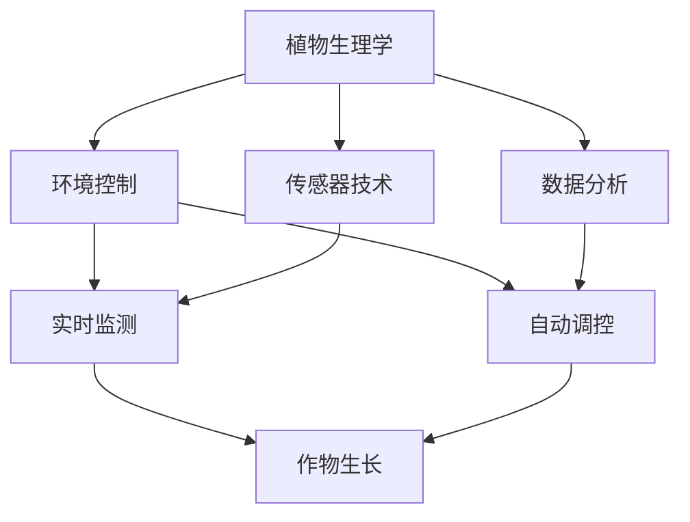

                 

关键词：智能水培、都市农业、科技解决方案、AI、自动化、传感器技术

摘要：随着城市化进程的加快和土地资源的日益紧张，都市农业成为了解决食品安全和环境保护问题的有效途径。智能水培技术作为现代都市农业的核心，通过人工智能、自动化和传感器技术的融合，实现了对作物生长的精准控制和高效管理。本文将探讨智能水培技术在都市农业中的应用，分析其核心算法原理、数学模型、项目实践及未来发展趋势。

## 1. 背景介绍

随着全球人口的快速增长和城市化的加速，传统农业面临着前所未有的压力。土地资源的稀缺、环境污染问题以及气候变化对农作物的威胁，使得农业生产效率低下，食品安全问题日益突出。为了解决这些问题，都市农业应运而生，其在城市区域通过高效利用土地、水资源和能源，实现了农业生产与城市环境的和谐共生。

智能水培技术作为都市农业的重要组成部分，利用水和营养液来培养植物，无需土壤，从而大大提高了土地的利用率和生产效率。与传统农业相比，智能水培技术能够更精确地控制环境因素，如光照、温度、湿度等，从而促进作物的健康生长。

### 1.1 智能水培技术的核心优势

- **资源利用效率高**：智能水培系统可以精确控制水分、养分和光照，最大限度地减少了资源浪费。
- **环境友好**：由于无需土壤，智能水培系统可以有效减少土壤污染，并且不会对地下水造成污染。
- **生产周期短**：智能控制系统能够为作物提供最佳生长条件，从而缩短生产周期，提高产量。
- **易于管理**：自动化系统使得作物管理更加便捷，减少了人力成本。

### 1.2 城市农业的现状与挑战

目前，全球各大城市都在积极发展城市农业，尤其是智能水培技术的应用。然而，城市农业面临着以下挑战：

- **土地资源有限**：城市土地资源稀缺，适合农业的土地有限，这限制了城市农业的发展空间。
- **技术成本较高**：智能水培系统的建设和维护成本较高，这可能是许多城市农业项目面临的经济障碍。
- **人才缺乏**：城市农业需要具备现代农业技术和管理能力的人才，但目前这方面的人才相对较少。

## 2. 核心概念与联系

智能水培技术涉及多个核心概念，包括植物生理学、环境控制、传感器技术和数据分析等。以下是一个简单的 Mermaid 流程图，展示了这些概念之间的联系。



### 2.1 植物生理学

植物生理学是智能水培技术的核心，研究植物的生长过程和生理需求。通过了解植物的光合作用、呼吸作用、水分吸收和养分吸收等生理过程，可以设计出最佳的植物生长环境。

### 2.2 环境控制

环境控制是智能水培技术的关键环节，通过自动化系统来调节光照、温度、湿度等环境因素，以提供植物最佳的生长条件。

### 2.3 传感器技术

传感器技术用于实时监测环境参数，如土壤湿度、营养液浓度、二氧化碳浓度等。这些传感器将数据传输给控制系统，以便进行实时调整。

### 2.4 数据分析

数据分析是智能水培技术的智能核心，通过分析传感器收集的大量数据，可以预测植物的生长状态，并做出相应的调控决策。

## 3. 核心算法原理 & 具体操作步骤

### 3.1 算法原理概述

智能水培技术的核心算法主要包括环境监测算法、数据分析和决策算法。环境监测算法负责收集和处理传感器数据，数据分析和决策算法则根据这些数据来调整环境参数。

### 3.2 算法步骤详解

1. **环境监测**：传感器实时监测土壤湿度、营养液浓度、温度、湿度、光照等环境参数。
2. **数据处理**：将传感器数据传输到中央控制系统，进行预处理和数据分析。
3. **状态评估**：根据数据分析结果，评估植物的生长状态和环境条件是否满足需求。
4. **决策制定**：根据评估结果，制定相应的调控策略，如调整光照强度、浇水时间和营养液浓度。
5. **执行调控**：自动执行调控策略，以改善植物生长环境。

### 3.3 算法优缺点

- **优点**：
  - 高效：通过自动化和智能化技术，实现精准控制，提高生产效率。
  - 环境友好：减少资源浪费，降低环境污染。
  - 易于管理：减少了人工干预，提高了管理的便捷性。

- **缺点**：
  - 成本较高：建设和维护智能水培系统需要较高的初始投资和技术支持。
  - 技术要求高：需要专业的技术团队进行系统设计和管理。

### 3.4 算法应用领域

智能水培算法主要应用于温室种植、室内种植和屋顶花园等场景。通过这些应用，可以实现农作物、蔬菜、花卉等作物的全年生产，满足城市居民的食品需求。

## 4. 数学模型和公式 & 详细讲解 & 举例说明

### 4.1 数学模型构建

智能水培系统的数学模型主要包括作物生长模型和环境控制模型。作物生长模型用于预测植物的生长状态，环境控制模型则用于调节环境参数。

### 4.2 公式推导过程

作物生长模型的基本公式如下：

\[ \text{生长率} = f(\text{光照强度}, \text{温度}, \text{湿度}, \text{营养液浓度}) \]

环境控制模型的基本公式如下：

\[ \text{调控策略} = g(\text{传感器数据}, \text{历史数据}, \text{目标状态}) \]

### 4.3 案例分析与讲解

假设我们有一片种植生菜的智能水培温室，以下是一个简单的案例分析。

**案例一**：生菜生长初期

- **环境参数**：光照强度为2000勒克斯，温度为20℃，湿度为60%，营养液浓度为1.2‰。
- **生长状态**：生菜种子发芽，生长速度较快。

**分析**：根据作物生长模型，当前环境参数有利于生菜的生长，因此保持现有环境条件。

**决策**：无需调整环境参数。

**案例二**：生菜生长中期

- **环境参数**：光照强度为1500勒克斯，温度为25℃，湿度为70%，营养液浓度为1.2‰。
- **生长状态**：生菜开始出现徒长现象，生长速度放缓。

**分析**：光照强度不足，温度过高，湿度较大，营养液浓度适当。

**决策**：增加光照强度至2000勒克斯，降低温度至20℃，增加湿度至50%，调整营养液浓度至1.3‰。

## 5. 项目实践：代码实例和详细解释说明

### 5.1 开发环境搭建

为了实现智能水培系统，我们需要搭建一个开发环境，包括传感器、控制器和计算机。以下是一个简单的环境搭建步骤：

1. **硬件选择**：选择适合的传感器，如土壤湿度传感器、温度传感器、光照传感器等。
2. **控制器选择**：选择一个支持物联网技术的控制器，如Arduino或Raspberry Pi。
3. **软件选择**：安装Python编程环境，以便进行数据处理和算法开发。

### 5.2 源代码详细实现

以下是一个简单的Python代码示例，用于读取传感器数据并调整环境参数。

```python
import serial
import time

# 传感器串口配置
ser = serial.Serial('/dev/ttyUSB0', 9600)

# 环境参数变量
light_intensity = 0
temperature = 0
humidity = 0
soil_moisture = 0

# 调控策略函数
def control_env():
    global light_intensity, temperature, humidity, soil_moisture
    # 根据传感器数据调整环境参数
    if soil_moisture < 30:
        # 增加浇水
        print("增加浇水")
    if temperature > 25:
        # 降低温度
        print("降低温度")
    if light_intensity < 2000:
        # 增加光照
        print("增加光照")
    if humidity > 70:
        # 降低湿度
        print("降低湿度")

# 主循环
while True:
    # 读取传感器数据
    light_intensity = ser.readline()
    temperature = ser.readline()
    humidity = ser.readline()
    soil_moisture = ser.readline()
    # 调用调控策略函数
    control_env()
    # 等待时间
    time.sleep(10)
```

### 5.3 代码解读与分析

1. **传感器读取**：代码通过串口读取传感器数据，存储在相应的变量中。
2. **调控策略函数**：根据传感器数据，调用不同的调控策略函数，如增加浇水、降低温度、增加光照等。
3. **主循环**：代码进入一个无限循环，每隔10秒读取一次传感器数据并调用调控策略函数。

### 5.4 运行结果展示

在实际运行中，代码将根据传感器数据实时调整环境参数，如增加浇水、降低温度、增加光照等。通过这种方式，智能水培系统能够为植物提供最佳的生长环境。

## 6. 实际应用场景

智能水培技术在不同场景中有着广泛的应用，以下是几个典型的实际应用场景：

### 6.1 温室种植

温室种植是智能水培技术的主要应用领域之一。通过智能控制系统，温室内的光照、温度、湿度等环境因素可以精确控制，从而实现全年无休的农业生产。

### 6.2 室内种植

室内种植利用智能水培技术，可以在家庭、办公室等室内空间中进行。这种方式不仅能够提供新鲜的蔬菜和水果，还能够改善室内空气质量。

### 6.3 屋顶花园

屋顶花园是一种绿色环保的景观设计，通过智能水培系统，屋顶上的植物可以享受到最佳的生长条件，不仅美化了城市环境，还能够降低城市热岛效应。

### 6.4 商业农业

智能水培技术的商业农业应用主要包括垂直农场和智能温室。通过自动化和智能化技术，这些农场能够实现大规模、高效、可持续的农业生产。

## 7. 工具和资源推荐

为了更好地开展智能水培技术的研究和应用，以下是几个推荐的工具和资源：

### 7.1 学习资源推荐

- **《智能温室系统设计与实践》**：一本详细介绍智能温室系统设计的书籍，涵盖了传感器技术、环境控制算法等内容。
- **《智能农业：未来农业的创新技术》**：一本介绍智能农业技术的综合书籍，包括智能水培、无人机、物联网等。

### 7.2 开发工具推荐

- **Arduino**：一款流行的开源硬件平台，适用于传感器和控制器开发。
- **Raspberry Pi**：一款低成本、高性能的单板计算机，适用于智能水培系统的开发。
- **MATLAB**：一款强大的数学和科学计算软件，适用于数据分析和建模。

### 7.3 相关论文推荐

- **“Smart Greenhouses for Sustainable Agriculture”**：一篇关于智能温室系统研究的综述论文。
- **“An IoT-Based Smart Farming System for Precision Agriculture”**：一篇关于智能农业系统的论文，详细介绍了物联网技术在农业中的应用。

## 8. 总结：未来发展趋势与挑战

智能水培技术作为都市农业的重要组成部分，具有巨大的发展潜力。未来，随着人工智能、物联网和自动化技术的不断发展，智能水培技术将在农业、环保和食品等领域发挥越来越重要的作用。然而，智能水培技术也面临着一系列挑战，如技术成本、人才短缺和数据隐私等。为了实现智能水培技术的可持续发展，需要政府、企业和研究机构的共同努力，加强技术创新和政策支持。

### 8.1 研究成果总结

本文从智能水培技术的背景、核心概念、算法原理、数学模型、项目实践等方面进行了详细探讨，总结了智能水培技术在都市农业中的优势和应用场景。

### 8.2 未来发展趋势

- **智能化水平提升**：随着人工智能技术的发展，智能水培系统的智能化水平将进一步提升，实现更精准、更高效的环境控制。
- **成本降低**：随着技术的成熟和规模化应用，智能水培技术的成本将逐渐降低，使其在更广泛的农业生产中得到应用。
- **可持续发展**：智能水培技术将更加注重资源利用效率和环境保护，推动农业的可持续发展。

### 8.3 面临的挑战

- **技术成本**：智能水培系统的建设和维护成本较高，限制了其在广泛农业生产中的应用。
- **人才短缺**：智能水培技术需要具备多学科知识的人才，但目前这方面的人才相对较少。
- **数据隐私**：智能水培系统涉及大量敏感数据，如何保障数据隐私和安全是一个重要挑战。

### 8.4 研究展望

未来，智能水培技术的研究将聚焦于以下方向：

- **智能化算法优化**：开发更高效、更智能的算法，提高系统自动化水平和环境调控能力。
- **成本控制**：研究低成本、高性能的传感器和控制技术，降低智能水培系统的建设成本。
- **数据安全与隐私保护**：研究数据加密、隐私保护等技术，确保智能水培系统的数据安全。

## 9. 附录：常见问题与解答

### 9.1 智能水培系统如何实现自动化控制？

智能水培系统通过传感器实时监测环境参数，如土壤湿度、营养液浓度、温度、湿度、光照等。根据传感器数据，中央控制系统使用算法进行数据分析和决策，自动调整环境参数，以实现植物的最佳生长环境。

### 9.2 智能水培系统的成本有多高？

智能水培系统的成本取决于系统的规模和功能。一般来说，一个中等规模的智能水培系统建设成本在几万到几十万人民币之间，具体成本取决于传感器、控制器、水泵等硬件设备和软件开发成本。

### 9.3 智能水培系统对环境有何影响？

智能水培系统通过精准控制水分、养分和光照，提高了资源利用效率，减少了资源浪费和环境污染。与传统农业相比，智能水培系统不会对地下水造成污染，有利于环境保护。

### 9.4 智能水培系统需要多少电力？

智能水培系统的电力消耗取决于系统的规模和功能。一般来说，一个中等规模的智能水培系统每天需要消耗几十到几百度电。通过优化系统设计和使用可再生能源，可以进一步降低电力消耗。

### 9.5 智能水培系统是否可以全年生产？

智能水培系统通过精确控制环境因素，可以实现全年无休的农业生产。然而，植物的生长周期和季节变化仍然会影响生产。因此，智能水培系统需要根据植物的生长特性进行调整，以确保最佳的生产效果。

### 9.6 智能水培系统需要多少人工维护？

智能水培系统的自动化程度较高，需要的人工维护较少。一般来说，每天需要进行简单的设备检查和故障排查，以及定期更换营养液和清洁传感器等。整体上，智能水培系统所需的人工维护量较少。

### 9.7 智能水培系统是否适用于所有作物？

智能水培系统适用于多种作物，如蔬菜、水果、花卉等。然而，不同作物的生长环境和需求有所不同，智能水培系统需要根据具体作物进行调整和优化，以确保最佳的种植效果。

### 9.8 智能水培系统是否会影响作物品质？

智能水培系统通过精准控制环境因素，提供了作物最佳的生长条件，有利于提高作物品质。然而，作物的品质还受到品种选择、种植技术和管理水平等多种因素的影响。

### 9.9 智能水培系统的未来发展趋势是什么？

智能水培系统的未来发展趋势包括：智能化水平的提升、成本降低、资源利用效率的提高、可持续发展的推进等。随着人工智能、物联网和自动化技术的发展，智能水培系统将在农业生产中发挥越来越重要的作用。


作者：禅与计算机程序设计艺术 / Zen and the Art of Computer Programming
----------------------------------------------------------------

文章撰写完毕，接下来将进行格式调整和排版，确保符合markdown格式要求。完成后，将提交文章以便进一步审核和发布。如果您需要进一步的修改或补充，请随时告知。

