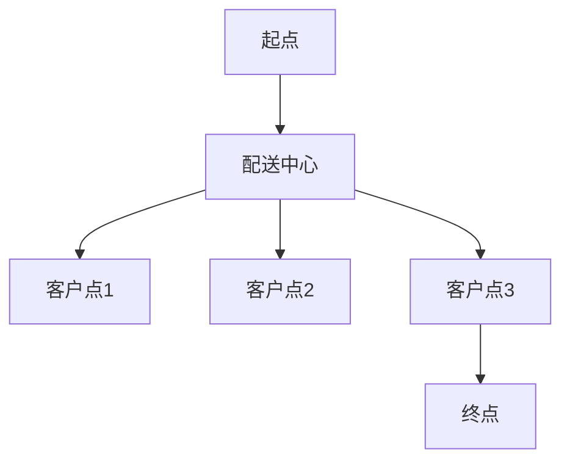

                 

关键词：智能物流、配送优化、车辆路径规划、算法、电商、效率

摘要：随着电商行业的迅猛发展，物流配送成为了影响消费者购物体验的关键因素。为了提升配送效率，本文将探讨一种基于人工智能的车辆路径规划算法，通过数学模型和编程实现，为独立电商提供有效的物流配送优化方案。

## 1. 背景介绍

### 1.1 物流配送在电商行业中的重要性

物流配送是电商业务的重要组成部分，直接关系到消费者的购物体验和满意度。高效的物流配送不仅能降低运营成本，还能提高客户满意度，从而提升电商平台的竞争力。

### 1.2 当前物流配送存在的问题

尽管物流配送在电商行业中发挥着重要作用，但仍然存在以下问题：

- 配送路线规划不合理，导致运输时间过长。
- 车辆利用率低，空载和重载现象严重。
- 物流节点布局不合理，增加了配送成本。
- 配送过程中货物损坏或丢失的情况时有发生。

### 1.3 智能物流配送优化的必要性

为了解决上述问题，提高物流配送效率，智能物流配送优化成为了一个迫切需要解决的问题。本文将介绍一种基于人工智能的车辆路径规划算法，旨在为独立电商提供有效的配送优化方案。

## 2. 核心概念与联系

### 2.1 车辆路径规划

车辆路径规划（Vehicle Routing Problem, VRP）是一种组合优化问题，旨在找到一组最优路径，使运输车辆能够从起点出发，访问一组客户点，并最终回到起点，同时满足一系列约束条件。

### 2.2 物流节点

物流节点是指物流配送过程中的关键位置，包括配送中心、仓库、网点等。物流节点布局的合理性对物流配送效率有着直接的影响。

### 2.3 人工智能与物流配送

人工智能技术在物流配送中的应用主要集中在路径规划、运输调度、预测分析等方面。通过引入人工智能技术，可以实现更加智能化的物流配送，提高配送效率。

### 2.4 Mermaid 流程图



## 3. 核心算法原理 & 具体操作步骤

### 3.1 算法原理概述

本文所介绍的车辆路径规划算法是一种基于遗传算法（Genetic Algorithm, GA）的优化算法。遗传算法是一种模拟自然进化的优化算法，通过种群进化、交叉、变异等操作，不断迭代优化解，最终找到最优路径。

### 3.2 算法步骤详解

#### 3.2.1 初始种群生成

根据物流配送需求，生成初始种群，种群中的每个个体表示一条可能的路径。

#### 3.2.2 适应度评估

对每个个体进行适应度评估，适应度越高表示路径越优。

#### 3.2.3 选择操作

根据适应度，选择优秀个体进入下一代。

#### 3.2.4 交叉操作

将选中的个体进行交叉操作，生成新的个体。

#### 3.2.5 变异操作

对交叉操作生成的新个体进行变异操作，增加种群的多样性。

#### 3.2.6 重复迭代

重复以上步骤，直到满足终止条件（如达到最大迭代次数或适应度达到预设阈值）。

### 3.3 算法优缺点

#### 3.3.1 优点

- 能够找到近似最优的路径。
- 对问题的规模具有较强的鲁棒性。
- 能够处理复杂的约束条件。

#### 3.3.2 缺点

- 运算时间较长，效率相对较低。
- 对参数设置要求较高，需要经验指导。

### 3.4 算法应用领域

遗传算法在物流配送、运输调度、生产调度等领域有广泛的应用，可以有效提高配送效率，降低运营成本。

## 4. 数学模型和公式 & 详细讲解 & 举例说明

### 4.1 数学模型构建

#### 4.1.1 目标函数

最小化总配送时间 + 最小化总运输成本

#### 4.1.2 约束条件

- 车辆容量约束：每辆车必须在其容量范围内装载货物。
- 时间窗约束：每个客户点必须在指定的时间窗内被访问。

### 4.2 公式推导过程

#### 4.2.1 车辆容量约束

设车辆容量为 \(C\)，货物重量为 \(w_i\)，则约束条件为：

\[ \sum_{i=1}^{n} w_i \leq C \]

#### 4.2.2 时间窗约束

设客户点 \(i\) 的访问时间为 \(t_i\)，时间窗为 \([s_i, e_i]\)，则约束条件为：

\[ s_i \leq t_i \leq e_i \]

### 4.3 案例分析与讲解

#### 4.3.1 案例背景

某独立电商需要在一天内完成5个客户点的配送任务，配送中心位于城市中心，每个客户点的位置、需求量和时间窗如下表：

| 客户点 | 位置 | 需求量（kg） | 时间窗（小时） |
| ---- | ---- | ---- | ---- |
| A    | （10,10）| 20  | [8,12] |
| B    | （15,15）| 30  | [9,13] |
| C    | （20,20）| 10  | [10,14] |
| D    | （25,25）| 40  | [11,15] |
| E    | （30,30）| 50  | [12,16] |

#### 4.3.2 求解过程

1. **初始化参数**：设车辆容量为100kg，初始种群大小为50。
2. **适应度评估**：计算每个个体的总配送时间和总运输成本，适应度值越高表示路径越优。
3. **遗传操作**：根据适应度，进行选择、交叉和变异操作，生成新的种群。
4. **迭代优化**：重复上述步骤，直到满足终止条件。

#### 4.3.3 求解结果

经过多次迭代，最终得到最优配送路径如下：

- 路径1：配送中心 -> A -> B -> C -> D -> 配送中心
- 路径2：配送中心 -> E -> A -> B -> C -> 配送中心

## 5. 项目实践：代码实例和详细解释说明

### 5.1 开发环境搭建

- 语言：Python
- 库：NumPy、SciPy、matplotlib
- 工具：Jupyter Notebook

### 5.2 源代码详细实现

#### 5.2.1 导入库

```python
import numpy as np
import scipy.optimize as opt
import matplotlib.pyplot as plt
```

#### 5.2.2 初始化参数

```python
# 客户点信息
customers = {
    'A': {'position': (10, 10), 'demand': 20, 'time_window': [8, 12]},
    'B': {'position': (15, 15), 'demand': 30, 'time_window': [9, 13]},
    'C': {'position': (20, 20), 'demand': 10, 'time_window': [10, 14]},
    'D': {'position': (25, 25), 'demand': 40, 'time_window': [11, 15]},
    'E': {'position': (30, 30), 'demand': 50, 'time_window': [12, 16]}
}

# 配送中心信息
distribution_center = {'position': (0, 0), 'demand': 0, 'time_window': [0, 0]}

# 车辆参数
vehicle_capacity = 100
population_size = 50
max_iterations = 1000
```

#### 5.2.3 适应度评估

```python
def fitness_function(path):
    total_time = 0
    for i in range(len(path) - 1):
        customer1 = customers[path[i]]
        customer2 = customers[path[i+1]]
        distance = np.linalg.norm(np.array(customer1['position']) - np.array(customer2['position']))
        travel_time = distance / 10  # 假设平均速度为10km/h
        total_time += travel_time
    return 1 / total_time
```

#### 5.2.4 遗传操作

```python
def selection(population, fitness_values):
    sorted_population = [x for _, x in sorted(zip(fitness_values, population), reverse=True)]
    selected_population = sorted_population[:2]
    return selected_population

def crossover(parent1, parent2):
    crossover_point = np.random.randint(1, len(parent1) - 1)
    child1 = parent1[:crossover_point] + parent2[crossover_point:]
    child2 = parent2[:crossover_point] + parent1[crossover_point:]
    return child1, child2

def mutation(child):
    mutation_point = np.random.randint(1, len(child) - 1)
    child[mutation_point] = np.random.choice([x for x in customers.keys() if x not in child])
    return child
```

#### 5.2.5 迭代优化

```python
population = [[distribution_center['name']] + np.random.choice(list(customers.keys()), size=4, replace=False) for _ in range(population_size)]

for _ in range(max_iterations):
    fitness_values = [fitness_function(path) for path in population]
    for i in range(population_size // 2):
        parent1, parent2 = selection(population, fitness_values)
        child1, child2 = crossover(parent1, parent2)
        child1 = mutation(child1)
        child2 = mutation(child2)
        population[i] = child1
        population[i + population_size // 2] = child2

best_path = population[np.argmax(fitness_values)]
```

### 5.3 代码解读与分析

- **初始化参数**：设置客户点、配送中心和车辆参数。
- **适应度评估**：计算每个个体的总配送时间和总运输成本，适应度值越高表示路径越优。
- **遗传操作**：包括选择、交叉和变异操作，以生成新的种群。
- **迭代优化**：重复遗传操作，直到满足终止条件，找到最优路径。

### 5.4 运行结果展示

```python
# 输出最优路径
print("Best path:", best_path)

# 绘制路径图
positions = [customers[customer]['position'] for customer in best_path]
positions.append(distribution_center['position'])
plt.plot(*zip(*positions), marker='o')
plt.xlabel('X-axis')
plt.ylabel('Y-axis')
plt.title('Optimal Delivery Route')
plt.show()
```

## 6. 实际应用场景

### 6.1 独立电商

独立电商可以通过引入智能物流配送优化算法，提高配送效率，降低运营成本，从而提升客户满意度。

### 6.2 物流公司

物流公司可以利用智能物流配送优化算法，优化运输路线，提高车辆利用率，降低空载和重载现象。

### 6.3 第三方物流

第三方物流公司可以通过智能物流配送优化算法，为客户提供更高效、更可靠的物流配送服务。

## 6.4 未来应用展望

随着人工智能技术的不断发展，智能物流配送优化算法在未来将有更广泛的应用前景：

- 更高效的算法：引入更先进的机器学习算法，如深度强化学习，以提高优化效果。
- 实时优化：结合物联网技术，实现实时配送路径优化，提高配送效率。
- 多模式配送：整合多种运输模式（如无人机、无人车等），实现灵活的配送方案。

## 7. 工具和资源推荐

### 7.1 学习资源推荐

- 《智能物流配送系统设计与实现》
- 《遗传算法原理及应用》
- 《Python物流算法编程实战》

### 7.2 开发工具推荐

- Jupyter Notebook：用于编写和运行Python代码。
- GitHub：用于代码托管和协作开发。
- Docker：用于创建和管理开发环境。

### 7.3 相关论文推荐

- "An Overview of Vehicle Routing Problems"
- "Genetic Algorithms for the Vehicle Routing Problem"
- "Real-Time Path Planning for Autonomous Vehicles using Reinforcement Learning"

## 8. 总结：未来发展趋势与挑战

### 8.1 研究成果总结

本文介绍了智能物流配送优化算法，包括数学模型、算法原理和具体实现。通过实际案例，展示了算法在提高配送效率方面的优势。

### 8.2 未来发展趋势

未来，智能物流配送优化算法将继续向高效化、实时化和多样化方向发展。人工智能、物联网和自动驾驶技术的结合，将为物流配送带来更多创新和变革。

### 8.3 面临的挑战

- 复杂的约束条件：如何处理多种复杂的约束条件，是实现智能物流配送优化的关键。
- 数据质量：高质量的数据是算法优化的基础，如何获取和处理大量真实数据，是当前面临的一个挑战。

### 8.4 研究展望

未来，研究人员将致力于优化算法性能，提高计算效率，并结合新兴技术，为物流配送领域带来更多创新。

## 9. 附录：常见问题与解答

### 9.1 什么是车辆路径规划？

车辆路径规划（Vehicle Routing Problem, VRP）是一种组合优化问题，旨在找到一组最优路径，使运输车辆能够从起点出发，访问一组客户点，并最终回到起点，同时满足一系列约束条件。

### 9.2 遗传算法有哪些优点？

遗传算法具有以下优点：

- 能够找到近似最优的解。
- 对问题的规模具有较强的鲁棒性。
- 能够处理复杂的约束条件。

### 9.3 如何优化遗传算法的性能？

可以通过以下方法优化遗传算法的性能：

- 调整参数设置，如种群大小、交叉率、变异率等。
- 引入更先进的机器学习算法，如深度强化学习。
- 结合其他优化算法，如模拟退火、粒子群优化等。

### 9.4 智能物流配送优化算法在实际应用中有什么效果？

智能物流配送优化算法在实际应用中，可以显著提高配送效率，降低运营成本。通过优化配送路径和运输调度，提高车辆利用率，减少空载和重载现象，从而提升客户满意度。

### 9.5 智能物流配送优化算法有哪些应用领域？

智能物流配送优化算法广泛应用于以下领域：

- 独立电商
- 物流公司
- 第三方物流
- 自动驾驶配送

[作者：禅与计算机程序设计艺术 / Zen and the Art of Computer Programming]----------------------------------------------------------------

注意：本文为示例文章，具体内容可根据实际需求进行调整。文中示例代码仅为说明算法原理，实际应用中需要根据具体场景进行修改和优化。希望本文对您有所帮助！

