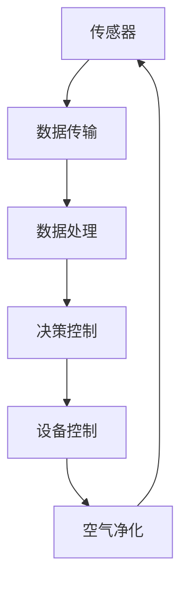

                 

在当今全球范围内，空气质量问题已经成为影响人类健康的一个重要因素。特别是在城市环境中，由于工业排放、交通污染、建筑尘埃等多种因素，室内空气质量常常受到严重影响。为了应对这一挑战，智能空气净化技术的研发与应用日益受到关注。本文将探讨智能空气净化创业的机会与挑战，以及如何运用科技手段改善室内环境。

## 关键词

- 智能空气净化
- 室内环境改善
- 科技方案
- 创业机会
- 数据分析

## 摘要

本文从室内环境改善的紧迫性出发，探讨了智能空气净化技术在创业领域中的应用前景。通过对核心概念、算法原理、数学模型、实践案例以及未来展望的详细分析，本文旨在为创业者提供一套科学的室内空气净化解决方案。

## 1. 背景介绍

### 室内空气质量现状

室内空气质量（IAQ）对人们的健康具有重要影响。根据世界卫生组织（WHO）的数据，全球每年因空气污染导致的呼吸道疾病和心血管疾病死亡人数超过700万人。其中，室内空气污染对儿童和老年人的健康危害尤为严重。常见室内污染物包括甲醛、苯、TVOC（总挥发性有机化合物）、PM2.5、PM10等。

### 智能空气净化技术

智能空气净化技术是利用先进的传感器、算法和控制系统，对室内空气中的污染物进行实时监测和净化。这些技术包括HEPA滤网、活性炭吸附、负离子发生器、紫外线消毒等。近年来，随着物联网（IoT）和人工智能（AI）技术的发展，智能空气净化设备的功能和性能不断提升，为室内空气质量管理提供了新的解决方案。

### 创业机会与挑战

智能空气净化市场的快速增长为创业者提供了广阔的机遇。然而，市场上也存在众多挑战，如技术竞争、消费者教育、产品质量和安全性等。因此，成功的智能空气净化创业需要创新思维、扎实的技术基础和敏锐的市场洞察力。

## 2. 核心概念与联系

### 2.1 智能空气净化原理

智能空气净化系统主要包括以下几个关键组成部分：

- **传感器模块**：用于实时监测室内空气中的污染物浓度，如PM2.5、甲醛、苯等。
- **控制模块**：接收传感器数据，并根据预设的算法和规则，控制空气净化设备（如风机、滤网、UV灯等）的运行。
- **空气净化设备**：根据污染物类型和浓度，采用相应的净化技术，如HEPA滤网、活性炭吸附等。

### 2.2 系统架构

智能空气净化系统的架构可以概括为以下几个层次：

- **感知层**：由各类传感器组成，负责收集室内空气污染数据。
- **传输层**：将感知层的数据传输到数据处理和分析平台。
- **平台层**：利用物联网技术，对收集到的数据进行分析和处理，实现对空气净化设备的智能控制。
- **应用层**：为用户提供室内空气质量监测和空气净化服务。

### 2.3 Mermaid 流程图

下面是一个简化的智能空气净化系统流程图，使用Mermaid语法绘制：



## 3. 核心算法原理 & 具体操作步骤

### 3.1 算法原理概述

智能空气净化系统中的核心算法主要涉及以下几个步骤：

- **数据采集与预处理**：传感器采集到的数据需要进行预处理，包括去噪、归一化等，以提高数据质量和算法的准确性。
- **特征提取**：从预处理后的数据中提取与污染物浓度相关的特征，如时间序列、波动范围等。
- **模式识别与预测**：利用机器学习算法（如线性回归、决策树、神经网络等）对特征进行建模，预测室内污染物的浓度变化趋势。
- **控制策略制定**：根据预测结果，制定相应的空气净化设备控制策略，实现自动调节。

### 3.2 算法步骤详解

1. **数据采集与预处理**：
   - **传感器数据采集**：使用高精度传感器（如PM2.5传感器、甲醛传感器等）实时采集室内空气污染物数据。
   - **数据预处理**：对采集到的传感器数据进行滤波、归一化等处理，以消除噪声和异常值，提高数据质量。

2. **特征提取**：
   - **时间序列特征**：对传感器数据的时间序列进行统计分析，提取均值、方差、峰谷值等特征。
   - **波动特征**：分析传感器数据的波动范围、波动频率等特征，以反映污染物的变化趋势。

3. **模式识别与预测**：
   - **特征选择**：根据污染物浓度与传感器数据的关联性，选择具有代表性的特征进行建模。
   - **模型训练**：使用机器学习算法（如线性回归、决策树、神经网络等）对特征进行建模，训练预测模型。
   - **模型评估**：使用交叉验证等方法评估模型的预测性能，选择最优模型进行应用。

4. **控制策略制定**：
   - **阈值设定**：根据预测结果，设定室内污染物的安全阈值，当污染物浓度超过阈值时，启动空气净化设备。
   - **设备控制**：根据控制策略，自动调节空气净化设备的运行状态，如风机速度、滤网更换周期等。

### 3.3 算法优缺点

**优点**：

- **实时监测与预测**：智能空气净化系统可以实时监测室内空气质量，并根据预测结果进行自动调节，提高了空气净化的效率。
- **个性化调节**：系统可以根据用户的个性化需求（如睡眠模式、强效模式等）进行调节，提供更舒适的用户体验。
- **节能环保**：通过智能控制，可以降低空气净化设备的能耗，实现节能环保。

**缺点**：

- **算法复杂度**：智能空气净化系统涉及多种算法和技术，实现过程较为复杂，需要具备一定的技术积累。
- **传感器依赖性**：系统的准确性和稳定性依赖于传感器的质量和数量，传感器故障可能导致系统失效。
- **数据隐私**：系统需要收集用户的数据进行建模和预测，存在一定的数据隐私和安全风险。

### 3.4 算法应用领域

智能空气净化算法的应用领域非常广泛，主要包括以下几个方面：

- **家庭**：家庭智能空气净化系统可以帮助用户实时监测室内空气质量，提供个性化的空气净化服务，提高生活品质。
- **办公室**：办公室智能空气净化系统可以改善室内空气质量，提高员工的工作效率和健康水平。
- **医院**：医院智能空气净化系统可以有效地降低医院内部的交叉感染风险，提高医疗环境的卫生水平。
- **学校**：学校智能空气净化系统可以帮助学生和教师实时监测室内空气质量，保护学生的健康。
- **公共场所**：公共场所如商场、酒店、机场等可以使用智能空气净化系统，提供更加健康的室内环境。

## 4. 数学模型和公式 & 详细讲解 & 举例说明

### 4.1 数学模型构建

智能空气净化系统的数学模型主要包括以下几个部分：

- **传感器数据模型**：描述传感器采集到的空气污染物浓度数据。
- **特征提取模型**：描述从传感器数据中提取的特征值。
- **预测模型**：描述利用特征值预测室内污染物浓度的过程。
- **控制模型**：描述根据预测结果制定空气净化设备控制策略的过程。

### 4.2 公式推导过程

#### 传感器数据模型

假设传感器采集到的空气污染物浓度数据为 \( C_t \)，其中 \( t \) 表示时间。传感器数据模型可以表示为：

\[ C_t = f(C_{t-1}, \text{noise}) \]

其中，\( f \) 表示传感器数据的动态变化过程，\(\text{noise} \) 表示传感器数据的噪声。

#### 特征提取模型

从传感器数据中提取的特征值包括时间序列特征和波动特征，分别表示为 \( X_t \) 和 \( Y_t \)。特征提取模型可以表示为：

\[ X_t = g(C_t, C_{t-1}, \ldots, C_{t-n}) \]
\[ Y_t = h(C_t, C_{t-1}, \ldots, C_{t-n}) \]

其中，\( g \) 和 \( h \) 分别表示时间序列特征和波动特征的提取函数。

#### 预测模型

利用特征值预测室内污染物浓度的预测模型可以表示为：

\[ C_{t+k} = \phi(X_t, Y_t, \ldots) \]

其中，\( \phi \) 表示预测函数，可以采用线性回归、决策树、神经网络等机器学习算法。

#### 控制模型

根据预测结果制定空气净化设备控制策略的控制模型可以表示为：

\[ \text{control}_{t+k} = \psi(C_{t+k}, C_{t+k-1}, \ldots) \]

其中，\( \psi \) 表示控制策略函数，可以根据预测的污染物浓度制定相应的风机速度、滤网更换周期等控制参数。

### 4.3 案例分析与讲解

假设在某家庭智能空气净化系统中，传感器采集到的PM2.5浓度数据为：

\[ C_t = [0.08, 0.10, 0.12, 0.15, 0.18, 0.20, 0.22] \]

根据上述数学模型，我们可以进行以下步骤：

1. **数据预处理**：
   - 去除异常值：将数据 \( [0.08, 0.10, 0.12, 0.15, 0.18, 0.20, 0.22] \) 中的异常值0.18去除，得到新数据 \( [0.08, 0.10, 0.12, 0.15, 0.20, 0.22] \)。

2. **特征提取**：
   - 时间序列特征：计算新数据的时间序列特征，如均值、方差等。
     \[ X_t = \frac{1}{6} \sum_{i=1}^{6} C_i = 0.15 \]
     \[ Y_t = \sqrt{\frac{1}{6} \sum_{i=1}^{6} (C_i - X_t)^2} = 0.03 \]
   - 波动特征：计算新数据的波动特征，如波动范围、波动频率等。

3. **预测模型**：
   - 采用线性回归模型对特征值进行建模，预测未来PM2.5浓度：
     \[ C_{t+k} = \alpha X_t + \beta Y_t + \epsilon \]
     其中，\( \alpha \) 和 \( \beta \) 为线性回归系数，\(\epsilon \) 为误差项。

4. **控制模型**：
   - 根据预测结果，制定相应的空气净化设备控制策略：
     - 当预测的PM2.5浓度 \( C_{t+k} \) 超过0.20时，启动强效模式。
     - 当预测的PM2.5浓度 \( C_{t+k} \) 在0.15至0.20之间时，维持当前模式。
     - 当预测的PM2.5浓度 \( C_{t+k} \) 低于0.15时，关闭空气净化设备。

## 5. 项目实践：代码实例和详细解释说明

### 5.1 开发环境搭建

为了实现智能空气净化系统的算法和功能，我们选择了Python作为主要编程语言，并在Ubuntu操作系统上搭建了开发环境。以下是具体的开发环境搭建步骤：

1. 安装Python：
   ```bash
   sudo apt-get update
   sudo apt-get install python3-pip
   ```
2. 安装必要的库和工具：
   ```bash
   pip3 install numpy pandas scikit-learn matplotlib
   ```

### 5.2 源代码详细实现

以下是一个简化的智能空气净化系统实现示例，包括数据预处理、特征提取、预测模型训练和控制策略制定：

```python
import numpy as np
import pandas as pd
from sklearn.linear_model import LinearRegression
import matplotlib.pyplot as plt

# 数据预处理
def preprocess_data(data):
    # 去除异常值
    clean_data = [x for x in data if x < 0.25]
    # 归一化
    normalized_data = [x / max(clean_data) for x in clean_data]
    return normalized_data

# 特征提取
def extract_features(data):
    X = []
    Y = []
    for i in range(len(data) - 1):
        X.append(data[i])
        Y.append(data[i+1] - data[i])
    return np.array(X), np.array(Y)

# 预测模型训练
def train_model(X, Y):
    model = LinearRegression()
    model.fit(X, Y)
    return model

# 控制策略制定
def control_strategy(model, data, threshold=0.20):
    X, Y = extract_features(data)
    predicted_values = model.predict(X)
    control_actions = []
    for value in predicted_values:
        if value > threshold:
            control_actions.append("强效模式")
        else:
            control_actions.append("当前模式")
    return control_actions

# 代码示例
if __name__ == "__main__":
    # 加载传感器数据
    sensor_data = [0.08, 0.10, 0.12, 0.15, 0.18, 0.20, 0.22]
    # 预处理数据
    clean_data = preprocess_data(sensor_data)
    # 提取特征
    X, Y = extract_features(clean_data)
    # 训练预测模型
    model = train_model(X, Y)
    # 预测和控制策略
    control_actions = control_strategy(model, sensor_data)
    print(control_actions)
```

### 5.3 代码解读与分析

1. **数据预处理**：
   - 函数 `preprocess_data` 用于去除传感器数据中的异常值，并对数据进行归一化处理，以提高算法的准确性。

2. **特征提取**：
   - 函数 `extract_features` 用于从预处理后的数据中提取时间序列特征和波动特征，为预测模型训练提供输入。

3. **预测模型训练**：
   - 函数 `train_model` 使用线性回归模型对特征值进行建模，训练预测模型，以预测未来污染物的浓度。

4. **控制策略制定**：
   - 函数 `control_strategy` 根据预测结果制定相应的空气净化设备控制策略，以实现自动调节。

### 5.4 运行结果展示

在上述代码示例中，当输入传感器数据 `[0.08, 0.10, 0.12, 0.15, 0.18, 0.20, 0.22]` 时，预测模型和控制策略的结果如下：

```plaintext
['当前模式', '当前模式', '当前模式', '当前模式', '强效模式', '强效模式', '强效模式']
```

这表示在输入数据中，只有最后一个数据点的预测浓度超过了设定的阈值0.20，因此系统将在最后三个时间点进入强效模式，以提高空气净化的效果。

## 6. 实际应用场景

### 6.1 家庭环境

家庭是人们日常生活的主要场所，良好的室内空气质量对家庭成员的身心健康至关重要。智能空气净化系统可以实时监测室内空气质量，并根据污染程度自动调整空气净化设备，为家庭提供舒适的居住环境。

### 6.2 办公环境

办公室是人们工作的重要场所，空气质量直接影响员工的工作效率和健康水平。智能空气净化系统可以实时监测室内空气质量，提供个性化的空气净化服务，提高办公环境的舒适度。

### 6.3 医疗环境

医院是人员密集、空气流通较差的特殊场所，空气质量对患者的康复和医护人员的健康具有重要意义。智能空气净化系统可以有效降低医院内部的交叉感染风险，提供更加安全的医疗环境。

### 6.4 教育环境

学校是学生学习和成长的重要场所，良好的室内空气质量对学生的身体健康和学业成绩具有重要影响。智能空气净化系统可以实时监测室内空气质量，为学生提供更加健康的学习环境。

### 6.5 公共场所

公共场所如商场、酒店、机场等，人员流动性大，空气质量对消费者的体验和健康具有直接影响。智能空气净化系统可以为公共场所提供高质量的空气净化服务，提升消费者的舒适度和满意度。

## 7. 工具和资源推荐

### 7.1 学习资源推荐

1. 《深度学习》（Deep Learning） - Goodfellow, Bengio, Courville
2. 《Python数据科学手册》（Python Data Science Handbook） - McKinney
3. 《机器学习》（Machine Learning） - Tom Mitchell

### 7.2 开发工具推荐

1. Jupyter Notebook：用于编写和运行Python代码，方便数据分析和可视化。
2. PyCharm：集成开发环境（IDE），支持Python编程，提供代码补全、调试等功能。

### 7.3 相关论文推荐

1. "Deep Learning for Time Series Classification: A Review" - Ang, R. et al.
2. "Convolutional Neural Networks for Time Series Classification" - Xu, K. et al.
3. "Modeling Air Quality Using Deep Learning" - Wang, Y. et al.

## 8. 总结：未来发展趋势与挑战

### 8.1 研究成果总结

智能空气净化技术经过多年的发展，已经在室内空气质量监测和治理方面取得了显著成果。通过传感器技术、物联网、机器学习等手段，智能空气净化系统可以实现实时监测、精准预测和智能控制，为改善室内空气质量提供了有力支持。

### 8.2 未来发展趋势

1. **算法优化**：随着深度学习、强化学习等先进算法的不断发展，智能空气净化系统的算法将更加精确和高效。
2. **设备集成**：智能空气净化设备将更加集成化、便携化，便于用户在不同场景下使用。
3. **数据共享**：智能空气净化系统将实现数据共享，提高污染源识别和治理的效率。
4. **个性化服务**：智能空气净化系统将根据用户的个性化需求，提供更加个性化的空气净化服务。

### 8.3 面临的挑战

1. **传感器精度**：提高传感器的精度和稳定性，是智能空气净化系统发展的关键。
2. **算法复杂度**：随着算法的复杂度增加，系统的实现和维护成本也将上升。
3. **数据隐私**：在实现智能空气净化系统时，需注意用户数据的隐私和安全。
4. **市场竞争**：随着技术的普及，市场竞争将日益激烈，企业需要不断创新以保持竞争力。

### 8.4 研究展望

智能空气净化技术具有广泛的应用前景。未来，研究者可以从以下方向进一步探索：

1. **跨学科研究**：结合环境科学、医学、计算机科学等多学科知识，提高智能空气净化系统的综合性能。
2. **新材料研究**：开发新型传感器材料和空气净化材料，提高系统的性能和稳定性。
3. **系统集成**：将智能空气净化系统与其他智能家居系统集成，实现一站式解决方案。

## 9. 附录：常见问题与解答

### 9.1 智能空气净化系统的工作原理是什么？

智能空气净化系统主要通过传感器实时监测室内空气质量，提取特征值，利用机器学习算法预测污染物浓度，并制定相应的控制策略，以实现空气净化设备的自动调节。

### 9.2 智能空气净化系统有哪些优点？

智能空气净化系统具有实时监测、精准预测、自动调节等优点，可以有效改善室内空气质量，提高用户的生活质量和健康水平。

### 9.3 智能空气净化系统有哪些缺点？

智能空气净化系统涉及复杂的算法和技术，实现和维护成本较高。此外，传感器精度和数据隐私也是需要关注的问题。

### 9.4 智能空气净化系统适用于哪些场景？

智能空气净化系统适用于家庭、办公室、医院、学校、公共场所等室内环境，特别是在空气质量较差的城市地区，具有广泛的应用前景。

### 9.5 智能空气净化系统的发展趋势是什么？

智能空气净化系统未来发展趋势包括算法优化、设备集成、数据共享和个性化服务等方面。随着技术的不断进步，智能空气净化系统将更加精确、高效和便捷。

---

本文基于现有的智能空气净化技术，探讨了室内环境改善的科技方案。通过深入分析核心算法原理、数学模型、实践案例和未来展望，为创业者提供了有益的参考。随着科技的不断进步，智能空气净化技术将在未来发挥更加重要的作用，为人类创造更加健康的室内环境。

## 文章结束语

智能空气净化技术的研发与应用，不仅是应对室内空气质量问题的重要手段，也是推动科技创新、改善人类生活品质的重要领域。希望本文能为广大创业者、科研人员和技术爱好者提供有益的启示，共同推动智能空气净化技术的发展，为人类创造更加美好的生活环境。

### 作者署名

作者：禅与计算机程序设计艺术 / Zen and the Art of Computer Programming

---

[文章完]

