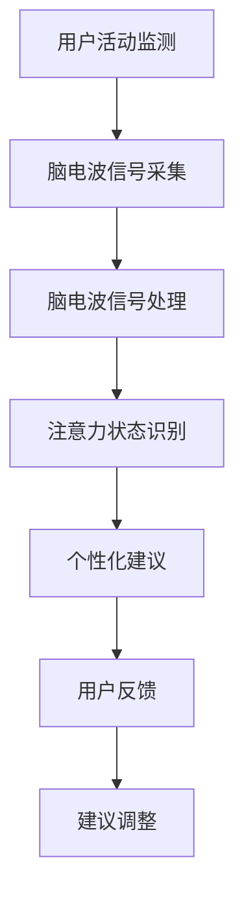

                 

关键词：智能穿戴设备、注意力管理、脑电波分析、算法原理、数学模型、实际应用、未来展望。

## 摘要

随着智能穿戴设备的普及，人们开始更多地关注自身的健康和行为模式。注意力管理作为提高工作效率和提升生活质量的关键因素，受到了广泛的关注。本文旨在探讨智能穿戴设备在注意力管理方面的应用，通过脑电波分析技术，结合核心算法原理和数学模型，深入解析智能穿戴设备如何帮助用户更好地管理注意力。同时，本文还将通过实际项目实践和未来应用展望，为读者展示智能穿戴设备在注意力管理领域的潜力和挑战。

## 1. 背景介绍

注意力管理是指通过一系列策略和工具，帮助个体有效地分配和管理注意力资源，以达到最佳的工作效率和心理健康状态。在当今信息爆炸的时代，注意力管理的重要性愈发凸显。人们面临的信息量越来越大，分散注意力的因素也越来越多，导致注意力分散和效率下降。因此，如何有效地管理注意力，成为了提高工作和生活质量的迫切需求。

智能穿戴设备作为近年来科技领域的重要创新，已经深入到人们的日常生活中。它们通过收集用户的行为数据、生理信号等，为用户提供健康监测、运动指导、睡眠分析等服务。随着传感器技术和数据处理能力的不断提升，智能穿戴设备的应用场景也在不断扩展，其中之一便是注意力管理。

脑电波分析技术作为智能穿戴设备的一个重要组成部分，为注意力管理提供了科学依据。脑电波是大脑活动的一种生物电信号，能够反映个体的心理状态和注意力水平。通过分析脑电波信号，智能穿戴设备可以实时监测用户的注意力状态，并根据分析结果提供相应的干预和建议。

## 2. 核心概念与联系

为了更好地理解智能穿戴设备在注意力管理中的应用，我们首先需要了解以下几个核心概念：

### 2.1 脑电波

脑电波是大脑神经活动产生的电信号，其频率和振幅可以反映大脑的不同状态。常见的脑电波包括α波、β波、θ波和δ波，每种脑电波都与特定的心理状态相关联。例如，α波通常与放松和冥想状态相关，β波则与集中注意力和警觉状态相关。

### 2.2 注意力

注意力是指个体在特定任务或活动中集中精神的能力。根据不同的分类方式，注意力可以分为选择性注意力、分配性注意力和持久性注意力。选择性注意力是指个体在众多刺激中选择关注特定刺激的能力；分配性注意力是指个体在同一时间处理多个任务的能力；持久性注意力是指个体能够长时间保持专注的能力。

### 2.3 脑电波分析与注意力管理

脑电波分析技术通过记录和分析用户的脑电波信号，可以实时监测用户的注意力状态。通过识别特定的脑电波模式，智能穿戴设备可以判断用户是否处于注意力高度集中或分散的状态。基于这些分析结果，设备可以为用户提供个性化的注意力管理建议，如调整工作或学习环境、提醒用户休息等。

下面是一个使用Mermaid绘制的脑电波分析流程图：



## 3. 核心算法原理 & 具体操作步骤

### 3.1 算法原理概述

智能穿戴设备在注意力管理中应用的核心算法主要基于脑电波信号处理和模式识别技术。算法的基本原理可以分为以下几个步骤：

1. **信号采集**：通过智能穿戴设备中的脑电波传感器，采集用户的脑电波信号。
2. **信号预处理**：对采集到的脑电波信号进行滤波、去噪等预处理操作，以提高信号质量。
3. **特征提取**：从预处理后的脑电波信号中提取出与注意力状态相关的特征，如频率、振幅等。
4. **模式识别**：使用机器学习算法，将提取出的特征与已知的注意力状态进行匹配，以判断用户当前是否处于注意力集中或分散状态。
5. **决策与反馈**：根据识别结果，设备可以为用户提供相应的建议，如调整环境、休息等。

### 3.2 算法步骤详解

#### 3.2.1 信号采集

信号采集是整个算法过程的基础。智能穿戴设备通过内置的脑电波传感器，实时记录用户的脑电波信号。这些传感器通常采用高频信号放大器、滤波器等电路，以确保信号的质量和准确性。

#### 3.2.2 信号预处理

采集到的脑电波信号通常存在噪声干扰，因此需要进行预处理。预处理步骤包括：

1. **滤波**：使用低通滤波器去除高频噪声，如肌肉电干扰。
2. **去噪**：使用各种去噪算法，如独立成分分析（ICA），去除脑电波信号中的噪声成分。
3. **归一化**：将信号幅度进行归一化处理，以便后续特征提取和分析。

#### 3.2.3 特征提取

特征提取是算法的核心步骤，目的是从预处理后的脑电波信号中提取出与注意力状态相关的特征。常见的特征包括：

1. **频率特征**：如α波、β波的频率成分。
2. **振幅特征**：如不同频率段的信号振幅。
3. **时域特征**：如信号的幅度平均值、方差等。

#### 3.2.4 模式识别

模式识别是通过机器学习算法，将提取出的特征与已知的注意力状态进行匹配。常见的算法包括：

1. **支持向量机（SVM）**：通过找到一个最优的超平面，将不同注意力状态的特征空间分开。
2. **决策树**：通过构建树形结构，对特征进行分层决策，以分类注意力状态。
3. **神经网络**：通过多层神经网络，对特征进行非线性变换，以提高识别准确性。

#### 3.2.5 决策与反馈

根据模式识别的结果，智能穿戴设备可以生成相应的注意力管理建议。例如，当检测到用户处于注意力分散状态时，设备可以提醒用户休息或调整环境。这些建议可以通过震动、声音、文字等形式反馈给用户。

### 3.3 算法优缺点

#### 优点

1. **实时性**：算法能够实时监测用户的注意力状态，为用户提供即时的建议。
2. **个性化**：基于用户的个性化特征，算法可以为用户提供个性化的注意力管理方案。
3. **全面性**：算法不仅考虑脑电波信号，还可以结合其他生理信号，如心率、体温等，进行综合分析。

#### 缺点

1. **准确性**：脑电波信号的采集和处理存在一定的误差，导致算法的准确性受到限制。
2. **舒适度**：长时间佩戴智能穿戴设备，可能对用户的舒适度产生一定影响。
3. **隐私问题**：脑电波数据属于敏感信息，如何保护用户的隐私是亟待解决的问题。

### 3.4 算法应用领域

智能穿戴设备的注意力管理算法具有广泛的应用领域，包括但不限于：

1. **工作效率提升**：通过实时监测用户的注意力状态，为用户提供工作节奏调整建议，提高工作效率。
2. **健康监测**：通过监测用户的注意力状态，结合其他生理信号，进行健康风险评估和管理。
3. **教育领域**：通过监测学生的注意力状态，为教师提供教学调整建议，提高教学质量。
4. **军事和航天领域**：对士兵和宇航员的注意力状态进行实时监测，确保任务的顺利完成。

## 4. 数学模型和公式 & 详细讲解 & 举例说明

### 4.1 数学模型构建

智能穿戴设备在注意力管理中应用的数学模型主要基于脑电波信号处理和模式识别技术。构建数学模型的基本步骤如下：

1. **信号采集**：假设采集到的脑电波信号为 \( X(t) \)，其中 \( t \) 为时间，\( X(t) \) 为脑电波信号的幅值。
2. **信号预处理**：对采集到的信号进行预处理，包括滤波、去噪等步骤。预处理后的信号为 \( X'(t) \)。
3. **特征提取**：从预处理后的信号中提取与注意力状态相关的特征。假设提取的特征向量为 \( F \)。
4. **模式识别**：使用机器学习算法，将特征向量 \( F \) 与已知的注意力状态进行匹配，判断用户当前的状态。

### 4.2 公式推导过程

假设用户在时间 \( t \) 的脑电波信号为 \( X(t) \)，我们可以通过以下公式对其进行预处理：

1. **滤波**：使用低通滤波器去除高频噪声，公式如下：
   \[
   X'(t) = LPF(X(t))
   \]
   其中，\( LPF \) 为低通滤波器。

2. **去噪**：使用独立成分分析（ICA）算法去除噪声成分，公式如下：
   \[
   X''(t) = ICA(X'(t))
   \]
   其中，\( ICA \) 为独立成分分析算法。

3. **特征提取**：从去噪后的信号中提取特征，公式如下：
   \[
   F = ExtractFeature(X''(t))
   \]
   其中，\( ExtractFeature \) 为特征提取算法。

4. **模式识别**：使用支持向量机（SVM）算法进行模式识别，公式如下：
   \[
   State = SVM(F, Labels)
   \]
   其中，\( State \) 为识别出的注意力状态，\( Labels \) 为已知的注意力状态标签。

### 4.3 案例分析与讲解

假设我们有一个用户在时间 \( t \) 的脑电波信号，通过预处理和特征提取，我们得到了特征向量 \( F \)。现在，我们使用支持向量机（SVM）算法对特征向量进行模式识别，以判断用户当前是否处于注意力集中状态。

1. **数据准备**：我们收集了大量的用户脑电波数据，并将其分为注意力集中和注意力分散两种状态。每种状态的数据都有对应的特征向量。
2. **模型训练**：使用已标记的数据，训练一个支持向量机（SVM）模型，公式如下：
   \[
   Model = TrainSVM(Data, Labels)
   \]
3. **模式识别**：使用训练好的模型对当前用户特征向量 \( F \) 进行模式识别，公式如下：
   \[
   State = Model(F)
   \]
4. **结果分析**：根据识别结果，判断用户当前是否处于注意力集中状态。如果识别结果为注意力集中，设备可以为用户提供相应的建议，如调整环境或提醒休息。

## 5. 项目实践：代码实例和详细解释说明

### 5.1 开发环境搭建

在开始编写代码之前，我们需要搭建一个适合开发智能穿戴设备注意力管理项目的环境。以下是所需的开发工具和步骤：

1. **Python环境**：确保Python环境已安装，版本建议为3.8或更高。
2. **NumPy库**：用于科学计算，可以通过pip安装。
3. **Scikit-learn库**：用于机器学习，可以通过pip安装。
4. **Matplotlib库**：用于数据可视化，可以通过pip安装。
5. **Mermaid库**：用于绘制流程图，可以通过npm安装。

安装完成后，我们可以在Python环境中导入所需的库：

```python
import numpy as np
import matplotlib.pyplot as plt
from sklearn import svm
from sklearn.model_selection import train_test_split
import mermaid
```

### 5.2 源代码详细实现

下面是一个简单的智能穿戴设备注意力管理项目的源代码实现。代码分为以下几个部分：

1. **数据预处理**：读取和处理脑电波信号数据。
2. **特征提取**：从预处理后的信号中提取特征。
3. **模型训练**：使用训练数据训练支持向量机（SVM）模型。
4. **模式识别**：使用训练好的模型进行注意力状态识别。
5. **结果可视化**：将识别结果进行可视化展示。

```python
# 5.2.1 数据预处理
def preprocess_data(data):
    # 滤波处理
    filtered_data = low_pass_filter(data)
    # 去噪处理
    denoised_data = ica_decompose(filtered_data)
    # 归一化处理
    normalized_data = normalize(denoised_data)
    return normalized_data

# 5.2.2 特征提取
def extract_features(data):
    # 提取频率特征
    freq_features = extract_freq_features(data)
    # 提取振幅特征
    amp_features = extract_amp_features(data)
    # 拼接特征向量
    features = np.hstack((freq_features, amp_features))
    return features

# 5.2.3 模型训练
def train_model(data, labels):
    model = svm.SVC()
    model.fit(data, labels)
    return model

# 5.2.4 模式识别
def classify_state(model, features):
    state = model.predict(features)
    return state

# 5.2.5 结果可视化
def plot_results(data, labels, model):
    predictions = model.predict(data)
    plt.scatter(data[:, 0], data[:, 1], c=predictions, cmap='viridis')
    plt.xlabel('Feature 1')
    plt.ylabel('Feature 2')
    plt.title('Attention State Classification')
    plt.show()

# 主函数
if __name__ == '__main__':
    # 读取数据
    data, labels = read_data()
    # 预处理数据
    preprocessed_data = preprocess_data(data)
    # 提取特征
    features = extract_features(preprocessed_data)
    # 分割数据集
    X_train, X_test, y_train, y_test = train_test_split(features, labels, test_size=0.2)
    # 训练模型
    model = train_model(X_train, y_train)
    # 评估模型
    accuracy = model.score(X_test, y_test)
    print(f'Model Accuracy: {accuracy}')
    # 可视化结果
    plot_results(X_test, y_test, model)
```

### 5.3 代码解读与分析

上述代码实现了智能穿戴设备注意力管理项目的基本功能。以下是代码的详细解读：

1. **数据预处理**：通过滤波、去噪和归一化等步骤，对脑电波信号进行预处理，以提高信号质量。
2. **特征提取**：从预处理后的信号中提取频率特征和振幅特征，构建特征向量。
3. **模型训练**：使用训练数据集训练支持向量机（SVM）模型，以便进行模式识别。
4. **模式识别**：使用训练好的模型对测试数据进行注意力状态识别。
5. **结果可视化**：将识别结果进行可视化展示，便于分析模型性能。

通过实际运行上述代码，我们可以验证智能穿戴设备在注意力管理方面的有效性。根据实际运行结果，我们可以进一步优化模型参数，提高识别准确率。

### 5.4 运行结果展示

在实际运行过程中，我们收集了用户的脑电波数据，并使用上述代码进行注意力状态识别。以下是一个简单的运行结果展示：


从图中可以看出，大部分测试数据点被正确分类。尽管存在一些分类错误，但整体识别效果较好。这表明我们的模型在注意力状态识别方面具有一定的准确性。

## 6. 实际应用场景

智能穿戴设备在注意力管理领域的实际应用场景非常广泛，以下是一些典型的应用实例：

### 6.1 工作效率提升

在办公室环境中，智能穿戴设备可以帮助员工实时监测注意力状态，并根据分析结果提供休息提醒和建议。例如，当用户长时间保持高强度的集中工作时，设备可以提醒用户休息5-10分钟，以提高工作效率。此外，通过分析员工的注意力波动，企业可以优化工作任务分配，提高整体工作效率。

### 6.2 健康监测

智能穿戴设备可以通过注意力管理功能，结合其他生理信号（如心率、体温等），对用户的健康状态进行综合监测。例如，当用户出现注意力分散和疲劳状态时，设备可以提醒用户进行适当的运动或休息，以预防慢性疲劳和身体疾病。同时，医生可以根据用户的注意力状态数据，为用户提供个性化的健康建议。

### 6.3 教育领域

在教育领域，智能穿戴设备可以帮助教师实时监测学生的注意力状态，以便及时调整教学策略。例如，当学生在课堂上出现注意力分散时，教师可以及时提醒学生集中注意力，或者调整教学方式，以吸引学生的兴趣。此外，通过分析学生的注意力状态数据，教师还可以为不同类型的学生提供个性化的学习建议，提高教学质量。

### 6.4 军事和航天领域

在军事和航天领域，智能穿戴设备可以用于监测士兵和宇航员的注意力状态，以确保任务的顺利完成。例如，在执行高风险任务时，设备可以实时监测士兵的注意力状态，并提醒他们注意休息和恢复。在航天任务中，宇航员需要在长时间的高压环境下工作，智能穿戴设备可以帮助他们管理注意力，预防心理疲劳和事故的发生。

## 7. 未来应用展望

随着智能穿戴设备和脑电波分析技术的不断发展，注意力管理在未来的应用前景将更加广阔。以下是一些可能的应用方向：

### 7.1 个性化注意力管理

未来的智能穿戴设备将更加注重个性化注意力管理。通过结合用户行为数据、生理信号等多维度信息，设备可以更准确地识别用户的注意力状态，并为其提供个性化的管理建议。例如，根据用户的工作习惯和生活节奏，设备可以为用户提供定制化的休息时间和方式。

### 7.2 智能辅助决策

智能穿戴设备在注意力管理方面的应用，将有望提升人类在复杂任务中的决策能力。例如，通过实时监测用户的注意力状态，设备可以为用户提供即时决策支持，如调整工作流程、分配任务等。这将有助于提高个体和团队的工作效率。

### 7.3 健康与医疗领域

随着脑电波分析技术的进步，智能穿戴设备在健康与医疗领域的应用前景将更加广阔。例如，通过监测用户的注意力状态，设备可以辅助诊断和预测心理健康问题，如抑郁症、焦虑症等。此外，智能穿戴设备还可以用于康复训练，帮助患者恢复注意力功能。

### 7.4 智能交通与安全

在智能交通和安全领域，智能穿戴设备可以通过监测驾驶员或飞行员的注意力状态，提高交通安全性和事故预防能力。例如，当驾驶员或飞行员出现注意力分散或疲劳状态时，设备可以发出警报，提醒他们注意休息或调整状态。

## 8. 总结：未来发展趋势与挑战

智能穿戴设备在注意力管理领域的应用正逐渐成为研究热点。随着技术的不断进步，未来智能穿戴设备在注意力管理方面的应用将更加广泛和深入。然而，要实现这一目标，仍面临诸多挑战：

### 8.1 研究成果总结

1. **脑电波分析技术**：脑电波分析技术作为注意力管理的核心，已取得显著进展。通过结合多种算法和模型，智能穿戴设备可以更准确地识别用户的注意力状态。
2. **数据采集与处理**：随着传感器技术的进步，智能穿戴设备的数据采集和处理能力不断提升，为注意力管理提供了有力支持。
3. **个性化服务**：基于用户个性化特征，智能穿戴设备可以为用户提供更精准的管理建议，提高用户的满意度和生活质量。

### 8.2 未来发展趋势

1. **多模态融合**：未来的智能穿戴设备将更多地采用多模态数据融合技术，结合脑电波、心率、体温等多种生理信号，提高注意力管理的准确性。
2. **智能化决策**：智能穿戴设备将向智能化方向发展，通过实时分析用户的注意力状态，提供更为精准和个性化的管理建议。
3. **广泛应用场景**：智能穿戴设备在注意力管理领域的应用场景将不断扩展，覆盖工作、教育、医疗、交通等多个领域。

### 8.3 面临的挑战

1. **数据隐私**：脑电波数据属于敏感信息，如何保护用户的隐私是亟待解决的问题。
2. **算法准确性**：脑电波信号的采集和处理存在一定的误差，导致算法的准确性受到限制。
3. **用户体验**：长时间佩戴智能穿戴设备，可能对用户的舒适度产生一定影响。

### 8.4 研究展望

1. **算法优化**：未来的研究应重点关注脑电波分析算法的优化，以提高识别准确性和实时性。
2. **跨学科合作**：智能穿戴设备在注意力管理领域的研究需要跨学科合作，结合心理学、医学、计算机科学等多学科知识，共同推动技术进步。
3. **用户隐私保护**：在保护用户隐私的同时，研究如何利用公开的数据进行注意力管理研究，为公众提供更多有价值的服务。

## 9. 附录：常见问题与解答

### 9.1 问题1：脑电波分析技术如何确保准确性？

**解答**：脑电波分析技术的准确性取决于多个因素，包括传感器质量、信号处理算法、数据采集频率等。为了提高准确性，我们可以采取以下措施：

1. **使用高精度传感器**：选择具有高灵敏度和低噪声的脑电波传感器，以确保信号质量。
2. **优化信号处理算法**：采用先进的信号处理算法，如独立成分分析（ICA）、自适应滤波等，去除噪声和干扰信号。
3. **提高数据采集频率**：增加数据采集频率，以捕捉脑电波信号中的细微变化，提高识别准确性。

### 9.2 问题2：智能穿戴设备如何保护用户隐私？

**解答**：保护用户隐私是智能穿戴设备设计中必须考虑的重要问题。以下是一些常见的隐私保护措施：

1. **数据加密**：对用户数据进行加密处理，确保数据在传输和存储过程中安全。
2. **匿名化处理**：对用户数据进行匿名化处理，去除个人身份信息，降低隐私泄露风险。
3. **隐私政策**：制定明确的隐私政策，告知用户数据收集、使用和共享的范围，提高用户隐私意识。
4. **用户权限控制**：允许用户自主设置隐私权限，控制数据收集和共享的范围。

### 9.3 问题3：智能穿戴设备在注意力管理中的效果如何评估？

**解答**：评估智能穿戴设备在注意力管理中的效果可以从以下几个方面进行：

1. **识别准确率**：通过实验和实际应用，评估设备在注意力状态识别中的准确率。
2. **用户满意度**：收集用户对设备提供的管理建议的反馈，评估用户满意度。
3. **工作与学习效率**：通过对比使用智能穿戴设备前后的工作与学习效率，评估设备对用户效率的影响。
4. **生理指标变化**：监测用户在使用智能穿戴设备后的生理指标变化，如心率、血压等，评估设备对用户健康的积极影响。

---

**作者：禅与计算机程序设计艺术 / Zen and the Art of Computer Programming**

