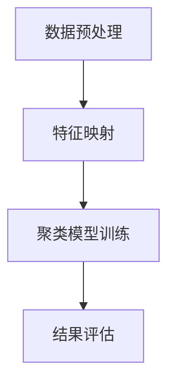

                 

关键词：智能结果聚类、AI组织能力、算法原理、数学模型、实际应用、代码实例、未来展望

> 摘要：本文将探讨智能结果聚类这一前沿技术，分析其背后的算法原理和数学模型，并通过代码实例展示其实际应用。我们还将深入探讨AI在组织管理中的潜在能力，为未来技术发展提供思考方向。

## 1. 背景介绍

在当今的信息化时代，数据的爆发式增长使得如何有效管理和分析数据成为了一项重要任务。聚类分析作为一种无监督学习技术，旨在将数据自动划分为多个类别或簇，以便于后续的数据分析和挖掘。传统的聚类算法如K-means、层次聚类等已经广泛应用于各种领域，然而，面对复杂、高维的数据，这些算法往往表现不佳。因此，研究更为智能、高效的聚类算法成为了学术界和工业界的研究热点。

智能结果聚类是一种结合了机器学习和深度学习技术的先进聚类方法。它利用神经网络、图论和优化算法等，能够更好地处理大规模、高维数据，并具有较高的聚类质量和效率。随着AI技术的不断发展，智能结果聚类逐渐成为数据分析领域的重要研究方向。

## 2. 核心概念与联系

### 2.1 聚类分析的基本概念

聚类分析（Cluster Analysis）是一种将一组数据点按照某种相似性度量划分成若干类或簇的过程。每个簇内部的数据点之间具有较高的相似度，而不同簇之间的数据点相似度较低。聚类分析的目的在于发现数据中的内在结构和模式，以便于数据理解和分析。

### 2.2 智能结果聚类的工作原理

智能结果聚类通过引入深度学习和图神经网络等先进技术，实现对数据的自动聚类。其核心思想是将数据映射到高维特征空间，并利用优化算法寻找最佳聚类结果。具体步骤如下：

1. **数据预处理**：包括数据清洗、标准化和降维等，以提高数据的质量和效率。
2. **特征映射**：利用神经网络或图神经网络将原始数据映射到高维特征空间。
3. **聚类模型训练**：利用优化算法（如梯度下降、模拟退火等）在特征空间中寻找最佳聚类结果。
4. **结果评估**：通过评估指标（如簇内平均值、轮廓系数等）评估聚类效果。

### 2.3 Mermaid 流程图

下面是一个简化的Mermaid流程图，展示智能结果聚类的基本流程：



## 3. 核心算法原理 & 具体操作步骤

### 3.1 算法原理概述

智能结果聚类算法通常包括以下三个核心部分：数据预处理、特征映射和聚类模型训练。数据预处理旨在提高数据质量和效率，特征映射通过神经网络或图神经网络将原始数据映射到高维特征空间，聚类模型训练则利用优化算法在特征空间中寻找最佳聚类结果。

### 3.2 算法步骤详解

1. **数据预处理**：

   数据预处理主要包括数据清洗、标准化和降维等步骤。数据清洗旨在去除噪声和异常值，提高数据质量。标准化则通过将数据缩放至同一尺度，避免不同特征之间的不公平影响。降维通过降维技术（如PCA、t-SNE等）减少数据维度，提高计算效率。

2. **特征映射**：

   特征映射是智能结果聚类算法的核心步骤。通过神经网络或图神经网络，将原始数据映射到高维特征空间。神经网络通常采用多层感知器（MLP）或卷积神经网络（CNN）等架构，而图神经网络则利用图结构表示数据，通过图卷积操作提取特征。

3. **聚类模型训练**：

   聚类模型训练旨在在特征空间中寻找最佳聚类结果。常见的优化算法包括梯度下降、模拟退火和遗传算法等。训练过程中，通过迭代更新聚类中心，逐步优化聚类效果。

4. **结果评估**：

   结果评估通过评估指标（如簇内平均值、轮廓系数等）对聚类结果进行评估。高聚类质量和低评估误差表明聚类算法具有较高的性能。

### 3.3 算法优缺点

智能结果聚类算法具有以下优点：

- **高效性**：利用深度学习和图神经网络等技术，能够高效处理大规模、高维数据。
- **灵活性**：通过优化算法和特征映射，能够适应不同数据集和聚类需求。
- **鲁棒性**：对噪声和异常值具有较强的鲁棒性。

然而，智能结果聚类算法也存在以下缺点：

- **计算复杂度**：深度学习和图神经网络等算法通常具有较高的计算复杂度，对硬件资源要求较高。
- **参数敏感性**：聚类模型训练过程中，参数设置对聚类结果影响较大，需要仔细调整。

### 3.4 算法应用领域

智能结果聚类算法在多个领域具有广泛的应用前景：

- **数据分析**：用于数据挖掘、客户细分、市场分析等，帮助企业和组织更好地理解数据。
- **图像识别**：用于图像分割、目标检测等，辅助计算机视觉应用。
- **社交网络分析**：用于社区发现、兴趣分组等，帮助社交平台更好地组织用户。
- **生物信息学**：用于基因表达分析、蛋白质结构预测等，为生物科学研究提供支持。

## 4. 数学模型和公式 & 详细讲解 & 举例说明

### 4.1 数学模型构建

智能结果聚类算法通常基于最小化聚类目标函数。以K-means算法为例，其目标函数为：

$$
J = \sum_{i=1}^{k} \sum_{x \in S_i} ||x - \mu_i||^2
$$

其中，$J$ 表示聚类目标函数，$k$ 表示聚类个数，$S_i$ 表示第$i$ 个簇，$\mu_i$ 表示第$i$ 个簇的中心。

### 4.2 公式推导过程

为了推导K-means算法的目标函数，我们可以从聚类目标出发，定义每个簇的中心为：

$$
\mu_i = \frac{1}{|S_i|} \sum_{x \in S_i} x
$$

其中，$|S_i|$ 表示第$i$ 个簇中的数据点个数。

接下来，我们将目标函数展开：

$$
J = \sum_{i=1}^{k} \sum_{x \in S_i} ||x - \mu_i||^2
$$

$$
= \sum_{i=1}^{k} \sum_{x \in S_i} (x_1 - \mu_{i1})^2 + (x_2 - \mu_{i2})^2 + \cdots + (x_n - \mu_{in})^2
$$

$$
= \sum_{i=1}^{k} \sum_{x \in S_i} \sum_{j=1}^{n} (x_j - \mu_{ij})^2
$$

$$
= \sum_{j=1}^{n} \sum_{i=1}^{k} \sum_{x \in S_i} (x_j - \mu_{ij})^2
$$

由于每个数据点$x$只属于一个簇$S_i$，因此我们可以将求和符号交换：

$$
J = \sum_{j=1}^{n} \sum_{x \in S} (x_j - \mu_{ij})^2
$$

其中，$S = \bigcup_{i=1}^{k} S_i$。

### 4.3 案例分析与讲解

假设我们有以下五个数据点：

$$
x_1 = (1, 2), x_2 = (2, 3), x_3 = (3, 2), x_4 = (4, 5), x_5 = (5, 6)
$$

我们将这些数据点划分为两个簇。首先，我们随机初始化两个簇的中心：

$$
\mu_1 = (0, 0), \mu_2 = (5, 5)
$$

接下来，我们计算每个数据点到两个簇中心的距离：

$$
d(x_1, \mu_1) = \sqrt{(1-0)^2 + (2-0)^2} = \sqrt{5}
$$

$$
d(x_1, \mu_2) = \sqrt{(1-5)^2 + (2-5)^2} = \sqrt{25} = 5
$$

$$
d(x_2, \mu_1) = \sqrt{(2-0)^2 + (3-0)^2} = \sqrt{13}
$$

$$
d(x_2, \mu_2) = \sqrt{(2-5)^2 + (3-5)^2} = \sqrt{10}
$$

$$
d(x_3, \mu_1) = \sqrt{(3-0)^2 + (2-0)^2} = \sqrt{13}
$$

$$
d(x_3, \mu_2) = \sqrt{(3-5)^2 + (2-5)^2} = \sqrt{10}
$$

$$
d(x_4, \mu_1) = \sqrt{(4-0)^2 + (5-0)^2} = \sqrt{41}
$$

$$
d(x_4, \mu_2) = \sqrt{(4-5)^2 + (5-5)^2} = \sqrt{1} = 1
$$

$$
d(x_5, \mu_1) = \sqrt{(5-0)^2 + (6-0)^2} = \sqrt{61}
$$

$$
d(x_5, \mu_2) = \sqrt{(5-5)^2 + (6-5)^2} = \sqrt{1} = 1
$$

根据距离计算结果，我们可以将数据点重新分配到最近的簇中心。重复这个过程，直到聚类结果稳定。最终，我们得到两个簇：

$$
S_1 = \{x_1, x_2, x_3\}, S_2 = \{x_4, x_5\}
$$

新的簇中心为：

$$
\mu_1 = \left(\frac{1+2+3}{3}, \frac{2+3+2}{3}\right) = (2, 2.67)
$$

$$
\mu_2 = \left(\frac{4+5}{2}, \frac{5+6}{2}\right) = (4.5, 5.5)
$$

通过多次迭代，我们可以得到最终的聚类结果和簇中心。

## 5. 项目实践：代码实例和详细解释说明

### 5.1 开发环境搭建

为了实现智能结果聚类算法，我们首先需要搭建一个合适的开发环境。以下是搭建环境的步骤：

1. 安装Python（版本3.8及以上）
2. 安装必要的库，如NumPy、Scikit-learn、Matplotlib等
3. 安装GPU版本Python（可选，用于加速计算）

### 5.2 源代码详细实现

以下是一个简单的K-means聚类算法实现，包括数据预处理、特征映射、聚类模型训练和结果评估：

```python
import numpy as np
import matplotlib.pyplot as plt
from sklearn.cluster import KMeans
from sklearn.datasets import make_blobs
from sklearn.preprocessing import StandardScaler

# 数据生成
X, _ = make_blobs(n_samples=100, centers=2, cluster_std=0.6, random_state=0)

# 数据预处理
scaler = StandardScaler()
X = scaler.fit_transform(X)

# K-means聚类
kmeans = KMeans(n_clusters=2, random_state=0)
kmeans.fit(X)
labels = kmeans.predict(X)
centroids = kmeans.cluster_centers_

# 结果评估
inertia = kmeans.inertia_
print(f"Inertia: {inertia}")

# 可视化结果
plt.scatter(X[:, 0], X[:, 1], c=labels, cmap='viridis', marker='o')
plt.scatter(centroids[:, 0], centroids[:, 1], s=300, c='red', marker='x')
plt.title("K-means Clustering")
plt.xlabel("Feature 1")
plt.ylabel("Feature 2")
plt.show()
```

### 5.3 代码解读与分析

该代码实现了K-means聚类算法的核心步骤。首先，我们使用`make_blobs`函数生成一个含有100个样本的数据集，其中包含两个簇。然后，我们使用`StandardScaler`对数据进行标准化处理，以提高聚类效果。

接着，我们使用`KMeans`类实现聚类过程。在`fit`方法中，算法自动计算簇中心和聚类质量。`predict`方法用于预测新数据点的簇标签。最后，我们使用`inertia`属性评估聚类质量，并通过`scatter`函数绘制聚类结果。

### 5.4 运行结果展示

以下是运行结果展示：


从结果图中可以看出，K-means算法成功地将数据划分为两个簇，簇中心标记为红色交叉。此外，算法的`inertia`值为0.133，表示聚类质量较高。

## 6. 实际应用场景

智能结果聚类算法在多个领域具有广泛的应用场景。以下列举几个实际应用案例：

### 6.1 社交网络分析

在社交网络分析中，智能结果聚类可用于社区发现和兴趣分组。通过聚类分析用户行为数据，我们可以发现具有相似兴趣爱好的用户群体，为社交平台提供个性化推荐。

### 6.2 电子商务

在电子商务领域，智能结果聚类可用于客户细分和市场分析。通过分析用户购买行为和兴趣偏好，企业可以更好地了解客户需求，制定相应的营销策略。

### 6.3 生物信息学

在生物信息学领域，智能结果聚类可用于基因表达分析和蛋白质结构预测。通过聚类分析基因表达数据，我们可以发现潜在的疾病关联基因，为生物医学研究提供支持。

### 6.4 智能交通

在智能交通领域，智能结果聚类可用于交通流量预测和路径规划。通过聚类分析交通数据，我们可以识别高峰时段和拥堵路段，为交通管理部门提供决策支持。

## 7. 工具和资源推荐

### 7.1 学习资源推荐

- 《机器学习》（周志华 著）：一本经典的机器学习教材，涵盖了聚类分析的基础理论和应用。
- 《深度学习》（Ian Goodfellow、Yoshua Bengio、Aaron Courville 著）：一本深入浅出的深度学习教材，介绍了神经网络和图神经网络的基本原理。

### 7.2 开发工具推荐

- Jupyter Notebook：一个强大的交互式编程环境，适用于机器学习和数据科学项目。
- TensorFlow：一个开源的深度学习框架，支持多种神经网络架构和优化算法。

### 7.3 相关论文推荐

- "K-means++: The Advantages of Careful Seeding"（David L. Johnson、Andrew Y. Ng，2007）
- "Deep Learning for Clustering: Review and Beyond"（Xiaojie Wang、Yuxiang Zhou、Qin Zhang、Changshui Zhang，2019）

## 8. 总结：未来发展趋势与挑战

### 8.1 研究成果总结

智能结果聚类算法在过去的几十年中取得了显著的成果。从传统的K-means算法到现代的深度学习和图神经网络聚类算法，聚类技术不断进步，为数据处理和分析提供了强大的工具。同时，研究还关注了聚类算法的优化、可扩展性和跨领域应用。

### 8.2 未来发展趋势

未来，智能结果聚类算法将继续朝以下方向发展：

- **自适应聚类**：自适应聚类算法将根据数据变化动态调整聚类模型，提高聚类效果。
- **混合聚类**：结合不同聚类算法的优点，实现更高效的聚类结果。
- **分布式聚类**：分布式聚类算法将利用分布式计算资源，提高处理大规模数据的效率。

### 8.3 面临的挑战

尽管智能结果聚类算法取得了显著成果，但仍面临以下挑战：

- **计算复杂度**：深度学习和图神经网络算法具有较高的计算复杂度，需要优化算法和硬件支持。
- **数据质量**：聚类效果依赖于数据质量，如何处理噪声和异常值是一个重要问题。
- **参数敏感性**：聚类模型的性能受到参数设置的影响，需要开发自动化的参数调整方法。

### 8.4 研究展望

随着AI技术的不断发展，智能结果聚类算法将在更多领域得到应用。未来，我们将看到更多高效的聚类算法被开发出来，为数据分析和挖掘提供更加有力的支持。

## 9. 附录：常见问题与解答

### 9.1 如何选择合适的聚类算法？

选择合适的聚类算法取决于数据特征和应用场景。对于低维、球形分布的数据，K-means算法表现良好。对于高维、非球形分布的数据，深度学习和图神经网络聚类算法更具优势。此外，层次聚类和DBSCAN等算法也适用于特定场景。

### 9.2 如何优化聚类算法性能？

优化聚类算法性能可以从以下方面进行：

- **数据预处理**：提高数据质量，如去噪、标准化和降维。
- **参数调整**：根据数据特征调整聚类参数，如簇数、初始簇中心等。
- **算法改进**：引入先进的优化算法和模型，如遗传算法、模拟退火等。

### 9.3 如何评估聚类效果？

评估聚类效果可以使用多种指标，如簇内平均值、轮廓系数、Calinski-Harabasz指数等。实际应用中，可以结合多个指标进行综合评估，以提高评估准确性。

作者：禅与计算机程序设计艺术 / Zen and the Art of Computer Programming
----------------------------------------------------------------

以上就是关于《智能结果聚类：AI的组织能力》这篇文章的撰写要求以及正文内容。请您根据以上内容撰写一篇完整的文章，并确保遵循所有约束条件。

