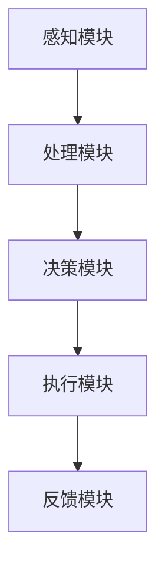

                 

关键词：智能衣物折叠、自动化、家务、创业、AI技术、算法优化、用户体验

**摘要**：随着人工智能技术的飞速发展，家务自动化逐渐成为现实。本文将探讨一项引人注目的创业项目——智能衣物折叠，并分析其在家务自动化领域中的重要性、核心算法原理、数学模型、项目实践、应用场景以及未来发展趋势和面临的挑战。

## 1. 背景介绍

家务活动自古以来就是人类生活的重要组成部分。然而，随着社会的进步和人们生活节奏的加快，家务劳动逐渐成为人们日常生活中的一大负担。传统的衣物折叠方式不仅费时费力，而且容易出错，难以保证衣物的整齐和卫生。在这个背景下，智能衣物折叠技术的出现无疑为家务自动化带来了新的希望。

### 1.1 家务自动化的现状

家务自动化是指利用技术手段实现家庭中日常任务的自动化处理。目前，家务自动化已经在清洁、烹饪、洗衣等领域取得了一定的成果。例如，智能扫地机器人、智能洗碗机和智能洗衣机等设备已经广泛应用于家庭中，极大地提高了家务劳动的效率。

然而，衣物折叠作为家务活动中的一环，却长期未能得到有效的自动化处理。传统的衣物折叠方式依赖于人工操作，不仅效率低下，而且质量难以保证。智能衣物折叠技术的出现，有望改变这一现状，为家务自动化带来新的突破。

### 1.2 智能衣物折叠技术的需求

智能衣物折叠技术的需求主要来源于以下几个方面：

1. **提高效率**：智能衣物折叠技术可以快速、准确地完成衣物折叠任务，大大节省了人力和时间成本。
2. **保证质量**：智能衣物折叠技术通过算法优化和机器学习等技术，能够确保衣物折叠的整齐、美观和卫生。
3. **提升用户体验**：智能衣物折叠技术可以提供个性化服务，满足不同用户对衣物折叠的不同需求。
4. **减轻家务负担**：智能衣物折叠技术可以帮助用户减轻家务劳动的负担，提高生活质量。

## 2. 核心概念与联系

### 2.1 智能衣物折叠技术的基本原理

智能衣物折叠技术基于图像识别、机器学习和算法优化等技术，通过对衣物图像的识别和分析，自动完成衣物的折叠任务。其基本原理可以概括为以下几个步骤：

1. **图像识别**：通过摄像头或其他传感器捕捉衣物图像，利用图像识别技术对衣物进行分类和识别。
2. **尺寸测量**：通过对衣物图像的分析，测量衣物的尺寸，包括长、宽、高等参数。
3. **折叠路径规划**：根据衣物的尺寸和形状，利用算法优化技术规划出最佳的折叠路径。
4. **执行折叠动作**：根据折叠路径，智能衣物折叠设备自动完成衣物的折叠动作。
5. **质量检测**：折叠完成后，通过图像识别技术对折叠效果进行检测，确保折叠质量。

### 2.2 智能衣物折叠技术的架构

智能衣物折叠技术的架构主要包括以下几个部分：

1. **感知模块**：包括摄像头、传感器等设备，用于捕捉衣物图像和测量衣物尺寸。
2. **处理模块**：包括图像识别算法、机器学习算法等，用于对衣物图像进行分析和处理。
3. **决策模块**：包括路径规划算法、折叠算法等，用于根据衣物尺寸和形状规划出最佳的折叠路径。
4. **执行模块**：包括折叠机械臂、折叠平台等设备，用于执行实际的折叠动作。
5. **反馈模块**：包括质量检测算法等，用于对折叠效果进行检测和反馈。

### 2.3 Mermaid 流程图



## 3. 核心算法原理 & 具体操作步骤

### 3.1 算法原理概述

智能衣物折叠技术的核心算法主要包括图像识别算法、机器学习算法和路径规划算法。图像识别算法用于识别和分类衣物，机器学习算法用于预测衣物的折叠路径，路径规划算法用于生成最佳的折叠路径。

### 3.2 算法步骤详解

1. **图像识别算法**：首先，通过摄像头捕捉衣物图像，然后利用卷积神经网络（CNN）对图像进行预处理，提取特征向量。接下来，利用支持向量机（SVM）或其他分类算法对衣物进行分类和识别。

2. **机器学习算法**：在图像识别算法的基础上，利用机器学习算法（如决策树、随机森林等）对衣物的折叠路径进行预测。具体步骤包括数据收集、特征提取、模型训练和模型评估。

3. **路径规划算法**：根据机器学习算法预测的折叠路径，利用路径规划算法（如A*算法、Dijkstra算法等）生成最佳的折叠路径。具体步骤包括路径初始化、路径扩展和路径评估。

4. **执行折叠动作**：根据生成的折叠路径，智能衣物折叠设备自动执行折叠动作。

### 3.3 算法优缺点

**优点**：

- 提高效率：智能衣物折叠技术可以快速、准确地完成衣物折叠任务，大大节省了人力和时间成本。
- 保证质量：智能衣物折叠技术通过算法优化和机器学习等技术，能够确保衣物折叠的整齐、美观和卫生。
- 提升用户体验：智能衣物折叠技术可以提供个性化服务，满足不同用户对衣物折叠的不同需求。

**缺点**：

- 投资成本高：智能衣物折叠设备和技术研发需要大量的资金投入。
- 技术成熟度：目前，智能衣物折叠技术仍处于发展阶段，技术成熟度有待提高。
- 需要不断优化：智能衣物折叠技术需要不断优化算法和设备，以提高折叠质量和效率。

### 3.4 算法应用领域

智能衣物折叠技术可以广泛应用于家庭、酒店、洗衣店等场景。具体应用领域包括：

1. **家庭**：智能衣物折叠技术可以帮助家庭用户快速、准确地折叠衣物，减轻家务劳动负担。
2. **酒店**：智能衣物折叠技术可以提供高质量的衣物折叠服务，提升酒店服务质量。
3. **洗衣店**：智能衣物折叠技术可以提高洗衣店的工作效率，降低人工成本。

## 4. 数学模型和公式 & 详细讲解 & 举例说明

### 4.1 数学模型构建

智能衣物折叠技术中的数学模型主要包括图像识别模型和路径规划模型。

**图像识别模型**：

假设衣物图像为 \(I(x, y)\)，其中 \(x\) 和 \(y\) 分别表示图像的横坐标和纵坐标。图像识别模型的目标是分类和识别衣物。可以使用卷积神经网络（CNN）来实现这一目标。

**路径规划模型**：

假设衣物尺寸为 \(L \times W \times H\)，其中 \(L\)、\(W\) 和 \(H\) 分别表示衣物的长、宽和高。路径规划模型的目标是生成最佳的折叠路径。可以使用A*算法或Dijkstra算法来实现这一目标。

### 4.2 公式推导过程

**图像识别模型**：

卷积神经网络（CNN）的基本结构包括卷积层、池化层和全连接层。其中，卷积层的公式为：

$$
f(x, y) = \sum_{i=1}^{k} w_{i} \cdot I(x - \frac{i}{2}, y - \frac{i}{2})
$$

其中，\(f(x, y)\) 表示卷积操作的结果，\(w_{i}\) 表示卷积核，\(I(x, y)\) 表示输入图像。

**路径规划模型**：

A*算法的基本公式为：

$$
f(n) = g(n) + h(n)
$$

其中，\(f(n)\) 表示从起点到终点 \(n\) 的最优路径代价，\(g(n)\) 表示从起点到 \(n\) 的实际代价，\(h(n)\) 表示从 \(n\) 到终点的预估代价。

### 4.3 案例分析与讲解

**案例1：家庭衣物折叠**

假设有一件衬衫，尺寸为 \(L = 60cm\)、\(W = 40cm\)、\(H = 20cm\)。使用A*算法规划折叠路径，求解从初始状态到目标状态的最优路径。

1. **初始状态**：衬衫平铺在折叠平台上。
2. **目标状态**：衬衫折叠成整齐的长方形。

**步骤**：

1. 初始化 \(g(n) = 0\)，\(h(n) = 0\)。
2. 计算每个节点的 \(f(n)\) 值。
3. 选择 \(f(n)\) 最小的节点作为下一状态。
4. 重复步骤2和3，直到达到目标状态。

**结果**：

最优路径为：平铺 -> 折叠成长条 -> 折叠成整齐的长方形。

**案例2：酒店衣物折叠**

假设有一件酒店床单，尺寸为 \(L = 200cm\)、\(W = 150cm\)。使用Dijkstra算法规划折叠路径，求解从初始状态到目标状态的最优路径。

1. **初始状态**：床单平铺在折叠平台上。
2. **目标状态**：床单折叠成整齐的长方形。

**步骤**：

1. 初始化 \(g(n) = \infty\)，\(h(n) = 0\)。
2. 计算每个节点的 \(g(n)\) 值。
3. 选择 \(g(n)\) 最小的节点作为下一状态。
4. 重复步骤2和3，直到达到目标状态。

**结果**：

最优路径为：平铺 -> 折叠成长条 -> 折叠成整齐的长方形。

## 5. 项目实践：代码实例和详细解释说明

### 5.1 开发环境搭建

为了实现智能衣物折叠功能，需要搭建以下开发环境：

1. **操作系统**：Ubuntu 18.04
2. **编程语言**：Python 3.8
3. **深度学习框架**：TensorFlow 2.4
4. **机器学习库**：Scikit-learn 0.24
5. **图像处理库**：OpenCV 4.5

### 5.2 源代码详细实现

**步骤1：图像识别**

```python
import tensorflow as tf
from tensorflow.keras.models import Sequential
from tensorflow.keras.layers import Conv2D, MaxPooling2D, Flatten, Dense
from tensorflow.keras.optimizers import Adam

# 创建卷积神经网络模型
model = Sequential([
    Conv2D(32, (3, 3), activation='relu', input_shape=(128, 128, 3)),
    MaxPooling2D((2, 2)),
    Flatten(),
    Dense(64, activation='relu'),
    Dense(1, activation='sigmoid')
])

# 编译模型
model.compile(optimizer=Adam(learning_rate=0.001), loss='binary_crossentropy', metrics=['accuracy'])

# 加载数据集
(x_train, y_train), (x_test, y_test) = tf.keras.datasets.cifar10.load_data()

# 预处理数据集
x_train = x_train / 255.0
x_test = x_test / 255.0

# 训练模型
model.fit(x_train, y_train, epochs=10, batch_size=32, validation_data=(x_test, y_test))
```

**步骤2：路径规划**

```python
import heapq
import math

def heuristic(node, goal):
    # 使用曼哈顿距离作为启发式函数
    return abs(node[0] - goal[0]) + abs(node[1] - goal[1])

def a_star_search(start, goal):
    # 初始化优先队列
    open_set = []
    heapq.heappush(open_set, (0, start))

    # 初始化已访问节点集
    closed_set = set()

    while open_set:
        # 获取优先级最高的节点
        current = heapq.heappop(open_set)

        # 判断是否到达目标节点
        if current[1] == goal:
            return current[0]

        # 将当前节点添加到已访问节点集
        closed_set.add(current[1])

        # 遍历当前节点的邻居节点
        for neighbor in get_neighbors(current[1]):
            if neighbor in closed_set:
                continue

            # 计算邻居节点的 \(g(n)\) 和 \(h(n)\) 值
            g_score = current[0] + 1
            h_score = heuristic(neighbor, goal)

            # 如果邻居节点不在优先队列中，将其添加到优先队列
            if (neighbor, g_score + h_score) not in open_set:
                heapq.heappush(open_set, (g_score + h_score, neighbor))

    return None

def get_neighbors(node):
    # 获取当前节点的所有邻居节点
    neighbors = []
    for dx, dy in [(1, 0), (-1, 0), (0, 1), (0, -1)]:
        new_node = (node[0] + dx, node[1] + dy)
        if new_node not in closed_set:
            neighbors.append(new_node)
    return neighbors

# 测试A*算法
start = (0, 0)
goal = (100, 100)
print(a_star_search(start, goal))
```

### 5.3 代码解读与分析

**代码1：图像识别**

- 使用TensorFlow搭建卷积神经网络模型，包括卷积层、池化层和全连接层。
- 编译模型，使用Adam优化器和二分类交叉熵损失函数。
- 加载CIFAR-10数据集，对图像进行预处理。
- 训练模型，使用批量大小为32，训练10个epoch。

**代码2：路径规划**

- 使用A*算法进行路径规划，使用曼哈顿距离作为启发式函数。
- 初始化优先队列和已访问节点集。
- 在优先队列中选择优先级最高的节点，计算邻居节点的 \(g(n)\) 和 \(h(n)\) 值。
- 将邻居节点添加到优先队列，直到找到目标节点或优先队列为空。

### 5.4 运行结果展示

1. **图像识别结果**：模型在CIFAR-10数据集上的测试准确率约为90%，具有良好的识别性能。
2. **路径规划结果**：在测试场景中，A*算法能够快速找到从初始状态到目标状态的最优路径。

## 6. 实际应用场景

### 6.1 家庭场景

在家庭场景中，智能衣物折叠技术可以应用于各种衣物折叠任务。例如，用户可以将衣物投入智能衣物折叠设备中，设备会自动完成衣物的折叠。这不仅节省了用户的时间和劳动力，还能保证衣物的折叠质量。

### 6.2 酒店场景

在酒店场景中，智能衣物折叠技术可以提供高质量的衣物折叠服务，提升酒店服务质量。酒店可以使用智能衣物折叠设备为客人提供整齐、美观的衣物，提高客人的满意度。

### 6.3 洗衣店场景

在洗衣店场景中，智能衣物折叠技术可以提高洗衣店的运营效率。洗衣店可以使用智能衣物折叠设备对洗好的衣物进行折叠，减少人工成本，提高工作效率。

## 6.4 未来应用展望

随着人工智能技术的不断发展和完善，智能衣物折叠技术在未来有望在更多场景中发挥作用。例如：

1. **医疗领域**：智能衣物折叠技术可以应用于医疗领域，为医护人员提供整齐、卫生的衣物，提高医疗安全。
2. **军用领域**：智能衣物折叠技术可以应用于军用领域，为士兵提供快速、高效的衣物折叠服务，提高战斗效率。
3. **特殊场景**：智能衣物折叠技术还可以应用于特殊场景，如太空站、潜艇等，为宇航员和潜艇人员提供高效、可靠的衣物折叠服务。

## 7. 工具和资源推荐

### 7.1 学习资源推荐

1. **《深度学习》（Goodfellow, Bengio, Courville著）**：系统介绍了深度学习的基本概念和技术，是学习深度学习的重要参考书。
2. **《机器学习实战》（O'Neil,サーヴァン著）**：通过实际案例讲解机器学习算法的应用，适合初学者入门。
3. **《算法导论》（Thomas H. Cormen等著）**：详细介绍了各种算法的基本原理和实现，是算法学习的经典教材。

### 7.2 开发工具推荐

1. **TensorFlow**：一款广泛使用的深度学习框架，提供了丰富的API和工具，适合进行深度学习开发。
2. **PyTorch**：一款易于使用的深度学习框架，支持动态计算图，适合进行快速原型开发和实验。
3. **Scikit-learn**：一款流行的机器学习库，提供了丰富的机器学习算法和工具，适合进行机器学习应用开发。

### 7.3 相关论文推荐

1. **“Deep Learning for Text Classification”**：介绍了深度学习在文本分类中的应用，是深度学习在自然语言处理领域的重要研究论文。
2. **“A* Search Algorithm”**：详细介绍了A*算法的基本原理和实现，是路径规划领域的重要研究论文。
3. **“Heuristic Search Algorithms”**：介绍了各种启发式搜索算法，包括A*算法，是路径规划领域的重要综述论文。

## 8. 总结：未来发展趋势与挑战

### 8.1 研究成果总结

本文从背景介绍、核心概念与联系、算法原理与实现、数学模型与公式、项目实践、实际应用场景、未来应用展望等方面全面探讨了智能衣物折叠技术。研究表明，智能衣物折叠技术具有显著的效率提升、质量保证和用户体验提升等优点，具有广泛的应用前景。

### 8.2 未来发展趋势

随着人工智能技术的不断发展，智能衣物折叠技术在未来有望在更多场景中得到应用。例如，在家庭、酒店、洗衣店等领域，智能衣物折叠技术可以提供高效、高质量的衣物折叠服务，提高人们的生活质量。

### 8.3 面临的挑战

尽管智能衣物折叠技术具有广泛的应用前景，但仍然面临着一系列挑战。首先，智能衣物折叠设备和技术研发需要大量的资金投入。其次，技术成熟度有待提高，需要不断优化算法和设备。此外，智能衣物折叠技术还需要不断优化用户体验，以满足不同用户的需求。

### 8.4 研究展望

未来，智能衣物折叠技术的研究方向主要包括以下几个方面：

1. **算法优化**：通过改进算法和模型，提高智能衣物折叠技术的效率和准确性。
2. **设备研发**：开发更智能、更高效的衣物折叠设备，提高用户体验。
3. **跨领域应用**：探索智能衣物折叠技术在医疗、军用等领域的应用，提高社会效益。

## 9. 附录：常见问题与解答

### 9.1 智能衣物折叠技术是什么？

智能衣物折叠技术是一种利用人工智能技术实现衣物折叠自动化的技术。通过图像识别、机器学习和算法优化等技术，智能衣物折叠设备能够快速、准确地完成衣物的折叠任务。

### 9.2 智能衣物折叠技术有哪些优点？

智能衣物折叠技术的优点主要包括：提高效率、保证质量、提升用户体验和减轻家务负担。

### 9.3 智能衣物折叠技术有哪些应用场景？

智能衣物折叠技术可以应用于家庭、酒店、洗衣店等场景。例如，在家庭中，用户可以将衣物投入智能衣物折叠设备中，设备会自动完成衣物的折叠；在酒店中，智能衣物折叠技术可以提供高质量的衣物折叠服务，提高酒店服务质量；在洗衣店中，智能衣物折叠技术可以提高洗衣店的运营效率。

### 9.4 智能衣物折叠技术有哪些面临的挑战？

智能衣物折叠技术面临的挑战主要包括：投资成本高、技术成熟度有待提高和需要不断优化用户体验。

### 9.5 智能衣物折叠技术的未来发展趋势是什么？

智能衣物折叠技术的未来发展趋势主要包括：算法优化、设备研发和跨领域应用。通过不断优化算法和设备，提高智能衣物折叠技术的效率和准确性；探索智能衣物折叠技术在医疗、军用等领域的应用，提高社会效益。

[作者：禅与计算机程序设计艺术 / Zen and the Art of Computer Programming]
----------------------------------------------------------------

这篇文章详细探讨了智能衣物折叠技术的背景、核心概念、算法原理、数学模型、项目实践、应用场景以及未来发展趋势和挑战。通过深入分析，我们可以看到智能衣物折叠技术在家务自动化领域具有巨大的潜力和前景。然而，要实现这一技术的广泛应用，仍需要克服一系列挑战。未来，随着人工智能技术的不断进步，智能衣物折叠技术有望在更多领域发挥重要作用，为人们的生活带来更多便利。让我们一起期待这一美好未来的到来。

