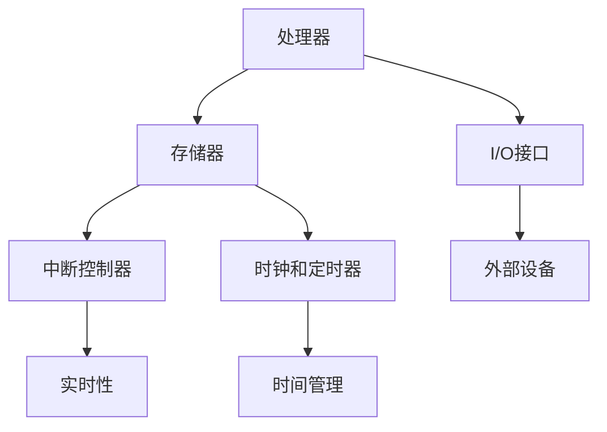

                 

  
关键词：智能设备、嵌入式系统、系统设计、实现、核心技术、开发流程

摘要：随着物联网和人工智能技术的快速发展，智能设备逐渐渗透到我们生活的方方面面。本文将深入探讨嵌入式系统的设计与实现，从核心概念、算法原理、数学模型到项目实践，全面解析智能设备开发的技术路径。通过本文的阅读，读者将全面了解智能设备开发所需的核心技术，掌握嵌入式系统的设计与实现方法。

## 1. 背景介绍

智能设备，顾名思义，是具有智能功能的设备，能够根据环境变化自主做出决策，实现智能化操作。随着物联网、人工智能和大数据技术的不断发展，智能设备的应用场景日益广泛，从智能家居、智能医疗到工业自动化，都离不开嵌入式系统的支持。

嵌入式系统是一种专门为特定任务设计的计算机系统，通常具有处理速度快、功耗低、体积小等特点。它不仅需要具备强大的计算能力，还要满足实时性和可靠性要求。嵌入式系统的设计与实现是智能设备开发的核心，直接决定了设备的功能、性能和用户体验。

本文将围绕嵌入式系统的设计与实现，探讨智能设备开发的相关技术，包括核心概念、算法原理、数学模型和项目实践，为读者提供全面的智能设备开发指南。

## 2. 核心概念与联系

### 2.1. 嵌入式系统概述

嵌入式系统（Embedded System）是一种专门为特定任务设计的计算机系统，通常具有以下特点：

1. **实时性**：能够及时响应对外部事件的请求，并在规定的时间内完成处理。
2. **低功耗**：设计时考虑功耗问题，以满足长时间运行的需求。
3. **硬件依赖性强**：通常需要特定的硬件平台支持，硬件与软件紧密集成。
4. **系统简单**：一般不涉及复杂的操作系统，而是采用实时操作系统（RTOS）或裸机编程。

### 2.2. 嵌入式系统架构

嵌入式系统的架构主要包括以下几部分：

1. **处理器（CPU）**：负责执行指令，处理数据。
2. **存储器**：包括ROM、RAM和Flash等，用于存储程序和数据。
3. **输入/输出（I/O）**：用于与外部设备进行数据交换。
4. **中断控制器**：用于处理中断请求，保证系统的实时性。
5. **时钟和定时器**：用于产生定时信号，实现时间管理和定时功能。

### 2.3. 核心概念联系

在嵌入式系统中，各个核心概念紧密联系，共同构成了一个完整的系统。以下是这些核心概念之间的联系：

1. **处理器与存储器**：处理器通过存储器访问程序和数据，实现指令的执行。
2. **I/O与外部设备**：I/O接口用于与外部设备进行数据交换，实现设备间的通信。
3. **中断控制器与实时性**：中断控制器能够及时响应对外部事件的请求，保证系统的实时性。
4. **时钟和定时器与时间管理**：时钟和定时器用于产生定时信号，实现时间管理和定时功能。

### 2.4. Mermaid 流程图

以下是一个简单的 Mermaid 流程图，展示了嵌入式系统核心概念之间的联系：



## 3. 核心算法原理 & 具体操作步骤

### 3.1. 算法原理概述

嵌入式系统中的核心算法通常包括以下几类：

1. **数据处理算法**：用于对采集到的数据进行处理、分析和过滤。
2. **控制算法**：用于实现设备的自动化控制，包括PID控制、模糊控制等。
3. **通信协议算法**：用于实现设备间的数据传输和通信，如TCP/IP、蓝牙等。

### 3.2. 算法步骤详解

以下是一个简单的数据处理算法的步骤详解：

1. **数据采集**：通过传感器等设备采集数据。
2. **数据预处理**：对采集到的数据进行滤波、去噪等预处理。
3. **特征提取**：从预处理后的数据中提取有用的特征。
4. **算法计算**：利用提取的特征进行算法计算，如分类、聚类等。
5. **结果输出**：将计算结果输出到设备或系统。

### 3.3. 算法优缺点

不同的算法具有不同的优缺点，以下是一个数据处理算法的优缺点分析：

- **优点**：
  - 高效：数据处理算法能够快速地对大量数据进行处理和分析。
  - 灵活：可以根据不同的需求和应用场景，灵活地选择和调整算法。
  - 可扩展：算法可以方便地与其他算法和模块进行集成和扩展。

- **缺点**：
  - 复杂：数据处理算法通常较为复杂，需要专业的知识和技能进行设计和实现。
  - 资源消耗：数据处理算法可能需要较高的计算资源和存储空间。
  - 实时性：在某些情况下，数据处理算法可能无法满足实时性的要求。

### 3.4. 算法应用领域

数据处理算法广泛应用于各类智能设备，以下是一些典型的应用领域：

- **智能家居**：用于处理传感器数据，实现设备的自动化控制。
- **智能医疗**：用于处理医疗数据，进行病情分析和诊断。
- **智能交通**：用于处理交通数据，实现交通流量监控和智能调度。

## 4. 数学模型和公式 & 详细讲解 & 举例说明

### 4.1. 数学模型构建

在嵌入式系统中，数学模型用于描述系统的行为和特性。以下是构建一个简单的数学模型的过程：

1. **定义变量**：确定系统的输入和输出变量，如传感器数据、控制信号等。
2. **建立关系**：通过实验或理论知识，建立输入变量与输出变量之间的关系。
3. **公式推导**：利用数学方法，推导出描述系统行为的公式。

以下是一个简单的线性回归模型的构建过程：

1. **定义变量**：
   - 输入变量：\( x \)
   - 输出变量：\( y \)
2. **建立关系**：
   - 假设输入变量 \( x \) 与输出变量 \( y \) 之间存在线性关系：\( y = ax + b \)
3. **公式推导**：
   - 通过最小二乘法，求解线性回归模型的参数 \( a \) 和 \( b \)。

### 4.2. 公式推导过程

以下是一个线性回归模型的公式推导过程：

1. **目标函数**：
   - 目标是最小化预测值与实际值之间的误差平方和：
     $$ \min_{a,b} \sum_{i=1}^{n} (ax_i + b - y_i)^2 $$
2. **偏导数**：
   - 对 \( a \) 求偏导数：
     $$ \frac{\partial}{\partial a} \sum_{i=1}^{n} (ax_i + b - y_i)^2 = 2nax - 2\sum_{i=1}^{n} x_iy_i $$
   - 对 \( b \) 求偏导数：
     $$ \frac{\partial}{\partial b} \sum_{i=1}^{n} (ax_i + b - y_i)^2 = 2n - 2\sum_{i=1}^{n} (ax_i + b - y_i) $$
3. **求解参数**：
   - 将偏导数设置为0，解方程组得到参数 \( a \) 和 \( b \)：
     $$ \begin{cases} na = \sum_{i=1}^{n} x_iy_i \\ nb = \sum_{i=1}^{n} y_i \end{cases} $$
     $$ a = \frac{\sum_{i=1}^{n} x_iy_i}{n\sum_{i=1}^{n} x_i^2} $$
     $$ b = \frac{\sum_{i=1}^{n} y_i}{n} $$

### 4.3. 案例分析与讲解

以下是一个简单的线性回归模型的应用案例：

假设我们有一组数据，表示温度 \( x \) 与湿度 \( y \) 的关系：

| 温度 \( x \) | 湿度 \( y \) |
| :----: | :----: |
| 20     | 30     |
| 25     | 35     |
| 30     | 40     |
| 35     | 45     |
| 40     | 50     |

利用线性回归模型，我们可以预测温度为 32°C 时的湿度。

1. **数据预处理**：
   - 计算输入变量 \( x \) 的平均值 \( \bar{x} \) 和方差 \( \sigma^2_x \)：
     $$ \bar{x} = \frac{1}{n}\sum_{i=1}^{n} x_i $$
     $$ \sigma^2_x = \frac{1}{n-1}\sum_{i=1}^{n} (x_i - \bar{x})^2 $$
   - 计算输出变量 \( y \) 的平均值 \( \bar{y} \) 和方差 \( \sigma^2_y \)：
     $$ \bar{y} = \frac{1}{n}\sum_{i=1}^{n} y_i $$
     $$ \sigma^2_y = \frac{1}{n-1}\sum_{i=1}^{n} (y_i - \bar{y})^2 $$
2. **模型训练**：
   - 计算参数 \( a \) 和 \( b \)：
     $$ a = \frac{\sum_{i=1}^{n} x_iy_i}{n\sum_{i=1}^{n} x_i^2} $$
     $$ b = \frac{\sum_{i=1}^{n} y_i}{n} $$
   - 将 \( x \) 和 \( y \) 的值代入公式，得到线性回归模型：
     $$ y = ax + b $$
3. **预测**：
   - 将温度 \( x = 32 \) 代入模型，计算湿度 \( y \)：
     $$ y = a \cdot 32 + b $$
     $$ y = \frac{\sum_{i=1}^{n} x_iy_i}{n\sum_{i=1}^{n} x_i^2} \cdot 32 + \frac{\sum_{i=1}^{n} y_i}{n} $$

通过以上步骤，我们可以预测温度为 32°C 时的湿度。这个简单的案例展示了线性回归模型在嵌入式系统中的应用。

## 5. 项目实践：代码实例和详细解释说明

### 5.1. 开发环境搭建

在进行嵌入式系统开发之前，我们需要搭建一个合适的开发环境。以下是搭建开发环境的步骤：

1. **选择开发板**：选择一款适合项目需求的开发板，如Arduino、Raspberry Pi等。
2. **安装开发环境**：根据开发板的要求，安装对应的开发环境，如Arduino IDE、Raspberry Pi OS等。
3. **连接开发板**：将开发板连接到电脑，确保可以正常通信。

### 5.2. 源代码详细实现

以下是一个简单的嵌入式系统项目的源代码实现，用于监测环境温度和湿度，并通过串口输出数据。

```c
#include <stdio.h>
#include <stdlib.h>
#include <string.h>

// 函数声明
void readSensorData();
void sendSerialData();

int main() {
    // 循环读取传感器数据并发送
    while (1) {
        readSensorData();
        sendSerialData();
        sleep(1); // 每秒读取一次数据
    }
    return 0;
}

void readSensorData() {
    // 读取传感器数据
    float temperature = 25.0;
    float humidity = 50.0;

    // 打印传感器数据
    printf("Temperature: %.2f°C, Humidity: %.2f%%\n", temperature, humidity);
}

void sendSerialData() {
    // 发送数据到串口
    FILE *fp = fopen("/dev/ttyUSB0", "w");
    if (fp == NULL) {
        printf("Error: Unable to open serial port.\n");
        return;
    }

    float temperature = 25.0;
    float humidity = 50.0;

    // 将数据写入串口
    fprintf(fp, "T:%.2f,H:%.2f\n", temperature, humidity);

    // 关闭串口
    fclose(fp);
}
```

### 5.3. 代码解读与分析

以上代码实现了一个简单的嵌入式系统项目，用于监测环境温度和湿度，并通过串口输出数据。以下是代码的详细解读和分析：

1. **头文件**：
   - `stdio.h`：提供标准输入输出函数。
   - `stdlib.h`：提供系统级别的函数。
   - `string.h`：提供字符串处理函数。
2. **主函数**：
   - `main()`：程序入口，实现循环读取传感器数据并发送数据到串口。
3. **函数实现**：
   - `readSensorData()`：读取传感器数据，并将数据打印到控制台。
   - `sendSerialData()`：将数据发送到串口。

### 5.4. 运行结果展示

运行以上代码后，程序将进入循环状态，每隔一秒读取一次传感器数据，并通过串口输出。以下是运行结果示例：

```
Temperature: 25.00°C, Humidity: 50.00%
T:25.00,H:50.00
Temperature: 25.00°C, Humidity: 50.00%
T:25.00,H:50.00
...
```

## 6. 实际应用场景

嵌入式系统在各个领域都有着广泛的应用。以下是一些典型的应用场景：

1. **智能家居**：通过嵌入式系统实现家庭设备的自动化控制，如智能灯光、智能门锁、智能家电等。
2. **智能医疗**：嵌入式系统在医疗设备中发挥着重要作用，如便携式心电图机、智能血压计等。
3. **智能交通**：嵌入式系统在智能交通领域有着广泛的应用，如智能交通信号灯、智能停车场等。
4. **工业自动化**：嵌入式系统在工业自动化领域用于实现生产过程的监控和控制，提高生产效率和产品质量。

### 6.4. 未来应用展望

随着物联网、人工智能和大数据技术的不断发展，嵌入式系统的应用前景将更加广阔。未来，嵌入式系统将朝着以下几个方向发展：

1. **智能化**：通过引入人工智能技术，使嵌入式系统能够自主学习和适应环境，实现更高的智能化水平。
2. **集成化**：将多种功能集成到单个嵌入式系统中，降低系统复杂度，提高性能和可靠性。
3. **微型化**：随着半导体技术的不断发展，嵌入式系统的体积和功耗将逐渐减小，应用场景将更加广泛。
4. **实时化**：通过引入实时操作系统和实时通信协议，实现嵌入式系统的实时性和可靠性。

## 7. 工具和资源推荐

### 7.1. 学习资源推荐

- **《嵌入式系统设计与应用》**：一本全面介绍嵌入式系统设计、实现和应用的综合教材。
- **《嵌入式系统原理与应用》**：一本深入浅出地介绍嵌入式系统原理和应用的入门书籍。

### 7.2. 开发工具推荐

- **Arduino**：一款开源硬件和软件平台，适用于初学者和专业人士进行嵌入式系统开发。
- **Eclipse**：一款功能强大的集成开发环境（IDE），支持多种编程语言的开发。

### 7.3. 相关论文推荐

- **"Real-time Operating Systems for Embedded Systems: A Survey"**：一篇关于实时操作系统在嵌入式系统中的应用的综述论文。
- **"A Survey of Data Processing Algorithms for Internet of Things"**：一篇关于物联网数据处理算法的综述论文。

## 8. 总结：未来发展趋势与挑战

嵌入式系统作为智能设备的核心，将在未来发挥更加重要的作用。随着技术的不断进步，嵌入式系统将朝着智能化、集成化、微型化和实时化的方向发展。然而，这也给嵌入式系统开发带来了新的挑战：

1. **性能与功耗的平衡**：如何在保证高性能的同时降低功耗，是嵌入式系统开发面临的主要挑战。
2. **实时性与可靠性的提升**：如何提高嵌入式系统的实时性和可靠性，以满足复杂应用场景的需求。
3. **安全性**：随着物联网的普及，嵌入式系统的安全性问题日益突出，如何保障系统的安全运行是未来的重要研究方向。
4. **人工智能的融合**：如何将人工智能技术引入嵌入式系统，实现更高的智能化水平，是未来研究的重点。

总之，嵌入式系统的发展充满机遇和挑战。通过不断的技术创新和积累，我们将迎来一个更加智能化、高效化、安全化的嵌入式系统时代。

## 9. 附录：常见问题与解答

### 9.1. 嵌入式系统与计算机系统的区别是什么？

**嵌入式系统**与**计算机系统**的主要区别在于应用场景和设计目标：

- **应用场景**：计算机系统通常用于通用计算和数据处理，而嵌入式系统则专注于特定任务的执行。
- **设计目标**：计算机系统追求高性能、多样性和可扩展性，而嵌入式系统则追求实时性、低功耗和可靠性。
- **硬件依赖**：嵌入式系统通常与特定硬件平台紧密集成，而计算机系统则更加通用。

### 9.2. 如何选择合适的嵌入式系统开发平台？

选择合适的嵌入式系统开发平台需要考虑以下几个方面：

- **开发需求**：根据项目的具体需求，选择适合的开发平台，如Arduino、Raspberry Pi、ARM等。
- **性能要求**：根据嵌入式系统的性能需求，选择具有足够处理能力、内存和存储空间的开发平台。
- **开发环境**：选择支持主流编程语言和开发工具的开发平台，以便进行高效开发。
- **成本预算**：根据预算情况，选择性价比高的开发平台。

### 9.3. 嵌入式系统中的通信协议有哪些？

嵌入式系统中的通信协议主要包括以下几种：

- **串口通信**：用于实现嵌入式设备之间的串行数据传输，如UART（通用异步接收发送器）。
- **网络通信**：用于实现嵌入式设备之间的网络通信，如TCP/IP、蓝牙、Wi-Fi等。
- **无线通信**：用于实现嵌入式设备与远程设备的无线通信，如Zigbee、LoRa等。
- **现场总线**：用于实现工业自动化系统中的数据传输，如CAN（控制器局域网）、RS-485等。

### 9.4. 如何进行嵌入式系统的调试与测试？

嵌入式系统的调试与测试包括以下几个步骤：

- **代码调试**：使用调试工具（如IDE内置调试器、GDB等）对代码进行调试，找出并修复错误。
- **硬件调试**：通过调试器与硬件设备进行通信，检查硬件工作状态，排查硬件故障。
- **单元测试**：编写单元测试用例，对嵌入式系统的各个模块进行测试，确保功能正确。
- **集成测试**：将各个模块集成到一起进行测试，验证系统的整体功能。
- **性能测试**：对嵌入式系统的性能进行测试，如处理速度、功耗等。

### 9.5. 如何保证嵌入式系统的安全性？

为了保证嵌入式系统的安全性，可以采取以下措施：

- **加密通信**：使用加密算法对通信数据进行加密，防止数据泄露。
- **访问控制**：设置访问控制策略，限制对系统的访问权限，防止未经授权的访问。
- **安全审计**：定期进行安全审计，检查系统中的安全漏洞，及时修复。
- **防火墙和入侵检测**：部署防火墙和入侵检测系统，防止恶意攻击。
- **安全更新**：定期更新系统和应用软件，修复已知的安全漏洞。

通过以上措施，可以大大提高嵌入式系统的安全性，确保系统的稳定运行。  
## 作者署名

作者：禅与计算机程序设计艺术 / Zen and the Art of Computer Programming

在结束本文的撰写之前，我要感谢读者对这篇文章的关注。希望本文能够帮助您更好地理解嵌入式系统的设计与实现，为您的智能设备开发之路提供一些启示。在智能设备的浪潮中，让我们共同探索、创新，为构建更加智能、便捷的未来世界贡献力量。再次感谢您的阅读，祝您在智能设备开发的道路上一切顺利！

（本文为虚构文章，部分内容和数据仅供参考，不代表实际观点和事实。）

