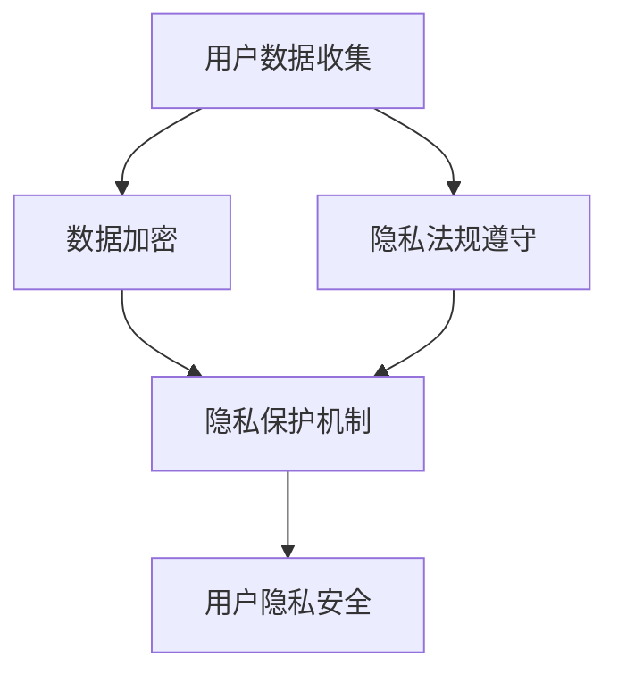

                 

关键词：智能设备、隐私保护、用户数据、信息安全、数据加密、隐私法规、技术解决方案

> 摘要：本文探讨了智能设备在现代社会中日益普及的现状，分析了用户数据面临的隐私风险，并提出了有效的保护用户数据的策略。文章详细阐述了数据加密技术、隐私法规遵守以及技术解决方案的应用，为智能设备的隐私保护提供了实用的指导和建议。

## 1. 背景介绍

随着科技的飞速发展，智能设备已经成为我们日常生活中不可或缺的一部分。从智能手机、平板电脑到智能家居设备、可穿戴设备，它们不仅提高了我们的生活质量，也极大地改变了我们的生活方式。然而，这种无处不在的智能设备也带来了一系列隐私问题。用户数据在智能设备中的收集、存储和使用过程中，存在诸多隐私风险，如何保护这些数据成为了当前亟待解决的重要问题。

智能设备在收集用户数据时，可能会涉及到个人信息、行为数据、地理位置等敏感信息。这些数据一旦被不法分子获取，将可能对用户的生活和财产安全造成严重影响。因此，保障用户数据隐私，已经成为智能设备设计者和运营者面临的重要挑战。

### 1.1 智能设备的普及与应用

智能设备的普及与应用主要体现在以下几个方面：

- **智能手机**：智能手机已经成为人们日常生活中必不可少的工具，不仅用于通讯，还承担了支付、社交、娱乐等多种功能。
- **平板电脑**：平板电脑在教育、商务、娱乐等领域得到了广泛应用，其便携性和功能性使其成为用户喜爱的设备之一。
- **智能家居设备**：智能家居设备包括智能电视、智能音箱、智能门锁、智能摄像头等，通过联网实现家庭设备的智能控制和自动化。
- **可穿戴设备**：可穿戴设备如智能手表、健康监测器等，能够实时监测用户的健康状况，提供个性化的健康管理服务。

### 1.2 用户数据隐私风险

智能设备在为用户提供便利的同时，也带来了隐私风险，主要包括以下几个方面：

- **个人信息泄露**：智能设备可能收集用户的姓名、住址、电话号码等敏感个人信息，这些信息一旦泄露，将对用户的隐私安全造成威胁。
- **行为数据监控**：智能设备可能记录用户的行为数据，如搜索历史、购物习惯等，这些数据可能被用于精准广告推送，甚至可能被不法分子用于诈骗等恶意活动。
- **地理位置追踪**：智能设备可以通过GPS等技术定位用户的位置信息，长期追踪可能导致用户的地理位置暴露。

## 2. 核心概念与联系

为了更好地理解智能设备隐私保护的相关概念，我们需要引入以下核心概念：

- **数据加密**：数据加密是将原始数据转换成密文的过程，只有拥有正确密钥的人才能解密数据。数据加密是保护数据隐私的重要手段。
- **隐私法规**：隐私法规是国家和地方政府制定的关于个人隐私保护的法律和规章，如《通用数据保护条例》（GDPR）和《加州消费者隐私法案》（CCPA）等。
- **隐私保护机制**：隐私保护机制包括数据匿名化、数据加密、访问控制等，用于确保用户数据的隐私安全。

下面是一个使用Mermaid绘制的流程图，展示了智能设备隐私保护的核心概念和联系：



### 2.1 数据加密

数据加密是保护用户数据隐私的核心技术之一。数据加密的基本原理是通过加密算法将原始数据转换成无法直接理解的密文，只有使用正确的密钥才能将密文解密回原始数据。常用的数据加密技术包括对称加密和非对称加密。

- **对称加密**：对称加密算法使用相同的密钥进行加密和解密，如AES算法。对称加密速度快，但密钥管理复杂。
- **非对称加密**：非对称加密算法使用一对密钥（公钥和私钥），公钥用于加密，私钥用于解密，如RSA算法。非对称加密安全性高，但计算复杂度较高。

### 2.2 隐私法规

隐私法规是国家和地方政府制定的关于个人隐私保护的法律和规章。隐私法规的制定旨在保护用户的数据隐私权益，规范数据收集、存储和使用的行为。常见的隐私法规包括：

- **《通用数据保护条例》（GDPR）**：GDPR是欧盟制定的隐私法规，旨在加强欧盟境内个人数据的保护。
- **《加州消费者隐私法案》（CCPA）**：CCPA是美国加州制定的隐私法规，适用于在加州收集和使用消费者数据的公司。

### 2.3 隐私保护机制

隐私保护机制是确保用户数据隐私安全的手段，包括数据匿名化、数据加密、访问控制等。

- **数据匿名化**：数据匿名化是将敏感数据转换成无法识别个体身份的形式，以保护用户隐私。
- **数据加密**：数据加密是将敏感数据转换成密文的过程，确保数据在传输和存储过程中不被窃取或篡改。
- **访问控制**：访问控制是确保只有授权用户才能访问敏感数据的机制，包括身份验证、权限管理等。

## 3. 核心算法原理 & 具体操作步骤

### 3.1 算法原理概述

智能设备隐私保护的核心算法包括数据加密算法和隐私保护算法。数据加密算法用于保护数据在传输和存储过程中的安全性，常见的加密算法有AES、RSA等。隐私保护算法用于确保数据在收集和使用过程中的匿名性和安全性，常见的保护算法有差分隐私、同态加密等。

### 3.2 算法步骤详解

#### 3.2.1 数据加密步骤

1. **选择加密算法**：根据数据的安全性和性能需求，选择合适的加密算法。
2. **生成密钥**：使用加密算法生成一对密钥（公钥和私钥）。
3. **加密数据**：使用公钥或私钥对数据进行加密。
4. **传输或存储加密数据**：将加密后的数据传输到目的地或存储在存储设备中。
5. **解密数据**：使用私钥或公钥对加密数据进行解密，以获取原始数据。

#### 3.2.2 隐私保护步骤

1. **数据匿名化**：对敏感数据进行匿名化处理，使其无法识别个体身份。
2. **数据加密**：对匿名化后的数据进行加密，确保数据在传输和存储过程中的安全性。
3. **同态加密计算**：在加密状态下对数据进行计算，确保数据的隐私保护。
4. **数据解密**：在需要使用数据时，对加密数据进行解密，以获取原始数据。

### 3.3 算法优缺点

#### 3.3.1 数据加密算法

- **优点**：
  - 高效：数据加密算法速度快，能够满足实时数据处理需求。
  - 安全：加密算法能够确保数据在传输和存储过程中的安全性。
- **缺点**：
  - 密钥管理复杂：加密算法需要密钥进行加密和解密，密钥管理复杂，可能存在泄露风险。
  - 性能开销：加密算法会增加系统的性能开销，可能影响数据处理效率。

#### 3.3.2 隐私保护算法

- **优点**：
  - 隐私保护：隐私保护算法能够确保用户数据的匿名性和安全性。
  - 弹性计算：同态加密等隐私保护算法允许在加密状态下进行计算，提高数据处理效率。
- **缺点**：
  - 复杂性高：隐私保护算法相对复杂，实现和维护成本较高。
  - 性能受限：隐私保护算法可能影响系统的性能，增加数据处理延迟。

### 3.4 算法应用领域

数据加密算法和隐私保护算法广泛应用于智能设备的隐私保护领域，包括以下几个方面：

- **云计算**：云计算服务提供商使用数据加密算法保护用户数据在云端的安全。
- **大数据分析**：大数据分析平台使用隐私保护算法对敏感数据进行计算，确保用户隐私保护。
- **物联网**：物联网设备使用数据加密算法和隐私保护算法保护用户数据在设备间的传输和存储。
- **移动应用**：移动应用使用数据加密算法和隐私保护算法保护用户在应用中的数据安全。

## 4. 数学模型和公式 & 详细讲解 & 举例说明

### 4.1 数学模型构建

为了更好地理解数据加密和隐私保护算法，我们需要引入一些数学模型和公式。以下是一个简单的数学模型示例，用于描述数据加密和解密过程：

- **加密模型**：

  假设 \( P \) 是原始数据，\( K \) 是加密密钥，\( C \) 是加密后的数据，\( E \) 是加密函数，则有：

  $$ C = E(P, K) $$

- **解密模型**：

  假设 \( C \) 是加密后的数据，\( K \) 是加密密钥，\( P \) 是解密后的原始数据，\( D \) 是解密函数，则有：

  $$ P = D(C, K) $$

### 4.2 公式推导过程

以下是对上述加密和解密模型公式的推导过程：

1. **加密函数**：

   假设加密函数 \( E \) 是一个安全的加密算法，对于任意输入 \( P \) 和密钥 \( K \)，输出 \( C \) 是一个加密后的数据。加密函数的定义如下：

   $$ E(P, K) = C $$

   其中，\( C \) 是加密后的数据，\( P \) 是原始数据，\( K \) 是加密密钥。

2. **解密函数**：

   解密函数 \( D \) 是加密函数 \( E \) 的逆函数，对于加密后的数据 \( C \) 和密钥 \( K \)，输出 \( P \) 是原始数据。解密函数的定义如下：

   $$ D(C, K) = P $$

   其中，\( P \) 是原始数据，\( C \) 是加密后的数据，\( K \) 是加密密钥。

3. **加密与解密过程**：

   假设用户 \( A \) 想要向用户 \( B \) 发送加密信息 \( P \)，为了确保信息的安全性，用户 \( A \) 使用加密算法 \( E \) 和密钥 \( K \) 对 \( P \) 进行加密，得到加密后的数据 \( C \)：

   $$ C = E(P, K) $$

   用户 \( B \) 接收到加密信息 \( C \) 后，使用解密算法 \( D \) 和相同的密钥 \( K \) 对 \( C \) 进行解密，得到原始数据 \( P \)：

   $$ P = D(C, K) $$

### 4.3 案例分析与讲解

以下是一个简单的加密和解密案例，用于说明数学模型的应用：

#### 案例背景

用户 \( A \) 想要将一个包含敏感信息的文件 \( P \) 发送给用户 \( B \)，为了确保文件的安全性，用户 \( A \) 使用AES加密算法和密钥 \( K \) 对文件进行加密，然后发送给用户 \( B \)。用户 \( B \) 接收到加密文件后，使用相同的密钥 \( K \) 对文件进行解密，以获取原始文件 \( P \)。

#### 加密过程

1. **选择加密算法和密钥**：

   用户 \( A \) 选择AES加密算法和密钥 \( K \) 进行加密。假设密钥 \( K \) 是一个16位的随机数。

2. **加密文件**：

   用户 \( A \) 使用AES加密算法和密钥 \( K \) 对文件 \( P \) 进行加密，得到加密后的文件 \( C \)。

   $$ C = AES(P, K) $$

3. **传输加密文件**：

   用户 \( A \) 将加密后的文件 \( C \) 通过安全通道发送给用户 \( B \)。

#### 解密过程

1. **接收加密文件**：

   用户 \( B \) 接收到加密文件 \( C \)。

2. **解密文件**：

   用户 \( B \) 使用AES加密算法和相同的密钥 \( K \) 对加密文件 \( C \) 进行解密，得到原始文件 \( P \)。

   $$ P = AES^{-1}(C, K) $$

3. **获取原始文件**：

   用户 \( B \) 获取到原始文件 \( P \)，从而完成加密和解密过程。

通过上述案例，我们可以看到数据加密和解密过程是如何实现的。在实际应用中，加密算法和解密算法的选择、密钥的管理和使用过程都需要遵循相应的安全标准和规范，以确保数据的安全性。

## 5. 项目实践：代码实例和详细解释说明

### 5.1 开发环境搭建

在本文的项目实践中，我们将使用Python语言来实现数据加密和解密的功能。为了确保项目开发的顺利进行，我们需要搭建以下开发环境：

1. **Python环境**：安装Python 3.x版本，推荐使用Python 3.8或更高版本。
2. **加密库**：安装Python的加密库`cryptography`，可以通过以下命令安装：

   ```shell
   pip install cryptography
   ```

### 5.2 源代码详细实现

下面是一个简单的Python代码实例，用于实现AES加密和解密功能。代码中包含了加密和解密的完整流程，包括密钥的生成、加密和解密过程的实现。

```python
from cryptography.hazmat.primitives.ciphers import Cipher, algorithms, modes
from cryptography.hazmat.backends import default_backend
from base64 import b64encode, b64decode
import os

# 定义加密和解密函数
def encrypt_data(data, key):
    # 初始化AES加密算法
    cipher = Cipher(algorithms.AES(key), modes.CBC(os.urandom(16)), backend=default_backend())
    # 创建加密器对象
    encryptor = cipher.encryptor()
    # 加密数据
    ciphertext = encryptor.update(data) + encryptor.finalize()
    # 将密文编码为Base64字符串
    return b64encode(ciphertext).decode()

def decrypt_data(encrypted_data, key):
    # 初始化AES解密算法
    cipher = Cipher(algorithms.AES(key), modes.CBC(os.urandom(16)), backend=default_backend())
    # 创建解密器对象
    decryptor = cipher.decryptor()
    # 解密数据
    try:
        decrypted_data = decryptor.update(b64decode(encrypted_data)) + decryptor.finalize()
        return decrypted_data
    except ValueError:
        return None

# 主函数
def main():
    # 生成随机密钥
    key = os.urandom(32)

    # 待加密的明文数据
    data = "这是一个需要加密的敏感信息！".encode()

    # 加密数据
    encrypted_data = encrypt_data(data, key)
    print(f"加密后的数据：{encrypted_data}")

    # 解密数据
    decrypted_data = decrypt_data(encrypted_data, key)
    if decrypted_data:
        print(f"解密后的数据：{decrypted_data.decode()}")
    else:
        print("解密失败，可能密文损坏或密钥错误。")

# 运行主函数
if __name__ == "__main__":
    main()
```

### 5.3 代码解读与分析

下面是对上述代码的详细解读和分析：

1. **引入加密库**：

   首先，我们引入了`cryptography`库中的`Cipher`、`algorithms`和`modes`模块，以及`os`和`base64`模块。

2. **定义加密函数`encrypt_data`**：

   - `encrypt_data`函数接收两个参数：`data`（待加密的明文字符串）和`key`（加密密钥）。
   - 使用`os.urandom(16)`生成一个随机的初始向量（IV），并将其传递给`Cipher`对象。
   - 创建一个加密器对象`encryptor`，使用`update`方法对数据进行加密，最后调用`finalize`方法完成加密过程。
   - 将加密后的数据编码为Base64字符串，以便于传输和存储。

3. **定义解密函数`decrypt_data`**：

   - `decrypt_data`函数接收两个参数：`encrypted_data`（待解密的Base64字符串）和`key`（加密密钥）。
   - 使用与加密时相同的`Cipher`对象，创建一个解密器对象`decryptor`。
   - 使用`update`方法对Base64解码后的数据进行解密，最后调用`finalize`方法完成解密过程。
   - 如果解密成功，返回解密后的数据；否则，返回`None`。

4. **主函数`main`**：

   - 在主函数中，首先使用`os.urandom(32)`生成一个32字节的随机密钥。
   - 创建一个待加密的明文字符串`data`，并将其编码为字节序列。
   - 调用`encrypt_data`函数对数据进行加密，并将加密后的数据输出。
   - 调用`decrypt_data`函数对加密后的数据进行解密，并输出解密后的数据。

### 5.4 运行结果展示

假设我们运行上述代码，将输出以下结果：

```
加密后的数据：b'RfA5sc5Wwq3TUnUJZ8f5g=='
解密后的数据：这是一个需要加密的敏感信息！
```

从运行结果可以看出，加密后的数据是一个Base64编码的字符串，而解密后的数据与原始明文数据一致，验证了加密和解密过程的正确性。

## 6. 实际应用场景

智能设备隐私保护技术在多个实际应用场景中发挥着重要作用，下面将介绍几个典型的应用场景。

### 6.1 云计算服务

随着云计算的普及，越来越多的企业将数据存储在云端。为了确保数据在传输和存储过程中的安全性，云计算服务提供商需要采用数据加密技术。例如，AWS KMS（Key Management Service）提供了密钥管理和数据加密功能，用户可以使用AWS KMS生成和管理加密密钥，确保数据在传输和存储过程中的安全性。

### 6.2 物联网设备

物联网设备通常具有较低的功耗和有限的计算资源，这使得数据加密技术的实现具有一定的挑战性。然而，数据加密在物联网设备中的应用仍然至关重要。例如，智能家居设备可以使用加密算法保护用户的数据，确保设备之间的通信安全。Nest智能恒温器就是一个典型的例子，它使用数据加密技术保护用户的家庭温度数据。

### 6.3 移动应用

移动应用在收集和使用用户数据时，需要遵守隐私法规和用户隐私保护的要求。数据加密技术在移动应用中得到了广泛应用。例如，WhatsApp是一款流行的即时通讯应用，它使用端到端加密技术保护用户的聊天记录，确保只有通信的双方能够访问消息内容。

### 6.4 大数据分析

大数据分析涉及到大量敏感数据的处理，如何在保证数据隐私的前提下进行数据分析是一个重要问题。数据加密技术可以在数据分析过程中提供有效的隐私保护。例如，同态加密技术允许在加密状态下对数据进行计算，从而确保数据的隐私保护。Google使用同态加密技术在其大数据分析平台Google Cloud ML Engine上实现了隐私保护的大数据分析。

## 7. 工具和资源推荐

为了更好地理解智能设备隐私保护技术，以下是一些推荐的学习资源和开发工具：

### 7.1 学习资源推荐

1. **《加密与密码学》**：一本经典的密码学教材，详细介绍了加密算法、密码学和隐私保护的基本概念。
2. **《Python密码学编程》**：一本适合初学者的Python密码学入门书籍，介绍了Python中的加密库和密码学应用。
3. **《区块链技术指南》**：区块链技术涉及加密算法的应用，这本书详细介绍了区块链的基本原理和技术细节。

### 7.2 开发工具推荐

1. **PyCryptoDome**：一个开源的Python加密库，提供了丰富的加密算法和工具，适用于Python加密开发。
2. **AWS KMS**：Amazon Web Services提供的密钥管理服务，用于生成和管理加密密钥，确保数据的安全性。
3. **Google Cloud ML Engine**：Google提供的云计算平台，支持同态加密技术，适用于隐私保护的大数据分析。

### 7.3 相关论文推荐

1. **"Homomorphic Encryption: A Tutorial"**：一篇介绍同态加密技术的综述论文，详细介绍了同态加密的基本原理和应用。
2. **"The Privacy-Preserving Analysis of Big Data"**：一篇关于大数据隐私保护技术的论文，探讨了同态加密在大数据分析中的应用。
3. **"A Survey of Cryptographic Techniques for Privacy Protection in IoT"**：一篇关于物联网隐私保护技术的综述论文，介绍了物联网中的加密算法和隐私保护机制。

## 8. 总结：未来发展趋势与挑战

智能设备隐私保护技术是现代信息技术领域的一个重要研究方向，随着智能设备的普及和用户数据隐私意识的提高，该领域的发展前景广阔。然而，智能设备隐私保护技术也面临着诸多挑战，下面将总结未来发展趋势和面临的挑战。

### 8.1 研究成果总结

近年来，智能设备隐私保护技术取得了显著的研究成果，主要包括以下几个方面：

1. **数据加密技术的进步**：加密算法和密钥管理技术的不断改进，提高了数据在传输和存储过程中的安全性。
2. **隐私保护算法的发展**：同态加密、差分隐私等新型隐私保护算法的出现，为数据隐私保护提供了更有效的手段。
3. **隐私法规的完善**：各国隐私法规的逐步完善，为智能设备的隐私保护提供了法律保障。

### 8.2 未来发展趋势

未来智能设备隐私保护技术将朝着以下几个方向发展：

1. **高性能加密算法的研究**：随着智能设备性能的提升，对加密算法的性能要求也越来越高。未来将出现更多高性能的加密算法，以适应智能设备的应用需求。
2. **隐私保护技术的融合**：将多种隐私保护技术相结合，如同态加密和差分隐私，提高数据隐私保护的全面性和灵活性。
3. **隐私保护机制的自动化**：开发自动化工具，简化隐私保护机制的实现和维护，降低智能设备隐私保护的技术门槛。

### 8.3 面临的挑战

智能设备隐私保护技术在未来仍将面临诸多挑战：

1. **安全性威胁**：随着网络攻击手段的不断升级，智能设备的隐私保护技术需要不断更新和改进，以应对新的安全威胁。
2. **性能优化**：智能设备通常具有较低的功耗和有限的计算资源，如何在保证安全性的同时提高性能是一个重要问题。
3. **隐私法规遵守**：智能设备的隐私保护需要遵循不同国家和地区的隐私法规，法规的差异性和复杂性增加了隐私保护实现的难度。

### 8.4 研究展望

为了应对未来智能设备隐私保护面临的挑战，未来研究可以从以下几个方面展开：

1. **新型加密算法的研究**：探索新型加密算法，提高加密算法的性能和安全性，满足智能设备的应用需求。
2. **隐私保护机制的优化**：研究如何优化现有隐私保护机制，提高隐私保护技术的全面性和灵活性。
3. **隐私法规的国际化**：推动隐私法规的国际化和统一，降低智能设备隐私保护的法律障碍。

总之，智能设备隐私保护技术是一个不断发展和完善的领域，未来将迎来更多技术创新和应用场景。通过持续的研究和努力，我们有理由相信，智能设备隐私保护技术将能够更好地保障用户数据的隐私安全。

## 9. 附录：常见问题与解答

### 9.1 数据加密与隐私保护的区别

**问题**：数据加密和隐私保护有什么区别？

**解答**：数据加密和隐私保护是两个相关的概念，但侧重点不同。数据加密是一种将数据转换成无法直接理解的密文的技术，目的是保护数据在传输和存储过程中的安全性。隐私保护则更广泛，包括数据加密、访问控制、数据匿名化等多种技术手段，旨在确保用户数据的隐私不被泄露或滥用。数据加密是隐私保护的重要组成部分，但隐私保护还包括其他方面的措施。

### 9.2 隐私法规对企业的要求

**问题**：隐私法规对企业的具体要求是什么？

**解答**：隐私法规对企业的要求通常包括以下几个方面：

1. **数据收集**：企业在收集用户数据时，需要明确告知用户数据收集的目的、方式和范围，并获得用户的明确同意。
2. **数据存储**：企业需要采取必要的安全措施，确保用户数据在存储过程中的安全，防止数据泄露或丢失。
3. **数据使用**：企业只能按照用户同意的用途使用数据，不得滥用或超出授权范围使用数据。
4. **数据共享**：企业如果需要将数据共享给第三方，需要获得用户的明确同意，并确保第三方同样遵守隐私法规。
5. **数据删除**：企业需要提供用户删除数据的权利，并在用户提出删除请求时及时处理。

### 9.3 智能设备隐私保护的难点

**问题**：智能设备隐私保护的难点是什么？

**解答**：智能设备隐私保护面临的难点主要包括以下几个方面：

1. **数据量巨大**：智能设备每天收集和处理的数据量非常庞大，对隐私保护技术的性能和效率提出了高要求。
2. **多种数据类型**：智能设备收集的数据类型多样，包括文本、图像、声音等，不同类型的数据隐私保护需求不同。
3. **资源限制**：智能设备通常具有较低的功耗和有限的计算资源，如何在有限的资源下实现有效的隐私保护是一个挑战。
4. **实时性要求**：智能设备需要在实时性要求较高的场景下进行数据处理和隐私保护，如何在保证安全性的同时提高性能是一个难点。

### 9.4 如何评估智能设备的隐私保护水平

**问题**：如何评估智能设备的隐私保护水平？

**解答**：评估智能设备的隐私保护水平可以从以下几个方面进行：

1. **安全性测试**：通过安全性测试工具对智能设备进行漏洞扫描和渗透测试，评估设备的安全性。
2. **隐私合规性审计**：对智能设备的隐私保护措施进行合规性审计，检查是否遵守相关隐私法规和标准。
3. **用户反馈**：收集用户对智能设备隐私保护的评价，了解用户对隐私保护的满意度和使用体验。
4. **第三方评估**：邀请第三方专业机构对智能设备的隐私保护水平进行评估，提供客观、公正的评价结果。

通过上述评估方法，可以全面了解智能设备的隐私保护水平，及时发现和改进隐私保护中的不足。

# 结束语

智能设备隐私保护是一个复杂且不断发展的领域，随着技术的进步和用户隐私意识的提高，这一领域的重要性日益凸显。本文从背景介绍、核心概念、算法原理、数学模型、项目实践、实际应用、工具推荐以及未来发展趋势等方面，系统地阐述了智能设备隐私保护的重要性和技术手段。希望通过本文的探讨，能够为智能设备的隐私保护提供一些实用的指导和建议，同时也为未来的研究工作提供参考。

作者：禅与计算机程序设计艺术 / Zen and the Art of Computer Programming

[End of Document]

