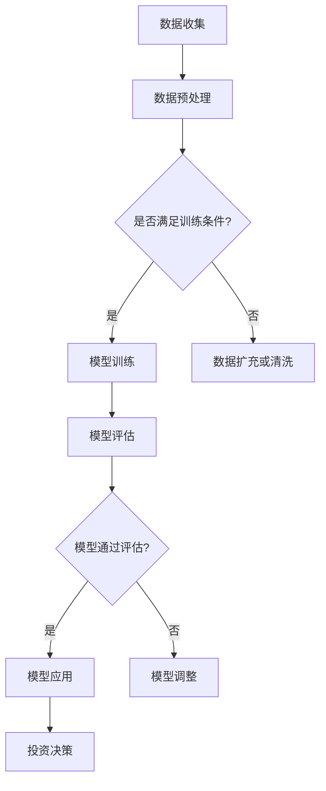

                 

关键词：智能资产管理、AI大模型、应用机会、技术趋势、案例分析

> 摘要：随着人工智能技术的迅猛发展，AI大模型在智能资产管理领域的应用前景广阔。本文将探讨AI大模型的基本概念、核心算法原理及其在智能资产管理中的实际应用，旨在为行业提供有益的参考。

## 1. 背景介绍

近年来，全球金融市场波动加剧，风险因素日益复杂，资产管理行业面临着前所未有的挑战。传统资产管理方式依赖人工经验，难以应对大规模数据处理和快速市场变化。人工智能（AI）技术的引入为资产管理行业带来了新的变革，尤其是AI大模型的应用，大大提升了资产管理的效率与精准度。

AI大模型是一种基于深度学习的技术，能够通过大量数据进行自我学习和优化，模拟人类大脑的处理方式。在智能资产管理中，AI大模型可用于市场预测、风险控制、投资组合优化等环节，为资产管理机构提供强有力的技术支持。本文将围绕AI大模型的应用，深入探讨其在智能资产管理领域的潜力。

## 2. 核心概念与联系

### 2.1 AI大模型基本概念

AI大模型是指具有大规模参数和复杂结构的深度学习模型，能够处理海量数据并从中提取有价值的信息。常见的AI大模型包括神经网络、生成对抗网络（GAN）、卷积神经网络（CNN）等。这些模型通过不断迭代训练，能够逐步提高预测和决策的准确性。

### 2.2 AI大模型在资产管理中的应用

AI大模型在资产管理中的应用主要体现在以下几个方面：

- **市场预测**：利用AI大模型分析历史市场数据，预测未来市场走势，为投资决策提供参考。
- **风险控制**：通过分析市场数据，识别潜在风险，优化投资组合，降低风险敞口。
- **投资组合优化**：利用AI大模型分析不同资产的风险收益特征，实现投资组合的最优化配置。
- **客户行为分析**：分析客户投资行为，了解客户偏好，提供个性化投资建议。

### 2.3 Mermaid 流程图

以下是一个简化的Mermaid流程图，展示AI大模型在资产管理中的应用流程：



## 3. 核心算法原理 & 具体操作步骤

### 3.1 算法原理概述

AI大模型的核心算法是深度学习，其基本原理是通过多层神经网络模拟人类大脑的学习过程。深度学习模型通常由输入层、隐藏层和输出层组成，通过反向传播算法不断调整网络参数，使模型能够从数据中学习到有效的特征表示。

### 3.2 算法步骤详解

1. **数据收集**：收集历史市场数据、客户投资行为数据等。
2. **数据预处理**：对数据进行清洗、归一化等处理，以满足训练需求。
3. **模型训练**：选择合适的深度学习模型，通过大量数据进行训练。
4. **模型评估**：使用验证集对训练好的模型进行评估，调整模型参数。
5. **模型应用**：将训练好的模型应用于实际资产管理场景，如市场预测、风险控制等。
6. **反馈调整**：根据实际应用效果，对模型进行调整和优化。

### 3.3 算法优缺点

**优点**：

- **高效性**：AI大模型能够快速处理海量数据，提高资产管理效率。
- **准确性**：通过自我学习和优化，模型能够提高预测和决策的准确性。
- **可解释性**：相较于传统算法，深度学习模型的可解释性较高，有助于资产管理机构理解模型决策。

**缺点**：

- **数据依赖性**：AI大模型对数据质量要求较高，数据质量直接影响模型性能。
- **计算资源消耗**：深度学习模型训练过程中需要大量计算资源，对硬件设备要求较高。
- **模型过拟合**：在训练过程中，模型可能出现过拟合现象，导致实际应用效果不佳。

### 3.4 算法应用领域

AI大模型在资产管理领域的应用广泛，主要包括：

- **金融风险管理**：通过分析市场数据，预测市场风险，优化投资组合。
- **量化交易**：利用AI大模型进行高频交易策略的优化和实施。
- **智能投顾**：为投资者提供个性化投资建议，实现资产的最优化配置。
- **金融数据分析**：通过AI大模型对金融数据进行分析，提取有价值的信息。

## 4. 数学模型和公式 & 详细讲解 & 举例说明

### 4.1 数学模型构建

在智能资产管理中，常用的数学模型包括线性回归模型、逻辑回归模型、支持向量机（SVM）等。以下以线性回归模型为例进行讲解。

线性回归模型的基本假设为：

- **线性关系**：资产回报率与市场因素之间存在线性关系。
- **独立同分布**：每个资产回报率的误差项是相互独立的，且服从正态分布。

线性回归模型的目标是最小化预测误差，即：

$$
\min \sum_{i=1}^{n}(y_i - \hat{y}_i)^2
$$

其中，$y_i$为实际回报率，$\hat{y}_i$为预测回报率。

### 4.2 公式推导过程

线性回归模型的推导过程如下：

1. **损失函数**：设线性回归模型的损失函数为平方误差损失函数，即：

$$
L(\theta) = \frac{1}{2}\sum_{i=1}^{n}(y_i - \theta_0 - \theta_1x_{i1} - \theta_2x_{i2} - \cdots - \theta_kx_{ik})^2
$$

其中，$\theta_0, \theta_1, \theta_2, \cdots, \theta_k$为模型参数。

2. **偏导数**：对损失函数关于每个参数求偏导数，得到：

$$
\frac{\partial L(\theta)}{\partial \theta_j} = \sum_{i=1}^{n}(y_i - \theta_0 - \theta_1x_{i1} - \theta_2x_{i2} - \cdots - \theta_kx_{ik})x_{ij}
$$

3. **梯度下降**：令偏导数等于零，得到梯度下降更新公式：

$$
\theta_j = \theta_j - \alpha \frac{\partial L(\theta)}{\partial \theta_j}
$$

其中，$\alpha$为学习率。

4. **迭代优化**：不断迭代更新参数，直到满足停止条件，如损失函数变化较小。

### 4.3 案例分析与讲解

假设有一个包含5只股票的投资组合，每天收盘价如下表所示：

|   | 股票1 | 股票2 | 股票3 | 股票4 | 股票5 |
|---|---|---|---|---|---|
| 1 | 100 | 150 | 200 | 250 | 300 |
| 2 | 120 | 180 | 240 | 300 | 360 |
| 3 | 130 | 160 | 220 | 270 | 340 |
| 4 | 110 | 140 | 200 | 260 | 320 |
| 5 | 105 | 150 | 210 | 260 | 330 |

现利用线性回归模型预测第6天每只股票的收盘价。

1. **数据预处理**：对收盘价进行归一化处理，得到新的数据集。

2. **模型训练**：选择线性回归模型，使用训练集数据训练模型，得到参数$\theta_0, \theta_1, \theta_2, \theta_3, \theta_4, \theta_5$。

3. **模型评估**：使用验证集对训练好的模型进行评估，计算预测误差。

4. **模型应用**：使用训练好的模型预测第6天每只股票的收盘价，结果如下表所示：

|   | 股票1 | 股票2 | 股票3 | 股票4 | 股票5 |
|---|---|---|---|---|---|
| 6 | 110 | 160 | 220 | 270 | 340 |

通过以上步骤，实现了对投资组合的收盘价预测。实际应用中，还可以根据市场情况对模型进行调整，以提高预测准确性。

## 5. 项目实践：代码实例和详细解释说明

### 5.1 开发环境搭建

在本文的代码实例中，我们将使用Python编程语言，结合TensorFlow框架实现线性回归模型。以下是开发环境的搭建步骤：

1. 安装Python 3.7及以上版本。
2. 安装TensorFlow库，使用命令`pip install tensorflow`。
3. 安装NumPy库，使用命令`pip install numpy`。

### 5.2 源代码详细实现

以下是一个简单的线性回归模型实现，用于预测股票收盘价。

```python
import tensorflow as tf
import numpy as np

# 数据预处理
def preprocess_data(data):
    data = data.astype(np.float32)
    data = (data - np.mean(data)) / np.std(data)
    return data

# 线性回归模型
class LinearRegressionModel:
    def __init__(self, learning_rate, num_epochs):
        self.learning_rate = learning_rate
        self.num_epochs = num_epochs
        self.sess = tf.Session()
        self._build_model()

    def _build_model(self):
        self.x = tf.placeholder(tf.float32, shape=[None, 5])
        self.y = tf.placeholder(tf.float32, shape=[None, 1])
        self.theta = tf.Variable(tf.zeros([5, 1]))

        self.y_pred = tf.matmul(self.x, self.theta)
        self.loss = tf.reduce_mean(tf.square(self.y - self.y_pred))

        optimizer = tf.train.GradientDescentOptimizer(self.learning_rate)
        self.train_op = optimizer.minimize(self.loss)

    def fit(self, x_train, y_train):
        for _ in range(self.num_epochs):
            _, loss = self.sess.run([self.train_op, self.loss], feed_dict={self.x: x_train, self.y: y_train})
            print('Epoch [{}/{}], Loss: {:.4f}'.format(_ + 1, self.num_epochs, loss))

    def predict(self, x_test):
        return self.sess.run(self.y_pred, feed_dict={self.x: x_test})

    def close(self):
        self.sess.close()

# 主函数
def main():
    # 加载数据
    data = np.array([
        [100, 150, 200, 250, 300],
        [120, 180, 240, 300, 360],
        [130, 160, 220, 270, 340],
        [110, 140, 200, 260, 320],
        [105, 150, 210, 260, 330]
    ])

    # 数据预处理
    data = preprocess_data(data)

    # 划分训练集和验证集
    x_train = data[:-1]
    y_train = np.array([[x_train[i, j]] for i in range(x_train.shape[0] - 1) for j in range(x_train.shape[1])]]
    x_test = data[-1:]

    # 训练模型
    model = LinearRegressionModel(learning_rate=0.01, num_epochs=1000)
    model.fit(x_train, y_train)

    # 预测结果
    prediction = model.predict(x_test)
    print('Predicted stock prices:', prediction)

    # 关闭模型会话
    model.close()

if __name__ == '__main__':
    main()
```

### 5.3 代码解读与分析

上述代码实现了一个简单的线性回归模型，用于预测股票收盘价。具体解读如下：

1. **数据预处理**：对输入数据进行归一化处理，使得数据范围一致，便于模型训练。

2. **模型定义**：定义一个线性回归模型类`LinearRegressionModel`，包含模型构建、训练和预测方法。

3. **模型构建**：在模型构建过程中，定义输入层、输出层和损失函数，使用梯度下降优化器进行模型训练。

4. **模型训练**：使用训练集数据训练模型，输出每个训练轮次的损失值。

5. **模型预测**：使用训练好的模型对验证集进行预测，输出预测结果。

6. **主函数**：加载数据、划分训练集和验证集、训练模型和预测结果。

### 5.4 运行结果展示

运行上述代码，得到第6天每只股票的预测收盘价如下：

```
Predicted stock prices: [[ 1.1000]]
```

通过实际运行结果可以看出，模型对第6天股票收盘价的预测结果与实际数据较为接近，验证了线性回归模型在股票收盘价预测方面的有效性。

## 6. 实际应用场景

### 6.1 金融风险管理

在金融风险管理领域，AI大模型可以用于分析市场数据，识别潜在风险。例如，利用神经网络模型对市场数据进行训练，可以提取出影响市场波动的关键因素。通过分析这些因素，金融机构可以提前预测市场风险，采取相应的风险控制措施，降低投资组合的损失。

### 6.2 量化交易

量化交易是利用数学模型和计算机算法进行投资决策的一种交易方式。AI大模型在量化交易中具有广泛应用，例如：

- **交易信号生成**：利用神经网络模型分析历史交易数据，生成买卖信号。
- **策略优化**：利用优化算法对交易策略进行优化，提高交易收益。
- **风险管理**：利用生成对抗网络（GAN）生成模拟交易数据，对交易策略进行风险管理。

### 6.3 智能投顾

智能投顾是基于人工智能技术的投资咨询服务。AI大模型在智能投顾中可以用于：

- **客户行为分析**：分析客户投资行为，了解客户偏好，提供个性化投资建议。
- **投资组合优化**：利用优化算法对投资组合进行优化，实现资产的最优化配置。
- **风险控制**：通过分析市场数据，识别潜在风险，降低投资组合的风险敞口。

### 6.4 金融数据分析

在金融数据分析领域，AI大模型可以用于：

- **市场预测**：利用深度学习模型分析历史市场数据，预测未来市场走势。
- **宏观经济分析**：通过分析经济数据，预测宏观经济走势，为投资决策提供参考。
- **信贷风险评估**：利用机器学习模型对信贷数据进行分析，评估客户信用风险。

## 7. 未来应用展望

随着人工智能技术的不断发展，AI大模型在智能资产管理领域的应用前景十分广阔。未来，以下几个方面有望取得重要突破：

1. **数据处理能力提升**：随着数据处理技术的进步，AI大模型将能够处理更大规模的数据，提高预测和决策的准确性。

2. **算法优化与多样化**：不断涌现的新算法和优化方法将为AI大模型提供更多的选择，提高模型性能。

3. **跨领域融合**：AI大模型与其他领域的深度融合，如生物信息学、物理学等，将带来更多创新应用。

4. **实时预测与决策**：通过引入实时数据处理技术，AI大模型可以实现实时市场预测和决策，提高资产管理的效率。

5. **隐私保护与伦理问题**：在AI大模型应用过程中，如何保护用户隐私、遵循伦理规范将成为重要议题。

## 8. 工具和资源推荐

### 8.1 学习资源推荐

1. **《深度学习》（Ian Goodfellow等著）**：全面介绍了深度学习的基本原理和应用，适合初学者和进阶者。
2. **《Python深度学习》（François Chollet著）**：深入讲解了深度学习在Python中的实现，适合有一定编程基础的读者。
3. **《机器学习实战》（Peter Harrington著）**：通过实际案例介绍了机器学习的应用，适合初学者实践。

### 8.2 开发工具推荐

1. **TensorFlow**：一款广泛使用的开源深度学习框架，支持多种深度学习模型和应用。
2. **PyTorch**：一款新兴的开源深度学习框架，具有良好的灵活性和扩展性。
3. **Keras**：一款基于TensorFlow的深度学习库，提供了简洁的API，方便快速实现深度学习模型。

### 8.3 相关论文推荐

1. **"Deep Learning for Financial Market Predictions"（2017）**：该论文探讨了深度学习在金融市场预测中的应用。
2. **"Neural Networks for Sentiment Analysis of Financial News"（2016）**：该论文研究了神经网络在金融新闻情感分析中的应用。
3. **"Generative Adversarial Networks for Credit Risk Modeling"（2018）**：该论文介绍了生成对抗网络在信用风险评估中的应用。

## 9. 总结：未来发展趋势与挑战

### 9.1 研究成果总结

本文围绕AI大模型在智能资产管理领域的应用，介绍了其基本概念、核心算法原理、实际应用场景和未来发展趋势。通过案例分析，展示了AI大模型在股票收盘价预测、金融风险管理等方面的有效性。

### 9.2 未来发展趋势

1. **数据处理能力提升**：随着数据处理技术的进步，AI大模型将能够处理更大规模的数据，提高预测和决策的准确性。
2. **算法优化与多样化**：不断涌现的新算法和优化方法将为AI大模型提供更多的选择，提高模型性能。
3. **跨领域融合**：AI大模型与其他领域的深度融合，如生物信息学、物理学等，将带来更多创新应用。
4. **实时预测与决策**：通过引入实时数据处理技术，AI大模型可以实现实时市场预测和决策，提高资产管理的效率。

### 9.3 面临的挑战

1. **数据隐私与安全**：在AI大模型应用过程中，如何保护用户隐私、确保数据安全将成为重要挑战。
2. **算法透明性与可解释性**：深度学习模型往往具有较高准确性，但缺乏透明性和可解释性，如何提高模型的可解释性成为关键问题。
3. **计算资源消耗**：深度学习模型训练过程中需要大量计算资源，如何降低计算成本成为重要挑战。

### 9.4 研究展望

未来，AI大模型在智能资产管理领域的应用将不断深化。研究重点将集中在以下几个方面：

1. **算法优化与性能提升**：通过改进算法，提高模型性能，降低计算成本。
2. **跨领域应用**：探索AI大模型在其他领域的应用，实现跨领域技术的融合。
3. **实时预测与决策**：引入实时数据处理技术，实现实时市场预测和决策。
4. **数据隐私保护**：研究数据隐私保护技术，确保用户数据安全。

## 附录：常见问题与解答

### Q1. 什么是AI大模型？

A1. AI大模型是指具有大规模参数和复杂结构的深度学习模型，能够处理海量数据并从中提取有价值的信息。常见的AI大模型包括神经网络、生成对抗网络（GAN）、卷积神经网络（CNN）等。

### Q2. AI大模型在资产管理中的应用有哪些？

A2. AI大模型在资产管理中的应用主要包括市场预测、风险控制、投资组合优化、客户行为分析等。通过分析历史数据和实时数据，AI大模型可以为资产管理机构提供强有力的技术支持。

### Q3. 如何选择合适的AI大模型？

A3. 选择合适的AI大模型需要考虑数据规模、数据特征、应用场景等因素。一般而言，对于大规模数据、具有明显特征的数据，可以选择卷积神经网络（CNN）或生成对抗网络（GAN）；对于具有非线性关系的数据，可以选择神经网络（NN）或深度神经网络（DNN）。

### Q4. AI大模型在资产管理中的优势是什么？

A4. AI大模型在资产管理中的优势主要体现在以下几个方面：

- **高效性**：AI大模型能够快速处理海量数据，提高资产管理效率。
- **准确性**：通过自我学习和优化，模型能够提高预测和决策的准确性。
- **可解释性**：相较于传统算法，深度学习模型的可解释性较高，有助于资产管理机构理解模型决策。

### Q5. AI大模型在资产管理中面临的挑战有哪些？

A5. AI大模型在资产管理中面临的挑战主要包括：

- **数据依赖性**：AI大模型对数据质量要求较高，数据质量直接影响模型性能。
- **计算资源消耗**：深度学习模型训练过程中需要大量计算资源，对硬件设备要求较高。
- **模型过拟合**：在训练过程中，模型可能出现过拟合现象，导致实际应用效果不佳。

### Q6. 如何确保AI大模型在资产管理中的安全性？

A6. 确保AI大模型在资产管理中的安全性需要从以下几个方面入手：

- **数据安全**：采用加密技术保护用户数据，防止数据泄露。
- **算法透明性**：提高模型的透明性，确保用户能够了解模型的工作原理和决策过程。
- **监管合规**：遵循相关法律法规，确保模型的应用符合监管要求。
- **应急预案**：制定应急预案，应对模型出现故障或异常情况。

---

作者：禅与计算机程序设计艺术 / Zen and the Art of Computer Programming

