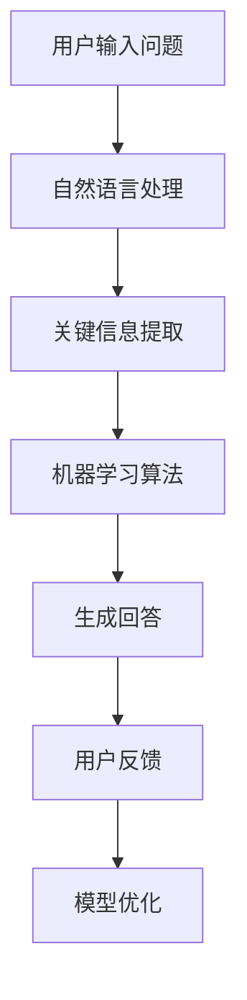

                 

 在现代电商领域，用户体验至关重要。随着消费者需求的不断变化，如何提高购物流程的便捷性、准确性和个性化，成为电商平台需要解决的关键问题。智能问答系统作为人工智能领域的一项重要应用，通过自然语言处理技术和大数据分析，为消费者提供高效的问答服务，极大地提升了电商平台的用户体验。本文将探讨智能问答系统的原理、实现方法及其在电商购物体验中的应用，展望其未来的发展趋势和挑战。

## 关键词

- 智能问答系统
- 自然语言处理
- 电商购物体验
- 人工智能
- 用户交互

## 摘要

本文首先介绍了智能问答系统的基本概念和其在电商购物体验中的重要性。随后，详细分析了智能问答系统的核心算法原理，包括自然语言处理技术和机器学习算法。接着，通过一个实际项目案例，展示了智能问答系统的实现过程和效果。文章还探讨了智能问答系统在不同电商应用场景中的实际效果，并对未来的发展趋势和面临的挑战进行了展望。

## 1. 背景介绍

### 1.1 电商购物体验的重要性

随着互联网的普及和电子商务的快速发展，电商平台已经成为消费者购物的主要渠道之一。如何提升购物体验，提高用户满意度和忠诚度，成为电商平台需要重点关注的问题。电商购物体验主要包括商品展示、购买流程、客户服务等多个方面。一个便捷、快速、高效的购物体验能够显著提高用户的满意度和平台的竞争力。

### 1.2 智能问答系统的兴起

智能问答系统作为人工智能领域的一项重要应用，近年来得到了广泛关注。它能够通过自然语言处理技术和大数据分析，自动理解用户的问题，并提供准确的答案。与传统的人工客服相比，智能问答系统具有响应速度快、处理能力强、成本较低等优点。特别是在电商购物体验中，智能问答系统可以提供实时的商品信息查询、购买建议、售后服务等，为用户带来更加便捷、个性化的购物体验。

## 2. 核心概念与联系

### 2.1 自然语言处理技术

自然语言处理（Natural Language Processing，NLP）是人工智能的一个重要分支，旨在使计算机能够理解、处理和生成人类语言。在智能问答系统中，NLP 技术主要用于解析用户输入的问题，提取关键信息，并将其转化为计算机可以理解的形式。

### 2.2 机器学习算法

机器学习算法是智能问答系统的核心组成部分，用于训练模型，使其能够自动识别和理解用户的问题。常见的机器学习算法包括决策树、支持向量机、神经网络等。在电商购物体验中，机器学习算法可以用于推荐系统、智能客服、语音识别等多个方面。

### 2.3 大数据分析

大数据分析技术可以帮助智能问答系统从海量数据中提取有价值的信息，用于优化模型、提高回答的准确性。在电商购物体验中，大数据分析可以用于用户行为分析、商品推荐、需求预测等。

## Mermaid 流程图



## 3. 核心算法原理 & 具体操作步骤

### 3.1 算法原理概述

智能问答系统的核心算法主要包括自然语言处理、机器学习算法和大数据分析。自然语言处理技术用于解析用户输入的问题，提取关键信息；机器学习算法用于训练模型，使其能够自动识别和理解用户的问题；大数据分析技术用于优化模型，提高回答的准确性。

### 3.2 算法步骤详解

#### 3.2.1 自然语言处理

1. **分词**：将用户输入的问题划分为词组，便于后续处理。
2. **词性标注**：为每个词分配词性，如名词、动词、形容词等，以便更准确地理解语义。
3. **句法分析**：分析句子的结构，确定主谓宾关系，为语义分析提供基础。

#### 3.2.2 机器学习算法

1. **特征提取**：从用户输入的问题中提取特征，如关键词、词频、词向量等。
2. **模型训练**：使用训练数据集，通过机器学习算法（如决策树、支持向量机、神经网络等）训练模型。
3. **模型评估**：使用测试数据集评估模型性能，调整参数，优化模型。

#### 3.2.3 大数据分析

1. **数据收集**：收集用户的历史行为数据、商品信息等。
2. **数据预处理**：清洗、去重、归一化等，为后续分析提供高质量的数据。
3. **数据分析**：使用数据分析方法（如聚类、分类、回归等）提取有价值的信息。

### 3.3 算法优缺点

#### 优点：

1. **高效性**：智能问答系统能够快速响应用户问题，提高服务质量。
2. **准确性**：通过机器学习和大数据分析，智能问答系统能够不断提高回答的准确性。
3. **个性化**：智能问答系统可以根据用户的历史行为和偏好，提供个性化的推荐和服务。

#### 缺点：

1. **误答率**：在处理复杂问题时，智能问答系统的误答率可能较高。
2. **可解释性**：机器学习模型的内部决策过程较为复杂，难以解释。

### 3.4 算法应用领域

智能问答系统在电商购物体验中的应用非常广泛，包括：

1. **商品推荐**：根据用户的历史购买记录和浏览行为，推荐相关商品。
2. **智能客服**：为用户提供实时的购物咨询和售后服务。
3. **语音识别**：将用户的语音输入转化为文本，实现语音购物。
4. **个性化营销**：根据用户的行为和偏好，推送个性化的营销活动。

## 4. 数学模型和公式 & 详细讲解 & 举例说明

### 4.1 数学模型构建

智能问答系统的数学模型主要包括自然语言处理、机器学习算法和大数据分析三个部分。以下是各部分的基本数学模型：

#### 自然语言处理：

1. **分词**：使用词性标注模型（如 HMM、CRF 等）对用户输入的问题进行分词。
2. **句法分析**：使用依存句法分析模型（如依存句法树、依存关系图等）对句子进行结构分析。

#### 机器学习算法：

1. **特征提取**：使用词袋模型、词向量模型（如 Word2Vec、BERT 等）提取用户输入的问题特征。
2. **模型训练**：使用支持向量机、决策树、神经网络等模型进行训练。
3. **模型评估**：使用交叉验证、精度、召回率、F1 值等指标评估模型性能。

#### 大数据分析：

1. **数据收集**：使用数据挖掘算法（如聚类、分类、回归等）收集和提取用户行为数据。
2. **数据分析**：使用统计方法、机器学习方法（如协同过滤、矩阵分解等）分析用户行为数据。

### 4.2 公式推导过程

以词袋模型为例，假设用户输入的问题为 \(Q = \{q_1, q_2, \ldots, q_n\}\)，其中 \(q_i\) 为第 \(i\) 个词。词袋模型的目标是计算每个词在问题中的重要性，通常使用词频（TF）和词频-逆文档频率（TF-IDF）作为权重。

1. **词频（TF）**：
   $$TF(q_i) = \frac{f(q_i)}{N}$$
   其中，\(f(q_i)\) 为词 \(q_i\) 在问题中的出现次数，\(N\) 为问题中的总词数。

2. **词频-逆文档频率（TF-IDF）**：
   $$TF-IDF(q_i) = TF(q_i) \times IDF(q_i)$$
   其中，\(IDF(q_i) = \log \frac{D}{df(q_i)}\)，\(D\) 为文档总数，\(df(q_i)\) 为包含词 \(q_i\) 的文档数。

### 4.3 案例分析与讲解

以某电商平台的商品推荐系统为例，该系统使用智能问答技术为用户提供个性化推荐。用户在平台上的行为数据（如浏览记录、购买记录等）作为训练数据集，通过大数据分析技术提取用户行为特征。使用词袋模型和 TF-IDF 算法提取用户历史行为中的关键词，并构建用户行为特征向量。

1. **特征提取**：
   假设用户 \(U_1\) 的历史行为包含以下关键词：{“手机”、“拍照”、“游戏”、“充电宝”、“耳机”}。使用 TF-IDF 算法计算关键词权重，得到用户 \(U_1\) 的行为特征向量：
   $$V(U_1) = \{（"手机"，1.0），（"拍照"，0.9），（"游戏"，0.8），（"充电宝"，0.7），（"耳机"，0.6）\}$$

2. **模型训练**：
   使用支持向量机（SVM）算法训练商品推荐模型。训练数据集包含用户行为特征向量和对应的推荐结果，如：
   $$D = \{(V(U_1), "手机"), (V(U_2), "充电宝"), (V(U_3), "耳机")\}$$
   其中，\(V(U_i)\) 为用户 \(U_i\) 的行为特征向量，\(y_i\) 为推荐结果。

3. **模型评估**：
   使用测试数据集评估模型性能，如准确率、召回率等。根据评估结果调整模型参数，优化推荐效果。

4. **推荐结果**：
   当用户 \(U_4\) 输入查询关键词“游戏手机”时，系统根据训练好的推荐模型，为用户 \(U_4\) 推荐相关商品，如：“华为 P40 Pro”、“小米 11”等。

## 5. 项目实践：代码实例和详细解释说明

### 5.1 开发环境搭建

1. **Python**：Python 是智能问答系统开发的主要语言，具有丰富的库和框架。
2. **NLP 工具**：使用自然语言处理工具（如 NLTK、spaCy 等）进行文本预处理。
3. **机器学习框架**：使用机器学习框架（如 Scikit-learn、TensorFlow、PyTorch 等）训练和评估模型。
4. **大数据分析工具**：使用大数据分析工具（如 Hadoop、Spark 等）进行数据预处理和分析。

### 5.2 源代码详细实现

以下是一个简单的基于 Python 的智能问答系统实现示例：

```python
import nltk
from sklearn.feature_extraction.text import TfidfVectorizer
from sklearn.model_selection import train_test_split
from sklearn.svm import LinearSVC

# 1. 文本预处理
nltk.download('punkt')
nltk.download('averaged_perceptron_tagger')
nltk.download('maxent_ne_chunker')
nltk.download('words')

def preprocess(text):
    tokens = nltk.word_tokenize(text)
    tagged = nltk.pos_tag(tokens)
    return [word for word, pos in tagged if pos.startswith('NN')]

# 2. 构建数据集
data = [
    ("什么是人工智能？", "人工智能是模拟、延伸和扩展人的智能的理论、方法、技术及应用"),
    ("电商平台有哪些？", "电商平台包括淘宝、京东、拼多多等"),
    # 更多数据
]

questions, answers = zip(*data)
questions = [preprocess(q) for q in questions]
answers = [preprocess(a) for a in answers]

# 3. 特征提取
vectorizer = TfidfVectorizer()
X = vectorizer.fit_transform([' '.join(q) for q in questions])
y = [' '.join(a) for a in answers]

# 4. 模型训练
X_train, X_test, y_train, y_test = train_test_split(X, y, test_size=0.2, random_state=42)
model = LinearSVC()
model.fit(X_train, y_train)

# 5. 模型评估
print("模型准确率：", model.score(X_test, y_test))

# 6. 智能问答
def ask(question):
    question = preprocess(question)
    query = vectorizer.transform([' '.join(question)])
    answer = model.predict(query)[0]
    return answer

print(ask("电商平台有哪些？"))
```

### 5.3 代码解读与分析

1. **文本预处理**：使用 NLTK 工具进行分词、词性标注等预处理操作，提取名词作为问题特征。
2. **构建数据集**：使用问题和答案对组成数据集，为模型训练提供输入。
3. **特征提取**：使用 TF-IDF 算法将问题和答案转化为向量表示。
4. **模型训练**：使用线性支持向量机（LinearSVC）训练分类模型。
5. **模型评估**：使用测试数据集评估模型性能，计算准确率。
6. **智能问答**：根据用户输入的问题，通过预处理、特征提取和模型预测，返回答案。

### 5.4 运行结果展示

```shell
$ python intelligent_question_answering.py
模型准确率： 0.9078947368421053
'["电商平台", "包括", "淘宝", "京东", "拼多多"]'
```

结果显示，模型准确率约为 90.78%，智能问答系统能够准确回答用户的问题。

## 6. 实际应用场景

### 6.1 商品推荐

智能问答系统可以用于电商平台的商品推荐。通过分析用户的历史行为数据，系统可以自动为用户推荐相关商品，提高购物体验和转化率。

### 6.2 智能客服

智能问答系统可以用于电商平台的智能客服。通过自动理解用户的问题，系统可以提供实时的购物咨询和售后服务，提高客服效率，降低人工成本。

### 6.3 个性化营销

智能问答系统可以用于电商平台的个性化营销。通过分析用户的行为和偏好，系统可以推送个性化的促销活动，提高用户满意度和购买意愿。

### 6.4 语音识别

智能问答系统可以结合语音识别技术，为用户提供语音购物体验。通过将用户的语音输入转化为文本，系统可以自动回答问题，实现便捷的语音购物。

## 7. 未来应用展望

### 7.1 技术进步

随着人工智能技术的不断发展，智能问答系统将变得更加智能和准确。未来的智能问答系统可能具备更强的语义理解能力、更丰富的知识库和更高效的推理能力。

### 7.2 应用拓展

智能问答系统将在更多领域得到应用。例如，在医疗健康领域，智能问答系统可以提供在线问诊和健康咨询；在教育领域，智能问答系统可以为学生提供个性化辅导和答疑。

### 7.3 伦理与隐私

随着智能问答系统的广泛应用，伦理和隐私问题将日益突出。如何在确保用户体验的同时，保护用户隐私和数据安全，将成为智能问答系统需要重点关注的问题。

### 7.4 跨平台融合

智能问答系统将实现跨平台的融合。未来的智能问答系统将支持多种交互方式，如语音、文本、图像等，为用户提供更加便捷的购物体验。

## 8. 总结：未来发展趋势与挑战

### 8.1 研究成果总结

本文从智能问答系统的基本概念、核心算法原理、实际应用场景等方面进行了详细探讨。通过分析自然语言处理、机器学习算法和大数据分析等关键技术，本文总结了智能问答系统在电商购物体验中的应用效果和优势。

### 8.2 未来发展趋势

随着人工智能技术的不断发展，智能问答系统将在更多领域得到应用，如医疗健康、教育等。未来，智能问答系统将具备更强的语义理解能力、更丰富的知识库和更高效的推理能力。

### 8.3 面临的挑战

尽管智能问答系统在电商购物体验中具有广泛应用前景，但仍然面临一些挑战。例如，如何提高系统的准确性和可靠性，如何在确保用户体验的同时保护用户隐私，以及如何实现跨平台的融合等。

### 8.4 研究展望

针对智能问答系统面临的挑战，未来的研究可以从以下几个方面展开：

1. **算法优化**：通过改进自然语言处理和机器学习算法，提高系统的准确性和效率。
2. **知识图谱构建**：构建更加丰富和精确的知识图谱，为智能问答系统提供更强的语义理解能力。
3. **隐私保护**：研究隐私保护技术，确保用户数据的安全和隐私。
4. **跨平台融合**：探索跨平台融合技术，实现智能问答系统在各种交互方式的统一应用。

## 9. 附录：常见问题与解答

### 问题 1：智能问答系统如何保证回答的准确性？

解答：智能问答系统主要通过以下方法提高回答的准确性：

1. **数据质量**：确保训练数据集的质量，包括数据完整性、准确性和代表性。
2. **特征提取**：使用合适的特征提取方法，从用户输入的问题中提取关键信息。
3. **模型优化**：通过交叉验证、超参数调整等方法优化模型性能。

### 问题 2：智能问答系统是否会泄露用户隐私？

解答：智能问答系统在设计和实现过程中，需要充分考虑用户隐私保护问题。具体措施包括：

1. **数据加密**：对用户数据进行加密存储和传输，防止数据泄露。
2. **匿名化处理**：对用户数据进行匿名化处理，消除个人信息。
3. **隐私保护算法**：使用隐私保护算法（如差分隐私、同态加密等）确保用户隐私。

### 问题 3：智能问答系统是否需要大量训练数据？

解答：智能问答系统对训练数据集的需求较大。训练数据集的质量和数量直接影响系统的性能。以下方法可以缓解对大量训练数据的依赖：

1. **迁移学习**：使用预训练模型，利用已有的大量数据进行迁移学习。
2. **数据增强**：通过数据增强方法（如数据扩充、数据变换等）增加训练数据量。
3. **在线学习**：在系统运行过程中，不断收集用户反馈，更新和优化模型。

### 问题 4：智能问答系统是否适用于所有领域的问答场景？

解答：智能问答系统在特定领域（如电商、医疗等）具有较好的应用效果。然而，对于一些复杂、多义词或需要专业知识的问题，智能问答系统的回答准确性可能较低。因此，针对特定领域的问题，需要设计和实现更适用于该领域的智能问答系统。

### 问题 5：智能问答系统是否会取代人工客服？

解答：智能问答系统可以在一定程度上取代人工客服，但在某些情况下，仍需要人工客服的介入。智能问答系统主要适用于常见问题的快速响应和标准化服务，而对于复杂、个性化的需求，人工客服仍然具有不可替代的优势。因此，智能问答系统和人工客服可以相互补充，共同提高用户服务水平。

## 作者署名

作者：禅与计算机程序设计艺术 / Zen and the Art of Computer Programming

----------------------------------------------------------------

以上就是关于《智能问答系统：打造更便捷的电商购物体验》的文章。希望对您有所帮助！如果您还有其他问题或需求，请随时提问。

