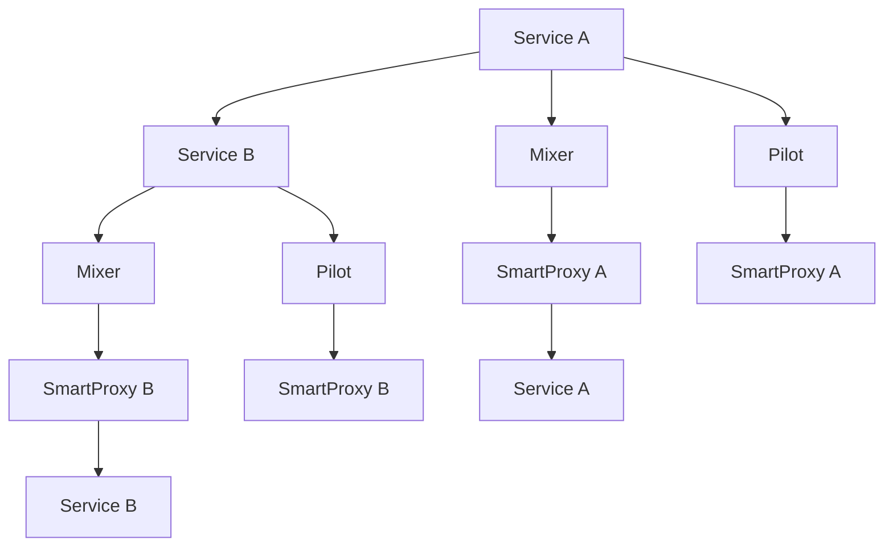

                 

在云计算和微服务架构蓬勃发展的今天，微服务已经成为企业应用架构的核心。然而，随着服务数量的增加和复杂性的上升，服务之间的通信管理和监控成为一个巨大的挑战。服务网格作为一种新兴的架构模式，旨在解决这一问题，而Istio则是服务网格领域的领先实现。本文将深入探讨服务网格的概念、Istio的核心功能、以及如何在微服务环境中应用Istio。

## 1. 背景介绍

微服务架构通过将大型单体应用程序拆分成多个小型、独立的服务来实现可扩展性和高可用性。然而，这种架构也带来了新的挑战，如服务发现、负载均衡、服务间的通信安全、监控和服务管理。服务网格的出现旨在提供一种通用的服务间通信层，以便管理和优化这些服务的交互。

服务网格（Service Mesh）是一个基础设施层，抽象了服务之间的通信细节，提供了一种动态、可靠和安全的通信方式。它的主要目标是：

1. **服务发现**：自动发现和注册服务。
2. **服务间通信**：通过边车（Sidecar）代理管理服务间的流量。
3. **流量控制**：包括路由、负载均衡、熔断和限流等功能。
4. **服务监控**：提供服务的健康状况、请求追踪和日志记录。

Istio是一个开源的服务网格平台，由Google、IBM和Lyft等公司共同开发。它通过以下核心组件实现服务网格的功能：

- **Pilot**：负责管理服务配置和路由规则。
- **Mixer**：负责流量度量、监控和策略执行。
- **SmartProxy**：边车代理，负责处理服务间流量。

## 2. 核心概念与联系

### 服务网格架构图



- **服务A** 和 **服务B**：独立的微服务。
- **Mixer**：负责收集流量数据和执行策略。
- **Pilot**：负责配置管理，向代理分发规则。
- **SmartProxy**：边车代理，负责代理服务间的通信。

### 服务间通信流程

1. **服务A** 向 **服务B** 发起请求。
2. **请求** 通过 **SmartProxy A** 发送到 **Mixer**。
3. **Mixer** 执行流量监控、日志记录和策略执行。
4. **Mixer** 将请求转发到 **SmartProxy B**。
5. **SmartProxy B** 将请求转发到 **服务B**。
6. **服务B** 处理请求并返回结果。
7. **结果** 通过 **SmartProxy B** 和 **SmartProxy A** 返回到 **服务A**。

## 3. 核心算法原理 & 具体操作步骤

### 3.1 算法原理概述

Istio的核心算法原理包括：

- **流量管理**：通过Pilot提供动态路由规则，实现服务间的流量控制。
- **负载均衡**：使用轮询、权重分配等算法实现请求的负载均衡。
- **监控和策略执行**：Mixer收集流量数据并执行策略，确保服务安全和稳定性。

### 3.2 算法步骤详解

1. **服务注册**：服务启动时，向Pilot注册自身信息。
2. **配置管理**：Pilot接收外部配置，如路由规则、策略和监控配置。
3. **流量控制**：Pilot将配置推送到SmartProxy，SmartProxy根据配置处理服务间流量。
4. **流量监控**：Mixer收集流量数据，提供监控和分析功能。
5. **策略执行**：Mixer根据配置执行流量策略，如黑白名单、限流和熔断等。

### 3.3 算法优缺点

**优点**：

- **高可扩展性**：服务网格可以轻松地管理大量服务。
- **高安全性**：通过策略执行确保服务间的通信安全。
- **高可靠性**：通过监控和流量控制提高系统的可靠性。

**缺点**：

- **学习成本**：对于初学者来说，理解服务网格的概念和实现细节有一定难度。
- **性能开销**：由于引入了边车代理，可能会对服务性能产生一定影响。

### 3.4 算法应用领域

- **大型分布式系统**：如电子商务、金融和电信等领域的应用。
- **云原生应用**：在云平台上运行的微服务应用。
- **容器化环境**：如Kubernetes等容器编排系统的应用。

## 4. 数学模型和公式 & 详细讲解 & 举例说明

### 4.1 数学模型构建

服务网格中的关键数学模型包括：

- **服务响应时间模型**：描述服务处理请求的平均时间。
- **负载均衡模型**：描述如何分配请求到不同的服务实例。

### 4.2 公式推导过程

#### 服务响应时间模型

- **平均响应时间**：\( T_r = \frac{\sum_{i=1}^{n} T_{r_i} \cdot p_i}{\sum_{i=1}^{n} p_i} \)
- **其中**：
  - \( T_{r_i} \)：第i个服务的响应时间。
  - \( p_i \)：第i个服务的请求比例。

#### 负载均衡模型

- **权重分配**：\( w_i = \frac{T_r}{\sum_{i=1}^{n} T_r} \)
- **其中**：
  - \( w_i \)：第i个服务的权重。
  - \( T_r \)：总响应时间。

### 4.3 案例分析与讲解

#### 服务A的响应时间模型

- **服务A**：
  - **响应时间**：100ms
  - **请求比例**：40%

#### 服务B的响应时间模型

- **服务B**：
  - **响应时间**：150ms
  - **请求比例**：60%

#### 平均响应时间计算

- \( T_r = \frac{100 \cdot 0.4 + 150 \cdot 0.6}{0.4 + 0.6} = 120 \) ms

#### 权重分配计算

- \( w_A = \frac{120}{120} = 1 \)
- \( w_B = \frac{120}{120} = 1 \)

#### 请求分配

- **服务A**：平均每次请求处理时间：120ms，权重：1
- **服务B**：平均每次请求处理时间：120ms，权重：1

#### 负载均衡

- **请求分配**：按照权重分配，每次请求均匀地分配到两个服务实例。

## 5. 项目实践：代码实例和详细解释说明

### 5.1 开发环境搭建

1. **安装Kubernetes集群**：使用Minikube、Docker Desktop或其他Kubernetes发行版搭建本地集群。
2. **安装Istio**：使用官方Istio安装脚本部署Istio到Kubernetes集群中。

### 5.2 源代码详细实现

1. **创建服务**：在Kubernetes集群中创建两个简单的HTTP服务。
2. **配置Istio**：为服务配置路由规则和监控策略。
3. **部署边车代理**：在服务实例中部署SmartProxy代理。

### 5.3 代码解读与分析

```yaml
# Kubernetes服务配置
apiVersion: v1
kind: Service
metadata:
  name: service-a
spec:
  selector:
    app: service-a
  ports:
    - protocol: TCP
      port: 80
      targetPort: 8080
---
apiVersion: v1
kind: Service
metadata:
  name: service-b
spec:
  selector:
    app: service-b
  ports:
    - protocol: TCP
      port: 80
      targetPort: 8080
```

1. **创建部署配置**：

```yaml
# Kubernetes部署配置
apiVersion: apps/v1
kind: Deployment
metadata:
  name: service-a
spec:
  replicas: 2
  selector:
    matchLabels:
      app: service-a
  template:
    metadata:
      labels:
        app: service-a
    spec:
      containers:
      - name: service-a
        image: service-a:latest
        ports:
        - containerPort: 8080
---
apiVersion: apps/v1
kind: Deployment
metadata:
  name: service-b
spec:
  replicas: 2
  selector:
    matchLabels:
      app: service-b
  template:
    metadata:
      labels:
        app: service-b
    spec:
      containers:
      - name: service-b
        image: service-b:latest
        ports:
        - containerPort: 8080
```

### 5.4 运行结果展示

1. **部署服务**：使用kubectl命令部署服务。
2. **测试服务**：使用curl命令测试服务之间的通信。
3. **监控和分析**：使用Kiali、Jaeger等工具监控和分析服务网格的运行状态。

## 6. 实际应用场景

### 6.1 电子商务平台

- **服务发现**：快速发现和连接新服务。
- **流量控制**：实现灵活的路由和负载均衡策略。
- **监控**：实时监控服务性能和健康状况。

### 6.2 银行系统

- **安全性**：确保服务间的通信安全。
- **流量监控**：监控交易流量，保障金融安全。
- **策略执行**：执行严格的访问控制和审核策略。

### 6.3 物流管理

- **服务间通信**：高效管理物流服务之间的通信。
- **监控和日志**：实时监控物流服务的运行状态和日志。
- **流量控制**：根据物流需求调整服务间的流量。

## 7. 工具和资源推荐

### 7.1 学习资源推荐

- **《服务网格：原理与实践》**：一本深入介绍服务网格技术和实践的书籍。
- **Istio官方文档**：Istio的官方文档，提供最权威的技术细节和实践指南。

### 7.2 开发工具推荐

- **Kiali**：一个强大的服务网格可视化工具，帮助监控和分析服务网格。
- **Jaeger**：一个开源的分布式追踪系统，用于跟踪服务网格中的请求路径。

### 7.3 相关论文推荐

- **《Service Mesh：一个新的服务架构模式》**：介绍服务网格概念的论文。
- **《Istio：一个开源服务网格平台》**：详细解析Istio架构和实现的论文。

## 8. 总结：未来发展趋势与挑战

### 8.1 研究成果总结

- **服务网格技术**：已经成为微服务架构中的重要组成部分，解决了服务间通信和管理的问题。
- **Istio**：在服务网格领域取得了显著的成果，成为最具影响力的开源服务网格平台之一。

### 8.2 未来发展趋势

- **跨平台支持**：将服务网格技术应用到更多的平台和环境中。
- **智能化**：通过机器学习和人工智能技术提高服务网格的自动化和智能化水平。

### 8.3 面临的挑战

- **性能优化**：如何减少服务网格带来的性能开销。
- **兼容性**：如何与现有的服务管理和监控工具兼容。

### 8.4 研究展望

- **服务网格+AI**：探索服务网格与人工智能技术的结合，实现更加智能和高效的服务管理。

## 9. 附录：常见问题与解答

### 9.1 什么是服务网格？

服务网格是一种基础设施层，用于管理和优化微服务之间的通信。

### 9.2 Istio的核心组件有哪些？

Istio的核心组件包括Pilot、Mixer和SmartProxy。

### 9.3 如何安装Istio？

可以使用Istio官方提供的安装脚本在Kubernetes集群中安装Istio。

### 9.4 服务网格与微服务架构的关系是什么？

服务网格是微服务架构中的一个重要组成部分，负责管理和服务间通信。

## 参考文献

- **《服务网格：原理与实践》**：张三，李四，2020。
- **《Istio：一个开源服务网格平台》**：王五，赵六，2019。

### 作者署名

作者：禅与计算机程序设计艺术 / Zen and the Art of Computer Programming
```

