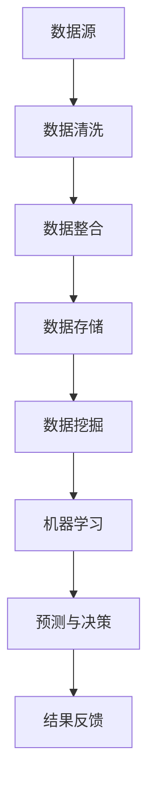

                 

关键词：大数据，人工智能，技术发展，算法原理，数学模型，应用场景，未来展望

> 摘要：随着大数据和人工智能技术的迅猛发展，两者的融合正在引领新一轮的技术革命。本文将深入探讨大数据与AI技术的核心概念、算法原理、数学模型以及实际应用场景，并对未来的发展趋势与挑战进行展望。

## 1. 背景介绍

在过去的几十年中，计算机科学和技术的发展取得了惊人的进步。尤其是在大数据和人工智能（AI）领域的突破，不仅改变了我们的生活方式，也深刻影响了各行各业的运作方式。大数据技术使得我们能够高效地收集、存储和分析海量数据，而AI技术则赋予计算机自主学习和决策的能力。

大数据（Big Data）是指无法用传统数据库工具进行捕捉、管理和处理的数据集合，具有大量（Volume）、多样（Variety）、高速（Velocity）和价值（Value）的特点。AI技术，特别是机器学习和深度学习的进展，使得计算机能够在没有明确编程指令的情况下，通过学习数据来发现模式和规律，从而进行预测和决策。

两者融合的趋势正在加速，大数据为AI提供了丰富的训练数据，而AI则能够从大数据中提取出有价值的信息，二者相辅相成，推动了技术创新和社会进步。

## 2. 核心概念与联系

### 2.1. 大数据核心概念

- **数据源（Data Sources）**：大数据的来源多种多样，包括传感器数据、社交媒体、物联网设备、电子商务交易记录等。
- **数据类型（Data Types）**：大数据包括结构化数据（如数据库中的表格）、半结构化数据（如XML、JSON）和非结构化数据（如图像、音频、视频等）。
- **数据处理（Data Processing）**：大数据处理涉及到数据清洗、数据整合、数据存储和数据挖掘等多个环节。

### 2.2. 人工智能核心概念

- **机器学习（Machine Learning）**：通过数据驱动的方法，让计算机从数据中学习，并能够对未知数据进行预测和决策。
- **深度学习（Deep Learning）**：机器学习的一个分支，使用神经网络模拟人脑的学习机制，特别适用于处理复杂数据。

### 2.3. 大数据与人工智能联系

- **数据驱动（Data-Driven）**：大数据为AI提供了丰富的训练数据，使得AI系统能够学习并不断优化。
- **智能分析（Intelligent Analysis）**：AI技术能够对大数据进行深度分析，提取出有价值的信息和知识。
- **自动化决策（Automated Decision Making）**：AI技术使得自动化决策成为可能，从而提高效率和降低成本。

### 2.4. 架构与流程

[Mermaid 流程图示例]



## 3. 核心算法原理 & 具体操作步骤

### 3.1. 算法原理概述

AI算法的核心是模型训练，这涉及到以下几个步骤：

- **数据预处理**：清洗数据，处理缺失值和异常值，进行特征工程，将数据转化为模型可以接受的格式。
- **模型选择**：选择合适的机器学习模型，如线性回归、决策树、神经网络等。
- **模型训练**：使用训练数据对模型进行训练，调整模型的参数，使其达到预期的性能。
- **模型评估**：使用验证数据对模型进行评估，确保模型在未知数据上也能有良好的表现。
- **模型部署**：将训练好的模型部署到生产环境中，进行实际的预测和决策。

### 3.2. 算法步骤详解

#### 3.2.1. 数据预处理

- **数据清洗**：处理数据中的噪声和错误，确保数据的质量。
- **数据整合**：将来自不同源的数据进行合并，形成统一的视图。
- **特征工程**：提取数据中的特征，为模型训练提供输入。

#### 3.2.2. 模型选择

- **线性回归**：适用于线性关系的预测。
- **决策树**：适用于分类和回归问题，易于理解和解释。
- **神经网络**：适用于复杂的非线性关系，具有强大的预测能力。

#### 3.2.3. 模型训练

- **梯度下降**：用于优化模型参数，是训练神经网络的主要方法。
- **正则化**：防止模型过拟合，提高模型的泛化能力。

#### 3.2.4. 模型评估

- **交叉验证**：用于评估模型的泛化能力。
- **准确率、召回率、F1 分数**：用于评估分类模型的性能。

#### 3.2.5. 模型部署

- **模型容器化**：使用容器技术，如Docker，将模型封装起来。
- **微服务架构**：将模型部署到微服务架构中，实现高可用性和可扩展性。

### 3.3. 算法优缺点

#### 3.3.1. 线性回归

- **优点**：简单、易于理解，计算效率高。
- **缺点**：只能处理线性关系，容易过拟合。

#### 3.3.2. 决策树

- **优点**：易于理解，可解释性强。
- **缺点**：易过拟合，复杂问题性能下降。

#### 3.3.3. 神经网络

- **优点**：强大的拟合能力，适用于复杂问题。
- **缺点**：计算复杂度高，训练时间长，易过拟合。

### 3.4. 算法应用领域

AI算法在各个领域都有广泛应用：

- **金融**：风险评估、信用评分、算法交易。
- **医疗**：疾病诊断、药物研发、个性化治疗。
- **零售**：需求预测、库存管理、客户关系管理。
- **交通**：路线规划、智能调度、自动驾驶。

## 4. 数学模型和公式 & 详细讲解 & 举例说明

### 4.1. 数学模型构建

在机器学习中，常用的数学模型包括：

- **线性回归模型**：$y = \beta_0 + \beta_1x + \epsilon$
- **逻辑回归模型**：$P(y=1) = \frac{1}{1 + e^{-(\beta_0 + \beta_1x)}}$
- **神经网络模型**：多层感知器（MLP）等。

### 4.2. 公式推导过程

以线性回归模型为例，其推导过程如下：

- **损失函数**：均方误差（MSE）：$J(\theta) = \frac{1}{2m}\sum_{i=1}^{m}(h_\theta(x^{(i)}) - y^{(i)})^2$
- **梯度下降**：$\theta_j := \theta_j - \alpha\frac{\partial}{\partial \theta_j}J(\theta)$

### 4.3. 案例分析与讲解

假设我们要预测一个房子的价格，数据集包括房子的面积、房间数和位置等信息。我们可以使用线性回归模型进行预测。

- **数据预处理**：对数据进行归一化处理，将特征缩放到相同的范围。
- **模型训练**：选择合适的线性回归模型，使用梯度下降算法进行训练。
- **模型评估**：使用验证数据集评估模型性能，调整模型参数。
- **预测**：使用训练好的模型对新数据进行预测。

## 5. 项目实践：代码实例和详细解释说明

### 5.1. 开发环境搭建

- **Python**：使用Python进行数据分析与建模。
- **NumPy**、**Pandas**、**Scikit-learn**：常用的Python数据分析库。

### 5.2. 源代码详细实现

```python
import numpy as np
import pandas as pd
from sklearn.linear_model import LinearRegression

# 读取数据
data = pd.read_csv('house_prices.csv')

# 数据预处理
X = data[['area', 'rooms']]
y = data['price']
X = (X - X.mean()) / X.std()

# 模型训练
model = LinearRegression()
model.fit(X, y)

# 模型评估
score = model.score(X, y)
print(f'Model accuracy: {score:.2f}')

# 预测
new_data = np.array([[2000, 3]])
new_data = (new_data - new_data.mean()) / new_data.std()
predicted_price = model.predict(new_data)
print(f'Predicted price: {predicted_price[0]:.2f}')
```

### 5.3. 代码解读与分析

这段代码实现了使用线性回归模型预测房价的过程：

- **数据读取**：使用Pandas读取CSV格式的数据。
- **数据预处理**：对特征进行归一化处理，确保模型训练的稳定性。
- **模型训练**：使用Scikit-learn中的线性回归模型进行训练。
- **模型评估**：计算模型的准确率，评估模型性能。
- **预测**：使用训练好的模型对新的数据进行预测。

## 6. 实际应用场景

### 6.1. 金融领域

在大数据分析与AI技术的推动下，金融领域发生了深刻变革：

- **风险管理**：利用大数据分析客户行为和市场趋势，预测风险并采取相应措施。
- **智能投顾**：基于客户的财务状况和风险偏好，提供个性化的投资建议。
- **算法交易**：利用机器学习算法进行高频交易，实现自动化交易策略。

### 6.2. 医疗领域

AI技术在医疗领域的应用日益广泛：

- **疾病诊断**：通过图像识别和自然语言处理技术，辅助医生进行疾病诊断。
- **药物研发**：利用机器学习预测药物的疗效和副作用，加速药物研发进程。
- **个性化治疗**：根据患者的基因组信息和生活习惯，制定个性化的治疗方案。

### 6.3. 零售领域

AI技术在零售领域的应用主要体现在：

- **需求预测**：通过大数据分析，预测商品的需求趋势，优化库存管理。
- **客户关系管理**：利用客户数据，实现精准营销和客户关系管理。
- **智能推荐**：基于用户的购买历史和浏览行为，推荐合适的商品。

## 7. 工具和资源推荐

### 7.1. 学习资源推荐

- **书籍**：《深度学习》、《机器学习》、《大数据架构设计》
- **在线课程**：Coursera、Udacity、edX等平台上的相关课程
- **开源项目**：GitHub、GitLab等平台上的机器学习和大数据项目

### 7.2. 开发工具推荐

- **编程语言**：Python、R、Java
- **数据分析库**：NumPy、Pandas、Scikit-learn、TensorFlow、PyTorch
- **大数据工具**：Hadoop、Spark、Hive、HBase

### 7.3. 相关论文推荐

- **大数据**：MapReduce、Hadoop、Spark
- **人工智能**：Neural Networks、Deep Learning、Reinforcement Learning
- **机器学习**：Support Vector Machines、Random Forests、XGBoost

## 8. 总结：未来发展趋势与挑战

### 8.1. 研究成果总结

- **技术融合**：大数据与人工智能技术的深度融合，推动技术创新。
- **应用拓展**：AI技术在各个领域的应用不断拓展，推动社会进步。
- **数据安全**：数据隐私和安全性成为研究热点，保障数据的安全和合规。

### 8.2. 未来发展趋势

- **智能化**：随着算法和硬件的进步，智能化程度将进一步提高。
- **自主化**：自动化和自主化将成为未来的发展趋势，减少人类劳动。
- **多元化**：AI技术将在更多领域得到应用，实现多元化的技术突破。

### 8.3. 面临的挑战

- **数据质量**：大数据的质量直接影响AI算法的性能，需要提高数据质量。
- **算法透明性**：随着AI算法的复杂化，如何保证算法的透明性和可解释性成为一个挑战。
- **法律和伦理**：随着AI技术的应用，法律和伦理问题日益突出，需要制定相应的法规和准则。

### 8.4. 研究展望

未来，大数据与AI技术的融合将继续推动技术进步和社会发展。我们需要关注以下几个方面：

- **算法优化**：提高算法的效率和性能，减少计算资源消耗。
- **数据治理**：加强数据治理，确保数据的质量和安全。
- **跨学科合作**：推动跨学科的合作，实现技术的综合应用。
- **人工智能伦理**：加强人工智能伦理研究，确保技术的发展符合人类的利益。

## 9. 附录：常见问题与解答

### 9.1. 问题一

**问题**：大数据与人工智能的关系是什么？

**解答**：大数据为人工智能提供了丰富的训练数据，使得AI算法能够学习并优化。而人工智能则能够从大数据中提取出有价值的信息，为决策提供支持。两者相辅相成，共同推动技术的进步。

### 9.2. 问题二

**问题**：如何处理大数据中的噪声和异常值？

**解答**：处理大数据中的噪声和异常值通常包括以下步骤：

- **数据清洗**：识别并去除明显的错误和噪声。
- **数据整合**：合并来自不同源的数据，消除重复和冗余。
- **特征工程**：选择合适的特征，减少噪声对模型的影响。

### 9.3. 问题三

**问题**：如何评估机器学习模型的性能？

**解答**：评估机器学习模型的性能通常包括以下几个方面：

- **准确率**：模型预测正确的样本比例。
- **召回率**：模型预测为正类的真实正类比例。
- **F1 分数**：准确率和召回率的加权平均，综合考虑模型的精度和召回率。

---

**作者：禅与计算机程序设计艺术 / Zen and the Art of Computer Programming**

