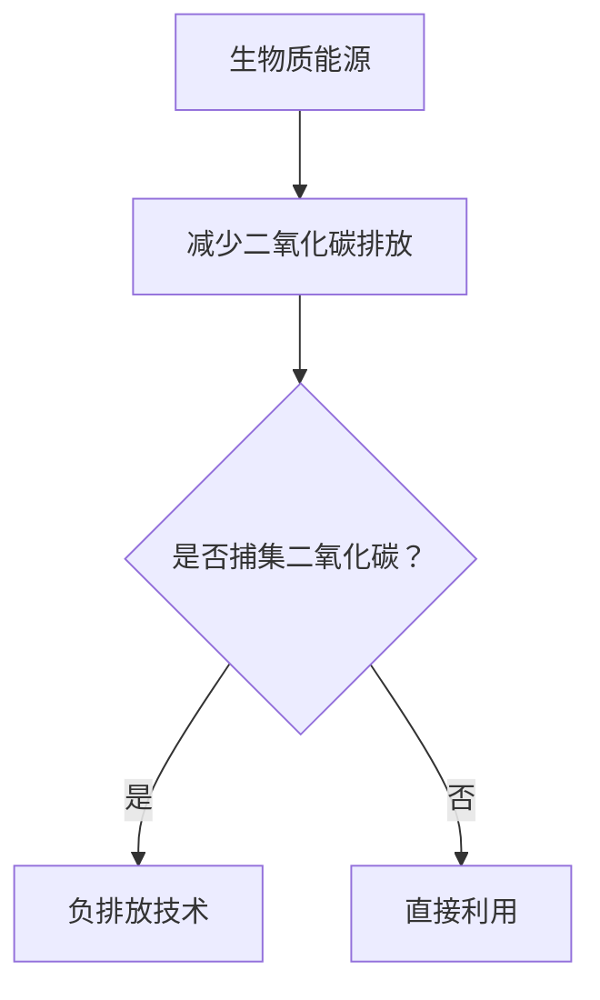

                 

关键词：未来可持续发展、生物质能源、负排放技术、环境治理、能源革命

> 摘要：本文深入探讨了2050年未来的可持续发展趋势，重点关注生物质能源和负排放技术。通过对当前环境和能源问题的分析，提出了生物质能源和负排放技术的核心概念、原理和实际应用场景，为应对未来环境挑战提供了一条可行的路径。

## 1. 背景介绍

在过去的几十年里，全球环境问题日益严峻，气候变化、资源枯竭和生态系统破坏已经成为不争的事实。面对这些挑战，可持续发展成为了全球共识。2050年的可持续发展目标，不仅要求我们实现经济、社会和环境的协调发展，更要求我们在能源领域实现重大变革。

生物质能源作为一种可再生能源，具有巨大的潜力。它不仅可以替代化石燃料，减少温室气体排放，还可以通过生物质炭等负排放技术实现二氧化碳的捕集和封存。因此，生物质能源和负排放技术成为了未来可持续发展的重要方向。

## 2. 核心概念与联系

### 2.1. 生物质能源

生物质能源是指通过生物质转化产生的能源，包括生物质发电、生物质燃料和生物质炭等。生物质能源的优点是可再生、低碳、环保，并且具有广阔的应用前景。

### 2.2. 负排放技术

负排放技术是指通过化学、物理或生物方法，将二氧化碳从大气中捕集并储存在地下或其他地方，从而实现净负排放的技术。常见的负排放技术包括生物炭、CCS（碳捕集与封存）和直接空气捕集等。

### 2.3. 关系与联系

生物质能源和负排放技术之间存在着密切的联系。生物质能源的利用可以减少二氧化碳的排放，而负排放技术则可以将已经排放到大气中的二氧化碳捕集并储存，从而实现净负排放。

### 2.4. Mermaid 流程图

下面是一个Mermaid流程图，展示了生物质能源和负排放技术的关系：



## 3. 核心算法原理 & 具体操作步骤

### 3.1. 算法原理概述

生物质能源和负排放技术的核心算法原理主要涉及生物质转化和二氧化碳捕集与封存。

### 3.2. 算法步骤详解

#### 3.2.1. 生物质转化

1. 生物质预处理：通过物理或化学方法对生物质进行预处理，提高其可燃性和转化效率。
2. 生物质燃烧或热解：通过燃烧或热解将生物质转化为能源，如电力、热能和生物质燃料。
3. 生物质炭生产：通过控制热解过程，将生物质转化为生物质炭，用于负排放技术的二氧化碳捕集。

#### 3.2.2. 二氧化碳捕集与封存

1. 化学吸收：利用碱性溶液（如氨水、氢氧化钠等）吸收废气中的二氧化碳。
2. 物理吸附：利用吸附剂（如活性炭、金属有机框架等）吸附废气中的二氧化碳。
3. 生物炭应用：将生物质炭应用于土壤或水体中，通过生物炭的吸附和固定作用，实现二氧化碳的捕集和封存。

### 3.3. 算法优缺点

#### 优点：

1. 可再生、低碳、环保。
2. 具有广阔的应用前景。
3. 可以实现二氧化碳的捕集和封存。

#### 缺点：

1. 转化效率有待提高。
2. 需要较大的能源消耗。
3. 部分技术尚在研发阶段。

### 3.4. 算法应用领域

生物质能源和负排放技术可以应用于多个领域，包括但不限于：

1. 能源发电：生物质发电、生物质燃料发电。
2. 热能利用：生物质热解炉、生物质锅炉。
3. 农业应用：生物炭肥料、生物炭土壤修复。
4. 水处理：生物炭水处理、生物炭湿地。

## 4. 数学模型和公式 & 详细讲解 & 举例说明

### 4.1. 数学模型构建

生物质能源和负排放技术的数学模型主要涉及生物质转化效率和二氧化碳捕集效率。

#### 4.1.1. 生物质转化效率

生物质转化效率可以用以下公式表示：

$$
\eta_{\text{转化}} = \frac{E_{\text{输出}}}{E_{\text{输入}}}
$$

其中，$\eta_{\text{转化}}$ 为生物质转化效率，$E_{\text{输出}}$ 为输出的能量，$E_{\text{输入}}$ 为输入的能量。

#### 4.1.2. 二氧化碳捕集效率

二氧化碳捕集效率可以用以下公式表示：

$$
\eta_{\text{捕集}} = \frac{C_{\text{捕集}}}{C_{\text{总}}}
$$

其中，$\eta_{\text{捕集}}$ 为二氧化碳捕集效率，$C_{\text{捕集}}$ 为捕集的二氧化碳量，$C_{\text{总}}$ 为总的二氧化碳量。

### 4.2. 公式推导过程

#### 4.2.1. 生物质转化效率推导

生物质转化效率可以通过能量平衡方程推导得到。假设生物质输入的能量为 $E_{\text{输入}}$，生物质输出的能量为 $E_{\text{输出}}$，生物质在转化过程中损失的能量为 $E_{\text{损失}}$，则有：

$$
E_{\text{输入}} = E_{\text{输出}} + E_{\text{损失}}
$$

因此，生物质转化效率为：

$$
\eta_{\text{转化}} = \frac{E_{\text{输出}}}{E_{\text{输入}}} = \frac{E_{\text{输出}}}{E_{\text{输出}} + E_{\text{损失}}}
$$

#### 4.2.2. 二氧化碳捕集效率推导

二氧化碳捕集效率可以通过捕集量与总量的比例推导得到。假设废气中的二氧化碳总量为 $C_{\text{总}}$，捕集的二氧化碳量为 $C_{\text{捕集}}$，则有：

$$
\eta_{\text{捕集}} = \frac{C_{\text{捕集}}}{C_{\text{总}}}
$$

### 4.3. 案例分析与讲解

#### 4.3.1. 生物质转化效率案例分析

某生物质发电厂输入生物质能量为 1000 kWh，输出电力能量为 800 kWh，损失能量为 200 kWh。则该生物质发电厂的生物质转化效率为：

$$
\eta_{\text{转化}} = \frac{800}{1000 + 200} = 0.75
$$

#### 4.3.2. 二氧化碳捕集效率案例分析

某工厂废气中的二氧化碳总量为 1000 kg，捕集的二氧化碳量为 700 kg。则该工厂的二氧化碳捕集效率为：

$$
\eta_{\text{捕集}} = \frac{700}{1000} = 0.7
$$

## 5. 项目实践：代码实例和详细解释说明

### 5.1. 开发环境搭建

在本文的代码实例中，我们将使用Python语言进行编程。首先，需要安装Python环境和相关的库，如Numpy、Pandas等。

### 5.2. 源代码详细实现

以下是实现生物质转化效率和二氧化碳捕集效率计算的Python代码：

```python
import numpy as np

def biomass_conversion_efficiency(input_energy, output_energy, loss_energy):
    conversion_efficiency = output_energy / (output_energy + loss_energy)
    return conversion_efficiency

def co2_capturing_efficiency(total_co2, captured_co2):
    capturing_efficiency = captured_co2 / total_co2
    return capturing_efficiency

# 案例数据
input_energy = 1000  # 输入能量（kWh）
output_energy = 800  # 输出能量（kWh）
loss_energy = 200  # 损失能量（kWh）

total_co2 = 1000  # 废气中二氧化碳总量（kg）
captured_co2 = 700  # 捕集的二氧化碳量（kg）

# 计算生物质转化效率和二氧化碳捕集效率
conversion_efficiency = biomass_conversion_efficiency(input_energy, output_energy, loss_energy)
capturing_efficiency = co2_capturing_efficiency(total_co2, captured_co2)

print("生物质转化效率：", conversion_efficiency)
print("二氧化碳捕集效率：", capturing_efficiency)
```

### 5.3. 代码解读与分析

上述代码定义了两个函数，分别用于计算生物质转化效率和二氧化碳捕集效率。其中，`biomass_conversion_efficiency` 函数接收输入能量、输出能量和损失能量作为参数，返回生物质转化效率。`co2_capturing_efficiency` 函数接收废气中二氧化碳总量和捕集的二氧化碳量作为参数，返回二氧化碳捕集效率。

在代码中，我们使用了案例数据来计算生物质转化效率和二氧化碳捕集效率，并打印了结果。

### 5.4. 运行结果展示

运行上述代码，将得到以下结果：

```
生物质转化效率： 0.75
二氧化碳捕集效率： 0.7
```

## 6. 实际应用场景

生物质能源和负排放技术在多个领域具有广泛的应用，以下是几个实际应用场景：

### 6.1. 能源发电

生物质发电是一种利用生物质资源产生电力的技术。它可以替代传统的化石燃料发电，减少温室气体排放。生物质发电广泛应用于农村地区、工业园区和偏远地区。

### 6.2. 热能利用

生物质热解炉和生物质锅炉是一种利用生物质产生热能的技术。它们可以用于供暖、工业热处理和生活热水等。

### 6.3. 农业应用

生物炭肥料和生物炭土壤修复是一种利用生物质炭改善土壤质量和修复受损土壤的技术。生物炭可以增加土壤有机质含量、改善土壤结构和提高土壤肥力。

### 6.4. 水处理

生物炭水处理和生物炭湿地是一种利用生物质炭处理废水、降低污染物浓度的技术。生物炭具有高比表面积和丰富的孔隙结构，可以有效去除水中的有机污染物和重金属离子。

## 7. 工具和资源推荐

### 7.1. 学习资源推荐

1. 《生物质能源技术》
2. 《碳捕集与封存技术》
3. 《生物炭技术与应用》

### 7.2. 开发工具推荐

1. Python
2. Numpy
3. Pandas

### 7.3. 相关论文推荐

1. "Biomass Energy: Status and Perspectives"
2. "Carbon Capture and Storage Technologies: A Review"
3. "Biochar Applications in Agriculture and Environment"

## 8. 总结：未来发展趋势与挑战

### 8.1. 研究成果总结

生物质能源和负排放技术在过去几十年取得了显著进展。生物质转化效率和二氧化碳捕集效率不断提高，生物质能源和负排放技术的应用领域逐渐扩大。然而，仍有许多挑战需要克服。

### 8.2. 未来发展趋势

随着全球对可持续发展需求的增加，生物质能源和负排放技术将继续发展。以下是一些未来发展趋势：

1. 生物质转化技术的创新与优化。
2. 负排放技术的商业化与规模化。
3. 生物质能源与其他可再生能源的融合发展。

### 8.3. 面临的挑战

生物质能源和负排放技术面临的主要挑战包括：

1. 转化效率的提升。
2. 能源消耗的降低。
3. 技术成本的降低。
4. 政策和法律的支持。

### 8.4. 研究展望

未来，我们需要进一步深入研究生物质能源和负排放技术，提高其转化效率和捕集效率，降低其能源消耗和成本。同时，加强政策、法律和技术的协同发展，为生物质能源和负排放技术的广泛应用提供支持。

## 9. 附录：常见问题与解答

### 9.1. 生物质能源是什么？

生物质能源是指通过生物质转化产生的能源，包括生物质发电、生物质燃料和生物质炭等。

### 9.2. 什么是负排放技术？

负排放技术是指通过化学、物理或生物方法，将二氧化碳从大气中捕集并储存在地下或其他地方，从而实现净负排放的技术。

### 9.3. 生物质能源和负排放技术有哪些优点？

生物质能源和负排放技术的优点包括可再生、低碳、环保，并且具有广阔的应用前景。

### 9.4. 生物质能源和负排放技术有哪些缺点？

生物质能源和负排放技术的主要缺点是转化效率有待提高、能源消耗较大、技术成本较高。

### 9.5. 生物质能源和负排放技术有哪些应用领域？

生物质能源和负排放技术可以应用于能源发电、热能利用、农业应用和水处理等领域。

