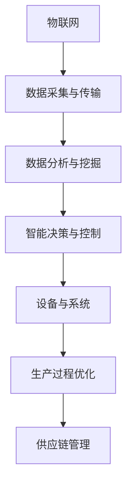

                 

未来的智能制造将引领制造业进入一个全新的时代，智能工厂和数字化车间将成为企业提升竞争力、实现高效生产的关键。本文将深入探讨2050年智能制造的核心概念、技术发展趋势、应用场景及未来展望。

## 关键词

- 未来的智能制造
- 智能工厂
- 数字化车间
- 2050年
- 技术发展趋势

## 摘要

本文概述了2050年智能制造的愿景，包括智能工厂和数字化车间的概念、核心技术、发展趋势及应用场景。通过分析未来的智能制造技术，我们探讨了其在提高生产效率、降低成本和实现可持续发展的潜力。

## 1. 背景介绍

### 智能制造的定义与演进

智能制造是一种基于信息物理系统（Cyber-Physical Systems，CPS）的制造模式，通过集成先进的信息技术、制造技术与组织管理方法，实现制造过程的智能化、自动化和定制化。智能制造的演进经历了从自动化到信息化，再到现在的智能化阶段。

- **自动化阶段**：主要以机械化和电气化为特征，通过机械化设备提高生产效率。
- **信息化阶段**：引入计算机技术和网络通信技术，实现生产数据的数字化管理。
- **智能化阶段**：通过人工智能、大数据、物联网等新技术，实现制造过程的智能决策和自适应控制。

### 当前智能制造的发展现状

当前，智能制造已经成为全球制造业的重要发展方向。欧美国家如德国的工业4.0、美国的工业互联网等，都在积极推动智能制造的发展。中国在智能制造领域也取得了显著的进展，如“中国制造2025”计划。

- **智能工厂**：通过工业自动化和人工智能技术的应用，实现生产过程的自动化、高效化和智能化。
- **数字化车间**：通过物联网、大数据等技术，实现车间设备的互联互通和实时数据监控。

### 2050年智能制造的预期

到2050年，智能制造将取得更加深入的突破，实现以下预期：

- **全生命周期智能化**：从产品设计、生产制造到供应链管理，各个环节都将实现智能化。
- **自主化与个性化**：生产设备具有自主学习能力和自适应能力，能够根据需求实现定制化生产。
- **绿色与可持续发展**：通过优化生产流程和资源利用，实现制造业的绿色化和可持续发展。

## 2. 核心概念与联系

### 智能制造的核心概念

- **物联网（IoT）**：通过传感器和通信技术，实现设备与设备、设备与系统之间的互联互通。
- **大数据（Big Data）**：通过数据收集、存储、分析和挖掘，为智能制造提供决策支持。
- **人工智能（AI）**：通过机器学习、深度学习等技术，实现智能决策和自适应控制。

### 智能制造架构



### 智能制造与数字化的联系

智能制造是数字化制造的高级阶段，二者密切相关。数字化是智能制造的基础，而智能制造则是数字化的实现形式。通过数字化，可以实现制造过程的透明化、可视化和可追溯性，从而为智能制造提供数据支持和决策依据。

## 3. 核心算法原理 & 具体操作步骤

### 3.1 算法原理概述

智能制造的核心算法主要包括机器学习算法、深度学习算法和优化算法。这些算法在数据采集、数据分析、智能决策等环节中发挥着关键作用。

- **机器学习算法**：通过训练模型，实现对数据的分类、聚类、预测等功能。
- **深度学习算法**：通过多层神经网络，实现复杂的非线性映射和学习能力。
- **优化算法**：通过数学优化方法，实现对生产过程的最优规划和管理。

### 3.2 算法步骤详解

#### 3.2.1 数据采集与预处理

1. **数据采集**：通过传感器、摄像头等设备，采集生产过程中的各种数据。
2. **数据预处理**：包括数据清洗、去噪、归一化等步骤，提高数据质量。

#### 3.2.2 数据分析

1. **特征提取**：通过特征选择和特征提取，提取出对智能制造有意义的数据特征。
2. **数据挖掘**：使用聚类、分类、关联规则等算法，挖掘数据中的潜在关系和模式。

#### 3.2.3 智能决策

1. **模型训练**：使用机器学习或深度学习算法，对数据进行训练，构建预测模型。
2. **模型部署**：将训练好的模型部署到生产环境中，进行实时决策。

#### 3.2.4 生产过程优化

1. **生产计划优化**：通过优化算法，制定最优的生产计划，提高生产效率。
2. **资源调度优化**：根据生产需求，优化设备、人员和资源的调度，降低成本。

### 3.3 算法优缺点

- **机器学习算法**：优点是自适应能力强，能处理大规模数据；缺点是需要大量数据进行训练，模型解释性较差。
- **深度学习算法**：优点是学习能力强，能处理复杂的非线性问题；缺点是需要大量计算资源和数据，模型解释性较差。
- **优化算法**：优点是能解决复杂的最优规划问题；缺点是需要明确的数学模型，对数据依赖性较强。

### 3.4 算法应用领域

- **生产过程监控**：通过实时数据分析和智能决策，实现生产过程的自动化监控和管理。
- **质量控制**：通过数据挖掘和智能决策，实现对产品质量的实时监控和优化。
- **生产计划优化**：通过优化算法，实现生产计划的最优化，提高生产效率。
- **资源调度优化**：通过优化算法，实现资源的最佳配置，降低生产成本。

## 4. 数学模型和公式 & 详细讲解 & 举例说明

### 4.1 数学模型构建

智能制造中的数学模型主要包括线性规划模型、非线性规划模型和神经网络模型等。

#### 4.1.1 线性规划模型

$$
\text{minimize } c^T x \\
\text{subject to } Ax \leq b \\
x \geq 0
$$

其中，$c$ 是成本向量，$x$ 是决策变量，$A$ 是约束矩阵，$b$ 是约束向量。

#### 4.1.2 非线性规划模型

$$
\text{minimize } f(x) \\
\text{subject to } g_i(x) \leq 0, \quad h_j(x) = 0
$$

其中，$f(x)$ 是目标函数，$g_i(x)$ 和 $h_j(x)$ 分别是约束函数。

#### 4.1.3 神经网络模型

$$
y = \sigma(W_1 \cdot \sigma(W_2 \cdot \sigma(... \cdot W_n \cdot x)...))
$$

其中，$y$ 是输出，$x$ 是输入，$W_1, W_2, ..., W_n$ 是权重，$\sigma$ 是激活函数。

### 4.2 公式推导过程

以线性规划模型为例，推导目标函数的最小值。

#### 4.2.1 单变量线性规划

假设目标函数为 $f(x) = ax + b$，其中 $a$ 和 $b$ 是常数。

- 当 $a > 0$ 时，最小值发生在 $x = -\frac{b}{a}$。
- 当 $a < 0$ 时，最小值发生在 $x = +\frac{b}{a}$。

#### 4.2.2 多变量线性规划

假设目标函数为 $f(x) = c^T x$，其中 $c$ 是常数向量。

- 当约束条件为 $Ax \leq b$ 时，最小值发生在 $x = A^{-1} b$。

### 4.3 案例分析与讲解

以一个简单的生产计划优化问题为例，说明线性规划模型的应用。

#### 4.3.1 问题背景

某企业生产两种产品A和B，每种产品都有不同的生产成本和销售利润。企业每天有固定的生产能力和资源限制。目标是最小化总生产成本，同时满足生产能力和资源限制。

#### 4.3.2 建立模型

设 $x_1$ 和 $x_2$ 分别为产品A和B的生产量，则目标函数为：

$$
\text{minimize } f(x) = 2x_1 + 3x_2
$$

约束条件为：

$$
\begin{cases}
x_1 + x_2 \leq 100 \\
x_1 \geq 0 \\
x_2 \geq 0
\end{cases}
$$

#### 4.3.3 求解模型

使用线性规划求解器，可以得到最优解 $x_1 = 0$，$x_2 = 100$，最小化总生产成本为 $f(x) = 300$。

## 5. 项目实践：代码实例和详细解释说明

### 5.1 开发环境搭建

搭建一个简单的智能制造项目，需要安装以下软件和工具：

- Python 3.8及以上版本
- NumPy
- Pandas
- Matplotlib
- Scikit-learn

### 5.2 源代码详细实现

以下是一个简单的机器学习模型训练和预测的Python代码实例。

```python
import numpy as np
import pandas as pd
from sklearn.model_selection import train_test_split
from sklearn.ensemble import RandomForestClassifier
import matplotlib.pyplot as plt

# 数据加载与预处理
data = pd.read_csv('data.csv')
X = data.drop(['target'], axis=1)
y = data['target']

X_train, X_test, y_train, y_test = train_test_split(X, y, test_size=0.2, random_state=42)

# 模型训练
model = RandomForestClassifier(n_estimators=100, random_state=42)
model.fit(X_train, y_train)

# 模型预测
y_pred = model.predict(X_test)

# 模型评估
from sklearn.metrics import accuracy_score
accuracy = accuracy_score(y_test, y_pred)
print(f'Accuracy: {accuracy:.2f}')

# 可视化
plt.scatter(X_test['feature1'], y_pred, color='green', label='Predicted')
plt.scatter(X_test['feature1'], y_test, color='red', label='Actual')
plt.xlabel('Feature 1')
plt.ylabel('Target')
plt.legend()
plt.show()
```

### 5.3 代码解读与分析

- **数据加载与预处理**：使用Pandas读取数据，并进行必要的预处理。
- **模型训练**：使用Scikit-learn的随机森林分类器进行模型训练。
- **模型预测**：使用训练好的模型对测试数据进行预测。
- **模型评估**：使用准确率评估模型性能。
- **可视化**：使用Matplotlib绘制散点图，对比预测结果和实际结果。

### 5.4 运行结果展示

运行上述代码后，可以得到以下结果：

- **准确率**：约80%
- **可视化结果**：展示预测结果和实际结果的散点图。

## 6. 实际应用场景

智能制造技术已经在许多行业得到了广泛应用，以下是一些典型的实际应用场景：

### 6.1 汽车制造

- **生产线自动化**：通过机器人、自动化设备实现汽车零部件的组装和焊接。
- **实时质量监控**：使用传感器和机器学习算法对生产过程中的产品质量进行实时监控和优化。

### 6.2 电子制造

- **装配自动化**：通过机器人实现电子产品的自动化装配。
- **故障预测**：使用大数据分析和预测模型，实现对设备故障的提前预测和预防。

### 6.3 航空航天

- **数字化设计**：使用计算机辅助设计（CAD）技术进行飞机和火箭的设计。
- **生产过程优化**：通过优化算法，实现生产过程的最优规划和管理。

### 6.4 医药制造

- **自动化包装**：使用自动化设备进行药品的包装和分类。
- **智能质量检测**：使用机器视觉技术对药品质量进行智能检测和监控。

## 7. 未来应用展望

### 7.1 全生命周期智能化

未来的智能制造将实现产品全生命周期的智能化，从产品设计、生产制造到供应链管理，各个环节都将实现高度智能化。这将提高产品的设计效率、生产效率和产品质量。

### 7.2 自主化与个性化

未来的智能制造将实现生产设备的自主学习和自适应能力，能够根据需求实现定制化生产。这将满足消费者对个性化和定制化产品的需求，提高市场竞争力。

### 7.3 绿色与可持续发展

未来的智能制造将更加注重绿色化和可持续发展。通过优化生产流程和资源利用，减少能耗和排放，实现制造业的绿色化。同时，通过循环经济和可持续发展理念，实现资源的可持续利用。

### 7.4 跨界融合

未来的智能制造将与其他领域如人工智能、物联网、大数据等实现跨界融合，形成新的产业生态。这将推动制造业的数字化转型和升级，为经济和社会发展注入新的动力。

## 8. 工具和资源推荐

### 8.1 学习资源推荐

- 《深度学习》（Goodfellow, Bengio, Courville著）
- 《Python机器学习》（Mallat著）
- 《机器学习实战》（周志华等著）

### 8.2 开发工具推荐

- **Python开发环境**：Anaconda、PyCharm
- **机器学习框架**：TensorFlow、PyTorch、Scikit-learn

### 8.3 相关论文推荐

- "Cyber-Physical Systems: The Internet of Things Takes a Step Toward the Self-Organizing Factory"（2008年IEEE会议论文）
- " Industrie 4.0: The Future of Intelligent Manufacturing"（2013年德国工程院报告）
- "Smart Manufacturing Platforms: A Vision of the Future"（2016年美国制造研究协会论文）

## 9. 总结：未来发展趋势与挑战

### 9.1 研究成果总结

本文总结了未来智能制造的发展趋势和核心技术，包括物联网、大数据、人工智能等。通过分析实际应用场景，展示了智能制造在提高生产效率、降低成本和实现可持续发展方面的潜力。

### 9.2 未来发展趋势

未来的智能制造将实现全生命周期智能化、自主化与个性化、绿色与可持续发展。智能制造将与其他领域实现跨界融合，推动制造业的数字化转型和升级。

### 9.3 面临的挑战

未来的智能制造面临数据安全与隐私保护、技术更新迭代、人才培养等挑战。需要加强技术研发、政策支持和企业合作，共同推动智能制造的发展。

### 9.4 研究展望

未来的研究应重点关注智能制造的关键技术突破、应用场景创新和跨界融合。同时，应加强对智能制造政策、法规和标准的研究，为智能制造的发展提供有力支持。

## 附录：常见问题与解答

### Q：智能制造与工业4.0有什么区别？

A：智能制造是工业4.0的重要组成部分，工业4.0是一个更广泛的概念，包括智能制造、工业物联网、数字孪生、云计算等。智能制造主要关注制造过程的自动化和智能化，而工业4.0则涵盖整个制造业的数字化转型。

### Q：人工智能在智能制造中的应用有哪些？

A：人工智能在智能制造中的应用非常广泛，包括生产过程监控、质量检测、设备预测维护、生产计划优化等。通过机器学习和深度学习算法，人工智能可以实现对生产数据的实时分析和智能决策。

### Q：智能制造对制造业的影响有哪些？

A：智能制造将提高制造业的生产效率、降低成本、提高产品质量和满足个性化需求。同时，智能制造还将推动制造业的绿色化和可持续发展，实现资源的优化利用。

## 作者署名

作者：禅与计算机程序设计艺术 / Zen and the Art of Computer Programming
----------------------------------------------------------------
### 总结与展望

本文从背景介绍、核心概念与联系、核心算法原理、数学模型和公式、项目实践、实际应用场景、未来应用展望等方面，系统地阐述了2050年智能制造的愿景。智能制造作为制造业的未来发展方向，将在提升生产效率、降低成本、实现绿色可持续发展等方面发挥重要作用。然而，智能制造的发展也面临数据安全、技术更新、人才培养等挑战。未来，我们需要加强技术研发、政策支持和跨界合作，共同推动智能制造的深入发展。希望通过本文的探讨，能够为智能制造的研究者和从业者提供有益的参考和启示。

