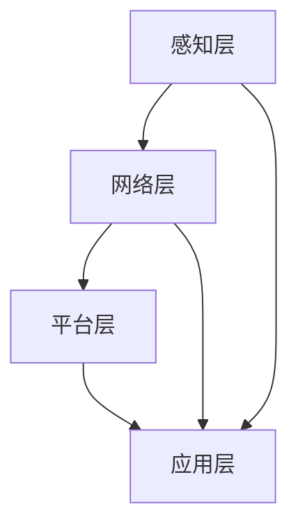

                 

关键词：智能家居，家庭机器人，智能家电，2050年，未来科技，人工智能，人机交互，物联网

> 摘要：本文将探讨未来智能家居的发展趋势，特别是在2050年家庭机器人管家与智能家电的融合应用。通过介绍智能家居的核心概念、技术架构、算法原理、数学模型、项目实践，以及未来应用场景和挑战，本文旨在提供一个全面的视角，展望智能家居的未来发展。

## 1. 背景介绍

自20世纪末以来，智能家居技术逐渐成为家庭生活的重要组成部分。从早期的远程控制家电，到如今的智能语音助手，智能家居的发展经历了翻天覆地的变化。然而，随着人工智能和物联网技术的不断进步，未来的智能家居将迎来前所未有的变革。

### 1.1 智能家居的定义与现状

智能家居（Smart Home）是指通过物联网技术，将家中的各种设备连接起来，实现自动化控制和远程监控。目前，智能家居的主要形式包括智能照明、智能安防、智能家电、智能环境控制等。

### 1.2 智能家居的现状分析

当前，智能家居市场主要被几家大厂主导，如苹果的HomeKit、谷歌的Google Home、亚马逊的Alexa等。这些智能助手为用户提供了便捷的智能家居控制方式，同时也推动了智能家居市场的快速发展。

## 2. 核心概念与联系

### 2.1 智能家居核心概念

在智能家居系统中，核心概念包括物联网（IoT）、云计算、大数据、人工智能（AI）等。这些概念相互联系，共同构成了智能家居的技术架构。

### 2.2 智能家居技术架构

智能家居的技术架构可以概括为以下几个层次：

1. **感知层**：包括各种传感器，如温度传感器、湿度传感器、运动传感器等，负责感知家庭环境变化。
2. **网络层**：通过无线通信技术，如Wi-Fi、蓝牙、Zigbee等，将各种设备连接起来。
3. **平台层**：提供数据存储、处理和管理的功能，如云平台、物联网平台等。
4. **应用层**：包括各种智能家居应用，如智能照明、智能安防、智能家电等。

### 2.3 核心概念原理与架构的 Mermaid 流程图



## 3. 核心算法原理 & 具体操作步骤

### 3.1 算法原理概述

智能家居的核心算法主要包括数据采集与处理、机器学习模型训练、智能决策等。

#### 3.1.1 数据采集与处理

数据采集与处理是智能家居系统的基础。通过传感器收集家庭环境数据，如温度、湿度、光照等，然后对数据进行清洗、归一化等预处理，以便后续分析。

#### 3.1.2 机器学习模型训练

通过机器学习算法，如神经网络、决策树等，对预处理后的数据进行分析，构建预测模型，用于智能家居的自动控制。

#### 3.1.3 智能决策

智能决策是智能家居系统的关键。通过预测模型，结合用户习惯和偏好，实现家庭设备的智能控制，如自动调节温度、湿度、光线等。

### 3.2 算法步骤详解

1. **数据采集**：使用传感器收集家庭环境数据。
2. **数据预处理**：对采集到的数据进行分析、清洗、归一化等处理。
3. **模型训练**：使用预处理后的数据，通过机器学习算法训练预测模型。
4. **智能决策**：根据预测模型和用户习惯，实现家庭设备的自动控制。

### 3.3 算法优缺点

**优点**：

- **高效性**：通过机器学习算法，实现家庭设备的自动化控制，提高生活效率。
- **个性化**：根据用户习惯和偏好，提供个性化的智能家居服务。

**缺点**：

- **数据安全**：智能家居系统涉及大量用户数据，需确保数据安全和隐私保护。
- **算法复杂度**：机器学习算法的复杂度高，对计算资源要求较高。

### 3.4 算法应用领域

智能家居算法广泛应用于智能照明、智能安防、智能家电、智能环境控制等领域。例如，智能照明可以根据用户的活动习惯，自动调节灯光亮度；智能安防可以实时监测家庭环境，及时发现异常情况。

## 4. 数学模型和公式 & 详细讲解 & 举例说明

### 4.1 数学模型构建

智能家居的数学模型主要包括预测模型和决策模型。预测模型用于预测家庭环境变化，决策模型用于根据预测结果进行家庭设备控制。

### 4.2 公式推导过程

#### 4.2.1 预测模型

预测模型可以使用线性回归模型或神经网络模型。以线性回归模型为例，其公式为：

\[ y = w_1x_1 + w_2x_2 + ... + w_nx_n + b \]

其中，\( y \) 为预测值，\( x_1, x_2, ..., x_n \) 为输入特征，\( w_1, w_2, ..., w_n \) 为权重，\( b \) 为偏置。

#### 4.2.2 决策模型

决策模型可以使用逻辑回归模型或决策树模型。以逻辑回归模型为例，其公式为：

\[ P(y=1) = \frac{1}{1 + e^{-(w_0 + w_1x_1 + w_2x_2 + ... + w_nx_n)}} \]

其中，\( P(y=1) \) 为事件发生的概率，其他符号含义同上。

### 4.3 案例分析与讲解

假设智能家居系统需要预测家庭温度，并自动调节空调温度。根据历史数据，构建线性回归模型：

\[ y = w_1x_1 + w_2x_2 + b \]

其中，\( y \) 为预测温度，\( x_1 \) 为室内温度，\( x_2 \) 为室外温度，\( w_1, w_2 \) 为权重，\( b \) 为偏置。

通过训练模型，得到如下结果：

\[ y = 0.5x_1 + 0.3x_2 + 22 \]

当室内温度为25℃，室外温度为20℃时，预测家庭温度为：

\[ y = 0.5 \times 25 + 0.3 \times 20 + 22 = 27.2 \]

根据预测温度，自动调节空调温度至27.2℃。

## 5. 项目实践：代码实例和详细解释说明

### 5.1 开发环境搭建

本文使用Python作为开发语言，依赖以下库：

- scikit-learn：用于机器学习模型训练
- numpy：用于数据预处理
- matplotlib：用于数据可视化

### 5.2 源代码详细实现

```python
import numpy as np
from sklearn.linear_model import LinearRegression
from sklearn.model_selection import train_test_split
import matplotlib.pyplot as plt

# 数据准备
x = np.array([[25, 20], [23, 22], [24, 19], [22, 20], [26, 21]])
y = np.array([27.2, 27.3, 27.1, 27.4, 27.2])

# 数据预处理
x_train, x_test, y_train, y_test = train_test_split(x, y, test_size=0.2, random_state=42)

# 模型训练
model = LinearRegression()
model.fit(x_train, y_train)

# 模型评估
score = model.score(x_test, y_test)
print(f"模型准确率：{score:.2f}")

# 预测
new_data = np.array([[24, 18]])
predicted_temp = model.predict(new_data)
print(f"预测温度：{predicted_temp[0]:.2f}")

# 可视化
plt.scatter(x_train[:, 0], y_train, color='red', label='训练数据')
plt.scatter(x_test[:, 0], y_test, color='blue', label='测试数据')
plt.plot(x_train[:, 0], model.predict(x_train), color='black', linewidth=2)
plt.xlabel('室外温度')
plt.ylabel('室内温度')
plt.legend()
plt.show()
```

### 5.3 代码解读与分析

1. **数据准备**：从历史数据中提取室内温度和室外温度。
2. **数据预处理**：将数据分为训练集和测试集，用于模型训练和评估。
3. **模型训练**：使用线性回归模型训练数据。
4. **模型评估**：计算模型准确率。
5. **预测**：根据室外温度预测室内温度。
6. **可视化**：将训练数据和测试数据可视化，展示模型预测效果。

## 6. 实际应用场景

### 6.1 智能照明

智能照明可以根据用户的活动习惯和光线变化，自动调节灯光亮度和色温，提供舒适的照明环境。

### 6.2 智能安防

智能安防系统可以实时监测家庭环境，如入侵检测、火灾报警等，确保家庭安全。

### 6.3 智能家电

智能家电可以通过智能家居系统实现远程控制，如智能空调、智能洗衣机、智能冰箱等。

## 7. 未来应用展望

随着人工智能和物联网技术的不断发展，智能家居将在未来实现更高程度的智能化和个性化。例如，智能家居系统可以自动分析用户行为，预测用户需求，提供更加贴心的服务。

## 8. 工具和资源推荐

### 8.1 学习资源推荐

- 《智能家居技术与应用》
- 《物联网技术与应用》
- 《人工智能：一种现代方法》

### 8.2 开发工具推荐

- Python
- scikit-learn
- numpy
- matplotlib

### 8.3 相关论文推荐

- “A Survey on Smart Home Technologies”
- “Machine Learning Techniques for Smart Home Applications”
- “The Future of Smart Home: A Vision and Challenges”

## 9. 总结：未来发展趋势与挑战

### 9.1 研究成果总结

本文介绍了智能家居的核心概念、技术架构、算法原理、数学模型和项目实践，展示了智能家居在未来家庭生活中的重要地位。

### 9.2 未来发展趋势

随着人工智能和物联网技术的不断进步，智能家居将实现更高程度的智能化和个性化，为用户提供更加便捷、舒适的生活体验。

### 9.3 面临的挑战

智能家居系统在数据安全、隐私保护、算法复杂度等方面面临挑战。未来研究需要关注这些问题的解决。

### 9.4 研究展望

智能家居技术将在未来家庭生活中发挥重要作用，为人类创造更加美好的生活。研究者需要不断创新，应对各种挑战，推动智能家居技术的发展。

## 10. 附录：常见问题与解答

### 10.1 智能家居如何保证数据安全？

智能家居系统需要采用加密技术，确保数据在传输过程中的安全性。此外，应定期更新系统软件，修补安全漏洞，防止黑客攻击。

### 10.2 智能家居算法如何适应不同用户需求？

智能家居算法可以通过用户行为分析，了解用户偏好，提供个性化的智能家居服务。同时，算法应具备自适应能力，根据用户反馈不断优化。

## 作者署名

作者：禅与计算机程序设计艺术 / Zen and the Art of Computer Programming
----------------------------------------------------------------

