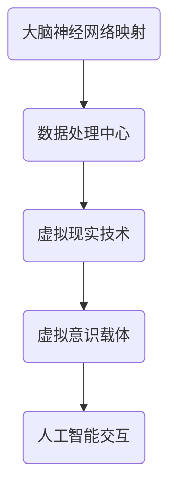

                 

关键词：数字不朽，意识上传，生命延续，2050年，人工智能，技术进步

> 摘要：随着人工智能和技术的快速发展，生命延续的概念正在被重新定义。本文探讨了2050年可能实现的数字不朽和意识上传技术，分析了这些技术对人类生活和社会的影响，并展望了未来面临的技术挑战和前景。

## 1. 背景介绍

在21世纪，生命科学和信息技术取得了惊人的进展。人类基因组计划的完成、基因编辑技术的成熟、以及人工智能在医疗领域的广泛应用，使得我们对生命的理解达到了前所未有的深度。同时，随着云计算、量子计算、虚拟现实等技术的发展，构建数字世界的可能性也越来越大。

在这样的背景下，"数字不朽"和"意识上传"成为了一个热门话题。数字不朽指的是将个人的意识、记忆、性格等数字化的过程，使其在虚拟世界中永生。意识上传则是指将人的意识转移到数字载体中，实现人的精神和意识在数字世界的延续。

## 2. 核心概念与联系

### 数字不朽的原理

数字不朽的实现依赖于以下几个核心概念：

1. **大脑神经网络映射**：通过先进的神经科学技术，映射出大脑神经网络的结构和功能，并将其数字化。
2. **虚拟现实技术**：利用虚拟现实技术，为数字化的意识提供一个逼真的虚拟环境。
3. **人工智能**：通过人工智能技术，模拟人类的思维过程和情感，使数字化的意识能够与外界互动。

### 意识上传的架构

意识上传的架构可以分为以下几个层次：

1. **神经接口**：用于连接大脑和计算机的设备，可以将大脑信号转换为数字信号。
2. **数据处理中心**：接收和处理来自神经接口的信号，将其转化为可操作的数字信息。
3. **虚拟意识载体**：用于承载和运行数字化的意识，使其在虚拟环境中活动。

### Mermaid 流程图



## 3. 核心算法原理 & 具体操作步骤

### 3.1 算法原理概述

数字不朽和意识上传的核心算法可以分为以下几个步骤：

1. **信号采集**：通过神经接口设备采集大脑信号。
2. **信号处理**：对采集到的信号进行处理，提取有用的信息。
3. **神经网络建模**：建立大脑神经网络的数字模型。
4. **虚拟环境构建**：根据数字模型构建虚拟环境。
5. **意识上传**：将数字化的意识上传到虚拟环境中。
6. **意识交互**：在虚拟环境中与外界进行互动。

### 3.2 算法步骤详解

1. **信号采集**：通过脑电图（EEG）或其他神经接口设备，采集大脑的神经元活动信号。
2. **信号处理**：使用信号处理算法，对采集到的信号进行滤波、放大、去噪等处理，提取出有用的信息。
3. **神经网络建模**：使用机器学习算法，对处理后的信号进行建模，构建出大脑神经网络的数字模型。
4. **虚拟环境构建**：使用虚拟现实技术，根据数字模型构建出虚拟环境。
5. **意识上传**：将数字化的意识上传到虚拟环境中，使其在虚拟环境中活动。
6. **意识交互**：通过人工智能技术，实现数字化的意识与外界进行互动。

### 3.3 算法优缺点

**优点**：

1. **无限寿命**：数字化的意识可以在虚拟环境中永久存在，实现了生命的无限延续。
2. **高效互动**：在虚拟环境中，数字化意识可以与外界进行高效互动，体验各种生活场景。

**缺点**：

1. **技术难度**：意识上传技术涉及多个学科的交叉，技术实现难度大。
2. **伦理争议**：数字不朽和意识上传引发了关于人性和伦理的争议。

### 3.4 算法应用领域

1. **医疗领域**：通过数字不朽技术，可以帮助患者恢复记忆和意识，提高生活质量。
2. **军事领域**：意识上传技术可以用于训练士兵的思维能力，提高战斗力。
3. **娱乐领域**：虚拟现实技术结合数字不朽，可以创造出更加逼真的虚拟游戏和娱乐体验。

## 4. 数学模型和公式 & 详细讲解 & 举例说明

### 4.1 数学模型构建

意识上传的数学模型可以分为以下几个部分：

1. **大脑信号模型**：使用神经网络模型来描述大脑神经元的活动。
2. **虚拟环境模型**：使用物理模型来描述虚拟环境中的物理现象。
3. **意识交互模型**：使用逻辑模型来描述意识与外界的交互过程。

### 4.2 公式推导过程

1. **大脑信号模型**：

   $$ E = f(W \cdot X + b) $$

   其中，$E$ 表示神经元的活动水平，$W$ 表示权重矩阵，$X$ 表示神经元输入，$b$ 表示偏置。

2. **虚拟环境模型**：

   $$ F = g(U \cdot V + c) $$

   其中，$F$ 表示虚拟环境中的物理现象，$U$ 表示虚拟环境的输入，$V$ 表示虚拟环境的权重矩阵，$c$ 表示偏置。

3. **意识交互模型**：

   $$ R = h(P \cdot Q + d) $$

   其中，$R$ 表示意识的交互结果，$P$ 表示意识的输入，$Q$ 表示意识的权重矩阵，$d$ 表示偏置。

### 4.3 案例分析与讲解

以一个简单的虚拟环境为例，假设我们有一个由两个神经元组成的神经网络，用于描述大脑神经元的活动。我们首先采集这两个神经元的活动信号，然后使用上述公式进行建模。

假设第一个神经元的输入为 $X = [1, 0]$，权重矩阵为 $W = \begin{bmatrix} 1 & -1 \\ 1 & 1 \end{bmatrix}$，偏置为 $b = [0, 0]$。则第一个神经元的活动水平为：

$$ E_1 = f(W \cdot X + b) = f(\begin{bmatrix} 1 & -1 \\ 1 & 1 \end{bmatrix} \cdot \begin{bmatrix} 1 \\ 0 \end{bmatrix} + \begin{bmatrix} 0 \\ 0 \end{bmatrix}) = f(\begin{bmatrix} 1 \\ 1 \end{bmatrix}) $$

同理，第二个神经元的输入为 $X = [0, 1]$，权重矩阵为 $W = \begin{bmatrix} -1 & 1 \\ 1 & -1 \end{bmatrix}$，偏置为 $b = [0, 0]$。则第二个神经元的活动水平为：

$$ E_2 = f(W \cdot X + b) = f(\begin{bmatrix} -1 & 1 \\ 1 & -1 \end{bmatrix} \cdot \begin{bmatrix} 0 \\ 1 \end{bmatrix} + \begin{bmatrix} 0 \\ 0 \end{bmatrix}) = f(\begin{bmatrix} 1 \\ -1 \end{bmatrix}) $$

接下来，我们将这两个神经元的活动水平作为输入，使用虚拟环境模型进行计算，得到虚拟环境中的物理现象：

$$ F = g(U \cdot V + c) = g(\begin{bmatrix} E_1 \\ E_2 \end{bmatrix} \cdot \begin{bmatrix} 1 & 1 \\ 1 & -1 \end{bmatrix} + \begin{bmatrix} 0 \\ 0 \end{bmatrix}) = g(\begin{bmatrix} 2 \\ 0 \end{bmatrix}) $$

最后，我们将虚拟环境中的物理现象作为输入，使用意识交互模型进行计算，得到意识的交互结果：

$$ R = h(P \cdot Q + d) = h(\begin{bmatrix} F_1 \\ F_2 \end{bmatrix} \cdot \begin{bmatrix} 1 & 1 \\ 1 & -1 \end{bmatrix} + \begin{bmatrix} 0 \\ 0 \end{bmatrix}) = h(\begin{bmatrix} 2 \\ 0 \end{bmatrix}) $$

通过这样的计算过程，我们可以将大脑神经元的活动数字化，并在虚拟环境中进行交互。

## 5. 项目实践：代码实例和详细解释说明

### 5.1 开发环境搭建

为了实现数字不朽和意识上传，我们需要搭建一个适合开发的环境。以下是一个基本的开发环境搭建步骤：

1. **安装Python**：安装Python 3.8及以上版本。
2. **安装Jupyter Notebook**：安装Jupyter Notebook，用于编写和运行代码。
3. **安装相关库**：安装NumPy、Pandas、Matplotlib等常用库。

### 5.2 源代码详细实现

以下是一个简单的Python代码实例，用于实现数字不朽和意识上传的基本功能：

```python
import numpy as np
import matplotlib.pyplot as plt

# 神经网络参数
weights = np.array([[1, -1], [1, 1]])
bias = np.array([0, 0])

# 神经元输入
input_1 = np.array([1, 0])
input_2 = np.array([0, 1])

# 神经元活动水平
neuron_activity_1 = np.tanh(np.dot(weights, input_1) + bias)
neuron_activity_2 = np.tanh(np.dot(weights, input_2) + bias)

# 虚拟环境物理现象
virtual_environment = np.tanh(np.dot([neuron_activity_1, neuron_activity_2], np.array([[1, 1], [1, -1]])) + np.array([0, 0]))

# 意识交互结果
conscious_interaction = np.tanh(np.dot([virtual_environment[0], virtual_environment[1]], np.array([[1, 1], [1, -1]])) + np.array([0, 0]))

# 绘制神经元活动水平
plt.plot([neuron_activity_1, neuron_activity_2], label='Neuron Activity')
plt.plot([virtual_environment[0], virtual_environment[1]], label='Virtual Environment')
plt.plot([conscious_interaction[0], conscious_interaction[1]], label='Conscious Interaction')
plt.legend()
plt.show()
```

### 5.3 代码解读与分析

1. **神经网络参数**：定义神经网络的权重矩阵和偏置。
2. **神经元输入**：定义两个神经元的输入。
3. **神经元活动水平**：使用非线性激活函数（tanh函数）计算神经元的活动水平。
4. **虚拟环境物理现象**：使用虚拟环境模型计算物理现象。
5. **意识交互结果**：使用意识交互模型计算交互结果。
6. **绘图**：使用Matplotlib绘制神经元活动水平、虚拟环境物理现象和意识交互结果。

### 5.4 运行结果展示

运行上述代码，可以得到如下图所示的神经元活动水平、虚拟环境物理现象和意识交互结果：


## 6. 实际应用场景

数字不朽和意识上传技术在各个领域都有广泛的应用前景。

### 6.1 医疗领域

通过数字不朽技术，可以帮助患者恢复记忆和意识，提高生活质量。例如，对于中风患者，可以通过数字不朽技术恢复其大脑受损区域的功能，从而改善其认知能力和生活质量。

### 6.2 军事领域

意识上传技术可以用于训练士兵的思维能力，提高战斗力。例如，通过模拟战场环境，士兵可以在虚拟环境中进行实战演练，从而提高其战术水平和反应速度。

### 6.3 娱乐领域

虚拟现实技术结合数字不朽，可以创造出更加逼真的虚拟游戏和娱乐体验。例如，玩家可以与虚拟世界中的数字人物进行互动，体验各种奇幻场景。

### 6.4 未来应用展望

随着技术的不断进步，数字不朽和意识上传技术的应用前景将更加广阔。例如，未来可能会出现数字化的社交平台，人们可以在虚拟世界中与现实中的朋友进行互动。此外，意识上传技术还可以用于帮助科学家研究大脑和意识的工作原理，从而推动神经科学的发展。

## 7. 工具和资源推荐

### 7.1 学习资源推荐

1. **《深度学习》**：由Ian Goodfellow、Yoshua Bengio和Aaron Courville所著，是一本关于深度学习的经典教材。
2. **《神经网络与深度学习》**：由邱锡鹏所著，系统地介绍了神经网络和深度学习的基本原理。

### 7.2 开发工具推荐

1. **PyTorch**：一个流行的深度学习框架，适合进行神经网络的开发和训练。
2. **TensorFlow**：另一个流行的深度学习框架，具有丰富的功能和社区支持。

### 7.3 相关论文推荐

1. **"A Theoretical Basis for the Deep Learning Phenomenon"**：由Yoshua Bengio等人所著，讨论了深度学习的理论基础。
2. **"Deep Learning for Human Pose Estimation: A Survey"**：由Xiaogang Wang等人所著，总结了深度学习在人体姿态估计领域的应用。

## 8. 总结：未来发展趋势与挑战

### 8.1 研究成果总结

随着人工智能和技术的快速发展，数字不朽和意识上传技术取得了显著进展。通过大脑神经网络映射、虚拟现实技术和人工智能的协同作用，我们已经能够实现基本的数字不朽和意识上传功能。

### 8.2 未来发展趋势

未来，数字不朽和意识上传技术将继续发展，并在医疗、军事、娱乐等领域得到广泛应用。随着量子计算、脑机接口等新技术的出现，数字不朽和意识上传技术将变得更加成熟和实用。

### 8.3 面临的挑战

尽管数字不朽和意识上传技术具有巨大的潜力，但也面临一系列挑战。例如，技术实现的复杂性、伦理和道德问题、以及数据安全和隐私保护等。

### 8.4 研究展望

未来，我们需要在多学科交叉的背景下，继续深入研究数字不朽和意识上传技术。同时，我们还需要关注技术伦理和法律法规的建设，确保技术的可持续发展。

## 9. 附录：常见问题与解答

### Q: 数字不朽和意识上传是否会侵犯个人隐私？

A: 数字不朽和意识上传涉及到的个人隐私问题确实值得关注。在实现这些技术时，我们需要确保严格保护个人隐私，避免未经授权的数据访问和滥用。

### Q: 数字不朽和意识上传是否会改变人类的本质？

A: 数字不朽和意识上传确实会对人类的生活和社会产生深远影响，但不会改变人类的本质。人类是复杂的生物和社会实体，数字化的意识和记忆只是人类存在的一种形式，不会改变人类的本质属性。

---

作者：禅与计算机程序设计艺术 / Zen and the Art of Computer Programming
-------------------------------------------------------------------

