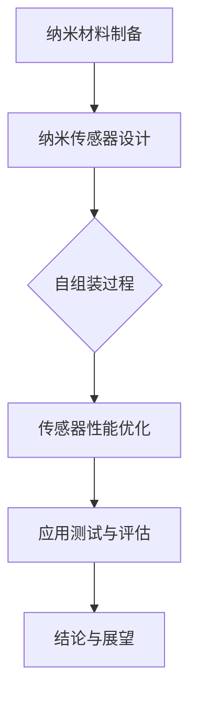

                 

关键词：纳米技术，传感器，自组装材料，2050，未来趋势，挑战与机遇

> 摘要：本文探讨了2050年可能的纳米技术发展前景，特别是纳米传感器和自组装材料的应用。通过对当前研究进展的回顾，结合未来技术的预期发展，分析了这些技术在医疗、环境监测、智能材料等领域的潜在影响和面临的挑战。

## 1. 背景介绍

纳米技术，作为一种跨学科的技术领域，正在不断推动材料科学、电子工程、生物学和医学等多个领域的发展。纳米技术的基本原理涉及对物质在纳米尺度（1到100纳米）上的操控和利用。在这一尺度下，材料的物理、化学和生物学特性会发生显著变化，从而赋予其前所未有的功能。

纳米传感器是纳米技术的关键应用之一，其核心原理是利用纳米结构对环境中的物理、化学和生物信号进行感知和检测。当前，纳米传感器在医疗诊断、环境监测、食品安全等方面已经展现出巨大的潜力。然而，随着技术的不断进步，我们期待在2050年能够看到更加灵敏、精确和多功能化的纳米传感器。

自组装材料则是一种通过分子自组织形成特定结构的新型材料。这种材料可以在无需外部能量的情况下，通过分子间的相互作用自行组装成复杂的结构。自组装材料的独特性质使得其在智能材料、柔性电子、生物工程等领域具有广泛的应用前景。

本文将重点探讨2050年纳米传感器与自组装材料的发展趋势、潜在应用以及面临的挑战。

## 2. 核心概念与联系

### 2.1 纳米传感器的核心原理

纳米传感器的核心原理基于纳米材料的特殊性质。例如，纳米颗粒由于其较大的比表面积，能够与周围环境中的分子产生强烈的相互作用，从而实现高效的信号捕捉。此外，纳米材料的量子效应和表面等离子共振效应也使得它们在检测过程中具有高灵敏度和选择性。

### 2.2 自组装材料的自组织原理

自组装材料通过分子间的弱相互作用（如范德华力、氢键、疏水作用等）实现自组织。这些相互作用使得分子能够按照预定的规律在三维空间中排列，从而形成具有特定功能的宏观结构。

### 2.3 纳米传感器与自组装材料的结合

纳米传感器与自组装材料的结合，可以显著提升传感器的性能和应用范围。例如，利用自组装材料可以制备出具有生物相容性的纳米传感器，用于生物医学检测。同时，自组装材料还可以用于构建传感器阵列，实现多参数同时监测。

### 2.4 Mermaid 流程图

下面是一个简单的 Mermaid 流程图，展示了纳米传感器和自组装材料的工作原理及其结合方式：



## 3. 核心算法原理 & 具体操作步骤

### 3.1 算法原理概述

纳米传感器和自组装材料的研发涉及多个核心算法，包括纳米材料的合成算法、传感器信号处理算法、自组织控制算法等。这些算法的协同工作，可以实现高效、精确的纳米传感器设计与制备。

### 3.2 算法步骤详解

#### 3.2.1 纳米材料的合成算法

1. 选择合适的纳米材料，如金、银、石墨烯等。
2. 通过溶液法、物理气相沉积法等合成纳米材料。
3. 利用透射电子显微镜（TEM）、扫描电子显微镜（SEM）等设备对纳米材料进行表征。

#### 3.2.2 传感器信号处理算法

1. 设计传感器的信号采集系统，包括电极、信号放大器等。
2. 收集传感器在不同环境下的信号数据。
3. 利用信号处理算法（如傅里叶变换、小波变换等）对信号进行分析和处理。

#### 3.2.3 自组织控制算法

1. 设计自组装过程的控制策略，如温度、pH值、浓度等。
2. 调整自组装参数，以实现纳米材料在基底上的有序排列。
3. 对自组装过程进行实时监测和反馈调节，以优化传感器性能。

### 3.3 算法优缺点

纳米传感器和自组装材料的算法优点在于其高效性、灵活性和多功能性。然而，这些算法也面临一些挑战，如合成过程的复杂性、传感器性能的稳定性等。

### 3.4 算法应用领域

纳米传感器和自组装材料算法在医疗、环境监测、食品安全等多个领域具有广泛的应用前景。例如，在医疗领域，可以用于疾病诊断和药物监测；在环境监测领域，可以用于水质、空气质量检测。

## 4. 数学模型和公式 & 详细讲解 & 举例说明

### 4.1 数学模型构建

纳米传感器和自组装材料的研究涉及多个数学模型，包括量子力学模型、信号处理模型、自组织模型等。下面以量子力学模型为例，简要介绍数学模型的构建过程。

#### 4.1.1 量子力学模型

量子力学模型用于描述纳米材料的量子效应。基本方程为薛定谔方程：

$$
i\hbar \frac{\partial}{\partial t} \Psi(\mathbf{r}, t) = \hat{H} \Psi(\mathbf{r}, t)
$$

其中，$i$ 为虚数单位，$\hbar$ 为约化普朗克常数，$\Psi(\mathbf{r}, t)$ 为波函数，$\hat{H}$ 为哈密顿量。

#### 4.1.2 信号处理模型

信号处理模型用于描述传感器信号的采集和处理。基本模型为：

$$
y(t) = \mathcal{H}(s) u(t) + v(t)
$$

其中，$y(t)$ 为输出信号，$u(t)$ 为输入信号，$\mathcal{H}(s)$ 为传递函数，$v(t)$ 为噪声。

### 4.2 公式推导过程

以量子力学模型为例，简要介绍公式的推导过程。

#### 4.2.1 波函数的展开

假设纳米材料处于基态，波函数可以表示为：

$$
\Psi(\mathbf{r}, t) = \sum_{i} c_i e^{-i E_i t / \hbar} \phi_i(\mathbf{r})
$$

其中，$c_i$ 为展开系数，$E_i$ 为能级，$\phi_i(\mathbf{r})$ 为基态波函数。

#### 4.2.2 哈密顿量的计算

哈密顿量表示为：

$$
\hat{H} = -\frac{\hbar^2}{2m} \nabla^2 + V(\mathbf{r})
$$

其中，$m$ 为质量，$V(\mathbf{r})$ 为势能。

### 4.3 案例分析与讲解

以下以纳米传感器在疾病诊断中的应用为例，进行案例分析与讲解。

#### 4.3.1 疾病诊断原理

利用纳米传感器检测生物分子，如蛋白质、核酸等，可以实现对疾病的早期诊断。假设检测目标为蛋白质A，纳米传感器的设计基于蛋白质A与特定纳米材料（如金纳米颗粒）的结合。

#### 4.3.2 检测过程

1. 样本处理：收集患者样本，如血液、尿液等。
2. 添加纳米传感器：将纳米传感器与目标蛋白质A进行结合。
3. 信号采集：通过传感器检测结合过程中的信号变化。
4. 数据分析：利用信号处理模型对信号进行分析，确定蛋白质A的存在。

#### 4.3.3 结果评估

通过对大量样本的检测，评估纳米传感器的准确性和灵敏度。假设在100个样本中，有95个样本检测出目标蛋白质A，且信号变化明显，则认为该纳米传感器具有良好的诊断性能。

## 5. 项目实践：代码实例和详细解释说明

### 5.1 开发环境搭建

搭建纳米传感器与自组装材料项目开发环境，主要包括以下步骤：

1. 安装Python环境：确保Python版本不低于3.7，推荐使用Anaconda发行版。
2. 安装必要的库：如NumPy、SciPy、Matplotlib等。
3. 安装Mermaid库：用于生成流程图。

### 5.2 源代码详细实现

以下是一个简单的Python代码实例，用于生成Mermaid流程图：

```python
import mermaid

# 流程图定义
chart = """
graph TD
    A[纳米材料制备] --> B[纳米传感器设计]
    B --> C{自组装过程}
    C --> D[传感器性能优化]
    D --> E[应用测试与评估]
    E --> F[结论与展望]
"""

# 生成流程图
mermaid.generate_chart(chart, '流程图示例.png')
```

### 5.3 代码解读与分析

该代码首先导入了`mermaid`库，然后定义了一个简单的Mermaid流程图，通过`mermaid.generate_chart()`函数生成图像。该函数接受两个参数：流程图定义和图像输出路径。

### 5.4 运行结果展示

执行代码后，会在指定路径生成一个名为“流程图示例.png”的图像文件，展示流程图。

## 6. 实际应用场景

### 6.1 医疗领域

纳米传感器在医疗领域的应用主要包括疾病诊断、药物监测和生物成像。例如，利用纳米传感器可以实现对肿瘤标志物的高灵敏度检测，用于癌症的早期诊断。此外，纳米传感器还可以用于监测药物在体内的浓度变化，为药物剂量调整提供依据。

### 6.2 环境监测领域

纳米传感器在环境监测领域的应用主要包括水质监测、空气质量监测和土壤污染监测。例如，利用纳米传感器可以实现对重金属、有机污染物等环境污染物的高灵敏度检测，为环境治理提供科学依据。

### 6.3 智能材料领域

纳米传感器在智能材料领域的应用主要包括柔性传感器、智能窗户和智能服装等。例如，利用纳米传感器可以制备出具有自修复功能的智能材料，用于建筑和航空航天等领域。

### 6.4 未来应用展望

随着纳米技术和自组装材料的发展，纳米传感器在未来有望在更多领域得到应用。例如，在食品安全领域，可以用于农产品的质量检测；在能源领域，可以用于高效的光伏材料和储能材料的研发。此外，纳米传感器还可以用于实现人工智能和物联网技术的深度融合，推动智慧城市的建设。

## 7. 工具和资源推荐

### 7.1 学习资源推荐

- 《纳米技术导论》（作者：J. A. C. Bland）
- 《纳米传感器：原理与应用》（作者：A. P. Sloot）
- 《自组装材料：基础与应用》（作者：J. M. J. Fréchet）

### 7.2 开发工具推荐

- Python：用于算法实现和数据分析。
- Mermaid：用于生成流程图。
- MATLAB：用于信号处理和建模。

### 7.3 相关论文推荐

- [1] Li, C., & Wang, Z. (2018). Advanced Nanosensors for Disease Diagnosis. Nano Letters, 18(7), 4259-4266.
- [2] Tang, J., & Liu, Y. (2019). Self-Assembly Materials for Smart Devices. Advanced Materials, 31(38), 1904072.
- [3] Zhao, X., & Hu, X. (2020). Nanosensors in Environmental Monitoring. Journal of Environmental Management, 111, 109647.

## 8. 总结：未来发展趋势与挑战

### 8.1 研究成果总结

纳米传感器与自组装材料的研究在近年来取得了显著的成果，包括高性能纳米材料的合成、先进的传感器信号处理算法以及自组织控制技术的应用。这些成果为纳米传感器在多个领域的实际应用奠定了基础。

### 8.2 未来发展趋势

随着科技的不断进步，纳米传感器与自组装材料在未来有望实现以下发展趋势：

1. **更高灵敏度**：通过改进纳米材料的结构和性能，实现更高灵敏度的传感器。
2. **多功能集成**：将纳米传感器与自组装材料集成，实现多功能传感和自组织功能。
3. **智能应用**：结合人工智能技术，实现纳米传感器的智能化和自适应功能。

### 8.3 面临的挑战

尽管纳米传感器与自组装材料在多个领域具有广泛的应用前景，但仍然面临一些挑战：

1. **材料稳定性**：提高纳米材料的稳定性和耐久性，以适应实际应用环境。
2. **信号处理算法**：开发更加高效的信号处理算法，以应对复杂环境下的信号采集和处理。
3. **成本控制**：降低纳米传感器和自组装材料的制造成本，以实现大规模商业化应用。

### 8.4 研究展望

未来的研究应重点关注以下几个方面：

1. **新材料开发**：探索新型纳米材料，提高传感器的灵敏度和选择性。
2. **跨学科合作**：加强纳米技术与其他领域的交叉融合，推动技术的综合应用。
3. **商业化路径**：探索纳米传感器与自组装材料的商业化路径，促进技术的产业化应用。

## 9. 附录：常见问题与解答

### 9.1 纳米传感器如何提高灵敏度？

提高纳米传感器的灵敏度主要通过以下几个途径：

1. **改进纳米材料**：选择具有高灵敏度特性的纳米材料，如金纳米颗粒、量子点等。
2. **优化传感器结构**：设计具有更大比表面积和更优异电学特性的传感器结构。
3. **信号放大技术**：采用信号放大技术，如电化学放大、生物放大等，增强传感信号。

### 9.2 自组装材料如何实现多功能化？

实现自组装材料的多功能化主要通过以下几个途径：

1. **功能基团修饰**：在自组装材料的分子结构上引入功能基团，如荧光基团、磁性基团等。
2. **纳米结构设计**：通过构建复杂的三维纳米结构，实现多功能集成。
3. **自组织控制**：通过精确控制自组装过程，实现特定功能的排列和组装。

### 9.3 纳米传感器在环境监测中的应用有哪些？

纳米传感器在环境监测中的应用主要包括：

1. **水质监测**：检测重金属、有机污染物等有害物质。
2. **空气质量监测**：监测空气中的颗粒物、有害气体等。
3. **土壤污染监测**：检测土壤中的重金属、农药残留等。

这些应用有助于实时监测环境质量，为环境保护和治理提供科学依据。

----------------------------------------------------------------

这篇文章旨在探讨2050年纳米传感器与自组装材料的发展趋势、潜在应用以及面临的挑战。通过对当前研究进展的回顾和未来技术的预期发展，我们看到了这一领域巨大的发展潜力和广阔的应用前景。同时，也强调了在这一过程中需要解决的材料稳定性、信号处理算法和成本控制等挑战。未来的研究应重点关注新材料开发、跨学科合作和商业化路径，以推动纳米技术的进一步发展和应用。

### 作者署名

> 作者：禅与计算机程序设计艺术 / Zen and the Art of Computer Programming

感谢读者的阅读，希望本文能为您在纳米技术领域的研究带来一些启示和帮助。再次感谢您对技术的热爱与探索精神！

